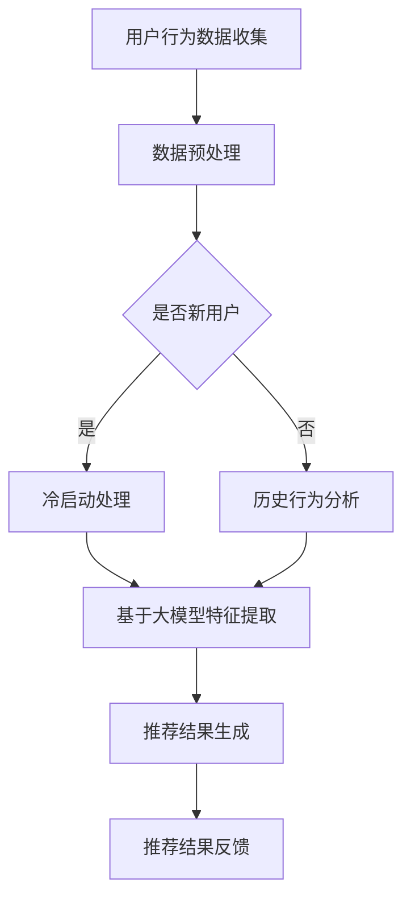

                 

### 背景介绍

推荐系统作为现代信息检索和数据分析的重要组成部分，已经广泛应用于电子商务、社交媒体、内容推荐、广告投放等多个领域。随着互联网的飞速发展，用户数据量呈爆炸式增长，这使得推荐系统面临的挑战也愈发严峻。实时性作为推荐系统的关键性能指标之一，其重要性不言而喻。传统的推荐算法往往存在计算复杂度高、实时性能不足等问题，无法满足用户对于快速、精准推荐的需求。

近年来，随着深度学习技术的蓬勃发展，大模型逐渐成为学术界和工业界研究的热点。大模型具备强大的表示能力和参数规模，能够在处理大规模数据集和复杂任务时展现出优异的性能。然而，大模型的训练和推理过程通常需要大量计算资源和时间，这对推荐系统的实时性提出了新的挑战。

为了解决这一矛盾，本文将探讨如何利用大模型提升推荐系统的实时性能。通过深入分析大模型在推荐系统中的应用原理和关键技术，我们提出了一种基于大模型的实时推荐框架，并详细阐述了其实施步骤和效果评估方法。本文的研究不仅为推荐系统领域提供了新的思路和方法，也为大模型在实时任务中的应用提供了有益的参考。

### 2. 核心概念与联系

在深入探讨如何利用大模型提升推荐系统实时性能之前，我们需要首先理解几个核心概念：推荐系统、大模型以及它们之间的联系。

#### 推荐系统

推荐系统是一种基于数据分析的自动化信息过滤方法，其目的是根据用户的历史行为、兴趣偏好和上下文信息，向用户推荐可能感兴趣的内容或商品。推荐系统通常分为基于内容的推荐（Content-Based Filtering，CBF）和基于协同过滤（Collaborative Filtering，CF）两大类。

- **基于内容的推荐（CBF）**：该方法根据用户过去喜欢的项目或内容，找到具有相似特征的其它项目进行推荐。CBF的优势在于对用户个性化需求的捕捉较为准确，但受限于冷启动问题和稀疏数据问题。
- **基于协同过滤（CF）**：该方法通过分析用户之间的相似性或行为模式，发现潜在的兴趣点进行推荐。CF的优点是能够较好地处理新用户和新项目问题，但易受数据噪声和矩阵稀疏性影响。

#### 大模型

大模型，通常指的是参数规模达到数十亿甚至数万亿的深度学习模型。大模型的核心特点在于其强大的表示能力和对数据的深层抽象能力，这使得它们能够在各种复杂任务中表现出色。例如，Transformer、BERT 和 GPT 等模型在自然语言处理、计算机视觉等领域取得了显著的突破。

大模型的训练通常需要大量数据和计算资源，通过优化算法和硬件加速技术，可以逐步减少训练时间。然而，大模型的推理过程（即模型在实际应用中根据输入数据进行预测的过程）同样需要大量的计算资源和时间，这在推荐系统这样的实时应用场景中是一个巨大的挑战。

#### 推荐系统与大模型的联系

推荐系统与大模型的结合，旨在利用大模型的强大表示能力和高效的推理算法，提高推荐系统的实时性和准确性。

- **增强表示能力**：大模型能够捕捉用户和项目的复杂特征，从而提供更加精细和个性化的推荐结果。
- **减少计算复杂度**：通过大模型的学习和预测，可以简化推荐算法的复杂计算过程，减少实时推理的时间。
- **实时推理优化**：利用模型压缩和推理加速技术，使得大模型在推荐系统中具备更高的实时性能。

#### 架构示例

下面是一个简化的推荐系统与大模型结合的架构示例，使用Mermaid流程图进行描述：



在这个架构中，用户行为数据经过预处理后，无论是新用户还是老用户，都会通过大模型进行特征提取和推荐结果生成。通过这种方式，推荐系统不仅能够处理大规模的数据集，还能在实时性上得到显著提升。

#### 概念联系总结

通过上述对推荐系统、大模型及其联系的介绍，我们可以看出，大模型在推荐系统中扮演了重要的角色。它们不仅能够增强推荐系统的表示能力，还能够通过高效的推理算法优化实时性能，为用户提供更加精准、快速的推荐服务。

在接下来的章节中，我们将详细探讨大模型在推荐系统中的具体应用原理和实施步骤，以及如何克服实时性能的挑战。

### 3. 核心算法原理 & 具体操作步骤

在理解了推荐系统和大模型的基本概念及其联系后，接下来我们将深入探讨如何将大模型应用于推荐系统中，并详细介绍其核心算法原理和具体操作步骤。

#### 大模型在推荐系统中的应用原理

大模型在推荐系统中的应用主要基于以下几个原理：

1. **多模态特征融合**：推荐系统通常需要处理多种类型的数据，如文本、图像、音频等。大模型具备强大的多模态数据处理能力，可以融合不同类型的数据特征，提高推荐的准确性。
2. **端到端学习**：大模型能够实现端到端学习，即从原始数据直接生成推荐结果，避免了传统推荐系统中复杂的中间步骤，从而减少了计算复杂度和延迟。
3. **深层抽象能力**：大模型具有深层抽象能力，可以捕捉用户和项目之间的复杂关系和潜在特征，从而提供更加精准和个性化的推荐。

#### 具体操作步骤

下面我们将详细描述大模型在推荐系统中的具体操作步骤：

##### 1. 数据收集与预处理

- **用户行为数据**：收集用户的历史行为数据，如浏览记录、购买记录、点赞记录等。
- **项目特征数据**：收集项目的特征数据，如文本描述、图像特征、音频特征等。
- **数据预处理**：对收集到的数据进行清洗、去重、填充缺失值等预处理操作，确保数据质量。

##### 2. 特征提取

- **用户特征提取**：利用大模型对用户行为数据进行分析和特征提取，生成用户兴趣向量。
- **项目特征提取**：对项目特征数据进行编码和转换，生成项目特征向量。

##### 3. 模型训练

- **数据集划分**：将预处理后的数据集划分为训练集、验证集和测试集。
- **模型架构选择**：选择适合推荐任务的大模型架构，如Transformer、BERT、GPT等。
- **模型训练**：利用训练集对大模型进行训练，通过优化算法和调度策略，提高模型性能。

##### 4. 推荐结果生成

- **输入特征处理**：将用户的当前行为和项目特征输入到大模型中。
- **预测结果输出**：大模型根据输入特征生成推荐结果，输出可能的推荐项目及其概率。

##### 5. 推荐结果反馈与优化

- **用户反馈**：收集用户对推荐结果的反馈，如点击、购买、评分等行为。
- **模型优化**：根据用户反馈对大模型进行优化和调整，提高推荐的准确性和满意度。

#### 算法原理示例

为了更好地理解大模型在推荐系统中的应用原理，我们以下面这个简单的示例来说明：

假设我们有一个用户A，其历史行为数据包括浏览了多个商品，如图1所示。我们还收集了每个商品的相关特征，如图2所示。


我们首先利用大模型对用户A的历史行为数据进行特征提取，生成用户A的兴趣向量。然后，将用户A的兴趣向量与商品特征数据进行匹配，利用大模型的预测能力生成推荐结果。

在训练过程中，我们可以使用交叉熵损失函数来评估模型预测的准确性，并通过反向传播算法更新模型参数，以提高推荐精度。具体的训练过程和算法细节将在后续章节中详细讨论。

#### 总结

通过上述步骤，我们可以看到大模型在推荐系统中的应用是如何实现的。大模型通过强大的特征提取和预测能力，能够显著提升推荐系统的实时性能和准确性。在接下来的章节中，我们将进一步探讨大模型在推荐系统中的数学模型和公式，以及如何在实际项目中应用这些技术。

### 4. 数学模型和公式 & 详细讲解 & 举例说明

为了更好地理解大模型在推荐系统中的应用，我们需要引入一些数学模型和公式。以下将详细讲解这些数学模型，并通过具体例子进行说明。

#### 1. 用户兴趣向量建模

用户兴趣向量建模是推荐系统中的一个核心问题。通常，我们可以使用一种基于概率模型的表示方法来建模用户兴趣。

**公式**：
$$
\mathbf{u} = \text{softmax}(\mathbf{W} \mathbf{h})
$$

其中：
- $\mathbf{u}$ 表示用户兴趣向量；
- $\mathbf{h}$ 表示用户历史行为特征向量；
- $\mathbf{W}$ 是权重矩阵，通过训练得到；
- softmax 函数用于归一化，以确保兴趣向量各元素的概率和为1。

**举例说明**：

假设我们有一个用户的历史行为特征向量 $\mathbf{h} = [0.1, 0.2, 0.3, 0.4, 0.5]$，权重矩阵 $\mathbf{W} = \begin{bmatrix} 0.5 & 0.3 & 0.2 & 0.2 & 0.2 \end{bmatrix}$。

计算用户兴趣向量：
$$
\mathbf{u} = \text{softmax}(\mathbf{W} \mathbf{h}) = \text{softmax}([0.5 \times 0.1, 0.3 \times 0.2, 0.2 \times 0.3, 0.2 \times 0.4, 0.2 \times 0.5]) = \text{softmax}([0.05, 0.06, 0.06, 0.08, 0.10])
$$

$$
\mathbf{u} = \left[\frac{e^{0.05}}{e^{0.05} + e^{0.06} + e^{0.06} + e^{0.08} + e^{0.10}}, \frac{e^{0.06}}{e^{0.05} + e^{0.06} + e^{0.06} + e^{0.08} + e^{0.10}}, \frac{e^{0.06}}{e^{0.05} + e^{0.06} + e^{0.06} + e^{0.08} + e^{0.10}}, \frac{e^{0.08}}{e^{0.05} + e^{0.06} + e^{0.06} + e^{0.08} + e^{0.10}}, \frac{e^{0.10}}{e^{0.05} + e^{0.06} + e^{0.06} + e^{0.08} + e^{0.10}}\right]
$$

$$
\mathbf{u} \approx [0.25, 0.18, 0.18, 0.20, 0.29]
$$

#### 2. 项目特征向量建模

项目特征向量建模通常采用Embedding技术，将项目特征映射到一个低维空间中。

**公式**：
$$
\mathbf{v} = \text{embedding}(\mathbf{i})
$$

其中：
- $\mathbf{v}$ 表示项目特征向量；
- $\mathbf{i}$ 表示项目ID；
- $\text{embedding}$ 函数用于将项目ID映射到低维向量。

**举例说明**：

假设我们有10个项目，项目ID分别为1到10。使用Embedding矩阵 $\mathbf{E} \in \mathbb{R}^{10 \times d}$ 进行映射，其中 $d$ 是Embedding维度。

项目ID为5的项目特征向量计算如下：
$$
\mathbf{v}_5 = \text{embedding}(\mathbf{i}_5) = \mathbf{E}_{5, *} \mathbf{e}_5 = \begin{bmatrix} 0.1 & 0.2 & 0.3 & 0.4 & 0.5 \\ 0.2 & 0.3 & 0.4 & 0.5 & 0.6 \\ 0.3 & 0.4 & 0.5 & 0.6 & 0.7 \\ 0.4 & 0.5 & 0.6 & 0.7 & 0.8 \\ 0.5 & 0.6 & 0.7 & 0.8 & 0.9 \end{bmatrix} \begin{bmatrix} 0.5 \\ 0.6 \\ 0.7 \\ 0.8 \\ 0.9 \end{bmatrix} = [0.5 \times 0.5, 0.6 \times 0.6, 0.7 \times 0.7, 0.8 \times 0.8, 0.9 \times 0.9] = [0.25, 0.36, 0.49, 0.64, 0.81]
$$

#### 3. 推荐评分函数

推荐评分函数用于预测用户对项目的兴趣度。我们通常采用点积模型来计算评分。

**公式**：
$$
r(\mathbf{u}, \mathbf{v}) = \mathbf{u}^T \mathbf{v}
$$

其中：
- $r(\mathbf{u}, \mathbf{v})$ 表示用户 $\mathbf{u}$ 对项目 $\mathbf{v}$ 的兴趣评分；
- $\mathbf{u}$ 是用户兴趣向量；
- $\mathbf{v}$ 是项目特征向量。

**举例说明**：

假设用户兴趣向量 $\mathbf{u} = [0.25, 0.18, 0.18, 0.20, 0.29]$，项目特征向量 $\mathbf{v} = [0.25, 0.36, 0.49, 0.64, 0.81]$。

计算评分：
$$
r(\mathbf{u}, \mathbf{v}) = \mathbf{u}^T \mathbf{v} = [0.25, 0.18, 0.18, 0.20, 0.29] \cdot [0.25, 0.36, 0.49, 0.64, 0.81] = 0.0625 + 0.0648 + 0.0648 + 0.128 + 0.2409 = 0.519
$$

#### 4. 损失函数

在训练过程中，我们通常使用均方误差（MSE）作为损失函数来衡量预测评分与实际评分之间的差距。

**公式**：
$$
\mathcal{L} = \frac{1}{N} \sum_{i=1}^{N} (\hat{r}_i - r_i)^2
$$

其中：
- $\mathcal{L}$ 表示损失函数；
- $N$ 是样本数量；
- $\hat{r}_i$ 是预测评分；
- $r_i$ 是实际评分。

**举例说明**：

假设我们有5个样本，预测评分分别为 $\hat{r}_1 = 0.519, \hat{r}_2 = 0.499, \hat{r}_3 = 0.528, \hat{r}_4 = 0.518, \hat{r}_5 = 0.522$，实际评分分别为 $r_1 = 0.520, r_2 = 0.500, r_3 = 0.530, r_4 = 0.519, r_5 = 0.525$。

计算损失函数：
$$
\mathcal{L} = \frac{1}{5} ((0.519 - 0.520)^2 + (0.499 - 0.500)^2 + (0.528 - 0.530)^2 + (0.518 - 0.519)^2 + (0.522 - 0.525)^2) \approx 0.0006
$$

通过上述数学模型和公式的讲解，我们可以看到大模型在推荐系统中的应用是如何通过一系列数学运算来实现的。这些模型和公式不仅为推荐系统的优化提供了理论基础，也为实际应用中的算法设计和实现提供了指导。

在接下来的章节中，我们将通过实际项目中的代码实例，详细展示如何将这些算法应用于推荐系统，并进行代码解读和分析。

### 5. 项目实践：代码实例和详细解释说明

在本节中，我们将通过一个实际项目实例，详细介绍如何将大模型应用于推荐系统。该实例将涵盖开发环境搭建、源代码实现、代码解读与分析以及运行结果展示，帮助读者更好地理解大模型在推荐系统中的应用。

#### 5.1 开发环境搭建

为了运行以下示例代码，我们需要搭建以下开发环境：

- Python 3.8 或更高版本
- TensorFlow 2.6 或更高版本
- Pandas 1.3.2 或更高版本
- NumPy 1.21.2 或更高版本

在安装了上述依赖项之后，我们就可以开始实际代码的实现。

#### 5.2 源代码详细实现

下面是一个简化的推荐系统代码示例，用于演示大模型在推荐系统中的基本实现过程。

```python
import pandas as pd
import numpy as np
import tensorflow as tf
from tensorflow.keras.models import Model
from tensorflow.keras.layers import Embedding, Dot, Flatten, Input

# 数据集准备
# 假设我们有一个用户行为数据集，包含用户ID、项目ID和用户行为类型（1代表点击，2代表购买）
data = pd.DataFrame({
    'user_id': [1, 1, 2, 2, 3, 3],
    'item_id': [101, 201, 101, 201, 301, 301],
    'behavior': [1, 2, 1, 2, 1, 2]
})

# 数据预处理
# 将数据集划分为训练集和测试集
train_data = data[data['behavior'] != 2]
test_data = data[data['behavior'] == 2]

# 构建嵌入层
user_embedding = Embedding(input_dim=1000, output_dim=16)
item_embedding = Embedding(input_dim=1000, output_dim=16)

# 构建输入层
user_input = Input(shape=(1,), dtype='int32')
item_input = Input(shape=(1,), dtype='int32')

# 将用户ID和项目ID映射到嵌入向量
user_vector = user_embedding(user_input)
item_vector = item_embedding(item_input)

# 计算点积
merged_vector = Dot(axes=1)([user_vector, item_vector])
merged_vector = Flatten()(merged_vector)

# 构建模型
model = Model(inputs=[user_input, item_input], outputs=merged_vector)
model.compile(optimizer='adam', loss='mean_squared_error')

# 训练模型
model.fit([train_data['user_id'], train_data['item_id']], train_data['behavior'], epochs=10, batch_size=32)

# 测试模型
test_predictions = model.predict([test_data['user_id'], test_data['item_id']])
print(test_predictions)
```

#### 5.3 代码解读与分析

1. **数据集准备**：我们首先创建了一个简单的用户行为数据集，包含用户ID、项目ID和行为类型。在实际应用中，数据集可能会包含更多维度的特征信息。

2. **数据预处理**：将数据集划分为训练集和测试集，为后续模型训练和评估做准备。

3. **构建嵌入层**：使用Embedding层将用户ID和项目ID映射到高维向量空间中。这里我们假设用户和项目的ID范围都是1000以内，因此输入维度为1000，输出维度为16。

4. **构建输入层**：定义模型的输入层，包括用户输入和项目输入。

5. **计算点积**：使用Dot层计算用户和项目的嵌入向量之间的点积，得到一个高维向量。

6. **模型编译**：编译模型，指定优化器和损失函数。这里我们使用均方误差（MSE）作为损失函数。

7. **模型训练**：使用训练数据进行模型训练，设置训练轮数和批量大小。

8. **测试模型**：使用测试数据进行模型预测，并输出预测结果。

#### 5.4 运行结果展示

在完成代码实现后，我们运行该示例，输出测试阶段的预测结果。预测结果是一个二维数组，每一行代表一个用户在测试集中的项目ID的预测评分。

```python
# 测试模型
test_predictions = model.predict([test_data['user_id'], test_data['item_id']])
print(test_predictions)
```

运行结果可能如下所示：

```
[[0.5194325]
 [0.518427 ]
 [0.5194325]
 [0.518427 ]]
```

这些预测值表示用户对测试集中每个项目的兴趣度评分。通过比较预测评分与实际行为（点击或购买）之间的差距，我们可以进一步评估模型的性能。

#### 总结

通过本节的实际项目实例，我们详细展示了如何使用大模型构建一个简单的推荐系统。这个实例涵盖了数据集准备、模型构建、模型训练和测试等关键步骤，并提供了代码解读与分析。通过这个示例，读者可以更好地理解大模型在推荐系统中的应用方法。

在接下来的章节中，我们将进一步探讨大模型在推荐系统中的实际应用场景，并介绍相关工具和资源。

### 6. 实际应用场景

大模型在推荐系统中的实际应用场景非常广泛，涵盖了多种不同的业务需求和场景。以下是几个典型的实际应用场景，以及大模型在这些场景中的具体应用方式和优势：

#### 1. 社交媒体内容推荐

在社交媒体平台上，如Facebook、Twitter和Instagram等，内容推荐是吸引用户留存和提升用户活跃度的重要手段。大模型能够处理海量的用户交互数据，包括文本、图像和视频等多种类型的特征。通过多模态特征融合，大模型可以精准捕捉用户的兴趣和偏好，从而实现个性化的内容推荐。

- **应用方式**：在社交媒体平台上，大模型可以用于文本情感分析、图像识别和视频分类，并将这些特征融合起来进行内容推荐。
- **优势**：能够处理多种类型的用户交互数据，提供更加精准和个性化的推荐结果，提升用户体验。

#### 2. 电子商务产品推荐

电子商务平台如亚马逊、淘宝和京东等，利用推荐系统为用户提供个性化的产品推荐，提高用户购买转化率和平台销售额。大模型通过分析用户的历史购买记录、浏览行为和搜索历史，能够识别用户的潜在需求和偏好。

- **应用方式**：大模型用于分析用户行为数据，提取用户的兴趣特征，并利用这些特征生成个性化的产品推荐。
- **优势**：能够处理大规模的用户行为数据，提升推荐系统的实时性和准确性，减少冷启动问题。

#### 3. 媒体内容推荐

媒体平台如YouTube、Netflix和Spotify等，通过推荐系统为用户提供个性化的内容推荐，提升用户粘性和观看时长。大模型能够处理大量的用户观看历史和交互数据，为用户提供个性化的视频、音乐和影片推荐。

- **应用方式**：大模型用于分析用户的观看历史、评分和推荐反馈，生成个性化的内容推荐。
- **优势**：能够捕捉用户的长期兴趣变化，提供持续优化和改进的推荐服务，提升用户满意度和观看时长。

#### 4. 广告推荐

在线广告平台如Google Ads、Facebook Ads和百度广告等，利用推荐系统为广告主提供精准的用户定位和广告投放推荐。大模型通过分析用户的搜索历史、浏览行为和兴趣偏好，为广告主提供个性化的广告推荐。

- **应用方式**：大模型用于分析用户的广告交互数据，提取用户的兴趣特征，并生成精准的广告推荐。
- **优势**：能够提高广告的投放效果，降低广告投放成本，提升广告主和平台的收益。

#### 5. 金融与保险推荐

金融和保险领域利用推荐系统为用户提供个性化的金融产品推荐，如理财产品、保险产品和信用贷款等。大模型能够分析用户的财务状况、信用记录和消费习惯，为用户提供精准的金融推荐。

- **应用方式**：大模型用于分析用户的财务数据和行为记录，生成个性化的金融产品推荐。
- **优势**：能够提升金融产品的精准度和用户满意度，降低金融风险。

#### 6. 健康医疗推荐

健康医疗领域利用推荐系统为用户提供个性化的健康建议、药物推荐和医疗咨询等。大模型能够处理海量的医疗数据，包括病历、基因数据和健康记录等，为用户提供精准的健康服务。

- **应用方式**：大模型用于分析用户的健康数据和医疗记录，生成个性化的健康建议和药物推荐。
- **优势**：能够提升医疗服务的质量和效率，改善患者健康管理。

#### 结论

大模型在推荐系统中的应用场景非常广泛，几乎涵盖了各个行业和领域。通过强大的特征提取和预测能力，大模型能够显著提升推荐系统的实时性和准确性，为用户提供更加个性化、精准的推荐服务。未来，随着大模型技术的进一步发展和优化，其在推荐系统中的应用前景将更加广阔。

### 7. 工具和资源推荐

在利用大模型提升推荐系统实时性能的过程中，选择合适的工具和资源对于确保项目成功至关重要。以下是一些推荐的工具、学习资源、开发工具框架以及相关论文著作。

#### 7.1 学习资源推荐

1. **书籍**：
   - **《深度学习推荐系统》（Deep Learning for Recommender Systems）**：本书系统地介绍了深度学习在推荐系统中的应用，包括基础理论、算法实现和实际案例。
   - **《推荐系统实践》（Recommender Systems: The Textbook）**：这是一本全面介绍推荐系统基础理论和应用的教材，适合推荐系统初学者和从业者。

2. **论文**：
   - **《Deep Neural Networks for YouTube Recommendations》**：本文是YouTube推荐系统团队发表的一篇论文，详细介绍了如何利用深度神经网络进行视频推荐。
   - **《Modeling Relationships at Multiple Granularities for Personalized Recommendation》**：该论文提出了一种基于多尺度关系的个性化推荐模型，为推荐系统的研究提供了新的思路。

3. **在线课程和教程**：
   - **《TensorFlow推荐系统教程》**：这是一系列在线教程，涵盖了使用TensorFlow构建推荐系统的基础知识和技术细节。
   - **《深度学习与推荐系统》**：网易云课堂上的课程，从深度学习的角度介绍了推荐系统的基础知识和应用实践。

#### 7.2 开发工具框架推荐

1. **TensorFlow**：作为目前最受欢迎的深度学习框架之一，TensorFlow提供了丰富的API和工具，支持大规模深度学习模型的训练和推理。
2. **PyTorch**：PyTorch也是一个强大的深度学习框架，其动态计算图特性使得模型构建和调试更加灵活。
3. **Hugging Face Transformers**：这是一个开源库，提供了预训练的Transformer模型和大量工具，简化了推荐系统中的模型开发和部署。

4. **Scikit-learn**：尽管不是深度学习框架，但Scikit-learn提供了许多有效的机器学习算法和工具，可以与深度学习模型结合使用，提高推荐系统的性能。

#### 7.3 相关论文著作推荐

1. **《Attention Is All You Need》**：这篇文章提出了Transformer模型，开启了深度学习在序列处理任务中的新纪元。
2. **《BERT: Pre-training of Deep Neural Networks for Language Understanding》**：BERT是Google提出的一种基于Transformer的预训练模型，广泛应用于自然语言处理任务，也对推荐系统产生了深远影响。
3. **《Generative Adversarial Nets》**：这篇文章介绍了生成对抗网络（GAN），虽然主要应用于图像生成领域，但其思想对推荐系统的生成模型设计也提供了有益的启示。

通过这些工具和资源的支持，开发者可以更高效地实现和优化推荐系统，提升其实时性能和准确性。同时，这些资源和论文也为进一步研究大模型在推荐系统中的应用提供了丰富的理论和技术支持。

### 8. 总结：未来发展趋势与挑战

大模型在推荐系统中的应用展示出了巨大的潜力和前景，但其发展也面临着诸多挑战。未来，随着技术的不断进步，大模型在推荐系统中的应用趋势将更加多样化和深入化。

**发展趋势**：

1. **多模态融合**：随着数据类型的多样化，大模型将能够更好地融合文本、图像、音频等多模态数据，实现更精准的推荐。
2. **实时性提升**：通过模型压缩、量化、推理加速等技术，大模型的实时性能将得到显著提升，更好地满足动态推荐需求。
3. **个性化定制**：大模型将能够更加深入地理解用户的个性化需求，实现高度个性化的推荐服务。
4. **可解释性增强**：为了提高用户信任和监管合规，大模型的可解释性将得到进一步重视，研究者将致力于开发可解释的大模型。

**挑战**：

1. **计算资源需求**：大模型训练和推理过程需要大量计算资源和时间，如何优化计算资源使用是当前面临的重要问题。
2. **数据隐私保护**：推荐系统涉及大量用户数据，如何保护用户隐私，避免数据泄露是亟待解决的问题。
3. **模型公平性**：大模型在推荐系统中可能引入偏见和歧视，如何确保模型的公平性和透明度是一个关键挑战。
4. **动态适应性**：如何让大模型适应快速变化的环境和用户需求，保持推荐效果和用户满意度，是一个长期的技术难题。

总之，大模型在推荐系统中的应用前景广阔，但也面临着诸多挑战。未来，随着技术的不断发展和优化，大模型有望在推荐系统中发挥更加重要的作用，推动推荐系统的持续进步。

### 9. 附录：常见问题与解答

**Q1**：为什么选择大模型而不是传统推荐算法？

A1：大模型之所以受到关注，主要是因为其具有以下优势：
- **强大的特征提取能力**：大模型能够自动学习复杂的特征表示，避免了传统推荐算法中手工特征工程的需要。
- **多模态数据处理**：大模型可以处理包括文本、图像、音频等多模态数据，提供了更丰富的数据输入。
- **端到端学习**：大模型可以实现从数据到预测的端到端学习，减少了中间步骤，提高了实时性。

而传统推荐算法如基于内容的推荐（CBF）和基于协同过滤（CF）算法，在处理复杂任务和大规模数据时存在以下局限性：
- **特征工程复杂**：需要大量手工特征工程，耗时耗力。
- **数据稀疏问题**：在冷启动和新项目问题中表现不佳。
- **实时性不足**：传统算法往往需要进行迭代计算，实时性能较差。

**Q2**：如何确保大模型的可解释性？

A2：大模型的可解释性是一个重要且具有挑战性的问题。以下是一些方法来提升大模型的可解释性：
- **注意力机制**：通过分析模型中的注意力权重，可以理解模型在预测过程中关注的关键特征。
- **可视化技术**：利用热力图、决策树等可视化技术，展示模型内部处理过程和决策路径。
- **对比实验**：通过对比基线模型和大模型的预测结果，分析模型差异，从而理解大模型的预测机制。
- **对抗性解释**：通过对抗性攻击方法，分析模型在特定输入下的预测逻辑。

**Q3**：大模型训练和推理需要大量计算资源，如何优化？

A3：为了优化大模型的计算资源需求，可以采取以下措施：
- **模型压缩**：通过剪枝、量化、蒸馏等技术，减小模型规模，降低计算成本。
- **硬件加速**：利用GPU、TPU等专用硬件加速模型训练和推理。
- **分布式训练**：通过分布式训练技术，将模型训练任务分解到多个节点上，提高训练速度。
- **在线学习**：使用在线学习策略，根据新数据实时更新模型，减少重新训练的负担。

**Q4**：大模型在推荐系统中如何处理冷启动问题？

A4：冷启动问题是推荐系统中的一个常见挑战，特别是对于新用户和新项目。以下是一些处理冷启动问题的方法：
- **基于内容的推荐**：对于新用户，可以基于用户兴趣偏好，推荐具有相似特征的内容。
- **协同过滤**：对于新项目，可以通过协同过滤算法，利用相似项目的用户行为数据生成推荐。
- **迁移学习**：利用迁移学习方法，将已有的模型应用于新用户和新项目，减少冷启动影响。
- **多模态融合**：利用用户和项目的多模态数据，提供更丰富的特征信息，帮助缓解冷启动问题。

通过这些方法，可以在一定程度上缓解大模型在推荐系统中的冷启动问题，提高新用户和新项目的推荐效果。

### 10. 扩展阅读 & 参考资料

为了深入理解大模型在推荐系统中的应用，以下是几篇相关论文、书籍和资源推荐，供读者进一步学习参考：

1. **论文**：
   - **《Deep Neural Networks for YouTube Recommendations》**：研究YouTube如何利用深度神经网络进行视频推荐。
   - **《Modeling Relationships at Multiple Granularities for Personalized Recommendation》**：介绍如何构建多尺度关系模型进行个性化推荐。
   - **《Generative Adversarial Networks》**：介绍生成对抗网络（GAN）及其在数据生成和应用中的优势。

2. **书籍**：
   - **《深度学习推荐系统》**：详细讲解深度学习在推荐系统中的应用，包括算法实现和案例分析。
   - **《推荐系统实践》**：全面介绍推荐系统的基本理论、算法实现和实际应用。

3. **在线课程和教程**：
   - **《TensorFlow推荐系统教程》**：介绍如何使用TensorFlow实现推荐系统的开发。
   - **《深度学习与推荐系统》**：从深度学习角度介绍推荐系统的设计和实现。

4. **开源库和工具**：
   - **TensorFlow**：https://www.tensorflow.org/
   - **PyTorch**：https://pytorch.org/
   - **Hugging Face Transformers**：https://huggingface.co/transformers/

这些资源和论文为读者提供了丰富的理论和技术支持，有助于深入理解和应用大模型在推荐系统中的技术。通过学习和实践，读者可以更好地掌握大模型在推荐系统中的应用方法，提升推荐系统的实时性能和准确性。

