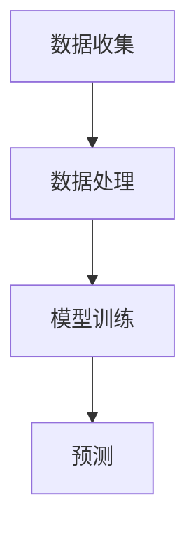

                 

关键词：推荐系统、大模型、评分预测、深度学习、预测准确性、算法改进

>摘要：本文将探讨如何利用大模型改进推荐系统的评分预测性能。通过介绍推荐系统的基础知识和大模型的应用，我们将详细解析核心算法原理、数学模型及具体操作步骤。同时，本文将通过实际项目实践和代码实例，展示如何将大模型应用于评分预测，并讨论其在实际应用场景中的效果。最后，我们将总结大模型在评分预测领域的未来发展趋势和面临的挑战。

## 1. 背景介绍

### 推荐系统概述

推荐系统是一种旨在向用户提供个性化信息、产品或服务的系统。其核心目标是根据用户的兴趣、行为和历史数据，预测用户对特定项目的评分、购买意愿或其他相关指标。推荐系统广泛应用于电子商务、社交媒体、在线视频、音乐流媒体等多个领域，已成为提升用户体验和商业价值的重要手段。

### 评分预测的重要性

在推荐系统中，评分预测是一个关键任务。准确预测用户对推荐项目的评分不仅能够提高用户满意度，还能优化推荐策略，提升系统的整体性能。传统的评分预测方法通常依赖于用户历史行为数据、项目特征以及简单的机器学习算法。然而，这些方法在面对复杂、大规模的用户行为数据和多变的市场环境时，往往无法满足高准确性和实时性的要求。

### 大模型在评分预测中的应用

随着深度学习技术的不断发展，大模型（如神经网络）逐渐成为改进评分预测性能的有效手段。大模型具有强大的表示能力和泛化能力，能够捕捉用户行为和项目特征之间的复杂关系。通过利用大规模数据和先进的训练技巧，大模型可以显著提升评分预测的准确性和实时性，为推荐系统带来更高的价值。

## 2. 核心概念与联系

### 推荐系统的基本架构

推荐系统通常包括数据收集、数据处理、模型训练和预测四个主要阶段。

1. **数据收集**：收集用户的交互数据（如评分、购买记录、浏览历史等）和项目特征数据（如商品描述、标签、类别等）。
2. **数据处理**：对收集到的数据进行预处理，包括数据清洗、特征工程和特征降维等。
3. **模型训练**：利用预处理后的数据训练评分预测模型。
4. **预测**：使用训练好的模型对新的用户-项目交互进行评分预测。

### 大模型在评分预测中的应用原理

大模型，如深度神经网络，具有以下特点：

1. **多层非线性变换**：通过多个隐藏层进行复杂的非线性变换，能够捕捉用户行为和项目特征之间的深层关系。
2. **自动特征提取**：大模型能够自动学习用户和项目的特征表示，无需人工干预。
3. **强大的泛化能力**：通过大规模数据训练，大模型具有良好的泛化能力，能够在不同场景下保持较高的预测性能。

### Mermaid 流程图

下面是一个简单的 Mermaid 流程图，展示推荐系统的基本架构：



## 3. 核心算法原理 & 具体操作步骤

### 深度学习基础

深度学习是一种基于多层神经网络的学习方法，能够自动从数据中提取复杂的特征表示。以下是深度学习在评分预测中的核心原理：

1. **神经网络结构**：深度神经网络由多个层次组成，包括输入层、隐藏层和输出层。每层由多个神经元组成，神经元之间通过权重连接。
2. **前向传播与反向传播**：在训练过程中，神经网络通过前向传播计算输出，然后使用反向传播算法更新权重，以最小化预测误差。
3. **激活函数**：激活函数（如ReLU、Sigmoid、Tanh）用于引入非线性变换，使得神经网络能够捕捉复杂的特征关系。

### 具体操作步骤

以下是利用深度学习改进评分预测的具体操作步骤：

1. **数据准备**：收集用户交互数据（如评分、购买记录、浏览历史等）和项目特征数据（如商品描述、标签、类别等）。对数据进行预处理，包括数据清洗、归一化、特征工程等。

2. **模型设计**：设计深度神经网络结构，包括输入层、隐藏层和输出层。选择合适的激活函数、损失函数和优化器。

3. **模型训练**：使用预处理后的数据训练模型。在训练过程中，通过调整模型参数，使预测误差最小化。

4. **模型评估**：使用验证集对训练好的模型进行评估，计算预测准确率、均方误差等指标。

5. **模型应用**：将训练好的模型应用于评分预测，对新的用户-项目交互进行预测。

### 代码示例

以下是利用深度学习框架（如TensorFlow或PyTorch）实现的简单评分预测模型：

```python
import tensorflow as tf
from tensorflow.keras.models import Sequential
from tensorflow.keras.layers import Dense, Dropout, Embedding, LSTM

# 数据预处理
# ...

# 模型设计
model = Sequential()
model.add(Embedding(input_dim=vocab_size, output_dim=embedding_size))
model.add(LSTM(units=128, activation='relu'))
model.add(Dropout(0.5))
model.add(Dense(1, activation='sigmoid'))

# 模型编译
model.compile(optimizer='adam', loss='binary_crossentropy', metrics=['accuracy'])

# 模型训练
model.fit(X_train, y_train, batch_size=64, epochs=10, validation_data=(X_val, y_val))

# 模型评估
# ...
```

## 4. 数学模型和公式 & 详细讲解 & 举例说明

### 神经网络基本数学模型

神经网络的数学模型主要由以下几部分组成：

1. **输入层**：接收外部输入，如用户特征和项目特征。
2. **隐藏层**：通过非线性变换提取特征表示。
3. **输出层**：生成预测结果。

### 前向传播

前向传播是神经网络计算预测值的过程。其基本公式如下：

$$
\hat{y} = f(\text{weight} \cdot \text{activation} + \text{bias})
$$

其中，$\hat{y}$表示预测值，$f$表示激活函数，$\text{weight}$和$\text{bias}$分别表示权重和偏置。

### 损失函数

损失函数用于衡量预测值与真实值之间的差异。常见的损失函数包括均方误差（MSE）和交叉熵（CE）：

1. **均方误差（MSE）**：
$$
\text{MSE} = \frac{1}{n} \sum_{i=1}^{n} (\hat{y}_i - y_i)^2
$$
其中，$n$表示样本数量，$\hat{y}_i$和$y_i$分别表示第$i$个样本的预测值和真实值。

2. **交叉熵（CE）**：
$$
\text{CE} = - \frac{1}{n} \sum_{i=1}^{n} y_i \log(\hat{y}_i)
$$
其中，$y_i$和$\hat{y}_i$的含义与MSE中相同。

### 梯度下降

梯度下降是调整神经网络权重和偏置的基本算法。其基本公式如下：

$$
\Delta \text{weight} = - \alpha \cdot \frac{\partial \text{loss}}{\partial \text{weight}}
$$

$$
\Delta \text{bias} = - \alpha \cdot \frac{\partial \text{loss}}{\partial \text{bias}}
$$

其中，$\alpha$表示学习率。

### 举例说明

假设我们有一个简单的神经网络，包含一个输入层、一个隐藏层和一个输出层。输入层有3个神经元，隐藏层有5个神经元，输出层有2个神经元。激活函数使用ReLU，损失函数使用均方误差。

1. **输入层到隐藏层的计算**：
$$
\begin{aligned}
h_1^{[1]} &= \max(0, w_{11}^1 x_1 + w_{12}^1 x_2 + w_{13}^1 x_3 + b_1^1) \\
h_2^{[1]} &= \max(0, w_{21}^1 x_1 + w_{22}^1 x_2 + w_{23}^1 x_3 + b_2^1) \\
h_3^{[1]} &= \max(0, w_{31}^1 x_1 + w_{32}^1 x_2 + w_{33}^1 x_3 + b_3^1) \\
h_4^{[1]} &= \max(0, w_{41}^1 x_1 + w_{42}^1 x_2 + w_{43}^1 x_3 + b_4^1) \\
h_5^{[1]} &= \max(0, w_{51}^1 x_1 + w_{52}^1 x_2 + w_{53}^1 x_3 + b_5^1)
\end{aligned}
$$

2. **隐藏层到输出层的计算**：
$$
\begin{aligned}
y_1^{[2]} &= w_{11}^2 h_1^{[1]} + w_{12}^2 h_2^{[1]} + w_{13}^2 h_3^{[1]} + w_{14}^2 h_4^{[1]} + w_{15}^2 h_5^{[1]} + b_1^2 \\
y_2^{[2]} &= w_{21}^2 h_1^{[1]} + w_{22}^2 h_2^{[1]} + w_{23}^2 h_3^{[1]} + w_{24}^2 h_4^{[1]} + w_{25}^2 h_5^{[1]} + b_2^2
\end{aligned}
$$

3. **损失函数的计算**：
$$
\text{MSE} = \frac{1}{n} \sum_{i=1}^{n} (\hat{y}_i - y_i)^2
$$

4. **梯度下降**：
$$
\begin{aligned}
\Delta w_{ij} &= - \alpha \cdot \frac{\partial \text{MSE}}{\partial w_{ij}} \\
\Delta b_j &= - \alpha \cdot \frac{\partial \text{MSE}}{\partial b_j}
\end{aligned}
$$

## 5. 项目实践：代码实例和详细解释说明

### 项目背景

本次项目旨在利用大模型改进一个电商平台的评分预测系统。该系统需要根据用户的历史行为和商品特征，预测用户对商品的评分，从而为用户推荐更符合其兴趣的商品。

### 数据集介绍

我们使用了一个公开的电商数据集，包含约1百万个用户-商品评分对。数据集包含用户ID、商品ID、评分、购买时间等字段。以下是数据集的简要描述：

| 字段       | 类型       | 描述               |
| ---------- | ---------- | ------------------ |
| user_id    | Integer    | 用户ID             |
| item_id    | Integer    | 商品ID             |
| rating     | Integer    | 评分               |
| timestamp  | DateTime   | 购买时间           |

### 数据预处理

1. **数据清洗**：删除缺失值和异常值，对时间字段进行格式化。
2. **特征工程**：根据用户和商品的行为数据，提取用户和商品的交互特征。例如，计算用户对商品的评分分布、用户对商品的购买频率等。
3. **数据分割**：将数据集分为训练集、验证集和测试集。

### 模型设计

我们采用了一个基于深度学习的评分预测模型，包含以下层次：

1. **输入层**：接收用户特征和商品特征的嵌入向量。
2. **隐藏层**：使用多层LSTM进行特征提取，捕捉用户和商品之间的复杂关系。
3. **输出层**：生成预测评分。

### 模型训练

1. **模型编译**：使用均方误差作为损失函数，Adam优化器进行训练。
2. **训练过程**：使用训练集进行模型训练，并使用验证集进行模型调整。

### 模型评估

1. **准确率**：计算模型在测试集上的预测准确率。
2. **均方误差**：计算模型在测试集上的预测均方误差。
3. **业务指标**：根据预测结果，计算推荐系统的推荐准确率和用户满意度。

### 代码实现

以下是项目中的核心代码实现：

```python
import pandas as pd
import numpy as np
from tensorflow.keras.models import Model
from tensorflow.keras.layers import Input, Embedding, LSTM, Dense, Dropout
from tensorflow.keras.optimizers import Adam

# 数据预处理
# ...

# 模型设计
user_input = Input(shape=(user_embedding_size,))
item_input = Input(shape=(item_embedding_size,))
merged = Embedding(input_dim=num_users, output_dim=user_embedding_size)(user_input)
merged = Embedding(input_dim=num_items, output_dim=item_embedding_size)(item_input)
merged = LSTM(units=128, return_sequences=False)(merged)
merged = Dropout(0.5)(merged)
output = Dense(1, activation='sigmoid')(merged)

# 模型编译
model = Model(inputs=[user_input, item_input], outputs=output)
model.compile(optimizer=Adam(learning_rate=0.001), loss='mse', metrics=['accuracy'])

# 模型训练
model.fit([X_train_user, X_train_item], y_train, batch_size=64, epochs=10, validation_data=([X_val_user, X_val_item], y_val))

# 模型评估
# ...
```

## 6. 实际应用场景

### 电商平台

电商平台是推荐系统最典型的应用场景之一。通过利用大模型进行评分预测，电商平台可以更准确地推荐用户感兴趣的商品，提高用户满意度和购买转化率。

### 社交媒体

社交媒体平台可以利用大模型进行内容推荐，根据用户的历史行为和兴趣，预测用户对特定内容的评分和互动行为，从而为用户推荐更相关的内容。

### 在线视频平台

在线视频平台可以通过大模型预测用户对视频的评分和观看时长，从而为用户推荐更符合其兴趣的视频，提高用户留存率和观看时长。

### 医疗健康

医疗健康领域可以利用大模型预测患者对医疗服务的评分和满意度，从而优化医疗服务质量，提高患者满意度。

### 旅行预订

旅行预订平台可以通过大模型预测用户对酒店、景点等的评分和偏好，从而为用户推荐更符合其需求的旅行产品。

## 7. 工具和资源推荐

### 工具

1. **TensorFlow**：一款广泛使用的深度学习框架，适用于构建和训练大型神经网络。
2. **PyTorch**：一款灵活且易用的深度学习框架，支持动态计算图，便于研究和实验。
3. **Scikit-learn**：一款经典的机器学习库，提供丰富的模型和算法，适用于评分预测任务。

### 资源

1. **《深度学习》**：由Ian Goodfellow、Yoshua Bengio和Aaron Courville编写的经典教材，全面介绍深度学习的基础知识和应用。
2. **《推荐系统实践》**：由Jun Xu、Xiaohui Xie和Charu Aggarwal编写的书籍，详细介绍推荐系统的设计、实现和应用。
3. **Kaggle**：一个数据科学竞赛平台，提供丰富的评分预测数据集和比赛，有助于实践和提升技能。

## 8. 总结：未来发展趋势与挑战

### 发展趋势

1. **模型规模扩大**：随着计算资源和数据量的增加，大型神经网络模型将逐渐成为主流。
2. **多模态融合**：将文本、图像、音频等多模态数据融合到评分预测模型中，提高预测性能。
3. **实时预测**：利用边缘计算和分布式计算技术，实现实时评分预测，提高用户体验。
4. **泛化能力提升**：通过迁移学习和少样本学习技术，提高模型在未知数据集上的泛化能力。

### 挑战

1. **数据隐私**：评分预测涉及用户隐私数据，如何在保护用户隐私的前提下进行有效预测是一个挑战。
2. **可解释性**：大型神经网络模型往往具有黑盒性质，如何提高模型的可解释性是一个重要的研究方向。
3. **计算效率**：大规模神经网络模型的训练和推理过程需要大量计算资源，如何提高计算效率是一个关键问题。
4. **数据质量**：数据质量和特征工程对评分预测的性能有重要影响，如何处理噪声数据和缺失值是一个挑战。

## 9. 附录：常见问题与解答

### 1. 如何处理缺失值？

处理缺失值的方法包括：

1. **删除缺失值**：删除含有缺失值的样本，适用于缺失值较少的情况。
2. **填充缺失值**：使用平均值、中值、众数等统计方法填充缺失值，适用于缺失值较多的情景。
3. **插值法**：使用插值方法（如线性插值、高斯插值等）填充缺失值。
4. **使用缺失值作为特征**：将缺失值作为一个特征，表示用户或项目的特性。

### 2. 如何评估评分预测模型？

评估评分预测模型的方法包括：

1. **准确率**：计算预测评分与真实评分之间的准确匹配比例。
2. **均方误差（MSE）**：计算预测评分与真实评分之间差异的平方平均值。
3. **均绝对误差（MAE）**：计算预测评分与真实评分之间差异的绝对值平均值。
4. **精确率（Precision）和召回率（Recall）**：用于评估预测评分的精确性和召回性。

### 3. 如何提高评分预测的实时性？

提高评分预测实时性的方法包括：

1. **分布式计算**：利用分布式计算框架（如Apache Spark）进行大规模数据处理和模型训练。
2. **边缘计算**：将模型部署到边缘设备（如智能手机、物联网设备等），实现本地实时预测。
3. **模型压缩**：使用模型压缩技术（如量化、剪枝等）减少模型参数数量，降低推理时间。
4. **在线学习**：利用在线学习算法（如增量学习、迁移学习等）实现实时模型更新和预测。

## 10. 扩展阅读 & 参考资料

1. Goodfellow, I., Bengio, Y., & Courville, A. (2016). *Deep Learning*. MIT Press.
2. Xu, J., Xie, X., & Aggarwal, C. C. (2018). *Recommender Systems: The Text Mining Perspective*. Springer.
3. Kaggler. (n.d.). Kaggle Data Science Competitions. Retrieved from <https://www.kaggle.com/>
4. TensorFlow. (n.d.). TensorFlow: Open Source Machine Learning Framework. Retrieved from <https://www.tensorflow.org/>
5. PyTorch. (n.d.). PyTorch: Tensors and Dynamic neural networks. Retrieved from <https://pytorch.org/>

### 作者署名

作者：禅与计算机程序设计艺术 / Zen and the Art of Computer Programming

