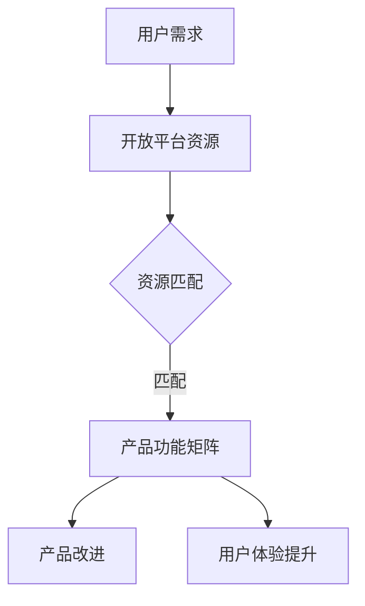

                 

关键词：开放平台，产品功能扩展，API接口，开发框架，云服务，功能模块，集成与定制，用户体验，跨平台开发，技术栈优化。

> 摘要：本文将探讨如何通过利用开放平台来扩展产品功能矩阵，从核心概念与联系、核心算法原理、数学模型与公式、项目实践、实际应用场景等多个角度，提供一套系统化的解决方案，以提升产品的竞争力。

## 1. 背景介绍

在现代信息化社会中，产品的竞争力不仅体现在其核心功能上，还在于其功能的扩展性和灵活性。随着技术的飞速发展，尤其是云计算、大数据、人工智能等技术的普及，开放平台如雨后春笋般涌现，为企业提供了丰富的资源和技术支持，使得产品功能的扩展变得更加容易和高效。

开放平台，通常是指提供API接口、SDK（软件开发工具包）、数据库、云服务等一系列资源的平台，旨在帮助开发者快速搭建和扩展应用功能。这些平台不仅提供了丰富的工具和资源，还通过开放生态，实现了开发者、企业、用户的多方共赢。

产品功能矩阵，是指一个产品在功能上的全面展示，包括核心功能、附加功能、扩展功能等。一个完善的功能矩阵可以显著提升产品的竞争力和用户满意度。

本文旨在探讨如何利用开放平台来扩展产品功能矩阵，从而提升产品的整体性能和市场竞争力。文章将围绕以下几个核心问题展开：

1. 如何理解开放平台与产品功能矩阵之间的关系？
2. 开放平台如何支持产品功能的扩展？
3. 如何设计并实现一个有效的功能扩展方案？
4. 实际项目中如何应用和优化开放平台来扩展功能？

## 2. 核心概念与联系

### 开放平台的定义与分类

开放平台通常指那些为了促进第三方开发者和用户互动，提供了API（应用程序编程接口）、SDK（软件开发工具包）、云服务、数据库等资源和技术支持的平台。根据平台的特性，开放平台可以分为以下几类：

- **云计算平台**：如亚马逊AWS、微软Azure、阿里云等，提供计算资源、存储、数据库、AI服务等。
- **API市场**：如Google API、Restful API、Facebook API等，提供各种业务的API接口。
- **第三方开发平台**：如微信小程序、支付宝小程序等，提供完整的开发框架和生态系统。

### 产品功能矩阵的概念

产品功能矩阵是对产品功能的一种结构化描述，通常包括以下几种类型的功能：

- **核心功能**：产品最基本的功能，是产品竞争力的核心。
- **附加功能**：增强用户体验的功能，如个性化设置、数据分析等。
- **扩展功能**：通过第三方平台或开发者的扩展包来实现的功能。

### 开放平台与产品功能矩阵的关联

开放平台与产品功能矩阵之间的关系可以理解为：

- **开放平台提供资源**：通过提供API接口、SDK、云服务等，开放平台为产品的功能扩展提供了基础资源。
- **产品功能矩阵利用资源**：产品通过集成这些资源，实现功能的扩展和增强。
- **用户需求驱动**：用户的需求是产品功能矩阵扩展的驱动力，开放平台提供的资源可以满足这些需求，从而提升用户体验。

### Mermaid 流程图

下面是一个简单的Mermaid流程图，描述了开放平台与产品功能矩阵的关联关系：



## 3. 核心算法原理 & 具体操作步骤

### API接口集成

开放平台的一个重要特性是提供API接口，开发者可以通过这些接口来访问平台提供的各种功能和服务。具体操作步骤如下：

1. **注册账号并获取API密钥**：在开放平台注册账号，并获取API密钥。
2. **了解API文档**：阅读并理解API文档，包括接口描述、参数、请求/响应格式等。
3. **集成API接口**：使用编程语言（如Python、JavaScript等）集成API接口，通常通过HTTP请求发送数据。

### SDK集成

SDK（Software Development Kit）是一套开发工具集，可以帮助开发者快速集成第三方平台的功能。具体操作步骤如下：

1. **下载SDK**：从开放平台下载SDK。
2. **安装SDK**：根据文档说明安装SDK。
3. **集成SDK**：将SDK集成到项目中，通常包括引入SDK库、配置SDK参数等。
4. **调用SDK功能**：在代码中调用SDK提供的功能接口。

### 云服务集成

云服务提供了丰富的计算、存储、数据库等资源，开发者可以通过云服务来扩展产品的功能。具体操作步骤如下：

1. **选择云服务**：根据产品需求选择合适的云服务。
2. **创建云服务实例**：在云平台上创建服务实例。
3. **配置服务**：配置服务参数，如数据库连接信息、访问权限等。
4. **调用云服务**：通过API或SDK调用云服务提供的功能。

### 功能扩展方案设计

功能扩展方案的设计是利用开放平台资源的关键步骤，具体操作步骤如下：

1. **需求分析**：分析用户需求，确定需要扩展的功能。
2. **资源评估**：评估开放平台提供的资源，确定可以使用的接口和服务。
3. **方案设计**：设计功能扩展的具体方案，包括接口调用、数据处理、错误处理等。
4. **实施与测试**：实施扩展方案，并进行功能测试和性能测试。
5. **部署上线**：将扩展的功能部署到生产环境，并进行上线。

### 算法原理

利用开放平台扩展产品功能的核心算法原理在于接口调用和数据处理的流程。具体来说：

1. **接口调用**：通过API接口或SDK接口调用开放平台提供的功能。
2. **数据处理**：接收并处理开放平台返回的数据，将其整合到产品中。
3. **错误处理**：处理接口调用过程中的错误，确保功能的稳定性。

## 4. 数学模型和公式 & 详细讲解 & 举例说明

在利用开放平台扩展产品功能的过程中，数学模型和公式起着重要的作用，尤其是在数据处理、性能分析和算法优化等方面。以下是几个关键数学模型和公式的详细讲解及举例说明。

### 数据处理模型

数据处理模型通常涉及数据的采集、清洗、转换和加载等步骤。以下是数据处理的基本公式：

$$
\text{处理数据量} = \text{采集数据量} \times \text{清洗率} \times \text{转换率}
$$

- **采集数据量**：指从开放平台或外部源收集到的原始数据量。
- **清洗率**：指通过数据清洗去除无效、错误数据的比例。
- **转换率**：指将原始数据转换为产品所需数据格式的比例。

**举例说明**：一个产品需要从第三方API接口获取用户数据，接口每天提供1TB的数据。经过清洗和转换后，有90%的数据符合要求。因此，每天实际可用于产品处理的数据量为：

$$
\text{处理数据量} = 1TB \times 0.9 \times 0.9 = 0.81TB
$$

### 性能分析模型

性能分析模型用于评估产品的响应速度和处理能力。常见的性能分析模型包括：

- **响应时间模型**：

$$
\text{响应时间} = \frac{\text{数据处理时间}}{\text{请求次数}}
$$

- **吞吐量模型**：

$$
\text{吞吐量} = \frac{\text{处理数据量}}{\text{响应时间}}
$$

**举例说明**：一个产品每天处理100万次请求，每次请求的平均数据处理时间为2秒。那么，该产品的响应时间为：

$$
\text{响应时间} = \frac{2秒}{100万次} = 0.00002秒
$$

吞吐量为：

$$
\text{吞吐量} = \frac{100万次 \times 0.00002秒}{1秒} = 20000次/秒
$$

### 算法优化模型

算法优化模型用于提高产品的数据处理效率和性能。常见的算法优化模型包括：

- **并行处理模型**：

$$
\text{优化效率} = \frac{\text{并行处理数据量}}{\text{串行处理数据量}}
$$

- **负载均衡模型**：

$$
\text{均衡效率} = \frac{\text{平均处理时间}}{\text{最长处理时间}}
$$

**举例说明**：一个产品采用并行处理模型，可以同时处理1000个数据处理任务。如果采用串行处理模型，需要1000秒才能完成相同的数据处理任务。那么，并行处理模型的优化效率为：

$$
\text{优化效率} = \frac{1000}{1000} = 1
$$

负载均衡模型可以用于评估分布式系统中的负载均衡效果。假设一个分布式系统有10个节点，其中某个节点的处理时间最长为10秒，而其他节点的处理时间均为1秒。那么，该系统的负载均衡效率为：

$$
\text{均衡效率} = \frac{1秒}{10秒} = 0.1
$$

## 5. 项目实践：代码实例和详细解释说明

### 项目背景

假设我们正在开发一款社交电商平台，该平台需要集成第三方支付、物流、社交分享等功能，以提升用户体验和平台竞争力。下面是具体的代码实例和详细解释说明。

### 第三方支付集成

#### 1. 注册账号并获取API密钥

```python
# 注册账号并获取API密钥
api_key = "your_api_key"
```

#### 2. 了解API文档

```python
# 请求第三方支付API文档
response = requests.get("https://api.paymentprovider.com/docs")
print(response.text)
```

#### 3. 集成API接口

```python
# 引入第三方支付API库
import payment_api

# 初始化API客户端
client = payment_api.Client(api_key)

# 创建支付请求
request = payment_api.PaymentRequest(
    amount=100.0,
    currency="USD",
    description="Purchase Product A"
)

# 发送支付请求
response = client.create_payment(request)
print(response)
```

### 社交分享集成

#### 1. 下载SDK

```bash
# 下载微信分享SDK
wget https://res.wx.qq.com/open/libs/weui/1.0.0/weui.min.js
```

#### 2. 引入SDK

```html
<!-- 引入微信分享SDK -->
<script src="weui.min.js"></script>
```

#### 3. 调用SDK功能

```javascript
// 调用微信分享功能
weui.share({
    title: "这是一个分享示例",
    desc: "这是一个分享描述",
    link: "https://yourwebsite.com",
    imgUrl: "https://yourwebsite.com/image.jpg"
});
```

### 物流信息查询

#### 1. 选择物流服务

```python
# 选择物流服务提供商
logistics_provider = "logistics_provider_name"
```

#### 2. 创建物流查询请求

```python
# 引入物流API库
import logistics_api

# 初始化物流API客户端
client = logistics_api.Client(logistics_provider)

# 创建物流查询请求
request = logistics_api.LogisticsRequest(
    tracking_number="your_tracking_number"
)

# 发送物流查询请求
response = client.get_tracking_info(request)
print(response)
```

### 功能扩展方案

#### 1. 需求分析

```python
# 分析用户需求
user需求的列表
```

#### 2. 资源评估

```python
# 评估开放平台资源
可用的API接口列表
```

#### 3. 方案设计

```python
# 设计功能扩展方案
功能扩展方案文档
```

#### 4. 实施与测试

```python
# 实施扩展方案
代码实现
```

#### 5. 部署上线

```python
# 部署扩展功能
部署脚本
```

### 代码实例总结

以上代码实例展示了如何利用开放平台集成第三方支付、社交分享和物流信息查询等功能。通过调用API接口、集成SDK和云服务，我们可以快速扩展产品的功能，提升用户体验。

## 6. 实际应用场景

### 社交电商应用

社交电商平台通过集成第三方支付、物流和社交分享功能，可以显著提升用户体验和平台竞争力。例如，用户可以在社交平台上分享商品，好友通过分享链接直接购买商品，从而实现社交化的购物体验。

### 企业应用集成

企业应用可以通过集成第三方服务，如CRM系统、ERP系统等，实现业务流程的自动化和一体化。例如，企业可以通过集成物流API，实时跟踪订单状态，提高物流管理效率。

### 个人项目开发

个人开发者可以利用开放平台快速搭建原型和应用，例如，通过集成地图API和天气API，开发一款旅游助手应用，为用户提供实时天气和路线规划服务。

### 教育与培训平台

教育平台可以通过集成在线支付、视频会议和社交互动等功能，提供更加丰富和互动的教学体验。例如，学生可以通过社交分享功能，分享学习笔记和心得，促进学生之间的互动和学习。

### 医疗健康应用

医疗健康应用可以通过集成电子病历、预约挂号和在线咨询等功能，提供便捷的医疗服务。例如，用户可以通过预约挂号API，在线预约医生就诊，提高医疗服务的效率。

## 7. 工具和资源推荐

### 开发框架

- **Django**：一款流行的Python Web框架，适用于快速开发。
- **Spring Boot**：一款流行的Java框架，适用于构建企业级应用。

### 云服务提供商

- **亚马逊AWS**：提供全面的云服务，适用于各种规模的企业。
- **微软Azure**：提供强大的云计算和人工智能服务。
- **阿里云**：提供全面的云服务和大数据解决方案。

### API市场

- **Google API**：提供丰富的API接口，适用于多种应用场景。
- **RESTful API**：提供标准的RESTful API接口，适用于各种开发需求。
- **微信开放平台**：提供丰富的API接口，适用于微信小程序开发。

### 开源工具

- **Mermaid**：用于绘制流程图和图表的Markdown插件。
- **Jenkins**：用于自动化构建和部署的开源工具。

## 8. 总结：未来发展趋势与挑战

### 发展趋势

1. **云原生应用的普及**：随着云计算技术的成熟，越来越多的应用将采用云原生架构，提高应用的可扩展性和弹性。
2. **API经济的兴起**：开放平台的API接口将成为企业之间合作和竞争的重要资源，API经济的潜力将不断释放。
3. **AI与开放平台的融合**：人工智能技术将与开放平台深度融合，为产品功能扩展带来新的可能性。

### 挑战

1. **安全性问题**：随着开放平台的普及，数据安全和隐私保护将成为重要的挑战。
2. **兼容性问题**：不同平台和接口之间的兼容性可能带来技术上的挑战。
3. **开发者技能要求**：开发者需要不断学习新的技术和框架，以应对不断变化的需求。

## 9. 附录：常见问题与解答

### 1. 开放平台有哪些类型？

开放平台可以分为云计算平台、API市场、第三方开发平台等类型。

### 2. 如何确保开放平台的安全性？

确保开放平台的安全性需要采取以下措施：

- **使用安全的API密钥**：保护API密钥不被泄露。
- **HTTPS传输**：使用HTTPS加密传输数据。
- **访问控制**：设置合理的访问控制策略，限制对API的访问。

### 3. 如何评估开放平台的资源？

评估开放平台的资源可以从以下几个方面进行：

- **API接口的丰富性**：检查提供的API接口是否满足需求。
- **文档的完整性**：查看API文档的完整性和易读性。
- **性能和稳定性**：评估平台的性能和稳定性，通过压测等方式验证。

### 4. 开发者如何快速上手开放平台？

开发者可以通过以下方式快速上手开放平台：

- **阅读文档**：仔细阅读开放平台的文档，了解接口和服务的使用方法。
- **编写测试代码**：通过编写测试代码，实践API接口的使用。
- **参加培训**：参加开放平台提供的培训课程，学习最佳实践。

## 10. 扩展阅读 & 参考资料

### 书籍推荐

- 《云原生应用架构指南》
- 《API设计指南》
- 《Django Web开发教程》

### 文章推荐

- "API Economy: Unlocking the Potential of Open APIs"
- "How to Choose the Right Cloud Service Provider"
- "Building a Cloud-Native Application"

### 网络资源

- "AWS Developer Guide"
- "Microsoft Azure Documentation"
- "Google Cloud Platform Documentation"

---

**作者：禅与计算机程序设计艺术 / Zen and the Art of Computer Programming** 

本文由“禅与计算机程序设计艺术”撰写，旨在为开发者提供一套利用开放平台扩展产品功能矩阵的系统化解决方案，以提升产品的竞争力。文章涵盖了开放平台的定义、产品功能矩阵的概念、API接口集成、SDK集成、云服务集成、功能扩展方案设计等多个方面，并通过实际项目实践和数学模型解释，为读者提供了实用的指导和深刻的思考。希望本文能为您的开发工作带来新的启示和帮助。

