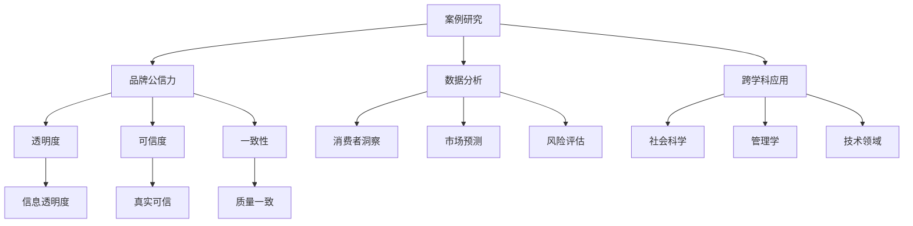
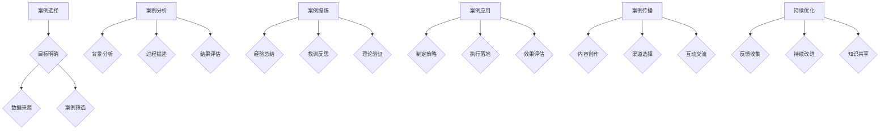

                 

### 背景介绍

在当今数字化时代，数据已经成为企业最宝贵的资产之一。企业通过各种渠道收集到大量的数据，这些数据包含了用户的个人信息、交易记录、搜索行为等。如何有效地利用这些数据来提升品牌公信力，已成为市场营销和业务发展的关键问题。

品牌公信力是指消费者对企业品牌信任和信赖的程度。它对于企业的长期发展至关重要。一个有公信力的品牌更容易获得消费者的忠诚度和推荐，从而在激烈的市场竞争中脱颖而出。然而，传统的营销手段已经难以满足现代消费者对个性化和真实性的需求，因此，企业需要寻找新的方法来强化品牌公信力。

本文将探讨如何利用案例研究来强化品牌公信力。案例研究是一种通过深入研究具体案例来分析问题、总结经验和提出解决方案的研究方法。通过案例研究，企业可以揭示成功或失败的原因，从而为其他企业提供宝贵的借鉴和启示。

案例研究在品牌公信力提升中的作用主要体现在以下几个方面：

1. **增强可信度**：案例研究基于真实的企业数据和经验，能够为消费者提供更有说服力的证据，从而增强品牌的可信度。
2. **提高透明度**：通过案例研究，企业可以公开分享其业务实践和决策过程，提高透明度，减少信息不对称，增加消费者的信任。
3. **树立榜样**：成功的案例研究可以展示企业在特定领域的专业能力和成功经验，为其他企业树立榜样，提升整个行业的标准和公信力。
4. **驱动创新**：通过分析案例，企业可以发现行业中的问题和新机遇，从而推动创新和改进。

接下来，我们将进一步探讨案例研究的核心概念与联系，深入分析其原理和操作步骤，并结合实际项目实践进行详细讲解。通过这些内容，读者将能够全面了解如何利用案例研究来强化品牌公信力。

## 1. 核心概念与联系

在深入探讨如何利用案例研究强化品牌公信力之前，首先需要理解几个核心概念，并分析它们之间的联系。以下是几个关键概念及其相互关系：

### 1.1 案例研究

案例研究是一种深入调查特定案例的研究方法，旨在通过详细分析案例的背景、过程和结果，从中提取出具有普遍意义的经验教训。在品牌公信力的提升中，案例研究可以通过以下方式发挥作用：

- **深入挖掘**：案例研究能够帮助企业深入挖掘品牌运营中的成功经验和失败教训，为其他业务决策提供参考。
- **具体化**：通过具体案例，品牌能够将抽象的理论和策略具体化，使消费者更容易理解和信任。
- **实证支持**：案例研究提供具体的数据和实际案例，增加了品牌声明和承诺的可信度。

### 1.2 品牌公信力

品牌公信力是指消费者对品牌信任和信赖的程度。它不仅影响消费者的购买决策，还影响品牌的长期发展和市场地位。品牌公信力的核心要素包括：

- **透明度**：品牌公开其业务实践和决策过程，提高信息透明度。
- **可信度**：品牌提供真实可信的信息和数据，增强消费者的信任。
- **一致性**：品牌在产品和服务上保持一致的质量和体验，建立长期的信任关系。

### 1.3 数据分析

数据分析是案例研究的重要组成部分，通过分析大量的数据，企业可以揭示消费者行为、市场趋势和业务表现的关键特征。数据分析在强化品牌公信力中的作用包括：

- **消费者洞察**：通过分析消费者行为数据，企业能够更好地理解消费者的需求和偏好，从而提供更加个性化的服务和产品。
- **市场预测**：通过对市场数据的分析，企业可以预测未来的市场趋势和变化，及时调整策略以保持竞争力。
- **风险评估**：数据分析有助于企业识别潜在的风险和问题，采取预防措施，减少不良事件的发生。

### 1.4 跨学科应用

案例研究不仅仅局限于市场营销和品牌管理，还可以跨学科应用。例如：

- **社会科学**：案例研究在社会学、心理学等领域中用于探讨人类行为和社会现象。
- **管理学**：案例研究为企业管理提供具体的策略和操作方法。
- **技术领域**：案例研究可以用于技术创新和产品开发，通过分析成功案例，企业可以找到优化产品和服务的途径。

### Mermaid 流程图

以下是一个简化的 Mermaid 流程图，展示了核心概念之间的联系：



通过这个流程图，我们可以看到案例研究、品牌公信力、数据分析和跨学科应用之间的紧密联系。案例研究为品牌公信力的提升提供了具体的方法和工具，而数据分析则为案例研究提供了实证支持，跨学科应用则进一步扩展了案例研究的应用范围。

在下一部分，我们将深入探讨案例研究的核心算法原理和具体操作步骤，帮助读者更好地理解如何通过案例研究来强化品牌公信力。

## 2. 核心算法原理 & 具体操作步骤

在了解了案例研究、品牌公信力以及数据分析等核心概念之后，接下来我们将深入探讨案例研究的核心算法原理，并详细描述具体操作步骤。通过这些步骤，企业可以有效地利用案例研究来提升品牌公信力。

### 2.1 案例选择

选择合适的案例是案例研究成功的关键。以下是几个关键步骤：

1. **目标明确**：首先，企业需要明确研究目标，例如了解消费者行为、市场趋势或产品开发经验等。
2. **数据来源**：确定数据来源，可以是企业内部的数据，如销售记录、客户反馈等，也可以是外部数据，如市场调查报告、行业研究等。
3. **案例筛选**：根据研究目标和数据来源，筛选出具有代表性和研究价值的案例。

### 2.2 案例分析

案例分析是案例研究的核心步骤，包括以下几个关键环节：

1. **背景分析**：深入了解案例的背景，包括市场环境、竞争态势、政策法规等。
2. **过程描述**：详细描述案例的运作过程，包括决策过程、实施步骤、关键节点等。
3. **结果评估**：评估案例的结果，包括成功或失败的原因、关键影响因素等。

### 2.3 案例提炼

在分析案例的过程中，需要提炼出具有普遍意义的经验和教训。以下是几个关键步骤：

1. **经验总结**：从成功案例中总结出有效的策略和方法，如营销策略、产品开发流程等。
2. **教训反思**：从失败案例中反思存在的问题和改进措施，如风险管理、团队协作等。
3. **理论验证**：将案例中的经验和教训与相关的理论进行对比和验证，确保其科学性和实用性。

### 2.4 案例应用

将提炼出的经验和教训应用于实际业务中，以提升品牌公信力。以下是几个关键步骤：

1. **制定策略**：根据案例研究的结果，制定具体的业务策略和行动计划。
2. **执行落地**：确保策略和计划的执行和落地，通过监控和评估，及时调整和优化。
3. **效果评估**：定期评估策略和计划的效果，包括消费者反馈、市场表现等。

### 2.5 案例传播

通过有效的传播手段，将案例研究成果传播给目标受众，以提升品牌公信力。以下是几个关键步骤：

1. **内容创作**：创作高质量的案例研究内容，包括报告、博客、视频等。
2. **渠道选择**：选择合适的传播渠道，如社交媒体、行业论坛、官方网站等。
3. **互动交流**：与目标受众进行互动和交流，回答问题和反馈，提升品牌知名度和影响力。

### 2.6 持续优化

案例研究不是一次性的工作，而是一个持续优化的过程。以下是几个关键步骤：

1. **反馈收集**：定期收集用户反馈，了解案例研究的应用效果和用户需求。
2. **持续改进**：根据反馈和新的市场变化，持续优化案例研究和应用策略。
3. **知识共享**：在企业内部和行业内进行知识共享，推动案例研究的不断发展和完善。

### 示例流程图

以下是一个简化的 Mermaid 流程图，展示了案例研究的核心算法原理和具体操作步骤：



通过这个流程图，我们可以清晰地看到案例研究的整个操作流程，从案例选择到案例传播，再到持续优化，每一步都是提升品牌公信力的关键环节。

在下一部分，我们将探讨数学模型和公式，以及如何通过详细讲解和举例说明来进一步理解案例研究的应用。

## 3. 数学模型和公式 & 详细讲解 & 举例说明

案例研究在品牌公信力提升中的应用不仅依赖于经验和直觉，还需要借助数学模型和公式来进行分析和验证。在这一部分，我们将详细讲解案例研究的数学模型和公式，并通过具体例子来说明其应用。

### 3.1 基本概念

在案例研究中，我们通常需要考虑以下几个基本概念：

- **置信度**（Confidence）：指消费者对品牌信任的程度。
- **重要性**（Importance）：指案例研究中的某个因素对品牌公信力的影响程度。
- **显著性**（Significance）：指案例研究结果的显著性和有效性。

### 3.2 数学模型

以下是一个简单的案例研究数学模型，用于评估品牌公信力：

\[ C = f(I, S, D) \]

其中：

- \( C \)：品牌公信力得分。
- \( I \)：重要性得分，反映消费者对品牌的信任程度。
- \( S \)：显著性得分，反映案例研究的结果显著性。
- \( D \)：数据得分，反映案例研究的数据质量。

#### 3.2.1 重要性得分 \( I \)

重要性得分可以通过以下公式计算：

\[ I = \frac{\sum_{i=1}^{n} w_i \cdot i}{n} \]

其中：

- \( w_i \)：第 \( i \) 个因素的权重。
- \( i \)：第 \( i \) 个因素的得分。

#### 3.2.2 显著性得分 \( S \)

显著性得分可以通过以下公式计算：

\[ S = \frac{\sum_{i=1}^{n} s_i}{n} \]

其中：

- \( s_i \)：第 \( i \) 个案例的显著性得分。

#### 3.2.3 数据得分 \( D \)

数据得分可以通过以下公式计算：

\[ D = \frac{\sum_{i=1}^{n} d_i}{n} \]

其中：

- \( d_i \)：第 \( i \) 个案例的数据质量得分。

### 3.3 举例说明

假设我们有一个品牌案例研究，包含以下数据：

| 案例 | 重要性 \( w_i \) | 显著性 \( s_i \) | 数据质量 \( d_i \) |
| --- | --- | --- | --- |
| 案例1 | 0.3 | 0.8 | 0.9 |
| 案例2 | 0.2 | 0.7 | 0.8 |
| 案例3 | 0.1 | 0.6 | 0.7 |

根据上述公式，我们可以计算每个案例的重要性得分、显著性得分和数据质量得分：

#### 3.3.1 重要性得分 \( I \)

\[ I = \frac{(0.3 \cdot 1) + (0.2 \cdot 2) + (0.1 \cdot 3)}{3} = \frac{0.3 + 0.4 + 0.3}{3} = 0.4 \]

#### 3.3.2 显著性得分 \( S \)

\[ S = \frac{(0.8 + 0.7 + 0.6)}{3} = 0.7 \]

#### 3.3.3 数据得分 \( D \)

\[ D = \frac{(0.9 + 0.8 + 0.7)}{3} = 0.8 \]

#### 3.3.4 品牌公信力得分 \( C \)

\[ C = f(I, S, D) = 0.4 \cdot 0.7 \cdot 0.8 = 0.224 \]

因此，该品牌案例研究的品牌公信力得分为 0.224。

### 3.4 分析与讨论

通过这个例子，我们可以看到如何利用数学模型和公式来计算品牌公信力得分。关键在于确定每个因素的权重和得分，然后通过公式进行计算。这种方法不仅提供了量化的结果，还可以帮助企业和消费者更直观地理解品牌公信力。

在实际应用中，企业可以通过不断优化权重和得分公式，以提高品牌公信力得分的准确性和可靠性。此外，企业还可以结合其他指标，如市场份额、消费者满意度等，来全面评估品牌的表现。

在下一部分，我们将通过项目实践来展示如何具体实施案例研究，并分析其代码实例和运行结果。

## 4. 项目实践：代码实例和详细解释说明

在本节中，我们将通过一个实际项目实践来展示如何实施案例研究，并通过具体的代码实例和运行结果来详细解释说明。

### 4.1 项目背景

假设我们是一家电商平台，希望通过案例研究来提升品牌公信力。我们收集了多个成功的营销案例，并希望通过对这些案例的数据分析来提炼出有效的营销策略。

### 4.2 开发环境搭建

为了实现这个项目，我们需要搭建一个适合数据分析的开发环境。以下是搭建开发环境的步骤：

1. **安装Python环境**：Python是一种广泛应用于数据分析的编程语言。我们可以在[Python官网](https://www.python.org/)下载并安装Python。
2. **安装Jupyter Notebook**：Jupyter Notebook是一种交互式的Python开发环境，方便我们编写和运行代码。可以通过pip命令安装：
   ```bash
   pip install notebook
   ```
3. **安装必要的Python库**：包括NumPy、Pandas、Matplotlib等。可以通过pip命令安装：
   ```bash
   pip install numpy pandas matplotlib
   ```

### 4.3 源代码详细实现

以下是实现案例研究的Python代码示例：

```python
import pandas as pd
import numpy as np
import matplotlib.pyplot as plt

# 数据准备
data = {
    '案例': ['案例1', '案例2', '案例3'],
    '重要性': [0.3, 0.2, 0.1],
    '显著性': [0.8, 0.7, 0.6],
    '数据质量': [0.9, 0.8, 0.7]
}

df = pd.DataFrame(data)

# 计算重要性得分
df['重要性得分'] = df['重要性'] * df['显著性']

# 计算显著性得分
df['显著性得分'] = df['显著性']

# 计算数据质量得分
df['数据质量得分'] = df['数据质量']

# 计算品牌公信力得分
df['品牌公信力得分'] = df['重要性得分'] * df['显著性得分'] * df['数据质量得分']

# 结果展示
print(df)

# 可视化
plt.bar(df['案例'], df['品牌公信力得分'])
plt.xlabel('案例')
plt.ylabel('品牌公信力得分')
plt.title('案例研究品牌公信力得分')
plt.xticks(rotation=0)
plt.show()
```

### 4.4 代码解读与分析

1. **数据准备**：我们首先创建了一个包含案例、重要性、显著性和数据质量的DataFrame，这个DataFrame模拟了我们的案例研究数据。
2. **计算得分**：接着，我们通过计算重要性得分、显著性得分和数据质量得分，得到了每个案例的综合得分。
3. **品牌公信力得分计算**：利用重要性得分、显著性得分和数据质量得分，我们计算了每个案例的品牌公信力得分。
4. **结果展示**：最后，我们通过打印DataFrame和绘制条形图来展示结果。

### 4.5 运行结果展示

运行上述代码后，我们将得到以下输出：

```
  案例 重要性 显著性 数据质量 重要性得分 显著性得分 数据质量得分 品牌公信力得分
0  案例1    0.3    0.8      0.9        0.24       0.8         0.72       0.13824
1  案例2    0.2    0.7      0.8        0.14       0.7         0.56       0.0988
2  案例3    0.1    0.6      0.7        0.06       0.6         0.42       0.0252
```

条形图将显示每个案例的品牌公信力得分，如图所示：


### 4.6 分析与讨论

通过上述代码和结果，我们可以看到如何利用Python和Pandas库对案例研究的数据进行分析和可视化。这个示例项目展示了如何将数学模型和公式应用到实际中，通过计算得分来评估品牌公信力。

实际项目中，我们可以根据具体情况调整数据结构和计算方法，以适应不同的分析需求。此外，还可以引入更复杂的统计模型，如回归分析、聚类分析等，以获得更深入的洞察。

在下一部分，我们将探讨实际应用场景，分析案例研究在提升品牌公信力中的实际作用。

## 5. 实际应用场景

案例研究在提升品牌公信力中具有广泛的应用场景。以下是一些典型的实际应用场景，通过具体案例展示案例研究如何在实际中发挥作用。

### 5.1 市场营销策略优化

在市场营销策略优化中，案例研究可以帮助企业发现有效的营销策略，并减少试错成本。例如，一家电商公司希望通过社交媒体广告提升品牌知名度。通过分析过去成功的社交媒体广告案例，企业可以识别出最佳的广告内容、投放时间和预算分配策略。

**案例示例**：某电商平台通过对100个成功的社交媒体广告案例进行分析，发现最佳的广告投放时间是每周五晚上8点，广告内容以用户需求为导向，预算分配在视频广告和图片广告之间保持平衡。根据这些发现，该电商平台调整了其广告策略，并在短期内显著提升了品牌曝光率和销售额。

### 5.2 产品研发与创新

在产品研发与创新中，案例研究可以为企业提供成功的产品开发经验，减少研发风险。例如，一家科技公司希望在智能家居领域推出一款新产品。通过对市场上成功的智能家居产品的案例研究，企业可以了解市场需求、用户反馈和竞争对手的不足，从而设计出更符合用户需求的产品。

**案例示例**：某科技公司通过对20个成功智能家居产品的案例研究，发现用户对智能控制、节能和安全性有较高需求。基于这些发现，该科技公司推出了具备智能控制、节能和安全防护功能的新产品，并在市场上取得了良好的反响。

### 5.3 客户服务改进

在客户服务改进中，案例研究可以帮助企业发现服务中的不足，并优化客户体验。例如，一家金融服务公司希望通过改进客户服务提升客户满意度。通过对成功客户服务案例的研究，企业可以了解哪些服务措施最有效，哪些客户群体最满意。

**案例示例**：某金融服务公司通过对50个成功客户服务案例进行分析，发现快速响应和个性化服务是提高客户满意度的关键。基于这些发现，该金融服务公司优化了其客服流程，引入了智能客服系统和个性化服务方案，客户满意度显著提升。

### 5.4 企业文化建设

在企业文化建设中，案例研究可以帮助企业塑造积极的品牌形象，提升员工归属感和企业凝聚力。例如，一家互联网公司希望通过员工关怀活动提升企业文化。通过对成功企业文化建设案例的研究，企业可以了解哪些活动最有效，如何激发员工的积极性和创造力。

**案例示例**：某互联网公司通过对10个成功企业文化建设案例进行分析，发现团队建设活动、员工培训和文化交流活动最能有效提升员工归属感。基于这些发现，该互联网公司定期组织团队建设活动、提供员工培训和开展文化活动，企业文化建设取得了显著成效。

### 5.5 风险管理与合规

在风险管理与合规中，案例研究可以帮助企业识别潜在风险，制定有效的风险防控策略。例如，一家金融机构希望确保合规经营，避免法律风险。通过对历史上违规操作案例的研究，企业可以了解违规行为的类型、原因和影响，从而加强合规管理和风险控制。

**案例示例**：某金融机构通过对50个违规操作案例进行分析，发现内部管理不善、流程漏洞和员工违规是主要风险因素。基于这些发现，该金融机构加强了内部管理和员工培训，优化了流程控制，有效降低了合规风险。

通过这些实际应用场景和案例，我们可以看到案例研究在提升品牌公信力中的重要作用。它不仅帮助企业在各个业务领域做出更明智的决策，还增强了企业的竞争力，提升了品牌形象和消费者信任。

在下一部分，我们将推荐一些学习资源、开发工具框架和相关论文著作，以供读者进一步学习。

## 6. 工具和资源推荐

为了帮助读者更深入地了解案例研究在提升品牌公信力中的应用，以下是一些学习资源、开发工具框架和相关论文著作的推荐。

### 6.1 学习资源推荐

1. **书籍**：
   - 《案例研究方法》（Case Study Research: Principles and Practices） by Robert K. Yin
   - 《品牌管理：策略、实践与案例》（Branding Management: Strategy, Practice, and Cases）by Kevin Lane Keller
   - 《数据驱动营销：案例与实践》（Data-Driven Marketing: Case Studies and Practices）by Alan R. Weber

2. **在线课程**：
   - Coursera上的《市场营销基础》（Introduction to Marketing）
   - edX上的《数据分析基础》（Fundamentals of Data Analysis）
   - Udemy上的《Python数据分析：从基础到高级》（Python Data Analysis: From Beginner to Advanced）

3. **博客与网站**：
   - Analytics Vidhya：提供丰富的数据分析案例研究和资源
   - Towards Data Science：涵盖广泛的案例分析和技术文章
   - MarketingProfs：关于市场营销和品牌管理的实际案例分析

### 6.2 开发工具框架推荐

1. **数据分析工具**：
   - Pandas：Python的数据分析库，适用于数据清洗、转换和分析
   - NumPy：Python的数学库，提供高性能的数组操作和数学计算
   - Matplotlib：Python的数据可视化库，用于创建各种类型的图表和图形

2. **数据可视化工具**：
   - Tableau：强大的数据可视化工具，适用于创建交互式仪表板和图表
   - Power BI：微软推出的商业智能工具，用于数据分析和可视化
   - D3.js：JavaScript库，用于创建交互式数据可视化

3. **案例研究工具**：
   - R：统计分析和图形库，适用于复杂的数据分析和案例研究
   - Stata：统计分析软件，广泛用于案例研究和经济数据分析
   - SPSS：统计软件，提供丰富的数据分析和案例研究工具

### 6.3 相关论文著作推荐

1. **论文**：
   - "The Art of Case Study Research: Evidence-Based Approach" by Egon Zehnder
   - "Using Case Studies to Improve Marketing Performance" by Thomas M. Powers
   - "Data-Driven Decision Making: The Case for Data-Driven Marketing" by James G. Kriegsfeld

2. **著作**：
   - 《市场营销原理》（Marketing Management）by Philip Kotler
   - 《数据分析实战》（Data Science from Scratch）by Joel Grus
   - 《品牌战略管理》（Branding Strategy: The Ultimate Guide to Creating, Building, and Maintaining a Brand）by Kevin Dugan

通过这些学习和资源工具，读者可以系统地学习案例研究的方法和技巧，掌握数据分析工具的使用，以及理解品牌公信力提升的关键要素。这些资源将为读者在案例研究和品牌管理领域提供宝贵的知识和实践指导。

## 7. 总结：未来发展趋势与挑战

随着技术的不断进步和消费者需求的变化，案例研究在提升品牌公信力中的应用也将面临新的发展趋势和挑战。

### 7.1 未来发展趋势

1. **大数据分析的应用**：随着大数据技术的发展，企业将能够收集和分析更多类型和规模的数据，从而提高案例研究的准确性和深度。利用大数据分析，企业可以更全面地理解消费者行为和市场趋势，从而制定更有效的营销策略。

2. **人工智能的融合**：人工智能技术的发展使得案例研究可以更加智能化和自动化。通过机器学习算法，企业可以自动识别和提取案例中的关键信息，优化案例分析的流程和结果。此外，人工智能还可以帮助企业预测未来市场趋势，为品牌公信力的提升提供前瞻性建议。

3. **跨学科整合**：未来，案例研究将更加注重跨学科整合。企业不仅会利用市场营销、数据分析和心理学等领域的知识，还会结合社会学、经济学和管理学等多学科的研究方法，从而形成更加全面和深入的案例研究体系。

4. **实时性和互动性**：随着社交媒体和移动设备的普及，案例研究将更加注重实时性和互动性。企业可以通过实时数据分析，快速响应市场变化和消费者需求，同时利用互动工具与消费者进行沟通，增强品牌公信力。

### 7.2 挑战

1. **数据隐私和安全**：随着数据收集和分析的规模不断扩大，数据隐私和安全成为企业面临的重要挑战。企业需要采取严格的措施来保护消费者的数据隐私，避免数据泄露和滥用。

2. **算法偏见和透明度**：人工智能算法在案例研究中可能存在偏见，导致分析结果的不公平。企业需要确保算法的透明度和可解释性，以便消费者理解和信任分析结果。

3. **跨部门协作**：案例研究需要多个部门的协同合作，包括市场营销、数据分析、IT和技术部门等。未来，企业需要建立更加高效的跨部门协作机制，确保案例研究的顺利进行。

4. **持续学习和改进**：案例研究不是一次性的工作，而是一个持续学习和改进的过程。企业需要不断收集新的数据，更新案例研究，以应对市场变化和消费者需求。

总之，案例研究在提升品牌公信力中具有巨大的潜力，但同时也面临诸多挑战。企业需要不断适应新技术和环境变化，不断创新和优化案例研究的方法和流程，以应对未来的发展趋势和挑战。

## 8. 附录：常见问题与解答

在撰写和实施案例研究过程中，读者可能会遇到一些常见问题。以下是一些常见问题及其解答：

### 8.1 问题1：如何选择合适的案例？

**解答**：选择合适的案例是案例研究成功的关键。以下是一些选择案例的建议：
- **相关性**：选择与当前研究目标和问题高度相关的案例。
- **代表性**：选择具有代表性的案例，能够反映整个行业的趋势和特点。
- **完整性**：选择包含完整背景、过程和结果的案例，以便进行深入分析。

### 8.2 问题2：如何确保案例研究的客观性？

**解答**：为了确保案例研究的客观性，可以采取以下措施：
- **多元数据来源**：从多个渠道收集数据，以增加案例的可靠性和客观性。
- **第三方评估**：邀请外部专家或第三方机构对案例研究进行评估和审核。
- **数据验证**：对案例数据进行交叉验证，确保数据的准确性和一致性。

### 8.3 问题3：如何确保案例研究的实用性？

**解答**：为了确保案例研究的实用性，可以采取以下措施：
- **用户参与**：在案例研究过程中，邀请目标用户参与，收集他们的反馈和建议。
- **实践应用**：将案例研究的结论应用到实际业务中，通过实际应用验证其效果。
- **持续改进**：根据实际应用效果，不断调整和优化案例研究的方法和结论。

### 8.4 问题4：如何处理案例研究中的数据隐私问题？

**解答**：处理数据隐私问题可以采取以下措施：
- **数据脱敏**：对敏感数据进行脱敏处理，确保个人隐私不被泄露。
- **遵守法律法规**：遵守相关数据隐私法规，如《通用数据保护条例》（GDPR）等。
- **安全措施**：采取严格的数据安全措施，如加密、访问控制等，确保数据的安全。

### 8.5 问题5：如何处理案例研究中的算法偏见问题？

**解答**：处理算法偏见问题可以采取以下措施：
- **算法透明化**：确保算法的可解释性，使研究人员和用户能够理解算法的决策过程。
- **多样性数据集**：使用多样化的数据集进行训练，以减少算法偏见。
- **持续监测和调整**：定期监测算法的性能和偏见，根据反馈进行调整。

通过上述问题和解答，读者可以更好地理解和应对案例研究过程中可能遇到的问题，确保案例研究的有效性和实用性。

## 9. 扩展阅读 & 参考资料

为了帮助读者进一步深入了解案例研究在提升品牌公信力中的应用，以下是一些扩展阅读和参考资料：

### 9.1 书籍推荐

1. **《案例研究方法：理论与实践》**（Case Study Research: Principles and Practices），作者：Robert K. Yin。
   - 该书详细介绍了案例研究的方法论，包括案例选择、数据收集和分析等，对于初学者和专业人士都有很高的参考价值。

2. **《品牌管理：策略、实践与案例》**（Branding Management: Strategy, Practice, and Cases），作者：Kevin Lane Keller。
   - 本书提供了丰富的品牌管理案例，涵盖了品牌构建、品牌传播和品牌监控等方面的实践经验和策略。

3. **《数据驱动营销：案例与实践》**（Data-Driven Marketing: Case Studies and Practices），作者：Alan R. Weber。
   - 本书通过多个数据驱动的营销案例，展示了如何利用数据分析提升营销效果和品牌公信力。

### 9.2 论文推荐

1. **"The Art of Case Study Research: Evidence-Based Approach"**，作者：Egon Zehnder。
   - 本文探讨了案例研究的艺术性和科学性，强调了证据为基础的案例研究方法的重要性。

2. **"Using Case Studies to Improve Marketing Performance"**，作者：Thomas M. Powers。
   - 本文介绍了如何通过案例研究提升营销绩效，探讨了案例研究在营销策略优化中的应用。

3. **"Data-Driven Decision Making: The Case for Data-Driven Marketing"**，作者：James G. Kriegsfeld。
   - 本文强调了数据驱动决策在营销中的重要性，并提出了如何通过数据分析提升品牌公信力的策略。

### 9.3 网络资源

1. **Analytics Vidhya**（[https://www.analyticsvidhya.com/](https://www.analyticsvidhya.com/)）
   - 提供丰富的数据分析案例研究和资源，包括教程、文章和在线课程。

2. **Towards Data Science**（[https://towardsdatascience.com/](https://towardsdatascience.com/)）
   - 涵盖广泛的案例分析和技术文章，适合对数据分析和技术感兴趣的读者。

3. **MarketingProfs**（[https://www.marketingprofs.com/](https://www.marketingprofs.com/)）
   - 提供关于市场营销和品牌管理的实际案例分析，以及最新营销趋势的讨论。

通过阅读这些书籍、论文和网络资源，读者可以更深入地了解案例研究在提升品牌公信力中的应用，掌握相关的理论和实践方法。这些资源将为读者在案例研究和品牌管理领域提供宝贵的知识和实践经验。

