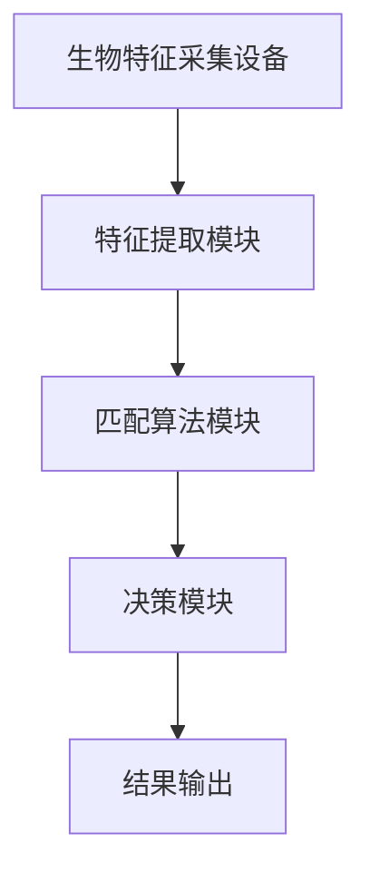

                 

关键词：生物识别，安全性，人工智能，技术进步，算法，产品保护

> 摘要：本文旨在探讨生物识别技术在增强产品安全性方面的重要作用。随着人工智能和生物技术的不断发展，生物识别技术已经广泛应用于金融、医疗、物联网等领域，其可靠性和便利性使其成为提高产品安全性的有力工具。本文将从核心概念、算法原理、数学模型、项目实践和未来应用等多个角度详细分析生物识别技术在产品安全性领域的应用现状与前景。

## 1. 背景介绍

在信息化和数字化快速发展的当今社会，网络信息安全的重要性日益凸显。传统的密码学手段和认证方式在应对复杂多变的威胁时逐渐暴露出其局限性。此时，生物识别技术以其独特性和不可替代性成为提升产品安全性的重要手段。

生物识别技术是指通过人体生物特征（如指纹、面部特征、虹膜、声音等）进行身份识别和验证的技术。与传统的方法相比，生物识别技术具有以下显著优势：

- **唯一性**：每个人的生物特征都是独一无二的，不易被伪造或盗用。
- **安全性**：生物特征难以被复制或篡改，具有较高的安全性。
- **便利性**：生物识别过程无需记忆密码或携带身份证明，使用方便快捷。

随着人工智能技术的不断进步，生物识别技术的准确性和效率得到了显著提升，应用场景也更加丰富。例如，智能手机的指纹解锁、面部识别解锁，以及智能家居设备中的声音识别等，都是生物识别技术在实际应用中的具体体现。

## 2. 核心概念与联系

### 2.1 生物识别技术的基本原理

生物识别技术主要基于以下几个核心概念：

- **生物特征**：如指纹、面部特征、虹膜、声音、掌纹、手写签名等。
- **采集设备**：如指纹采集器、摄像头、声卡等，用于获取生物特征数据。
- **特征提取**：将生物特征数据转化为可用于识别的特征向量。
- **匹配算法**：将提取出的特征向量与数据库中的模板进行匹配，以判断身份。

### 2.2 生物识别技术架构图



### 2.3 生物识别技术的工作流程

1. **特征采集**：用户通过生物特征采集设备提供生物特征数据。
2. **特征提取**：将采集到的生物特征数据转化为数字化的特征向量。
3. **特征匹配**：将提取出的特征向量与数据库中的模板进行匹配。
4. **决策**：根据匹配结果判断是否允许用户访问或使用产品。
5. **结果输出**：将决策结果输出，如通过或拒绝访问。

## 3. 核心算法原理 & 具体操作步骤

### 3.1 算法原理概述

生物识别技术的核心在于特征提取和匹配算法。特征提取是将生物特征数据转化为能够反映个体差异的特征向量。匹配算法则是将提取出的特征向量与存储在数据库中的模板进行比对，以判断是否为同一个人。

### 3.2 算法步骤详解

1. **特征采集**：使用生物特征采集设备获取用户的生物特征数据。
2. **预处理**：对采集到的生物特征数据进行预处理，如滤波、归一化等，以提高数据质量。
3. **特征提取**：通过特征提取算法将预处理后的数据转化为特征向量。
4. **特征匹配**：将提取出的特征向量与数据库中的模板进行匹配。
5. **决策**：根据匹配结果判断用户身份，并做出相应的决策。

### 3.3 算法优缺点

- **优点**：
  - 高安全性：生物特征难以伪造或复制。
  - 高准确性：先进的算法和大数据支持使得识别准确率较高。
  - 高便利性：用户无需记忆密码或携带身份证件。

- **缺点**：
  - 成本较高：生物特征采集设备和算法开发成本较高。
  - 易受环境影响：如指纹识别在湿手或脏手情况下识别率会下降。
  - 隐私问题：生物特征数据的存储和使用可能涉及隐私问题。

### 3.4 算法应用领域

生物识别技术已经在多个领域得到广泛应用，包括但不限于：

- **金融领域**：银行柜员机、ATM机、支付系统等。
- **医疗领域**：患者身份验证、医疗设备使用权限控制等。
- **物联网领域**：智能家居、智能门锁、智能监控等。
- **安防领域**：人脸识别门禁、身份认证、公共安全监控等。
- **人力资源领域**：员工考勤、薪资管理、访问控制等。

## 4. 数学模型和公式 & 详细讲解 & 举例说明

### 4.1 数学模型构建

生物识别技术的数学模型主要涉及特征提取和匹配算法。特征提取通常使用特征空间映射方法，如主成分分析（PCA）、线性判别分析（LDA）等。匹配算法则常使用欧氏距离、余弦相似度等距离度量方法。

### 4.2 公式推导过程

以主成分分析（PCA）为例，其公式推导过程如下：

1. **特征提取公式**：
   \[
   x_{\text{PCA}} = \sum_{i=1}^{k} \lambda_i p_i x
   \]
   其中，\(x\) 为原始特征向量，\(\lambda_i\) 为主成分权重，\(p_i\) 为对应的主成分向量。

2. **匹配公式**：
   \[
   d(x_1, x_2) = \sqrt{(x_1 - x_2)^T (x_1 - x_2)}
   \]
   其中，\(d(x_1, x_2)\) 为特征向量 \(x_1\) 和 \(x_2\) 之间的欧氏距离。

### 4.3 案例分析与讲解

以下是一个简单的生物识别系统设计案例：

1. **特征采集**：使用指纹采集设备获取用户指纹图像。
2. **预处理**：对指纹图像进行滤波去噪处理。
3. **特征提取**：使用PCA算法提取指纹特征向量。
4. **匹配**：将提取出的特征向量与数据库中的模板进行匹配。
5. **决策**：若匹配度高于阈值，则允许用户访问系统。

## 5. 项目实践：代码实例和详细解释说明

### 5.1 开发环境搭建

1. **硬件要求**：一台配备指纹采集器的计算机。
2. **软件要求**：安装Python编程环境和OpenCV、Scikit-learn等库。

### 5.2 源代码详细实现

以下是一个简单的指纹识别系统的Python代码示例：

```python
import cv2
from sklearn.decomposition import PCA
from sklearn.metrics import euclidean_distances

# 采集指纹图像
def capture_fingerprint():
    cap = cv2.VideoCapture(0)
    ret, frame = cap.read()
    if ret:
        cv2.imwrite('fingerprint.jpg', frame)
        cap.release()
    return frame

# 特征提取
def extract_features(image):
    # 读取图像
    img = cv2.imread('fingerprint.jpg', cv2.IMREAD_GRAYSCALE)
    # 使用SIFT算法提取特征点
    sift = cv2.SIFT_create()
    keypoints, descriptors = sift.detectAndCompute(img, None)
    # 使用PCA进行降维
    pca = PCA(n_components=50)
    features = pca.fit_transform(descriptors)
    return features

# 匹配算法
def match_features(features1, features2):
    distances = euclidean_distances(features1, features2)
    min_distance = min(distances)
    return min_distance

# 主程序
if __name__ == '__main__':
    # 采集用户指纹特征
    user_features = extract_features(capture_fingerprint())
    # 从数据库中获取模板特征
    template_features = extract_features('template.jpg')
    # 匹配特征
    min_distance = match_features(user_features, template_features)
    # 决策
    if min_distance < threshold:
        print("指纹验证成功")
    else:
        print("指纹验证失败")
```

### 5.3 代码解读与分析

该代码首先使用OpenCV库的SIFT算法提取指纹图像中的特征点，然后使用PCA算法进行特征降维。降维后的特征向量用于匹配算法，通过计算用户指纹特征向量与模板特征向量之间的欧氏距离进行匹配，若距离小于设定的阈值，则认为验证成功。

### 5.4 运行结果展示

运行上述代码后，系统将启动摄像头，用户需将手指放在指纹采集器上，系统将自动采集指纹图像并进行识别。如果指纹匹配成功，系统将输出“指纹验证成功”，否则输出“指纹验证失败”。

## 6. 实际应用场景

### 6.1 金融领域

在金融领域，生物识别技术被广泛应用于银行柜员机、ATM机和网上银行等场景。例如，银行柜员机通过指纹或面部识别技术确保柜员的身份，防止未授权访问；ATM机使用指纹或卡片+指纹双重验证方式提高交易安全性；网上银行通过生物识别技术进行用户身份验证，防止恶意登录和交易。

### 6.2 医疗领域

在医疗领域，生物识别技术可以用于患者身份验证、医疗设备使用权限控制等。例如，医院病房通过人脸识别技术确保患者身份，防止误诊误治；手术室内通过指纹识别技术控制手术设备的使用权限，确保手术过程安全。

### 6.3 物联网领域

在物联网领域，生物识别技术被广泛应用于智能家居、智能门锁和智能监控等场景。例如，智能家居系统通过指纹或面部识别技术实现家庭成员的身份验证，控制家电设备；智能门锁通过指纹或卡片+指纹双重验证方式实现安全的门禁管理。

### 6.4 安防领域

在安防领域，生物识别技术被广泛应用于人脸识别门禁、身份认证和公共安全监控等。例如，企业单位通过人脸识别门禁系统确保员工安全，防止未授权人员进入；公共安全监控通过人脸识别技术识别犯罪嫌疑人，提高公共安全水平。

## 7. 工具和资源推荐

### 7.1 学习资源推荐

1. **《生物识别技术基础》**：详细介绍了生物识别技术的原理、算法和应用。
2. **《生物特征识别系统的设计与实现》**：提供了生物识别系统设计的实用方法和案例分析。

### 7.2 开发工具推荐

1. **OpenCV**：强大的计算机视觉库，支持多种生物特征识别算法。
2. **Python**：易于学习和使用的编程语言，适用于生物识别系统的开发。

### 7.3 相关论文推荐

1. **“Biometrics: A Review”**：系统综述了生物识别技术的最新研究进展。
2. **“Face Recognition: A Review”**：详细介绍了人脸识别技术的原理和应用。

## 8. 总结：未来发展趋势与挑战

### 8.1 研究成果总结

生物识别技术作为一种提高产品安全性的有效手段，已经取得了显著的研究成果。在算法准确性、系统稳定性、用户体验等方面都有了显著提升。例如，基于深度学习的生物识别算法在准确性上已经超过了传统的特征提取算法。

### 8.2 未来发展趋势

1. **算法优化**：随着人工智能技术的发展，生物识别算法将更加智能和高效。
2. **系统集成**：生物识别技术与物联网、云计算等技术的深度融合将推动更多应用场景的出现。
3. **隐私保护**：随着隐私保护意识的提高，生物识别技术将在数据存储和传输方面采取更加严格的安全措施。

### 8.3 面临的挑战

1. **成本问题**：生物识别技术的开发和部署成本较高，如何降低成本将是未来的一个重要挑战。
2. **环境适应性**：生物识别技术在不同环境下的表现差异较大，如何提高其环境适应性是当前的研究热点。
3. **隐私保护**：生物特征数据涉及用户隐私，如何在保护隐私的同时提高系统安全性是未来的重要研究方向。

### 8.4 研究展望

生物识别技术在未来将继续发挥重要作用，不仅将在传统领域得到更广泛的应用，还将开拓新的应用场景。例如，在智能医疗、智能交通、智能安防等领域，生物识别技术将有望实现更高的安全性和便利性。

### 附录：常见问题与解答

1. **问题**：生物识别技术是否真的安全？
   **解答**：生物识别技术具有较高的安全性，但其安全性也取决于算法的设计、系统的实现和用户的使用习惯。合理的算法设计、严格的安全措施和用户的安全意识都是确保生物识别技术安全的关键因素。

2. **问题**：生物识别技术会侵犯用户的隐私吗？
   **解答**：生物识别技术确实涉及用户隐私，但其隐私保护措施也在不断完善。例如，采用加密存储、匿名化处理等技术手段可以降低隐私泄露的风险。用户在接触生物识别技术时，也应提高对隐私保护的意识，合理使用相关功能。

3. **问题**：生物识别技术是否会被破解？
   **解答**：任何技术都有可能被破解，但生物识别技术由于其生物特征的唯一性和复杂性，破解的难度相对较高。同时，随着技术的不断进步，生物识别系统的安全性能也在不断提高，从而降低了被破解的风险。

作者：禅与计算机程序设计艺术 / Zen and the Art of Computer Programming
----------------------------------------------------------------

以上就是本文的完整内容，希望对您在生物识别技术领域的研究和应用有所帮助。在实际应用中，还需根据具体场景和需求进行调整和优化，以实现最佳效果。

