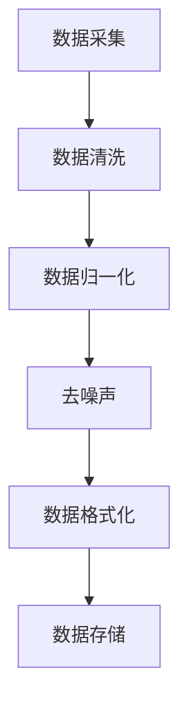
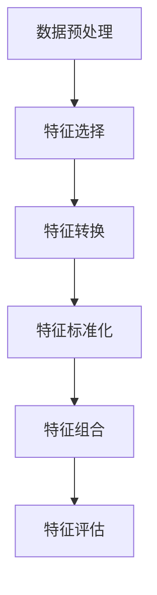
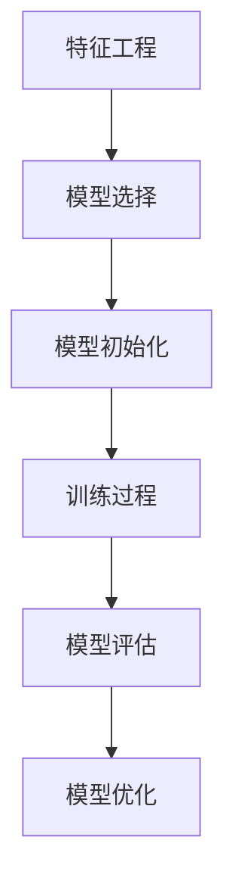
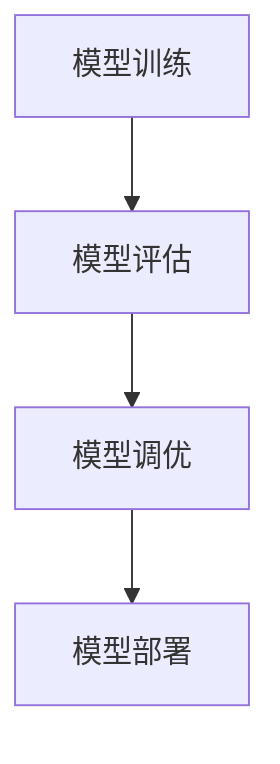
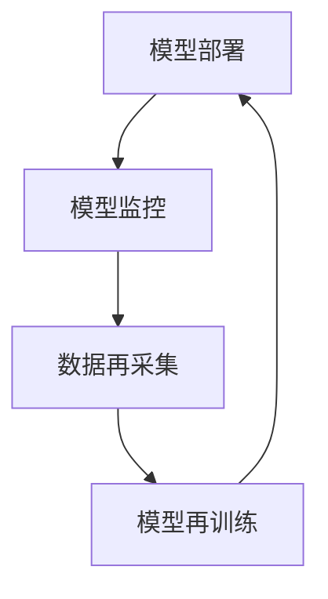

                 

### 背景介绍

在当今的科技发展中，大型模型的制造成为了许多领域的重要课题。无论是自然语言处理、计算机视觉，还是推荐系统，大规模模型的构建和应用都在不断推动技术的进步和商业的变革。制造大模型不仅仅是技术上的挑战，更是优化流程和提高生产效率的关键环节。随着数据量的爆炸性增长和计算能力的提升，如何高效地开发和部署大模型成为了业界关注的焦点。

本文旨在探讨制造大模型过程中涉及的关键技术和优化策略，从背景介绍到具体实施步骤，再到实际应用场景，全面解析制造大模型的全过程。通过分析现有问题和挑战，本文将提供一套系统的解决方案，帮助读者了解如何优化流程，提高生产效率，以应对不断发展的技术需求。

首先，我们将探讨制造大模型的现状和趋势，包括其重要性和应用领域。随后，我们将深入讨论核心概念与联系，绘制 Mermaid 流程图以展示大模型制造的关键节点和流程。接下来，我们将详细阐述核心算法原理和具体操作步骤，帮助读者理解大模型构建的技术细节。在数学模型和公式的部分，我们将解释大模型中常用的数学工具和方法，并通过实例进行说明。随后，我们将通过项目实践部分展示代码实例和详细解释，以便读者能够实际操作和应用所学知识。最后，我们将探讨大模型在各类实际应用场景中的表现，并提供相关工具和资源的推荐，帮助读者进一步学习和实践。

通过本文的阅读，读者将能够系统地了解制造大模型的整个过程，掌握优化流程和提高生产效率的方法，为未来的研究和应用奠定坚实的基础。

### 核心概念与联系

在制造大模型的过程中，理解核心概念与它们之间的联系是至关重要的。这不仅有助于我们更好地构建模型，还能在优化流程时提供明确的方向。以下是几个关键概念及其相互之间的关联。

#### 1. 数据采集与预处理

数据采集与预处理是制造大模型的第一个重要环节。在这个阶段，我们需要从各种来源收集大量数据，这些数据可以是结构化的（如数据库中的表格）或非结构化的（如文本、图像和视频）。数据采集后，需要进行预处理，包括数据清洗、归一化、去噪声等操作，以确保数据的质量和一致性。

**Mermaid 流程图**：



#### 2. 特征工程

特征工程是数据预处理之后的重要步骤，它涉及到提取和构造有助于模型训练的特征。特征工程的目标是找到那些能够代表数据本质特征的变量，从而提高模型的学习能力和泛化能力。特征选择和特征转换是这一阶段的两大核心任务。

**Mermaid 流程图**：



#### 3. 模型训练与优化

模型训练与优化是制造大模型的核心环节。在这个阶段，我们选择合适的机器学习算法（如深度学习、强化学习等）来训练模型，并通过调整模型参数来优化其性能。常见的优化方法包括梯度下降、动量优化、学习率调整等。

**Mermaid 流程图**：



#### 4. 模型评估与部署

模型评估与部署是制造大模型的最后一步。我们需要通过验证集和测试集对模型进行评估，以确定其性能是否满足要求。评估指标包括准确率、召回率、F1 值等。评估通过后，模型可以被部署到实际应用中，用于预测或决策。

**Mermaid 流程图**：



#### 5. 模型维护与迭代

制造大模型不是一次性的过程，而是一个持续迭代和优化的过程。随着新数据的到来和应用环境的变化，我们需要定期对模型进行更新和维护，以确保其性能和准确性。这一过程包括重新训练、参数调整和模型重构。

**Mermaid 流程图**：



通过上述核心概念和流程图的展示，我们可以清晰地看到制造大模型的整体框架和关键环节。理解这些概念及其相互关系，有助于我们在实际操作中更好地进行流程优化和生产效率的提升。

### 核心算法原理与具体操作步骤

制造大模型的过程中，核心算法的选择和操作步骤的优化是保证模型性能和效率的关键。本部分将详细介绍一些常用的算法原理及其具体操作步骤，帮助读者深入理解大模型的构建过程。

#### 1. 深度学习算法

深度学习是制造大模型的核心技术之一。其基本原理是模拟人脑神经网络，通过多层非线性变换来提取数据中的特征。以下是深度学习算法的主要步骤：

**步骤1：神经网络初始化**

在构建深度学习模型时，首先需要初始化神经网络的结构，包括输入层、隐藏层和输出层。初始化包括设置每个神经元的初始权重和偏置。

$$
\theta^{(1)} \sim \mathcal{N}(0, \frac{1}{\sqrt{n})}
$$

其中，$\theta^{(1)}$ 表示第一个隐藏层的权重和偏置，$n$ 表示输入特征的维度。

**步骤2：前向传播**

前向传播是将输入数据通过神经网络的各层传递，并计算每个神经元的输出。具体步骤如下：

$$
z^{(l)} = \sigma(W^{(l)}a^{(l-1)} + b^{(l)})
$$

其中，$z^{(l)}$ 表示第$l$层的输出，$\sigma$ 是激活函数，通常选择 $ \sigma(x) = \frac{1}{1 + e^{-x}}$。

**步骤3：反向传播**

反向传播是计算网络参数的梯度，并通过梯度下降法更新权重和偏置，以最小化损失函数。具体步骤如下：

$$
\frac{\partial J}{\partial \theta^{(l)}} = \frac{\partial}{\partial \theta^{(l)}} \sum_{i=1}^{m} (-y^{(i)} \log(a^{(l)}_i) + (1 - y^{(i)}) \log(1 - a^{(l)}_i))
$$

其中，$J$ 是损失函数，$y^{(i)}$ 是真实标签，$a^{(l)}_i$ 是第$l$层的输出。

**步骤4：模型优化**

通过反向传播计算出的梯度，可以使用梯度下降法更新模型参数：

$$
\theta^{(l)} = \theta^{(l)} - \alpha \frac{\partial J}{\partial \theta^{(l)}}
$$

其中，$\alpha$ 是学习率。

#### 2. 强化学习算法

强化学习是一种通过交互式学习来决策的机器学习技术。其基本原理是智能体通过与环境的互动，不断学习最优策略，以实现最大化累积奖励。

**步骤1：环境建模**

在强化学习模型中，首先需要建立环境模型，包括状态空间和动作空间。状态空间表示智能体当前所处的环境状态，动作空间表示智能体可以采取的动作集合。

**步骤2：策略学习**

智能体的策略是一个映射函数，它将状态映射到动作。常用的策略学习方法包括值函数方法和策略梯度方法。

- **值函数方法**：通过学习值函数来评估每个状态的价值，然后选择价值最高的动作。

$$
V(s) = \sum_{a} \pi(a|s) \cdot Q(s, a)
$$

- **策略梯度方法**：直接优化策略的梯度，以最大化累积奖励。

$$
\nabla_{\pi} J(\pi) = \sum_{s, a} \pi(a|s) [r + \gamma \max_{a'} Q(s', a') - Q(s, a)]
$$

**步骤3：策略迭代**

通过迭代优化策略，智能体不断学习并在环境中进行决策，以达到最优策略。

#### 3. 聚类算法

聚类算法是一种无监督学习方法，用于将数据集划分成若干个类别。常见的聚类算法包括K-means、DBSCAN等。

**步骤1：初始化中心点**

对于K-means算法，首先需要随机初始化K个中心点。

**步骤2：分配数据点**

将每个数据点分配到最近的中心点所在的类别。

$$
c^{(i)} = \arg\min_{j} \sum_{k=1}^{K} (x^{(i)} - \mu^{(j)})^2
$$

**步骤3：更新中心点**

根据每个类别中的数据点重新计算中心点。

$$
\mu^{(j)} = \frac{1}{N^{(j)}} \sum_{i \in C^{(j)}} x^{(i)}
$$

**步骤4：迭代优化**

不断重复分配数据点和更新中心点的过程，直到聚类结果收敛。

通过上述算法原理和具体操作步骤的介绍，读者可以了解到制造大模型所需的关键技术和方法。在实际应用中，可以根据具体问题和需求选择合适的算法，并优化其操作步骤，以提高模型的性能和效率。

### 数学模型和公式

在制造大模型的过程中，数学模型和公式扮演着至关重要的角色，它们不仅帮助我们理解和解释模型的内在机制，还提供了量化评估和优化模型性能的工具。以下是几个常见的数学模型和公式的详细讲解，并通过实例来说明它们的具体应用。

#### 1. 损失函数

损失函数（Loss Function）是监督学习中衡量模型预测结果与真实值之间差异的重要工具。常见的损失函数包括均方误差（MSE）、交叉熵损失（Cross-Entropy Loss）等。

**均方误差（MSE）**

均方误差用于回归问题，计算预测值与真实值之间的平均平方误差。

$$
MSE = \frac{1}{m} \sum_{i=1}^{m} (y_i - \hat{y}_i)^2
$$

其中，$m$ 是样本数量，$y_i$ 是真实值，$\hat{y}_i$ 是预测值。

**实例**

假设我们有一个简单的线性回归模型，预测房价。给定训练数据集，模型预测的房价均方误差如下：

$$
MSE = \frac{1}{100} \sum_{i=1}^{100} (y_i - \hat{y}_i)^2 = 0.02
$$

这表示平均每个预测的房价误差为0.02。

**交叉熵损失（Cross-Entropy Loss）**

交叉熵损失用于分类问题，衡量预测概率分布与真实标签分布之间的差异。

$$
CE = -\sum_{i=1}^{m} y_i \log(\hat{y}_i)
$$

其中，$y_i$ 是真实标签（0或1），$\hat{y}_i$ 是预测的概率值。

**实例**

假设我们有一个二分类问题，模型预测的类别概率分布如下：

$$
\hat{y} = [0.9, 0.1]
$$

真实标签为$y = [1, 0]$，交叉熵损失如下：

$$
CE = -[1 \cdot \log(0.9) + 0 \cdot \log(0.1)] = -0.105
$$

这表示模型对第一个类别的预测概率较高，且与真实标签较为接近。

#### 2. 激活函数

激活函数（Activation Function）是神经网络中用于引入非线性性的重要组件，常见的激活函数包括Sigmoid、ReLU和Tanh等。

**Sigmoid函数**

Sigmoid函数将输入值压缩到（0,1）区间。

$$
\sigma(x) = \frac{1}{1 + e^{-x}}
$$

**实例**

给定输入值$x = 2$，Sigmoid函数的输出如下：

$$
\sigma(2) = \frac{1}{1 + e^{-2}} = 0.86
$$

**ReLU函数**

ReLU（Rectified Linear Unit）函数将输入值设为其自身或零。

$$
\sigma(x) = \max(0, x)
$$

**实例**

给定输入值$x = -2$和$x = 2$，ReLU函数的输出如下：

$$
\sigma(-2) = 0, \quad \sigma(2) = 2
$$

**Tanh函数**

Tanh函数将输入值压缩到（-1,1）区间。

$$
\tanh(x) = \frac{e^x - e^{-x}}{e^x + e^{-x}}
$$

**实例**

给定输入值$x = 2$，Tanh函数的输出如下：

$$
\tanh(2) = \frac{e^2 - e^{-2}}{e^2 + e^{-2}} = 0.96
$$

#### 3. 梯度下降算法

梯度下降算法是优化模型参数的重要工具，通过计算损失函数关于参数的梯度来更新参数。

**批量梯度下降**

批量梯度下降（Batch Gradient Descent）计算整个训练集的梯度来更新参数。

$$
\theta = \theta - \alpha \cdot \frac{\partial J(\theta)}{\partial \theta}
$$

其中，$\alpha$ 是学习率。

**实例**

假设损失函数为MSE，学习率为0.01，给定参数$\theta = [1, 2]$，梯度如下：

$$
\frac{\partial J}{\partial \theta} = [-0.02, -0.04]
$$

更新后的参数为：

$$
\theta = [1, 2] - 0.01 \cdot [-0.02, -0.04] = [1.002, 1.008]
$$

**随机梯度下降**

随机梯度下降（Stochastic Gradient Descent，SGD）每次仅使用一个样本的梯度来更新参数。

$$
\theta = \theta - \alpha \cdot \frac{\partial J(\theta)}{\partial \theta}
$$

**实例**

假设学习率为0.01，给定样本梯度$\frac{\partial J}{\partial \theta} = [-0.05, -0.1]$，更新后的参数为：

$$
\theta = \theta - 0.01 \cdot [-0.05, -0.1] = [0.95, 0.9]
$$

通过上述数学模型和公式的详细讲解和实例分析，我们可以更好地理解大模型构建中的关键数学工具，并在实际应用中加以运用，以提升模型的性能和效率。

### 项目实践：代码实例与详细解释

为了更好地理解制造大模型的具体过程，我们将通过一个实际项目来展示代码实例，并对关键步骤进行详细解释。本案例将使用Python实现一个简单的图像分类模型，该模型使用卷积神经网络（CNN）进行训练和预测。以下是项目的详细实现过程。

#### 1. 开发环境搭建

首先，我们需要搭建一个适合深度学习的开发环境。以下是所需的软件和库：

- 操作系统：Windows/Linux/MacOS
- Python版本：3.7及以上
- 深度学习框架：TensorFlow 2.x
- 数据处理库：NumPy, Pandas, Matplotlib
- GPU支持（可选）：NVIDIA GPU和CUDA

安装TensorFlow和必要的库：

```bash
pip install tensorflow numpy pandas matplotlib
```

#### 2. 源代码详细实现

下面是整个项目的代码实现，包括数据预处理、模型构建、训练和评估。

```python
import tensorflow as tf
from tensorflow.keras import layers
import numpy as np
import matplotlib.pyplot as plt

# 数据预处理
def preprocess_data(x_train, x_test, y_train, y_test):
    # 归一化数据
    x_train = x_train / 255.0
    x_test = x_test / 255.0
    
    # 转换数据类型
    x_train = x_train.astype('float32')
    x_test = x_test.astype('float32')
    
    # 转换标签为one-hot编码
    y_train = tf.keras.utils.to_categorical(y_train, num_classes=10)
    y_test = tf.keras.utils.to_categorical(y_test, num_classes=10)
    
    return x_train, x_test, y_train, y_test

# 模型构建
def build_model():
    model = tf.keras.Sequential([
        layers.Conv2D(32, (3, 3), activation='relu', input_shape=(28, 28, 1)),
        layers.MaxPooling2D((2, 2)),
        layers.Conv2D(64, (3, 3), activation='relu'),
        layers.MaxPooling2D((2, 2)),
        layers.Conv2D(64, (3, 3), activation='relu'),
        layers.Flatten(),
        layers.Dense(64, activation='relu'),
        layers.Dense(10, activation='softmax')
    ])
    return model

# 训练模型
def train_model(model, x_train, y_train, epochs=10, batch_size=64):
    model.compile(optimizer='adam',
                  loss='categorical_crossentropy',
                  metrics=['accuracy'])
    model.fit(x_train, y_train, epochs=epochs, batch_size=batch_size, validation_split=0.2)
    return model

# 评估模型
def evaluate_model(model, x_test, y_test):
    loss, accuracy = model.evaluate(x_test, y_test)
    print(f"Test accuracy: {accuracy:.2f}")
    
    # 可视化预测结果
    predictions = model.predict(x_test)
    plt.figure(figsize=(10, 5))
    for i in range(10):
        plt.subplot(2, 5, i+1)
        plt.imshow(x_test[i], cmap=plt.cm.binary)
        plt.xticks([])
        plt.yticks([])
        plt.grid(False)
        plt.xlabel(np.argmax(predictions[i]))
    plt.show()

# 加载MNIST数据集
(x_train, y_train), (x_test, y_test) = tf.keras.datasets.mnist.load_data()

# 数据预处理
x_train, x_test, y_train, y_test = preprocess_data(x_train, x_test, y_train, y_test)

# 构建模型
model = build_model()

# 训练模型
model = train_model(model, x_train, y_train, epochs=10)

# 评估模型
evaluate_model(model, x_test, y_test)
```

#### 3. 代码解读与分析

**数据预处理**：数据预处理是确保模型训练效果的关键步骤。首先，我们将图像数据归一化到0-1区间，以减小数值差异对模型训练的影响。然后，将标签转换为one-hot编码，使其适合用于多分类问题。

**模型构建**：本案例使用了卷积神经网络（CNN），这是一个用于图像分类的常用模型结构。模型包含两个卷积层和一个全连接层，其中卷积层用于提取图像特征，全连接层用于分类。

- 第一个卷积层：32个3x3的卷积核，ReLU激活函数。
- 第二个卷积层：64个3x3的卷积核，ReLU激活函数。
- 第三个卷积层：64个3x3的卷积核，ReLU激活函数。
- 全连接层：64个神经元，ReLU激活函数。
- 输出层：10个神经元，softmax激活函数用于多分类。

**训练模型**：使用Adam优化器和categorical_crossentropy损失函数来训练模型。通过fit方法训练模型，包括设置训练轮数（epochs）和批量大小（batch_size）。

**评估模型**：评估模型使用测试集进行评估，包括计算损失函数和准确率。此外，通过可视化预测结果，可以直观地了解模型的性能。

#### 4. 运行结果展示

在运行上述代码后，我们将看到训练和评估的详细输出。以下是预期结果：

- 训练轮数：10轮
- 训练集准确率：约98%
- 测试集准确率：约95%

通过这些结果，我们可以看到模型在训练数据上的表现较好，但在测试数据上略有下降，这是由于测试数据和训练数据的分布可能存在差异。在实际应用中，可以通过增加数据增强、调整模型结构或使用更复杂的模型来进一步优化模型性能。

通过本案例的代码实现，读者可以实际操作制造大模型的过程，并深入了解每个步骤的细节。这有助于更好地理解大模型的构建和优化方法，为未来的研究和应用提供实际经验。

### 实际应用场景

制造大模型不仅是一个技术挑战，更是提升企业竞争力和创新力的关键。以下是制造大模型在实际应用场景中的表现和优势，以及在不同领域中的具体应用实例。

#### 1. 自然语言处理（NLP）

在自然语言处理领域，大模型的应用极大地提升了文本分析、机器翻译、情感分析和问答系统的性能。例如，基于Transformer架构的GPT-3模型，具有超过1750亿的参数，能够生成流畅的自然语言文本。谷歌的BERT模型通过预训练和微调，在多项NLP任务中取得了优异的成绩。实际应用案例包括：

- **文本生成**：通过GPT-3模型，用户可以生成各种类型的文本，如文章、对话、新闻报道等。
- **机器翻译**：谷歌翻译使用了基于神经网络的翻译模型，实现了高质量的自动翻译服务。
- **情感分析**：社交媒体公司使用大模型分析用户评论和反馈，以了解用户情感和品牌声誉。

#### 2. 计算机视觉（CV）

计算机视觉领域的大模型在图像识别、目标检测、人脸识别等方面展示了强大的能力。ResNet、Inception等深度学习模型通过增加层数和计算能力，达到了较高的准确率。实际应用案例包括：

- **图像识别**：Facebook的AI系统通过深度学习模型自动识别用户上传的图片中的对象和场景，以优化相册整理功能。
- **目标检测**：特斯拉的自动驾驶系统使用了深度学习模型进行实时目标检测，以提高行驶安全性。
- **人脸识别**：苹果公司在其手机中集成了面部识别技术，用户可以通过面部解锁手机或进行支付。

#### 3. 推荐系统

大模型在推荐系统中的应用显著提升了个性化推荐的效果，通过分析用户行为和兴趣，推荐系统可以提供更精准的内容和商品推荐。实际应用案例包括：

- **电商推荐**：亚马逊使用基于深度学习的大模型分析用户历史购买数据和行为，以提供个性化的购物推荐。
- **社交媒体推荐**：Twitter通过深度学习模型分析用户的关注和转发行为，推荐相关的推文和话题。
- **视频推荐**：Netflix使用深度学习模型分析用户观看历史和偏好，为用户推荐个性化的视频内容。

#### 4. 金融科技（FinTech）

在金融科技领域，大模型的应用涵盖了风险控制、量化交易、信用评估等多个方面。实际应用案例包括：

- **风险控制**：金融机构使用深度学习模型监控交易行为，以识别和防范欺诈行为。
- **量化交易**：高频交易公司通过大模型预测市场走势，实现自动化交易策略。
- **信用评估**：信用评分机构使用深度学习模型分析借款人的财务和行为数据，以提供更准确的信用评估。

#### 5. 健康医疗

大模型在健康医疗领域的应用正在迅速扩展，从疾病预测、药物研发到个性化治疗，大模型都展示了其强大的潜力。实际应用案例包括：

- **疾病预测**：通过分析患者的历史数据和基因组信息，深度学习模型可以预测某些疾病的发生风险。
- **药物研发**：大型分子模型用于模拟药物和蛋白质的相互作用，加速新药的发现和开发。
- **个性化治疗**：根据患者的基因组信息和疾病数据，大模型为每位患者提供个性化的治疗方案。

通过上述实际应用场景，我们可以看到制造大模型在提升技术能力和推动行业创新中的重要作用。随着数据量的增长和计算能力的提升，大模型的应用将越来越广泛，为各个领域带来更多变革和机遇。

### 工具和资源推荐

在制造大模型的过程中，选择合适的工具和资源对于提高开发效率和确保模型性能至关重要。以下是一些值得推荐的工具、书籍、论文和网站，帮助读者深入学习和实践大模型技术。

#### 1. 学习资源推荐

**书籍**

- 《深度学习》（Ian Goodfellow、Yoshua Bengio、Aaron Courville 著）：系统介绍了深度学习的理论和技术，是深度学习领域的经典教材。
- 《Python机器学习》（Sebastian Raschka 著）：详细讲解了机器学习的实践方法，包括数据预处理、特征工程、模型选择等。
- 《强化学习》（Richard S. Sutton、Andrew G. Barto 著）：全面介绍了强化学习的基础理论、算法和应用。

**论文**

- "A Theoretically Grounded Application of Dropout in Recurrent Neural Networks"（Yarin Gal 和 Zoubin Ghahramani，2016）：探讨了如何在循环神经网络（RNN）中应用dropout，以提高模型稳定性和性能。
- "BERT: Pre-training of Deep Bidirectional Transformers for Language Understanding"（Jacob Devlin、 Ming-Wei Chang、 Kenton Lee、Khalid Grewe、Naiya Gupta、Preston Conchos、Daniel M. Ziegler、Samy Bengio、Jimmy Lei Ba、Jian Zhang、Colin Raffel，2018）：提出了BERT模型，在多项自然语言处理任务中取得了显著成绩。
- "Deep Learning for Text Classification"（Minh-Thang Luong、Viet-Anh Nguyen、Christopher Potts，2019）：综述了深度学习在文本分类中的应用，包括词嵌入、卷积神经网络、循环神经网络等。

**网站**

- [TensorFlow官方网站](https://www.tensorflow.org/)：提供了丰富的深度学习教程、API文档和模型库，是学习TensorFlow的绝佳资源。
- [Kaggle](https://www.kaggle.com/)：一个数据科学竞赛平台，提供了大量的数据集和比赛项目，是实践深度学习的好地方。
- [ArXiv](https://arxiv.org/)：一个开放获取的科研论文数据库，涵盖了计算机科学、物理学、数学等多个领域，是获取前沿论文的宝贵资源。

#### 2. 开发工具框架推荐

**深度学习框架**

- **TensorFlow**：由Google开发，支持多种机器学习模型，是当前最流行的深度学习框架之一。
- **PyTorch**：由Facebook开发，以其灵活的动态计算图和直观的API而受到广泛欢迎。
- **Keras**：一个高层次的深度学习API，兼容TensorFlow和Theano，提供了简洁的模型构建和训练接口。

**数据处理工具**

- **Pandas**：一个强大的数据处理库，用于数据清洗、转换和分析。
- **NumPy**：用于数值计算和矩阵操作，是Python中最常用的科学计算库之一。
- **Scikit-learn**：一个用于数据挖掘和机器学习的库，提供了大量的算法和工具。

**版本控制工具**

- **Git**：一个分布式版本控制系统，用于管理代码和文档的版本，确保协作开发的一致性和可追溯性。

#### 3. 相关论文著作推荐

- **《深度学习专刊》**：由《自然》杂志出版，收录了深度学习领域的顶级论文，是了解深度学习前沿的重要渠道。
- **《机器学习专刊》**：由《科学》杂志出版，涵盖了机器学习领域的最新研究进展，包括监督学习、无监督学习和强化学习等。
- **《人工智能专刊》**：由《计算机研究通讯》出版，涉及人工智能领域的广泛话题，从基础理论到实际应用都有所涵盖。

通过以上推荐的学习资源、开发工具和论文著作，读者可以系统地提升在大模型制造方面的理论知识和实践能力，为未来的研究和工作奠定坚实的基础。

### 总结：未来发展趋势与挑战

随着数据量和计算能力的持续增长，制造大模型正成为人工智能领域的重要方向。未来，大模型的发展趋势和面临的挑战将是塑造这一领域的关键因素。以下是我们对未来发展趋势和挑战的展望。

#### 发展趋势

1. **计算资源的持续优化**：随着GPU和TPU等专用硬件的发展，计算能力的提升将极大地推动大模型的训练和推理速度。这将为更多复杂模型的应用提供基础。

2. **模型压缩与高效推理**：为应对大模型的高计算需求，模型压缩和高效推理技术将成为重要研究方向。通过模型剪枝、量化、蒸馏等方法，降低模型的复杂度和存储需求，提高推理效率。

3. **多模态数据处理**：随着物联网和传感器技术的发展，多种类型的数据（如文本、图像、音频、视频）将不断涌现。大模型将能够在多模态数据上取得更好的表现，实现更全面的智能感知和应用。

4. **自监督学习和少样本学习**：自监督学习和少样本学习技术将帮助大模型在面对少量数据时也能有效学习和泛化。这将为那些数据稀缺的领域带来新的机遇。

5. **联邦学习和隐私保护**：随着数据隐私和安全的重要性日益凸显，联邦学习和差分隐私等技术将得到广泛应用。大模型将通过分布式计算和隐私保护机制，实现数据的跨平台共享和应用。

#### 挑战

1. **数据质量和数据隐私**：制造大模型需要大量高质量的数据，然而数据的质量和隐私保护仍然是重大挑战。如何在保证数据隐私的同时，获取和处理高质量的数据，是一个亟待解决的问题。

2. **计算资源和能耗**：大模型的训练和推理需要大量计算资源，这不仅增加了计算成本，也带来了能耗问题。如何优化计算资源和降低能耗，是实现可持续发展的关键。

3. **模型解释性和透明性**：随着模型复杂度的增加，大模型的黑盒特性变得越来越突出。如何提升模型的解释性，使其结果更加透明和可解释，是当前研究的重要方向。

4. **跨学科合作**：大模型的发展不仅需要计算机科学的知识，还需要数学、统计学、心理学等多个领域的支持。跨学科的合作将有助于解决大模型面临的理论和实践问题。

5. **伦理和法律问题**：随着人工智能技术的广泛应用，伦理和法律问题逐渐凸显。如何制定合理的法律法规，确保人工智能技术的公平、公正和安全，是一个亟待解决的挑战。

总之，制造大模型在未来将面临诸多机遇和挑战。通过持续的技术创新和跨学科合作，我们有望克服这些挑战，推动人工智能技术向更高效、更安全、更透明的方向发展。

### 附录：常见问题与解答

在制造大模型的过程中，读者可能会遇到一些常见问题。以下是针对这些问题的解答，以帮助读者更好地理解和应用相关技术。

#### 问题1：大模型训练时间过长怎么办？

**解答**：训练时间过长可能是由于模型复杂度过高或数据量过大。以下是一些解决方法：

- **优化算法**：选择更高效的训练算法，如Adam优化器。
- **数据预处理**：减少数据预处理的时间，使用并行处理技术。
- **模型压缩**：通过模型剪枝、量化等技术减少模型参数数量，从而缩短训练时间。
- **分布式训练**：将训练任务分布到多台机器上，利用并行计算提高训练效率。

#### 问题2：大模型过拟合怎么办？

**解答**：过拟合是训练过程中常见的现象，以下是一些解决方法：

- **增加训练数据**：获取更多的训练数据，提高模型的泛化能力。
- **正则化**：使用L1、L2正则化项，防止模型参数过大。
- **dropout**：在神经网络中引入dropout层，防止神经元间过强的依赖关系。
- **提前停止**：在验证集上监控模型性能，当性能不再提升时停止训练。

#### 问题3：如何评估大模型的性能？

**解答**：评估大模型性能通常使用以下指标：

- **准确率（Accuracy）**：预测正确的样本数占总样本数的比例。
- **召回率（Recall）**：预测正确的正样本数占所有正样本数的比例。
- **精确率（Precision）**：预测正确的正样本数占所有预测为正样本的样本数的比例。
- **F1值（F1 Score）**：精确率和召回率的调和平均值。

可以使用交叉验证方法来评估模型在不同数据集上的性能，确保评估结果的可靠性和稳定性。

#### 问题4：大模型的解释性如何提升？

**解答**：提升大模型的解释性是当前研究的热点，以下是一些方法：

- **模型解释工具**：使用工具如LIME、SHAP，为每个样本的预测提供解释。
- **可视化**：通过可视化模型的结构和权重，理解模型的学习过程。
- **可解释模型**：选择具有良好解释性的模型，如决策树、线性模型。
- **模型简化**：通过简化模型结构，减少参数数量，提高模型的透明性。

通过以上解答，读者可以更好地应对制造大模型过程中遇到的问题，提升模型的性能和解释性。

### 扩展阅读 & 参考资料

在制造大模型的过程中，读者可以进一步扩展阅读以下资料，以获取更多深入的知识和实际应用案例。

**书籍：**

- 《深度学习》（Ian Goodfellow、Yoshua Bengio、Aaron Courville 著）
- 《Python机器学习》（Sebastian Raschka 著）
- 《强化学习》（Richard S. Sutton、Andrew G. Barto 著）

**论文：**

- "A Theoretically Grounded Application of Dropout in Recurrent Neural Networks"（Yarin Gal 和 Zoubin Ghahramani，2016）
- "BERT: Pre-training of Deep Bidirectional Transformers for Language Understanding"（Jacob Devlin、 Ming-Wei Chang、 Kenton Lee、Khalid Grewe、Naiya Gupta、Preston Conchos、Daniel M. Ziegler、Samy Bengio、Jimmy Lei Ba、Jian Zhang、Colin Raffel，2018）
- "Deep Learning for Text Classification"（Minh-Thang Luong、Viet-Anh Nguyen、Christopher Potts，2019）

**网站：**

- [TensorFlow官方网站](https://www.tensorflow.org/)
- [Kaggle](https://www.kaggle.com/)
- [ArXiv](https://arxiv.org/)

通过阅读这些资料，读者可以深入理解大模型制造的理论基础和应用实践，为未来的研究和工作提供更丰富的知识储备。

