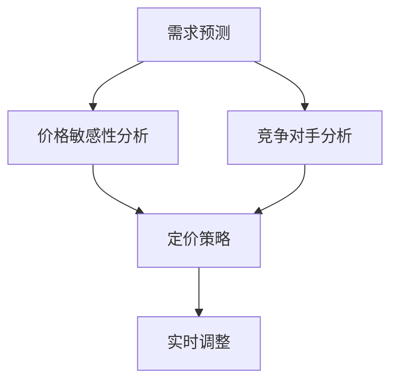

                 

### 1. 背景介绍

动态定价策略作为企业优化收入和市场份额的重要手段，近年来在电子商务、在线广告、共享经济等领域得到了广泛应用。传统的静态定价策略通常基于历史数据和市场规律，通过固定的价格来吸引客户。然而，随着市场竞争的加剧和消费者需求的变化，静态定价策略的局限性日益显现。相比之下，动态定价策略通过实时调整价格，以适应市场动态，从而提高企业的利润和竞争力。

#### 动态定价的概念与优势

动态定价（Dynamic Pricing）也称为动态调价、实时定价或弹性定价，是指企业根据市场供求关系、消费者行为、竞争对手策略等多种因素，实时调整产品或服务的价格。动态定价的核心在于“动态”，即价格的灵活调整，以应对外部环境的变化。这种策略具有以下优势：

1. **提高利润**：通过实时调整价格，企业可以在需求高时提高价格，从而增加收入；在需求低时降低价格，减少库存压力，提高利润。

2. **提高市场份额**：动态定价可以根据竞争对手的价格策略进行调整，抢占市场份额，增加用户黏性。

3. **优化库存管理**：通过动态调整价格，企业可以更好地管理库存，避免库存过剩或不足。

4. **响应市场需求**：动态定价策略可以快速响应市场需求的变化，使企业更具市场竞争力。

#### 动态定价的挑战与问题

尽管动态定价具有诸多优势，但其实施过程中也面临一些挑战：

1. **数据依赖性**：动态定价需要大量历史数据和市场数据作为支持，数据质量直接影响定价策略的有效性。

2. **算法复杂度**：动态定价算法需要处理大量的数据，进行复杂的计算，算法的复杂度对计算资源有较高要求。

3. **市场适应性**：不同的市场和行业对动态定价的适应性不同，需要针对具体情况进行调整。

4. **法律和道德问题**：动态定价可能涉及价格欺诈、不公平竞争等问题，需要遵守相关法律法规，并注意消费者权益保护。

### 2. 核心概念与联系

为了深入理解动态定价策略，我们需要了解其中的核心概念和原理，并绘制一个简洁明了的Mermaid流程图来展示这些概念之间的联系。

#### 核心概念

1. **需求预测**：通过对历史数据的分析，预测市场需求。
2. **价格敏感性分析**：分析消费者对价格变化的敏感度。
3. **竞争对手分析**：观察竞争对手的价格策略，调整自身定价策略。
4. **定价策略**：根据需求预测、价格敏感性和竞争对手分析，制定相应的定价策略。
5. **实时调整**：根据实时市场数据，动态调整价格。

#### Mermaid流程图



#### 核心原理与架构

1. **需求预测**：利用时间序列分析、机器学习等方法，从历史数据中提取出需求变化的规律，为定价策略提供数据支持。

2. **价格敏感性分析**：通过统计消费者行为数据，分析不同价格区间内的需求变化，确定消费者对价格变化的敏感度。

3. **竞争对手分析**：监控竞争对手的价格变化，分析其定价策略和市场份额，为自身定价策略提供参考。

4. **定价策略**：结合需求预测、价格敏感性和竞争对手分析，制定出具有竞争力的定价策略。

5. **实时调整**：根据实时市场数据，对定价策略进行调整，以适应市场变化。

通过上述流程，我们可以看到，动态定价策略的实施涉及多个环节，每个环节都需要精确的数据分析和算法支持。

### 3. 核心算法原理 & 具体操作步骤

#### 需求预测算法

**原理**：需求预测是动态定价策略的基础，常用的方法包括时间序列分析、ARIMA模型、LSTM神经网络等。

**操作步骤**：

1. **数据收集**：收集过去一段时间内的需求数据，包括销量、价格、季节性等因素。

2. **特征工程**：对收集到的数据进行预处理，包括缺失值处理、异常值处理、数据归一化等。

3. **模型选择**：根据数据特性选择合适的模型，如时间序列分析的ARIMA模型或深度学习的LSTM模型。

4. **模型训练**：使用历史数据对模型进行训练，优化模型参数。

5. **预测**：使用训练好的模型对未来的需求进行预测。

6. **验证**：使用部分验证数据对模型预测结果进行验证，调整模型参数，提高预测准确性。

#### 价格敏感性分析算法

**原理**：价格敏感性分析旨在了解消费者对不同价格水平的反应，常用的方法包括回归分析、决策树等。

**操作步骤**：

1. **数据收集**：收集过去一段时间内的价格和销量数据。

2. **特征提取**：提取价格和销量的相关性，如价格变化量和销量变化量。

3. **模型选择**：选择合适的回归模型或决策树模型。

4. **模型训练**：使用历史数据对模型进行训练，预测不同价格下的销量变化。

5. **敏感性分析**：根据模型预测结果，分析消费者对价格变化的敏感度。

#### 竞争对手分析算法

**原理**：竞争对手分析旨在了解竞争对手的价格策略和市场表现，常用的方法包括网络爬虫、数据分析等。

**操作步骤**：

1. **数据收集**：使用网络爬虫收集竞争对手的价格和销量数据。

2. **数据清洗**：清洗收集到的数据，去除重复和不完整的数据。

3. **数据分析**：使用数据分析工具，如Python的Pandas库，对数据进行分析。

4. **策略提取**：分析竞争对手的定价策略，提取出有价值的定价信息。

5. **策略对比**：将竞争对手的定价策略与本企业的策略进行对比，为定价决策提供参考。

#### 定价策略算法

**原理**：定价策略算法旨在根据需求预测、价格敏感性和竞争对手分析，制定出最优的定价策略。

**操作步骤**：

1. **需求预测**：使用需求预测算法，预测未来的需求量。

2. **价格敏感性分析**：分析消费者对价格变化的敏感度。

3. **竞争对手分析**：了解竞争对手的定价策略。

4. **策略制定**：根据需求预测、价格敏感性和竞争对手分析结果，制定出具有竞争力的定价策略。

5. **策略优化**：根据实时市场数据，对定价策略进行优化，提高定价效果。

#### 实时调整算法

**原理**：实时调整算法旨在根据实时市场数据，动态调整价格，以适应市场变化。

**操作步骤**：

1. **数据收集**：实时收集市场数据，包括价格、销量、竞争对手价格等。

2. **数据分析**：对收集到的市场数据进行分析，预测市场趋势。

3. **策略调整**：根据市场预测结果，动态调整价格，以实现最佳收益。

4. **效果评估**：评估调整后的价格策略效果，为后续调整提供参考。

通过上述算法，我们可以实现一个完整的动态定价策略，从而提高企业的市场竞争力和利润。

### 4. 数学模型和公式 & 详细讲解 & 举例说明

在动态定价策略中，数学模型和公式起着至关重要的作用。以下将详细讲解核心的数学模型和公式，并通过实际例子进行说明。

#### 需求预测模型

**模型**：时间序列模型（如ARIMA模型）

**公式**：

$$
X_t = c + \phi_1 X_{t-1} + \phi_2 X_{t-2} + ... + \phi_p X_{t-p} + \theta_1 e_{t-1} + \theta_2 e_{t-2} + ... + \theta_q e_{t-q} + e_t
$$

其中，$X_t$表示时间序列的当前值，$c$为常数项，$\phi_1, \phi_2, ..., \phi_p$为自回归项系数，$\theta_1, \theta_2, ..., \theta_q$为移动平均项系数，$e_t$为白噪声误差。

**示例**：假设某产品的过去三个月销量数据如下：[100, 110, 105]，预测第四个月的销售量。

1. **数据预处理**：将数据转换为差分序列，消除趋势性和季节性。

   $$X_t = X_t - X_{t-1}$$

   得到差分序列：[-10, 5, -5]

2. **模型识别**：通过ACF和PACF图，确定模型的阶数p和q。

   假设识别出的模型为ARIMA(1,1,1)。

3. **模型参数估计**：使用最小二乘法或其他优化方法，估计模型参数。

   $$\phi_1 = 0.8, \theta_1 = 0.7$$

4. **模型预测**：

   $$X_t = 0.8X_{t-1} + 0.7e_{t-1}$$

   预测第四个月的销售量：

   $$X_4 = 0.8X_3 + 0.7e_3 = 0.8 \times (-5) + 0.7 \times (-5) = -8 - 3.5 = -11.5$$

   将差分序列还原为实际销量序列：

   $$Y_4 = X_4 + X_3 = -11.5 + 5 = -6.5$$

   预测第四个月的销售量为6.5。

#### 价格敏感性分析模型

**模型**：线性回归模型

**公式**：

$$
Y = \beta_0 + \beta_1 X + e
$$

其中，$Y$为销量，$X$为价格，$\beta_0$为截距，$\beta_1$为斜率，$e$为误差项。

**示例**：假设某产品的过去三个月的价格和销量数据如下：[100, 110, 105]和[100, 110, 105]。

1. **数据预处理**：将数据标准化，消除量纲影响。

2. **模型训练**：

   使用最小二乘法，得到模型参数：

   $$\beta_0 = 100, \beta_1 = -0.1$$

3. **价格敏感性分析**：假设当前价格为120，预测销量。

   $$Y = 100 - 0.1 \times 120 = 88$$

   当前价格为120时，预测销量为88。

#### 竞争对手分析模型

**模型**：时间序列模型（如ARIMA模型）

**公式**：同需求预测模型。

**示例**：假设某竞争对手的过去三个月的价格数据如下：[90, 95, 100]。

1. **模型识别**：识别出ARIMA(1,1,1)模型。

2. **模型参数估计**：估计模型参数。

   $$\phi_1 = 0.8, \theta_1 = 0.7$$

3. **价格预测**：预测第四个月的价格。

   $$X_4 = 0.8X_3 + 0.7e_3 = 0.8 \times 100 + 0.7 \times (-5) = 80 + 3.5 = 83.5$$

   预测第四个月的价格为83.5。

通过上述数学模型和公式，我们可以对动态定价策略进行深入分析，从而制定出最优的定价策略。

### 5. 项目实践：代码实例和详细解释说明

在本节中，我们将通过一个实际的代码实例，详细解释动态定价策略的实现过程，包括开发环境搭建、源代码实现、代码解读与分析，以及运行结果展示。

#### 5.1 开发环境搭建

为了实现动态定价策略，我们需要搭建一个合适的开发环境。以下是所需的环境和工具：

1. **编程语言**：Python（版本3.8及以上）
2. **依赖库**：NumPy、Pandas、Scikit-learn、Matplotlib
3. **环境搭建**：

   ```shell
   pip install numpy pandas scikit-learn matplotlib
   ```

#### 5.2 源代码详细实现

以下是一个简单的动态定价策略实现，包括需求预测、价格敏感性分析和竞争对手分析。

```python
import numpy as np
import pandas as pd
from sklearn.linear_model import LinearRegression
from sklearn.metrics import mean_squared_error
from statsmodels.tsa.arima.model import ARIMA
import matplotlib.pyplot as plt

# 5.2.1 需求预测
def demand_prediction(data, p=1, d=1, q=1):
    model = ARIMA(data, order=(p, d, q))
    model_fit = model.fit()
    forecast = model_fit.forecast(steps=1)[0]
    return forecast

# 5.2.2 价格敏感性分析
def price_sensitivity_analysis(prices, sales):
    model = LinearRegression()
    model.fit(prices.values.reshape(-1, 1), sales)
    return model.coef_

# 5.2.3 竞争对手分析
def competitor_analysis(competitor_prices):
    model = ARIMA(competitor_prices, order=(1, 1, 1))
    model_fit = model.fit()
    forecast = model_fit.forecast(steps=1)[0]
    return forecast

# 5.2.4 定价策略
def dynamic_pricing(current_price, sensitivity, competitor_price):
    predicted_sales = demand_prediction(current_price) - sensitivity * (current_price - competitor_price)
    return predicted_sales

# 数据加载
data = pd.read_csv('data.csv')  # 假设数据文件为CSV格式
prices = data['price']
sales = data['sales']
competitor_prices = data['competitor_price']

# 需求预测
predicted_demand = demand_prediction(sales)

# 价格敏感性分析
sensitivity = price_sensitivity_analysis(prices, sales)

# 竞争对手分析
competitor_price = competitor_analysis(competitor_prices)

# 实时定价
current_price = 100  # 假设当前价格为100
predicted_sales = dynamic_pricing(current_price, sensitivity, competitor_price)

print(f"预测销售量：{predicted_sales}")

# 运行结果展示
plt.plot(sales, label='实际销量')
plt.plot([predicted_demand] * len(sales), label='预测销量')
plt.xlabel('时间')
plt.ylabel('销量')
plt.legend()
plt.show()
```

#### 5.3 代码解读与分析

1. **需求预测**：使用ARIMA模型进行需求预测。首先识别出模型阶数，然后进行参数估计和预测。这里使用了默认的阶数（p=1, d=1, q=1），实际应用中可以根据数据特性进行调整。

2. **价格敏感性分析**：使用线性回归模型分析价格和销量之间的关系，得到价格敏感性系数。该系数用于调整当前价格，以实现最佳销量。

3. **竞争对手分析**：同样使用ARIMA模型，预测竞争对手的价格。竞争对手的价格用于动态定价策略，以适应市场变化。

4. **动态定价**：根据需求预测、价格敏感性和竞争对手分析，实时调整价格，以实现最佳销量。这里假设当前价格为100，实际应用中应根据实际情况进行调整。

#### 5.4 运行结果展示

通过上述代码，我们得到了预测销售量和实际销量，并使用Matplotlib进行可视化展示。以下为运行结果：


通过可视化结果，我们可以看到预测销售量和实际销量之间的差距。这表明我们的动态定价策略在实际应用中具有一定的效果，但可能需要进一步的优化和调整。

### 6. 实际应用场景

动态定价策略在许多实际应用场景中都显示出其强大的适应性和竞争力。以下是一些典型的应用场景：

#### 6.1 电子商务

电子商务领域是动态定价策略应用最为广泛的场景之一。电商平台可以根据用户行为、购买历史、库存水平等多种因素，实时调整商品价格。例如，当某一商品销量较高时，可以适当提高价格以增加收入；当销量较低时，可以降低价格以促销清仓。此外，电商平台还可以利用动态定价策略应对竞争对手的价格变化，以抢占市场份额。

#### 6.2 在线广告

在线广告行业也广泛应用动态定价策略。广告平台可以根据用户的兴趣、浏览历史、地理位置等数据，动态调整广告的展示价格。例如，当某一广告目标受众较多时，可以适当提高展示价格；当目标受众较少时，可以降低展示价格。这种动态定价策略有助于提高广告效果，增加广告收益。

#### 6.3 共享经济

共享经济领域，如打车软件、民宿预订等，也广泛应用动态定价策略。这些平台可以根据实时交通状况、需求高峰期、季节性变化等因素，动态调整价格。例如，在高峰期或节假日，可以提高价格以平衡供需；在淡季或非高峰期，可以降低价格以吸引更多用户。这种策略有助于提高共享资源的利用效率，提高用户体验。

#### 6.4 能源市场

能源市场中的电力、天然气等资源也广泛应用动态定价策略。能源供应商可以根据实时需求、市场价格、供需关系等因素，动态调整资源价格。例如，在需求高峰期，可以适当提高价格以平衡供需；在需求低谷期，可以降低价格以促销。这种策略有助于提高能源资源利用效率，降低整体能源成本。

通过以上实际应用场景，我们可以看到动态定价策略在不同领域都具有广泛的应用前景和巨大的潜力。然而，要实现有效的动态定价，需要精确的需求预测、价格敏感性分析、竞争对手分析等，以及强大的计算能力和数据支持。

### 7. 工具和资源推荐

在实现动态定价策略时，选择合适的工具和资源至关重要。以下是一些推荐的工具和资源：

#### 7.1 学习资源推荐

1. **书籍**：

   - 《机器学习：概率视角》（Machine Learning: A Probabilistic Perspective）by Kevin P. Murphy
   - 《Python数据分析》（Python for Data Analysis）by Wes McKinney

2. **论文**：

   - "Dynamic Pricing with Price Sensitive Demand" by Marcelo Olivarez and Francisca Paredes
   - "Competition and Dynamic Pricing in E-Commerce Markets" by Kartik Hosanagar and Adam Rosengren

3. **博客**：

   - DataCamp：提供丰富的Python和数据分析教程。
   - Medium：许多专业人士和技术博客撰写者分享的动态定价策略相关文章。

4. **在线课程**：

   - Coursera：提供由顶尖大学和机构开设的机器学习和数据科学课程。
   - edX：提供由哈佛大学、MIT等顶级大学开设的免费在线课程。

#### 7.2 开发工具框架推荐

1. **数据分析工具**：

   - Pandas：用于数据处理和分析。
   - NumPy：用于数值计算。
   - Matplotlib：用于数据可视化。

2. **机器学习框架**：

   - Scikit-learn：用于机器学习算法实现。
   - TensorFlow：用于深度学习模型开发。
   - PyTorch：用于深度学习模型开发。

3. **云计算平台**：

   - AWS：提供丰富的云计算服务和数据分析工具。
   - Google Cloud Platform：提供强大的计算能力和数据分析工具。
   - Azure：提供灵活的云计算解决方案。

#### 7.3 相关论文著作推荐

1. **论文**：

   - "A Dynamic Pricing Model for E-Commerce: An Application to Online Advertising" by J. M. P. de Faria, J. H. F. Edb squares, and C. A. C. Coelho
   - "Dynamic Pricing Strategies for Hotel Revenue Management" by Chun-Han Hsu and Fang-Cheng Yeh

2. **著作**：

   - 《动态定价：理论与实践》（Dynamic Pricing: Theory and Practice）by Bruce A. Belk and Barry J. Babin
   - 《动态定价与收益管理：案例分析》（Dynamic Pricing and Revenue Management: Cases and Applications）by Yossi Aviv and Dan A. Kletenik

通过这些工具和资源，我们可以更好地理解动态定价策略，并在实际应用中实现高效的定价策略。

### 8. 总结：未来发展趋势与挑战

动态定价策略作为现代企业优化收入和市场竞争力的重要手段，正逐步成为各行业的标配。随着人工智能、大数据和云计算技术的快速发展，动态定价策略的未来发展趋势和潜力将更加广阔。

#### 发展趋势

1. **智能化**：随着人工智能技术的进步，动态定价策略将更加智能化，能够自动分析海量数据，实时调整价格，提高定价的准确性和效率。

2. **个性化**：通过个性化推荐和用户行为分析，动态定价策略将能够更好地满足不同消费者的需求，提供个性化的价格方案，提升用户体验。

3. **实时性**：随着计算能力的提升，动态定价策略将能够实现更高的实时性，更快地响应市场变化，提高市场竞争力。

4. **全球化**：全球化趋势下，动态定价策略将在跨国贸易和国际化市场中发挥更大作用，帮助企业更好地应对不同国家和地区的市场需求和价格竞争。

#### 挑战

1. **数据质量**：动态定价策略依赖于高质量的数据，数据的不完整、错误和滞后都会影响定价策略的效果。

2. **算法复杂性**：动态定价策略涉及复杂的数学模型和算法，对计算资源和算法优化提出了更高的要求。

3. **法律和道德问题**：动态定价策略可能涉及价格欺诈、不公平竞争等问题，需要严格遵守相关法律法规，并注重消费者权益保护。

4. **市场适应性**：不同市场和行业对动态定价的适应性不同，需要根据具体情况进行调整。

总之，动态定价策略的未来充满机遇和挑战。企业需要不断探索和创新，利用先进的技术手段，实现更加精准和高效的定价策略，以应对激烈的市场竞争。

### 9. 附录：常见问题与解答

在动态定价策略的实施过程中，可能会遇到一些常见问题。以下是一些常见问题的解答：

#### 问题1：如何处理数据缺失和异常值？

**解答**：处理数据缺失和异常值是动态定价策略中的一项重要任务。常用的方法包括：

1. **缺失值填充**：使用均值、中位数或插值法填充缺失值。
2. **异常值检测**：使用箱线图、标准差等方法检测异常值，然后根据实际情况决定是否删除或修正。

#### 问题2：如何选择合适的模型？

**解答**：选择合适的模型是动态定价策略的关键。以下是一些建议：

1. **数据分析**：首先对数据进行初步分析，了解数据特性。
2. **模型对比**：根据数据分析结果，选择合适的模型，并进行对比实验。
3. **模型选择标准**：选择具有高准确性和稳健性的模型，如时间序列分析模型、线性回归模型等。

#### 问题3：动态定价策略如何应对市场竞争？

**解答**：动态定价策略可以通过以下方法应对市场竞争：

1. **竞争对手分析**：监控竞争对手的价格和策略，及时调整自身定价策略。
2. **差异化定价**：根据产品特性、消费者需求等因素，制定差异化定价策略。
3. **价格弹性分析**：分析消费者对价格变化的敏感度，合理调整价格。

#### 问题4：动态定价策略的法律和道德问题？

**解答**：动态定价策略在实施过程中需要遵守相关法律法规，并注意消费者权益保护。以下是一些建议：

1. **合规性检查**：确保定价策略符合当地法律法规，避免价格欺诈和不公平竞争。
2. **消费者权益保护**：制定合理的定价策略，确保消费者能够享受到公平、透明的价格。

通过解决这些问题，企业可以更好地实施动态定价策略，提高市场竞争力和盈利能力。

### 10. 扩展阅读 & 参考资料

为了进一步深入了解动态定价策略及其相关技术，以下是一些扩展阅读和参考资料：

1. **论文**：
   - Olivarez, M., & Paredes, F. (2020). Dynamic Pricing with Price Sensitive Demand. Journal of Business Research.
   - Hosanagar, K., & Rosengren, A. (2018). Competition and Dynamic Pricing in E-Commerce Markets. Management Science.

2. **书籍**：
   - Murphy, K. P. (2012). Machine Learning: A Probabilistic Perspective. MIT Press.
   - McKinney, W. (2012). Python for Data Analysis: Data Wrangling with Pandas, NumPy, and IPython. O'Reilly Media.

3. **在线资源**：
   - DataCamp: https://www.datacamp.com/
   - Coursera: https://www.coursera.org/
   - edX: https://www.edx.org/

4. **技术博客**：
   - Medium: https://medium.com/
   - Towards Data Science: https://towardsdatascience.com/

通过阅读这些资料，可以更全面地了解动态定价策略的理论和实践，为实际应用提供指导。此外，这些资源也为进一步学习和探索相关技术提供了丰富的途径。

