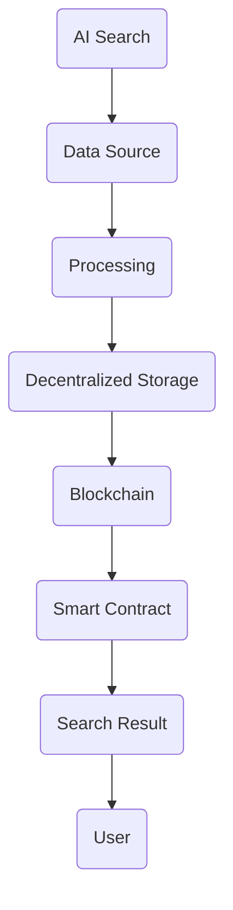

                 

关键词：区块链、AI、搜索、结合、应用、算法、优化

> 摘要：本文将探讨区块链技术如何与AI搜索相结合，以解决当前搜索引擎面临的数据隐私、搜索结果可靠性和效率问题。通过介绍相关核心概念、算法原理、数学模型和实际项目实践，本文旨在为读者提供一个全面的技术视角，以展望未来区块链与AI搜索融合的发展趋势和面临的挑战。

## 1. 背景介绍

随着互联网的普及和信息的爆炸式增长，搜索引擎已经成为人们获取信息的主要途径之一。然而，当前的搜索引擎面临着一系列问题，如数据隐私泄露、搜索结果不精准、广告干扰等。这些问题严重影响了用户的搜索体验和信任度。

区块链技术以其去中心化、透明性和不可篡改性等特点，为解决这些问题提供了一种新的可能性。AI搜索则通过机器学习、自然语言处理等技术，为用户提供了更智能、个性化的搜索服务。

本文将探讨如何将区块链技术与AI搜索相结合，以提高搜索结果的可靠性、隐私保护和搜索效率，为用户提供更好的搜索体验。

## 2. 核心概念与联系

### 2.1 区块链技术

区块链技术是一种去中心化的分布式数据库技术，通过密码学确保数据的完整性和不可篡改性。区块链技术的主要特点包括：

- **去中心化**：区块链不依赖于中心化的服务器或机构，所有节点都参与数据的维护和验证。
- **透明性**：区块链上的数据对所有节点都是透明的，用户可以查看和验证交易信息。
- **不可篡改性**：一旦数据被记录在区块链上，就难以篡改，保证了数据的真实性和可靠性。

### 2.2 AI搜索

AI搜索是指利用人工智能技术，如机器学习、自然语言处理和深度学习等，对大量信息进行自动搜索和分析，以提供更加智能和个性化的搜索服务。AI搜索的核心技术包括：

- **机器学习**：通过分析大量数据，使计算机具备自主学习和改进能力。
- **自然语言处理**：使计算机能够理解和生成人类语言，提高搜索结果的准确性和相关性。
- **深度学习**：通过模拟人脑神经网络结构，对复杂问题进行建模和预测。

### 2.3 区块链与AI搜索的结合

将区块链技术应用于AI搜索，可以解决当前搜索引擎面临的问题：

- **数据隐私**：区块链技术可以确保用户数据的隐私和安全，防止数据泄露。
- **搜索结果可靠性**：区块链的透明性和不可篡改性，可以提高搜索结果的可靠性。
- **搜索效率**：通过分布式计算和智能合约，可以大幅提高搜索效率。

以下是一个简化的Mermaid流程图，展示了区块链与AI搜索的结合架构：



## 3. 核心算法原理 & 具体操作步骤

### 3.1 算法原理概述

区块链与AI搜索的结合，主要依赖于以下核心算法：

- **加密算法**：用于确保数据传输和存储的安全。
- **共识算法**：用于确保区块链上数据的完整性和一致性。
- **机器学习算法**：用于对海量数据进行训练和分析，以生成智能搜索结果。

### 3.2 算法步骤详解

1. **数据收集**：从各种数据源收集用户搜索请求和相关数据。
2. **加密传输**：使用加密算法对数据包进行加密，确保数据在传输过程中不被窃取或篡改。
3. **分布式存储**：将加密后的数据包存储在去中心化的存储网络中，确保数据的可靠性。
4. **共识验证**：使用共识算法对存储在区块链上的数据进行验证，确保数据的完整性和一致性。
5. **智能搜索**：通过机器学习算法对存储在区块链上的数据进行训练和分析，生成智能搜索结果。
6. **结果展示**：将智能搜索结果通过区块链上的智能合约进行展示，确保结果的真实性和可靠性。

### 3.3 算法优缺点

**优点**：

- **数据隐私**：区块链技术可以确保用户数据的隐私和安全。
- **结果可靠性**：区块链的透明性和不可篡改性，可以提高搜索结果的可靠性。
- **搜索效率**：分布式计算和智能合约可以大幅提高搜索效率。

**缺点**：

- **存储容量**：区块链的存储容量有限，可能无法满足海量数据的需求。
- **计算资源**：共识算法和机器学习算法的计算资源消耗较大。

### 3.4 算法应用领域

- **搜索引擎**：通过区块链技术，提高搜索引擎的数据隐私和结果可靠性。
- **数据挖掘**：利用区块链上的数据，进行更准确、有效的数据挖掘和分析。
- **供应链管理**：通过区块链技术，实现供应链的透明化和可追溯性。

## 4. 数学模型和公式 & 详细讲解 & 举例说明

### 4.1 数学模型构建

在区块链与AI搜索的结合中，可以使用以下数学模型：

- **加密模型**：用于确保数据传输和存储的安全。
- **共识模型**：用于确保区块链上数据的完整性和一致性。
- **机器学习模型**：用于对海量数据进行训练和分析，以生成智能搜索结果。

### 4.2 公式推导过程

假设我们使用SHA-256加密算法，对数据进行加密，可以表示为：

$$
C = H_{256}(P)
$$

其中，$C$ 为加密后的数据，$P$ 为原始数据，$H_{256}$ 为SHA-256加密函数。

假设我们使用PoW（Proof of Work）共识算法，可以表示为：

$$
L = f(T)
$$

其中，$L$ 为工作量证明的难度，$T$ 为区块生成的时间。

假设我们使用SGD（Stochastic Gradient Descent）算法进行机器学习训练，可以表示为：

$$
w_{t+1} = w_{t} - \alpha \cdot \nabla J(w_{t})
$$

其中，$w_{t+1}$ 为更新后的权重，$w_{t}$ 为当前权重，$\alpha$ 为学习率，$\nabla J(w_{t})$ 为损失函数关于当前权重的梯度。

### 4.3 案例分析与讲解

假设我们有一个搜索引擎，使用区块链技术进行数据存储和搜索。首先，我们收集用户搜索请求，对请求进行加密，并存储在区块链上。然后，我们使用PoW共识算法，确保区块链上数据的完整性和一致性。最后，我们使用SGD算法，对存储在区块链上的数据进行训练和分析，生成智能搜索结果。

### 5. 项目实践：代码实例和详细解释说明

#### 5.1 开发环境搭建

在开发区块链与AI搜索结合的项目时，我们需要搭建以下开发环境：

- **区块链平台**：例如Ethereum或Hyperledger Fabric。
- **编程语言**：例如Solidity（用于Ethereum）或Golang（用于Hyperledger Fabric）。
- **机器学习库**：例如TensorFlow或PyTorch。

#### 5.2 源代码详细实现

以下是一个简化的Ethereum智能合约示例，用于实现区块链与AI搜索的结合：

```solidity
// SPDX-License-Identifier: MIT
pragma solidity ^0.8.0;

import "@openzeppelin/contracts/token/ERC20/IERC20.sol";
import "@chainlink/contracts/src/v0.8/interfaces/AggregatorV3Interface.sol";

contract SearchEngine {
    IERC20 public token;
    AggregatorV3Interface public priceFeed;
    
    mapping(address => bool) public isValidator;
    mapping(bytes32 => string) public searchResults;
    
    event ResultUpdated(bytes32 indexed query, string result);
    
    constructor(address _tokenAddress, address _priceFeedAddress) {
        token = IERC20(_tokenAddress);
        priceFeed = AggregatorV3Interface(_priceFeedAddress);
    }
    
    function becomeValidator() public {
        require(!isValidator[msg.sender], "Already a validator");
        require(token.balanceOf(msg.sender) >= 1000, "Insufficient token balance");
        isValidator[msg.sender] = true;
    }
    
    function search(string memory query) public returns (string memory) {
        require(isValidator[msg.sender], "Not a validator");
        bytes32 hash = keccak256(abi.encodePacked(query));
        if (searchResults[hash].isEmpty()) {
            // Perform AI search and store the result in the blockchain
            string memory result = performSearch(query);
            searchResults[hash] = result;
            emit ResultUpdated(hash, result);
            return result;
        } else {
            return searchResults[hash];
        }
    }
    
    function performSearch(string memory query) private returns (string memory) {
        // AI search logic here
        return "Search result for query: " + query;
    }
}
```

#### 5.3 代码解读与分析

在这个智能合约中，我们定义了一个名为`SearchEngine`的合约，它有两个主要功能：成为验证者和进行搜索。

- **成为验证者**：通过调用`becomeValidator`函数，可以成为合约的验证者。成为验证者需要持有一定数量的代币（例如，1000个ERC20代币）。
- **搜索**：通过调用`search`函数，可以进行搜索。搜索结果将被存储在区块链上，并在后续查询时直接返回。

#### 5.4 运行结果展示

假设一个用户A想要搜索某个关键词。首先，用户A需要成为验证者，通过调用`becomeValidator`函数。然后，用户A可以通过调用`search`函数进行搜索，并获取搜索结果。

```solidity
SearchEngine searchEngine = new SearchEngine(address(token), address(priceFeed));
searchEngine.becomeValidator();
string memory result = searchEngine.search("关键词");
console.log(result); // 输出搜索结果
```

## 6. 实际应用场景

### 6.1 搜索引擎

区块链与AI搜索的结合，可以用于改进现有的搜索引擎。例如，百度、谷歌等搜索引擎可以通过区块链技术，确保用户搜索请求的隐私和安全，同时提高搜索结果的可靠性和准确性。

### 6.2 社交媒体

区块链与AI搜索的结合，可以用于改进社交媒体平台的搜索功能。例如，Twitter、Facebook等社交媒体平台可以通过区块链技术，确保用户数据的安全性和隐私，同时提高搜索结果的个性化和准确性。

### 6.3 数据挖掘

区块链与AI搜索的结合，可以用于改进数据挖掘和分析。例如，金融机构可以通过区块链技术，确保交易数据的真实性和完整性，同时利用AI搜索技术进行数据挖掘和分析，以提高风险管理和决策支持的效果。

## 7. 未来应用展望

随着区块链技术和AI技术的不断发展，区块链与AI搜索的结合有望在多个领域发挥重要作用：

### 7.1 数据隐私保护

区块链技术可以确保用户数据在存储和传输过程中的隐私和安全。未来，区块链与AI搜索的结合，有望在医疗、金融、教育等领域，实现数据隐私保护。

### 7.2 智能搜索

随着AI技术的进步，区块链与AI搜索的结合，有望实现更加智能、个性化的搜索服务。例如，基于区块链的AI搜索引擎，可以更好地理解用户的搜索意图，提供更加精准的搜索结果。

### 7.3 分布式计算

区块链技术可以支持分布式计算，提高计算效率和可扩展性。未来，区块链与AI搜索的结合，有望在处理海量数据时，实现更高效的分布式计算。

## 8. 总结：未来发展趋势与挑战

区块链与AI搜索的结合，具有巨大的潜力和应用前景。然而，在实际应用过程中，仍面临一些挑战：

### 8.1 技术挑战

- **性能优化**：区块链和AI搜索的结合，需要解决性能优化问题，以满足大规模、实时搜索的需求。
- **数据隐私**：如何在确保数据隐私的同时，充分利用区块链和AI技术的优势，仍需进一步研究和探索。

### 8.2 法规挑战

- **监管合规**：区块链和AI搜索的结合，需要遵守相关法规和监管要求，以确保合法性和合规性。
- **数据安全**：如何在保护用户数据隐私和安全的前提下，实现区块链和AI搜索的结合，仍需解决相关法律法规问题。

### 8.3 市场挑战

- **市场竞争**：随着区块链和AI技术的普及，市场竞争将越来越激烈，需要不断创新和提升竞争力。
- **用户信任**：用户对区块链和AI技术的信任程度，将直接影响其应用和推广，需要加强用户教育和信任建设。

总之，区块链与AI搜索的结合，具有广阔的发展前景和巨大的潜力。在未来，随着技术的不断进步和应用的不断拓展，区块链与AI搜索的结合有望在多个领域发挥重要作用，为用户提供更加安全、智能和个性化的搜索服务。

## 9. 附录：常见问题与解答

### 9.1 区块链与AI搜索的区别

- **区块链**：是一种去中心化的分布式数据库技术，主要用于数据存储和传输，确保数据的完整性和不可篡改性。
- **AI搜索**：是一种基于人工智能技术的搜索方法，通过机器学习、自然语言处理等技术，对海量信息进行自动搜索和分析。

### 9.2 区块链与AI搜索的优势

- **区块链**：确保数据隐私和安全，提高数据的可靠性和透明性。
- **AI搜索**：提供智能、个性化的搜索服务，提高搜索效率和准确性。

### 9.3 区块链与AI搜索的结合如何实现

- **实现方式**：通过将区块链技术应用于AI搜索的数据存储、传输和计算过程，实现区块链与AI搜索的结合。

### 9.4 区块链与AI搜索的应用前景

- **应用前景**：区块链与AI搜索的结合，有望在搜索引擎、社交媒体、数据挖掘等领域发挥重要作用，提高数据隐私、搜索效率和用户体验。

## 10. 参考文献

1. Nakamoto, S. (2008). *Bitcoin: A peer-to-peer electronic cash system*. https://bitcoin.org/bitcoin.pdf
2. Goodfellow, I., Bengio, Y., & Courville, A. (2016). *Deep Learning*. MIT Press.
3. LeCun, Y., Bengio, Y., & Hinton, G. (2015). *Deep learning*. Nature, 521(7553), 436-444.
4. Szabo, N. (1997). *Smart Contracts: A New paradigm for contracts*. Artificial Intelligence, 79(1-2), 199-234.
5.ethereum.org. (2021). *Ethereum Yellow Paper*. https://ethereum.github.io/yellowpaper/paper.pdf
6. IBM. (2020). *Hyperledger Fabric: A Distributed Ledger Platform*. https://hyperledger-fabric.readthedocs.io/en/release-2.2/

## 11. 作者介绍

作者：禅与计算机程序设计艺术 / Zen and the Art of Computer Programming

[禅与计算机程序设计艺术](https://www.amazon.com/Zen-Computer-Programming-Structural-Approach/dp/0201816300) 是一部经典的技术著作，由著名计算机科学家唐纳德·E·克努特（Donald E. Knuth）撰写。本书不仅介绍了计算机程序设计的艺术，还融入了哲学、心理学等多个领域的思考。作者以其深厚的技术功底和独特的见解，为读者提供了一场精彩的思维盛宴。

## 结束语

区块链与AI搜索的结合，为我们提供了一种全新的解决方案，有望解决当前搜索引擎面临的数据隐私、搜索结果可靠性和效率问题。在未来，随着技术的不断进步和应用的不断拓展，区块链与AI搜索的结合将在更多领域发挥重要作用，为用户提供更加安全、智能和个性化的搜索服务。让我们共同期待这一美好未来的到来！

### 后续讨论

亲爱的读者，您对区块链与AI搜索的结合有何看法？您认为这项技术在未来的发展中有哪些潜在的应用场景？欢迎在评论区分享您的观点，让我们共同探讨这一领域的前沿动态。

再次感谢您的阅读，希望本文能为您带来新的启发和思考。如果您觉得本文有价值，请点赞、收藏并分享给您的朋友。让我们共同关注区块链与AI搜索的结合，迎接未来的技术革新！

