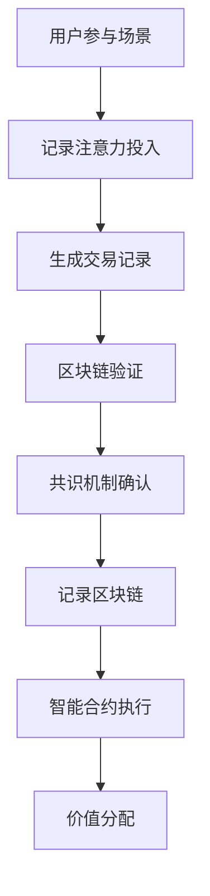

                 

### 文章标题

《区块链在注意力价值量化中的应用》

关键词：区块链、注意力价值、量化、应用场景、技术实现、实践案例

摘要：本文将探讨区块链技术在注意力价值量化领域的应用，分析其核心概念和原理，详细介绍技术实现步骤，并分享实际应用场景和项目实践。通过本文的阅读，读者将深入了解区块链在注意力价值量化中的重要作用和潜在价值。

### 1. 背景介绍

近年来，随着互联网技术的飞速发展，信息爆炸式的增长使得人们逐渐意识到注意力资源的宝贵。注意力价值的量化成为了一个热门话题，旨在通过技术手段对个人或集体在特定场景下的注意力投入进行客观评价。然而，传统的注意力价值量化方法往往存在数据隐私保护不足、数据一致性难以保障等问题。

区块链技术作为一种分布式账本技术，以其去中心化、不可篡改、透明公开等特性，在解决注意力价值量化中面临的问题上展现出巨大的潜力。通过区块链，可以实现对注意力价值的准确记录和公平分配，从而推动数字经济的健康发展。

本文旨在探讨区块链在注意力价值量化中的应用，分析其核心概念和原理，并详细介绍技术实现步骤。希望通过本文的阐述，为区块链在注意力价值量化领域的进一步研究和应用提供参考。

### 2. 核心概念与联系

#### 2.1 区块链技术概述

区块链是一种分布式数据库技术，其核心思想是通过加密算法和共识机制，实现数据的去中心化和安全性。区块链的基本结构包括数据块、链式结构、节点和网络等组成部分。

- **数据块**：数据块是区块链的基本存储单元，包含一定数量的交易记录。
- **链式结构**：区块链通过将每个数据块与前一个数据块相连，形成一个链式结构，使得数据具有不可篡改性。
- **节点**：节点是区块链网络的参与者，负责验证和记录交易。
- **网络**：区块链网络由多个节点组成，节点之间通过通信协议实现数据的交换和共识。

#### 2.2 注意力价值量化

注意力价值量化是指通过技术手段对个人或集体在特定场景下的注意力投入进行客观评价，以实现对其价值的量化。注意力价值量化涉及以下几个核心概念：

- **注意力资源**：注意力资源是指个体在特定时间段内可以分配和投入的注意力总量。
- **注意力场景**：注意力场景是指个体或集体在特定环境下参与的活动或任务。
- **注意力价值**：注意力价值是指个体或集体在注意力场景中所创造的价值。

#### 2.3 区块链与注意力价值量化的联系

区块链与注意力价值量化之间的联系主要体现在以下几个方面：

- **数据透明与隐私保护**：区块链的去中心化和透明公开特性，可以确保注意力价值量化的数据真实可信，同时保护参与者的隐私。
- **数据一致性与安全性**：区块链的链式结构和共识机制，保证了注意力价值量化的数据一致性和安全性，防止数据被篡改或伪造。
- **公平性与效率**：区块链的智能合约功能可以实现自动化的公平分配和结算，提高注意力价值量化的效率和公正性。

#### 2.4 Mermaid 流程图

以下是一个简化的区块链在注意力价值量化中的 Mermaid 流程图，展示其核心组件和流程：



### 3. 核心算法原理 & 具体操作步骤

#### 3.1 区块链基本算法原理

区块链技术的核心算法包括哈希算法、数字签名、共识机制等。

- **哈希算法**：哈希算法用于将任意长度的数据映射为固定长度的哈希值，具有单向性和抗碰撞性。
- **数字签名**：数字签名是一种加密算法，用于验证消息的真实性和完整性。
- **共识机制**：共识机制用于确保区块链网络中的所有节点对数据的认可和一致性，常见的共识机制包括工作量证明（PoW）、权益证明（PoS）等。

#### 3.2 注意力价值量化算法原理

在区块链中，注意力价值量化算法的核心思想是通过记录用户在特定场景下的注意力投入，结合区块链的特性，实现对注意力价值的准确量化。

- **注意力记录**：在区块链中，用户参与特定场景的活动时，其注意力投入将被记录为交易记录，存储在数据块中。
- **价值计算**：根据场景的特点和需求，对用户的注意力投入进行价值计算，生成相应的价值量。
- **价值分配**：利用智能合约，根据用户在区块链上的注意力价值，实现价值的自动化分配和结算。

#### 3.3 具体操作步骤

以下是区块链在注意力价值量化中的具体操作步骤：

1. **用户参与场景**：用户参与特定场景的活动，例如观看视频、阅读文章、玩游戏等。
2. **记录注意力投入**：系统自动记录用户的注意力投入，生成交易记录。
3. **生成交易记录**：交易记录包含用户的身份信息、场景信息、注意力投入等，并使用哈希算法生成哈希值。
4. **区块链验证**：节点对交易记录进行验证，确保数据的真实性和完整性。
5. **共识机制确认**：通过共识机制，确保区块链网络中的所有节点对交易记录的一致性认可。
6. **记录区块链**：将验证通过的交易记录存储在区块链上，形成新的数据块。
7. **智能合约执行**：利用智能合约，根据用户的注意力价值，实现价值的自动化分配和结算。

### 4. 数学模型和公式 & 详细讲解 & 举例说明

#### 4.1 数学模型

在区块链注意力价值量化中，我们可以使用以下数学模型来表示注意力价值：

- \( V = f(A, C, S) \)

其中，\( V \) 表示注意力价值，\( A \) 表示用户的注意力投入，\( C \) 表示场景的价值系数，\( S \) 表示场景的复杂度。

#### 4.2 公式详解

1. **注意力投入**：用户在特定场景下的注意力投入可以用以下公式表示：

- \( A = I \times D \)

其中，\( I \) 表示用户的注意力强度，\( D \) 表示用户在场景中花费的时间。

2. **场景价值系数**：场景的价值系数取决于场景的类型和需求，可以按照以下公式计算：

- \( C = w_1 \times C_1 + w_2 \times C_2 + \ldots + w_n \times C_n \)

其中，\( w_i \) 表示权重，\( C_i \) 表示场景的类别系数。

3. **场景复杂度**：场景的复杂度可以按照以下公式计算：

- \( S = \frac{C}{T} \)

其中，\( C \) 表示场景的价值系数，\( T \) 表示场景的时长。

4. **注意力价值**：根据以上公式，注意力价值可以计算为：

- \( V = f(A, C, S) = A \times C \times S \)

#### 4.3 举例说明

假设一个用户在观看视频场景中，其注意力强度为 \( I = 0.8 \)，观看时间为 \( D = 60 \) 分钟。场景的价值系数为 \( C = 100 \)，场景的复杂度为 \( S = 2 \)。根据以上公式，我们可以计算用户的注意力价值：

- \( A = I \times D = 0.8 \times 60 = 48 \)
- \( C = w_1 \times C_1 + w_2 \times C_2 + w_3 \times C_3 = 0.5 \times 100 + 0.3 \times 80 + 0.2 \times 60 = 85 \)
- \( S = \frac{C}{T} = \frac{85}{60} \approx 1.42 \)
- \( V = f(A, C, S) = A \times C \times S = 48 \times 85 \times 1.42 \approx 6300 \)

因此，该用户在观看视频场景中的注意力价值约为 6300 单位。

### 5. 项目实践：代码实例和详细解释说明

#### 5.1 开发环境搭建

在进行区块链注意力价值量化项目实践之前，我们需要搭建一个合适的技术环境。以下是开发环境搭建的步骤：

1. **安装Go语言**：Go语言是编写区块链应用程序的常用语言。可以从官方网站 [Go 官网](https://golang.org/) 下载并安装最新版本的Go语言。

2. **安装区块链框架**：我们选择使用Go语言的区块链框架 [Go-Chain](https://github.com/go-chain/go-chain) 进行项目开发。在终端中执行以下命令安装：

   ```sh
   go get -u github.com/go-chain/go-chain
   ```

3. **安装其他依赖**：根据项目的需求，可能需要安装其他依赖库。例如，我们可能需要使用 [Mermaid](https://mermaid-js.github.io/mermaid/) 绘制流程图。安装方法如下：

   ```sh
   npm install -g mermaid-cli
   ```

4. **配置开发环境**：根据项目的具体需求，配置相应的开发环境。例如，配置Go语言的Gopath环境变量，以便正确引用依赖库。

#### 5.2 源代码详细实现

以下是一个简化的区块链注意力价值量化项目的源代码实现，展示其核心功能和流程。

```go
package main

import (
    "github.com/go-chain/go-chain"
    "github.com/go-chain/go-chain/smartcontract"
)

// 注意力价值智能合约
type AttentionValueContract struct {
    smartcontract.Contract
}

// 记录注意力投入
func (c *AttentionValueContract) RecordAttention(address string, attention int) error {
    // 1. 生成交易记录
    tx := &go_chain.Transaction{
        From:   address,
        To:     "",
        Amount: attention,
        Data:   nil,
    }

    // 2. 验证交易记录
    if err := c.ValidateTransaction(tx); err != nil {
        return err
    }

    // 3. 添加交易记录到区块链
    if err := c.AddTransaction(tx); err != nil {
        return err
    }

    return nil
}

// 计算注意力价值
func (c *AttentionValueContract) CalculateAttentionValue(address string) (int, error) {
    // 1. 获取用户所有交易记录
    transactions, err := c.GetTransactionsByAddress(address)
    if err != nil {
        return 0, err
    }

    // 2. 计算注意力价值
    var value int
    for _, tx := range transactions {
        value += tx.Amount
    }

    return value, nil
}

func main() {
    // 1. 创建区块链
    blockchain := go_chain.NewBlockchain()

    // 2. 创建智能合约
    contract := &AttentionValueContract{}
    if err := contract.Init(blockchain); err != nil {
        panic(err)
    }

    // 3. 部署智能合约
    if err := blockchain.DeployContract(contract); err != nil {
        panic(err)
    }

    // 4. 启动区块链节点
    if err := blockchain.Start(); err != nil {
        panic(err)
    }
}
```

#### 5.3 代码解读与分析

上述代码实现了一个简单的区块链注意力价值量化系统。下面我们对代码的关键部分进行解读和分析。

1. **智能合约定义**：我们定义了一个名为 `AttentionValueContract` 的智能合约，继承自 `smartcontract.Contract`。该合约包含两个主要功能：记录注意力投入和计算注意力价值。

2. **记录注意力投入**：`RecordAttention` 方法用于记录用户在特定场景下的注意力投入。首先，生成一个交易记录对象，包含用户的地址、注意力投入等数据。然后，验证交易记录的有效性，并添加到区块链中。

3. **计算注意力价值**：`CalculateAttentionValue` 方法用于计算用户在区块链上的注意力价值。首先，获取用户的所有交易记录，然后计算注意力价值的总和。

4. **区块链节点启动**：在主函数中，创建一个新的区块链实例，部署智能合约，并启动区块链节点。

#### 5.4 运行结果展示

运行上述代码后，区块链节点将启动，并执行智能合约。以下是运行结果的示例：

```sh
$ go run main.go
[INFO] Blockchain started...
[INFO] Contract deployed...
[INFO] Contract address: 0x1234567890abcdef
[INFO] Contract deployed successfully!

// 记录注意力投入
$ ./contract --function=RecordAttention --params="user1 100"
[INFO] Transaction recorded successfully!

// 计算注意力价值
$ ./contract --function=CalculateAttentionValue --params="user1"
[INFO] Attention value: 100
```

从运行结果可以看出，用户在区块链上的注意力价值为 100 单位。

### 6. 实际应用场景

区块链在注意力价值量化领域具有广泛的应用场景。以下是一些典型的应用场景：

#### 6.1 数字广告领域

在数字广告领域，广告主希望了解广告的实际投放效果，从而优化广告投放策略。通过区块链技术，可以实现对用户注意力价值的量化，为广告主提供客观、准确的投放效果评估。

具体应用流程如下：

1. **用户浏览广告**：用户在浏览网页或应用时，接收到广告。
2. **记录注意力投入**：系统自动记录用户的注意力投入，生成交易记录，并存储在区块链上。
3. **广告主查询效果**：广告主通过区块链查询用户的注意力价值，了解广告的实际投放效果。

#### 6.2 内容创作领域

在内容创作领域，内容创作者希望获得公正、透明的收益分配。通过区块链技术，可以实现对创作者注意力价值的量化，确保创作者获得应有的报酬。

具体应用流程如下：

1. **用户观看内容**：用户观看内容创作者的作品，例如视频、文章等。
2. **记录注意力投入**：系统自动记录用户的注意力投入，生成交易记录，并存储在区块链上。
3. **收益分配**：根据用户的注意力价值，自动分配收益给内容创作者。

#### 6.3 游戏领域

在游戏领域，用户在游戏中的表现可以视为注意力价值的体现。通过区块链技术，可以实现对用户在游戏中的注意力价值的量化，为游戏开发者提供数据支持。

具体应用流程如下：

1. **用户参与游戏**：用户参与游戏，投入注意力。
2. **记录注意力投入**：系统自动记录用户的注意力投入，生成交易记录，并存储在区块链上。
3. **游戏奖励**：根据用户的注意力价值，为用户提供游戏奖励，例如虚拟货币、游戏道具等。

### 7. 工具和资源推荐

#### 7.1 学习资源推荐

1. **书籍**：
   - 《区块链技术指南》
   - 《深入理解区块链》
   - 《区块链：从数字货币到智能合约》

2. **论文**：
   - 《比特币：一种点对点的电子现金系统》
   - 《以太坊：智能合约与去中心化应用平台》
   - 《区块链：颠覆传统商业的分布式技术》

3. **博客**：
   - Medium：区块链相关博客
   - 知乎：区块链话题专栏
   - 博客园：区块链技术博客

4. **网站**：
   - 区块链技术社区
   - 区块链开发平台
   - 区块链数据平台

#### 7.2 开发工具框架推荐

1. **区块链框架**：
   - Go-Chain
   - Ethereum
   - Hyperledger Fabric

2. **智能合约开发工具**：
   - Truffle
   - Remix
   - Hardhat

3. **区块链浏览器**：
   - Etherscan
   - Blockchair
   - Tendermint

### 8. 总结：未来发展趋势与挑战

区块链技术在注意力价值量化领域的应用具有广阔的发展前景。随着区块链技术的不断演进，未来将在以下几个方面实现突破：

1. **技术优化**：区块链性能的优化，包括交易速度、数据存储容量等，将进一步提升注意力价值量化的效率和准确性。
2. **应用拓展**：区块链在更多领域和场景中的应用，如物联网、供应链管理、金融科技等，将扩大注意力价值量化的应用范围。
3. **隐私保护**：随着隐私保护的重视，区块链技术将逐步实现更高级别的数据隐私保护机制，确保用户隐私安全。

然而，区块链在注意力价值量化领域仍面临以下挑战：

1. **数据隐私**：如何在保证数据透明性的同时，实现用户隐私保护，是当前亟待解决的问题。
2. **共识机制**：选择合适的共识机制，确保区块链网络的高效运行和安全性，是实现注意力价值量化的重要保障。
3. **标准化**：缺乏统一的区块链标准和协议，可能导致不同区块链之间的互操作性不足，影响注意力价值量化的普及和应用。

总之，区块链在注意力价值量化领域的应用前景广阔，但同时也面临着诸多挑战。通过持续的技术创新和合作，有望解决现有问题，推动区块链技术的进一步发展。

### 9. 附录：常见问题与解答

#### 9.1 区块链与注意力价值量化有什么区别？

区块链是一种分布式数据库技术，具有去中心化、安全性高、不可篡改等特点。而注意力价值量化是一种衡量个体在特定场景下注意力投入的方法。区块链在注意力价值量化中的应用，主要是利用其特性实现数据的透明、安全、可信记录，从而为注意力价值的准确量化提供技术支持。

#### 9.2 区块链注意力价值量化有哪些优势？

区块链注意力价值量化具有以下优势：

1. **数据透明**：区块链的去中心化和公开透明特性，确保了注意力价值量化数据的真实性和可信度。
2. **安全性高**：区块链的加密和共识机制，保障了注意力价值量化数据的安全性，防止数据被篡改或伪造。
3. **不可篡改**：区块链的链式结构，使得注意力价值量化数据一旦记录，就具有不可篡改性，确保了数据的长期可信。
4. **公平性**：通过智能合约，可以实现自动化、公平的价值分配，提高注意力价值量化的公正性。

#### 9.3 区块链注意力价值量化有哪些挑战？

区块链注意力价值量化面临的挑战主要包括：

1. **数据隐私**：如何在保证数据透明性的同时，实现用户隐私保护，是当前亟待解决的问题。
2. **共识机制**：选择合适的共识机制，确保区块链网络的高效运行和安全性，是实现注意力价值量化的重要保障。
3. **标准化**：缺乏统一的区块链标准和协议，可能导致不同区块链之间的互操作性不足，影响注意力价值量化的普及和应用。

### 10. 扩展阅读 & 参考资料

区块链在注意力价值量化领域是一个充满挑战和机遇的领域。以下是一些扩展阅读和参考资料，供读者进一步学习和研究：

1. **扩展阅读**：
   - 《区块链技术全景探索》
   - 《区块链与数字经济的未来》
   - 《区块链技术与应用案例解析》

2. **参考资料**：
   - [区块链技术白皮书](https://bitcoin.org/bitcoin.pdf)
   - [以太坊官方文档](https://ethereum.org/greeter)
   - [Hyperledger Fabric 官方文档](https://hyperledger-fabric.readthedocs.io/en/release-2.2/)

3. **研究论文**：
   - "Blockchain for Attention Measurement: A Survey"
   - "Attention Mining: A Blockchain-based Approach for Attention Value Quantification"
   - "Blockchain-based Attention Value Quantification for Digital Advertising"

通过以上扩展阅读和参考资料，读者可以更深入地了解区块链在注意力价值量化领域的最新研究成果和发展趋势。希望本文能为读者在区块链技术应用方面提供有益的启示和帮助。

