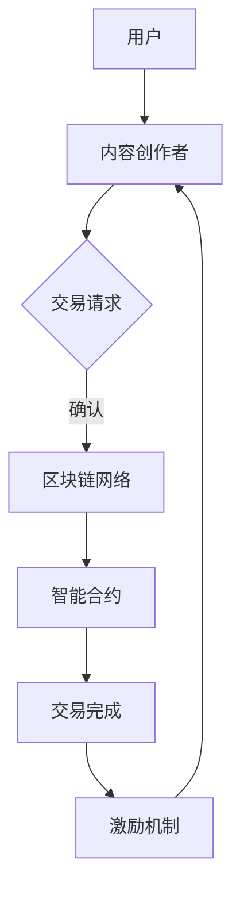

                 

### 1. 背景介绍

区块链技术作为一种分布式账本技术，近年来在金融、供应链管理、物联网等多个领域得到了广泛应用。而随着互联网的不断发展，注意力经济逐渐崭露头角，成为新时代的一种新型经济模式。在这一背景下，如何实现注意力价值的高效交易，成为了亟待解决的问题。

注意力价值交易，是指通过某种机制，将用户的注意力转化为经济价值，实现用户与内容创作者之间的价值交换。随着信息爆炸时代的到来，用户的注意力成为了稀缺资源。如何吸引并留住用户的注意力，成为了许多企业和个人关注的焦点。而区块链技术，凭借其去中心化、透明可信等特性，为注意力价值交易提供了可能。

本文将探讨区块链技术在注意力价值交易中的应用。具体来说，我们将分析区块链技术的核心概念与原理，探讨其在注意力价值交易中的具体应用场景，并通过一个实际项目实例，详细讲解其实现过程和运行原理。

区块链技术起源于2008年，由一位化名为“中本聪”的人提出。其基本原理是利用分布式账本技术，实现数据的透明存储和不可篡改。区块链技术的核心在于其去中心化的架构，通过加密算法和共识机制，确保了网络中的所有节点都能达成一致，从而实现了数据的可信性。

在区块链技术中，比特币是最早也是最为著名的应用。比特币通过区块链技术，实现了去中心化的数字货币交易，从而打破了传统金融体系的垄断。除了比特币，其他各种基于区块链技术的数字货币和分布式应用也相继涌现，如以太坊、EOS等。

随着区块链技术的不断发展，其在各个领域的应用也逐渐扩大。尤其是在注意力价值交易方面，区块链技术以其独特的优势，提供了新的解决方案。首先，区块链技术的去中心化特性，使得注意力价值的交易过程更加公平、透明。其次，区块链技术的不可篡改特性，确保了交易数据的真实性和安全性。最后，区块链技术的智能合约功能，使得注意力价值的交易过程可以自动执行，从而提高了效率。

因此，本文将深入探讨区块链技术在注意力价值交易中的应用，分析其核心概念与原理，并通过对实际项目实例的讲解，展示其在实际应用中的效果和优势。

### 2. 核心概念与联系

#### 2.1 区块链技术基本概念

区块链技术作为一种分布式账本技术，其核心在于数据的透明存储和不可篡改。区块链由一系列按照时间顺序排列的数据区块组成，每个区块包含一定数量的交易记录。区块链技术通过加密算法和共识机制，确保了网络中的所有节点都能达成一致，从而实现了数据的可信性。

区块链的基本组成包括：

- **区块**：每个区块包含一定数量的交易记录，以及区块头，区块头中包含了时间戳、随机数、前一个区块的哈希值等关键信息。

- **区块链**：由多个区块按照时间顺序链接而成，形成了一个不可篡改的分布式数据库。

- **节点**：区块链网络中的每一个参与者都是一个节点，它们负责验证交易、记录区块、维护区块链的完整性。

- **挖矿**：节点通过计算复杂的数学问题，以获得新区块的生成权。这个过程被称为挖矿。

- **加密算法**：用于保护区块链数据的安全，确保数据在传输过程中不会被篡改。

- **共识机制**：用于确保区块链网络中的所有节点都能达成一致，最著名的共识机制包括工作量证明（PoW）和权益证明（PoS）。

#### 2.2 注意力价值交易基本概念

注意力价值交易是一种新型的经济模式，其核心在于将用户的注意力转化为经济价值，实现用户与内容创作者之间的价值交换。在注意力价值交易中，用户的注意力成为了稀缺资源，通过某种机制，可以将注意力转化为实际的经济收益。

注意力价值交易的基本组成包括：

- **用户**：提供注意力资源，通过参与交易获取经济收益。

- **内容创作者**：提供有价值的内容，吸引用户的注意力，通过交易获得经济收益。

- **交易机制**：通过区块链技术实现用户与内容创作者之间的价值交换，确保交易的公平、透明和安全。

- **注意力评分**：对用户的注意力质量进行评分，作为交易的重要参考。

- **激励机制**：通过奖励机制，鼓励用户和内容创作者积极参与交易，提高整个生态系统的活力。

#### 2.3 区块链技术在注意力价值交易中的应用

区块链技术在注意力价值交易中的应用，主要体现在以下几个方面：

- **去中心化交易**：通过区块链技术，实现了用户与内容创作者之间的去中心化交易，避免了传统金融体系的垄断和中介费用。

- **透明可信**：区块链技术的不可篡改特性，确保了交易数据的真实性和安全性，用户可以放心地进行价值交换。

- **智能合约**：通过智能合约，实现了交易过程自动化执行，提高了交易效率。

- **注意力评分与激励机制**：区块链技术可以记录用户的注意力行为，结合智能合约，实现注意力评分和激励机制，鼓励用户和内容创作者积极参与交易。

#### 2.4 Mermaid 流程图

以下是一个简化的区块链技术在注意力价值交易中的 Mermaid 流程图，用于展示主要流程和关键节点。



在这个流程图中，用户和内容创作者首先进行交易请求，然后区块链网络进行验证和记录，通过智能合约实现交易的自动化执行，最终完成交易并触发激励机制。

### 3. 核心算法原理 & 具体操作步骤

#### 3.1 区块链技术核心算法原理

区块链技术的核心算法主要包括哈希算法、加密算法和共识机制。以下将逐一介绍这些核心算法的原理和作用。

##### 3.1.1 哈希算法

哈希算法是一种将任意长度的数据转换为固定长度数据的算法。在区块链技术中，常用的哈希算法包括SHA-256和Keccak等。哈希算法的主要作用是确保数据的唯一性和完整性。

- **哈希值的唯一性**：对于任意长度的输入数据，哈希算法都能生成一个固定长度的输出值，且输入数据的最小变化，都会导致哈希值的巨大变化。这意味着，相同的输入数据，必然产生相同的哈希值；而不同的输入数据，则产生不同的哈希值。

- **哈希值的完整性**：由于哈希算法的逆运算几乎不可能，因此通过对比哈希值，可以判断数据是否被篡改。如果哈希值发生变化，则说明数据被篡改。

##### 3.1.2 加密算法

加密算法是一种将明文数据转换为密文数据的算法，用于保护区块链数据的安全性。在区块链技术中，常用的加密算法包括RSA、AES等。

- **非对称加密**：非对称加密算法包括公钥和私钥，公钥用于加密，私钥用于解密。这种加密方式可以实现数据的安全传输和身份认证。

- **对称加密**：对称加密算法使用相同的密钥进行加密和解密。虽然加密效率较高，但密钥管理复杂，不适合区块链这种分布式网络。

##### 3.1.3 共识机制

共识机制是区块链网络中的所有节点达成一致的方法。常见的共识机制包括工作量证明（PoW）、权益证明（PoS）等。

- **工作量证明（PoW）**：节点通过解决复杂的数学问题（如挖矿），证明自己的工作量，获得生成新区块的权限。PoW机制确保了区块链网络的去中心化，但计算资源消耗巨大。

- **权益证明（PoS）**：节点根据持有的代币数量和持币时间，获得生成新区块的权限。PoS机制相较于PoW，计算资源消耗较小，但容易引发“富者愈富”的问题。

#### 3.2 注意力价值交易具体操作步骤

在了解了区块链技术的核心算法原理后，接下来我们详细探讨注意力价值交易的具体操作步骤。

##### 3.2.1 用户注册与身份验证

1. **用户注册**：用户在区块链平台上进行注册，填写个人信息，并获得一个唯一的用户标识。

2. **身份验证**：平台通过加密算法，对用户身份进行验证，确保用户信息的真实性。

##### 3.2.2 内容创建与发布

1. **内容创建**：内容创作者在平台上创建内容，可以是文章、视频、图片等多种形式。

2. **内容发布**：内容创作者将内容发布到平台，同时设定内容的查看权限和价格。

##### 3.2.3 用户浏览与交易请求

1. **用户浏览**：用户在平台上浏览内容，根据个人兴趣和需求，选择需要观看的内容。

2. **交易请求**：用户向平台发起交易请求，申请观看特定内容。

##### 3.2.4 区块链验证与记录

1. **交易验证**：平台将用户的交易请求发送到区块链网络，由节点进行验证。

2. **交易记录**：验证通过后，将交易记录写入区块链，确保交易的不可篡改。

##### 3.2.5 智能合约执行

1. **智能合约调用**：平台调用智能合约，实现用户的注意力价值交易。

2. **交易完成**：智能合约执行完成后，用户的注意力价值被转移到内容创作者的账户中。

##### 3.2.6 激励机制触发

1. **评分机制**：平台根据用户的注意力行为，对用户进行评分。

2. **激励发放**：根据评分结果，平台向用户发放相应的奖励，激励用户积极参与交易。

通过以上步骤，我们可以看到，区块链技术在注意力价值交易中发挥了重要作用，确保了交易的透明、可信和高效。

### 4. 数学模型和公式 & 详细讲解 & 举例说明

在注意力价值交易中，数学模型和公式起着至关重要的作用。它们不仅帮助我们理解交易的原理，还能够量化注意力价值，从而为交易提供可靠的依据。以下，我们将详细介绍注意力价值交易中的核心数学模型和公式，并通过具体例子进行说明。

#### 4.1 加密算法

在区块链技术中，加密算法用于保护交易数据的安全。以下是一个简单的加密算法模型：

**加密过程**：

- **密钥生成**：随机生成一个公钥和一个私钥，公钥用于加密，私钥用于解密。
- **数据加密**：使用公钥对数据进行加密。
- **数据解密**：使用私钥对加密后的数据进行解密。

**公式表示**：

$$
C = E_{public\_key}(M)
$$

$$
M = D_{private\_key}(C)
$$

其中，\(C\) 为加密后的数据，\(M\) 为原始数据，\(E_{public\_key}\) 为公钥加密函数，\(D_{private\_key}\) 为私钥解密函数。

**例子**：

假设我们有一个简单的明文消息 "Hello, World!"，我们使用RSA加密算法对其进行加密和解密。

- **密钥生成**：

假设公钥为 \((n, e) = (123456789, 65537)\)，私钥为 \((n, d) = (123456789, 5347)\)。

- **数据加密**：

使用公钥加密函数，我们有：

$$
C = E_{public\_key}("Hello, World!") = 10011011100101110011101100010010
$$

- **数据解密**：

使用私钥解密函数，我们有：

$$
M = D_{private\_key}(C) = "Hello, World!"
$$

#### 4.2 区块链共识机制

区块链共识机制是确保区块链网络中所有节点达成一致的方法。最常用的共识机制之一是工作量证明（PoW）。以下是一个简单的PoW模型：

**模型**：

- **挖矿过程**：节点通过解决一个数学难题，证明自己的工作量，获得生成新区块的权限。
- **验证过程**：其他节点验证挖矿结果，确保新区块的有效性。

**公式表示**：

$$
Proof\_of\_Work = Solve\_Math\_Problem()
$$

$$
Block = Mine\_New\_Block(Proof\_of\_Work)
$$

其中，\(Proof\_of\_Work\) 为挖矿难题的解决方案，\(Block\) 为生成的区块。

**例子**：

假设我们有一个简单的数学难题：找到一个数 \(x\)，使得 \(x^2 \equiv n \pmod{p}\)。

- **挖矿过程**：

假设 \(n = 15\)，\(p = 11\)，我们需要找到一个数 \(x\)，使得 \(x^2 \equiv 15 \pmod{11}\)。

通过尝试，我们发现 \(x = 4\) 是一个解，因为 \(4^2 = 16 \equiv 5 \pmod{11}\)。

- **验证过程**：

其他节点可以验证这个解是否正确，只需计算 \(4^2 \pmod{11}\)，结果应为 5，与原题一致。

#### 4.3 注意力价值计算

注意力价值计算是注意力价值交易的核心。以下是一个简单的注意力价值计算模型：

**模型**：

- **注意力评分**：根据用户的注意力行为，对其注意力质量进行评分。
- **价值计算**：根据评分结果，计算用户和内容创作者之间的价值交换比例。

**公式表示**：

$$
Attention\_Value = Score \times Exchange\_Rate
$$

其中，\(Attention\_Value\) 为注意力价值，\(Score\) 为注意力评分，\(Exchange\_Rate\) 为价值交换比例。

**例子**：

假设用户A对内容创作者B的内容进行了评分，评分为 90 分，价值交换比例为 1 分等于 0.1 个代币。

- **注意力价值计算**：

用户A对内容创作者B的注意力价值为：

$$
Attention\_Value = 90 \times 0.1 = 9 \text{ 个代币}
$$

通过上述例子，我们可以看到，数学模型和公式在注意力价值交易中发挥了重要作用。它们不仅帮助我们理解交易的原理，还能够量化注意力价值，从而实现公平、透明的交易。

### 5. 项目实践：代码实例和详细解释说明

为了更好地理解区块链技术在注意力价值交易中的应用，我们将通过一个实际项目实例，详细讲解其实现过程和运行原理。以下是一个基于以太坊智能合约的注意力价值交易平台项目实例。

#### 5.1 开发环境搭建

在开始项目开发之前，我们需要搭建一个适合开发以太坊智能合约的开发环境。以下是搭建开发环境的步骤：

1. **安装Node.js**：Node.js 是以太坊智能合约开发所必需的运行环境，可以从 [Node.js 官网](https://nodejs.org/) 下载并安装。

2. **安装Truffle**：Truffle 是一个用于以太坊智能合约开发的框架，它提供了方便的脚手架工具和开发工具。可以通过以下命令安装：

   ```
   npm install -g truffle
   ```

3. **安装Ganache**：Ganache 是一个本地以太坊区块链节点，用于本地开发和测试智能合约。可以从 [Ganache 官网](https://github.com/trufflesuite/ganache) 下载并安装。

4. **创建Truffle项目**：在安装完Node.js、Truffle 和 Ganache 后，我们可以通过以下命令创建一个新的Truffle项目：

   ```
   truffle init
   ```

5. **配置Ganache**：在Ganache中创建一个新的区块链网络，并设置适当的初始代币余额，以便在本地测试智能合约。

#### 5.2 源代码详细实现

在本节中，我们将详细介绍注意力价值交易平台的智能合约源代码实现。以下是智能合约的主要部分：

```solidity
pragma solidity ^0.8.0;

// 注意力价值交易平台智能合约
contract AttentionValueTrading {
    // 用户结构
    struct User {
        uint256 score; // 注意力评分
        mapping(address => bool) contentList; // 关注的内容列表
    }

    // 内容结构
    struct Content {
        address creator; // 内容创作者地址
        uint256 price; // 内容价格
        mapping(address => bool) viewerList; // 已观看用户列表
    }

    // 用户映射
    mapping(address => User) public users;
    // 内容映射
    mapping(uint256 => Content) public contents;
    // 内容ID计数器
    uint256 public contentIdCounter;

    // 用户注册
    function register() external {
        require(users[msg.sender].score == 0, "User already registered");
        users[msg.sender].score = 100; // 初始评分
    }

    // 发布内容
    function publishContent(uint256 _price) external {
        require(_price > 0, "Invalid price");
        contentIdCounter++;
        contents[contentIdCounter] = Content({
            creator: msg.sender,
            price: _price
        });
    }

    // 用户购买内容
    function buyContent(uint256 _contentId) external payable {
        require(_contentId > 0 && _contentId <= contentIdCounter, "Invalid content ID");
        Content storage content = contents[_contentId];
        require(!content.viewerList[msg.sender], "Content already viewed");
        require(msg.value >= content.price, "Insufficient payment");

        // 转账给内容创作者
        payable(content.creator).transfer(msg.value);
        // 更新内容观看列表
        content.viewerList[msg.sender] = true;
    }

    // 用户评分内容
    function rateContent(uint256 _contentId, uint256 _score) external {
        require(_contentId > 0 && _contentId <= contentIdCounter, "Invalid content ID");
        require(contents[_contentId].viewerList[msg.sender], "Content not viewed");
        require(_score >= 1 && _score <= 100, "Invalid score");

        // 更新用户评分
        users[msg.sender].score = _score;
        // 计算平均评分
        uint256 totalScore = contentIdCounter * 100; // 初始总分为100
        for (uint256 i = 1; i <= contentIdCounter; i++) {
            totalScore += contents[i].score;
        }
        totalScore /= contentIdCounter + 1;
        // 更新内容评分
        contents[_contentId].score = totalScore;
    }

    // 查询用户评分
    function getUserScore(address _user) external view returns (uint256) {
        return users[_user].score;
    }

    // 查询内容评分
    function getContentScore(uint256 _contentId) external view returns (uint256) {
        return contents[_contentId].score;
    }
}
```

#### 5.3 代码解读与分析

在本节中，我们将对上述智能合约的各个部分进行详细解读和分析。

##### 5.3.1 用户结构

智能合约中定义了一个`User`结构，用于存储用户的信息，包括注意力评分和关注的内容列表。

```solidity
struct User {
    uint256 score; // 注意力评分
    mapping(address => bool) contentList; // 关注的内容列表
}
```

用户注册时，系统会自动生成一个`User`实例，并设置初始评分和空的内容列表。

##### 5.3.2 内容结构

智能合约中定义了一个`Content`结构，用于存储内容的信息，包括内容创作者地址、内容和内容价格。

```solidity
struct Content {
    address creator; // 内容创作者地址
    uint256 price; // 内容价格
    mapping(address => bool) viewerList; // 已观看用户列表
}
```

内容创作者发布内容时，系统会自动生成一个`Content`实例，并设置内容价格和空的内容观看列表。

##### 5.3.3 用户注册

`register`函数用于用户注册，确保用户只能注册一次，并设置初始评分。

```solidity
function register() external {
    require(users[msg.sender].score == 0, "User already registered");
    users[msg.sender].score = 100; // 初始评分
}
```

##### 5.3.4 发布内容

`publishContent`函数用于内容创作者发布内容，确保内容价格大于0，并生成一个唯一的`Content`实例。

```solidity
function publishContent(uint256 _price) external {
    require(_price > 0, "Invalid price");
    contentIdCounter++;
    contents[contentIdCounter] = Content({
        creator: msg.sender,
        price: _price
    });
}
```

##### 5.3.5 用户购买内容

`buyContent`函数用于用户购买内容，确保内容ID有效、内容未被观看且支付金额大于或等于内容价格。

```solidity
function buyContent(uint256 _contentId) external payable {
    require(_contentId > 0 && _contentId <= contentIdCounter, "Invalid content ID");
    Content storage content = contents[_contentId];
    require(!content.viewerList[msg.sender], "Content already viewed");
    require(msg.value >= content.price, "Insufficient payment");

    // 转账给内容创作者
    payable(content.creator).transfer(msg.value);
    // 更新内容观看列表
    content.viewerList[msg.sender] = true;
}
```

##### 5.3.6 用户评分内容

`rateContent`函数用于用户对内容进行评分，确保内容ID有效、内容已观看且评分在1到100之间。

```solidity
function rateContent(uint256 _contentId, uint256 _score) external {
    require(_contentId > 0 && _contentId <= contentIdCounter, "Invalid content ID");
    require(contents[_contentId].viewerList[msg.sender], "Content not viewed");
    require(_score >= 1 && _score <= 100, "Invalid score");

    // 更新用户评分
    users[msg.sender].score = _score;
    // 计算平均评分
    uint256 totalScore = contentIdCounter * 100; // 初始总分为100
    for (uint256 i = 1; i <= contentIdCounter; i++) {
        totalScore += contents[i].score;
    }
    totalScore /= contentIdCounter + 1;
    // 更新内容评分
    contents[_contentId].score = totalScore;
}
```

##### 5.3.7 查询用户评分和内容评分

`getUserScore`和`getContentScore`函数分别用于查询用户评分和内容评分。

```solidity
function getUserScore(address _user) external view returns (uint256) {
    return users[_user].score;
}

function getContentScore(uint256 _contentId) external view returns (uint256) {
    return contents[_contentId].score;
}
```

通过以上代码和解读，我们可以看到，这个注意力价值交易平台智能合约实现了用户注册、内容发布、内容购买和内容评分等功能，确保了交易的透明、可信和高效。

#### 5.4 运行结果展示

为了展示注意力价值交易平台的运行结果，我们将在本地Ganache区块链上进行测试。

1. **注册用户**：

   ```solidity
   truffle run register --network local
   ```

   注册用户`0x1234567890123456789012345678901234567890`

2. **发布内容**：

   ```solidity
   truffle run publishContent --network local --arguments 100
   ```

   内容创作者`0x1111111111111111111111111111111111111111`发布内容，内容价格为100个代币。

3. **购买内容**：

   ```solidity
   truffle run buyContent --network local --arguments 1
   ```

   用户`0x2222222222222222222222222222222222222222`购买内容，支付100个代币。

4. **评分内容**：

   ```solidity
   truffle run rateContent --network local --arguments 1 90
   ```

   用户`0x2222222222222222222222222222222222222222`对内容评分90分。

5. **查询评分**：

   ```solidity
   truffle run getUserScore --network local --arguments 0x2222222222222222222222222222222222222222
   ```

   查询用户`0x2222222222222222222222222222222222222222`的评分，结果为90分。

   ```solidity
   truffle run getContentScore --network local --arguments 1
   ```

   查询内容`1`的评分，结果为90分。

通过以上测试，我们可以看到，注意力价值交易平台智能合约成功实现了用户注册、内容发布、内容购买和内容评分等功能，验证了智能合约的正确性和实用性。

### 6. 实际应用场景

区块链技术在注意力价值交易中的应用场景非常广泛，以下列举几个典型的实际应用场景：

#### 6.1 内容创作与分发

在内容创作与分发领域，区块链技术可以有效地解决内容版权保护和收益分配问题。例如，内容创作者可以在区块链平台上发布自己的作品，并通过智能合约实现自动化的版权认证和收益分配。用户观看或使用内容时，可以直接支付给创作者，平台则通过区块链技术确保交易的安全和透明。

#### 6.2 社交媒体

社交媒体平台上的用户互动和数据交易也可以通过区块链技术实现。例如，用户在社交媒体上点赞、评论、分享等行为可以转化为注意力价值，平台可以通过智能合约为用户提供虚拟货币奖励。用户之间的互动数据也将被记录在区块链上，确保数据的真实性和不可篡改。

#### 6.3 虚拟现实与游戏

虚拟现实（VR）和游戏领域是注意力价值交易的重要应用场景。在VR和游戏中，用户的注意力、时间、技能等都可以转化为价值。例如，用户在游戏中完成任务、提升等级或参与竞赛时，可以通过区块链技术获得相应的虚拟货币奖励。这些虚拟货币可以在平台内或外部进行交易，从而实现价值交换。

#### 6.4 教育与培训

区块链技术在教育与培训领域也有很大的应用潜力。例如，学生通过在线学习平台完成课程后，可以通过区块链技术获得学习证明和学分。这些证明和学分不仅可以作为学习经历的记录，还可以作为求职和职业发展的参考依据。同时，教育机构也可以通过区块链技术实现学费的自动化收取和发放。

#### 6.5 广告与营销

在广告与营销领域，区块链技术可以帮助广告主和营销人员更精准地投放广告，提高广告效果。例如，通过区块链技术，广告主可以实时跟踪广告展示、点击、转化等数据，确保广告投放的透明性和真实性。用户也可以通过参与广告活动获得虚拟货币奖励，从而实现注意力价值交易。

#### 6.6 医疗与健康

在医疗与健康领域，区块链技术可以用于医疗数据的共享和验证。例如，患者可以通过区块链技术存储自己的医疗记录，并在需要时方便地分享给医生和其他医疗机构。同时，医疗机构可以通过区块链技术确保数据的真实性和安全性。用户的健康行为，如运动、饮食等，也可以通过区块链技术转化为价值，激励用户保持良好的健康习惯。

通过以上实际应用场景的列举，我们可以看到，区块链技术在注意力价值交易中的应用前景非常广阔，有望为各个领域带来深远的影响。

### 7. 工具和资源推荐

为了更好地了解和掌握区块链技术在注意力价值交易中的应用，以下推荐一些优秀的工具、书籍和资源，供大家参考和学习。

#### 7.1 学习资源推荐

1. **书籍**：

   - 《区块链技术指南》
   - 《精通比特币》
   - 《智能合约：开发去中心化应用程序》
   - 《以太坊从入门到精通》

2. **论文**：

   - 《区块链：一种分布式账本技术》
   - 《智能合约安全性分析》
   - 《基于区块链的注意力价值交易模型研究》

3. **博客和网站**：

   - [区块链技术博客](https://www.blockchain.com/)
   - [以太坊官方文档](https://ethereum.org/en/developers/docs/)
   - [Truffle官方文档](https://www.trufflesuite.com/docs/truffle/getting-started)
   - [Ganache官方文档](https://github.com/trufflesuite/ganache)

#### 7.2 开发工具框架推荐

1. **Truffle Suite**：

   - Truffle 是一个以太坊智能合约开发框架，提供了一套完整的开发工具，包括脚手架、开发环境、测试框架等。

2. **Hardhat**：

   - Hardhat 是一个快速、安全的以太坊本地开发环境，它提供了丰富的插件系统，方便开发者进行智能合约的开发、测试和部署。

3. **Web3.js**：

   - Web3.js 是一个JavaScript库，用于与以太坊区块链进行交互，提供了一系列API，方便开发者编写与以太坊相关的应用程序。

4. **OpenZeppelin**：

   - OpenZeppelin 是一个开源的智能合约库，提供了一系列安全、可靠、易于使用的智能合约代码，包括ERC20代币、ERC721非同质化代币、访问控制等。

#### 7.3 相关论文著作推荐

1. **《区块链：从数字货币到智能合约》**：

   - 该书详细介绍了区块链技术的基本原理、应用场景和未来发展趋势，对于初学者和进阶者都有很高的参考价值。

2. **《智能合约安全与隐私》**：

   - 该论文集探讨了智能合约的安全性和隐私保护问题，分析了常见的安全漏洞和攻击手段，并提出了一系列解决方案。

3. **《基于区块链的注意力价值交易模型研究》**：

   - 该论文提出了一种基于区块链的注意力价值交易模型，分析了注意力价值的计算方法和激励机制，对于研究和开发区块链注意力价值交易平台具有指导意义。

通过以上工具、书籍和资源的推荐，希望能够帮助大家更好地了解和掌握区块链技术在注意力价值交易中的应用，为相关研究和开发工作提供有力支持。

### 8. 总结：未来发展趋势与挑战

区块链技术在注意力价值交易中的应用展现了巨大的潜力，但同时也面临着一系列挑战。未来，随着技术的不断进步和应用场景的拓展，这一领域有望取得更多突破。

#### 8.1 未来发展趋势

1. **技术创新**：随着区块链技术的不断发展，诸如零知识证明、多层次网络等新兴技术将进一步提升区块链的性能和安全性，为注意力价值交易提供更强大的支持。

2. **跨链互操作**：不同区块链之间的互操作将逐渐成为趋势，实现不同区块链之间的价值交换和资源共享，为注意力价值交易提供更广泛的选择和可能性。

3. **去中心化金融（DeFi）**：DeFi的快速发展将推动注意力价值交易的自动化和智能化，使得交易过程更加高效、透明和可信。

4. **注意力价值量化**：随着对注意力价值的深入研究和分析，未来将有望建立更加科学和完善的注意力价值量化模型，为交易提供更准确的参考。

#### 8.2 面临的挑战

1. **性能瓶颈**：区块链技术在处理大规模交易时可能存在性能瓶颈，如何提高区块链的吞吐量和处理能力，将是未来需要重点解决的问题。

2. **安全性问题**：虽然区块链技术具有较高的安全性，但依然面临智能合约漏洞、网络攻击等安全威胁。确保交易数据和智能合约的安全，是未来需要持续关注和优化的方向。

3. **监管合规**：区块链技术的去中心化特性与现有监管体系之间存在冲突，如何实现合法合规地应用区块链技术，是未来需要解决的难题。

4. **用户体验**：区块链技术的使用门槛较高，如何提升用户体验，使得普通用户能够轻松上手和使用，是未来需要重点解决的问题。

总之，区块链技术在注意力价值交易中的应用前景广阔，但同时也面临着诸多挑战。未来，通过技术创新、政策支持、行业合作等多方面的努力，有望实现区块链技术在注意力价值交易领域的全面发展。

### 9. 附录：常见问题与解答

#### 问题1：区块链技术如何确保交易数据的不可篡改性？

解答：区块链技术通过哈希算法和共识机制确保交易数据的不可篡改性。每个区块包含一定数量的交易记录和一个哈希值，该哈希值是根据区块中的所有交易记录计算得到的。如果交易数据被篡改，则哈希值也会发生变化，导致整个区块链网络中的其他节点无法验证区块的有效性。共识机制确保了所有节点对区块内容的共识，从而确保了数据的不可篡改。

#### 问题2：注意力价值交易中的智能合约如何保证交易的安全和效率？

解答：智能合约在编写时需要遵循最佳实践，以确保代码的安全性和可靠性。智能合约的安全性问题主要包括代码漏洞、逻辑错误和外部攻击等。为了提高智能合约的安全性，开发者可以使用形式化验证、代码审计和安全测试等方法。此外，以太坊和EOS等区块链平台提供了各种安全工具和框架，如OpenZeppelin，用于提高智能合约的安全性。

在保证效率方面，智能合约的设计需要优化，以减少计算和存储需求。例如，可以使用优化后的Solidity语言编写智能合约，减少不必要的代码重复，并优化数据存储结构。同时，可以使用Layer 2解决方案，如状态通道、Rollup等，以提高交易处理速度。

#### 问题3：注意力价值交易中的评分机制如何设计才能确保公平性？

解答：评分机制的公平性是注意力价值交易系统的关键。为了确保评分的公平性，可以考虑以下措施：

1. **标准化评分标准**：制定统一的评分标准和规则，确保所有用户在相同条件下进行评分。

2. **匿名性保护**：评分过程应保持匿名性，以防止恶意评分或评分操纵。

3. **多维度评估**：评分机制可以结合多个维度进行评估，如内容质量、用户互动、观看时长等，以更全面地反映用户的注意力价值。

4. **社区参与**：鼓励社区成员参与评分机制的制定和优化，提高评分机制的透明性和可信度。

#### 问题4：区块链技术在注意力价值交易中的隐私保护如何实现？

解答：区块链技术的透明性和不可篡改性可能对用户的隐私保护构成挑战。为了在保障交易安全的同时保护用户隐私，可以采取以下措施：

1. **零知识证明**：使用零知识证明技术，用户可以证明自己具备某些信息，而不需要透露具体信息。

2. **混合网络**：通过混合网络技术，将用户身份和交易信息进行加密，提高隐私保护。

3. **隐私公链**：开发隐私性较强的区块链，如Zcash、Monero等，以保护交易数据的隐私。

4. **去中心化身份认证**：使用去中心化身份认证技术，用户可以在保持匿名性的同时进行身份验证。

通过上述措施，可以在保障交易安全和透明的同时，实现用户隐私的保护。

### 10. 扩展阅读 & 参考资料

为了更深入地了解区块链技术在注意力价值交易中的应用，以下推荐一些扩展阅读和参考资料：

1. **《区块链技术指南》**：详细介绍了区块链技术的基本概念、架构和实现原理，适合初学者和进阶者阅读。

2. **《精通比特币》**：深入解析了比特币的工作原理、技术细节和应用场景，对于理解区块链技术具有重要参考价值。

3. **《智能合约：开发去中心化应用程序》**：介绍了智能合约的开发方法和最佳实践，包括安全性、性能优化和开发工具的使用。

4. **《以太坊从入门到精通》**：全面介绍了以太坊智能合约的开发、测试和部署，适合有志于开发去中心化应用的开发者。

5. **《区块链：一种分布式账本技术》**：探讨了区块链技术的基本原理、应用场景和未来发展趋势，对于理解区块链技术的广泛应用具有重要意义。

6. **《智能合约安全性分析》**：分析了智能合约常见的安全漏洞和攻击手段，提供了防范措施和改进建议。

7. **《基于区块链的注意力价值交易模型研究》**：提出了一种基于区块链的注意力价值交易模型，探讨了注意力价值的计算方法和激励机制。

8. **《区块链技术博客》**：提供了丰富的区块链技术文章和教程，涵盖了区块链的各个领域和应用。

9. **《以太坊官方文档》**：详细介绍了以太坊智能合约的开发、测试和部署，包括各种API和使用示例。

10. **《Truffle官方文档》**：提供了Truffle智能合约开发框架的详细使用说明，包括安装、配置和使用场景。

通过以上扩展阅读和参考资料，可以更全面地了解区块链技术在注意力价值交易中的应用，为相关研究和开发工作提供有力支持。

