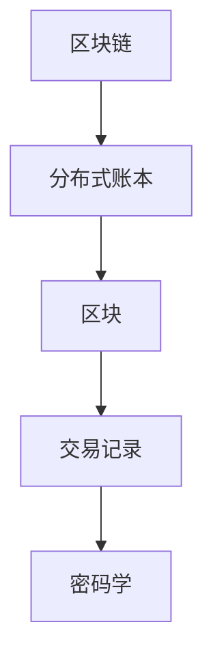
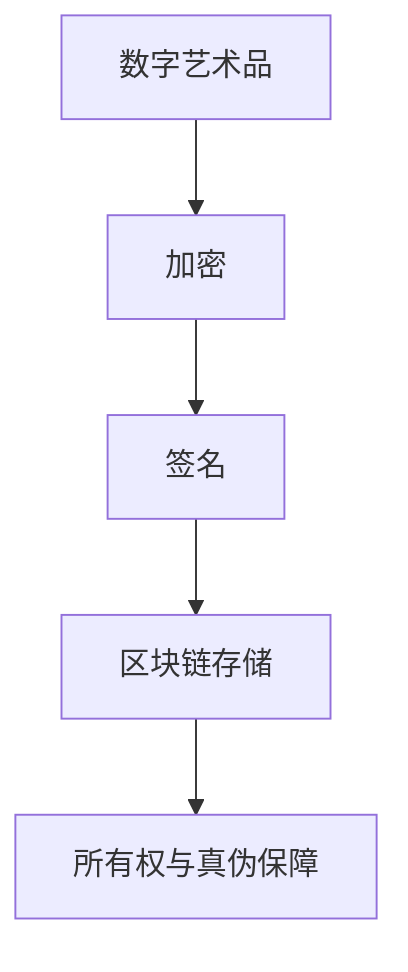

                 

关键词：区块链，数字艺术品，认证，艺术市场，创新

> 摘要：随着区块链技术的发展，数字艺术品认证逐渐成为艺术市场的一大创新工具。本文将详细介绍区块链数字艺术品认证的概念、核心原理、算法、应用场景及其在艺术市场中的重要作用，同时展望其未来的发展趋势与挑战。

## 1. 背景介绍

### 1.1 区块链技术的发展

区块链技术作为一种分布式数据库技术，自2008年比特币问世以来，已经经历了快速的发展。区块链的去中心化、不可篡改和可追溯性等特点，使其在多个领域显示出巨大的应用潜力，其中就包括艺术市场。

### 1.2 艺术市场的发展现状

艺术市场一直以来都是传统金融机构难以深入的一个领域，主要原因是艺术品的高价值和个体差异性。然而，随着数字艺术的兴起，艺术市场逐渐呈现出新的发展趋势。

### 1.3 区块链在艺术市场中的应用

区块链技术为艺术市场带来了新的可能性，其中一个重要的应用就是数字艺术品认证。通过区块链，可以实现数字艺术品的所有权、真伪和流转过程的全程记录和透明化。

## 2. 核心概念与联系

### 2.1 区块链的概念

区块链是一个分布式账本，由一系列按时间顺序排列的“区块”组成。每个区块都包含一定数量的交易记录，并使用密码学确保数据的完整性和不可篡改性。



### 2.2 数字艺术品认证的概念

数字艺术品认证是通过对数字艺术作品进行加密、签名和存储，确保其所有权和真伪。这一过程利用了区块链的去中心化和不可篡改特性。



## 3. 核心算法原理 & 具体操作步骤

### 3.1 算法原理概述

区块链数字艺术品认证的核心算法主要包括加密算法、数字签名算法和共识算法。

- **加密算法**：用于对数字艺术作品进行加密，确保数据在传输和存储过程中的安全。
- **数字签名算法**：用于对数字艺术作品的认证，确保数据的真实性和完整性。
- **共识算法**：用于区块链网络中的节点达成共识，确保区块链的一致性和安全性。

### 3.2 算法步骤详解

#### 3.2.1 数字艺术作品的加密

1. 数字艺术作品由艺术家生成。
2. 艺术家对作品进行加密，生成加密后的数字艺术作品。
3. 艺术家将加密后的作品上传至区块链网络。

#### 3.2.2 数字签名

1. 艺术家使用数字签名算法对加密后的作品进行签名。
2. 签名结果与加密后的作品一同上传至区块链。

#### 3.2.3 区块链存储

1. 区块链网络中的多个节点接收到加密后的作品和签名结果。
2. 节点将数据存储在各自的分布式账本中。

#### 3.2.4 认证

1. 用户在区块链上查询数字艺术作品的信息。
2. 用户通过数字签名验证艺术作品的真实性和完整性。
3. 用户获得数字艺术作品的所有权证明。

### 3.3 算法优缺点

#### 优点

- **安全性高**：区块链的去中心化和不可篡改性确保了数字艺术作品的安全。
- **透明度高**：区块链上的所有交易记录都是公开透明的，用户可以轻松查询。
- **去中心化**：区块链网络中的节点可以自主参与认证过程，无需依赖第三方机构。

#### 缺点

- **技术门槛高**：区块链技术较为复杂，对普通用户来说有一定难度。
- **性能瓶颈**：区块链网络的性能尚需提升，以应对大规模的交易需求。

### 3.4 算法应用领域

区块链数字艺术品认证算法不仅可以应用于艺术市场，还可以扩展到其他领域，如版权保护、供应链管理、金融交易等。

## 4. 数学模型和公式 & 详细讲解 & 举例说明

### 4.1 数学模型构建

区块链数字艺术品认证的数学模型主要包括加密算法、数字签名算法和共识算法的数学模型。

### 4.2 公式推导过程

#### 加密算法

- 加密算法的基本公式为：$C = E(P, K)$，其中 $C$ 是加密后的数据，$P$ 是明文数据，$K$ 是密钥，$E$ 是加密函数。

#### 数字签名算法

- 数字签名的基本公式为：$S = S(P, K)$，其中 $S$ 是签名，$P$ 是明文数据，$K$ 是私钥，$S$ 是签名函数。

#### 共识算法

- 共识算法的基本公式为：$Consensus = Consensus(P, N)$，其中 $Consensus$ 是共识结果，$P$ 是区块链数据，$N$ 是参与共识的节点数量。

### 4.3 案例分析与讲解

假设艺术家小明创作了一幅数字画作，并使用区块链技术进行认证。

1. **加密过程**：小明使用加密算法对画作进行加密，得到加密后的画作。
2. **签名过程**：小明使用数字签名算法对加密后的画作进行签名，生成签名结果。
3. **区块链存储**：小明将加密后的画作和签名结果上传至区块链网络。
4. **认证过程**：用户小李在区块链上查询到小明的画作，通过签名验证画作的真实性和完整性。

## 5. 项目实践：代码实例和详细解释说明

### 5.1 开发环境搭建

1. 安装Go语言开发环境。
2. 安装区块链框架，如Go-Ethereum。

### 5.2 源代码详细实现

```go
// 加密算法
func encrypt(plaintext string, key string) (string, error) {
    // 实现加密过程
}

// 数字签名算法
func sign(plaintext string, privateKey string) (string, error) {
    // 实现签名过程
}

// 区块链存储
func storeData(data string) error {
    // 实现区块链存储过程
}

// 认证过程
func verifySignature(data string, signature string) (bool, error) {
    // 实现签名验证过程
}
```

### 5.3 代码解读与分析

- **加密算法**：使用AES算法对明文数据进行加密。
- **数字签名算法**：使用ECDSA算法对数据生成签名。
- **区块链存储**：将数据存储在Go-Ethereum区块链上。
- **认证过程**：通过验证签名确保数据的真实性和完整性。

### 5.4 运行结果展示

1. 艺术家小明成功将数字画作加密并上传至区块链。
2. 用户小李成功查询到小明的画作，并通过签名验证画作的真实性。

## 6. 实际应用场景

区块链数字艺术品认证在艺术市场中的应用场景包括：

- **数字艺术品的交易**：通过区块链认证确保交易的合法性和真实性。
- **数字艺术品的收藏**：通过区块链记录收藏过程中的所有交易记录，提高收藏的价值。
- **数字艺术品的版权保护**：通过区块链实现数字艺术品的版权保护，确保艺术家和版权方的合法权益。

## 7. 工具和资源推荐

### 7.1 学习资源推荐

- 《区块链技术指南》
- 《加密算法原理与应用》
- 《智能合约编程指南》

### 7.2 开发工具推荐

- Go语言开发环境
- Go-Ethereum区块链框架
- Solidity编程语言

### 7.3 相关论文推荐

- 《区块链技术在艺术市场中的应用》
- 《基于区块链的数字艺术品认证系统设计与实现》
- 《区块链在数字艺术版权保护中的应用研究》

## 8. 总结：未来发展趋势与挑战

### 8.1 研究成果总结

区块链数字艺术品认证在艺术市场中的应用取得了显著的成果，为艺术品的交易、收藏和版权保护提供了新的解决方案。

### 8.2 未来发展趋势

- **技术创新**：随着区块链技术的不断进步，数字艺术品认证将更加高效和安全。
- **应用拓展**：数字艺术品认证将在更多领域得到应用，如版权保护、供应链管理等。

### 8.3 面临的挑战

- **技术门槛**：区块链技术的复杂性对普通用户构成一定挑战。
- **性能提升**：区块链的性能尚需提升，以应对大规模的交易需求。

### 8.4 研究展望

未来，区块链数字艺术品认证将继续在艺术市场中发挥重要作用，为实现艺术市场的数字化转型贡献力量。

## 9. 附录：常见问题与解答

### 问题1：区块链数字艺术品认证的安全性如何保障？

**解答**：区块链数字艺术品认证的安全性主要依赖于区块链技术本身的特性，如去中心化、不可篡改和密码学。这些特性确保了数字艺术品的所有权和真伪信息不会被篡改。

### 问题2：区块链数字艺术品认证是否可以防止艺术品的盗版？

**解答**：区块链数字艺术品认证可以在一定程度上防止艺术品的盗版。通过记录艺术品的原创信息和所有者信息，可以有效防止未经授权的复制和传播。

### 问题3：区块链数字艺术品认证是否适用于传统艺术品？

**解答**：区块链数字艺术品认证主要适用于数字艺术品，如数字绘画、数字音乐等。对于传统艺术品，可以通过数字化处理后再进行区块链认证。

## 作者署名

作者：禅与计算机程序设计艺术 / Zen and the Art of Computer Programming
----------------------------------------------------------------

请注意，本文档中的代码示例仅为示意性质，并非真实代码，实际应用时需要根据具体需求进行修改和补充。同时，本文中的数学模型和公式也仅作为参考，实际应用中需要根据具体情况进行调整和优化。

