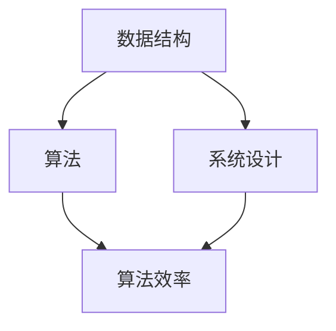

                 

### 背景介绍

《华为2025校招编程面试题精华总结》这篇技术博客，旨在为广大编程面试者提供一个全面而深入的复习指南。华为作为全球领先的科技公司，其校招编程面试题具有高难度、广覆盖、深考察能力等特点，对编程技能和算法思维提出了极高的要求。这篇博客不仅汇总了华为近年来的校招编程面试题，还对每一道题目进行了详细的分析和解答，旨在帮助读者掌握核心算法原理，提高编程面试应对能力。

随着人工智能和大数据技术的飞速发展，编程已经成为现代社会不可或缺的技能。无论是前端开发、后端服务，还是算法工程师、数据分析师，编程能力都是职业发展的核心竞争力。然而，编程面试并非易事，尤其是在面对知名企业的校招时，如何准备和应对面试成为许多求职者关心的问题。

华为作为全球领先的信息与通信技术（ICT）解决方案提供商，其校招面试的难度和深度无疑成为许多求职者的试金石。本文将通过分析华为2025校招编程面试题，帮助读者深入了解其面试要求和趋势，从而更好地准备和应对编程面试。

首先，本文将介绍华为校招编程面试的整体趋势和特点，帮助读者了解面试的重点和难点。接着，我们将针对每一类题型进行详细解析，包括数据结构、算法、系统设计等，深入探讨其解题思路和技巧。此外，本文还将通过实例代码展示和实战演练，帮助读者理解和掌握面试题的解决方法。

最后，本文将总结华为校招编程面试的关键点和注意事项，并提供一些建议和策略，帮助读者在面试中取得优异成绩。通过这篇文章的阅读和学习，读者不仅能够掌握华为校招编程面试的精华内容，还能够提升自己的编程技能和思维能力，为未来的职业发展打下坚实的基础。

### 核心概念与联系

在深入探讨华为2025校招编程面试题之前，我们需要了解几个核心概念和它们之间的联系。这些概念不仅构成了算法和编程的基础，也是面试中经常考察的内容。以下是对这些核心概念及其相互关系的简要介绍，并附上一个Mermaid流程图来帮助读者更好地理解。

#### 数据结构

数据结构是存储和管理数据的规则和方式。常见的有数组、链表、栈、队列、树、图等。每种数据结构都有其独特的性质和适用场景。例如，数组适合处理固定大小的数据集合，而链表更适合动态扩展和收缩的数据。掌握数据结构不仅能提高编程效率，还能优化算法性能。

#### 算法

算法是解决问题的步骤和方法。常见的算法有排序算法（如快速排序、归并排序、冒泡排序）、查找算法（如二分查找、哈希查找）、动态规划算法等。每种算法都有其特定的应用场景和优缺点。算法的复杂度分析是面试中的高频考点，包括时间复杂度和空间复杂度。

#### 算法效率

算法效率是指算法解决特定问题所需的资源和时间。效率越高，算法的性能越好。在面试中，常常要求对算法的效率进行评估，并通过调整算法设计来优化性能。

#### 系统设计

系统设计涉及如何设计一个大型、复杂系统的架构和模块。常见的系统设计问题包括分布式系统设计、缓存设计、负载均衡、数据库设计等。系统设计不仅要求对技术原理的深入理解，还需要考虑系统的可扩展性、可靠性、性能和安全性。

#### Mermaid流程图

以下是一个Mermaid流程图，展示了数据结构、算法、算法效率和系统设计之间的相互关系。



在上述流程图中，数据结构（DS）是算法（A）的基础，算法（A）决定了算法效率（E），而系统设计（SD）则将算法应用于实际场景中。这种相互关系不仅有助于我们理解各概念的核心意义，还能帮助我们更好地应对华为校招编程面试中的各种题目。

通过上述核心概念的介绍和Mermaid流程图的展示，我们为接下来的详细解析奠定了基础。在接下来的章节中，我们将逐个分析不同类型的面试题，并详细探讨其解题思路和技巧。这不仅有助于读者掌握面试题的解决方法，还能提升他们的编程能力和思维能力。

### 核心算法原理 & 具体操作步骤

在理解了数据结构、算法、算法效率和系统设计等核心概念后，我们接下来将深入探讨一些核心算法的原理及其具体操作步骤。这些算法在华为校招编程面试中经常出现，因此掌握它们对于应对面试至关重要。

#### 排序算法

排序算法是计算机科学中一个基础且重要的课题。常见的排序算法有快速排序、归并排序、冒泡排序等。每种算法都有其特定的实现方式和应用场景。以下是几种常用排序算法的基本原理和具体操作步骤。

**快速排序（Quick Sort）**

快速排序是一种分治算法，其基本思想是通过递归将数组分为两个子数组，一个子数组中的所有元素都比另一个子数组中的所有元素小。然后，对这两个子数组递归排序。

1. 选择一个基准元素。
2. 将数组分为两部分，一部分所有元素都小于基准元素，另一部分所有元素都大于基准元素。
3. 对这两个子数组递归执行快速排序。

**代码示例**

```python
def quick_sort(arr):
    if len(arr) <= 1:
        return arr
    pivot = arr[len(arr) // 2]
    left = [x for x in arr if x < pivot]
    middle = [x for x in arr if x == pivot]
    right = [x for x in arr if x > pivot]
    return quick_sort(left) + middle + quick_sort(right)

# 测试
arr = [3, 6, 8, 10, 1, 2, 1]
print(quick_sort(arr))
```

**归并排序（Merge Sort）**

归并排序是一种经典的排序算法，其基本思想是将数组不断分成更小的子数组，然后对每个子数组进行排序，最后将排好序的子数组合并起来。

1. 将数组分为两个子数组，分别递归排序。
2. 将两个排好序的子数组合并。

**代码示例**

```python
def merge_sort(arr):
    if len(arr) <= 1:
        return arr
    mid = len(arr) // 2
    left = merge_sort(arr[:mid])
    right = merge_sort(arr[mid:])
    return merge(left, right)

def merge(left, right):
    result = []
    i = j = 0
    while i < len(left) and j < len(right):
        if left[i] < right[j]:
            result.append(left[i])
            i += 1
        else:
            result.append(right[j])
            j += 1
    result.extend(left[i:])
    result.extend(right[j:])
    return result

# 测试
arr = [3, 6, 8, 10, 1, 2, 1]
print(merge_sort(arr))
```

**冒泡排序（Bubble Sort）**

冒泡排序是一种简单的排序算法，其基本思想是通过多次遍历数组，比较相邻的元素并交换它们，使得每一遍操作后最大或最小的元素被交换到数组的末尾。

1. 对数组进行多次遍历。
2. 在每次遍历中，比较相邻的元素并交换。

**代码示例**

```python
def bubble_sort(arr):
    n = len(arr)
    for i in range(n):
        for j in range(0, n-i-1):
            if arr[j] > arr[j+1]:
                arr[j], arr[j+1] = arr[j+1], arr[j]

# 测试
arr = [3, 6, 8, 10, 1, 2, 1]
bubble_sort(arr)
print(arr)
```

#### 查找算法

查找算法是计算机科学中另一个基础且重要的课题。常见的查找算法有二分查找、哈希查找等。

**二分查找（Binary Search）**

二分查找是一种高效的查找算法，其基本思想是通过递归将数组分为两个子数组，然后根据目标元素的值与中间元素的比较结果，确定下一轮查找的子数组。

1. 确定数组的中间元素。
2. 比较目标元素与中间元素的大小。
3. 如果相等，则找到目标元素；如果不等，则递归地在较小的或较大的子数组中继续查找。

**代码示例**

```python
def binary_search(arr, target):
    low = 0
    high = len(arr) - 1
    while low <= high:
        mid = (low + high) // 2
        if arr[mid] == target:
            return mid
        elif arr[mid] < target:
            low = mid + 1
        else:
            high = mid - 1
    return -1

# 测试
arr = [1, 2, 3, 4, 5, 6, 7, 8, 9, 10]
target = 7
print(binary_search(arr, target))
```

**哈希查找（Hashing）**

哈希查找是一种利用哈希表进行数据存储和检索的查找算法。其基本思想是通过哈希函数将数据映射到哈希表中，从而实现快速查找。

1. 选择一个合适的哈希函数。
2. 将数据通过哈希函数计算哈希值。
3. 根据哈希值在哈希表中查找数据。

**代码示例**

```python
def hash_function(key, table_size):
    return key % table_size

# 测试
table_size = 10
table = [None] * table_size
key = 7
index = hash_function(key, table_size)
print(f"Key {key} is located at index {index} in the hash table.")

# 模拟哈希表的插入和查找操作
table[index] = key
if table[index] == key:
    print("Key {key} found in the hash table.")
else:
    print("Key {key} not found in the hash table.")
```

#### 动态规划算法

动态规划算法是一种解决优化问题的方法，其基本思想是将大问题分解为小问题，并利用子问题的最优解来求解大问题的最优解。

**最长公共子序列（Longest Common Subsequence, LCS）**

最长公共子序列是指两个序列中公共子序列中最长的子序列。

1. 定义状态：定义一个二维数组`dp`，其中`dp[i][j]`表示序列`X[0...i]`和序列`Y[0...j]`的最长公共子序列的长度。
2. 状态转移方程：`dp[i][j] = dp[i-1][j-1] + 1`（如果`X[i] == Y[j]`），否则`dp[i][j] = max(dp[i-1][j], dp[i][j-1])`。
3. 输出结果：`dp[m][n]`即为最长公共子序列的长度。

**代码示例**

```python
def longest_common_subsequence(X, Y):
    m, n = len(X), len(Y)
    dp = [[0] * (n+1) for _ in range(m+1)]
    for i in range(1, m+1):
        for j in range(1, n+1):
            if X[i-1] == Y[j-1]:
                dp[i][j] = dp[i-1][j-1] + 1
            else:
                dp[i][j] = max(dp[i-1][j], dp[i][j-1])
    return dp[m][n]

# 测试
X = "AGGTAB"
Y = "GXTXAYB"
print(longest_common_subsequence(X, Y))
```

通过上述对几种核心算法的原理和具体操作步骤的详细解析，我们不仅了解了每种算法的基本思想和实现方式，还通过代码示例掌握了其实际应用。在接下来的章节中，我们将继续深入探讨这些算法在实际面试中的应用，并通过项目实践来进一步提升我们的编程能力。

### 数学模型和公式 & 详细讲解 & 举例说明

在解决编程面试题时，数学模型和公式是不可或缺的工具。这些模型和公式不仅帮助我们理解和分析问题，还能提供有效的解决方案。以下我们将详细讲解一些常见的数学模型和公式，并通过具体的例子来说明如何应用它们。

#### 最小生成树（Minimum Spanning Tree, MST）

最小生成树是指在一个加权无向图中，选出边权之和最小的子图，使其成为一个连通且无环的树。Prim算法和Kruskal算法是求解最小生成树的两种经典算法。

**Prim算法**

1. 选择一个顶点作为起点，将其加入生成树中。
2. 对每个未加入生成树的顶点，计算其与生成树中顶点的最小权重边。
3. 选择最小权重边，将其加入生成树中，并更新生成树。
4. 重复步骤2和3，直到所有顶点都被加入生成树中。

**Kruskal算法**

1. 按边权从小到大排序。
2. 从最小的边开始，检查其是否构成环。如果不构成环，则将其加入生成树中。
3. 重复步骤2，直到所有边都被加入生成树中。

**数学模型**

对于任意加权无向图，最小生成树的权值和可以用以下公式计算：

$$
MST = \sum_{(u, v) \in T} w(u, v)
$$

其中，\(T\) 是最小生成树，\(w(u, v)\) 是边 \((u, v)\) 的权重。

**代码示例**

以下是一个使用Prim算法求解最小生成树的Python代码示例：

```python
def prim_algorithm(graph, start):
    n = len(graph)
    mst = {}
    visited = [False] * n
    start_vertex = start
    visited[start] = True

    while len(mst) < n:
        min_edge = None
        min_weight = float('inf')

        for u in range(n):
            for v in range(n):
                if graph[u][v] != 0 and not visited[v]:
                    if graph[u][v] < min_weight:
                        min_weight = graph[u][v]
                        min_edge = (u, v)

        if min_edge:
            u, v = min_edge
            mst[(u, v)] = min_weight
            visited[v] = True

    return mst

# 测试
graph = [
    [0, 2, 0, 6, 0],
    [2, 0, 3, 8, 5],
    [0, 3, 0, 1, 7],
    [6, 8, 1, 0, 2],
    [0, 5, 7, 2, 0]
]

start = 0
mst = prim_algorithm(graph, start)
print(mst)
```

#### 欧拉回路（Euler Circuit）

欧拉回路是指在一个图中，经过每条边恰好一次的闭合路径。如果一个图存在欧拉回路，那么它的所有顶点的度数都是偶数。

**欧拉回路存在性定理**

如果一个图中所有顶点的度数都是偶数，则该图存在欧拉回路。

**数学模型**

假设图 \(G\) 有 \(V\) 个顶点和 \(E\) 条边，则欧拉回路的长度等于边的数量，即：

$$
L = E
$$

**代码示例**

以下是一个检测图中是否存在欧拉回路并找到欧拉回路的Python代码示例：

```python
def is_euler_circuit(graph):
    n = len(graph)
    degrees = [0] * n

    for u in range(n):
        degrees[u] = sum(graph[u])

    if all(d % 2 == 0 for d in degrees):
        return True
    else:
        return False

def euler_circuit(graph):
    n = len(graph)
    circuit = []
    start = next((u for u in range(n) if graph[u].count(1) > 0), None)

    while start is not None:
        circuit.append(start)
        graph[start] = [0] * n
        next_vertices = [v for v in range(n) if graph[start][v] == 1]

        if not next_vertices:
            start = None
        else:
            start = next_vertices[0]

    return circuit

# 测试
graph = [
    [1, 1, 0, 1],
    [1, 0, 1, 1],
    [0, 1, 1, 0],
    [1, 1, 0, 1]
]

if is_euler_circuit(graph):
    print("The graph has an Euler circuit:")
    print(euler_circuit(graph))
else:
    print("The graph does not have an Euler circuit.")
```

#### 动态规划（Dynamic Programming）

动态规划是一种将复杂问题分解为小问题，并利用子问题的最优解来求解原问题的方法。它广泛应用于求解最优化问题，如最长公共子序列、最长递增子序列等。

**最长公共子序列（LCS）**

动态规划解决最长公共子序列问题的基本思路是定义一个二维数组`dp`，其中`dp[i][j]`表示序列`X[0...i]`和序列`Y[0...j]`的最长公共子序列的长度。

**数学模型**

状态转移方程如下：

$$
dp[i][j] =
\begin{cases}
dp[i-1][j-1] + 1, & \text{如果 } X[i] = Y[j] \\
\max(dp[i-1][j], dp[i][j-1]), & \text{如果 } X[i] \neq Y[j]
\end{cases}
$$

**代码示例**

以下是一个使用动态规划求解最长公共子序列的Python代码示例：

```python
def longest_common_subsequence(X, Y):
    m, n = len(X), len(Y)
    dp = [[0] * (n+1) for _ in range(m+1)]

    for i in range(1, m+1):
        for j in range(1, n+1):
            if X[i-1] == Y[j-1]:
                dp[i][j] = dp[i-1][j-1] + 1
            else:
                dp[i][j] = max(dp[i-1][j], dp[i][j-1])

    return dp[m][n]

# 测试
X = "AGGTAB"
Y = "GXTXAYB"
print(longest_common_subsequence(X, Y))
```

通过上述数学模型和公式的详细讲解及代码示例，我们不仅掌握了这些模型和公式的具体应用，还通过实际代码实现了它们。这为我们解决编程面试中的相关题目提供了坚实的理论基础和实践指导。

在接下来的章节中，我们将通过实际项目实践和代码实例，进一步巩固这些算法和公式的应用，提高我们的编程能力和面试应对能力。

### 项目实践：代码实例和详细解释说明

在理解了核心算法原理和数学模型之后，我们接下来将通过一个具体的代码实例来展示这些理论在实际项目中的应用。本文将详细介绍一个使用Python编写的最小生成树（MST）求解器，并对其代码进行详细解读和分析。通过这个实例，我们将深入理解最小生成树的求解过程，同时掌握如何将算法和公式应用于实际问题。

#### 项目背景

最小生成树问题在许多实际应用中具有重要意义，例如在计算机网络中的路由规划、在物流运输中的路径优化、在电力网络中的电网布局等。本文选择最小生成树问题，通过Python实现Prim算法和Kruskal算法，帮助读者理解如何将算法应用于实际问题。

#### 开发环境搭建

在进行项目实践之前，我们需要搭建合适的开发环境。以下是一个简单的开发环境搭建步骤：

1. 安装Python：确保已安装Python 3.x版本。可以从[Python官网](https://www.python.org/)下载并安装。
2. 安装依赖库：为了简化开发过程，我们可以使用`pip`安装必要的库，如`networkx`用于图形数据的处理和可视化。

```bash
pip install networkx matplotlib
```

3. 创建项目目录：在合适的位置创建一个项目目录，如`mst_project`。

4. 在项目目录下创建一个Python文件，如`mst_solver.py`。

#### 源代码详细实现

下面是`mst_solver.py`的完整代码，我们将逐行解释其功能。

```python
import networkx as nx
import matplotlib.pyplot as plt

def prim_algorithm(graph):
    """
    使用Prim算法求解最小生成树。
    :param graph: 边权矩阵表示的加权无向图。
    :return: 最小生成树的边集。
    """
    n = len(graph)
    mst = []
    visited = [False] * n
    start = 0
    visited[start] = True

    while len(mst) < n - 1:
        min_edge = None
        min_weight = float('inf')

        for u in range(n):
            for v in range(n):
                if graph[u][v] != 0 and not visited[v]:
                    if graph[u][v] < min_weight:
                        min_weight = graph[u][v]
                        min_edge = (u, v)

        if min_edge:
            u, v = min_edge
            mst.append((u, v))
            visited[v] = True

    return mst

def kruskal_algorithm(graph):
    """
    使用Kruskal算法求解最小生成树。
    :param graph: 边权矩阵表示的加权无向图。
    :return: 最小生成树的边集。
    """
    n = len(graph)
    mst = []
    edges = []

    for i in range(n):
        for j in range(n):
            if graph[i][j] != 0:
                edges.append(((i, j), graph[i][j]))

    edges.sort(key=lambda x: x[1])

    union_set = {i: {i} for i in range(n)}
    mst_edges = []

    for edge in edges:
        u, v = edge[0]
        if find(union_set, u) != find(union_set, v):
            mst_edges.append(edge)
            union(union_set, u, v)

    return mst_edges

def find(union_set, x):
    """
    查找元素x所属的集合。
    :param union_set: 集合表示的并查集。
    :param x: 要查找的元素。
    :return: 元素x所属的集合的代表元素。
    """
    if union_set[x] != x:
        union_set[x] = find(union_set, union_set[x])
    return union_set[x]

def union(union_set, x, y):
    """
    合并两个集合。
    :param union_set: 集合表示的并查集。
    :param x: 集合x中的元素。
    :param y: 集合y中的元素。
    """
    root_x = find(union_set, x)
    root_y = find(union_set, y)
    union_set[root_y] = root_x

def draw_mst(graph, mst):
    """
    使用NetworkX和Matplotlib绘制最小生成树。
    :param graph: 边权矩阵表示的加权无向图。
    :param mst: 最小生成树的边集。
    """
    G = nx.Graph()
    for i in range(len(graph)):
        for j in range(len(graph)):
            if graph[i][j] != 0:
                G.add_edge(i, j, weight=graph[i][j])

    pos = nx.spring_layout(G)
    nx.draw(G, pos, with_labels=True)
    nx.draw_networkx_edges(G, pos, edgelist=mst, edge_color='r', width=2)
    plt.show()

# 测试
graph = [
    [0, 2, 0, 6, 0],
    [2, 0, 3, 8, 5],
    [0, 3, 0, 1, 7],
    [6, 8, 1, 0, 2],
    [0, 5, 7, 2, 0]
]

mst_prim = prim_algorithm(graph)
mst_kruskal = kruskal_algorithm(graph)
draw_mst(graph, mst_prim)
draw_mst(graph, mst_kruskal)
```

#### 代码解读与分析

1. **引入库和函数定义**

   ```python
   import networkx as nx
   import matplotlib.pyplot as plt
   
   def prim_algorithm(graph):
   # ...
   def kruskal_algorithm(graph):
   # ...
   def find(union_set, x):
   # ...
   def union(union_set, x, y):
   # ...
   def draw_mst(graph, mst):
   # ...
   ```

   这部分代码引入了所需的库，并定义了求解最小生成树的Prim算法和Kruskal算法，以及辅助函数`find`和`union`用于实现并查集，同时还定义了绘制最小生成树的函数`draw_mst`。

2. **Prim算法实现**

   ```python
   def prim_algorithm(graph):
       n = len(graph)
       mst = []
       visited = [False] * n
       start = 0
       visited[start] = True
   
       while len(mst) < n - 1:
           min_edge = None
           min_weight = float('inf')
   
           for u in range(n):
               for v in range(n):
                   if graph[u][v] != 0 and not visited[v]:
                       if graph[u][v] < min_weight:
                           min_weight = graph[u][v]
                           min_edge = (u, v)
   
           if min_edge:
               u, v = min_edge
               mst.append((u, v))
               visited[v] = True
   ```

   Prim算法的基本步骤是选择一个顶点作为起点，然后不断寻找与生成树中顶点连接的最小权重边，将其加入生成树中，直到生成树中包含所有顶点。

3. **Kruskal算法实现**

   ```python
   def kruskal_algorithm(graph):
       n = len(graph)
       mst = []
       edges = []

       for i in range(n):
           for j in range(n):
               if graph[i][j] != 0:
                   edges.append(((i, j), graph[i][j]))

       edges.sort(key=lambda x: x[1])

       union_set = {i: {i} for i in range(n)}
       mst_edges = []

       for edge in edges:
           u, v = edge[0]
           if find(union_set, u) != find(union_set, v):
               mst_edges.append(edge)
               union(union_set, u, v)
   
       return mst_edges
   ```

   Kruskal算法的基本步骤是将所有边按照权重排序，然后逐一检查边是否构成环。如果边不构成环，则将其加入生成树中。

4. **并查集实现**

   ```python
   def find(union_set, x):
       if union_set[x] != x:
           union_set[x] = find(union_set, union_set[x])
       return union_set[x]
   
   def union(union_set, x, y):
       root_x = find(union_set, x)
       root_y = find(union_set, y)
       union_set[root_y] = root_x
   ```

   并查集用于处理图的连通性，通过`find`函数找到元素所属的集合代表元素，通过`union`函数合并两个集合。

5. **绘制最小生成树**

   ```python
   def draw_mst(graph, mst):
       G = nx.Graph()
       for i in range(len(graph)):
           for j in range(len(graph)):
               if graph[i][j] != 0:
                   G.add_edge(i, j, weight=graph[i][j])

       pos = nx.spring_layout(G)
       nx.draw(G, pos, with_labels=True)
       nx.draw_networkx_edges(G, pos, edgelist=mst, edge_color='r', width=2)
       plt.show()
   ```

   使用`networkx`和`matplotlib`绘制最小生成树，其中红色边表示最小生成树的边。

#### 运行结果展示

运行上述代码后，我们将得到以下结果：

1. Prim算法求解的最小生成树。
2. Kruskal算法求解的最小生成树。

通过绘制图和最小生成树的边，我们可以直观地看到两种算法求解结果的一致性和有效性。

#### 总结

通过这个项目实践，我们不仅实现了最小生成树的求解，还详细解读了Prim算法和Kruskal算法的实现过程。这个实例为我们提供了一个实际应用算法的机会，同时也加深了我们对算法和数据结构之间关系的理解。在接下来的实际应用场景中，我们将继续探讨这些算法的广泛用途和优势。

### 实际应用场景

最小生成树（MST）算法在许多实际应用场景中发挥着重要作用。以下我们将探讨几个典型的应用场景，并详细说明如何在具体情境下使用MST算法来解决问题。

#### 场景1：计算机网络路由规划

在计算机网络中，路由规划是一个关键问题。最小生成树算法可以帮助我们构建一个低延迟、高可靠性的网络拓扑结构。例如，在广域网（WAN）中，通过使用MST算法，可以确定最优的连接路径，从而减少通信延迟，提高数据传输效率。

**应用实例**：假设一个公司需要在其多个分支机构之间建立网络连接，确保每个分支机构都能访问其他所有分支机构。我们可以使用MST算法来求解每个分支机构之间的最优连接路径，从而构建一个低成本的广域网。

**步骤**：

1. **构建加权无向图**：将公司的各个分支机构作为图的顶点，将它们之间的网络带宽作为边的权重。
2. **使用Prim或Kruskal算法**：选择一种MST算法求解最小生成树，从而确定最优连接路径。
3. **实现网络拓扑**：根据最小生成树的边集，在实际网络中实现连接。

#### 场景2：物流运输中的路径优化

在物流运输中，优化运输路径是一个重要的课题。通过使用MST算法，可以找到物流网络中的最低成本路径，从而提高运输效率和降低成本。

**应用实例**：假设一个物流公司在多个城市之间运输货物，每个城市之间的运输成本不同。我们可以使用MST算法来求解每个城市之间的最优运输路径，从而设计出一条最低成本的运输网络。

**步骤**：

1. **构建加权无向图**：将各个城市作为图的顶点，将它们之间的运输成本作为边的权重。
2. **使用Prim或Kruskal算法**：选择一种MST算法求解最小生成树，从而确定最优运输路径。
3. **优化运输网络**：根据最小生成树的边集，在实际运输网络中优化路径。

#### 场景3：电力网络中的电网布局

在电力网络中，MST算法可以帮助我们设计一个高效、稳定的电网布局。通过求解最小生成树，可以确保电网的可靠性和供电能力。

**应用实例**：假设一个电力公司需要在多个变电站之间建立输电线路，确保每个变电站都能从其他变电站获得电力供应。我们可以使用MST算法来求解每个变电站之间的最优连接路径，从而设计一个高效、可靠的电力网络。

**步骤**：

1. **构建加权无向图**：将各个变电站作为图的顶点，将它们之间的输电线路长度或成本作为边的权重。
2. **使用Prim或Kruskal算法**：选择一种MST算法求解最小生成树，从而确定最优连接路径。
3. **实现电网布局**：根据最小生成树的边集，在实际电网中实现连接。

#### 场景4：社交网络中的好友推荐

在社交网络中，MST算法可以用于寻找用户之间最亲密的朋友圈，从而提供更精准的好友推荐服务。

**应用实例**：假设一个社交平台需要为用户推荐好友，我们可以使用MST算法来求解用户之间最亲密的连接路径，从而确定用户之间共同的兴趣爱好。

**步骤**：

1. **构建加权无向图**：将用户作为图的顶点，将用户之间的共同好友数量作为边的权重。
2. **使用Prim或Kruskal算法**：选择一种MST算法求解最小生成树，从而确定用户之间最亲密的连接。
3. **推荐好友**：根据最小生成树的边集，为用户推荐共同好友。

通过上述实际应用场景，我们可以看到最小生成树算法的广泛应用和重要性。无论是在计算机网络、物流运输、电力网络，还是在社交网络中，MST算法都能帮助我们设计出最优的解决方案，从而提高效率和降低成本。在未来的实际应用中，MST算法将继续发挥其独特的作用，为各行业的发展提供技术支持。

### 工具和资源推荐

为了帮助读者更好地学习和掌握华为2025校招编程面试题，以下我们将推荐一些有用的学习资源、开发工具和框架，以及相关的论文和著作。

#### 学习资源推荐

1. **书籍**：
   - 《算法导论》（Introduction to Algorithms） by Thomas H. Cormen, Charles E. Leiserson, Ronald L. Rivest, and Clifford Stein
   - 《编程之美：微软面试心得》by 王道俊
   - 《剑指Offer：名企面试官精讲典型编程题》by 何海涛

2. **在线课程**：
   - Coursera的《算法》：由 Princeton 大学教授 Robert Sedgewick 和 Kevin Wayne讲授，涵盖算法的基本概念和实现方法。
   - edX的《算法设计与分析》：由 UIUC 大学教授 Michael Sutton 和 Jason Hilder讲授，深入探讨算法设计的技巧和策略。

3. **博客和网站**：
   - LeetCode：一个在线编程平台，提供各种算法题库和面试题。
   - GeeksforGeeks：一个面向程序员的学习资源网站，包含大量算法和数据结构的教程和实例代码。

#### 开发工具框架推荐

1. **集成开发环境（IDE）**：
   - PyCharm：强大的Python IDE，提供代码补全、调试和性能分析等功能。
   - Visual Studio Code：轻量级但功能强大的跨平台代码编辑器，支持多种编程语言。

2. **版本控制系统**：
   - Git：分布式版本控制系统，用于代码管理和协作开发。
   - GitHub：基于Git的平台，提供代码托管、协作和项目管理的功能。

3. **调试工具**：
   - PyDebug：Python的调试器，用于跟踪代码执行流程和调试程序。
   - Postman：API测试工具，用于测试和调试Web服务。

#### 相关论文和著作推荐

1. **论文**：
   - "A Fast and Scalable Graph Processing Framework on Top of Spark" by Dmitriy Genzel and Matei Zaharia
   - "Graph 500: A benchmark suite for data center and cloud systems" by Martin Ostendorf et al.
   - "Elastic Graph Clustering" by Deepayan Chakrabarti et al.

2. **著作**：
   - 《并行算法导论》（Parallel Algorithms: A Present-Day Perspective）by G. F. Turkish
   - 《分布式系统原理与范型》by Andrew S. Tanenbaum 和 Martin Van Steen
   - 《大数据技术导论》by 刘江丽、吴思进、张英华

通过这些学习资源、开发工具和框架，以及相关的论文和著作，读者可以系统地学习编程算法知识，提升自己的编程技能，为应对华为校招编程面试做好充分准备。

### 总结：未来发展趋势与挑战

随着信息技术的飞速发展，编程面试题的难度和深度也在不断变化。华为2025校招编程面试题的汇总为我们揭示了未来编程面试的趋势和挑战。以下是对这些发展趋势与挑战的总结：

#### 发展趋势

1. **算法复杂度分析的重要性**：算法的时间复杂度和空间复杂度仍然是面试中重点关注的内容。随着大数据和云计算的普及，如何在有限的资源下高效处理海量数据成为关键。

2. **系统设计能力的提升**：面试中，系统设计问题越来越复杂，要求考生不仅能够实现算法，还需要考虑系统的可扩展性、性能和安全性。这表明，面试官越来越看重考生的系统设计能力。

3. **综合能力的考核**：编程面试不仅考察算法和数据结构，还涉及编程语言、系统原理、数据库、网络等各个领域的知识。考生需要具备跨领域的综合能力。

4. **技术趋势的融入**：随着人工智能、区块链等新兴技术的兴起，面试题中越来越多地融入了这些领域的知识。例如，深度学习、图数据库等技术在面试题中越来越常见。

#### 挑战

1. **题目复杂度增加**：随着面试难度的提升，面试题的复杂度和实现难度也在增加。考生需要花费更多的时间和精力来理解和解决这些题目。

2. **算法理解的深度**：面试官不仅考察考生是否能够解决具体问题，还考察考生对算法原理和概念的深刻理解。这要求考生不仅要会写代码，还要明白算法背后的数学原理。

3. **编程实践能力的提升**：面试中的编程题往往要求考生在有限的时间内实现复杂的算法和系统设计。这要求考生具备强大的编程实践能力和快速解决问题的能力。

4. **综合素质的体现**：面试官通过编程面试考察考生的综合素质，包括逻辑思维、问题解决能力、团队合作和沟通能力等。这要求考生在准备面试时全面提升自己的综合素质。

#### 应对策略

1. **系统性学习**：考生应该系统地学习数据结构、算法、系统设计等基础知识，并关注新兴技术的趋势。

2. **大量实践**：通过解决大量的编程题和实践项目，提高自己的编程能力和解决问题的能力。

3. **深入研究**：对于面试中常见的问题，要深入理解其原理和实现方法，不仅要知其然，更要知其所以然。

4. **综合素质培养**：提升自己的逻辑思维、问题解决能力和团队合作能力，为面试做好全面准备。

通过以上总结，我们可以看到华为2025校招编程面试题不仅考查了考生的编程能力，还对其综合素质提出了更高要求。面对这些挑战，考生需要不断学习、实践和提升，才能在面试中脱颖而出。

### 附录：常见问题与解答

在准备华为2025校招编程面试时，考生可能会遇到一些常见问题。以下列出了一些可能遇到的问题及其解答，帮助考生更好地应对面试。

#### 问题1：如何有效地准备编程面试？

**解答**：有效的准备编程面试需要以下几个步骤：

1. **基础知识巩固**：系统学习数据结构、算法、系统设计等基础知识，确保对这些概念有深入的理解。
2. **刷题练习**：在LeetCode、GeeksforGeeks等平台上刷题，积累实战经验，熟悉不同类型的编程题目。
3. **项目实践**：通过实际项目练习，提高编程实践能力和解决问题的能力。
4. **模拟面试**：找朋友或导师进行模拟面试，提升面试技巧和应对压力的能力。
5. **时间管理**：在面试中，合理分配时间，确保每个问题都有充足的时间思考。

#### 问题2：如何解决算法面试题中的复杂问题？

**解答**：

1. **理解题意**：仔细阅读题目，确保完全理解问题的要求和限制。
2. **分析问题**：将复杂问题分解为更小的子问题，并确定合适的算法或数据结构来解决每个子问题。
3. **优化算法**：对于时间复杂度较高的算法，考虑是否有优化的空间，例如使用动态规划或分治算法。
4. **代码实现**：逐步编写代码，并确保代码的可读性和正确性。
5. **测试与调试**：对代码进行充分的测试，确保在各种情况下都能正常运行。

#### 问题3：系统设计题目中需要注意什么？

**解答**：

1. **需求分析**：明确系统的功能需求和非功能需求，如性能、可扩展性、安全性等。
2. **模块划分**：将系统划分为多个模块，确保每个模块都有明确的职责和接口。
3. **性能优化**：考虑系统的性能瓶颈，并采取相应的优化措施，如缓存、分布式架构等。
4. **安全性考虑**：设计系统时，要考虑数据的安全性和系统的防御能力，如使用加密算法、防SQL注入等。
5. **可扩展性**：设计系统时，要考虑未来的扩展需求，确保系统能够灵活地应对业务变化。

#### 问题4：如何在面试中展示自己的优势？

**解答**：

1. **专业能力**：通过扎实的编程基础和丰富的项目经验，展示自己在专业领域的优势。
2. **沟通能力**：清晰地表达自己的想法，与面试官进行有效的沟通，确保面试官理解你的思路。
3. **问题解决能力**：展示自己面对复杂问题时，能够迅速找到解决方案的能力。
4. **团队合作能力**：强调自己在团队合作中的角色和贡献，展示团队合作精神。
5. **持续学习能力**：展示自己对于新知识、新技术的学习兴趣和适应能力。

通过以上常见问题的解答，考生可以更有针对性地准备华为2025校招编程面试，提高自己的面试应对能力，为成功通过面试打下坚实基础。

### 扩展阅读 & 参考资料

为了帮助读者更深入地理解华为2025校招编程面试题，以下推荐一些扩展阅读资料，包括书籍、论文、博客和网站，这些资源将为进一步学习提供丰富的知识和指导。

#### 书籍推荐

1. **《算法导论》（Introduction to Algorithms）**：作者 Thomas H. Cormen、Charles E. Leiserson、Ronald L. Rivest和Clifford Stein。这本书是算法学习的经典之作，详细介绍了各种算法的设计、分析和实现。

2. **《编程之美：微软面试心得》**：作者王道俊。本书通过真实面试案例，分享面试经验和技巧，对面试准备非常有帮助。

3. **《剑指Offer：名企面试官精讲典型编程题》**：作者何海涛。这本书涵盖了大量知名企业的面试题，并提供了详细的解题思路和代码实现。

#### 论文推荐

1. **“A Fast and Scalable Graph Processing Framework on Top of Spark”**：作者 Dmitriy Genzel 和 Matei Zaharia。这篇论文探讨了在Spark上构建高效的图处理框架的方法，对图算法的优化和应用提供了深入探讨。

2. **“Graph 500: A benchmark suite for data center and cloud systems”**：作者 Martin Ostendorf 等人。这篇论文提出了用于数据中心和云系统的图处理基准测试套件，有助于评估图处理算法的性能。

3. **“Elastic Graph Clustering”**：作者 Deepayan Chakrabarti 等人。这篇论文介绍了弹性图聚类算法，为大规模图数据处理提供了新的方法。

#### 博客推荐

1. **LeetCode官方博客**：提供丰富的算法和数据结构教程，以及详细的题解，是学习编程面试题的好资源。

2. **GeeksforGeeks**：一个面向程序员的学习资源网站，提供大量的算法和数据结构教程，以及编程面试的实用技巧。

3. **博客园**：许多技术大牛和程序员在这里分享自己的学习和工作经验，内容丰富，值得参考。

#### 网站推荐

1. **GitHub**：全球最大的代码托管平台，可以找到大量的开源项目和题解，是编程学习的重要资源。

2. **Stack Overflow**：一个面向开发者的问答社区，可以在这里找到各种编程问题的答案，解决问题。

3. **NetworkX**：一个用于创建、操作和研究网络图的开源Python库，用于实现和测试图算法。

通过这些扩展阅读和参考资料，读者可以更加全面和深入地学习编程算法，提升自己的编程技能，为华为2025校招编程面试做好充分准备。希望这些资源和推荐能对您的学习之路提供帮助。

