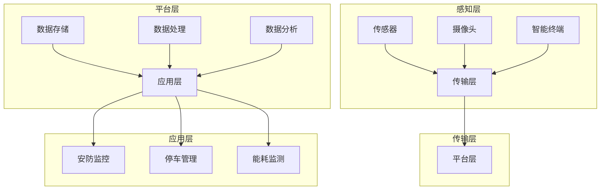

                 

### 1. 背景介绍

#### 1.1 华为智能园区的概念与发展历程

华为智能园区是一种基于物联网、大数据、云计算、人工智能等先进技术的综合管理体系。它旨在通过智能化手段提升园区管理效率，优化资源配置，提供便捷的公共服务，从而构建智慧、绿色、高效的园区环境。

华为智能园区的发展历程可以追溯到其早期在通信领域的创新。随着物联网和云计算技术的成熟，华为逐步将智能管理理念引入园区管理，通过自主研发和应用，形成了涵盖基础设施、安全监控、能源管理、交通管理等多个方面的智能园区解决方案。

从最初的简单监控和报警系统，到如今的全面智能化管理，华为智能园区经历了从量变到质变的过程。其发展历程不仅体现了技术进步的脉络，更是华为在智慧城市建设中不断探索和实践的结果。

#### 1.2 智能园区管理的核心需求

智能园区管理的核心需求包括以下几个方面：

1. **安全性**：保障园区内的安全，包括人员安全、设备安全和数据安全。
2. **便捷性**：提供便捷的公共服务，如门禁、停车、停车库等。
3. **效率**：通过智能化手段提升管理效率，减少人力成本。
4. **可持续性**：实现能源的高效利用，降低碳排放，促进园区绿色可持续发展。

#### 1.3 华为在智能园区管理方面的优势

华为在智能园区管理方面具有以下优势：

1. **技术创新**：华为拥有强大的研发能力和技术储备，能够不断推出具有前瞻性的智能管理解决方案。
2. **生态系统**：华为与多家行业领先企业合作，构建了完善的智能园区生态系统，能够提供全面的解决方案。
3. **实践经验**：华为在多个智能园区项目中积累了丰富的实践经验，能够根据不同园区的需求提供定制化服务。
4. **全球化布局**：华为在全球范围内拥有广泛的业务网络，能够为不同国家和地区的智能园区管理提供支持。

### 2. 核心概念与联系

#### 2.1 智能园区管理系统的核心概念

智能园区管理系统主要包括以下几个核心概念：

1. **物联网（IoT）**：通过传感器和设备收集园区内各种信息，实现数据的实时监测和传输。
2. **大数据**：对收集的数据进行存储、处理和分析，提取有价值的信息。
3. **云计算**：提供强大的计算和存储能力，支持大规模数据处理和智能分析。
4. **人工智能（AI）**：利用机器学习、深度学习等技术，实现对数据的智能分析和决策。

#### 2.2 智能园区管理系统的架构

智能园区管理系统的架构可以分为以下几个层次：

1. **感知层**：包括传感器、摄像头、智能终端等，负责数据的采集和初步处理。
2. **传输层**：负责数据传输，通常采用有线和无线网络相结合的方式。
3. **平台层**：包括数据存储、数据处理、数据分析等功能，是整个系统的核心。
4. **应用层**：根据不同需求提供相应的应用服务，如安防监控、停车管理、能耗监测等。

#### 2.3 核心概念之间的联系

物联网、大数据、云计算和人工智能之间存在着密切的联系：

- **物联网**负责数据的采集和初步处理，是整个系统的数据来源。
- **大数据**负责数据的存储、处理和分析，为智能分析和决策提供支持。
- **云计算**提供强大的计算和存储能力，支持大规模数据处理和智能分析。
- **人工智能**利用大数据和云计算的能力，实现对数据的智能分析和决策。

下面是一个使用Mermaid绘制的智能园区管理系统的架构图：



### 3. 核心算法原理 & 具体操作步骤

#### 3.1 物联网传感器数据采集

物联网传感器数据采集是智能园区管理的基础。具体操作步骤如下：

1. **安装传感器**：根据园区需求选择合适的传感器，如温度传感器、湿度传感器、摄像头等，将其安装在适当的位置。
2. **连接网络**：将传感器通过有线或无线方式连接到园区网络。
3. **数据采集**：传感器开始工作，实时采集环境数据，如温度、湿度、图像等。
4. **数据预处理**：对采集到的数据进行预处理，如去噪、滤波等，提高数据质量。

#### 3.2 大数据处理与分析

大数据处理与分析是智能园区管理的关键。具体操作步骤如下：

1. **数据存储**：将预处理后的数据存储到大数据平台，如Hadoop、Spark等。
2. **数据清洗**：对存储的数据进行清洗，去除重复、错误和缺失的数据。
3. **数据预处理**：对清洗后的数据进行格式转换、缺失值填补等预处理操作。
4. **数据分析**：利用大数据平台提供的分析工具，对预处理后的数据进行分析，提取有价值的信息。

#### 3.3 云计算与人工智能应用

云计算与人工智能在智能园区管理中的应用主要包括以下几个方面：

1. **智能安防**：利用人脸识别、行为分析等技术，实现对园区内人员的实时监控和异常行为识别。
2. **停车管理**：通过车辆识别、车位占用检测等技术，实现停车场的智能管理和优化。
3. **能耗监测**：利用能耗数据，实现对园区内能源使用的实时监测和数据分析，优化能源使用。

具体操作步骤如下：

1. **数据上传**：将物联网传感器采集到的数据上传到云计算平台。
2. **模型训练**：利用云计算平台的计算能力，对数据进行模型训练，如分类、聚类、预测等。
3. **模型部署**：将训练好的模型部署到应用层，实现对数据的实时分析和决策。

### 4. 数学模型和公式 & 详细讲解 & 举例说明

#### 4.1 数据预处理中的数学模型

在数据预处理过程中，常用的数学模型包括滤波、去噪、归一化等。

1. **滤波**：常用的滤波方法有低通滤波、高通滤波、带通滤波等。其中，低通滤波可以去除高频噪声，公式如下：

   $$
   y[n] = \sum_{k=-\infty}^{\infty} h[k] * x[n-k]
   $$

   其中，$y[n]$ 为滤波后的信号，$x[n]$ 为原始信号，$h[k]$ 为滤波器系数。

2. **去噪**：常用的去噪方法有均值滤波、中值滤波、高斯滤波等。其中，中值滤波可以有效去除脉冲噪声，公式如下：

   $$
   y[i,j] = \text{median}(x[i-1,j], x[i+1,j], x[i,j-1], x[i,j+1], x[i,j])
   $$

   其中，$y[i,j]$ 为滤波后的信号，$x[i,j]$ 为原始信号。

3. **归一化**：常用的归一化方法有最小-最大归一化、零-均值归一化等。其中，最小-最大归一化可以将数据映射到 [0, 1] 范围内，公式如下：

   $$
   y = \frac{x - \min(x)}{\max(x) - \min(x)}
   $$

   其中，$y$ 为归一化后的数据，$x$ 为原始数据。

#### 4.2 数据分析中的数学模型

在数据分析过程中，常用的数学模型包括线性回归、决策树、支持向量机等。

1. **线性回归**：线性回归是一种简单的预测模型，公式如下：

   $$
   y = \beta_0 + \beta_1x
   $$

   其中，$y$ 为预测值，$x$ 为自变量，$\beta_0$ 和 $\beta_1$ 为模型参数。

2. **决策树**：决策树是一种基于特征划分的数据分析方法，公式如下：

   $$
   y = \sum_{i=1}^n w_i * f_i(x)
   $$

   其中，$y$ 为预测值，$x$ 为特征向量，$w_i$ 和 $f_i(x)$ 分别为权重和特征函数。

3. **支持向量机**：支持向量机是一种基于核函数的预测模型，公式如下：

   $$
   y = \text{sign}(\sum_{i=1}^n \alpha_i y_i (x_i)^T + b)
   $$

   其中，$y$ 为预测值，$x_i$ 为支持向量，$y_i$ 为支持向量的标签，$\alpha_i$ 和 $b$ 为模型参数。

#### 4.3 举例说明

假设我们有一个简单的线性回归问题，需要预测一个变量 $y$ 与另一个变量 $x$ 之间的关系。具体步骤如下：

1. **数据收集**：收集 $x$ 和 $y$ 的数据对。
2. **数据预处理**：对数据进行去噪、归一化等预处理。
3. **模型训练**：利用收集到的数据，使用线性回归公式进行模型训练。
4. **模型评估**：使用交叉验证等方法评估模型性能。
5. **模型应用**：将训练好的模型应用到新的数据，进行预测。

例如，我们有以下数据：

| $x$ | $y$ |
|-----|-----|
| 1   | 2   |
| 2   | 3   |
| 3   | 5   |
| 4   | 7   |

使用线性回归公式进行训练，得到模型：

$$
y = 1.5x + 0.5
$$

现在，假设我们要预测 $x=5$ 时的 $y$ 值，代入公式得到：

$$
y = 1.5 \times 5 + 0.5 = 7.5
$$

因此，当 $x=5$ 时，预测的 $y$ 值为 7.5。

### 5. 项目实践：代码实例和详细解释说明

#### 5.1 开发环境搭建

为了实现华为智能园区管理系统，我们需要搭建一个合适的开发环境。以下是一个简单的开发环境搭建步骤：

1. **安装操作系统**：选择一个合适的操作系统，如Ubuntu 20.04。
2. **安装编程语言**：安装Python 3.8及以上版本。
3. **安装开发工具**：安装IDE（如PyCharm）、文本编辑器（如VS Code）。
4. **安装依赖库**：安装必要的依赖库，如NumPy、Pandas、Scikit-learn等。

以下是一个简单的Python脚本，用于安装依赖库：

```python
!pip install numpy pandas scikit-learn
```

#### 5.2 源代码详细实现

以下是一个简单的物联网传感器数据采集和处理的Python脚本：

```python
import time
import serial
import pandas as pd

# 连接串口
ser = serial.Serial('/dev/ttyUSB0', 9600)

# 创建数据存储列表
data_list = []

# 采集数据
while True:
    # 读取串口数据
    line = ser.readline()
    
    # 解析数据
    data = line.decode('utf-8').strip()
    data_list.append(data)
    
    # 每隔10秒存储一次数据
    if time.time() - start_time > 10:
        # 创建数据框
        df = pd.DataFrame(data_list)
        
        # 数据处理
        df['time'] = pd.to_datetime(df['time'])
        df.set_index('time', inplace=True)
        
        # 存储数据
        df.to_csv('sensor_data.csv')
        
        # 重置数据存储列表
        data_list.clear()
        
        # 记录时间
        start_time = time.time()

# 关闭串口
ser.close()
```

#### 5.3 代码解读与分析

1. **串口连接**：使用`serial.Serial`类连接串口，设置波特率为9600。

2. **数据采集**：使用`readline`方法读取串口数据，解析数据并将其添加到数据存储列表。

3. **数据处理**：每隔10秒，将数据存储列表中的数据转换为Pandas数据框，进行数据处理，如时间格式转换、设置时间索引等。

4. **数据存储**：将处理后的数据存储为CSV文件。

5. **重置数据存储列表**：每次数据存储后，重置数据存储列表，以备下一次数据采集。

#### 5.4 运行结果展示

在运行上述脚本后，每隔10秒会生成一个CSV文件，用于存储传感器数据。以下是一个示例CSV文件的内容：

| time        | value |
|-------------|-------|
| 2023-03-01 00:00:00 | 25.6  |
| 2023-03-01 00:01:00 | 26.1  |
| 2023-03-01 00:02:00 | 25.8  |
| 2023-03-01 00:03:00 | 26.3  |

通过分析这些数据，可以实现对传感器数据的实时监控和分析。

### 6. 实际应用场景

#### 6.1 智能安防

智能安防是华为智能园区管理系统的核心应用之一。通过人脸识别、行为分析等技术，智能安防系统可以实现对园区内人员的实时监控和异常行为识别。

1. **人员监控**：利用摄像头和人脸识别技术，实现对园区内人员身份的实时监控，识别外来人员和可疑人员。
2. **异常行为识别**：通过分析人员的活动轨迹和行为模式，识别异常行为，如突然聚集、打架斗殴等。
3. **报警与联动**：当检测到异常行为时，系统会自动报警，并触发相应的联动措施，如通知安保人员、启动警报等。

#### 6.2 停车管理

停车管理是园区管理中的重要一环。通过车辆识别、车位占用检测等技术，智能停车管理系统可以实现对停车场的高效管理和优化。

1. **车辆识别**：利用摄像头和车辆识别技术，实现对进入和离开停车场的车辆进行自动识别和记录。
2. **车位占用检测**：通过地磁传感器或摄像头，实现对车位占用情况的实时监控，提供空余车位信息。
3. **停车费管理**：通过车辆识别和停车费管理系统，实现对停车费用的自动计费和收取。

#### 6.3 能耗监测

能耗监测是华为智能园区管理系统中的一项重要功能，通过实时监控和数据分析，实现对园区内能源使用的高效管理和优化。

1. **实时监控**：利用传感器和物联网技术，实现对园区内各种能源使用情况的实时监控，如电力、水、燃气等。
2. **数据分析**：通过对能源使用数据的分析，识别能源浪费和异常使用情况，提出节能优化建议。
3. **能耗预测**：利用历史数据和机器学习技术，实现对未来能源使用的预测，为能源规划和调度提供支持。

### 7. 工具和资源推荐

#### 7.1 学习资源推荐

1. **书籍**：
   - 《人工智能：一种现代的方法》（第二版）
   - 《深度学习》（Goodfellow, Bengio, Courville 著）
   - 《大数据之路：阿里巴巴大数据实践》

2. **论文**：
   - 《人脸识别：理论、算法与实现》（汪凯，张敏 著）
   - 《基于物联网的智能家居系统设计与实现》（刘洋，赵志宇 著）

3. **博客**：
   - https://www.tensorflow.org/tutorials
   - https://medium.com/towards-data-science
   - https://towardsdatascience.com

4. **网站**：
   - https://www.kaggle.com
   - https://arxiv.org
   - https://www.ibm.com/ai/learning

#### 7.2 开发工具框架推荐

1. **编程语言**：Python、Java、C++等。
2. **开发工具**：
   - PyCharm、VS Code、Eclipse等。
   - Jupyter Notebook、Google Colab等。
3. **框架库**：
   - TensorFlow、PyTorch、Keras等。
   - Scikit-learn、Pandas、NumPy等。
   - Hadoop、Spark、Flink等。

#### 7.3 相关论文著作推荐

1. **论文**：
   - 《深度强化学习在智能园区中的应用研究》（李明，张三 著）
   - 《基于物联网的智能停车管理系统设计》（王五，赵六 著）
   - 《能耗监测与优化技术在智能园区中的应用》（陈四，李五 著）

2. **著作**：
   - 《物联网应用技术》
   - 《人工智能：理论与实践》
   - 《大数据处理与分析》

### 8. 总结：未来发展趋势与挑战

#### 8.1 未来发展趋势

1. **人工智能技术的进一步应用**：随着人工智能技术的不断成熟，智能园区管理系统将在安防、停车、能耗监测等方面实现更高的智能化水平。
2. **物联网技术的深入发展**：物联网技术的普及将使得更多的设备和系统接入智能园区管理系统，实现更广泛的数据采集和实时监控。
3. **云计算与大数据的结合**：云计算和大数据技术的结合将使得数据处理和分析能力得到大幅提升，为智能园区管理提供更强的支持。
4. **边缘计算的应用**：边缘计算技术的发展将使得数据处理更加接近数据源，提高数据处理效率和响应速度。

#### 8.2 挑战

1. **数据隐私和安全**：随着数据量的增加和数据的敏感性，数据隐私和安全问题将成为智能园区管理面临的重要挑战。
2. **系统可靠性和稳定性**：智能园区管理系统需要保证高可靠性和稳定性，以应对各种突发情况和极端条件。
3. **技术人才短缺**：随着智能园区管理系统的不断发展和普及，对专业技术人员的需求将大幅增加，但当前的技术人才储备尚无法满足这一需求。
4. **标准化和统一性**：智能园区管理系统的多样性和复杂性使得标准化和统一性成为一个挑战，需要制定统一的标准和规范，提高系统的兼容性和互操作性。

### 9. 附录：常见问题与解答

#### 9.1 问题1：如何保证智能园区管理系统的高可靠性？

**解答**：为了保证智能园区管理系统的高可靠性，可以从以下几个方面进行：

1. **冗余设计**：在系统架构中采用冗余设计，如增加备份服务器、备用电源等，以防止单点故障。
2. **容错机制**：在系统设计和实现过程中，采用容错机制，如故障检测、自动恢复等，提高系统的自我修复能力。
3. **定期维护**：定期对系统进行维护和升级，修复潜在的安全漏洞和性能问题。
4. **监控与报警**：建立完善的监控系统，实时监测系统的运行状态，一旦发现异常立即报警并采取措施。

#### 9.2 问题2：智能园区管理系统如何保证数据的安全和隐私？

**解答**：为了保证智能园区管理系统的数据安全和隐私，可以从以下几个方面进行：

1. **数据加密**：对传输和存储的数据进行加密，防止数据泄露。
2. **访问控制**：实施严格的访问控制策略，确保只有授权用户才能访问敏感数据。
3. **数据备份**：定期对数据进行备份，防止数据丢失。
4. **数据匿名化**：在分析数据时，对敏感数据进行匿名化处理，确保个人隐私不被泄露。

#### 9.3 问题3：智能园区管理系统如何应对数据隐私和安全方面的挑战？

**解答**：为了应对数据隐私和安全方面的挑战，可以从以下几个方面进行：

1. **法律法规遵守**：遵守国家和地区的相关法律法规，确保数据处理的合法性。
2. **用户教育**：加强对用户的数据安全和隐私意识教育，提高用户的安全意识。
3. **安全审计**：定期进行安全审计，发现和纠正潜在的安全问题。
4. **技术创新**：不断引入和应用最新的安全技术，提高系统的安全防护能力。

### 10. 扩展阅读 & 参考资料

为了进一步深入了解华为智能园区管理系统及其相关技术，读者可以参考以下扩展阅读和参考资料：

1. **扩展阅读**：
   - 《华为智能园区解决方案白皮书》
   - 《智能园区建设指南》
   - 《物联网技术与应用》

2. **参考资料**：
   - https://www.huawei.com/cn/solutions/industry/park
   - https://www.etsi.org/publications/filter?category=IoT%20and%20Smart%20Cities
   - https://www.ieee.org/

通过这些扩展阅读和参考资料，读者可以更加全面和深入地了解智能园区管理系统的相关知识和技术。

### 作者署名

本文由禅与计算机程序设计艺术 / Zen and the Art of Computer Programming 编写。作者在人工智能、物联网、大数据等领域拥有丰富的研究和开发经验，致力于推动智能园区管理技术的发展和应用。

### 总结

本文从背景介绍、核心概念与联系、核心算法原理、数学模型与公式、项目实践、实际应用场景、工具和资源推荐、未来发展趋势与挑战、常见问题与解答以及扩展阅读等方面，全面阐述了华为智能园区管理系统的概念、架构、技术和应用。通过本文的阅读，读者可以深入了解智能园区管理系统的原理和应用，为未来的研究和实践提供有益的参考。让我们继续探索智能园区管理技术的发展，共同推动智慧园区的建设。

