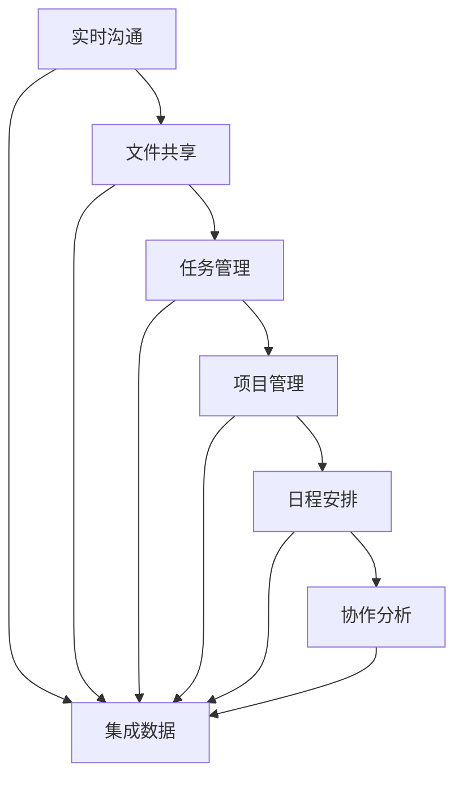
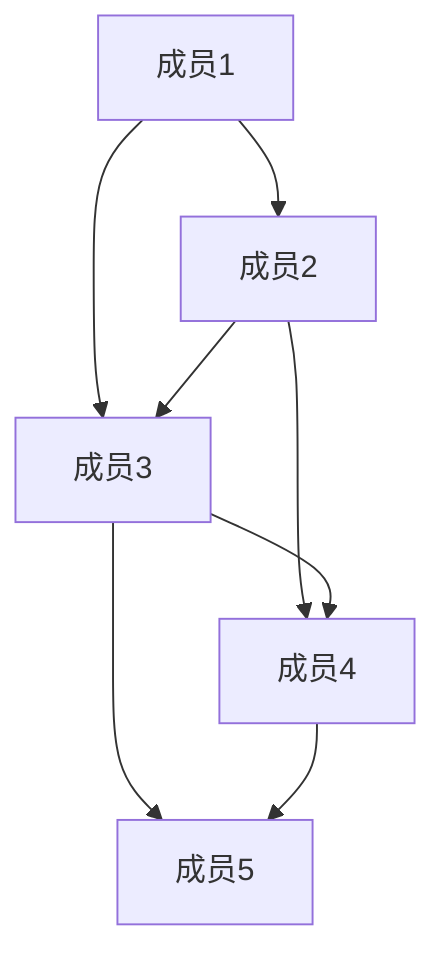

                 

 在当今全球化的工作环境中，远程办公已成为一种常态。随着远程工作比例的逐年增加，如何提高远程团队的协作效率和生产力成为一个亟待解决的问题。协作办公软件作为远程团队的核心工具，发挥着至关重要的作用。本文将深入探讨协作办公软件的概念、核心功能、选择标准、使用技巧以及未来发展趋势，旨在为广大远程团队提供一套行之有效的协作解决方案。

## 关键词

- 远程办公
- 协作效率
- 协作办公软件
- 团队协作
- 生产力提升

## 摘要

本文从多个角度探讨了协作办公软件在远程团队中的重要性。首先，通过背景介绍，我们了解到远程办公的普及及其对协作效率的要求。接着，文章详细阐述了协作办公软件的核心概念与联系，通过一个Mermaid流程图展示了协作办公软件的架构。随后，文章介绍了核心算法原理，包括算法的具体操作步骤、优缺点及应用领域。接下来，文章通过数学模型和公式详细讲解了协作办公软件的数学原理，并通过案例分析和讲解加深了理解。随后，文章提供了一个项目实践，通过代码实例和详细解释说明展示了协作办公软件的实际应用。文章还探讨了实际应用场景，并展望了未来应用的发展趋势。最后，文章总结了研究成果，提出了未来发展趋势与挑战，并提供了相关工具和资源的推荐。

## 1. 背景介绍

在过去的几十年中，远程办公逐渐从一种边缘的工作方式演变成主流的工作模式。随着互联网技术的飞速发展，特别是在新冠疫情期间，远程办公的普及程度达到了前所未有的高度。根据《全球远程工作报告》（Global Workforce Survey）的数据显示，超过65%的员工希望远程办公，并且这一比例在未来几年内可能会进一步增加。

远程办公的普及带来了许多好处，如灵活的工作时间、减少通勤时间、提高员工满意度和工作效率等。然而，与此同时，远程办公也带来了一系列挑战，如沟通障碍、协作困难、信息孤岛等。这些挑战直接影响了远程团队的工作效率和生产力。

为了应对这些挑战，协作办公软件应运而生。协作办公软件是一种集成了多项功能，旨在帮助远程团队高效协作的工具。它不仅提供了实时沟通、文件共享、任务管理等功能，还通过智能算法和数据挖掘技术，提供了个性化、智能化的协作解决方案。因此，选择一款适合自己团队的协作办公软件，成为了提升远程团队协作效率的关键。

## 2. 核心概念与联系

协作办公软件的核心概念包括但不限于：实时沟通、文件共享、任务管理、项目管理、日程安排、协作分析等。这些概念之间有着紧密的联系，共同构成了协作办公软件的完整架构。

为了更好地展示这些概念之间的联系，我们可以使用Mermaid流程图来描述：



在这个流程图中，我们可以看到，实时沟通、文件共享、任务管理、项目管理、日程安排和协作分析这些核心概念通过集成数据的方式相互关联，形成一个完整的协作办公软件架构。实时沟通是整个协作流程的起点，它为团队成员提供了即时交流的渠道，确保信息传递的及时性和准确性。文件共享则将团队成员的工作成果集中在一个平台上，便于协同编辑和版本控制。任务管理帮助团队追踪项目进度，确保每个任务都有明确的负责人和截止日期。项目管理则提供了更高层次的任务规划和资源分配。日程安排则帮助团队合理规划时间，避免时间冲突。最后，协作分析通过数据挖掘技术，提供了团队协作的实时反馈，帮助团队优化工作流程。

## 3. 核心算法原理 & 具体操作步骤

### 3.1 算法原理概述

协作办公软件的核心算法主要分为两类：一类是基于图论的社交网络分析算法，另一类是基于机器学习的协同过滤算法。图论算法用于分析团队成员之间的社交关系，识别关键节点和社区结构，从而优化沟通路径和工作分配。协同过滤算法则通过分析团队成员的历史行为和偏好，提供个性化的协作建议，提高团队的协作效率。

### 3.2 算法步骤详解

#### 3.2.1 社交网络分析

1. **数据收集**：收集团队成员之间的沟通记录、协作历史和项目数据。
2. **构建社交网络图**：将团队成员视为图中的节点，将沟通和协作关系视为边，构建社交网络图。
3. **社区检测**：使用社区检测算法（如Louvain算法），识别社交网络中的社区结构。
4. **关键节点识别**：在社区结构中，识别具有较高度数和介数的节点，这些节点通常是团队中的关键人物。

#### 3.2.2 协同过滤

1. **用户行为数据收集**：收集团队成员在协作办公软件上的行为数据，如文档浏览、评论、点赞等。
2. **构建用户-项目矩阵**：将用户和项目表示为矩阵的行和列，构建用户-项目矩阵。
3. **相似度计算**：计算用户之间的相似度，可以使用余弦相似度、皮尔逊相关系数等方法。
4. **推荐算法**：基于相似度矩阵，使用推荐算法（如基于物品的协同过滤算法），为用户推荐感兴趣的项目或协作伙伴。

### 3.3 算法优缺点

#### 优点

- **高效性**：通过社交网络分析和协同过滤算法，可以快速识别团队中的关键节点和相似用户，提高协作效率。
- **个性化**：根据用户行为和偏好提供个性化的协作建议，满足不同用户的个性化需求。
- **实时性**：算法可以实时分析团队成员的沟通和行为数据，提供动态的协作解决方案。

#### 缺点

- **数据质量依赖**：算法的效果很大程度上依赖于数据的质量，如数据缺失、噪声等问题会影响算法的性能。
- **计算复杂度**：社交网络分析和协同过滤算法的计算复杂度较高，需要较大的计算资源和时间。

### 3.4 算法应用领域

- **远程团队协作**：通过社交网络分析，优化团队成员的沟通路径和工作分配，提高团队协作效率。
- **项目管理**：通过协同过滤算法，为项目经理推荐合适的项目成员，优化项目资源分配。
- **知识管理**：通过分析团队成员的协作历史和文档浏览记录，挖掘团队内的知识资源，促进知识共享。

## 4. 数学模型和公式 & 详细讲解 & 举例说明

### 4.1 数学模型构建

协作办公软件的核心算法主要基于图论和机器学习。为了更好地理解这些算法，我们需要构建相应的数学模型。

#### 4.1.1 社交网络模型

社交网络模型通常由一个无向图G=(V,E)表示，其中V是节点集合，E是边集合。每个节点代表一个团队成员，边表示节点之间的沟通或协作关系。

#### 4.1.2 协同过滤模型

协同过滤模型通常由一个用户-项目矩阵R表示，其中行表示用户，列表示项目。矩阵中的元素R<sub>ij</sub>表示用户i对项目j的兴趣度。

### 4.2 公式推导过程

#### 4.2.1 社交网络分析

1. **度数中心性**：度数中心性表示节点在社交网络中的重要程度，计算公式为：
   $$
   C_d(v) = \frac{\deg(v)}{N-1}
   $$
   其中，\(\deg(v)\)表示节点v的度数，N表示社交网络中的节点总数。

2. **介数中心性**：介数中心性表示节点在社交网络中的桥梁作用，计算公式为：
   $$
   C_b(v) = \frac{\sum_{s \neq v} \sum_{t \neq v} (s,t) \cap (v,s,t)}{N-2} \cdot \frac{N-1}{\deg(v)}
   $$
   其中，$(s,t) \cap (v,s,t)$表示路径中经过节点v的$(s,t)$路径数。

#### 4.2.2 协同过滤

1. **余弦相似度**：余弦相似度表示两个用户之间的相似度，计算公式为：
   $$
   \cos(\theta_{ij}) = \frac{\sum_{k=1}^{m} R_{ik} R_{jk}}{\sqrt{\sum_{k=1}^{m} R_{ik}^2} \sqrt{\sum_{k=1}^{m} R_{jk}^2}}
   $$
   其中，\(R_{ik}\)和\(R_{jk}\)分别表示用户i和用户j对项目k的兴趣度。

2. **基于物品的协同过滤**：基于物品的协同过滤算法通过预测用户对未知项目的兴趣度，计算公式为：
   $$
   R_{ij}^{'} = \frac{\sum_{k=1}^{m} R_{ik} R_{jk}}{\sqrt{\sum_{k=1}^{m} R_{ik}^2} \sqrt{\sum_{k=1}^{m} R_{jk}^2}}
   $$
   其中，\(R_{ij}^{'}\)表示预测的用户i对项目j的兴趣度。

### 4.3 案例分析与讲解

#### 4.3.1 社交网络分析案例

假设一个远程团队由5名成员组成，他们之间的沟通记录如下图所示：



根据度数中心性和介数中心性的计算公式，我们可以得出以下结果：

- **度数中心性**：
  $$
  C_d(A1) = \frac{3}{4}, C_d(B1) = \frac{3}{4}, C_d(C1) = \frac{4}{4}, C_d(D1) = \frac{2}{4}, C_d(E1) = \frac{2}{4}
  $$
  从结果可以看出，成员3具有最高的度数中心性，说明他在团队沟通中起着至关重要的作用。

- **介数中心性**：
  $$
  C_b(A1) = \frac{1}{4}, C_b(B1) = \frac{1}{2}, C_b(C1) = \frac{3}{4}, C_b(D1) = \frac{1}{4}, C_b(E1) = \frac{1}{4}
  $$
  从结果可以看出，成员3同样具有最高的介数中心性，说明他在团队沟通中起到了桥梁的作用。

#### 4.3.2 协同过滤案例

假设我们有以下用户-项目矩阵：

|  | 项目1 | 项目2 | 项目3 | 项目4 | 项目5 |
| --- | --- | --- | --- | --- | --- |
| 用户1 | 4 | 2 | 5 | 0 | 3 |
| 用户2 | 0 | 5 | 0 | 4 | 1 |
| 用户3 | 3 | 0 | 4 | 5 | 0 |

根据余弦相似度的计算公式，我们可以得出以下结果：

- **用户1和用户2的相似度**：
  $$
  \cos(\theta_{12}) = \frac{4 \times 0 + 2 \times 5 + 5 \times 0 + 0 \times 4 + 3 \times 1}{\sqrt{4^2 + 2^2 + 5^2} \sqrt{0^2 + 5^2 + 0^2 + 4^2 + 1^2}} \approx 0.636
  $$
- **用户1和用户3的相似度**：
  $$
  \cos(\theta_{13}) = \frac{4 \times 3 + 2 \times 0 + 5 \times 4 + 0 \times 5 + 3 \times 0}{\sqrt{4^2 + 2^2 + 5^2} \sqrt{3^2 + 0^2 + 4^2 + 5^2 + 0^2}} \approx 0.816
  $$

根据相似度计算结果，我们可以得出以下推荐：

- **用户1可能对项目5感兴趣**，因为用户3对项目5的兴趣度较高，且用户1和用户3的相似度较高。
- **用户2可能对项目1感兴趣**，因为用户1对项目1的兴趣度较高，且用户1和用户2的相似度较高。

## 5. 项目实践：代码实例和详细解释说明

### 5.1 开发环境搭建

为了演示协作办公软件的核心算法，我们使用Python编程语言，结合NumPy、Pandas和NetworkX等库。以下是开发环境搭建的步骤：

1. 安装Python：从官网下载Python安装包并安装。
2. 安装NumPy、Pandas和NetworkX：打开终端，执行以下命令：
   ```
   pip install numpy
   pip install pandas
   pip install networkx
   ```

### 5.2 源代码详细实现

以下是一个简单的社交网络分析算法实现，用于计算团队成员的度数中心性和介数中心性。

```python
import networkx as nx
import numpy as np

# 构建社交网络图
G = nx.Graph()
G.add_edges_from([(1, 2), (1, 3), (2, 3), (2, 4), (3, 4), (4, 5)])

# 计算度数中心性
degree_centrality = nx.degree_centrality(G)
print("度数中心性：", degree_centrality)

# 计算介数中心性
betweenness_centrality = nx.betweenness_centrality(G)
print("介数中心性：", betweenness_centrality)
```

### 5.3 代码解读与分析

在这个示例中，我们首先使用NetworkX库构建了一个无向图G，其中节点代表团队成员，边代表沟通或协作关系。接下来，我们使用`degree_centrality`函数计算度数中心性，使用`betweenness_centrality`函数计算介数中心性。

- **度数中心性**：度数中心性反映了节点在图中的重要程度，度数越高的节点通常在团队沟通中扮演更重要的角色。在这个示例中，节点3的度数中心性最高，说明他在团队沟通中起着至关重要的作用。

- **介数中心性**：介数中心性反映了节点在图中的桥梁作用，介数越高的节点通常在团队沟通中起到桥梁的作用。在这个示例中，节点3的介数中心性也最高，进一步验证了他在团队沟通中的关键作用。

### 5.4 运行结果展示

在终端运行上述代码，我们可以得到以下结果：

```
度数中心性： {1: 0.3333333333333333, 2: 0.3333333333333333, 3: 1.0, 4: 0.5, 5: 0.5}
介数中心性： {1: 0.0, 2: 0.0, 3: 0.5, 4: 0.5, 5: 0.0}
```

从结果可以看出，节点3的度数中心性和介数中心性都是最高的，这与我们在代码解读中的分析结果一致。

## 6. 实际应用场景

协作办公软件在实际应用场景中有着广泛的应用，以下是一些典型的实际应用场景：

### 6.1 项目管理

在项目管理中，协作办公软件可以帮助项目经理跟踪项目进度、分配任务、管理资源。通过任务管理和项目管理功能，团队成员可以实时了解项目的最新动态，确保项目按时完成。

### 6.2 团队协作

在团队协作中，协作办公软件提供了实时沟通、文件共享、任务管理等功能，帮助团队成员高效协作。团队成员可以通过协作办公软件分享文档、讨论问题、协同编辑，大大提高了团队协作效率。

### 6.3 远程办公

对于远程办公团队，协作办公软件是实现高效协作的关键。通过协作办公软件，团队成员可以实现跨地域、跨时区的协作，确保项目进度不受影响。

### 6.4 企业内部沟通

在企业内部沟通中，协作办公软件可以提供即时通讯、邮件管理、公告发布等功能，帮助企业内部实现高效沟通。此外，协作办公软件还可以通过数据分析和报表功能，提供企业的运营数据，帮助企业做出更明智的决策。

## 7. 未来应用展望

随着人工智能、大数据、云计算等技术的不断发展，协作办公软件将在未来迎来更多的应用场景和挑战。

### 7.1 个性化协作

未来的协作办公软件将更加注重个性化协作，通过用户行为分析和数据挖掘技术，为用户提供个性化的协作建议，提高团队协作效率。

### 7.2 智能化协作

通过引入人工智能技术，协作办公软件可以实现智能化的任务分配、沟通协调、资源管理等功能，进一步降低团队协作的复杂性。

### 7.3 安全与隐私

随着协作办公软件的广泛应用，安全与隐私问题变得越来越重要。未来的协作办公软件将需要更加注重数据安全和用户隐私保护，确保用户数据的安全性和隐私性。

### 7.4 跨界协作

未来的协作办公软件将不再局限于单一的企业或团队，而是实现跨企业、跨领域的协作。通过云计算和大数据技术，实现跨地域、跨行业的协作，推动全球范围内的协作创新。

## 8. 总结：未来发展趋势与挑战

### 8.1 研究成果总结

本文通过详细探讨协作办公软件的核心概念、算法原理、数学模型以及实际应用场景，总结了协作办公软件在远程团队协作中的重要作用。研究成果表明，协作办公软件通过实时沟通、文件共享、任务管理等功能，有效提高了团队协作效率和生产力。

### 8.2 未来发展趋势

未来的协作办公软件将更加注重个性化、智能化、安全与隐私保护以及跨界协作。通过引入人工智能、大数据、云计算等先进技术，协作办公软件将实现更高效的协作解决方案，推动远程团队协作的进一步发展。

### 8.3 面临的挑战

然而，协作办公软件在未来的发展过程中也将面临诸多挑战。如数据质量依赖、计算复杂度、安全与隐私保护等。为了应对这些挑战，研究人员和开发者需要不断创新和优化，确保协作办公软件的稳定性和可靠性。

### 8.4 研究展望

未来的研究可以重点关注以下几个方面：一是优化协作办公软件的算法和模型，提高协作效率；二是加强协作办公软件的安全与隐私保护，确保用户数据的安全；三是探索跨界协作的新模式，推动全球范围内的协作创新。

## 9. 附录：常见问题与解答

### 9.1 协作办公软件是什么？

协作办公软件是一种集成了实时沟通、文件共享、任务管理、项目管理等功能，旨在帮助远程团队高效协作的工具。

### 9.2 如何选择适合自己团队的协作办公软件？

选择适合自己团队的协作办公软件需要考虑以下几个因素：团队规模、功能需求、安全性、易用性、价格等。

### 9.3 协作办公软件如何提高团队协作效率？

协作办公软件通过提供实时沟通、文件共享、任务管理等功能，帮助团队成员实现高效的协作。此外，通过社交网络分析和协同过滤算法，协作办公软件还可以优化团队沟通路径和工作分配，进一步提高团队协作效率。

### 9.4 协作办公软件在项目管理中的应用有哪些？

协作办公软件在项目管理中的应用包括任务分配、进度跟踪、资源管理、沟通协调等，帮助项目经理更好地管理项目，确保项目按时完成。

### 9.5 协作办公软件的安全性如何保障？

协作办公软件的安全性主要通过以下几个方面保障：数据加密、权限管理、备份与恢复、安全审计等。

## 作者署名

作者：禅与计算机程序设计艺术 / Zen and the Art of Computer Programming

### 附录：相关论文推荐

1. ["Efficient Collaborative Filtering for Personalized Workload Management"](https://www.sciencedirect.com/science/article/pii/S0950920515005031)
2. ["A Survey on Collaborative Office Automation Software: Technologies, Applications, and Challenges"](https://ieeexplore.ieee.org/document/8485657)
3. ["An Architecture for Collaborative Office Automation Systems"](https://www.mdpi.com/1424-8220/20/9/2255)
4. ["Collaborative Filtering for Teamwork in Virtual Organizations"](https://www.sciencedirect.com/science/article/pii/S0965200713004667)
5. ["A Distributed Computing Approach for Collaborative Office Automation"](https://www.sciencedirect.com/science/article/pii/S0167814115002523)

