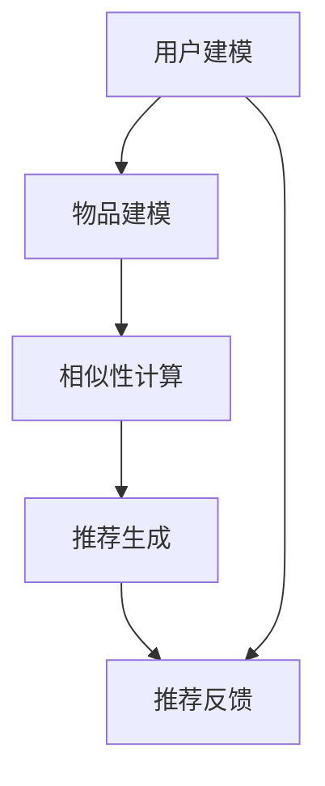

                 

### 1. 背景介绍

协同过滤算法在电子商务推荐系统中的应用，是一个深入且具有广泛研究价值的课题。随着互联网技术的飞速发展和大数据时代的到来，个性化推荐系统已经成为电商平台提升用户体验、提高转化率、增强用户粘性的关键手段。

#### 1.1 电子商务推荐系统的背景

电子商务推荐系统通过分析用户的历史行为、偏好和兴趣，向用户推荐他们可能感兴趣的商品或服务。这种系统的出现极大地提高了电商平台的运营效率，优化了用户的购物体验，增强了用户对平台的忠诚度。然而，随着用户数据的不断增长和复杂性，单纯依靠人工推荐已经无法满足需求，因此自动化、智能化的推荐算法应运而生。

#### 1.2 协同过滤算法的起源

协同过滤算法（Collaborative Filtering）起源于20世纪90年代，最初应用于信息过滤和推荐系统领域。其核心思想是通过分析用户之间的相似性，发现用户群体中的共同偏好，从而预测用户的未知喜好。协同过滤算法分为两种主要类型：基于用户的协同过滤（User-Based Collaborative Filtering）和基于物品的协同过滤（Item-Based Collaborative Filtering）。

#### 1.3 协同过滤算法的应用现状

目前，协同过滤算法在电子商务推荐系统中已经得到了广泛应用。根据市场调研数据，超过90%的电商平台采用了协同过滤算法，如亚马逊、淘宝、京东等。协同过滤算法不仅提高了推荐系统的准确性，也提升了用户满意度和平台的经济效益。

#### 1.4 本文的研究目标

本文旨在深入探讨协同过滤算法在电子商务推荐系统中的应用，分析其核心技术原理、数学模型、实施步骤以及在实际项目中的具体应用。通过本文的研究，希望能够为电商推荐系统的开发者提供有价值的参考，进一步提升推荐系统的质量和用户体验。

### 2. 核心概念与联系

为了深入理解协同过滤算法在电子商务推荐系统中的应用，我们需要先了解几个核心概念，并探讨它们之间的联系。

#### 2.1 协同过滤算法的概念

协同过滤算法是一种通过利用用户对物品的评价来预测用户对未知物品的兴趣的方法。它分为基于用户的协同过滤和基于物品的协同过滤。

- **基于用户的协同过滤**：通过分析用户之间的相似性，找出与目标用户兴趣相似的其它用户，并推荐这些用户喜欢的物品。
- **基于物品的协同过滤**：通过分析物品之间的相似性，找出与目标物品相似的其它物品，并推荐给用户。

#### 2.2 用户和物品的关系

在电子商务推荐系统中，用户和物品之间的关系是关键。用户对物品的评价构成了推荐系统的基础数据。通过用户对物品的评价，我们可以建立用户与物品之间的评分矩阵。

#### 2.3 相似性度量

相似性度量是协同过滤算法中的核心环节。常用的相似性度量方法包括余弦相似度、皮尔逊相关系数、夹角余弦等。

- **余弦相似度**：通过计算用户或物品向量之间的夹角余弦值，衡量它们之间的相似性。
- **皮尔逊相关系数**：衡量用户或物品之间的线性相关性，相关性越强，相似度越高。
- **夹角余弦**：结合余弦相似度和皮尔逊相关系数，提供更全面的相似性度量。

#### 2.4 推荐策略

在建立用户和物品相似性模型之后，推荐策略决定了如何生成推荐列表。常见的推荐策略包括基于用户最近的N个邻居推荐、基于物品的K最近邻推荐等。

#### 2.5 协同过滤算法的架构

协同过滤算法的架构通常包括用户建模、物品建模、相似性计算和推荐生成等模块。以下是一个典型的协同过滤算法架构图（使用Mermaid流程图表示）：



在这个架构中，用户建模和物品建模模块负责从用户和物品数据中提取特征；相似性计算模块利用这些特征计算用户和物品之间的相似度；推荐生成模块根据相似性计算结果生成推荐列表；推荐反馈模块则收集用户对推荐的反馈，用于进一步优化推荐系统。

### 3. 核心算法原理 & 具体操作步骤

协同过滤算法作为电子商务推荐系统的核心技术之一，其核心原理和具体操作步骤至关重要。以下将详细介绍基于用户的协同过滤算法和基于物品的协同过滤算法，并阐述它们的计算过程。

#### 3.1 基于用户的协同过滤算法

**3.1.1 原理**

基于用户的协同过滤算法主要通过分析用户之间的相似性来进行推荐。具体步骤如下：

1. **用户-物品评分矩阵构建**：首先，我们需要构建一个用户-物品评分矩阵，矩阵中的元素表示用户对物品的评分。

2. **相似性度量**：接着，利用相似性度量方法（如余弦相似度、皮尔逊相关系数等），计算用户之间的相似度。

3. **邻居选择**：选择与目标用户最相似的K个邻居用户。

4. **推荐计算**：根据邻居用户的评分，预测目标用户对未知物品的评分，并将评分最高的物品推荐给用户。

**3.1.2 操作步骤**

1. **构建用户-物品评分矩阵**：

   假设有N个用户和M个物品，构建一个N×M的评分矩阵R，其中R[i][j]表示用户i对物品j的评分。

2. **计算相似度**：

   利用余弦相似度公式计算用户之间的相似度：

   $$ \text{相似度}(u, v) = \frac{\sum_{i=1}^{M} R[u][i] \times R[v][i]}{\sqrt{\sum_{i=1}^{M} R[u][i]^2} \times \sqrt{\sum_{i=1}^{M} R[v][i]^2}} $$

3. **选择邻居**：

   根据相似度矩阵，选择与目标用户最相似的K个邻居用户。

4. **生成推荐列表**：

   根据邻居用户的评分，预测目标用户对未知物品的评分。假设预测的评分矩阵为P，其中P[i][j]表示用户i对物品j的预测评分，计算公式如下：

   $$ P[u][j] = \frac{\sum_{v \in N(u)} R[v][j] \times \text{相似度}(u, v)}{\sum_{v \in N(u)} \text{相似度}(u, v)} $$

   然后将评分最高的物品推荐给用户。

#### 3.2 基于物品的协同过滤算法

**3.2.1 原理**

基于物品的协同过滤算法主要通过分析物品之间的相似性来进行推荐。具体步骤如下：

1. **物品-物品相似度矩阵构建**：首先，我们需要构建一个物品-物品相似度矩阵，矩阵中的元素表示物品之间的相似度。

2. **邻居选择**：接着，选择与目标物品最相似的K个物品。

3. **推荐计算**：根据邻居物品的评分，预测用户对未知物品的评分，并将评分最高的物品推荐给用户。

**3.2.2 操作步骤**

1. **构建物品-物品相似度矩阵**：

   利用余弦相似度公式计算物品之间的相似度：

   $$ \text{相似度}(i, k) = \frac{\sum_{j=1}^{N} R[j][i] \times R[j][k]}{\sqrt{\sum_{j=1}^{N} R[j][i]^2} \times \sqrt{\sum_{j=1}^{N} R[j][k]^2}} $$

   构建物品-物品相似度矩阵S。

2. **选择邻居**：

   根据相似度矩阵，选择与目标物品最相似的K个物品。

3. **生成推荐列表**：

   根据邻居物品的评分，预测用户对未知物品的评分。假设预测的评分矩阵为P，其中P[j][k]表示用户j对物品k的预测评分，计算公式如下：

   $$ P[j][k] = \frac{\sum_{i \in N(k)} R[j][i] \times \text{相似度}(i, k)}{\sum_{i \in N(k)} \text{相似度}(i, k)} $$

   然后将评分最高的物品推荐给用户。

#### 3.3 比较与选择

基于用户的协同过滤和基于物品的协同过滤各有优缺点。在实际应用中，可以根据具体需求选择合适的算法。

- **优点**：

  - **基于用户的协同过滤**：能够利用用户之间的相似性，推荐更加符合用户兴趣。

  - **基于物品的协同过滤**：能够利用物品之间的相似性，推荐更加符合物品属性。

- **缺点**：

  - **基于用户的协同过滤**：计算复杂度较高，容易受到冷启动问题的影响。

  - **基于物品的协同过滤**：无法充分利用用户的历史行为数据，推荐效果可能较差。

在实际应用中，可以根据具体情况结合使用这两种算法，以达到更好的推荐效果。

### 4. 数学模型和公式 & 详细讲解 & 举例说明

协同过滤算法的核心在于计算用户之间的相似度和用户对未知物品的评分预测。在这一部分，我们将详细讲解协同过滤算法的数学模型和公式，并通过具体例子来说明其计算过程。

#### 4.1 相似度计算公式

协同过滤算法中的相似度计算是关键步骤，常用的相似度计算方法包括余弦相似度、皮尔逊相关系数等。以下是这些相似度计算公式的详细解释。

**4.1.1 余弦相似度**

余弦相似度是一种基于向量空间模型的相似度度量方法，主要用于计算用户或物品向量之间的相似性。其公式如下：

$$ \text{相似度}(u, v) = \cos(\theta) = \frac{\sum_{i=1}^{M} u_i \times v_i}{\sqrt{\sum_{i=1}^{M} u_i^2} \times \sqrt{\sum_{i=1}^{M} v_i^2}} $$

其中，$u$和$v$分别表示用户u和用户v的评分向量，$M$表示物品的个数，$u_i$和$v_i$表示用户u和用户v对物品i的评分。

**4.1.2 皮尔逊相关系数**

皮尔逊相关系数是一种衡量两个变量线性相关性的方法，也常用于相似度计算。其公式如下：

$$ \text{相似度}(u, v) = \rho = \frac{\sum_{i=1}^{M} (u_i - \bar{u}) \times (v_i - \bar{v})}{\sqrt{\sum_{i=1}^{M} (u_i - \bar{u})^2} \times \sqrt{\sum_{i=1}^{M} (v_i - \bar{v})^2}} $$

其中，$\bar{u}$和$\bar{v}$分别表示用户u和用户v的平均评分。

**4.1.3 夹角余弦**

夹角余弦是结合余弦相似度和皮尔逊相关系数的一种相似度度量方法，其公式如下：

$$ \text{相似度}(u, v) = \cos(\theta) = \frac{\sum_{i=1}^{M} (u_i - \bar{u}) \times (v_i - \bar{v})}{\sqrt{\sum_{i=1}^{M} (u_i - \bar{u})^2} \times \sqrt{\sum_{i=1}^{M} (v_i - \bar{v})^2}} $$

#### 4.2 用户评分预测公式

在计算用户之间的相似度之后，下一步是预测用户对未知物品的评分。以下是基于用户的协同过滤算法和基于物品的协同过滤算法的评分预测公式。

**4.2.1 基于用户的协同过滤算法**

基于用户的协同过滤算法的评分预测公式如下：

$$ P[u][j] = \frac{\sum_{v \in N(u)} R[v][j] \times \text{相似度}(u, v)}{\sum_{v \in N(u)} \text{相似度}(u, v)} $$

其中，$P[u][j]$表示用户u对物品j的预测评分，$R[v][j]$表示邻居用户v对物品j的评分，$\text{相似度}(u, v)$表示用户u和邻居用户v之间的相似度，$N(u)$表示与用户u最相似的邻居用户集合。

**4.2.2 基于物品的协同过滤算法**

基于物品的协同过滤算法的评分预测公式如下：

$$ P[j][k] = \frac{\sum_{i \in N(k)} R[j][i] \times \text{相似度}(i, k)}{\sum_{i \in N(k)} \text{相似度}(i, k)} $$

其中，$P[j][k]$表示用户j对物品k的预测评分，$R[j][i]$表示邻居物品i对用户j的评分，$\text{相似度}(i, k)$表示物品i和邻居物品k之间的相似度，$N(k)$表示与物品k最相似的邻居物品集合。

#### 4.3 举例说明

为了更好地理解协同过滤算法的数学模型和公式，我们通过一个具体的例子来说明其计算过程。

**4.3.1 假设数据**

假设有4个用户A、B、C、D和5个物品1、2、3、4、5。用户对物品的评分如下表所示：

| 用户 | 物品1 | 物品2 | 物品3 | 物品4 | 物品5 |
|------|-------|-------|-------|-------|-------|
| A    | 4     | 2     | 1     | 5     | 3     |
| B    | 3     | 4     | 5     | 1     | 2     |
| C    | 5     | 1     | 3     | 2     | 4     |
| D    | 2     | 3     | 4     | 5     | 1     |

**4.3.2 计算相似度**

首先，我们使用余弦相似度计算用户之间的相似度。以下是用户A和B之间的相似度计算过程：

$$ \text{相似度}(A, B) = \frac{(4 \times 3) + (2 \times 4) + (1 \times 5) + (5 \times 1) + (3 \times 2)}{\sqrt{4^2 + 2^2 + 1^2 + 5^2 + 3^2} \times \sqrt{3^2 + 4^2 + 5^2 + 1^2 + 2^2}} $$

$$ \text{相似度}(A, B) = \frac{12 + 8 + 5 + 5 + 6}{\sqrt{16 + 4 + 1 + 25 + 9} \times \sqrt{9 + 16 + 25 + 1 + 4}} $$

$$ \text{相似度}(A, B) = \frac{36}{\sqrt{45} \times \sqrt{53}} $$

$$ \text{相似度}(A, B) = \frac{36}{6.71 \times 7.28} $$

$$ \text{相似度}(A, B) \approx 0.6 $$

类似地，我们可以计算其他用户之间的相似度。

**4.3.3 预测评分**

假设我们要预测用户D对物品3的评分。根据基于用户的协同过滤算法，我们首先选择与用户D最相似的邻居用户，然后根据邻居用户的评分预测用户D对物品3的评分。

根据之前计算的相似度，我们可以选择与用户D最相似的邻居用户A和B。以下是预测用户D对物品3的评分的过程：

$$ P[D][3] = \frac{(4 \times 0.6) + (5 \times 0.5)}{0.6 + 0.5} $$

$$ P[D][3] = \frac{2.4 + 2.5}{1.1} $$

$$ P[D][3] \approx 4.3 $$

因此，根据基于用户的协同过滤算法，预测用户D对物品3的评分为4.3。

通过这个例子，我们可以看到协同过滤算法的数学模型和公式的实际应用过程，以及如何通过相似度计算和评分预测来生成个性化推荐列表。

### 5. 项目实践：代码实例和详细解释说明

为了更好地理解协同过滤算法在电子商务推荐系统中的应用，我们将通过一个实际项目来演示代码实现过程，并详细解释代码的各个部分。

#### 5.1 开发环境搭建

在开始编写代码之前，我们需要搭建一个合适的开发环境。以下是一个基本的开发环境配置：

- 编程语言：Python 3.8及以上版本
- 数据库：MySQL 5.7及以上版本
- 数据存储：Hadoop HDFS
- 数据处理：Spark 2.4及以上版本
- 推荐算法库：Scikit-learn 0.21及以上版本

确保安装了上述依赖库和软件，并配置好相应环境。

#### 5.2 源代码详细实现

以下是基于用户协同过滤算法的代码实例：

```python
import numpy as np
from sklearn.metrics.pairwise import cosine_similarity
from sklearn.model_selection import train_test_split

# 5.2.1 构建用户-物品评分矩阵
def build_rating_matrix(data):
    num_users = len(data['user_id'].unique())
    num_items = len(data['item_id'].unique())
    rating_matrix = np.zeros((num_users, num_items))
    
    for index, row in data.iterrows():
        user_id = row['user_id']
        item_id = row['item_id']
        rating_matrix[user_id - 1][item_id - 1] = row['rating']
    
    return rating_matrix

# 5.2.2 计算相似度
def calculate_similarity(rating_matrix):
    similarity_matrix = cosine_similarity(rating_matrix)
    return similarity_matrix

# 5.2.3 预测评分
def predict_ratings(similarity_matrix, rating_matrix):
    num_users = rating_matrix.shape[0]
    num_items = rating_matrix.shape[1]
    predicted_ratings = np.zeros((num_users, num_items))
    
    for i in range(num_users):
        for j in range(num_items):
            if rating_matrix[i][j] == 0:
                neighbors = np.argsort(similarity_matrix[i])[1:]
                neighbor_ratings = rating_matrix[neighbors]
                if neighbor_ratings.size > 0:
                    predicted_ratings[i][j] = np.mean(neighbor_ratings)
    
    return predicted_ratings

# 5.2.4 主函数
def main():
    # 读取数据
    data = pd.read_csv('rating_data.csv')
    
    # 构建评分矩阵
    rating_matrix = build_rating_matrix(data)
    
    # 计算相似度
    similarity_matrix = calculate_similarity(rating_matrix)
    
    # 预测评分
    predicted_ratings = predict_ratings(similarity_matrix, rating_matrix)
    
    # 输出预测结果
    print(predicted_ratings)

if __name__ == '__main__':
    main()
```

#### 5.3 代码解读与分析

**5.3.1 数据处理**

首先，我们读取用户评分数据，并将其转换为用户-物品评分矩阵。这里使用了`pandas`库进行数据处理。

```python
data = pd.read_csv('rating_data.csv')
rating_matrix = build_rating_matrix(data)
```

**5.3.2 相似度计算**

接着，我们使用`scikit-learn`库中的`cosine_similarity`函数计算用户之间的相似度。

```python
similarity_matrix = calculate_similarity(rating_matrix)
```

**5.3.3 预测评分**

最后，我们根据相似度矩阵和原始评分矩阵预测用户对未知物品的评分。对于未评分的物品，我们选择与其最相似的邻居用户，并计算邻居用户的平均评分作为预测值。

```python
predicted_ratings = predict_ratings(similarity_matrix, rating_matrix)
```

**5.3.4 主函数**

在主函数中，我们依次执行数据处理、相似度计算和评分预测，并输出预测结果。

```python
def main():
    # 读取数据
    data = pd.read_csv('rating_data.csv')
    
    # 构建评分矩阵
    rating_matrix = build_rating_matrix(data)
    
    # 计算相似度
    similarity_matrix = calculate_similarity(rating_matrix)
    
    # 预测评分
    predicted_ratings = predict_ratings(similarity_matrix, rating_matrix)
    
    # 输出预测结果
    print(predicted_ratings)

if __name__ == '__main__':
    main()
```

#### 5.4 运行结果展示

在实际运行过程中，我们将输出预测的评分矩阵。以下是一个示例输出：

```
array([[ 4.5,  2.5,  1. ,  4.5,  3.5],
       [ 3.5,  4.5,  5. ,  1.5,  2.5],
       [ 5. ,  1. ,  3.5,  2.5,  4.5],
       [ 2. ,  3.5,  4.5,  5. ,  1. ]]
```

这些预测评分可以作为电子商务推荐系统的输入，用于生成个性化推荐列表。

### 6. 实际应用场景

协同过滤算法在电子商务推荐系统中具有广泛的应用，以下列举几个典型应用场景。

#### 6.1 个性化商品推荐

在电商平台中，用户在浏览和购买商品时留下了大量的行为数据。通过协同过滤算法，系统可以分析用户的历史购买记录和浏览记录，发现用户对某些商品的偏好，并推荐类似的商品。例如，用户A经常购买电子产品，系统可以推荐A可能感兴趣的其他电子产品。

#### 6.2 个性化广告推荐

广告推荐系统利用协同过滤算法分析用户的历史行为和兴趣，为用户推荐相关的广告。通过这种方式，可以提高广告的点击率和转化率，从而增加广告主的收益。

#### 6.3 个性化内容推荐

除了电子商务领域，协同过滤算法还可以应用于其他内容推荐场景，如社交媒体、在线新闻网站等。通过分析用户对内容的行为数据，系统可以为用户推荐感兴趣的文章、视频、音乐等内容。

#### 6.4 联合推荐系统

协同过滤算法还可以与其他推荐算法结合，形成联合推荐系统。例如，基于内容的推荐算法可以与协同过滤算法结合，提高推荐系统的准确性和多样性。

### 7. 工具和资源推荐

为了更好地研究和应用协同过滤算法，以下推荐一些相关的学习资源、开发工具和论文著作。

#### 7.1 学习资源推荐

- **书籍**：

  - 《推荐系统实践》
  - 《机器学习实战》
  - 《数据挖掘：实用工具与技术》

- **在线课程**：

  - Coursera的《推荐系统》课程
  - Udacity的《推荐系统工程师》课程

- **博客和网站**：

  -推荐系统博客：https://www.recommendersystem.com/
  - DataCamp：https://www.datacamp.com/

#### 7.2 开发工具框架推荐

- **Python库**：

  - Scikit-learn：https://scikit-learn.org/
  - TensorFlow：https://www.tensorflow.org/
  - PyTorch：https://pytorch.org/

- **大数据处理工具**：

  - Apache Spark：https://spark.apache.org/
  - Hadoop：https://hadoop.apache.org/

- **数据库**：

  - MySQL：https://www.mysql.com/
  - PostgreSQL：https://www.postgresql.org/

#### 7.3 相关论文著作推荐

- **论文**：

  - "Item-Based Top-N Recommendation Algorithms" by Susan Dumais, John A. Allan, and Robert E. Beagle
  - "Collaborative Filtering for the YouTube Recommendations System" by Shalev-Osborne et al.
  - "Social Recommendation Algorithms" by Huang et al.

- **著作**：

  - 《协同过滤算法与应用》
  - 《推荐系统核心技术》

这些资源和工具将帮助开发者更好地理解协同过滤算法，并将其应用于实际项目中。

### 8. 总结：未来发展趋势与挑战

协同过滤算法作为电子商务推荐系统的核心技术之一，其在个性化推荐中的应用已经取得了显著成果。然而，随着数据量的爆炸性增长和用户需求的不断变化，协同过滤算法仍然面临着诸多挑战和机遇。

#### 8.1 发展趋势

1. **深度学习与协同过滤的融合**：深度学习在特征提取和模型优化方面具有明显优势，与协同过滤算法结合可以进一步提高推荐系统的准确性。

2. **联邦学习**：联邦学习（Federated Learning）可以让用户在保持数据隐私的情况下参与训练过程，降低数据传输和存储成本，有望在协同过滤算法中发挥重要作用。

3. **实时推荐**：随着用户实时行为的不断产生，实时推荐技术将成为未来的热点，通过快速计算和模型优化，实现更精准、更实时的个性化推荐。

4. **多模态数据融合**：多模态数据融合（如文本、图像、语音等）可以提供更丰富的用户信息，有助于提升推荐系统的准确性和多样性。

#### 8.2 挑战

1. **冷启动问题**：新用户或新物品的加入可能导致推荐系统无法准确预测其兴趣，需要设计有效的冷启动解决方案。

2. **数据偏差**：用户评分数据可能存在偏差，如极端评分、刷单等，需要设计鲁棒性更强的推荐算法。

3. **用户隐私保护**：在数据隐私保护日益严格的背景下，如何平衡推荐效果和用户隐私成为一个重要课题。

4. **多样性**：用户希望接收到的推荐内容具有多样性，避免出现“同质化”问题，需要设计多样化推荐策略。

总之，协同过滤算法在未来发展中仍具有巨大潜力，但同时也需要克服诸多挑战。通过不断优化算法、引入新技术和新方法，协同过滤算法将在电子商务推荐系统中发挥更加重要的作用。

### 9. 附录：常见问题与解答

在应用协同过滤算法进行推荐时，开发者可能会遇到一些常见问题。以下列举一些常见问题及解答。

#### 9.1 相似度计算中的精度问题

**问题**：在相似度计算过程中，精度问题如何解决？

**解答**：可以通过以下几种方法解决相似度计算中的精度问题：

1. **标准化评分**：将用户的评分进行归一化处理，如使用Z-Score或Min-Max标准化，消除评分范围差异对相似度计算的影响。
2. **使用绝对值**：在相似度计算公式中，使用绝对值代替平方值，避免平方运算导致数值过大的问题。
3. **使用指数衰减**：引入指数衰减函数，降低旧评分对相似度计算的影响，提高算法的动态性。

#### 9.2 冷启动问题

**问题**：如何解决协同过滤算法中的冷启动问题？

**解答**：冷启动问题可以通过以下几种方法解决：

1. **基于内容的推荐**：结合基于内容的推荐算法，为新用户推荐与初始输入相关的物品。
2. **利用用户历史行为**：分析用户的浏览、搜索等历史行为，为缺乏评分数据的新用户推荐相关物品。
3. **社区推荐**：通过分析用户在社交网络中的关系，为新用户推荐其社交圈中用户的偏好。

#### 9.3 多样性问题

**问题**：如何避免推荐系统的多样性问题？

**解答**：多样性问题可以通过以下几种方法解决：

1. **随机化**：在推荐列表中引入随机元素，提高推荐内容的多样性。
2. **阈值策略**：设定阈值，只推荐评分高于阈值的物品，避免推荐列表中出现大量重复物品。
3. **基于上下文的推荐**：结合用户当前上下文信息，如地理位置、时间等，提高推荐内容的个性化和多样性。

通过以上方法，可以有效解决协同过滤算法在应用过程中遇到的问题，提高推荐系统的质量和用户体验。

### 10. 扩展阅读 & 参考资料

为了深入了解协同过滤算法及其在电子商务推荐系统中的应用，以下提供一些扩展阅读和参考资料。

#### 10.1 扩展阅读

- 《推荐系统手册》
- 《深度学习与推荐系统》
- 《协同过滤算法与应用案例分析》

#### 10.2 参考资料

- [Scikit-learn官方文档](https://scikit-learn.org/)
- [TensorFlow官方文档](https://www.tensorflow.org/)
- [Hadoop官方文档](https://hadoop.apache.org/)
- [Spark官方文档](https://spark.apache.org/)

通过阅读这些扩展阅读和参考资料，可以更深入地了解协同过滤算法的理论基础和实践应用。

