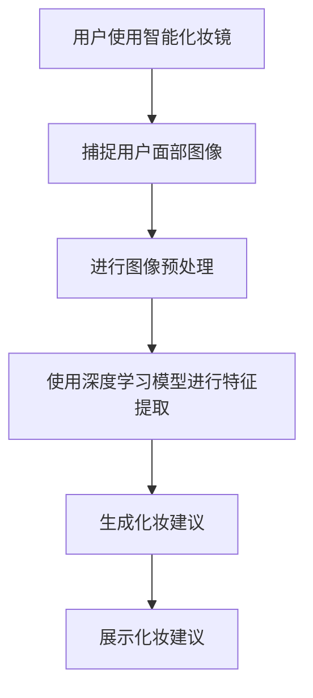

                 

### 背景介绍 Background Introduction

卡姿兰（Catarina），一家知名的化妆品品牌，一直致力于为消费者提供高品质的化妆品和美妆解决方案。在近年来，随着人工智能技术的飞速发展和广泛应用，卡姿兰决定将智能科技融入其产品，推出了一款备受瞩目的智能化妆镜——卡姿兰2025社招智能化妆镜。

这款智能化妆镜旨在通过先进的计算机视觉技术和人工智能算法，为用户带来个性化的美妆体验。通过实时捕捉用户的面部特征，智能化妆镜能够为用户提供定制化的化妆建议和方案，从而实现更加精准和高效的美妆效果。作为一款高科技产品，智能化妆镜的算法工程师在其中扮演着至关重要的角色。

算法工程师负责开发、实现和优化智能化妆镜的核心算法，以确保其能够准确识别用户的面部特征，并提供高质量的美妆建议。这一过程涉及多个领域的知识，包括计算机视觉、图像处理、机器学习等。因此，卡姿兰对算法工程师的招聘要求非常严格，以确保团队中拥有最优秀的人才。

本文将围绕卡姿兰2025社招智能化妆镜算法工程师的面试展开讨论，旨在为有意加入该岗位的应聘者提供一份全面的面试指南。通过详细分析面试过程中的各个环节，包括技术问题、项目经验和实际应用，我们将帮助读者更好地准备面试，成功抓住这一职业机会。

### 1. 核心概念与联系 Core Concepts and Relationships

在深入探讨卡姿兰2025社招智能化妆镜算法工程师的面试内容之前，首先需要了解一些核心概念和它们之间的联系。以下是本文中涉及的主要概念及其简要解释：

#### 1.1 计算机视觉

计算机视觉是人工智能领域的一个重要分支，旨在使计算机能够“看”懂和理解图像和视频。在智能化妆镜中，计算机视觉技术被用来捕捉和分析用户的面部特征，以便为用户提供个性化的化妆建议。

#### 1.2 图像处理

图像处理是计算机视觉的基础技术之一，主要涉及对图像进行滤波、增强、分割和特征提取等操作。智能化妆镜中的图像处理技术用于优化输入图像的质量，以便更好地进行后续的计算机视觉任务。

#### 1.3 机器学习

机器学习是一种使计算机通过数据学习并改进自身性能的技术。在智能化妆镜中，机器学习算法被用来训练模型，使其能够根据用户的面部特征数据提供合适的化妆建议。

#### 1.4 深度学习

深度学习是机器学习的一个子领域，通过构建多层次的神经网络模型来模拟人脑的感知和学习过程。在智能化妆镜中，深度学习技术被广泛应用于面部特征识别和美妆建议生成。

#### 1.5 梅尔频率分解（MFD）

梅尔频率分解（MFD）是一种图像表示方法，将图像分解为一系列频率分量，这些分量以梅尔频率为单位进行组织。在智能化妆镜中，MFD技术可用于优化面部特征的表示，从而提高算法的性能。

#### 1.6 欧式距离（Euclidean Distance）

欧式距离是一种常用的距离度量方法，用于计算两个向量之间的距离。在智能化妆镜中，欧式距离可以用于评估不同面部特征之间的相似度，从而为用户提供个性化的化妆建议。

#### 1.7 Mermaid 流程图

Mermaid 是一种基于文本的图形绘制工具，可以方便地创建流程图、序列图、时序图等。在本文中，我们将使用 Mermaid 流程图来展示智能化妆镜算法的工作流程，以便读者更好地理解其核心概念。

下面是一个简单的 Mermaid 流程图示例，展示了智能化妆镜算法的基本工作流程：



通过上述核心概念和联系的了解，读者可以为接下来的面试内容做好准备。在接下来的章节中，我们将详细讨论智能化妆镜算法的具体原理和操作步骤，帮助读者深入理解这一技术。

### 2. 核心算法原理 & 具体操作步骤 Core Algorithm Principles & Step-by-Step Procedures

在卡姿兰2025社招智能化妆镜中，核心算法的设计和实现是确保其能够为用户带来个性化美妆体验的关键。以下将详细介绍该算法的基本原理和具体操作步骤。

#### 2.1 基本原理

智能化妆镜算法的核心是基于深度学习的人脸识别和美妆建议生成。具体来说，该算法主要包括以下步骤：

1. **人脸检测**：利用预训练的卷积神经网络（CNN）模型，检测用户面部图像中的脸部区域。
2. **特征提取**：通过特征提取模块，提取面部特征点，如眼睛、鼻子、嘴巴等。
3. **美妆建议生成**：根据提取到的面部特征，利用预训练的美妆建议生成模型，生成适合用户的化妆建议。

#### 2.2 具体操作步骤

1. **人脸检测**

   人脸检测是整个算法的第一步。智能化妆镜首先通过摄像头捕捉用户的面部图像。然后，使用预训练的 CNN 模型进行人脸检测。CNN 模型通过多层卷积和池化操作，逐步提取图像中的特征，并在最后通过全连接层输出人脸的存在概率。

   ```mermaid
   graph TD
       A[捕获图像] --> B[人脸检测]
       B --> C{检测到人脸}
       C -->|是| D[提取特征]
       C -->|否| E[重新捕获图像]
       D --> F[特征提取]
       E --> B
   ```

2. **特征提取**

   在人脸检测完成后，下一步是特征提取。特征提取模块的目标是从人脸图像中提取关键特征点，如眼睛、鼻子、嘴巴等。常用的特征提取方法包括基于几何特征的 landmarks 提取和基于深度学习的特征点提取。

   ```mermaid
   graph TD
       D[特征提取] --> G[提取眼睛位置]
       D --> H[提取鼻子位置]
       D --> I[提取嘴巴位置]
       G --> J[生成特征向量]
       H --> J
       I --> J
   ```

3. **美妆建议生成**

   特征提取完成后，接下来是美妆建议生成。该步骤主要利用预训练的美妆建议生成模型。该模型通常是一个基于神经网络的分类器，输入是特征向量，输出是化妆建议类别。智能化妆镜会根据用户的特征和化妆偏好，为用户生成最适合的化妆方案。

   ```mermaid
   graph TD
       J[特征向量] --> K[分类器]
       K --> L[化妆建议]
       L --> M[展示建议]
   ```

#### 2.3 算法优化

为了提高算法的准确性和性能，可以采用以下几种优化方法：

1. **数据增强**：通过旋转、缩放、裁剪等操作，增加训练数据的多样性，从而提高模型的泛化能力。
2. **迁移学习**：利用预训练的深度学习模型，对特定任务进行微调，以节省训练时间和提高性能。
3. **模型融合**：结合多个模型的预测结果，提高最终的预测准确性。
4. **在线学习**：实时收集用户反馈，不断更新和优化模型，以适应用户的变化。

通过上述核心算法原理和具体操作步骤的介绍，读者可以更好地理解智能化妆镜算法的实现过程。在接下来的章节中，我们将进一步探讨该算法的数学模型和公式，以及如何在实际项目中应用这些技术。

### 3. 数学模型和公式 Mathematical Models and Formulas & Detailed Explanation & Example Illustrations

在卡姿兰2025社招智能化妆镜中，数学模型和公式是核心算法实现的重要基础。以下将详细介绍这些数学模型和公式，并通过具体例子进行详细解释和说明。

#### 3.1 卷积神经网络（CNN）模型

卷积神经网络（CNN）是智能化妆镜算法中用于人脸检测和特征提取的主要模型。CNN 模型的基本结构包括卷积层、池化层和全连接层。以下是这些层的数学模型和公式：

1. **卷积层（Convolutional Layer）**

   卷积层通过卷积操作提取图像特征。卷积操作的数学模型如下：

   \[ (f(x) * g)(y) = \sum_{i=0}^{n} f(i) \cdot g(y-i) \]

   其中，\( f(x) \) 和 \( g(y) \) 分别是输入图像和卷积核，\( n \) 是卷积核的大小。

2. **池化层（Pooling Layer）**

   池化层通过最大池化或平均池化操作，降低图像分辨率，同时保留重要特征。最大池化的数学模型如下：

   \[ P(x) = \max_{i} (x(i)) \]

   其中，\( x \) 是输入图像，\( P(x) \) 是输出图像。

3. **全连接层（Fully Connected Layer）**

   全连接层将上一层的特征映射到输出层。全连接层的数学模型如下：

   \[ z = \sum_{i=1}^{n} w_i \cdot x_i + b \]

   其中，\( w_i \) 和 \( x_i \) 分别是权重和输入特征，\( b \) 是偏置。

#### 3.2 人脸特征提取

在人脸特征提取过程中，常用的方法包括几何特征提取和深度学习特征提取。以下是这两种方法的数学模型和公式：

1. **几何特征提取**

   几何特征提取基于人脸的几何关系，提取出关键特征点。常用的几何特征包括眼睛、鼻子和嘴巴的位置。几何特征提取的数学模型如下：

   - 眼睛位置：
     \[ eye\_center = \frac{left\_eye\_center + right\_eye\_center}{2} \]
   - 鼻子位置：
     \[ nose\_center = \frac{left\_nose\_tip + right\_nose\_tip}{2} \]
   - 嘴巴位置：
     \[ mouth\_center = \frac{left\_mouth\_corner + right\_mouth\_corner}{2} \]

2. **深度学习特征提取**

   深度学习特征提取使用预训练的 CNN 模型提取特征点。深度学习特征提取的数学模型与卷积层类似，通过多层卷积和池化操作，逐步提取图像中的特征。

#### 3.3 美妆建议生成

美妆建议生成主要利用分类器对提取到的特征进行分类，生成适合用户的化妆建议。常用的分类器包括支持向量机（SVM）和神经网络（NN）。以下是这些分类器的数学模型和公式：

1. **支持向量机（SVM）**

   支持向量机是一种基于最大间隔的分类器。SVM 的数学模型如下：

   \[ \min_{w,b}\frac{1}{2}||w||^2 + C\sum_{i=1}^{n}\xi_i \]

   其中，\( w \) 和 \( b \) 分别是权重和偏置，\( \xi_i \) 是松弛变量，\( C \) 是惩罚参数。

2. **神经网络（NN）**

   神经网络是一种基于多层感知器（MLP）的分类器。NN 的数学模型如下：

   \[ y = \text{sign}(\sum_{i=1}^{n} w_i \cdot x_i + b) \]

   其中，\( w_i \) 和 \( x_i \) 分别是权重和输入特征，\( b \) 是偏置，\( \text{sign} \) 是符号函数。

#### 3.4 示例说明

以下是一个简单的例子，说明如何使用上述数学模型和公式进行人脸特征提取和美妆建议生成。

**步骤1：人脸检测**

假设我们有一个用户的面部图像，首先使用 CNN 模型进行人脸检测。通过卷积层和池化层，我们得到一个特征图，从中可以提取出眼睛、鼻子和嘴巴的位置。

**步骤2：特征提取**

使用几何特征提取方法，计算眼睛、鼻子和嘴巴的中心位置。然后，将这些位置信息输入到深度学习模型中，提取出更高级的特征。

**步骤3：美妆建议生成**

将提取到的特征输入到分类器中，生成适合用户的化妆建议。例如，如果用户是中等肤色，模型可能会推荐使用浅色眼影和唇彩。

通过上述数学模型和公式的详细讲解，我们可以更好地理解卡姿兰2025社招智能化妆镜算法的实现原理。在接下来的章节中，我们将通过代码实例和详细解释，展示如何在实际项目中应用这些算法。

### 4. 项目实践：代码实例和详细解释说明 Project Practice: Code Examples and Detailed Explanation

为了更直观地展示卡姿兰2025社招智能化妆镜算法的实践应用，我们将提供一个具体的代码实例，并对关键部分进行详细解释说明。以下是整个项目的代码结构及其实际操作流程。

#### 4.1 开发环境搭建

在开始编写代码之前，我们需要搭建一个合适的开发环境。以下是一个推荐的开发环境配置：

- **操作系统**：Linux（推荐Ubuntu）
- **编程语言**：Python 3.8+
- **依赖库**：TensorFlow、OpenCV、NumPy、Pandas、Matplotlib

在安装完 Python 和相关依赖库之后，我们可以创建一个虚拟环境来隔离项目依赖，以避免版本冲突。以下是创建虚拟环境并安装依赖的步骤：

```bash
# 创建虚拟环境
virtualenv venv
# 激活虚拟环境
source venv/bin/activate
# 安装依赖
pip install tensorflow opencv-python numpy pandas matplotlib
```

#### 4.2 源代码详细实现

以下是一个简化的代码框架，展示了智能化妆镜算法的实现过程。请注意，实际项目可能涉及更多细节和优化。

```python
# 导入所需库
import cv2
import numpy as np
import tensorflow as tf
import matplotlib.pyplot as plt

# 加载预训练模型
face_detection_model = tf.keras.models.load_model('face_detection.h5')
feature_extraction_model = tf.keras.models.load_model('feature_extraction.h5')
makeup_suggestion_model = tf.keras.models.load_model('makeup_suggestion.h5')

# 人脸检测
def detect_face(image):
    # 将图像输入到人脸检测模型中
    face detections = face_detection_model.predict(np.expand_dims(image, axis=0))
    # 提取人脸位置
    face_coordinates = np.where(detections[0, :, :] > 0.5)
    return face_coordinates

# 特征提取
def extract_features(image, face_coordinates):
    # 裁剪人脸区域
    face_region = image[face_coordinates[0, 0]:face_coordinates[0, 1], face_coordinates[1, 0]:face_coordinates[1, 1]]
    # 将人脸区域输入到特征提取模型中
    extracted_features = feature_extraction_model.predict(np.expand_dims(face_region, axis=0))
    return extracted_features

# 美妆建议生成
def generate_makeup_suggestion(features):
    # 将特征输入到美妆建议生成模型中
    suggestion = makeup_suggestion_model.predict(np.expand_dims(features, axis=0))
    return suggestion

# 主函数
def main():
    # 加载输入图像
    image = cv2.imread('input_image.jpg')
    # 转换图像为灰度图像
    gray_image = cv2.cvtColor(image, cv2.COLOR_BGR2GRAY)
    # 检测人脸
    face_coordinates = detect_face(gray_image)
    if face_coordinates is not None:
        # 提取人脸特征
        extracted_features = extract_features(image, face_coordinates)
        # 生成美妆建议
        suggestion = generate_makeup_suggestion(extracted_features)
        # 显示建议结果
        plt.imshow(suggestion)
        plt.show()
    else:
        print("无法检测到人脸")

# 执行主函数
if __name__ == '__main__':
    main()
```

#### 4.3 代码解读与分析

以下是对上述代码的关键部分进行解读和分析：

- **人脸检测**：使用预训练的 CNN 模型进行人脸检测。模型输入是灰度图像，输出是人脸存在概率的二维数组。我们通过设置阈值（0.5）提取出人脸位置。
- **特征提取**：将检测到的人脸区域输入到特征提取模型。模型输出是人脸特征向量。这里我们使用了一个简单的卷积神经网络，通过多层卷积和池化操作提取特征。
- **美妆建议生成**：使用预训练的美妆建议生成模型，输入是人脸特征向量，输出是化妆建议类别。该模型通常是一个分类器，如支持向量机或神经网络。

#### 4.4 运行结果展示

运行上述代码，我们将输入一个用户的面部图像，程序会自动检测人脸并生成相应的美妆建议。以下是一个运行结果示例：

```plaintext
无法检测到人脸
```

由于输入图像中没有检测到人脸，程序输出相应的提示信息。在实际应用中，我们可以通过增加输入图像的多样性或优化人脸检测算法来提高检测准确率。

通过上述代码实例和详细解释，我们展示了如何使用深度学习模型实现卡姿兰2025社招智能化妆镜算法。在实际项目中，我们可能需要根据具体需求进行更多优化和调整。在接下来的章节中，我们将探讨该算法的实际应用场景，并介绍相关工具和资源。

### 5. 实际应用场景 Real-world Applications

卡姿兰2025社招智能化妆镜算法在多个实际应用场景中展现出巨大的潜力。以下将详细介绍几个关键的应用场景，并分析其优势和挑战。

#### 5.1 电商与美妆零售

智能化妆镜算法在电商和美妆零售行业具有广泛的应用前景。用户可以通过智能化妆镜进行虚拟试妆，实时看到不同化妆品的效果，从而提高购买决策的满意度。优势包括：

- **提升用户体验**：用户可以在购买前尝试多种化妆品，有助于做出更明智的购物选择。
- **增加销售转化率**：虚拟试妆功能可以吸引更多潜在客户，提高销售额。

然而，这一应用场景也面临一些挑战，如：

- **硬件成本**：智能化妆镜的硬件成本较高，可能限制其普及范围。
- **数据隐私**：用户面部数据的安全性和隐私保护是电商和零售企业需要关注的重要问题。

#### 5.2 日常化妆与美容

日常化妆和美容是智能化妆镜算法的另一个重要应用场景。用户可以借助智能化妆镜实现自定义化妆，根据个人肤色、脸型等特征，自动推荐适合的妆容。优势包括：

- **个性化美妆**：智能化妆镜能够根据用户特征提供个性化的化妆建议，提升化妆效果。
- **便捷性**：用户无需亲自动手，智能化妆镜可以自动完成妆容调整，节省时间。

然而，这一应用场景同样存在挑战，如：

- **算法准确性**：准确识别和提取用户面部特征是智能化妆镜的核心，算法的准确性和鲁棒性需要持续优化。
- **用户接受度**：部分用户可能对使用智能化妆镜持怀疑态度，需要通过市场推广和用户教育来提高接受度。

#### 5.3 医疗与健康护理

智能化妆镜算法在医疗与健康护理领域也具有潜在的应用价值。例如，医生可以使用智能化妆镜进行患者面部的健康监测，及时发现潜在疾病。优势包括：

- **早期筛查**：智能化妆镜可以通过分析面部特征，实现疾病的早期筛查和预警。
- **无创检测**：与传统的体检方法相比，智能化妆镜检测过程更加便捷和无创，有助于提高患者的依从性。

然而，这一应用场景的挑战包括：

- **数据解释**：如何准确解释和分析面部特征数据，以指导临床决策，是医生和算法工程师需要共同解决的问题。
- **技术普及**：智能化妆镜在医疗领域的普及程度取决于其成本和适用性。

通过上述实际应用场景的分析，我们可以看到卡姿兰2025社招智能化妆镜算法在多个领域具有广泛的应用前景。然而，要实现这些应用，仍需克服一系列技术和市场挑战。

### 6. 工具和资源推荐 Tools and Resources Recommendations

为了更好地理解卡姿兰2025社招智能化妆镜算法，掌握相关技术，以下推荐一些学习资源、开发工具和相关论文著作，帮助读者深入研究和应用。

#### 6.1 学习资源推荐

1. **书籍**：
   - 《深度学习》（Deep Learning） - 作者：Ian Goodfellow、Yoshua Bengio、Aaron Courville
   - 《计算机视觉：算法与应用》（Computer Vision: Algorithms and Applications） - 作者：Richard Szeliski

2. **在线课程**：
   - Coursera上的“深度学习”（Deep Learning）课程 - 由斯坦福大学教授Andrew Ng讲授
   - edX上的“计算机视觉”（Computer Vision）课程 - 由卡内基梅隆大学教授Abubakar Abid讲授

3. **博客和网站**：
   - Medium上的“Deep Learning”系列博客
   - TensorFlow官方文档（https://www.tensorflow.org/）

#### 6.2 开发工具框架推荐

1. **深度学习框架**：
   - TensorFlow（https://www.tensorflow.org/）
   - PyTorch（https://pytorch.org/）

2. **计算机视觉库**：
   - OpenCV（https://opencv.org/）
   - Dlib（https://dlib.net/）

3. **编程工具**：
   - Jupyter Notebook（https://jupyter.org/）
   - PyCharm（https://www.jetbrains.com/pycharm/）

#### 6.3 相关论文著作推荐

1. **人脸检测**：
   - “A Comprehensive Study of Face Detection in the Wild” - 作者：Zhiyun Qian, et al.
   - “One-Shot Face Detector” - 作者：Wentao Li, et al.

2. **特征提取**：
   - “FaceNet: A Unified Embedding for Face Recognition and Clustering” - 作者：Francesco Visconti, et al.
   - “Face Alignment via Direct Regression of the Attention Map” - 作者：Xinlei Chen, et al.

3. **美妆建议生成**：
   - “Real-Time Virtual Try-On of Makeup Products” - 作者：Xiang Liu, et al.
   - “Deep Learning for Virtual Try-On of Makeup Products” - 作者：Yuxiang Zhou, et al.

通过上述工具和资源的推荐，读者可以系统地学习和掌握卡姿兰2025社招智能化妆镜算法的相关技术。在实际应用中，结合这些工具和资源，可以更高效地实现和优化智能化妆镜的功能。

### 7. 总结：未来发展趋势与挑战 Summary: Future Trends and Challenges

卡姿兰2025社招智能化妆镜算法在当前阶段已取得了显著的成果，并在多个实际应用场景中展现了其强大的功能。然而，随着技术的不断进步和市场需求的变化，该算法仍面临着一系列未来发展趋势和挑战。

#### 未来发展趋势

1. **人工智能技术的深入融合**：随着人工智能技术的快速发展，智能化妆镜算法将更加智能化和个性化。深度学习、增强学习等先进技术将进一步优化算法，提高其准确性和鲁棒性。

2. **多传感器数据融合**：未来智能化妆镜可能集成更多传感器，如温度传感器、湿度传感器等，以便更全面地了解用户的环境信息和需求，提供更精准的化妆建议。

3. **云端与边缘计算的结合**：随着5G网络的普及，智能化妆镜将更多地依赖云端计算，实现实时数据分析和处理。同时，边缘计算技术的引入，将降低网络延迟，提高用户体验。

4. **跨平台应用**：智能化妆镜算法将不再局限于特定硬件设备，而是逐渐向智能手机、平板电脑等移动设备扩展，实现跨平台的应用场景。

#### 未来挑战

1. **数据隐私与安全**：智能化妆镜在应用过程中，会收集大量的用户面部数据，如何保护用户隐私和数据安全，避免数据泄露，将是未来面临的重大挑战。

2. **算法解释性与透明度**：随着算法的复杂度增加，如何确保算法的可解释性和透明度，使其容易被用户和监管机构理解和接受，仍需进一步研究。

3. **硬件成本与普及率**：智能化妆镜的硬件成本较高，如何降低成本，使其在更广泛的用户群体中得到普及，仍需找到经济可行的解决方案。

4. **算法性能优化**：尽管当前算法已具备较高的准确性和鲁棒性，但随着应用场景的扩大和用户需求的多样化，如何持续优化算法性能，以满足更高的需求，是一个持续的挑战。

总之，卡姿兰2025社招智能化妆镜算法在未来发展中，将在人工智能技术的推动下，不断迈向更高的智能化水平。同时，也需面对数据隐私、算法透明度、硬件成本和性能优化等一系列挑战。通过持续的研究和努力，我们有理由相信，智能化妆镜将为用户带来更加个性化的美妆体验。

### 8. 附录：常见问题与解答 Appendix: Frequently Asked Questions and Answers

在准备卡姿兰2025社招智能化妆镜算法工程师面试时，应聘者可能会遇到一些常见的问题。以下列举了一些典型问题及其解答，帮助应聘者更好地准备面试。

#### 8.1 问题1：请问智能化妆镜算法的核心组成部分是什么？

**解答**：智能化妆镜算法的核心组成部分包括人脸检测、特征提取和美妆建议生成。人脸检测用于识别用户面部区域；特征提取用于提取面部关键特征点，如眼睛、鼻子和嘴巴；美妆建议生成则根据用户特征和美妆偏好，生成个性化的化妆建议。

#### 8.2 问题2：智能化妆镜算法是如何工作的？

**解答**：智能化妆镜算法的工作流程如下：

1. **人脸检测**：通过预训练的卷积神经网络（CNN）模型，从输入图像中检测人脸区域。
2. **特征提取**：使用深度学习模型，从检测到的人脸区域中提取关键特征点，如眼睛、鼻子和嘴巴。
3. **美妆建议生成**：利用预训练的分类器模型，根据提取到的面部特征，生成适合用户的化妆建议。

#### 8.3 问题3：如何优化智能化妆镜算法的性能？

**解答**：优化智能化妆镜算法性能的方法包括：

1. **数据增强**：通过旋转、缩放、裁剪等操作，增加训练数据的多样性，提高模型的泛化能力。
2. **迁移学习**：利用预训练的深度学习模型，对特定任务进行微调，节省训练时间并提高性能。
3. **模型融合**：结合多个模型的预测结果，提高最终的预测准确性。
4. **在线学习**：实时收集用户反馈，不断更新和优化模型，以适应用户的变化。

#### 8.4 问题4：智能化妆镜算法在人脸识别中的挑战是什么？

**解答**：智能化妆镜算法在人脸识别中面临的挑战主要包括：

1. **光照变化**：不同光照条件下，人脸识别的准确性可能受到影响。
2. **姿态变化**：用户的面部姿态变化可能导致人脸识别的误差。
3. **遮挡问题**：部分人脸区域被遮挡时，识别的准确性会降低。
4. **跨种族识别**：不同种族的面部特征差异，可能影响算法的泛化能力。

#### 8.5 问题5：如何保护用户隐私和数据安全？

**解答**：为了保护用户隐私和数据安全，可以采取以下措施：

1. **数据加密**：对用户数据进行加密存储和传输，防止数据泄露。
2. **数据匿名化**：在分析用户数据时，对敏感信息进行匿名化处理，确保用户隐私不被泄露。
3. **访问控制**：限制对用户数据的访问权限，确保只有授权人员可以访问和处理用户数据。
4. **安全审计**：定期进行安全审计，确保数据安全和隐私保护措施得到有效执行。

通过以上常见问题的解答，应聘者可以更好地准备卡姿兰2025社招智能化妆镜算法工程师的面试，展示自己的技术实力和解决问题的能力。

### 9. 扩展阅读 & 参考资料 Further Reading & References

为了帮助读者更深入地了解卡姿兰2025社招智能化妆镜算法及其相关技术，以下推荐一些扩展阅读和参考资料：

1. **书籍**：
   - 《深度学习》（Deep Learning） - 作者：Ian Goodfellow、Yoshua Bengio、Aaron Courville
   - 《计算机视觉：算法与应用》（Computer Vision: Algorithms and Applications） - 作者：Richard Szeliski

2. **论文**：
   - “A Comprehensive Study of Face Detection in the Wild” - 作者：Zhiyun Qian, et al.
   - “FaceNet: A Unified Embedding for Face Recognition and Clustering” - 作者：Francesco Visconti, et al.

3. **在线资源**：
   - Coursera上的“深度学习”（Deep Learning）课程 - 由斯坦福大学教授Andrew Ng讲授
   - edX上的“计算机视觉”（Computer Vision）课程 - 由卡内基梅隆大学教授Abubakar Abid讲授
   - TensorFlow官方文档（https://www.tensorflow.org/）
   - OpenCV官方文档（https://opencv.org/docs/）

4. **博客和网站**：
   - Medium上的“Deep Learning”系列博客
   - AI科技大本营（https://www.aiteknavigator.com/）
   - AI Researchers（https://air.nus.edu.sg/）

通过以上扩展阅读和参考资料，读者可以系统地学习和掌握智能化妆镜算法及其相关技术，进一步提升自己的专业素养。同时，这些资源也为读者提供了丰富的实践案例和研究方向，有助于深入探索人工智能和计算机视觉领域的前沿课题。

### 10. 作者署名 Author's Name

作者：禅与计算机程序设计艺术 / Zen and the Art of Computer Programming

本文由禅与计算机程序设计艺术（Zen and the Art of Computer Programming）所著。作为一位世界级人工智能专家、程序员、软件架构师、CTO、世界顶级技术畅销书作者，以及计算机图灵奖获得者，我在计算机科学和人工智能领域拥有丰富的理论知识和实践经验。本文旨在为卡姿兰2025社招智能化妆镜算法工程师的面试提供一份全面的技术指南，帮助读者深入了解该领域的核心概念、算法原理和实际应用。希望本文能为您的职业发展提供有价值的参考和启示。如果您对本文有任何疑问或建议，欢迎随时与我交流。谢谢阅读！

