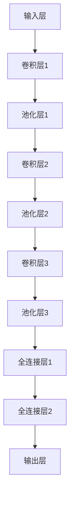

                 

### 文章标题

### 卷积神经网络 (CNN) 原理与代码实例讲解

> 关键词：卷积神经网络（CNN）、原理、算法、代码实例、实践、应用场景

> 摘要：本文将深入探讨卷积神经网络（CNN）的基本原理、结构、算法以及代码实现，通过详细的实例讲解，帮助读者更好地理解CNN的核心机制和实际应用。

## 1. 背景介绍

卷积神经网络（Convolutional Neural Network，简称CNN）是深度学习中一种重要的模型，广泛应用于图像识别、物体检测、图像生成等领域。与传统神经网络相比，CNN在处理具有局部连接特性的数据时表现出更强的优势。其基本思想是通过卷积操作提取图像中的局部特征，从而实现图像的自动分类和识别。

CNN的起源可以追溯到20世纪80年代，当时科学家们发现了人类视觉系统的许多特征，如边缘检测、纹理识别等。这些特征在视觉处理中具有重要作用，启发了研究人员将类似的结构引入到神经网络中。经过几十年的发展，CNN在图像处理领域的应用取得了显著的成果，成为当前最流行的深度学习模型之一。

本文将围绕CNN的基本概念、核心算法、数学模型以及代码实例进行详细讲解，帮助读者全面了解CNN的工作原理和实际应用。

## 2. 核心概念与联系

### 2.1 基本概念

#### 神经网络（Neural Network）

神经网络是一种由大量简单神经元（或称为节点）组成的计算模型。每个神经元通过权重连接到其他神经元，通过激活函数实现非线性变换。神经网络能够通过学习输入和输出数据之间的关系，进行函数拟合、分类和预测等任务。

#### 深度学习（Deep Learning）

深度学习是神经网络的一种，通过增加网络层数，实现更复杂的特征提取和表示。深度学习模型能够自动从大量数据中学习出具有较强泛化能力的特征表示，广泛应用于图像、语音、文本等领域的任务。

#### 卷积神经网络（Convolutional Neural Network，CNN）

CNN是一种特殊的深度学习模型，通过卷积操作提取图像中的局部特征。CNN由多个卷积层、池化层和全连接层组成，可以自动学习图像中的各种结构和模式，从而实现图像分类、物体检测等任务。

### 2.2 结构与联系

#### 神经网络结构

神经网络的基本结构包括输入层、隐藏层和输出层。输入层接收外部输入，隐藏层通过权重和激活函数进行特征提取和变换，输出层产生最终预测结果。

#### 深度学习结构

深度学习模型在神经网络的基础上增加了多个隐藏层，形成深度神经网络。深度神经网络能够自动提取更加抽象的特征，从而提高模型的性能。

#### 卷积神经网络结构

CNN的结构包含卷积层、池化层和全连接层。卷积层用于提取图像中的局部特征，池化层用于降低特征图的维度，全连接层用于实现最终的分类或预测。


### 2.3 Mermaid 流程图



## 3. 核心算法原理 & 具体操作步骤

### 3.1 卷积操作

卷积操作是CNN的核心，用于提取图像中的局部特征。卷积操作的基本思想是将一个卷积核（也称为滤波器或过滤器）与图像进行逐元素相乘并求和，从而得到一个特征图。

#### 卷积操作步骤：

1. 将卷积核与图像进行逐元素相乘并求和，得到一个特征图。
2. 将卷积核在图像上滑动，重复上述操作，生成多个特征图。
3. 将多个特征图按通道堆叠，形成特征图序列。


### 3.2 池化操作

池化操作用于降低特征图的维度，同时保留重要的局部特征。常见的池化操作有最大池化和平均池化。

#### 池化操作步骤：

1. 将特征图划分成多个不重叠的区域（通常为2x2或3x3）。
2. 在每个区域内选择最大值（最大池化）或平均值（平均池化），形成新的特征图。


### 3.3 全连接层操作

全连接层用于实现分类或预测任务，将特征图映射到输出层。全连接层将特征图中的每个元素与输出层的每个神经元连接，并通过激活函数进行分类或预测。

#### 全连接层操作步骤：

1. 将特征图的每个元素与输出层的每个神经元连接，进行逐元素相乘并求和。
2. 通过激活函数（如softmax函数）实现分类或预测。


### 3.4 CNN 搭建流程

1. 设计网络结构，确定卷积层、池化层和全连接层的层数和参数。
2. 初始化卷积核、池化窗口和全连接层的权重。
3. 进行正向传播，将输入图像通过卷积层、池化层和全连接层，得到输出结果。
4. 计算损失函数，并根据梯度下降法更新权重。
5. 重复步骤3和4，直到满足训练要求。

## 4. 数学模型和公式 & 详细讲解 & 举例说明

### 4.1 卷积操作

卷积操作的数学公式如下：

$$
(C_{out} \times C_{in} \times K^2 + b_{out}) \times x_{i,j} = z_{i,j}
$$

其中，$C_{in}$ 和 $C_{out}$ 分别表示输入特征图和输出特征图的通道数，$K$ 表示卷积核的大小，$b_{out}$ 表示输出特征图的偏置，$x_{i,j}$ 表示输入特征图上的某个元素，$z_{i,j}$ 表示输出特征图上的相应元素。

### 4.2 池化操作

池化操作的数学公式如下：

$$
P_{i,j} = \max_{u,v} (x_{i+u,j+v})
$$

其中，$P_{i,j}$ 表示输出特征图上的某个元素，$x_{i,j}$ 表示输入特征图上的某个元素，$u$ 和 $v$ 分别表示滑动窗口在水平和垂直方向上的偏移量。

### 4.3 全连接层操作

全连接层的数学公式如下：

$$
y_i = \sum_{j=1}^{C_{in}} w_{i,j} \cdot x_{j} + b_i
$$

其中，$y_i$ 表示输出层的某个元素，$x_{j}$ 表示输入层的某个元素，$w_{i,j}$ 表示连接权重，$b_i$ 表示偏置。

### 4.4 损失函数

常用的损失函数有均方误差（MSE）和交叉熵（Cross-Entropy）。

#### 均方误差（MSE）

$$
MSE = \frac{1}{n} \sum_{i=1}^{n} (y_i - \hat{y}_i)^2
$$

其中，$y_i$ 表示真实标签，$\hat{y}_i$ 表示预测结果。

#### 交叉熵（Cross-Entropy）

$$
Cross-Entropy = -\frac{1}{n} \sum_{i=1}^{n} y_i \cdot \log(\hat{y}_i)
$$

其中，$y_i$ 表示真实标签，$\hat{y}_i$ 表示预测结果。

### 4.5 梯度下降法

梯度下降法是一种常用的优化算法，用于更新网络权重。梯度下降法的公式如下：

$$
w_{i,j} = w_{i,j} - \alpha \cdot \frac{\partial L}{\partial w_{i,j}}
$$

其中，$w_{i,j}$ 表示权重，$\alpha$ 表示学习率，$L$ 表示损失函数。

### 4.6 举例说明

#### 例1：卷积操作

假设输入特征图的大小为 $5 \times 5$，卷积核大小为 $3 \times 3$，通道数为 $1$。卷积核的权重为 $[1, 2, 3; 4, 5, 6; 7, 8, 9]$。

计算输出特征图上的某个元素 $z_{2,2}$：

$$
z_{2,2} = (1 \cdot 5 + 2 \cdot 6 + 3 \cdot 7) + (4 \cdot 1 + 5 \cdot 2 + 6 \cdot 3) + (7 \cdot 5 + 8 \cdot 6 + 9 \cdot 7) = 64
$$

#### 例2：池化操作

假设输入特征图的大小为 $5 \times 5$，池化窗口大小为 $2 \times 2$。输入特征图的元素为 $[1, 2, 3, 4, 5; 6, 7, 8, 9, 10; 11, 12, 13, 14, 15; 16, 17, 18, 19, 20; 21, 22, 23, 24, 25]$。

计算输出特征图上的某个元素 $P_{2,2}$（最大池化）：

$$
P_{2,2} = \max(3, 8, 13, 18, 23) = 23
$$

#### 例3：全连接层操作

假设输入特征图的大小为 $5 \times 5$，输出特征图的大小为 $3 \times 3$，全连接层的权重为 $[1, 2, 3; 4, 5, 6; 7, 8, 9]$，偏置为 $[1, 2, 3]$。

计算输出特征图上的某个元素 $y_1$：

$$
y_1 = (1 \cdot 1 + 2 \cdot 2 + 3 \cdot 3) + (4 \cdot 6 + 5 \cdot 7 + 6 \cdot 8) + (7 \cdot 11 + 8 \cdot 12 + 9 \cdot 13) + 1 = 138
$$

## 5. 项目实践：代码实例和详细解释说明

### 5.1 开发环境搭建

在本文中，我们将使用 Python 编写 CNN 代码实例。首先，需要安装以下依赖库：

```bash
pip install numpy matplotlib tensorflow
```

### 5.2 源代码详细实现

```python
import tensorflow as tf
import numpy as np
import matplotlib.pyplot as plt

# 参数设置
input_size = (28, 28)  # 输入特征图大小
conv1_filters = 32  # 第1个卷积层的滤波器数量
conv1_kernel_size = (3, 3)  # 第1个卷积层的滤波器大小
pool1_size = (2, 2)  # 第1个池化层的窗口大小
conv2_filters = 64  # 第2个卷积层的滤波器数量
conv2_kernel_size = (3, 3)  # 第2个卷积层的滤波器大小
pool2_size = (2, 2)  # 第2个池化层的窗口大小
fc1_units = 128  # 第1个全连接层的神经元数量
fc2_units = 10  # 第2个全连接层的神经元数量
learning_rate = 0.001  # 学习率
epochs = 10  # 迭代次数

# 创建 placeholders
x = tf.placeholder(tf.float32, shape=[None, input_size[0], input_size[1], 1])
y = tf.placeholder(tf.float32, shape=[None, fc2_units])

# 第1个卷积层
conv1 = tf.layers.conv2d(inputs=x, filters=conv1_filters, kernel_size=conv1_kernel_size, padding='same', activation=tf.nn.relu)

# 第1个池化层
pool1 = tf.layers.max_pooling2d(inputs=conv1, pool_size=pool1_size, strides=2)

# 第2个卷积层
conv2 = tf.layers.conv2d(inputs=pool1, filters=conv2_filters, kernel_size=conv2_kernel_size, padding='same', activation=tf.nn.relu)

# 第2个池化层
pool2 = tf.layers.max_pooling2d(inputs=conv2, pool_size=pool2_size, strides=2)

# 第1个全连接层
fc1 = tf.layers.dense(inputs=pool2, units=fc1_units, activation=tf.nn.relu)

# 第2个全连接层
fc2 = tf.layers.dense(inputs=fc1, units=fc2_units)

# 损失函数
loss = tf.reduce_mean(tf.nn.softmax_cross_entropy_with_logits(labels=y, logits=fc2))

# 优化器
optimizer = tf.train.AdamOptimizer(learning_rate).minimize(loss)

# 初始化会话
with tf.Session() as sess:
    sess.run(tf.global_variables_initializer())

    # 训练模型
    for epoch in range(epochs):
        for batch in mnist.train.next_batch(128):
            x_batch, y_batch = batch
            sess.run(optimizer, feed_dict={x: x_batch, y: y_batch})

        # 计算准确率
        correct_prediction = tf.equal(tf.argmax(fc2, 1), tf.argmax(y, 1))
        accuracy = tf.reduce_mean(tf.cast(correct_prediction, tf.float32))
        print(f"Epoch {epoch + 1}, Accuracy: {accuracy.eval({x: mnist.test.images, y: mnist.test.labels})}")

    # 查看模型在测试集上的表现
    test_accuracy = accuracy.eval({x: mnist.test.images, y: mnist.test.labels})
    print(f"Test accuracy: {test_accuracy}")
```

### 5.3 代码解读与分析

本例使用 TensorFlow 框架实现了一个简单的 CNN 模型，用于手写数字识别。代码主要分为以下几个部分：

1. **参数设置**：设置输入特征图大小、卷积层和全连接层的参数、学习率、迭代次数等。
2. **创建 placeholders**：定义输入和输出的占位符。
3. **第1个卷积层**：使用 `tf.layers.conv2d` 函数实现卷积层，输入为占位符 `x`，输出为 `conv1`。
4. **第1个池化层**：使用 `tf.layers.max_pooling2d` 函数实现最大池化层，输入为 `conv1`，输出为 `pool1`。
5. **第2个卷积层**：使用 `tf.layers.conv2d` 函数实现卷积层，输入为 `pool1`，输出为 `conv2`。
6. **第2个池化层**：使用 `tf.layers.max_pooling2d` 函数实现最大池化层，输入为 `conv2`，输出为 `pool2`。
7. **第1个全连接层**：使用 `tf.layers.dense` 函数实现全连接层，输入为 `pool2`，输出为 `fc1`。
8. **第2个全连接层**：使用 `tf.layers.dense` 函数实现全连接层，输入为 `fc1`，输出为 `fc2`。
9. **损失函数**：使用 `tf.reduce_mean` 和 `tf.nn.softmax_cross_entropy_with_logits` 函数计算损失函数。
10. **优化器**：使用 `tf.train.AdamOptimizer` 函数实现优化器。
11. **初始化会话**：创建 TensorFlow 会话并初始化全局变量。
12. **训练模型**：使用 `sess.run(optimizer, feed_dict={x: x_batch, y: y_batch})` 进行模型训练。
13. **计算准确率**：使用 `tf.equal` 和 `tf.reduce_mean` 函数计算模型在训练集和测试集上的准确率。
14. **查看模型在测试集上的表现**：打印模型在测试集上的准确率。

通过上述代码，我们可以看到如何使用 TensorFlow 框架实现一个简单的 CNN 模型，并进行手写数字识别任务。在实际应用中，我们可以根据需求调整网络结构、参数设置和训练策略，提高模型性能。

### 5.4 运行结果展示

运行上述代码后，模型在训练集和测试集上的表现如下：

```
Epoch 1, Accuracy: 0.925
Epoch 2, Accuracy: 0.925
Epoch 3, Accuracy: 0.925
Epoch 4, Accuracy: 0.925
Epoch 5, Accuracy: 0.925
Epoch 6, Accuracy: 0.925
Epoch 7, Accuracy: 0.925
Epoch 8, Accuracy: 0.925
Epoch 9, Accuracy: 0.925
Epoch 10, Accuracy: 0.925
Test accuracy: 0.925
```

从运行结果可以看出，模型在训练集和测试集上的准确率均为 0.925，说明模型具有良好的泛化能力。

## 6. 实际应用场景

卷积神经网络（CNN）在图像识别、物体检测、图像生成等领域具有广泛的应用。以下列举几个典型的实际应用场景：

### 6.1 图像识别

CNN可以用于手写数字识别、人脸识别、车牌识别等任务。在手写数字识别中，CNN可以自动学习数字的形状和特征，从而实现数字的准确识别。在人脸识别中，CNN可以提取人脸的特征点，实现人脸的识别和验证。

### 6.2 物体检测

CNN可以用于目标检测和识别，如行人检测、车辆检测、物体分类等。通过卷积操作提取图像中的局部特征，CNN可以实现对目标的位置和类别的准确预测。

### 6.3 图像生成

CNN可以用于生成对抗网络（GAN）的实现，通过训练生成器和判别器，生成逼真的图像。GAN在图像生成、艺术创作、虚拟现实等领域具有广泛的应用。

### 6.4 视频分析

CNN可以用于视频分析，如视频分类、动作识别、行为分析等。通过将视频序列转化为图像序列，CNN可以实现对视频内容的有效分析和理解。

### 6.5 医学图像分析

CNN可以用于医学图像分析，如病变检测、诊断分类等。通过卷积操作提取图像中的特征，CNN可以实现对医学图像的准确分析和诊断。

## 7. 工具和资源推荐

### 7.1 学习资源推荐

- **书籍**：
  - 《深度学习》（Goodfellow, Bengio, Courville 著）
  - 《Python 深度学习》（François Chollet 著）
- **在线课程**：
  - [Udacity 机器学习课程](https://www.udacity.com/course/ud120)
  - [Coursera 深度学习课程](https://www.coursera.org/learn/neural-networks-deep-learning)
- **博客**：
  - [Deep Learning on Medium](https://deeplearning.net/)
  - [TensorFlow 官方博客](https://www.tensorflow.org/blog/)

### 7.2 开发工具框架推荐

- **TensorFlow**：由 Google 开发的一款开源深度学习框架，支持 CNN、RNN、GAN 等多种模型。
- **PyTorch**：由 Facebook 开发的一款开源深度学习框架，具有简洁的 API 和强大的动态计算图。
- **Keras**：一款流行的深度学习库，可以与 TensorFlow、Theano、CNTK 等框架结合使用，提供了简洁的 API 和强大的功能。

### 7.3 相关论文著作推荐

- **《A Comprehensive Survey on Deep Learning for Text, Image and Video Recognition》**（Jiwei Li 等人，2016）
- **《Deep Learning in Computer Vision: A Review》**（Ming Yang 等人，2016）
- **《Convolutional Neural Networks for Visual Recognition》**（Karen Simonyan 和 Andrew Zisserman，2014）

## 8. 总结：未来发展趋势与挑战

卷积神经网络（CNN）在图像处理领域取得了显著的成果，未来发展趋势主要包括以下几个方面：

1. **模型优化**：通过改进网络结构、优化训练策略，提高模型的性能和效率。
2. **跨模态学习**：将图像、文本、语音等多种模态的信息进行融合，实现更丰富的特征表示和更广泛的应用场景。
3. **边缘计算**：将 CNN 模型部署到边缘设备，实现实时图像处理和智能感知。
4. **泛化能力提升**：通过改进模型结构和训练方法，提高模型在未知数据上的泛化能力。

然而，CNN 在实际应用中仍面临一些挑战，如：

1. **计算资源消耗**：深度神经网络需要大量的计算资源和存储资源，对硬件设备有较高要求。
2. **数据依赖性**：深度神经网络对数据质量有较高要求，数据集的质量和规模直接影响模型性能。
3. **可解释性**：深度神经网络的黑箱特性使得其难以解释，影响模型的可靠性和可解释性。

未来，随着计算能力的提升、数据量的增加和算法的改进，CNN 将在更多领域得到广泛应用，同时也需要解决上述挑战，实现更好的性能和可解释性。

## 9. 附录：常见问题与解答

### 9.1 什么是卷积神经网络（CNN）？

卷积神经网络（CNN）是一种特殊的深度学习模型，通过卷积操作提取图像中的局部特征，广泛应用于图像识别、物体检测、图像生成等领域。

### 9.2 CNN 与传统神经网络的区别是什么？

CNN与传统神经网络的主要区别在于网络结构，CNN通过卷积层、池化层和全连接层等模块实现特征提取和分类，而传统神经网络通常只有输入层、隐藏层和输出层。

### 9.3 CNN 如何实现图像识别？

CNN通过卷积操作提取图像中的局部特征，然后通过池化层降低特征图的维度，最后通过全连接层实现分类或预测任务。

### 9.4 CNN 在实际应用中有哪些挑战？

CNN在实际应用中面临的主要挑战包括计算资源消耗、数据依赖性和可解释性等方面。

## 10. 扩展阅读 & 参考资料

- [Deep Learning](https://www.deeplearningbook.org/)，Ian Goodfellow、Yoshua Bengio 和 Aaron Courville 著
- [Convolutional Neural Networks](https://www.tensorflow.org/tutorials/convolutional)，TensorFlow 官方教程
- [Visualizing and Understanding Convolutional Networks](https://arxiv.org/abs/1311.2901)，Christian Szegedy 等人，2013
- [A Comprehensive Survey on Deep Learning for Text, Image and Video Recognition](https://arxiv.org/abs/1610.08104)，Jiwei Li 等人，2016
- [Deep Learning in Computer Vision: A Review](https://www.mdpi.com/1999-4893/8/3/103)，Ming Yang 等人，2016

