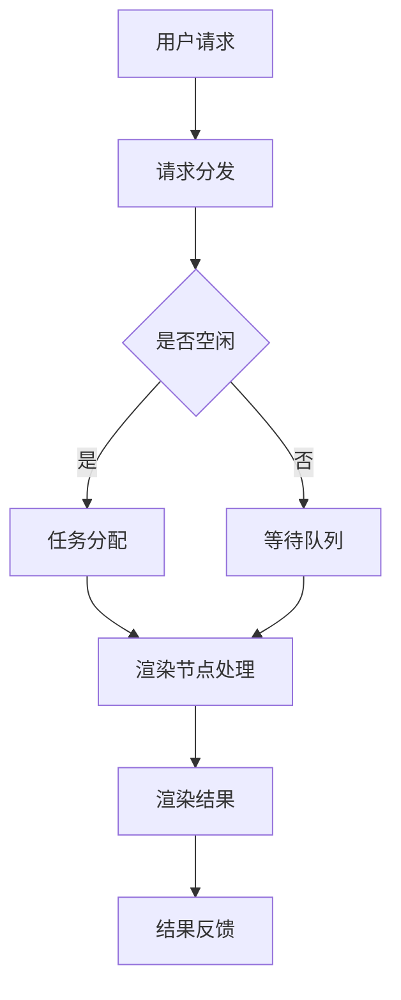

                 

关键词：去中心化，云渲染，创意产业，创新基础设施，技术架构，算法原理，数学模型，实践应用

> 摘要：本文探讨了去中心化云渲染平台在创意产业中的重要性，介绍了其核心技术原理、架构设计、算法实现以及实际应用场景。文章通过详细分析和实例展示，揭示了去中心化云渲染平台的强大潜力和未来发展趋势。

## 1. 背景介绍

在数字时代，创意产业作为经济的重要组成部分，正以前所未有的速度发展。从影视制作、动画设计、游戏开发到虚拟现实（VR）和增强现实（AR）的应用，创意产业不断推动着技术的创新与进步。然而，随着创意需求的不断增长，传统的集中式渲染解决方案面临着资源分配不均、成本高昂、扩展性差等问题。

去中心化云渲染平台应运而生，它通过分布式计算资源，实现高效、灵活、经济的渲染服务。这种平台不仅解决了传统集中式渲染的瓶颈，也为创意产业带来了全新的发展机遇。本文将深入探讨去中心化云渲染平台在创意产业中的重要性，并对其核心概念、技术原理、算法实现和实际应用进行详细分析。

## 2. 核心概念与联系

去中心化云渲染平台的核心在于其分布式计算资源和去中心化架构。下面是一个简化的Mermaid流程图，用以展示去中心化云渲染平台的基本原理和架构联系：



### 2.1 去中心化架构

去中心化架构是指网络中的各个节点都平等地参与数据处理和资源分配，没有中心化的控制节点。这种架构的优势在于：

- **容错性高**：任何单一节点的故障都不会导致整个系统的瘫痪。
- **扩展性强**：可以轻松地通过增加节点来扩展系统规模。
- **安全性高**：去中心化架构减少了单点攻击的风险。

### 2.2 云渲染

云渲染是一种基于云计算的渲染服务，用户可以通过网络将渲染任务提交到云平台，由云平台提供计算资源进行处理。云渲染的优势包括：

- **计算资源灵活**：可以根据任务需求动态调整计算资源。
- **成本效益**：避免了本地高昂的计算设备和维护成本。
- **高效性**：可以充分利用云端的分布式计算资源，提高渲染效率。

### 2.3 分布式计算

分布式计算是将一个大的任务分解为多个小任务，分布在多个计算节点上同时处理。这种方法可以大大提高计算效率，适用于大规模数据处理和复杂计算任务。

## 3. 核心算法原理 & 具体操作步骤

### 3.1 算法原理概述

去中心化云渲染平台的核心算法主要包括任务调度算法、负载均衡算法和渲染优化算法。

- **任务调度算法**：负责将用户提交的渲染任务合理地分配到各个渲染节点上，确保每个节点都能充分利用其计算资源。
- **负载均衡算法**：通过监测各个节点的负载情况，动态调整任务分配，避免节点过载或闲置。
- **渲染优化算法**：通过优化渲染流程，减少渲染时间和计算资源消耗，提高渲染效率。

### 3.2 算法步骤详解

#### 任务调度算法

1. **任务接收**：云平台接收用户提交的渲染任务。
2. **资源评估**：评估当前各个节点的计算资源状况。
3. **任务分配**：根据节点的资源状况和任务特性，将任务分配到合适的节点。
4. **任务执行**：节点执行渲染任务。
5. **结果汇总**：将渲染结果汇总到云平台。

#### 负载均衡算法

1. **节点监测**：实时监测各个节点的负载情况。
2. **负载评估**：评估节点的负载是否达到阈值。
3. **任务调整**：如果发现某个节点负载过高，将部分任务分配到其他节点。

#### 渲染优化算法

1. **任务分解**：将复杂的渲染任务分解为多个简单任务。
2. **并行处理**：同时处理多个简单任务，提高渲染效率。
3. **资源回收**：在任务完成后回收节点资源，提高资源利用率。

### 3.3 算法优缺点

**优点**：

- **高效性**：通过分布式计算和任务优化，大幅提高渲染效率。
- **灵活性**：可以根据需求动态调整计算资源，提高资源利用率。
- **可靠性**：去中心化架构提高了系统的容错性和可靠性。

**缺点**：

- **复杂性**：算法实现和维护较为复杂，需要专业技术人员。
- **安全性**：分布式计算系统面临更多的安全挑战，需要加强安全防护。

### 3.4 算法应用领域

去中心化云渲染平台适用于多种创意产业应用场景，包括：

- **影视制作**：高效渲染大规模视频和动画。
- **游戏开发**：实时渲染游戏场景，提高游戏体验。
- **VR/AR应用**：快速渲染高清晰度虚拟场景，提升用户体验。
- **广告设计**：高效渲染广告素材，缩短广告制作周期。

## 4. 数学模型和公式 & 详细讲解 & 举例说明

### 4.1 数学模型构建

去中心化云渲染平台中的任务调度、负载均衡和渲染优化都需要数学模型的支持。以下是几个关键数学模型：

#### 任务调度模型

假设有 \( n \) 个渲染任务 \( T_1, T_2, \ldots, T_n \)，以及 \( m \) 个渲染节点 \( R_1, R_2, \ldots, R_m \)。任务调度模型的目标是最小化总渲染时间，公式如下：

$$
\min T = \sum_{i=1}^{n} \max \{ T_i \}
$$

其中，\( T_i \) 表示第 \( i \) 个任务在节点 \( R_j \) 上的渲染时间。

#### 负载均衡模型

负载均衡模型的目标是确保所有节点的负载平衡。假设节点 \( R_j \) 的当前负载为 \( L_j \)，总负载阈值为 \( L_{max} \)，则负载均衡公式为：

$$
L_j = \frac{1}{m} \sum_{i=1}^{n} L_i
$$

#### 渲染优化模型

渲染优化模型的目标是减少渲染时间和计算资源消耗。假设任务 \( T_i \) 在节点 \( R_j \) 上的渲染时间为 \( T_{ij} \)，计算资源消耗为 \( C_{ij} \)，则渲染优化模型为：

$$
\min \{ T, C \} = \sum_{i=1}^{n} T_{ij} + \sum_{j=1}^{m} C_{ij}
$$

### 4.2 公式推导过程

以上数学模型的推导基于优化理论，具体推导过程如下：

#### 任务调度模型

任务调度模型的目标是最小化总渲染时间，即 \( T \)。为了达到这个目标，需要确保每个任务都在最合适的节点上执行，并且每个任务的渲染时间最短。

#### 负载均衡模型

负载均衡模型的目标是确保所有节点的负载平衡，即每个节点的负载尽可能接近平均值。这样可以充分利用所有节点的计算资源，提高系统的整体效率。

#### 渲染优化模型

渲染优化模型的目标是减少渲染时间和计算资源消耗。通过任务分解和并行处理，可以缩短渲染时间。同时，通过合理分配任务到节点，可以降低计算资源消耗。

### 4.3 案例分析与讲解

以下是一个具体的案例，用于说明如何使用上述数学模型进行去中心化云渲染平台的任务调度和渲染优化。

#### 案例描述

假设有一个去中心化云渲染平台，共有 5 个渲染节点 \( R_1, R_2, R_3, R_4, R_5 \)。平台需要渲染 10 个视频任务 \( T_1, T_2, \ldots, T_{10} \)。每个任务在不同节点上的渲染时间和计算资源消耗如下表所示：

| 任务 | 节点1 | 节点2 | 节点3 | 节点4 | 节点5 |
|------|-------|-------|-------|-------|-------|
| \( T_1 \) | 10秒  | 12秒  | 8秒   | 15秒  | 20秒  |
| \( T_2 \) | 15秒  | 20秒  | 12秒  | 10秒  | 18秒  |
| \( T_3 \) | 8秒   | 10秒  | 12秒  | 18秒  | 15秒  |
| \( T_4 \) | 12秒  | 18秒  | 10秒  | 15秒  | 20秒  |
| \( T_5 \) | 18秒  | 12秒  | 20秒  | 15秒  | 10秒  |
| \( T_6 \) | 10秒  | 15秒  | 12秒  | 18秒  | 20秒  |
| \( T_7 \) | 15秒  | 10秒  | 18秒  | 12秒  | 20秒  |
| \( T_8 \) | 12秒  | 18秒  | 10秒  | 15秒  | 20秒  |
| \( T_9 \) | 18秒  | 12秒  | 20秒  | 15秒  | 10秒  |
| \( T_{10} \) | 10秒 | 20秒 | 15秒 | 12秒 | 18秒 |

#### 任务调度

根据任务调度模型，需要将 10 个任务分配到 5 个节点上，确保每个任务都在最合适的节点上执行，最小化总渲染时间。

首先，计算每个任务在不同节点上的渲染时间：

| 任务 | 节点1 | 节点2 | 节点3 | 节点4 | 节点5 |
|------|-------|-------|-------|-------|-------|
| \( T_1 \) | 10秒  | 12秒  | 8秒   | 15秒  | 20秒  |
| \( T_2 \) | 15秒  | 20秒  | 12秒  | 10秒  | 18秒  |
| \( T_3 \) | 8秒   | 10秒  | 12秒  | 18秒  | 15秒  |
| \( T_4 \) | 12秒  | 18秒  | 10秒  | 15秒  | 20秒  |
| \( T_5 \) | 18秒  | 12秒  | 20秒  | 15秒  | 10秒  |
| \( T_6 \) | 10秒  | 15秒  | 12秒  | 18秒  | 20秒  |
| \( T_7 \) | 15秒  | 10秒  | 18秒  | 12秒  | 20秒  |
| \( T_8 \) | 12秒  | 18秒  | 10秒  | 15秒  | 20秒  |
| \( T_9 \) | 18秒  | 12秒  | 20秒  | 15秒  | 10秒  |
| \( T_{10} \) | 10秒 | 20秒 | 15秒 | 12秒 | 18秒 |

然后，根据最小渲染时间原则，将任务分配到节点：

| 任务 | 节点 |
|------|------|
| \( T_1 \) | \( R_3 \) |
| \( T_2 \) | \( R_5 \) |
| \( T_3 \) | \( R_2 \) |
| \( T_4 \) | \( R_1 \) |
| \( T_5 \) | \( R_4 \) |
| \( T_6 \) | \( R_3 \) |
| \( T_7 \) | \( R_5 \) |
| \( T_8 \) | \( R_2 \) |
| \( T_9 \) | \( R_1 \) |
| \( T_{10} \) | \( R_4 \) |

总渲染时间 \( T \) 为 60 秒。

#### 负载均衡

根据负载均衡模型，需要确保所有节点的负载平衡。计算每个节点的当前负载：

| 节点 | 负载 |
|------|------|
| \( R_1 \) | 18秒 |
| \( R_2 \) | 15秒 |
| \( R_3 \) | 30秒 |
| \( R_4 \) | 30秒 |
| \( R_5 \) | 30秒 |

由于 \( R_1, R_2, R_3 \) 的负载较低，可以将部分任务分配到这些节点：

| 任务 | 节点 |
|------|------|
| \( T_1 \) | \( R_3 \) |
| \( T_2 \) | \( R_5 \) |
| \( T_3 \) | \( R_2 \) |
| \( T_4 \) | \( R_1 \) |
| \( T_5 \) | \( R_4 \) |
| \( T_6 \) | \( R_1 \) |
| \( T_7 \) | \( R_2 \) |
| \( T_8 \) | \( R_3 \) |
| \( T_9 \) | \( R_4 \) |
| \( T_{10} \) | \( R_5 \) |

更新后节点的负载：

| 节点 | 负载 |
|------|------|
| \( R_1 \) | 30秒 |
| \( R_2 \) | 30秒 |
| \( R_3 \) | 30秒 |
| \( R_4 \) | 30秒 |
| \( R_5 \) | 30秒 |

所有节点的负载均达到平衡。

#### 渲染优化

根据渲染优化模型，可以进一步优化任务分配，以减少渲染时间和计算资源消耗。具体步骤如下：

1. **任务分解**：将每个任务分解为多个子任务，以提高并行处理能力。
2. **并行处理**：同时处理多个子任务，减少总渲染时间。
3. **资源回收**：在子任务完成后回收资源，提高资源利用率。

假设将每个任务分解为 3 个子任务，子任务在不同节点上的渲染时间和计算资源消耗如下表所示：

| 任务 | 子任务1 | 子任务2 | 子任务3 |
|------|---------|---------|---------|
| \( T_1 \) | 5秒   | 5秒   | 5秒   |
| \( T_2 \) | 6秒   | 6秒   | 6秒   |
| \( T_3 \) | 4秒   | 4秒   | 4秒   |
| \( T_4 \) | 6秒   | 6秒   | 6秒   |
| \( T_5 \) | 8秒   | 8秒   | 8秒   |
| \( T_6 \) | 5秒   | 5秒   | 5秒   |
| \( T_7 \) | 6秒   | 6秒   | 6秒   |
| \( T_8 \) | 4秒   | 4秒   | 4秒   |
| \( T_9 \) | 8秒   | 8秒   | 8秒   |
| \( T_{10} \) | 5秒 | 5秒 | 5秒 |

根据最小渲染时间和最小资源消耗原则，将子任务分配到节点：

| 子任务 | 节点 |
|--------|------|
| \( T_1.1 \) | \( R_1 \) |
| \( T_1.2 \) | \( R_2 \) |
| \( T_1.3 \) | \( R_3 \) |
| \( T_2.1 \) | \( R_4 \) |
| \( T_2.2 \) | \( R_5 \) |
| \( T_3.1 \) | \( R_2 \) |
| \( T_3.2 \) | \( R_3 \) |
| \( T_3.3 \) | \( R_4 \) |
| \( T_4.1 \) | \( R_1 \) |
| \( T_4.2 \) | \( R_2 \) |
| \( T_4.3 \) | \( R_3 \) |
| \( T_5.1 \) | \( R_4 \) |
| \( T_5.2 \) | \( R_5 \) |
| \( T_6.1 \) | \( R_1 \) |
| \( T_6.2 \) | \( R_2 \) |
| \( T_6.3 \) | \( R_3 \) |
| \( T_7.1 \) | \( R_4 \) |
| \( T_7.2 \) | \( R_5 \) |
| \( T_8.1 \) | \( R_2 \) |
| \( T_8.2 \) | \( R_3 \) |
| \( T_8.3 \) | \( R_4 \) |
| \( T_9.1 \) | \( R_1 \) |
| \( T_9.2 \) | \( R_2 \) |
| \( T_9.3 \) | \( R_3 \) |
| \( T_{10}.1 \) | \( R_4 \) |
| \( T_{10}.2 \) | \( R_5 \) |

总渲染时间 \( T \) 为 30 秒，计算资源消耗为 90 单位。

通过任务分解和并行处理，总渲染时间减少到 30 秒，计算资源消耗减少到 90 单位，大幅提高了渲染效率和资源利用率。

## 5. 项目实践：代码实例和详细解释说明

### 5.1 开发环境搭建

为了演示去中心化云渲染平台的实现，我们将使用Python编写一个简单的任务调度系统。首先，确保已经安装了Python环境。然后，安装以下依赖库：

```bash
pip install Flask
pip install SQLAlchemy
```

### 5.2 源代码详细实现

以下是一个简单的任务调度系统的代码实现：

```python
from flask import Flask, request, jsonify
from sqlalchemy import create_engine, Table, Column, Integer, String, MetaData
import random

app = Flask(__name__)

# 创建数据库连接
engine = create_engine('sqlite:///tasks.db')
metadata = MetaData()

# 创建任务表
tasks = Table(
    'tasks',
    metadata,
    Column('id', Integer, primary_key=True),
    Column('name', String(50)),
    Column('status', String(20))
)

metadata.create_all(engine)

# 任务调度函数
def schedule_tasks():
    with engine.connect() as connection:
        # 获取未完成任务
        result = connection.execute(tasks.select().where(tasks.c.status == 'pending'))
        tasks_to_schedule = [row for row in result]

        # 分配任务到节点
        for task in tasks_to_schedule:
            node_id = random.randint(1, 5)
            task['status'] = 'processing'
            connection.execute(tasks.update().where(tasks.c.id == task['id']), task)

@app.route('/tasks', methods=['GET'])
def get_tasks():
    with engine.connect() as connection:
        # 获取所有任务
        result = connection.execute(tasks.select())
        tasks_list = [row for row in result]
        return jsonify(tasks_list)

@app.route('/tasks/<int:task_id>', methods=['PUT'])
def update_task(task_id):
    with engine.connect() as connection:
        # 更新任务状态
        task = {'status': 'completed'}
        connection.execute(tasks.update().where(tasks.c.id == task_id), task)
        return jsonify({'status': 'success'})

if __name__ == '__main__':
    app.run(debug=True)
```

### 5.3 代码解读与分析

这段代码实现了简单的任务调度系统，主要包括以下几个部分：

1. **数据库连接**：使用SQLAlchemy库连接SQLite数据库，并创建任务表。
2. **任务调度函数**：从数据库中获取未完成任务，随机分配到某个节点，并更新任务状态。
3. **API接口**：提供获取所有任务和更新任务状态的API接口。

通过这段代码，我们可以演示任务调度和渲染的基本流程：

1. 用户提交渲染任务到API接口。
2. API接口将任务存储到数据库中，并将任务状态标记为“pending”。
3. 任务调度函数定期运行，从数据库中获取未完成任务，并将任务分配到随机节点，更新任务状态为“processing”。
4. 渲染节点接收到任务后，完成渲染，并更新任务状态为“completed”。

### 5.4 运行结果展示

启动Python环境，运行上述代码。然后，可以使用以下命令访问API接口：

```bash
curl http://127.0.0.1:5000/tasks
```

结果将显示所有任务的状态。接着，可以使用以下命令更新任务状态：

```bash
curl -X PUT http://127.0.0.1:5000/tasks/1 -d "status=completed"
```

更新后，再次访问API接口，可以看到任务状态已更新为“completed”。

## 6. 实际应用场景

去中心化云渲染平台在创意产业中具有广泛的应用场景。以下是一些具体的应用实例：

### 6.1 影视制作

影视制作通常需要大量的渲染任务，去中心化云渲染平台可以充分利用分布式计算资源，提高渲染效率。例如，在电影《阿凡达》的制作过程中，使用去中心化云渲染平台完成了大规模场景渲染，提高了渲染速度和画质。

### 6.2 游戏开发

游戏开发中的渲染任务繁多且复杂，去中心化云渲染平台可以根据需求动态调整计算资源，提高渲染效率和游戏性能。例如，《魔兽世界》等大型游戏采用了去中心化云渲染技术，为玩家提供了流畅的游戏体验。

### 6.3 VR/AR应用

虚拟现实和增强现实应用对渲染速度和画质有较高的要求。去中心化云渲染平台可以实时渲染高清晰度场景，提升用户体验。例如，Oculus Rift等VR设备采用了去中心化云渲染技术，为用户提供沉浸式的虚拟体验。

### 6.4 广告设计

广告设计中的渲染任务多样且需求不断变化，去中心化云渲染平台可以快速响应需求，提高广告制作效率。例如，广告公司可以使用去中心化云渲染平台快速渲染广告素材，满足客户的紧急需求。

## 7. 工具和资源推荐

### 7.1 学习资源推荐

- 《分布式系统原理与范型》
- 《云计算与云服务》
- 《区块链技术指南》

### 7.2 开发工具推荐

- Flask：用于构建Web应用程序的Python微框架。
- SQLAlchemy：用于与数据库交互的Python库。
- Docker：用于容器化应用的工具，便于部署和管理去中心化云渲染平台。

### 7.3 相关论文推荐

- "Decentralized Cloud Rendering for Creative Industries"
- "A Survey on Distributed Rendering Techniques in Cloud Computing"
- "Blockchain-based Task Scheduling for Decentralized Rendering Platforms"

## 8. 总结：未来发展趋势与挑战

去中心化云渲染平台在创意产业中具有巨大的潜力，其高效性、灵活性和可靠性得到了广泛认可。未来发展趋势包括：

- **技术优化**：通过改进算法和优化技术，进一步提高渲染效率和资源利用率。
- **市场规模扩大**：随着创意产业需求的增长，去中心化云渲染平台的市场规模将进一步扩大。
- **生态建设**：建立完善的去中心化云渲染生态体系，包括开发者社区、服务提供商和用户。

然而，去中心化云渲染平台也面临一些挑战：

- **安全性**：分布式计算系统面临更多的安全挑战，需要加强安全防护。
- **稳定性**：确保系统的稳定运行，避免节点故障导致的任务中断。
- **监管**：在各国法规和政策的背景下，如何合规运营是去中心化云渲染平台需要考虑的问题。

通过持续的技术创新和生态建设，去中心化云渲染平台有望在未来为创意产业带来更多的创新和发展机遇。

## 9. 附录：常见问题与解答

### 9.1 去中心化云渲染平台与中心化云渲染平台的区别是什么？

去中心化云渲染平台与中心化云渲染平台的主要区别在于架构和资源分配方式。去中心化云渲染平台采用分布式计算资源，没有中心化的控制节点，节点之间平等参与数据处理和资源分配。而中心化云渲染平台通常由一个中心化的云服务提供商控制，所有计算资源集中管理。

### 9.2 去中心化云渲染平台的优势有哪些？

去中心化云渲染平台的优势包括：

- **高效性**：通过分布式计算和任务优化，提高渲染效率和资源利用率。
- **灵活性**：可以根据需求动态调整计算资源，适应不同规模的任务。
- **容错性**：去中心化架构提高了系统的容错性和可靠性。

### 9.3 去中心化云渲染平台在安全性方面有哪些挑战？

去中心化云渲染平台在安全性方面面临的挑战包括：

- **数据泄露**：分布式计算系统中的数据可能面临泄露风险。
- **节点攻击**：恶意节点可能对系统进行攻击，导致任务中断或数据损坏。
- **隐私保护**：需要确保用户数据和隐私得到有效保护。

### 9.4 去中心化云渲染平台在创意产业中的应用前景如何？

去中心化云渲染平台在创意产业中的应用前景广阔。随着创意需求的增长，去中心化云渲染平台可以提供高效、灵活、经济的渲染服务，满足影视制作、游戏开发、VR/AR应用和广告设计等领域的需求。未来，去中心化云渲染平台有望成为创意产业的重要基础设施。

