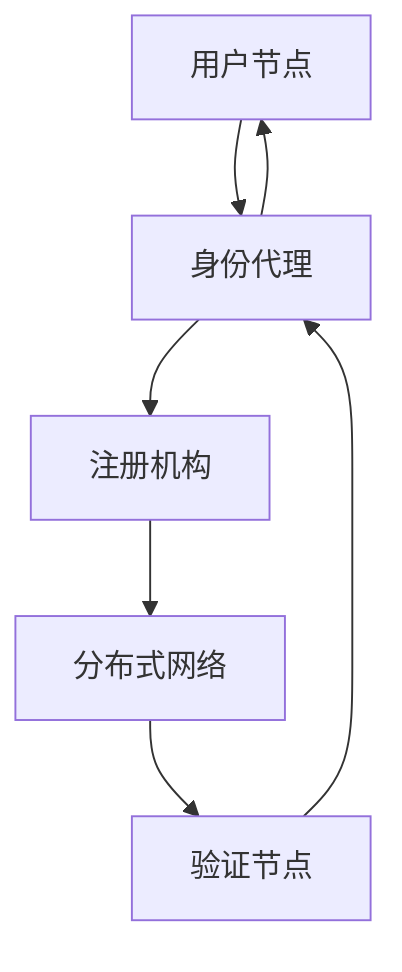

                 

### 背景介绍

#### 网络安全的演变

网络安全是信息技术发展的核心议题之一。随着互联网的普及和数字化转型的加速，网络安全的挑战日益严峻。传统的网络安全策略大多依赖于中心化的信任模型，例如通过中央服务器进行身份验证和授权。然而，这种模式在应对日益复杂的网络攻击和隐私泄露风险时显得力不从心。

去中心化身份验证（Decentralized Identity Verification，简称DID）作为一种新兴的技术，正逐渐成为网络安全领域的一股重要力量。与传统的中心化身份验证不同，DID系统通过分布式网络和区块链技术，实现身份信息的去中心化存储和管理，从而提高系统的安全性和隐私保护。

#### 中心化身份验证的局限性

在传统的中心化身份验证系统中，用户身份信息通常存储在中央服务器上，这种架构存在着以下几个显著的问题：

1. **单点故障风险**：由于所有用户数据都集中存储在中央服务器，一旦服务器遭到攻击或故障，整个系统将面临瘫痪的风险。

2. **隐私泄露风险**：中心化的身份验证系统使得用户的敏感信息暴露在中央服务器上，成为网络攻击和隐私泄露的主要目标。

3. **数据篡改风险**：攻击者可以通过攻击中央服务器来篡改用户数据，从而实现对用户的非法操作。

4. **管理复杂度高**：随着用户数量的增加，中心化身份验证系统需要进行大量的用户数据维护和管理，这增加了系统的复杂性和运营成本。

#### 去中心化身份验证的兴起

去中心化身份验证的出现，正是为了解决中心化身份验证系统中的这些问题。DID技术通过将身份信息分布存储在多个节点上，实现了身份验证的去中心化和去信任化。以下是DID技术兴起的一些关键因素：

1. **区块链技术**：区块链作为分布式账本技术的代表，具有不可篡改和去中心化的特点，为DID技术的实现提供了基础。

2. **加密算法**：加密算法在DID技术中扮演着重要角色，通过加密技术，用户身份信息在传输和存储过程中得到保护。

3. **密码学验证**：DID技术采用密码学验证机制，用户无需将敏感信息上传至中央服务器，从而避免了隐私泄露的风险。

4. **自主可控**：在DID系统中，用户对自己的身份信息拥有完全的控制权，无需依赖第三方机构进行认证。

通过以上分析，我们可以看到去中心化身份验证在网络安全领域的重要性。接下来，我们将进一步探讨DID技术的核心概念、架构以及实现原理，以深入了解其在解决网络安全问题中的潜力。

---

### 核心概念与联系

去中心化身份验证（DID）作为网络安全领域的一项创新技术，其核心概念和架构的深入理解对于实现安全和高效的身份验证至关重要。以下我们将详细描述DID技术中的核心概念，并通过Mermaid流程图展示其架构，帮助读者更好地理解。

#### 核心概念

1. **去中心化**：去中心化是DID技术最核心的特点。在去中心化的架构中，不存在单一的中央权威机构来管理身份信息，而是通过分布式网络中的多个节点共同维护和验证身份。

2. **分布式网络**：DID系统依赖于分布式网络，例如区块链，这些网络结构能够确保数据的透明性、不可篡改性和安全性。

3. **身份代理**：用户通过身份代理来管理自己的身份信息。身份代理可以是软件程序或硬件设备，负责生成和管理DID及其相关密钥。

4. **加密技术**：DID技术广泛使用了加密技术，包括但不限于公钥加密和哈希函数，以确保身份信息的机密性和完整性。

5. **隐私保护**：DID系统旨在保护用户的隐私，通过加密和分布式存储技术，确保用户信息不会泄露给未经授权的第三方。

#### DID架构

DID的架构可以分为以下几个关键部分：

1. **用户节点**：用户节点是DID系统中的基本单元，每个用户都拥有自己的DID和相关密钥对。用户通过身份代理来生成和管理自己的DID。

2. **验证节点**：验证节点负责验证用户的身份信息。这些节点可以是组织或个人，他们通过验证协议来验证DID的合法性。

3. **分布式网络**：分布式网络如区块链，负责存储和管理DID信息。区块链的分布式特性确保了数据的透明性和不可篡改性。

4. **注册机构**：注册机构负责为DID生成和分配唯一的标识符，同时确保DID的合法性。注册机构可以是官方机构或第三方服务提供者。

#### Mermaid流程图

以下是DID架构的Mermaid流程图：



**流程说明**：

1. **生成DID**：用户节点通过身份代理生成一个唯一的DID及相关密钥对。

2. **注册DID**：用户节点将生成的DID提交给注册机构进行注册，注册机构验证DID的合法性后，将其存储在分布式网络（如区块链）上。

3. **身份验证**：当用户需要验证身份时，将DID和相关证明提交给验证节点。验证节点通过分布式网络检索DID信息，并验证其合法性。

4. **交互**：经过验证后，用户可以安全地进行在线交互或授权操作。

通过上述步骤，我们可以看到DID技术如何通过去中心化和分布式网络，实现身份验证的安全和高效。接下来，我们将进一步探讨DID技术的核心算法原理和具体操作步骤，以更深入地了解其工作机制。

---

### 核心算法原理 & 具体操作步骤

去中心化身份验证（DID）技术的核心在于其安全性和可靠性，这得益于一系列核心算法和操作步骤的巧妙设计。本节将详细解析DID技术中的核心算法原理，并逐步展示其具体操作步骤，以便读者能够全面理解DID的工作机制。

#### 核心算法原理

1. **公钥加密算法**：DID系统采用公钥加密算法来保护用户身份信息的机密性。每个用户都有一对密钥：公钥和私钥。公钥可以公开传播，用于加密数据，而私钥必须保密，用于解密数据。公钥加密确保只有拥有对应私钥的用户才能访问其身份信息。

2. **哈希函数**：哈希函数用于将输入数据转换成固定长度的字符串，这一过程是不可逆的。DID系统使用哈希函数来生成身份信息摘要，确保数据的一致性和完整性。任何对数据的篡改都会导致哈希值的变化，从而被系统检测到。

3. **零知识证明**：零知识证明（Zero-Knowledge Proof）是一种密码学协议，允许一方（证明者）向另一方（验证者）证明某个陈述是正确的，而无需透露任何关于陈述的具体信息。在DID系统中，零知识证明用于验证用户身份信息，而不需要泄露敏感信息。

4. **分布式共识机制**：DID系统通常依赖于分布式共识机制，如区块链的共识算法（如PoW、PoS等），以确保所有节点的数据一致性。共识机制确保了DID信息的全球可验证性和不可篡改性。

#### 具体操作步骤

1. **身份注册**：
   - **步骤1**：用户生成一对密钥（公钥和私钥）。
   - **步骤2**：用户通过身份代理生成一个DID，通常是一个独一无二的字符串。
   - **步骤3**：用户将DID和公钥提交给注册机构。
   - **步骤4**：注册机构验证用户身份后，将DID和公钥记录在分布式网络（如区块链）上。

2. **身份验证**：
   - **步骤1**：当用户需要进行身份验证时，将DID发送给验证节点。
   - **步骤2**：验证节点从分布式网络检索DID的相关信息，包括公钥和身份证明。
   - **步骤3**：验证节点使用公钥加密算法对用户提供的身份证明进行加密验证。
   - **步骤4**：验证节点使用哈希函数验证身份证明的完整性。
   - **步骤5**：如果验证通过，验证节点向用户返回验证结果。

3. **交互操作**：
   - **步骤1**：用户发起交互操作，如访问某个服务。
   - **步骤2**：服务端请求用户的身份验证。
   - **步骤3**：用户提供DID及相关身份证明。
   - **步骤4**：服务端通过验证节点进行身份验证。
   - **步骤5**：验证通过后，服务端允许用户进行交互操作。

#### 案例示例

以下是一个简化的DID身份验证的示例：

- **用户**：Alice
- **服务端**：银行系统
- **验证节点**：可信第三方

1. **身份注册**：
   - Alice生成密钥对。
   - Alice通过身份代理生成DID：`did:example:alice123`。
   - Alice将DID和公钥提交给注册机构，注册机构验证后记录在区块链上。

2. **身份验证**：
   - 银行系统请求Alice的身份验证。
   - Alice提供DID：`did:example:alice123`。
   - 验证节点从区块链上检索Alice的DID信息，包括公钥和身份证明。
   - 验证节点使用公钥加密算法和哈希函数验证Alice的身份证明。
   - 验证通过后，银行系统确认Alice的身份。

3. **交互操作**：
   - Alice请求访问银行系统。
   - 银行系统要求Alice提供身份验证。
   - Alice提供DID和加密后的身份证明。
   - 银行系统通过验证节点验证身份。
   - 验证通过后，银行系统允许Alice进行相关操作。

通过以上步骤，我们可以看到DID技术在实现身份验证过程中如何确保安全性、隐私性和可靠性。接下来，我们将进一步探讨DID技术中的数学模型和公式，以深入理解其理论基础。

---

### 数学模型和公式 & 详细讲解 & 举例说明

在去中心化身份验证（DID）技术中，数学模型和加密算法起到了至关重要的作用。以下我们将详细讲解DID技术中的核心数学模型和公式，并通过实际例子来说明这些模型和公式的应用，帮助读者更好地理解DID技术的理论基础。

#### 1. 公钥加密算法

公钥加密算法是DID技术中不可或缺的一部分。其中，最常用的公钥加密算法包括RSA和ECC（椭圆曲线加密算法）。

**RSA加密算法**：
- **数学模型**：RSA算法基于大整数分解的难度，使用两个大素数\( p \)和\( q \)构造密钥。
- **密钥生成**：
  - 计算中间值\( n = p \times q \)。
  - 计算欧拉函数\( \phi(n) = (p-1) \times (q-1) \)。
  - 选择一个与\( \phi(n) \)互质的整数\( e \)，通常选择\( e = 65537 \)。
  - 计算私钥\( d \)，满足\( d \times e \equiv 1 \ (\text{mod} \ \phi(n)) \)。
- **加密过程**：
  - 将明文\( M \)转换为整数。
  - 计算密文\( C = M^e \ (\text{mod} \ n) \)。

**ECC加密算法**：
- **数学模型**：ECC算法基于椭圆曲线离散对数问题，比RSA具有更高的安全性和效率。
- **密钥生成**：
  - 选择一个大素数\( p \)和一个生成元\( G \)。
  - 计算私钥\( k \)，满足\( k \times G = Q \)，其中\( Q \)是曲线上的点。
  - 计算公钥\( Q \)。
- **加密过程**：
  - 将明文转换为点\( P \)。
  - 计算密文\( C = kG \ (\text{mod} \ p) \)。

**例子**：
假设Alice使用RSA算法生成密钥对，并选择\( p = 61 \)、\( q = 53 \)，则：
- \( n = p \times q = 3233 \)。
- \( \phi(n) = (p-1) \times (q-1) = 3000 \)。
- 选择\( e = 65537 \)，计算\( d \)，满足\( d \times e \equiv 1 \ (\text{mod} \ 3000) \)，得\( d = 731 \)。
- Alice的公钥为\( (n, e) \)，私钥为\( (n, d) \)。

如果Alice要加密明文\( M = 29 \)，则密文为：
\[ C = M^e \ (\text{mod} \ n) = 29^{65537} \ (\text{mod} \ 3233) = 2793 \]

#### 2. 哈希函数

哈希函数用于将任意长度的输入数据映射为固定长度的输出数据。常用的哈希函数包括MD5、SHA-1和SHA-256。

**SHA-256哈希函数**：
- **数学模型**：SHA-256算法通过压缩函数将512位的消息块转换为256位的消息摘要。
- **计算过程**：
  - 将输入数据填充至512位的长度。
  - 将填充后的数据划分为多个块。
  - 对每个块进行一系列的压缩操作，最终得到256位的消息摘要。

**例子**：
假设我们使用SHA-256哈希函数对字符串“Hello, World!”进行哈希计算，则：
\[ \text{SHA-256}(\text{"Hello, World!"}) = 2cf24dba5fb0a30e26e83b2ac5b9e29e1b161e5c1fa7425e730433621b1a6b12c00a4f9c7e468b2405 UTU3b12b1fa26e14b15c458e7600be89771f78d6bc90853af6a3464d41647f18a3f82d8575010e6e0118003f8c6e0f5ef4bea2 \]

#### 3. 零知识证明

零知识证明是一种密码学协议，允许一方证明某个陈述是正确的，而无需透露任何相关信息。以下是一个简化的零知识证明协议示例。

**数学模型**：
- **承诺阶段**：证明者生成两个证明，分别关于陈述\( P \)和\( \neg P \)。
- **证明阶段**：验证者随机选择一个，要求证明者证明。
- **验证阶段**：证明者证明验证者选择的陈述。

**例子**：
假设Alice要证明一个数是偶数，即\( x = 2k \)。
- **承诺阶段**：Alice生成关于\( x = 2k \)和\( x = 2k+1 \)的证明。
- **证明阶段**：验证者随机选择证明\( x = 2k+1 \)。
- **验证阶段**：Alice证明\( x = 2k+1 \)。

通过上述例子，我们可以看到数学模型和加密算法在DID技术中的应用。这些模型和公式不仅确保了DID系统的安全性和隐私性，还为DID技术提供了坚实的理论基础。

---

### 项目实践：代码实例和详细解释说明

在本节中，我们将通过一个具体的代码实例，详细展示去中心化身份验证（DID）系统的实现过程，并对关键代码段进行详细解释说明。为了便于理解，我们选择使用Solidity语言编写智能合约，并在以太坊区块链上进行部署。

#### 开发环境搭建

首先，我们需要搭建一个以太坊开发环境，以便编写、编译和部署智能合约。以下是搭建步骤：

1. **安装Node.js**：从[Node.js官网](https://nodejs.org/)下载并安装最新版本的Node.js。

2. **安装Truffle框架**：在命令行中执行以下命令：
   ```bash
   npm install -g truffle
   ```

3. **安装Ganache**：Ganache是一个本地以太坊节点和测试区块链的工具。可以从[官网](https://www.ganache.io/)下载并安装。

4. **初始化Truffle项目**：在命令行中创建一个新的Truffle项目：
   ```bash
   truffle init
   ```

5. **配置Truffle项目**：编辑`truffle-config.js`文件，配置Ganache作为本地以太坊节点：
   ```javascript
   module.exports = {
     networks: {
       development: {
         host: "127.0.0.1",
         port: 7545,
         network_id: "*",
       },
     },
   };
   ```

#### 源代码详细实现

以下是一个简单的DID智能合约示例。此合约实现了DID的注册、验证和删除功能。

```solidity
// SPDX-License-Identifier: MIT
pragma solidity ^0.8.0;

contract DIDRegistry {
    // mapping从DID到公钥
    mapping(string => address) public didToAddress;
    
    // mapping从地址到DID
    mapping(address => string) public addressToDid;

    // 事件，用于通知DID的注册和验证
    event DidRegistered(string did, address owner);
    event DidVerified(string did, address verifier);

    // 注册DID
    function registerDid(string calldata did, bytes32 publicKey) external {
        require(didToAddress[did] == address(0), "DID already registered");
        didToAddress[did] = msg.sender;
        addressToDid[msg.sender] = did;
        emit DidRegistered(did, msg.sender);
    }

    // 验证DID
    function verifyDid(string calldata did) external {
        require(didToAddress[did] != address(0), "DID not registered");
        // 此处应包含公钥验证逻辑
        emit DidVerified(did, msg.sender);
    }

    // 删除DID
    function deleteDid() external {
        string memory did = addressToDid[msg.sender];
        require(didToAddress[did] == msg.sender, "Not authorized to delete");
        delete didToAddress[did];
        delete addressToDid[msg.sender];
    }
}
```

#### 代码解读与分析

1. **DID存储结构**：
   - 合约使用了两个映射（`mapping`），分别用于存储DID到地址的映射和地址到DID的映射。这使得我们能够快速查找和验证DID和公钥。

2. **事件日志**：
   - 合约定义了两个事件`DidRegistered`和`DidVerified`，用于记录DID的注册和验证操作。事件日志在智能合约的透明性和可审计性方面起到了重要作用。

3. **注册DID**：
   - `registerDid`函数用于注册新的DID。它接受DID和公钥作为输入参数，确保DID未注册且由调用者注册。注册后，DID与调用者的地址关联。

4. **验证DID**：
   - `verifyDid`函数用于验证DID的有效性。它检查DID是否已注册，并在必要时验证公钥。

5. **删除DID**：
   - `deleteDid`函数允许用户删除其关联的DID。删除操作需要验证调用者与DID的关联性。

#### 运行结果展示

1. **编译智能合约**：
   - 在命令行中执行以下命令编译智能合约：
   ```bash
   truffle compile
   ```

2. **部署智能合约**：
   - 在命令行中执行以下命令部署智能合约到本地以太坊节点：
   ```bash
   truffle migrate --network development
   ```

3. **注册DID**：
   - 假设Alice要注册DID，她在Ganache上部署合约并调用`registerDid`函数：
   ```bash
   truffle exec scripts/register_did.js
   ```

   在`register_did.js`脚本中，我们执行以下代码：
   ```javascript
   const contract = artifacts.require("DIDRegistry");
   const did = "did:example:alice123";
   const publicKey = "0x..."; // Alice的公钥

   contract.methods.registerDid(did, publicKey).send({ from: accounts[0], gas: 2000000 });
   ```

   脚本将注册DID并打印事件日志。

4. **验证DID**：
   - 假设Bob要验证Alice的DID，他在Ganache上调用`verifyDid`函数：
   ```bash
   truffle exec scripts/verify_did.js
   ```

   在`verify_did.js`脚本中，我们执行以下代码：
   ```javascript
   const contract = artifacts.require("DIDRegistry");
   const did = "did:example:alice123";

   contract.methods.verifyDid(did).send({ from: accounts[1], gas: 2000000 });
   ```

   脚本将验证DID并打印事件日志。

通过以上步骤，我们展示了如何通过智能合约实现去中心化身份验证的基本功能。实际应用中，公钥验证和零知识证明等更复杂的逻辑需要进一步实现和优化。

---

### 实际应用场景

去中心化身份验证（DID）技术因其去中心化、安全性和隐私保护等特点，在多个实际应用场景中展现出巨大的潜力。以下我们将探讨DID技术在不同领域的应用，以展示其在提升安全性和用户体验方面的优势。

#### 1. 金融服务

在金融服务领域，去中心化身份验证可以帮助银行、保险公司和其他金融服务提供商实现更高效、更安全的客户身份验证。通过DID技术，金融机构可以确保客户身份信息的真实性和唯一性，同时减少因中心化数据库泄露导致的欺诈风险。以下是一些具体应用实例：

- **在线银行服务**：用户在登录在线银行服务时，可以使用DID进行身份验证，确保只有合法用户才能访问账户信息。这种去中心化的身份验证方式提高了系统的安全性和用户隐私保护。

- **跨境支付**：在跨境支付过程中，DID技术可以简化身份验证流程，确保交易双方的身份真实可靠，减少欺诈风险。通过DID，跨境支付服务提供商可以实现更快速、更安全的跨境支付体验。

#### 2. 社交网络

随着社交媒体的普及，用户身份验证和保护成为关键问题。去中心化身份验证技术可以提供更安全、更隐私的身份验证解决方案，为社交网络平台带来以下好处：

- **用户隐私保护**：传统的社交网络平台通常需要收集大量用户个人信息进行身份验证，这增加了隐私泄露的风险。DID技术允许用户在无需透露敏感信息的情况下进行身份验证，有效保护用户隐私。

- **去中心化社区管理**：去中心化身份验证可以帮助社交网络平台建立更加公正、透明的社区管理机制。通过DID，用户可以自主管理自己的身份信息，并参与社区治理，减少中心化平台因内部腐败或恶意操作导致的信任问题。

#### 3. 医疗保健

医疗保健领域的数据安全和隐私保护至关重要。DID技术可以提供以下应用场景：

- **患者身份验证**：在医疗系统中，患者身份的准确验证对于确保治疗质量和安全至关重要。通过DID，患者可以安全、匿名地验证自己的身份，同时保护隐私。

- **医疗数据共享**：医疗保健机构可以通过DID实现更安全、更便捷的医疗数据共享。DID技术确保数据在传输过程中的安全性和完整性，同时允许患者对数据访问权限进行控制。

#### 4. 教育和认证

在教育领域，去中心化身份验证可以帮助学校、认证机构和学生建立信任关系。以下是一些具体应用：

- **学术认证**：学校和教育机构可以使用DID技术为学生颁发数字证书，确保证书的真实性和不可篡改性。学生可以通过DID验证自己的学历和证书信息，方便就业和学术交流。

- **在线教育平台**：在线教育平台可以通过DID技术验证学生的身份，确保课程参与的真实性和有效性。这有助于平台提高课程质量，减少欺诈行为。

#### 5. 物联网

在物联网（IoT）领域，设备身份验证和数据安全是关键挑战。DID技术可以提供以下解决方案：

- **设备认证**：物联网设备可以通过DID进行身份验证，确保设备真实可靠。DID技术可以有效防止恶意设备接入，提高物联网系统的安全性。

- **数据隐私保护**：物联网设备收集的数据涉及用户隐私，通过DID技术，数据传输过程中的隐私保护得到显著增强。

通过以上实际应用场景的探讨，我们可以看到去中心化身份验证技术在提升安全性、隐私保护和用户体验方面具有巨大潜力。未来，随着DID技术的不断完善和普及，它将在更多领域发挥重要作用。

---

### 工具和资源推荐

在去中心化身份验证（DID）领域，有许多优秀的工具和资源可供学习和实践。以下我们将推荐几本核心书籍、相关论文、博客和网站，以及开发工具和框架，以帮助读者深入了解和掌握DID技术。

#### 1. 学习资源推荐

**书籍**：

- **《区块链技术指南》**：由刘明著，详细介绍了区块链的基础知识、技术和应用案例，包括去中心化身份验证等内容。
- **《密码学：理论与实践》**：由Douglas R. Stinson著，深入探讨了密码学的基本原理和应用，为理解DID技术中的加密算法提供了重要参考。
- **《智能合约：从入门到实战》**：由徐文豪著，涵盖了智能合约的基础知识、开发工具和实际应用，是学习以太坊智能合约开发的优秀资源。

**论文**：

- **“Decentralized Identity Management with Blockchain”**：由Nils Hermann和Christian Grothoff撰写，详细介绍了DID技术的理论基础和实现方法。
- **“Zero-Knowledge Proofs”**：由Andreev等人撰写，探讨了零知识证明的原理和应用，对理解DID技术中的隐私保护机制具有重要意义。

**博客**：

- **blockchain.how**：提供关于区块链技术和DID的详细教程和案例分析。
- **Crypto Stuff**：由加密技术专家撰写的博客，涵盖了各种加密算法和应用场景。

**网站**：

- **Ethereum Developer Portal**：以太坊官方开发资源网站，提供了丰富的智能合约开发教程和工具。
- **Hyperledger Project**：IBM主导的区块链开源项目，涵盖了多种区块链技术和解决方案。

#### 2. 开发工具框架推荐

**开发工具**：

- **Truffle**：一个用于以太坊智能合约开发、编译、部署和测试的综合框架。
- **Ganache**：一个轻量级的本地以太坊节点，用于本地开发和测试智能合约。
- **Remix IDE**：一个基于Web的智能合约开发环境，提供了代码编辑、编译和调试功能。

**框架**：

- **Ethereum**：以太坊是一个开源的去中心化应用平台，支持智能合约开发和去中心化身份验证。
- **Hyperledger Fabric**：一个由Linux基金会主导的区块链框架，适用于企业级应用，包括身份验证和隐私保护功能。
- **Aries**：一个由W3C推出的一致性协议框架，支持多种去中心化身份验证协议，包括DID。

通过以上推荐，读者可以系统地学习和掌握去中心化身份验证（DID）技术，并在实际项目中应用这些知识，为网络安全领域的发展贡献力量。

---

### 总结：未来发展趋势与挑战

去中心化身份验证（DID）技术在近年来取得了显著进展，其在提升网络安全性和隐私保护方面的优势使其在多个领域展现出广阔的应用前景。然而，随着DID技术的不断发展和应用深化，我们同样面临一系列挑战和问题。

#### 发展趋势

1. **广泛应用**：随着区块链技术和加密算法的不断完善，DID技术将在更多领域得到应用，如金融、医疗、教育、物联网等，实现身份验证的全面普及。

2. **标准化发展**：为了促进DID技术的互操作性和可扩展性，全球各地的标准化组织正在积极推动DID标准的制定和实施。这将有助于建立统一的技术标准和生态系统，推动DID技术的全球应用。

3. **技术创新**：零知识证明、多方计算、联邦学习等前沿技术不断融入DID领域，提高了系统的隐私保护能力和计算效率，为DID技术的持续创新提供了源源不断的动力。

4. **产业联盟**：各大企业和机构纷纷加入DID产业联盟，共同推动DID技术的标准化和商业化发展。这有助于形成强大的产业生态，推动DID技术的广泛应用和商业化落地。

#### 面临的挑战

1. **互操作性**：DID技术的多样性和复杂性导致不同实现之间的互操作性成为一个挑战。为了实现不同系统之间的无缝集成，需要建立统一的协议和标准，确保DID技术的广泛应用。

2. **隐私保护**：尽管DID技术在隐私保护方面具有显著优势，但在实际应用中，依然存在隐私泄露和数据滥用等风险。如何平衡隐私保护与数据可用性，确保用户隐私不被侵犯，是一个亟待解决的问题。

3. **安全性**：DID系统在运行过程中面临着各种安全威胁，如伪造身份、恶意节点攻击等。如何提高系统的安全性，防止潜在的安全漏洞，是DID技术发展的重要课题。

4. **法律和监管**：DID技术的应用涉及多个国家和地区，法律和监管环境各异。如何在遵守当地法律法规的前提下，推动DID技术的国际化发展，是一个复杂的问题。

5. **技术成熟度**：尽管DID技术具有巨大潜力，但在实际应用中，其成熟度仍有待提高。如何优化DID技术的性能、降低成本，提高用户体验，是当前需要重点解决的问题。

#### 未来展望

在未来，去中心化身份验证技术有望在以下几个方面取得突破：

1. **标准化和互操作性**：通过建立统一的DID标准和协议，实现不同系统之间的无缝集成，提高DID技术的互操作性和可扩展性。

2. **技术创新**：结合零知识证明、多方计算、联邦学习等前沿技术，进一步提高DID系统的隐私保护能力和计算效率。

3. **产业链整合**：通过产业联盟和合作，推动DID技术的标准化和商业化发展，形成强大的产业生态。

4. **法律和监管**：积极参与国际标准制定，推动DID技术的国际化发展，同时建立健全的法律和监管体系，确保DID技术的合规应用。

5. **用户体验优化**：通过不断优化DID技术的性能和用户体验，提高用户对DID技术的接受度和满意度。

总之，去中心化身份验证技术将在未来网络安全领域发挥越来越重要的作用。面对挑战，我们需要持续探索和创新，推动DID技术的完善和发展，为构建更加安全、高效和隐私保护的网络环境贡献力量。

---

### 附录：常见问题与解答

在介绍去中心化身份验证（DID）技术时，我们可能会遇到一些常见的问题。以下是对这些问题的回答：

**Q1：DID与KYC（Know Your Customer）有何区别？**

A1：DID和KYC都是与身份验证相关的技术，但它们的核心理念和应用场景有所不同。KYC是一种传统的中心化身份验证方法，金融机构和其他服务提供商需要收集和验证客户的身份信息，以确保合规性和防止欺诈。DID则是一种去中心化的身份验证方法，通过分布式网络和加密技术，实现用户身份信息的去中心化存储和管理。DID强调隐私保护和用户自主控制，而KYC则侧重于合规性和风险控制。

**Q2：DID如何保护用户隐私？**

A2：DID通过以下方式保护用户隐私：

- **去中心化存储**：用户身份信息分散存储在多个节点上，而不是集中在一个中央数据库，降低了隐私泄露的风险。
- **加密技术**：用户身份信息的传输和存储都通过加密技术保护，确保只有合法用户才能访问。
- **零知识证明**：DID系统使用零知识证明协议，允许用户在不透露任何敏感信息的情况下验证身份，从而保护隐私。

**Q3：DID技术的安全性如何保证？**

A3：DID技术的安全性主要通过以下措施保证：

- **区块链技术**：DID信息存储在区块链上，具有不可篡改性和透明性。
- **加密算法**：DID系统使用强大的加密算法，如RSA、ECC等，确保用户身份信息的机密性和完整性。
- **身份代理**：用户通过身份代理管理自己的DID和相关密钥，确保对身份信息的控制权。

**Q4：DID系统如何处理跨平台认证？**

A4：DID系统通过以下方式实现跨平台认证：

- **标准化协议**：DID系统遵循国际标准协议，如W3C的DID标准，确保不同平台之间的互操作性。
- **分布式网络**：DID信息存储在分布式网络中，可以通过网络中的任何节点进行访问和验证，实现跨平台认证。
- **零知识证明**：通过零知识证明协议，用户可以在不透露敏感信息的情况下，在不同平台间进行身份验证。

**Q5：DID技术的成本如何？**

A5：DID技术的成本包括以下几个方面：

- **基础设施成本**：构建和运行DID系统需要区块链节点、加密设备和网络基础设施，这涉及到一定的硬件和带宽成本。
- **开发成本**：开发DID系统需要专业的技术团队和开发工具，包括智能合约开发、区块链节点部署等，这需要人力和时间成本。
- **维护成本**：DID系统需要定期维护和更新，以确保系统的安全性和稳定性，这涉及到持续的技术支持和运营成本。

总体而言，DID技术的成本相对较高，但随着技术的成熟和规模化应用，成本有望逐渐降低。

通过以上解答，我们希望能帮助读者更好地理解去中心化身份验证（DID）技术的核心概念和应用。在未来的实践中，继续探索和完善DID技术，将为网络安全领域带来更多创新和机遇。

---

### 扩展阅读 & 参考资料

在深入研究去中心化身份验证（DID）技术时，读者可以参考以下扩展阅读和参考资料，以获取更多详细信息和前沿动态。

**1. 扩展阅读：**

- **《区块链技术与应用》**：刘明著，详细介绍了区块链的基础知识、技术架构和应用案例，包括去中心化身份验证。
- **《密码学与网络安全》**：王选等著，系统讲解了密码学的基本原理、加密算法和网络安全技术，为理解DID技术提供了坚实基础。
- **《去中心化身份验证：技术、应用与挑战》**：该论文集汇聚了国内外学者关于DID技术的最新研究成果，涵盖了理论探讨、技术实现和应用案例分析。

**2. 参考资料：**

- **W3C DID标准**：[https://www.w3.org/TR/did-core/](https://www.w3.org/TR/did-core/)，W3C发布的DID技术标准，提供了详细的规范和指南。
- **Hyperledger Project**：[https://www.hyperledger.org/](https://www.hyperledger.org/)，IBM主导的开源区块链项目，涵盖了多种区块链解决方案，包括DID技术。
- **Ethereum Developer Portal**：[https://developer.ethereum.org/](https://developer.ethereum.org/)，以太坊官方开发资源网站，提供了丰富的智能合约开发教程和工具。

**3. 开源项目和工具：**

- **Aries**：[https://www.aries.apache.org/](https://www.aries.apache.org/)，Apache Aries项目，提供了DID和VCA（Verifiable Credentials）的框架和协议。
- **Truffle Suite**：[https://www.trufflesuite.com/](https://www.trufflesuite.com/)，用于以太坊智能合约开发和测试的综合工具集。
- **Ganache**：[https://www.ganache.io/](https://www.ganache.io/)，轻量级的本地以太坊节点，用于智能合约的开发和测试。

通过上述扩展阅读和参考资料，读者可以更深入地了解DID技术的理论、实践和应用，为在相关领域的研究和实践提供有力支持。同时，持续关注这些资源和开源项目，有助于掌握DID技术的最新发展和趋势。

