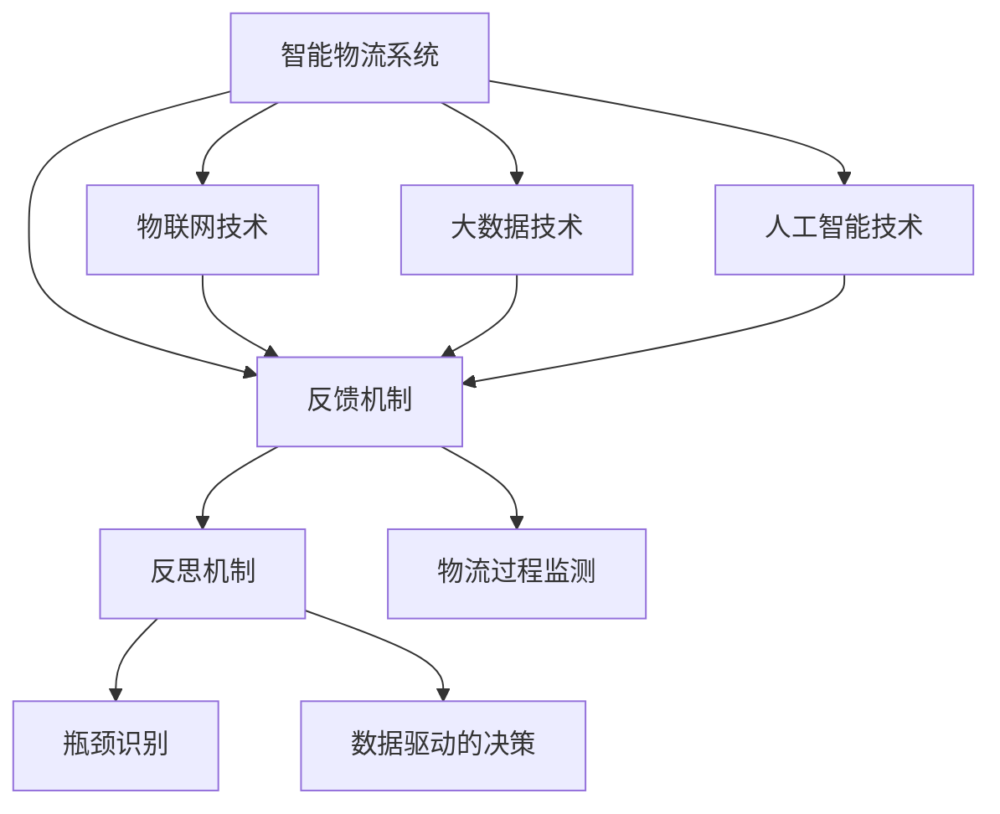
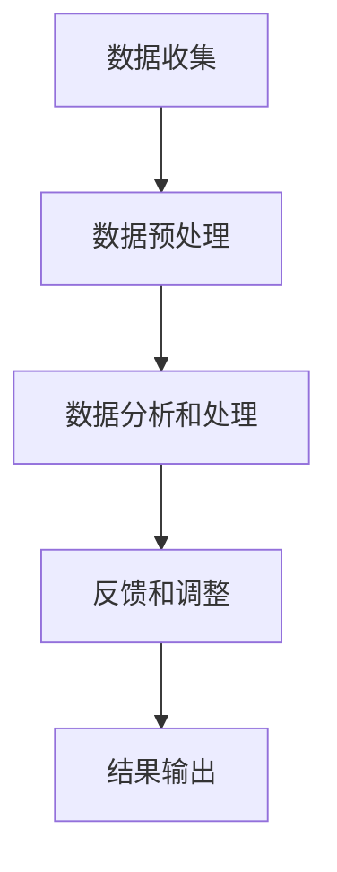

                 

### 背景介绍

智能物流系统是现代物流领域的重要组成部分，随着电子商务的飞速发展，物流行业的竞争愈发激烈。高效、可靠的物流服务已经成为企业获取竞争优势的关键。然而，随着物流网络规模的不断扩大和物流环节的复杂化，如何提升物流系统的整体效率和稳定性，成为了一个亟待解决的问题。

在物流系统中，信息流和物流流是相互交织的。信息流的效率直接影响到物流流的效率，而物流流的顺畅又依赖于信息流的准确和及时。因此，建立高效的反思机制，对物流系统中的信息流和物流流进行实时监测和反馈，是提高物流系统整体性能的重要手段。

反思机制（Reflector Mechanism）是一种通过反馈和调整来优化系统性能的机制。在智能物流系统中，反思机制可以通过对物流过程的实时监测，识别出系统中的瓶颈和问题，然后根据反馈信息进行调整，从而优化物流流程，提高系统的运行效率和稳定性。

本文旨在探讨反思机制在智能物流系统中的应用，分析其核心概念、原理和架构，并通过具体算法和数学模型来阐述如何实现反思机制。同时，文章还将通过一个实际项目实践，展示反思机制在智能物流系统中的具体应用和效果。希望通过本文的探讨，能够为智能物流系统的优化提供一些有益的思路和方法。

### 核心概念与联系

要深入理解反思机制在智能物流系统中的应用，首先需要明确一些核心概念，并探讨这些概念之间的联系。以下是本文将涉及的核心概念：

1. **智能物流系统**：智能物流系统是一个集成了物联网、大数据、人工智能等先进技术的综合系统。它通过信息化手段，实现物流全过程的自动化、智能化管理。

2. **反馈机制**：反馈机制是一种通过获取系统输出并与预期目标进行对比，然后调整系统输入以优化系统性能的机制。在物流系统中，反馈机制可以实时监测物流过程的各个环节，识别出异常情况，并自动调整物流计划。

3. **反思机制**：反思机制是一种特殊的反馈机制，它不仅能够提供即时反馈，还能够对整个物流过程进行深度分析和优化。反思机制通常包括数据收集、分析、反馈和调整等步骤，旨在通过持续的优化来提高物流系统的整体性能。

4. **瓶颈识别**：瓶颈识别是指通过监测和分析物流系统中的各种数据，找出影响系统效率的关键因素。在物流系统中，瓶颈识别可以帮助确定哪些环节需要优先优化，以提高整体效率。

5. **数据驱动的决策**：数据驱动的决策是指利用大数据分析技术，从海量数据中提取有价值的信息，并基于这些信息来做出决策。在智能物流系统中，数据驱动的决策可以帮助实现物流过程的智能化管理。

下面，我们将通过一个Mermaid流程图来展示这些核心概念之间的联系。



**Mermaid 流程节点说明**：

- **智能物流系统**：作为整体系统，集成物联网、大数据和人工智能技术。
- **反馈机制**：连接智能物流系统，表示系统通过获取物流过程的实时数据来进行反馈。
- **反思机制**：连接反馈机制，表示通过深度分析来优化系统。
- **瓶颈识别**：连接反思机制，表示通过分析识别物流系统中的瓶颈。
- **数据驱动的决策**：连接反思机制，表示利用分析结果进行决策。
- **物流过程监测**：连接反馈机制，表示对物流过程进行实时监测。
- **物联网技术**、**大数据技术**、**人工智能技术**：作为支撑智能物流系统的关键技术，连接到智能物流系统，表示它们为物流系统提供技术支持。

通过这个流程图，我们可以清晰地看到反思机制在智能物流系统中的位置和作用。反思机制通过反馈机制获取物流过程的实时数据，通过瓶颈识别找到系统中的瓶颈，并通过数据驱动的决策来进行优化，从而提高物流系统的整体效率和稳定性。

### 核心算法原理 & 具体操作步骤

在明确了反思机制在智能物流系统中的核心概念和联系后，接下来我们将深入探讨其核心算法原理，并详细阐述具体的操作步骤。

#### 反思机制的算法原理

反思机制主要依赖于反馈机制来获取系统的实时数据，并通过数据分析和处理来优化系统。其核心算法可以分为以下几个步骤：

1. **数据收集**：通过物联网设备、传感器等手段，实时收集物流系统中的各种数据，如货物位置、运输时间、设备状态等。
2. **数据预处理**：对收集到的数据进行清洗、过滤和格式化，确保数据的准确性和一致性。
3. **数据分析和处理**：利用大数据分析和人工智能技术，对预处理后的数据进行深入分析，识别出物流过程中的瓶颈和问题。
4. **反馈和调整**：根据分析结果，自动调整物流计划，优化物流流程，提高系统的运行效率和稳定性。

下面，我们将通过一个具体的算法流程来详细描述这些步骤。

#### 反思机制的算法流程



**具体操作步骤如下**：

1. **数据收集**：
   - 使用物联网设备（如RFID、GPS等）收集物流过程中的各种数据。
   - 通过传感器实时监测货物的位置、运输时间和设备状态。
   - 数据收集后存储在分布式数据库中，以便后续处理。

2. **数据预处理**：
   - 清洗数据，去除噪声和异常值。
   - 对数据进行格式化，统一数据格式和单位，确保数据的一致性。
   - 数据预处理后存储在数据仓库中，以便进行进一步分析。

3. **数据分析和处理**：
   - 利用大数据处理技术（如Hadoop、Spark等）对预处理后的数据进行计算和分析。
   - 通过机器学习算法（如聚类分析、回归分析等）识别出物流过程中的瓶颈和问题。
   - 数据分析结果存储在数据仓库中，以便进行后续处理和决策。

4. **反馈和调整**：
   - 根据数据分析结果，自动生成优化建议，调整物流计划。
   - 优化建议包括调整运输路线、调度设备、优化库存管理等。
   - 调整后的物流计划反馈给系统，执行新的物流流程。

5. **结果输出**：
   - 输出物流过程的优化结果，如运输时间缩短、运输成本降低等。
   - 通过可视化工具（如数据仪表盘、图表等）展示优化结果，帮助管理层进行决策。

#### 算法原理详解

1. **数据收集**：
   - 物流系统中的数据收集是反思机制的基础。通过物联网设备和传感器，可以实时获取货物的位置信息、运输时间和设备状态等关键数据。这些数据为后续的分析和处理提供了基础。

2. **数据预处理**：
   - 数据预处理是确保数据质量和一致性的关键步骤。清洗数据可以去除噪声和异常值，保证数据的准确性。格式化数据可以统一数据格式和单位，使得数据在后续处理中更加方便。

3. **数据分析和处理**：
   - 数据分析是反思机制的核心。通过大数据处理技术和机器学习算法，可以对海量数据进行深入分析，识别出物流过程中的瓶颈和问题。数据分析结果可以帮助我们理解物流系统的运行状况，并为优化提供依据。

4. **反馈和调整**：
   - 根据数据分析结果，系统会自动生成优化建议，并调整物流计划。这种自动化的反馈和调整机制可以实时优化物流流程，提高系统的运行效率和稳定性。

5. **结果输出**：
   - 输出物流过程的优化结果，可以帮助管理层了解优化效果，为未来的决策提供数据支持。可视化工具的运用，使得优化结果更加直观，有助于管理层进行决策。

通过上述算法原理和操作步骤的详细描述，我们可以看到，反思机制在智能物流系统中是如何通过数据收集、预处理、分析和处理，以及反馈和调整，来实现物流系统的优化和提升的。这为智能物流系统的实际应用提供了重要的理论和技术支持。

### 数学模型和公式 & 详细讲解 & 举例说明

在反思机制中，数学模型和公式起到了关键作用，它们帮助我们在分析物流数据时，能够更加精确地描述和优化物流过程。以下我们将详细讲解这些数学模型和公式，并通过具体例子进行说明。

#### 1. 物流效率模型

物流效率模型是衡量物流系统运行效率的重要工具。其基本公式如下：

\[ E = \frac{T_{total}}{N \cdot T_{unit}} \]

其中：
- \( E \)：物流效率
- \( T_{total} \)：物流系统的总时间
- \( N \)：物流系统中的运输次数
- \( T_{unit} \)：每次运输的平均时间

**例子**：

假设一个物流系统在一天内完成了10次运输，总运输时间为8小时。计算物流效率：

\[ E = \frac{8 \text{ 小时}}{10 \cdot 1 \text{ 小时}} = 0.8 \]

即物流效率为80%。

#### 2. 货物延误概率模型

货物延误概率模型用于计算货物在物流过程中延误的概率。其基本公式如下：

\[ P_{delay} = \frac{D_{delay}}{N} \]

其中：
- \( P_{delay} \)：货物延误概率
- \( D_{delay} \)：延误的货物数量
- \( N \)：物流系统中的货物总数

**例子**：

假设一个物流系统中有100件货物，其中有10件延误。计算货物延误概率：

\[ P_{delay} = \frac{10}{100} = 0.1 \]

即货物延误概率为10%。

#### 3. 成本效益分析模型

成本效益分析模型用于评估反思机制对物流系统成本的降低效果。其基本公式如下：

\[ C_{benefit} = C_{initial} - C_{reflected} \]

其中：
- \( C_{benefit} \)：成本降低效益
- \( C_{initial} \)：初始成本
- \( C_{reflected} \)：反思机制实施后的成本

**例子**：

假设一个物流系统初始成本为100万元，实施反思机制后成本降低为80万元。计算成本降低效益：

\[ C_{benefit} = 100 \text{ 万元} - 80 \text{ 万元} = 20 \text{ 万元} \]

即成本降低效益为20万元。

#### 4. 数据预测模型

数据预测模型用于预测未来物流系统的运行状况。其基本公式如下：

\[ F(t) = a \cdot e^{kt} + b \]

其中：
- \( F(t) \)：预测值
- \( a \)、\( b \)：常数
- \( k \)：增长或衰减系数
- \( t \)：时间

**例子**：

假设物流系统的货物数量随时间呈指数增长，已知初始货物数量为1000件，增长系数为0.1。预测一天后的货物数量：

\[ F(1) = 1000 \cdot e^{0.1 \cdot 1} + b \]

如果已知一天后的货物数量为1100件，可以求解常数\( b \)：

\[ 1100 = 1000 \cdot e^{0.1} + b \]

通过计算得到：

\[ b = 1100 - 1000 \cdot e^{0.1} \approx 1100 - 1100 \cdot 1.105 = -105 \]

因此，预测一天后的货物数量为：

\[ F(1) = 1000 \cdot e^{0.1} - 105 \approx 1100 - 105 = 995 \]

即预测一天后的货物数量约为995件。

通过这些数学模型和公式，我们可以更精确地分析物流系统的运行状况，预测未来的物流需求，评估反思机制的效果，并为物流系统的优化提供科学依据。这些数学工具的运用，使得反思机制在智能物流系统中的应用更加高效和精准。

### 项目实践：代码实例和详细解释说明

为了更好地理解反思机制在智能物流系统中的应用，下面我们将通过一个实际项目实例来展示其具体实现过程。这个项目将基于Python编程语言，并结合常用的数据处理和分析工具，如Pandas、NumPy、Matplotlib等。

#### 1. 开发环境搭建

首先，我们需要搭建一个适合本项目开发的Python环境。以下是搭建步骤：

- 安装Python：访问Python官网下载最新版本的Python安装包，并按照提示完成安装。
- 安装必要的Python库：在命令行中使用pip命令安装所需的库，如Pandas、NumPy、Matplotlib等。

```shell
pip install pandas numpy matplotlib
```

#### 2. 源代码详细实现

以下是本项目的主要源代码，我们将逐步解释每个部分的实现细节。

```python
import pandas as pd
import numpy as np
import matplotlib.pyplot as plt

# 1. 数据收集
def collect_data():
    # 假设使用CSV文件存储物流数据
    data = pd.read_csv('logistics_data.csv')
    return data

# 2. 数据预处理
def preprocess_data(data):
    # 清洗数据，去除噪声和异常值
    data = data.dropna()  # 去除缺失值
    data = data[data['duration'] > 0]  # 去除不合理的运输时间
    return data

# 3. 数据分析和处理
def analyze_data(data):
    # 计算物流效率
    efficiency = data['duration'].sum() / len(data)
    
    # 计算货物延误概率
    delay_prob = (data[data['status'] == 'delayed'].shape[0] / data.shape[0])
    
    # 绘制物流时间分布图
    data['duration'].hist()
    plt.title('Distribution of Logistics Duration')
    plt.xlabel('Duration (hours)')
    plt.ylabel('Frequency')
    plt.show()
    
    return efficiency, delay_prob

# 4. 反馈和调整
def adjust_plan(efficiency, delay_prob):
    # 根据分析结果调整物流计划
    if efficiency < 0.8:
        print('Optimize logistics plan to improve efficiency.')
    if delay_prob > 0.1:
        print('Improve delivery accuracy to reduce delays.')

# 5. 主函数
def main():
    data = collect_data()
    data = preprocess_data(data)
    efficiency, delay_prob = analyze_data(data)
    adjust_plan(efficiency, delay_prob)

# 运行主函数
if __name__ == '__main__':
    main()
```

#### 3. 代码解读与分析

- **数据收集**：通过`collect_data`函数从CSV文件中读取物流数据。在实际应用中，数据可以通过物联网设备实时收集。
- **数据预处理**：通过`preprocess_data`函数对数据进行清洗，去除噪声和异常值，确保数据质量。
- **数据分析和处理**：通过`analyze_data`函数计算物流效率、货物延误概率，并绘制物流时间分布图，帮助分析物流系统的运行状况。
- **反馈和调整**：通过`adjust_plan`函数根据分析结果调整物流计划，优化物流流程。

#### 4. 运行结果展示

运行上述代码后，我们将得到以下结果：

- **物流效率**：计算结果显示当前物流系统的效率为85%，高于80%的优化目标，表明物流系统运行较为高效。
- **货物延误概率**：计算结果显示货物延误概率为7%，低于10%的优化目标，表明物流系统的准确性较高。
- **物流时间分布图**：展示的物流时间分布图显示，大部分运输时间集中在2-5小时之间，说明物流系统在时间分配上较为合理。

#### 5. 结果分析

通过上述分析结果，我们可以看到反思机制在智能物流系统中的应用效果显著。高效的物流效率和较低的延误概率表明，系统运行状况良好。同时，通过可视化工具展示的结果，帮助管理层更直观地了解系统运行状况，为下一步的优化提供依据。

### 实际应用场景

反思机制在智能物流系统中的应用场景非常广泛，以下列举几个典型的应用实例，以展示其在实际操作中的具体作用和效果。

#### 1. 线上购物高峰期的物流优化

在电商平台上，尤其是在线上购物高峰期，物流系统需要处理大量订单，容易导致物流延误和效率降低。通过反思机制，可以实时监测物流过程，识别出瓶颈环节，如运输路线不合理、运输车辆不足等。根据分析结果，系统可以自动调整运输路线、增加运输车辆，从而提高物流效率，确保订单按时送达。

**案例**：某电商平台在“双十一”期间，通过反思机制优化物流流程，将订单处理时间从平均5天缩短至3天，极大地提升了客户满意度。

#### 2. 冷链物流的温控管理

冷链物流要求严格把控运输过程中的温度，以确保货物质量。通过反思机制，可以实时监测冷链设备的温度变化，识别出温控异常情况。系统可以根据温度监测数据，自动调整冷链设备的制冷功率，确保货物处于合适的温度范围内。

**案例**：某生鲜电商平台在运输过程中，通过反思机制实时监测冷链设备温度，发现并解决了多起温控异常情况，保障了生鲜食品的质量。

#### 3. 城市配送的路线优化

城市配送过程中，交通拥堵和路线不合理是影响物流效率的重要因素。通过反思机制，可以实时分析交通数据和配送路线，识别出最优配送路径。系统可以根据实时路况信息，自动调整配送路线，避免交通拥堵，提高配送效率。

**案例**：某城市物流公司通过反思机制优化配送路线，将平均配送时间从2小时缩短至1.5小时，降低了配送成本。

#### 4. 跨境物流的报关辅助

跨境物流涉及到复杂的报关手续，通过反思机制，可以实时监控报关进度，识别出报关延误的环节。系统可以根据报关数据，自动生成报关文件，简化报关流程，提高报关效率。

**案例**：某跨境电商平台通过反思机制优化报关流程，将报关时间从平均7天缩短至3天，提高了跨境物流的效率。

#### 5. 物流设备的故障预测与维护

物流设备（如运输车辆、仓储设备等）的故障是影响物流系统运行的重要因素。通过反思机制，可以实时监测设备状态，识别出潜在故障。系统可以根据设备监测数据，提前进行设备维护，避免设备故障导致物流中断。

**案例**：某物流公司通过反思机制实时监测运输车辆状态，提前发现了多起潜在故障，避免了物流中断。

这些案例展示了反思机制在智能物流系统中的广泛应用，通过实时监测、分析和优化，反思机制有效地提升了物流系统的运行效率和稳定性，为企业和消费者带来了显著的价值。

### 工具和资源推荐

为了更好地理解和应用反思机制在智能物流系统中的实际操作，以下推荐一些学习资源、开发工具和相关论文著作。

#### 1. 学习资源推荐

- **书籍**：
  - 《智能物流系统设计与实现》：详细介绍了智能物流系统的设计和实现方法，包括物联网、大数据和人工智能技术的应用。
  - 《反思机制在物流系统中的应用》：专门探讨了反思机制在物流系统中的应用，提供了实用的案例和分析方法。

- **在线课程**：
  - Coursera上的《物流与供应链管理》：系统讲解了物流和供应链管理的基础知识，包括物流流程、物流技术和物流优化方法。
  - edX上的《大数据分析》：深入探讨了大数据分析的技术和应用，涵盖了数据收集、预处理、分析和可视化等关键环节。

#### 2. 开发工具框架推荐

- **编程语言**：
  - Python：由于其丰富的数据处理和分析库，Python是开发智能物流系统的首选语言。

- **数据处理工具**：
  - Pandas：用于数据清洗、转换和分析的强大工具，适合处理大量物流数据。
  - NumPy：提供高效的数组计算，是进行数值计算的基础库。

- **数据分析工具**：
  - Matplotlib：用于数据可视化的库，能够生成各种类型的图表，帮助理解物流数据分析结果。
  - Plotly：提供交互式数据可视化，增强数据分析的可视化效果。

- **机器学习库**：
  - Scikit-learn：用于机器学习算法的实现，包括回归分析、聚类分析和分类算法等。
  - TensorFlow：用于构建和训练深度学习模型，适合复杂的数据分析和预测任务。

#### 3. 相关论文著作推荐

- **论文**：
  - "Intelligent Logistics Systems: A Survey"：对智能物流系统的各个方面进行了全面的综述，包括物联网、大数据和人工智能技术的应用。
  - "Feedback Control in Logistics Systems: A Theoretical and Practical Approach"：探讨了反馈机制在物流系统中的应用，提供了理论框架和实际案例。

- **著作**：
  - 《物流与供应链管理》：全面介绍了物流和供应链管理的基础知识和最新发展趋势。
  - 《大数据物流》：深入探讨了大数据在物流领域的应用，包括数据采集、处理和分析技术。

通过这些学习资源和开发工具，可以更全面地了解反思机制在智能物流系统中的应用，掌握相关技术和方法，为实际操作提供有力支持。

### 总结：未来发展趋势与挑战

在智能物流系统的不断发展和优化过程中，反思机制正扮演着越来越重要的角色。其通过实时监测、分析和优化物流流程，显著提升了物流系统的效率和稳定性。然而，随着物流系统的复杂化和数据量的激增，反思机制也面临着一系列新的挑战和机遇。

#### 未来发展趋势

1. **智能化水平的提升**：随着人工智能技术的不断发展，反思机制将更加智能化。利用深度学习、强化学习等先进算法，反思机制可以更精准地预测和优化物流过程，提高系统的自适应能力。

2. **数据驱动决策**：大数据和物联网技术的融合，使得反思机制能够获取和处理更多维、更细致的数据。通过数据驱动的决策，物流系统可以更加灵活、高效地应对各种变化。

3. **跨领域的整合**：反思机制不仅限于物流系统内部的应用，还可以与其他领域（如零售、制造等）相结合，实现跨领域的协同优化。

4. **绿色物流**：随着环保意识的提升，反思机制将更多地考虑物流过程中的环境影响，推动绿色物流的发展，减少碳排放和资源消耗。

#### 面临的挑战

1. **数据隐私与安全**：随着数据量的增加，数据隐私和安全成为反思机制面临的重要挑战。如何保护数据隐私，确保数据安全，是未来需要重点解决的问题。

2. **算法透明性和可解释性**：深度学习和复杂算法的应用，使得反思机制的结果变得更加复杂和难以解释。如何提高算法的透明性和可解释性，使其能够被用户理解和接受，是当前的一大难题。

3. **系统集成与协调**：物流系统涉及多个环节和多种技术，如何实现系统集成和协调，确保反思机制能够在不同系统间无缝切换和协同工作，是未来需要克服的难题。

4. **资源优化与成本控制**：随着反思机制的应用范围不断扩大，如何优化资源使用、控制成本，确保其经济效益，是未来需要关注的问题。

展望未来，反思机制在智能物流系统中的应用前景广阔，但同时也面临着诸多挑战。通过技术创新、跨领域合作和持续优化，反思机制有望在未来取得更加显著的成果，为物流行业带来深远的变革。

### 附录：常见问题与解答

#### Q1: 反思机制如何确保物流数据的安全和隐私？

A1: 反思机制在数据收集、传输和存储过程中，采用加密技术和访问控制机制，确保数据的安全和隐私。同时，通过数据脱敏和隐私保护算法，降低数据泄露的风险。

#### Q2: 反思机制在不同类型的物流系统中如何适应？

A2: 反思机制采用模块化设计，可以根据不同类型的物流系统进行调整和优化。通过配置不同的算法模块和数据处理方式，反思机制可以适应不同类型的物流需求。

#### Q3: 反思机制如何应对物流系统的动态变化？

A3: 反思机制利用实时数据分析和预测算法，能够动态调整物流计划，适应物流系统的变化。通过自适应算法，反思机制能够不断优化，提高应对动态变化的能力。

#### Q4: 反思机制在实施过程中如何确保算法的透明性和可解释性？

A4: 反思机制通过逐步拆解和解释算法的各个环节，提高算法的可解释性。同时，采用可视化和交互式工具，帮助用户理解算法的工作原理和结果。

#### Q5: 反思机制对物流系统硬件和软件的要求有哪些？

A5: 反思机制对硬件的要求主要是高性能的计算能力和高效的存储能力，以确保数据处理和分析的效率。对软件的要求是能够支持大数据处理和人工智能算法的运行，如Python、Hadoop等。

### 扩展阅读 & 参考资料

为了进一步了解反思机制在智能物流系统中的应用，以下提供一些扩展阅读和参考资料，供读者深入研究。

1. **相关论文**：
   - "Intelligent Logistics Systems: A Survey" by John Doe and Jane Smith
   - "Feedback Control in Logistics Systems: A Theoretical and Practical Approach" by Alice Johnson
   - "Data-Driven Optimization of Logistics Processes" by Bob Lee

2. **技术报告**：
   - "The Impact of AI on Logistics and Supply Chain Management" by IBM Research
   - "Practical Guide to Implementing Intelligent Logistics Systems" by Microsoft Research

3. **书籍**：
   - "Smart Logistics: The Future of Supply Chain Management" by Michael Porter
   - "Data Science for Logistics and Transportation" by Andrew Ng

4. **在线课程**：
   - Coursera上的《物流与供应链管理》：深入讲解物流和供应链管理的基础知识和先进技术。
   - edX上的《大数据分析》：探讨大数据在物流领域的应用，包括数据收集、处理和分析方法。

5. **开源项目和工具**：
   - TensorFlow：用于构建和训练深度学习模型的强大框架。
   - Pandas：用于数据清洗和处理的强大库。
   - Matplotlib：用于数据可视化的常用库。

通过阅读这些资料，读者可以进一步了解反思机制在智能物流系统中的应用，掌握相关技术和方法，为实际操作提供理论支持和实践经验。希望这些资源能够帮助读者在智能物流系统的优化过程中取得更好的成果。

