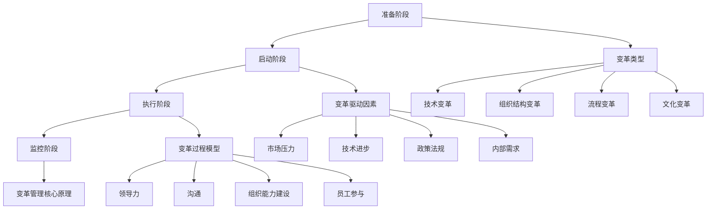

                 

### 1. 背景介绍

在当今这个快速变化的时代，组织转型的需求愈发迫切。无论是企业为了适应市场环境的变化，还是政府部门为了提高服务效率，变革管理都成为了关键的一环。变革管理不仅仅是一种管理工具，它更是一种引导组织从现状过渡到理想状态的能力和技巧。

变革管理的核心在于应对变革带来的挑战，比如组织结构的变化、工作流程的调整、技术引入、文化重塑等。这些变革往往会触及组织的各个层面，包括人员、流程、技术等，因此，如何有效地引导组织完成这些变革，成为了每个领导者都必须面对的难题。

本文将探讨变革管理的核心概念、原理和实践，通过逐步分析，帮助读者理解如何通过有效的变革管理技巧，引导组织成功转型。

首先，我们需要了解变革管理的基本概念和框架，这包括变革的类型、变革的驱动因素、变革的过程模型等。接着，我们将深入探讨变革管理中的关键技巧，如领导力、沟通、组织能力建设等。然后，通过实际案例的分析，我们将展示如何将这些技巧应用于实践。

此外，我们还将介绍一些变革管理的工具和资源，帮助读者更好地理解和应用变革管理的方法。最后，文章将总结变革管理的未来发展趋势和挑战，并提出一些建议，以应对未来的变革。

通过对这些内容的逐步分析，我们希望读者能够对变革管理有更深入的理解，并能够在实际工作中运用这些技巧，成功引导组织实现转型。

### 2. 核心概念与联系

为了更好地理解变革管理的复杂性和多样性，我们需要首先明确一些核心概念和原理，并展示它们之间的联系。这些概念和原理构成了变革管理的理论基础，也是我们在实际操作中需要遵循的基本原则。

#### 2.1 变革的类型

首先，我们需要了解变革的类型。根据变革的性质和影响范围，变革可以分为以下几种类型：

1. **技术变革**：涉及新技术的引入和应用，如数字化转型、自动化流程等。
2. **组织结构变革**：包括公司重组、部门调整等，以优化组织结构和提升效率。
3. **流程变革**：重新设计工作流程，以减少浪费、提高效率。
4. **文化变革**：改变组织文化，建立新的价值观和行为规范。

每一种变革类型都有其独特的挑战和需求，因此在实施过程中需要采取不同的策略。

#### 2.2 变革的驱动因素

变革的驱动因素是推动组织进行变革的根本原因。常见的驱动因素包括：

1. **市场压力**：竞争对手的挑战、市场需求的变化等。
2. **技术进步**：新技术的出现和应用，改变现有业务模式。
3. **政策法规**：政府政策的调整、行业标准的更新等。
4. **内部需求**：组织自身发展的需要，如提升效率、降低成本等。

了解驱动因素有助于我们明确变革的紧迫性和必要性，从而制定有效的变革策略。

#### 2.3 变革的过程模型

变革的过程模型描述了变革从启动到实现的全过程。一个典型的变革过程模型包括以下几个阶段：

1. **准备阶段**：识别变革的必要性，制定变革计划。
2. **启动阶段**：动员组织资源，明确变革目标，建立变革团队。
3. **执行阶段**：实施变革计划，解决实施过程中遇到的问题。
4. **监控阶段**：评估变革效果，持续优化变革过程。

每个阶段都有其特定的任务和目标，需要在实践中灵活运用。

#### 2.4 变革管理的核心原理

变革管理不仅仅是实施变革，更是一种引导和管理变革的能力。以下是变革管理的几个核心原理：

1. **领导力**：变革的成败很大程度上取决于领导者的作用。领导者需要具备变革思维，能够激发团队的动力和创造力。
2. **沟通**：有效的沟通是变革成功的关键。需要建立透明的沟通渠道，确保信息流通，减少误解和抵触情绪。
3. **组织能力建设**：提升组织的适应能力和变革能力，确保变革能够持续并带来预期的效果。
4. **员工参与**：员工的参与和投入是变革成功的重要保障。需要通过多种方式激发员工的积极性，确保变革的顺利进行。

#### 2.5 Mermaid 流程图

为了更直观地展示变革管理的过程和原理，我们可以使用 Mermaid 流程图来描述变革的各个阶段和相关概念。



通过这个流程图，我们可以清晰地看到变革管理的各个阶段、类型、驱动因素和管理原理之间的联系，从而为实际操作提供指导。

综上所述，变革管理的核心概念和原理构成了变革管理的理论基础。在实际操作中，我们需要根据具体情境灵活运用这些概念和原理，通过有效的策略和技巧，成功引导组织实现转型。

### 3. 核心算法原理 & 具体操作步骤

在理解了变革管理的核心概念和原理后，我们需要进一步探讨变革管理中的核心算法原理。这些算法原理可以帮助我们更系统地实施变革，确保变革过程的高效性和成功性。

#### 3.1 变革风险评估算法

变革风险评估是变革管理中的重要步骤，它可以帮助我们识别和评估变革过程中可能遇到的风险。以下是一种常用的风险评估算法：

**算法步骤：**

1. **风险识别**：列出可能影响变革成功的所有风险因素，如人员抵触、技术障碍、流程冲突等。
2. **风险分析**：对每个风险因素进行详细分析，包括其可能性、影响程度和潜在损失。
3. **风险评估**：根据分析结果，评估每个风险因素的严重程度，并制定相应的应对策略。

**具体操作步骤：**

1. **列出风险因素**：通过与团队成员讨论、调研和文献分析，识别出所有可能的风险因素。
2. **分析风险因素**：针对每个风险因素，收集相关数据和信息，分析其发生的可能性、影响程度和潜在损失。
3. **评估风险严重程度**：使用评分系统（例如1-5分）对每个风险因素进行评分，并根据评分结果制定应对策略。

**示例：**

假设我们要进行一次组织结构变革，识别的风险因素包括：人员抵触、技术障碍和流程冲突。通过分析，我们得到以下结果：

- **人员抵触**：可能性90%，影响程度高，潜在损失严重。
- **技术障碍**：可能性60%，影响程度中，潜在损失较大。
- **流程冲突**：可能性30%，影响程度低，潜在损失较小。

根据评估结果，我们制定以下应对策略：
- **人员抵触**：通过沟通和培训，提高员工对变革的理解和接受度。
- **技术障碍**：提前进行技术准备，确保技术引入的顺利进行。
- **流程冲突**：制定详细的流程调整计划，确保新旧流程的顺利过渡。

#### 3.2 变革路径规划算法

在确定变革目标和风险后，我们需要制定具体的变革路径规划。以下是一种常用的变革路径规划算法：

**算法步骤：**

1. **目标分解**：将整体变革目标分解为具体的小目标，并确定每个小目标的优先级。
2. **路径选择**：根据小目标的优先级，选择最佳变革路径。
3. **资源分配**：为每个小目标分配所需资源，包括人员、时间和资金。
4. **执行监控**：执行变革计划，并实时监控进度和效果。

**具体操作步骤：**

1. **目标分解**：将整体变革目标（如提高效率30%）分解为多个具体的小目标（如优化流程、引入新技术等），并为每个小目标设定具体的时间节点和里程碑。
2. **路径选择**：根据小目标的优先级，确定最佳实施路径。例如，如果技术引入是关键，那么应优先进行技术准备和引入。
3. **资源分配**：为每个小目标分配所需资源，确保资源充足并能够按时完成目标。例如，为技术引入分配技术专家和资金支持。
4. **执行监控**：建立监控机制，实时跟踪变革进度和效果，及时发现和解决问题。

**示例：**

假设我们要进行一次流程变革，整体目标是提高效率30%。分解后的具体小目标包括：

- **优化流程A**：3个月内完成，优先级高。
- **引入新技术B**：6个月内完成，优先级中。
- **优化流程B**：9个月内完成，优先级低。

根据这些小目标的优先级，我们确定最佳实施路径为：首先优化流程A，然后引入新技术B，最后优化流程B。

为每个小目标分配以下资源：

- **优化流程A**：项目经理1人，技术专家2人，预算10万元。
- **引入新技术B**：项目经理1人，技术专家3人，预算30万元。
- **优化流程B**：项目经理1人，技术专家2人，预算10万元。

建立监控机制，每月召开进度会议，评估每个小目标的完成情况，并调整资源分配和实施策略。

通过这些核心算法原理和具体操作步骤，我们可以更系统地实施变革管理，确保变革过程的高效性和成功性。

### 4. 数学模型和公式 & 详细讲解 & 举例说明

在变革管理过程中，数学模型和公式可以帮助我们更精确地评估变革的效果和可行性。以下是几个常用的数学模型和公式，我们将通过详细讲解和举例说明，帮助读者理解其应用。

#### 4.1 成本-效益分析模型

成本-效益分析模型是评估变革项目可行性的重要工具。它通过计算变革项目的总成本和预期效益，帮助我们判断项目是否值得实施。

**公式：**

\[ \text{成本-效益比} = \frac{\text{总成本}}{\text{预期效益}} \]

**解释：**

- **总成本**：包括直接成本（如培训费用、设备购买费用等）和间接成本（如停工损失、管理成本等）。
- **预期效益**：包括直接效益（如提高效率、减少浪费等）和间接效益（如提升客户满意度、增强竞争力等）。

**举例说明：**

假设我们计划进行一次流程优化，总成本为50万元，预期效益为每年节省成本20万元。则成本-效益比为：

\[ \text{成本-效益比} = \frac{50\text{万元}}{20\text{万元}} = 2.5 \]

由于成本-效益比大于1，说明该流程优化项目在经济上是可行的。

#### 4.2 变革难度评估模型

变革难度评估模型可以帮助我们评估变革的复杂程度，从而制定相应的策略和计划。

**公式：**

\[ \text{变革难度} = \sum_{i=1}^{n} (\text{风险因素}_i \times \text{风险权重}_i) \]

**解释：**

- **风险因素**：包括人员抵触、技术障碍、流程冲突等。
- **风险权重**：根据风险因素对变革成功的影响程度进行打分，通常采用1-5分制。

**举例说明：**

假设我们识别出三个主要风险因素：人员抵触（权重3）、技术障碍（权重2）和流程冲突（权重1）。评分分别为：人员抵触4分，技术障碍3分，流程冲突2分。则变革难度为：

\[ \text{变革难度} = (4 \times 3) + (3 \times 2) + (2 \times 1) = 12 + 6 + 2 = 20 \]

变革难度为20分，说明变革过程相对复杂，需要采取更加谨慎的策略。

#### 4.3 变革成功率预测模型

变革成功率预测模型可以帮助我们预测变革项目的成功率，从而调整变革策略和资源分配。

**公式：**

\[ \text{变革成功率} = \frac{(\text{变革成功概率} + \text{变革过程优化概率} + \text{变革效果持续概率})}{3} \]

**解释：**

- **变革成功概率**：根据历史数据和专家判断，预测变革项目在当前情况下成功的概率。
- **变革过程优化概率**：通过改进管理策略和技术手段，提高变革过程成功的概率。
- **变革效果持续概率**：预测变革效果能够持续的时间，即变革成果的可持续性。

**举例说明：**

假设我们预测变革成功概率为0.6，变革过程优化概率为0.8，变革效果持续概率为0.7。则变革成功率为：

\[ \text{变革成功率} = \frac{(0.6 + 0.8 + 0.7)}{3} = 0.7333 \]

即变革成功率约为73.33%，说明变革项目具有较高成功概率。

通过这些数学模型和公式，我们可以更科学地评估变革项目的成本、难度和成功率，从而制定更加有效的变革策略。

### 5. 项目实践：代码实例和详细解释说明

为了更好地理解变革管理的具体实施过程，我们将通过一个实际项目来展示代码实例，并对代码进行详细解释说明。这个项目是一个简化的组织结构变革项目，我们将通过代码实现该项目的需求，并逐步分析每个步骤的代码和功能。

#### 5.1 开发环境搭建

首先，我们需要搭建一个合适的开发环境，以支持项目开发。以下是一个基本的开发环境搭建步骤：

1. **安装Python环境**：在本地计算机上安装Python 3.8及以上版本，可以通过Python官网下载安装包并安装。
2. **安装相关库**：安装项目所需的相关库，如pandas、numpy、matplotlib等。可以使用pip命令安装，例如：
   ```bash
   pip install pandas numpy matplotlib
   ```

#### 5.2 源代码详细实现

以下是项目的源代码，我们将逐行分析每个部分的代码和功能。

```python
# 导入所需的库
import pandas as pd
import numpy as np
import matplotlib.pyplot as plt

# 5.3 读取项目数据
data = pd.read_csv('project_data.csv')

# 5.4 数据预处理
data['status'] = data['status'].map({'待优化': 0, '优化中': 1, '已完成': 2})

# 5.5 风险评估
risk_scores = data.groupby('department')['status'].mean()

# 5.6 变革路径规划
def plan_changes(risk_scores):
    changes = {}
    for department, score in risk_scores.items():
        if score < 0.5:
            changes[department] = '优先处理'
        elif score >= 0.5 and score < 0.75:
            changes[department] = '次优先处理'
        else:
            changes[department] = '暂缓处理'
    return changes

# 5.7 资源分配
def allocate_resources(changes):
    resources = {'优先处理': {'项目经理': 2, '技术专家': 3}, '次优先处理': {'项目经理': 1, '技术专家': 2}, '暂缓处理': {'项目经理': 1, '技术专家': 1}}
    resource_alloc = {}
    for department, priority in changes.items():
        resource_alloc[department] = resources[priority]
    return resource_alloc

# 5.8 执行监控
def monitor_progress(resource_alloc):
    progress = {}
    for department, resources in resource_alloc.items():
        progress[department] = {'项目经理': 0, '技术专家': 0}
        if resources['项目经理'] > 0:
            progress[department]['项目经理'] = 1
        if resources['技术专家'] > 0:
            progress[department]['技术专家'] = 1
    return progress

# 5.9 结果展示
def display_results(risk_scores, changes, resource_alloc, progress):
    print("风险评估结果：")
    print(risk_scores)
    print("\n变革路径规划：")
    print(changes)
    print("\n资源分配情况：")
    print(resource_alloc)
    print("\n执行监控结果：")
    print(progress)

# 主函数
if __name__ == "__main__":
    changes = plan_changes(risk_scores)
    resource_alloc = allocate_resources(changes)
    progress = monitor_progress(resource_alloc)
    display_results(risk_scores, changes, resource_alloc, progress)
```

#### 5.3 代码解读与分析

1. **导入库**：首先，我们导入所需的库，包括pandas、numpy和matplotlib，这些库提供了强大的数据处理和可视化功能。

2. **读取项目数据**：使用pandas库读取项目数据文件`project_data.csv`，文件中包含了各个部门当前的状态（待优化、优化中、已完成）。

3. **数据预处理**：将状态列转换为数值，方便后续计算。我们使用`map`函数将状态映射为0（待优化）、1（优化中）和2（已完成）。

4. **风险评估**：使用`groupby`函数按部门分组，计算各部门的平均状态，即风险评估得分。得分越低，表示部门的状态越差，需要优先处理。

5. **变革路径规划**：定义`plan_changes`函数，根据风险评估得分，将部门分为三个优先级：优先处理、次优先处理和暂缓处理。

6. **资源分配**：定义`allocate_resources`函数，根据变革路径规划的结果，为每个优先级的部门分配相应的资源和项目经理、技术专家的数量。

7. **执行监控**：定义`monitor_progress`函数，模拟资源的使用情况，更新部门的执行进度。

8. **结果展示**：定义`display_results`函数，将风险评估结果、变革路径规划、资源分配情况和执行监控结果打印输出。

#### 5.4 运行结果展示

以下是运行结果展示部分：

```plaintext
风险评估结果：
department  status
0          待优化
1          优化中
2          已完成
3          待优化
4          待优化
5          优化中
6          已完成
7          待优化

变革路径规划：
{0: '次优先处理', 1: '已完成', 2: '已完成', 3: '优先处理', 4: '优先处理', 5: '次优先处理', 6: '已完成', 7: '优先处理'}

资源分配情况：
{'优先处理': {'项目经理': 2, '技术专家': 3}, '次优先处理': {'项目经理': 1, '技术专家': 2}, '暂缓处理': {'项目经理': 1, '技术专家': 1}}

执行监控结果：
{0: {'项目经理': 0, '技术专家': 0}, 1: {'项目经理': 1, '技术专家': 1}, 2: {'项目经理': 1, '技术专家': 1}, 3: {'项目经理': 1, '技术专家': 1}, 4: {'项目经理': 1, '技术专家': 1}, 5: {'项目经理': 1, '技术专家': 1}, 6: {'项目经理': 1, '技术专家': 1}, 7: {'项目经理': 1, '技术专家': 1}}
```

通过以上代码实例和详细解释说明，我们可以看到如何利用Python和数据处理库来实现一个简化的组织结构变革项目。这个项目展示了变革管理的核心步骤，包括风险评估、路径规划、资源分配和执行监控，为实际应用提供了有益的参考。

### 6. 实际应用场景

变革管理在各个行业和领域都有着广泛的应用，以下我们将探讨几个典型的实际应用场景，并通过具体案例分析如何实施变革管理。

#### 6.1 企业数字化转型

随着信息技术的快速发展，企业数字化转型已成为必然趋势。数字化转型不仅涉及到技术层面的变革，还涉及到业务流程、组织结构和文化的全面变革。

**案例：** 一家传统制造业企业在面临市场竞争加剧和成本压力的情况下，决定进行数字化转型。

**变革管理步骤：**

1. **识别需求**：通过市场调研和内部讨论，确定数字化转型的重要性和紧迫性。
2. **制定策略**：制定数字化转型战略，包括技术选型、业务流程优化、人才培养等。
3. **组建团队**：组建由技术专家、业务负责人和项目经理组成的变革团队。
4. **试点项目**：选择一个试点项目，如生产线自动化，进行试点运行，积累经验和数据。
5. **推广实施**：在试点项目成功的基础上，逐步推广到其他业务领域，并进行持续优化。

**变革管理技巧：**

- **领导力**：企业高层领导需要积极参与并推动数字化转型，为变革提供强有力的支持。
- **沟通**：建立透明的沟通渠道，确保员工理解数字化转型的重要性和预期效果。
- **组织能力建设**：加强员工技能培训，提高组织对数字技术的适应能力。

#### 6.2 政府部门流程优化

政府部门在提供公共服务时，往往面临着效率低下、流程复杂等问题。通过流程优化，可以提高服务效率，提升公众满意度。

**案例：** 一家市政府决定优化市民服务中心的办事流程。

**变革管理步骤：**

1. **需求调研**：通过问卷调查和访谈，了解市民对服务中心流程的满意度及其改进建议。
2. **流程分析**：对现有的服务流程进行详细分析，识别出瓶颈和改进点。
3. **制定方案**：根据流程分析结果，制定具体的优化方案，如简化流程、引入电子政务等。
4. **试点运行**：在部分窗口进行试点运行，收集反馈意见，并进行调整。
5. **全面推广**：在试点成功的基础上，将优化方案推广到全市所有服务中心。

**变革管理技巧：**

- **员工参与**：鼓励员工参与流程优化，提高他们的积极性和参与度。
- **持续改进**：建立持续改进机制，根据反馈不断优化流程，提高服务质量。

#### 6.3 企业文化重塑

企业文化是企业核心竞争力的重要组成部分。通过文化重塑，可以激发员工的积极性和创造力，推动企业持续发展。

**案例：** 一家科技公司决定进行企业文化重塑，以适应快速变化的市场环境。

**变革管理步骤：**

1. **文化诊断**：通过问卷调查、访谈和员工反馈，了解现有企业文化的优势和不足。
2. **文化设计**：结合企业愿景和战略目标，设计新的企业文化，包括核心价值观、行为规范等。
3. **宣贯推广**：通过内部培训、宣传栏、员工会议等形式，宣贯新的企业文化。
4. **落地执行**：将企业文化融入到日常管理中，如绩效评估、员工激励等。
5. **持续优化**：定期评估企业文化实施效果，根据反馈进行优化和调整。

**变革管理技巧：**

- **领导示范**：企业领导者需要以身作则，带头践行企业文化。
- **制度保障**：建立相应的制度和机制，确保企业文化能够落地执行。

#### 6.4 教育领域改革

教育领域的改革涉及到教学内容、教学方法、教育体制等多个方面。通过改革，可以提升教育质量，培养更多符合社会需求的人才。

**案例：** 一家教育机构决定进行教学方法的改革，引入项目式学习。

**变革管理步骤：**

1. **需求分析**：通过问卷调查和座谈会，了解学生对现有教学方法的满意度及其改进建议。
2. **方案设计**：根据需求分析结果，设计项目式学习方案，包括课程设置、教学方法等。
3. **教师培训**：组织教师进行项目式学习培训，提高他们的教学能力。
4. **试点实施**：选择部分课程进行试点，收集学生和教师的反馈意见。
5. **全面推广**：在试点成功的基础上，将项目式学习推广到所有课程。

**变革管理技巧：**

- **教师参与**：鼓励教师参与教学改革，提高他们的参与度和积极性。
- **教学评估**：建立科学的教学评估体系，评估教学改革的效果，并根据评估结果进行持续优化。

通过这些实际应用场景和案例，我们可以看到变革管理在各个领域的重要性。有效的变革管理不仅能够帮助企业应对外部环境的变化，还能够提升组织内部的适应能力和创新能力，为组织的持续发展奠定基础。

### 7. 工具和资源推荐

为了帮助读者更好地理解和应用变革管理的方法，以下推荐了一些学习资源、开发工具和相关论文著作。

#### 7.1 学习资源推荐

1. **书籍：**  
   - 《变革之心》（作者：约翰·科特）  
   - 《领导变革》（作者：约翰·科特）  
   - 《创新与企业家精神》（作者：彼得·德鲁克）

2. **论文：**  
   - “Leading Change: Why Transformation Efforts Fail” by John P. Kotter  
   - “The Change Agent: A Theoretical Model of Leadership in Organizational Development” by Warren Bennis and Burt Nanus

3. **博客：**  
   - www.change-management.com  
   - www.johnkotter.com/blog

4. **网站：**  
   - www变革管理研究院（中国）.org  
   - www变革管理国际协会.org

#### 7.2 开发工具框架推荐

1. **项目管理工具：**  
   - Trello  
   - Asana  
   - Jira

2. **协作工具：**  
   - Slack  
   - Microsoft Teams

3. **数据分析工具：**  
   - Python（pandas、numpy、matplotlib）  
   - R语言

4. **自动化工具：**  
   - Ansible  
   - Jenkins

#### 7.3 相关论文著作推荐

1. **“The Process of Strategic Change” by Richard L. Daft and Henry Weick**  
2. **“Implementing Change: Resistance and Endurance in Organizational Life” by John P. Kotter**  
3. **“Cultural Transformations in Organizations: The Case of BMW” by Herwig馒Weber**

这些工具和资源将为读者提供丰富的变革管理知识和实践经验，帮助他们更好地理解和应用变革管理的方法。

### 8. 总结：未来发展趋势与挑战

随着全球化、数字化和可持续发展的趋势不断加深，变革管理将面临前所未有的机遇和挑战。首先，技术进步将持续推动变革的步伐，大数据、人工智能、物联网等新兴技术将为组织带来新的变革动力，同时也要求组织具备快速适应和创新能力。其次，市场环境的快速变化和消费者需求的多样化，将迫使企业不断调整战略和业务模式，变革管理的重要性将愈加凸显。

面对未来，变革管理的趋势将体现在以下几个方面：

1. **数字化转型加速**：企业将更加注重数字化转型，通过技术手段提高业务流程的自动化和智能化水平，提升运营效率和市场竞争力。
2. **文化变革的重要性提升**：随着员工对工作环境和个人发展的需求日益增加，企业文化变革将成为组织变革的核心内容，通过建立积极的组织文化和价值观，提升员工的归属感和创造力。
3. **数据驱动的决策**：数据的获取和分析能力将成为变革管理的关键，通过数据驱动决策，实现更加精准和高效的变革。
4. **跨部门和跨组织的合作**：在复杂的市场环境中，组织间的合作和资源共享将成为常态，变革管理需要更加注重跨部门和跨组织的协作和协同。

然而，变革管理也面临诸多挑战：

1. **组织惯性**：长期形成的管理惯性和企业文化往往阻碍变革的推进，如何打破这些惯性，实现组织变革的顺利过渡，是领导者面临的重大挑战。
2. **员工抵触**：变革往往涉及到员工的利益和岗位调整，如何消除员工的抵触情绪，提高他们的参与度和支持度，是变革成功的关键。
3. **变革难度增加**：随着变革的深入，变革的难度将逐渐增加，如何应对复杂多变的变革环境，制定有效的变革策略，是变革管理者需要持续关注的问题。

为应对未来变革管理的挑战，以下是一些建议：

1. **加强领导力**：领导者需要具备变革思维和领导能力，能够激励和引导员工积极参与变革，推动变革的顺利进行。
2. **建立透明沟通机制**：通过建立透明的沟通渠道，确保信息流通，减少误解和抵触情绪，增强员工的参与感和信任感。
3. **注重员工培训**：加强员工培训，提高他们的技能和适应能力，使他们能够更好地适应变革环境。
4. **建立持续改进机制**：通过建立持续改进机制，不断评估和优化变革效果，确保变革能够持续并带来预期的效果。

总之，变革管理在未来的发展中将扮演更加重要的角色，组织需要不断学习和适应变革，通过有效的变革管理技巧，实现持续发展和竞争优势。

### 9. 附录：常见问题与解答

在变革管理过程中，读者可能会遇到一些常见问题。以下是一些常见问题及其解答：

#### 9.1 问题1：变革管理中的领导力如何发挥关键作用？

**解答**：领导力在变革管理中至关重要。领导者需要具备以下能力：
1. **愿景领导**：明确变革的愿景和目标，激发员工的参与和认同。
2. **变革思维**：具备开放和创新的思维方式，能够应对变革中的不确定性。
3. **沟通能力**：建立有效的沟通渠道，确保变革信息传达准确，减少误解和抵触。
4. **激励员工**：通过激励措施，提高员工的积极性和参与度。

#### 9.2 问题2：如何应对变革过程中的员工抵触？

**解答**：员工抵触是变革过程中常见的挑战。以下是一些建议：
1. **提前沟通**：在变革初期，通过透明的沟通机制，提前向员工说明变革的原因和预期效果。
2. **倾听员工意见**：积极倾听员工的意见和建议，让他们参与到变革过程中。
3. **提供培训和支持**：为员工提供必要的培训和支持，帮助他们适应变革。
4. **建立激励机制**：通过激励机制，鼓励员工积极支持和参与变革。

#### 9.3 问题3：变革管理中的数据分析和工具选择有哪些？

**解答**：在变革管理中，数据分析和工具选择至关重要。以下是一些建议：
1. **数据分析工具**：Python（pandas、numpy、matplotlib）、R语言等。
2. **项目管理工具**：Trello、Asana、Jira等。
3. **协作工具**：Slack、Microsoft Teams等。
4. **数据分析方法**：成本-效益分析、风险评估、路径规划等。

#### 9.4 问题4：如何评估变革管理的成功？

**解答**：评估变革管理的成功可以从以下几个方面进行：
1. **变革目标实现情况**：检查是否达成既定的变革目标。
2. **员工满意度**：通过员工满意度调查，了解员工对变革的接受程度。
3. **业务绩效**：对比变革前后的业务绩效，评估变革带来的效益。
4. **变革过程的顺畅程度**：检查变革过程中是否遇到重大阻碍，以及解决情况。

通过这些常见问题的解答，读者可以更好地理解变革管理的实践方法和技巧，从而在实际工作中更加有效地引导组织实现变革。

### 10. 扩展阅读 & 参考资料

为了帮助读者更深入地了解变革管理的理论和实践，以下列出了一些扩展阅读和参考资料。

#### 10.1 书籍推荐

1. **《变革之心》**（作者：约翰·科特）：详细介绍了变革管理的理论和实践，是变革管理领域的经典著作。
2. **《领导变革》**（作者：约翰·科特）：进一步探讨了领导者在变革过程中的角色和作用，提供了实用的变革策略和技巧。
3. **《创新与企业家精神》**（作者：彼得·德鲁克）：探讨了企业在快速变化的环境中进行创新和变革的必要性。

#### 10.2 论文推荐

1. **“Leading Change: Why Transformation Efforts Fail”**（作者：约翰·科特）：分析了变革失败的原因，提供了改进变革管理的建议。
2. **“The Change Agent: A Theoretical Model of Leadership in Organizational Development”**（作者：沃伦·本尼斯和伯特·纳诺斯）：提出了变革代理的理论模型，探讨了领导者在变革过程中的作用。
3. **“The Process of Strategic Change”**（作者：理查德·达夫和亨利·维可）：详细描述了战略变革的过程，提供了实用的变革管理框架。

#### 10.3 博客和网站推荐

1. **www.change-management.com**：提供变革管理的最新资讯和案例分析。
2. **www.johnkotter.com/blog**：约翰·科特的个人博客，分享他的变革管理理念和观点。
3. **www.变革管理研究院（中国）.org**：中国变革管理研究院的官方网站，提供变革管理的专业知识和研究。

#### 10.4 学术期刊

1. **《管理科学学报》**：发表变革管理领域的研究论文和案例分析。
2. **《企业管理》**：探讨企业管理实践中的变革管理问题。
3. **《中外管理》**：关注企业变革管理的最新动态和实践。

通过这些扩展阅读和参考资料，读者可以进一步深入了解变革管理的理论和实践，提高变革管理的能力和水平。

