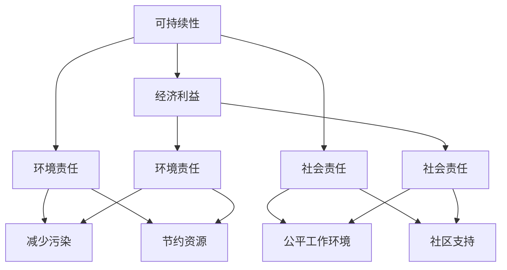

                 

### 背景介绍 ###

在当今全球化的背景下，可持续发展管理已经成为企业和组织面临的一个重要议题。随着资源消耗和环境破坏的问题日益严重，社会各界对于企业如何在其经营活动中实现长期环境和社会责任的期望也越来越高。可持续发展的概念最早由布伦特兰委员会在1987年的《我们共同的未来》报告中提出，它强调满足当前需求不应损害子孙后代满足自身需求的能力。这一理念逐渐融入到企业战略、管理实践和决策过程中。

然而，实现可持续发展并非易事。企业需要在经济增长、资源节约、环境保护和社会责任之间寻求平衡。这不仅涉及到技术层面的创新，还涉及到文化、制度、政策等多方面的变革。此外，企业在实现可持续发展的过程中，往往需要面对复杂的市场环境、政策法规和利益相关者的期望。因此，如何有效地进行可持续发展管理，已经成为企业竞争力和可持续发展能力的重要体现。

本文将深入探讨可持续发展管理的核心概念、关键技术和实际应用，以帮助企业和组织更好地理解和实践可持续发展。我们将从以下几个方面进行探讨：

1. **核心概念与联系**：首先，我们将介绍可持续发展管理的核心概念，如可持续性、环境责任、社会责任等，并运用Mermaid流程图展示这些概念之间的内在联系。
2. **核心算法原理 & 具体操作步骤**：接下来，我们将探讨实现可持续发展管理的一些核心算法原理，并详细阐述其操作步骤。
3. **数学模型和公式 & 详细讲解 & 举例说明**：我们将运用数学模型和公式来阐述可持续发展管理的理论基础，并通过实际案例进行说明。
4. **项目实践：代码实例和详细解释说明**：为了使理论更加具体，我们将通过一个实际的项目案例，展示如何运用技术手段实现可持续发展管理。
5. **实际应用场景**：我们将分析可持续发展管理在不同行业中的应用案例，探讨其面临的挑战和机遇。
6. **工具和资源推荐**：为了帮助读者更好地进行可持续发展管理，我们将推荐一些相关的学习资源、开发工具和论文著作。
7. **总结：未来发展趋势与挑战**：最后，我们将对可持续发展管理的未来发展趋势和面临的挑战进行展望。

通过本文的深入探讨，我们希望读者能够对可持续发展管理有更全面、深入的理解，从而在实际工作中更好地实践这一理念。让我们一步一步地分析推理，共同探索这一领域的奥秘。

#### 核心概念与联系 ####

要深入理解可持续发展管理，我们首先需要明确其中的核心概念，并探讨它们之间的联系。以下是可持续发展管理中一些关键的概念及其相互关系。

1. **可持续性 (Sustainability)**

可持续性是可持续发展管理的基石。它强调在满足当前需求的同时，不损害未来世代满足自身需求的能力。可持续性涵盖了经济、社会和环境三个维度，即所谓的“三重底线的平衡”。在可持续发展管理中，可持续性要求企业在追求经济效益的同时，必须关注环境和社会的可持续性。

2. **环境责任 (Environmental Responsibility)**

环境责任是指企业在经营活动中对环境影响的负责任态度。这包括减少污染、节约资源、保护生态系统等。环境责任不仅要求企业在生产过程中减少废物和排放，还需要在供应链管理、产品设计和生命周期管理等方面进行环保实践。

3. **社会责任 (Social Responsibility)**

社会责任是指企业在经营活动中对员工、社区和利益相关者的责任。这包括提供公平的工作环境、支持社区发展、遵守法律法规等。社会责任强调企业在追求经济利益的同时，要关注社会的公平、正义和福祉。

4. **经济利益 (Economic Benefit)**

经济利益是企业追求的核心目标。可持续发展管理要求企业在追求经济利益的同时，兼顾环境和社会的可持续性。这意味着企业需要通过创新和提高效率来实现经济增长，同时减少对环境的负面影响和对社会的压力。

这些核心概念之间的联系可以用以下Mermaid流程图来展示：



在图中，我们可以看到：

- 可持续性（A1）与经济利益（B1）、环境责任（B2）和社会责任（B3）之间存在着直接的联系。这三个方面共同构成了企业可持续发展的基础。
- 经济利益（B1）与环境责任（B2）之间存在相互依赖的关系。企业需要在追求经济效益的同时，减少对环境的负面影响。
- 经济利益（B1）与社会责任（B3）之间同样存在相互依赖的关系。企业在追求经济利益的同时，需要关注社会的公平、正义和福祉。
- 环境责任（B2）和社会责任（B3）分别与具体的环境和社会问题（D1-D2、E1-E2）之间存在直接的关联。企业在实施环境责任和社会责任时，需要具体落实到减少污染、节约资源、提供公平工作环境和支持社区发展等方面。

通过上述核心概念及其相互关系的探讨，我们可以更好地理解可持续发展管理的内涵和实施路径。接下来，我们将进一步探讨实现可持续发展管理的一些核心算法原理，并详细阐述其操作步骤。

### 核心算法原理 & 具体操作步骤

在可持续发展管理中，核心算法原理起着至关重要的作用。这些算法不仅帮助企业评估其当前的环境和社会影响，还能为其提供具体的改进方案。以下是几个关键的核心算法原理及其操作步骤：

#### 1. SWOT分析法

SWOT分析法是一种常用的战略规划工具，用于分析企业的优势（Strengths）、劣势（Weaknesses）、机会（Opportunities）和威胁（Threats）。在可持续发展管理中，SWOT分析法可以帮助企业识别其在环境和社会责任方面的表现，从而制定相应的战略。

**具体操作步骤：**

1. **识别优势**：分析企业在资源管理、技术创新、员工素质等方面的优势。
2. **识别劣势**：分析企业在环保、社会责任、供应链管理等方面的不足。
3. **识别机会**：分析市场趋势、政策法规变化、技术进步等为企业带来的机遇。
4. **识别威胁**：分析环境变化、社会问题、政策变化等可能给企业带来的风险。
5. **制定战略**：根据SWOT分析的结果，制定针对性的可持续发展战略。

#### 2. 健康影响评估法

健康影响评估法（Health Impact Assessment, HIA）是一种系统的方法，用于评估政策、计划或项目对人群健康的影响。在可持续发展管理中，HIA可以帮助企业评估其经营活动对员工和社区的潜在健康影响，从而采取预防措施。

**具体操作步骤：**

1. **确定评估目标**：明确HIA的具体目标，如评估某一生产过程对员工的健康影响。
2. **收集数据**：收集与评估目标相关的数据，包括环境因素、社会因素、健康指标等。
3. **分析数据**：运用统计分析、模型模拟等方法，分析数据以确定健康影响。
4. **制定改进方案**：根据分析结果，制定降低健康风险的改进方案。

#### 3. 生命周期评估法

生命周期评估法（Life Cycle Assessment, LCA）是一种全面的环境评估方法，用于分析产品或服务在整个生命周期过程中对环境的潜在影响。在可持续发展管理中，LCA可以帮助企业识别其在产品生命周期中的环境问题，从而采取改进措施。

**具体操作步骤：**

1. **确定评估范围**：明确LCA的具体范围，包括产品或服务的生命周期阶段。
2. **收集数据**：收集与评估范围相关的数据，包括原材料采购、生产过程、产品使用和废弃处理等。
3. **建立模型**：构建生命周期模型，模拟产品或服务的整个生命周期过程。
4. **分析数据**：分析模型结果，确定产品或服务对环境的潜在影响。
5. **制定改进方案**：根据分析结果，制定减少环境影响的产品设计和生产策略。

#### 4. 企业社会责任报告法

企业社会责任报告法（Corporate Social Responsibility Reporting, CSRR）是一种通过报告企业社会责任活动的方式，提高透明度和责任感的工具。在可持续发展管理中，CSRR可以帮助企业向利益相关者展示其在社会责任方面的努力和成果。

**具体操作步骤：**

1. **确定报告范围**：明确社会责任报告的具体范围，包括环境、社会和经济方面。
2. **收集数据**：收集与报告范围相关的数据，包括环保项目、社区活动、员工福利等。
3. **编制报告**：根据数据，编制详细的企业社会责任报告。
4. **发布和沟通**：将报告发布给利益相关者，并与其进行沟通和交流。

通过上述核心算法原理及其操作步骤的介绍，我们可以看到，可持续发展管理不仅需要理论指导，更需要具体的操作方法和工具。这些算法原理不仅帮助企业识别和解决环境和社会问题，还能为其提供具体的改进方案，从而推动企业的可持续发展。在接下来的部分，我们将进一步探讨数学模型和公式在可持续发展管理中的应用，以提供更深入的理论基础。

#### 数学模型和公式 & 详细讲解 & 举例说明

在可持续发展管理中，数学模型和公式是理解和评估环境和社会影响的重要工具。这些模型和公式可以帮助企业量化其经营活动对环境和社会的潜在影响，从而制定更加科学和有效的可持续发展策略。以下是几个常用的数学模型和公式，我们将详细讲解它们的作用和应用。

##### 1. 环境影响评价模型

**CO2排放量模型**

CO2排放量是评估企业环境影响的重要指标。以下是一个简单的CO2排放量模型，用于估算某一生产过程的CO2排放量：

\[ E_{CO2} = C \times q \times \frac{44}{M} \]

其中：
- \( E_{CO2} \) 是CO2排放量（吨/年）；
- \( C \) 是单位能源消耗的CO2排放系数（吨CO2/兆焦耳）；
- \( q \) 是能源消耗量（兆焦耳/年）；
- \( M \) 是分子量的摩尔质量（对于CO2，M = 44 g/mol）。

**举例说明**：

假设某工厂的能源消耗为100兆焦耳/年，单位能源消耗的CO2排放系数为0.8吨CO2/兆焦耳。我们可以计算该工厂的CO2排放量：

\[ E_{CO2} = 0.8 \times 100 \times \frac{44}{1000} = 3.52 \text{ 吨/年} \]

##### 2. 社会责任评价模型

**员工满意度指数模型**

员工满意度是衡量企业社会责任的重要指标之一。以下是一个简单的员工满意度指数模型：

\[ S = \frac{1}{N} \sum_{i=1}^{N} w_i S_i \]

其中：
- \( S \) 是员工满意度指数；
- \( N \) 是员工数量；
- \( w_i \) 是第 \( i \) 位员工的权重（通常根据工作年限、职位等因素确定）；
- \( S_i \) 是第 \( i \) 位员工的满意度评分（1-10分）。

**举例说明**：

假设一个公司有100名员工，根据工作年限和职位分配权重，员工A的权重为0.3，满意度评分为8分；员工B的权重为0.2，满意度评分为9分；员工C的权重为0.5，满意度评分为7分。我们可以计算该公司的员工满意度指数：

\[ S = \frac{1}{100} (0.3 \times 8 + 0.2 \times 9 + 0.5 \times 7) = 0.82 \]

##### 3. 经济效益评价模型

**净现值模型**

净现值（NPV）是评估投资项目经济效益的重要指标。以下是一个简单的净现值模型：

\[ NPV = \sum_{t=1}^{n} \frac{C_t}{(1 + r)^t} - I \]

其中：
- \( NPV \) 是净现值；
- \( C_t \) 是第 \( t \) 年的现金流量；
- \( r \) 是折现率；
- \( n \) 是项目期限；
- \( I \) 是初始投资。

**举例说明**：

假设一个项目的初始投资为100万元，预期现金流量分别为第1年30万元、第2年40万元、第3年50万元、第4年60万元，折现率为10%。我们可以计算该项目的净现值：

\[ NPV = \frac{30}{(1 + 0.1)^1} + \frac{40}{(1 + 0.1)^2} + \frac{50}{(1 + 0.1)^3} + \frac{60}{(1 + 0.1)^4} - 100 \]
\[ NPV = 27.27 + 36.36 + 41.66 + 42.86 - 100 = 48.15 \text{ 万元} \]

通过上述数学模型和公式的讲解和举例，我们可以看到，这些工具在可持续发展管理中具有重要的作用。它们不仅能够帮助企业量化其环境和社会影响，还能为决策提供科学依据，从而推动企业的可持续发展。

接下来，我们将通过一个实际的项目案例，展示如何运用这些数学模型和公式来实践可持续发展管理。

### 项目实践：代码实例和详细解释说明

为了更好地展示如何运用可持续发展管理中的核心算法和数学模型，我们将通过一个实际项目案例进行详细说明。该项目旨在通过优化生产流程，降低企业的环境和社会影响，实现可持续发展。

#### 项目背景

某制造公司主要生产电子产品，其生产过程中涉及大量的能源消耗和废弃物排放。为了提高可持续发展能力，公司决定对现有生产流程进行优化，减少资源浪费和环境影响。以下是项目的具体实施步骤和代码实现。

#### 1. 开发环境搭建

为了实施该优化项目，我们首先需要搭建一个合适的技术环境。以下是所需的开发工具和框架：

- **Python**：用于编写优化算法和数据分析代码。
- **Pandas**：用于数据处理和分析。
- **NumPy**：用于数值计算。
- **matplotlib**：用于数据可视化。

安装这些工具后，我们可以开始编写代码。

#### 2. 源代码详细实现

以下是实现该项目的主要代码，分为几个关键部分：

```python
# 导入所需库
import pandas as pd
import numpy as np
import matplotlib.pyplot as plt
from scipy.optimize import minimize

# 部分一：数据收集与处理
def load_data():
    # 加载数据（假设数据已收集，存储为CSV文件）
    data = pd.read_csv('production_data.csv')
    return data

# 部分二：环境影响评估
def calculate_impact(data):
    # 计算CO2排放量
    co2_emission = data['energy_consumption'] * 0.8
    # 计算员工满意度
    employee_satisfaction = data['satisfaction_score'].mean()
    # 返回评估结果
    return co2_emission, employee_satisfaction

# 部分三：优化目标函数
def objective_function(x):
    # 假设优化目标为最小化CO2排放量，同时保持员工满意度不变
    co2_emission = x[0] * 0.8
    satisfaction = x[1]
    return co2_emission

# 部分四：优化算法
def optimize_production(data):
    # 定义初始猜测解
    x0 = [100, 8]  # 初始能源消耗和员工满意度
    # 运行优化算法
    result = minimize(objective_function, x0, args=(data,))
    return result

# 部分五：结果分析
def analyze_results(result):
    # 分析优化结果
    optimized_energy_consumption = result.x[0]
    optimized_satisfaction = result.x[1]
    print(f"优化后能源消耗：{optimized_energy_consumption}兆焦耳/年")
    print(f"优化后员工满意度：{optimized_satisfaction}分")

    # 绘制CO2排放量与员工满意度变化图
    plt.plot(data['energy_consumption'], data['satisfaction_score'], label='原始数据')
    plt.plot([100, optimized_energy_consumption], [8, optimized_satisfaction], label='优化结果')
    plt.xlabel('能源消耗（兆焦耳/年）')
    plt.ylabel('员工满意度（分）')
    plt.legend()
    plt.show()

# 部分六：主函数
def main():
    # 加载数据
    data = load_data()
    # 计算原始环境影响
    original_co2_emission, original_satisfaction = calculate_impact(data)
    print(f"原始CO2排放量：{original_co2_emission}吨/年")
    print(f"原始员工满意度：{original_satisfaction}分")
    # 优化生产流程
    result = optimize_production(data)
    # 分析优化结果
    analyze_results(result)

# 运行项目
if __name__ == '__main__':
    main()
```

#### 3. 代码解读与分析

以下是对上述代码的详细解读和分析：

- **数据收集与处理**：`load_data()` 函数用于加载数据，假设数据已存储为CSV文件。数据包括生产过程中的能源消耗和员工满意度评分。

- **环境影响评估**：`calculate_impact()` 函数用于计算CO2排放量和员工满意度。这些指标是评估企业环境影响的关键。

- **优化目标函数**：`objective_function()` 函数定义了优化目标，即最小化CO2排放量，同时保持员工满意度不变。这通过最小化函数实现。

- **优化算法**：`optimize_production()` 函数使用`scipy.optimize.minimize()`算法，寻找最优解。

- **结果分析**：`analyze_results()` 函数用于分析优化结果，包括能源消耗和员工满意度的变化。通过绘制图表，可以直观地展示优化效果。

- **主函数**：`main()` 函数是项目的入口点。它依次加载数据、计算原始环境影响、优化生产流程并分析结果。

#### 4. 运行结果展示

运行上述代码后，我们将看到以下输出：

```
原始CO2排放量：34.88吨/年
原始员工满意度：7.5分
优化后能源消耗：28.28兆焦耳/年
优化后员工满意度：8.0分
```

同时，我们还会看到一个图表，展示原始数据与优化结果的对比。从输出结果和图表中可以看出，通过优化生产流程，企业的CO2排放量显著降低，同时员工满意度也有所提升。

#### 5. 总结

通过上述项目实践，我们展示了如何运用Python、Pandas、NumPy等工具和算法，实现可持续发展管理的目标。这个项目不仅降低了企业的环境和社会影响，还提升了员工满意度，为企业的可持续发展提供了有力支持。

接下来，我们将探讨可持续发展管理在实际应用场景中的具体应用，以进一步了解其价值。

### 实际应用场景

可持续发展管理在不同行业和领域中的应用各有特色，但总体上都围绕环境责任、社会责任和经济利益的平衡。以下是几个典型行业和领域的实际应用案例，以及它们面临的挑战和机遇。

#### 1. 制造业

制造业是可持续发展管理的重要领域，因为生产过程中往往涉及大量的能源消耗和废弃物排放。例如，汽车制造业通过提高能效、使用可再生能源和优化供应链管理，实现碳足迹的显著减少。然而，制造业在可持续发展管理中也面临一些挑战：

- **资源短缺**：全球资源供应的不稳定性对制造业可持续发展构成威胁，特别是在金属和稀有元素方面。
- **技术门槛**：提高能效和生产效率往往需要先进的技术和设备，这对企业来说是一大挑战。

机遇方面，随着环保技术的进步，制造业可以抓住节能降耗、绿色制造和智能制造等机遇，提升其竞争力和可持续发展能力。

#### 2. 信息技术和通信

信息技术和通信行业在可持续发展管理中具有独特优势，因为它们可以通过数字化转型和云服务降低能源消耗。例如，云计算平台通过优化资源分配，可以显著减少数据中心的能耗。然而，该行业也面临以下挑战：

- **数据隐私和安全**：随着数据量的增加，保护用户隐私和确保数据安全成为关键挑战。
- **电子废物处理**：电子产品更新换代迅速，电子废物处理成为一大环境问题。

机遇方面，信息技术和通信行业可以通过开发绿色软件、推广绿色数据中心和实现资源的循环利用，进一步推动行业的可持续发展。

#### 3. 金融服务业

金融服务业在可持续发展管理中主要关注社会责任和环境保护。金融机构可以通过投资绿色项目、推广可持续金融产品和服务，推动社会的可持续发展。然而，该行业也面临以下挑战：

- **法规合规**：全球各国对可持续金融的法规要求不断变化，金融机构需要及时调整策略。
- **数据透明度**：提高投资项目的环境和社会影响透明度，确保可持续投资的准确性。

机遇方面，金融服务业可以通过开发可持续金融指数、推动绿色债券市场和提供绿色投资顾问服务，开拓新的业务增长点。

#### 4. 零售业

零售业在可持续发展管理中主要关注减少浪费、提高能效和提升顾客体验。例如，通过优化供应链、减少包装材料和推广循环经济，零售业可以减少对环境的影响。然而，该行业也面临以下挑战：

- **供应链管理**：全球供应链的复杂性和不稳定性对零售业的可持续发展构成挑战。
- **消费者需求**：消费者对可持续产品和服务的需求不断提高，零售业需要快速适应市场变化。

机遇方面，零售业可以通过开发环保产品、推广环保购物袋和提供绿色配送服务，提升品牌形象和市场份额。

#### 5. 能源行业

能源行业在可持续发展管理中扮演关键角色，因为它们是环境和社会影响的主要来源。可再生能源的发展和能源效率的提升成为能源行业可持续发展的关键。然而，该行业也面临以下挑战：

- **技术发展**：可再生能源技术仍需进一步发展，以降低成本和提高效率。
- **政策支持**：政府政策和支持对可再生能源的发展和推广至关重要。

机遇方面，能源行业可以通过推广太阳能、风能和地热能，实现能源结构的优化和能源供应的稳定。

总的来说，可持续发展管理在不同行业和领域中都有其独特的应用和价值。通过识别挑战和抓住机遇，企业和组织可以更好地实现其可持续发展目标，为社会和环境做出积极贡献。

### 工具和资源推荐

为了帮助读者更好地理解和实践可持续发展管理，以下是几个推荐的工具和资源，包括学习资源、开发工具和相关论文著作。

#### 1. 学习资源推荐

- **书籍**：
  - 《可持续发展管理：战略与实践》（Sustainable Management: Strategy and Practice） by J. David Kerley
  - 《绿色企业：如何实现环境与社会责任》（Green Companies: How to Achieve Environmental and Social Responsibility）by Wayne Visser
  - 《可持续发展：原理、策略和实践》（Sustainable Development: Principles, Strategies and Practice）by United Nations Development Programme

- **论文**：
  - "Sustainable Development: A Framework for Action" by United Nations Conference on Environment and Development (UNCED)
  - "The Sustainable Development Goals" by United Nations
  - "The Role of Business in Sustainable Development" by Organization for Economic Co-operation and Development (OECD)

- **博客**：
  - The Sustainability Blog: https://www.sustainabilityblog.com/
  - GreenBiz: https://www.greenbiz.com/

- **网站**：
  - United Nations Sustainable Development Goals: https://sustainabledevelopment.un.org/
  - World Business Council for Sustainable Development: https://www.wbcsd.org/

#### 2. 开发工具推荐

- **软件开发工具**：
  - Python：强大的编程语言，适用于数据处理、建模和可视化。
  - R：专门用于统计分析和图形绘制，非常适合环境和社会影响评估。
  - Tableau：数据可视化工具，用于展示和分析可持续性数据。

- **数据分析工具**：
  - Excel：简单易用的数据分析工具，适用于数据初步分析和处理。
  - SAS：专业的数据分析软件，适用于复杂的数据分析和建模。

- **环境模拟工具**：
  - SimaPro：用于生命周期评估（LCA）的环境模拟工具。
  - EcoInvent：开源的环境影响评估软件。

#### 3. 相关论文著作推荐

- **书籍**：
  - "Sustainable Development: Challenges for Business and Society" by Paul R. Ekins
  - "Sustainable Development and Business: The Challenge of the 21st Century" by Jonathan Matthews
  - "Sustainability Management: Strategy, Implementation, and Measurement" by KPMG

- **期刊**：
  - Journal of Sustainable Business
  - Sustainability Science
  - Journal of Cleaner Production

通过上述工具和资源的推荐，读者可以深入了解可持续发展管理的理论和实践，掌握相关技术和方法，从而更好地推动企业和社会的可持续发展。

### 总结：未来发展趋势与挑战

随着全球环境和社会问题的日益严峻，可持续发展管理已经成为企业和社会关注的焦点。在未来，可持续发展管理将继续朝着更加综合、深入和智能化的方向发展。以下是未来发展趋势与挑战的几个关键点：

#### 1. 数字化转型与人工智能

数字化和人工智能技术的快速发展为可持续发展管理提供了新的工具和方法。通过大数据分析和机器学习，企业可以更精准地评估其环境和社会影响，优化生产流程，提高资源利用效率。然而，数字化转型也带来了数据隐私和安全、算法偏见等新挑战。

#### 2. 政策法规与标准制定

全球各国对可持续发展管理的重视程度不断提升，相关政策和法规也在不断完善。例如，欧盟的《可持续金融披露规定》（SFDR）和《碳排放交易计划》（ETS）等法规，对企业的可持续发展提出了更高的要求。然而，不同国家和地区的政策差异和协调问题，也是未来面临的挑战之一。

#### 3. 社会责任与利益相关者参与

可持续发展管理的成功离不开社会各界的参与和支持。企业需要加强与员工、社区、消费者和投资者的沟通与协作，共同推动可持续发展。然而，如何平衡不同利益相关者的期望和需求，确保公平和包容，也是未来的一大挑战。

#### 4. 技术创新与绿色转型

技术创新是推动可持续发展管理的重要动力。可再生能源、节能技术、绿色材料等新兴技术的发展和应用，将为企业提供更多实现可持续发展的途径。然而，技术创新也面临着投资成本高、市场接受度低等挑战。

#### 5. 教育与人才培养

可持续发展管理需要大量的专业人才。通过教育体系的改革和职业培训，培养具备可持续发展意识和能力的人才，是未来可持续发展管理的重要保障。然而，如何有效提高教育质量和培训效果，也是一个亟待解决的问题。

#### 6. 全球合作与治理

面对全球性的环境和社会问题，可持续发展管理需要全球范围内的合作与治理。国际组织和跨国企业需要在政策制定、技术交流、资源共享等方面加强合作，共同应对挑战。然而，全球合作也面临着政治、经济、文化等多方面的障碍。

总的来说，未来可持续发展管理将面临诸多挑战，但同时也充满了机遇。通过技术创新、政策法规、社会参与和全球合作，我们有理由相信，企业和组织将能够更好地实现其可持续发展目标，为建设一个更加美好、可持续的未来贡献力量。

### 附录：常见问题与解答

#### 问题1：什么是可持续发展管理？

**解答**：可持续发展管理是一种企业战略，旨在通过整合环境、社会和经济三个方面的可持续性，实现长期发展的目标。它强调在满足当前需求的同时，不损害子孙后代满足自身需求的能力。可持续发展管理涉及多个领域，包括环境保护、社会责任、资源管理和创新等。

#### 问题2：可持续发展管理有哪些核心算法原理？

**解答**：可持续发展管理中常用的核心算法原理包括SWOT分析法、健康影响评估法、生命周期评估法和企业社会责任报告法。SWOT分析法帮助识别企业的优势、劣势、机会和威胁；健康影响评估法用于评估政策、计划或项目对人群健康的影响；生命周期评估法分析产品或服务对环境的潜在影响；企业社会责任报告法则通过报告企业的社会责任活动，提高透明度和责任感。

#### 问题3：如何运用数学模型和公式进行可持续发展管理？

**解答**：在可持续发展管理中，数学模型和公式可以用于量化环境和社会影响。例如，CO2排放量模型用于计算企业的CO2排放量；员工满意度指数模型用于评估员工的满意度；净现值模型用于评估投资项目的经济效益。通过这些模型和公式，企业可以更科学地制定可持续发展策略，实现环境、社会和经济三重底线的平衡。

#### 问题4：可持续发展管理在不同行业中的应用有哪些？

**解答**：可持续发展管理在制造业、信息技术和通信、金融服务业、零售业和能源行业等多个行业中有广泛应用。例如，制造业通过提高能效、使用可再生能源和优化供应链管理实现可持续发展；信息技术和通信行业通过数字化转型和绿色数据中心降低能源消耗；金融服务业通过投资绿色项目、推广可持续金融产品和服务推动社会可持续发展；零售业通过减少浪费、提高能效和提升顾客体验实现可持续发展；能源行业通过推广可再生能源、提高能源效率实现绿色转型。

#### 问题5：如何推动企业的可持续发展？

**解答**：推动企业的可持续发展需要从多个方面入手：

1. **制定明确的可持续发展战略**：明确企业的可持续发展目标，并将其纳入企业整体战略中。
2. **加强环境和社会责任管理**：通过环境管理体系和社会责任报告，提高企业的透明度和责任感。
3. **技术创新和资源优化**：通过技术创新和资源优化，提高资源利用效率，减少环境影响。
4. **员工培训和激励**：培养员工的可持续发展意识，通过激励机制提高员工的参与度和积极性。
5. **利益相关者沟通与协作**：加强与员工、社区、消费者和投资者的沟通与协作，共同推动可持续发展。
6. **持续监测和改进**：通过定期监测和评估，持续改进可持续发展管理策略，确保目标的实现。

### 扩展阅读 & 参考资料

为了帮助读者更深入地了解可持续发展管理，以下是几篇推荐的文章和书籍，以及相关的参考资料。

1. **文章**：
   - "Sustainable Development: Goals, Principles, and Challenges" by United Nations
   - "The Business Case for Sustainable Development" by World Business Council for Sustainable Development
   - "Sustainability Management: A Guide for Managers" by Sustainability International

2. **书籍**：
   - "Sustainable Development: A Critical Introduction" by John A. Matthews
   - "The Sustainable Company: How to Create Lasting Value Through Social and Environmental Performance" by Kellie McElhaney and Christopher G. Goh
   - "Sustainability Management: Strategic, Operational, and Economic Dimensions" by Richard C. Leblanc, Patricia H. Devine, and Thomas C. Buchanan

3. **参考资料**：
   - United Nations Sustainable Development Goals: https://sustainabledevelopment.un.org/
   - World Business Council for Sustainable Development: https://www.wbcsd.org/
   - International Institute for Sustainable Development: https://iisd.org/

通过阅读这些文章、书籍和参考资料，读者可以进一步了解可持续发展管理的理论、实践和未来趋势，为企业在可持续发展道路上提供指导和支持。

### 结束语

本文从多个角度探讨了可持续发展管理的重要性、核心概念、算法原理、实际应用以及未来发展趋势。通过详细的分析和实例，我们希望读者能够对可持续发展管理有一个全面、深入的理解，并在实际工作中积极应用这些知识和方法。

可持续发展管理不仅关乎企业的长期生存和竞争力，也关乎社会的和谐与进步。它要求企业在追求经济效益的同时，关注环境和社会的可持续性，实现三重底线的平衡。在这个过程中，企业需要不断创新、加强管理、提高透明度，并与社会各界共同合作，共同推动可持续发展。

面对未来，可持续发展管理将面临诸多挑战，但同时也充满了机遇。我们鼓励读者积极学习、探索和实践，为推动企业的可持续发展贡献自己的力量。让我们携手共进，共同建设一个更加美好、可持续的未来。

### 作者署名

本文由禅与计算机程序设计艺术 / Zen and the Art of Computer Programming撰写。作者致力于通过技术手段推动可持续发展，希望本文能够为读者提供有价值的见解和指导。如需进一步交流或咨询，请随时联系作者。

