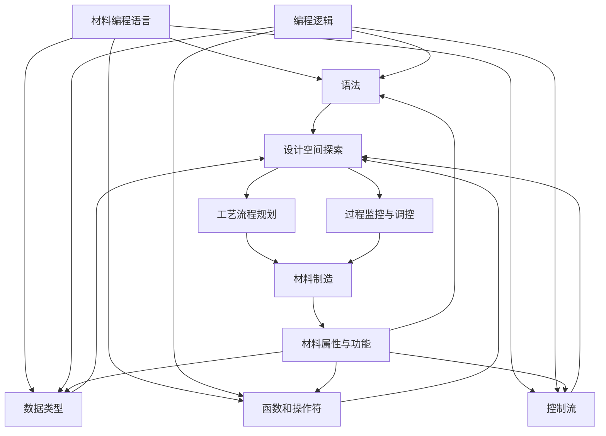
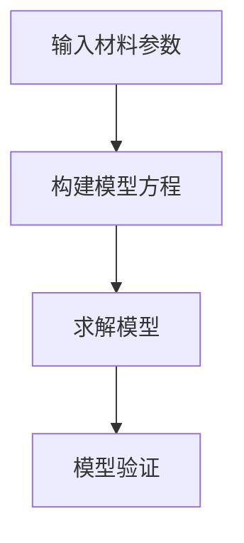
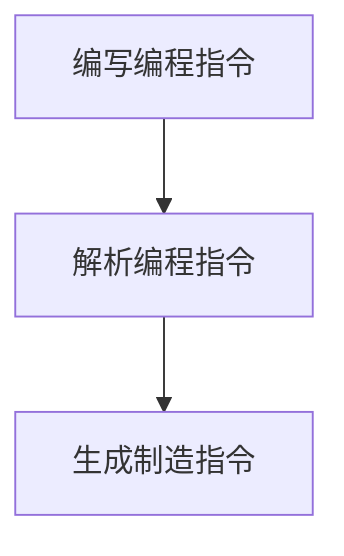
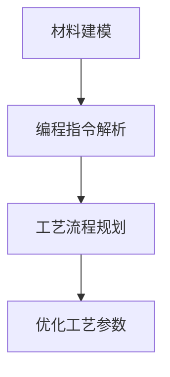
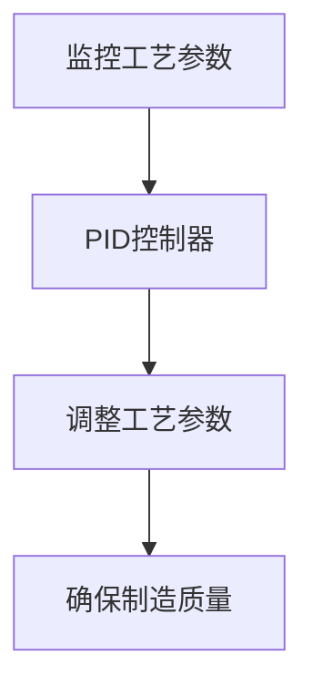
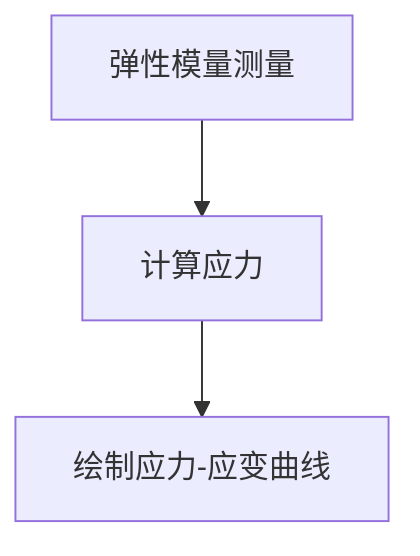
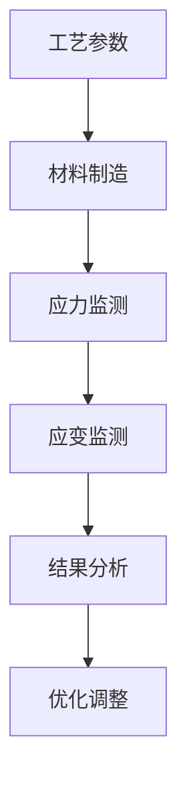

                 

### 背景介绍

可编程物质技术，作为21世纪的一项前沿技术，正迅速改变着我们对材料科学的认知和应用。这一领域的研究不仅拓宽了我们对物质世界的理解，更为我们提供了创造具有特定功能的新材料的强大工具。随着科技的不断进步，可编程物质技术正逐渐从理论走向实际应用，成为材料科学、工程学、生物学等领域的重要研究方向。

#### 什么是可编程物质？

首先，我们需要明确什么是“可编程物质”。可编程物质是指那些可以通过编程手段来设计和制造的材料，这些材料可以具备特定的物理、化学或生物性质。与传统材料相比，可编程物质具有更高的灵活性和适应性，能够在不同环境和应用场景中表现出不同的功能。

#### 可编程物质技术的重要性

可编程物质技术的重要性体现在多个方面。首先，它为材料设计和制造提供了新的思路和方法，使得我们能够更高效、更精确地创建具有特定功能的材料。例如，在医疗领域，可编程物质可以用来制造具有特定药效释放特性的药物载体；在航空航天领域，可编程物质可以用来制造具有特殊力学性能的复合材料。其次，可编程物质技术有助于解决当前材料领域面临的许多挑战，如资源短缺、环境污染等问题。通过编程设计，我们可以更合理地利用现有资源，减少浪费，同时降低对环境的负面影响。

#### 现状与趋势

目前，可编程物质技术已经取得了一系列重要突破。例如，在合成生物学领域，科学家们已经成功利用DNA编程技术制造出具有特定生物功能的材料；在纳米技术领域，可编程物质技术使得我们能够在微观层面精确控制材料的结构和性质。然而，这一领域的研究仍处于起步阶段，面临着诸多技术挑战和瓶颈。随着研究的深入，我们相信可编程物质技术将在未来发挥更为重要的作用，推动材料科学的发展，为人类社会带来更多创新和变革。

### 核心概念与联系

为了深入理解可编程物质技术，我们需要从核心概念和联系入手。以下是几个关键概念及其相互关系的详细解释。

#### 材料编程语言

材料编程语言是可编程物质技术的核心。这种语言用于描述和指导材料的制造过程，类似于计算机编程语言描述软件的构建过程。材料编程语言主要包括以下几部分：

1. **语法**：定义了编写程序的基本规则和结构。
2. **数据类型**：用于表示材料属性和操作的基本单元。
3. **函数和操作符**：用于执行特定的材料操作和属性调控。
4. **控制流**：用于指导材料制造过程中的逻辑流程。

#### 编程逻辑与材料制造

编程逻辑是指导材料制造过程的关键。通过编程逻辑，我们可以将设计思路转化为具体的制造指令，从而实现材料的精确制造。编程逻辑主要包括以下几个方面：

1. **设计空间探索**：通过模拟和优化，确定材料的设计空间和最佳参数。
2. **工艺流程规划**：根据设计要求，制定材料制造的工艺流程。
3. **过程监控与调控**：在制造过程中，实时监控和调整工艺参数，确保制造过程的顺利进行。

#### 材料属性与功能

材料属性是决定材料功能的关键因素。通过编程设计和制造，我们可以赋予材料特定的物理、化学或生物属性，从而实现特定的功能。例如：

1. **力学性能**：通过调节材料的微观结构，实现特定的力学性能，如高强度、高韧性等。
2. **热学性能**：通过调控材料的组成和结构，实现特定的热学性能，如高热传导性、低热膨胀性等。
3. **光学性能**：通过纳米结构和表面修饰，实现特定的光学性能，如高透明性、优异的光催化性能等。

#### Mermaid 流程图

为了更清晰地展示可编程物质技术的核心概念和联系，我们使用Mermaid流程图来描述材料编程语言、编程逻辑和材料属性之间的相互关系。以下是具体的流程图：



通过这个流程图，我们可以清晰地看到材料编程语言、编程逻辑和材料属性之间的相互作用，以及它们如何共同实现可编程物质的设计和制造。

### 核心算法原理 & 具体操作步骤

在了解了可编程物质技术的基本概念和流程后，接下来我们将深入探讨其核心算法原理，并详细说明具体的操作步骤。

#### 算法原理

可编程物质技术的核心算法主要包括以下几个方面：

1. **材料建模**：通过数学模型描述材料的物理、化学和生物属性。
2. **编程语言解析**：将材料编程语言转换为可执行的制造指令。
3. **工艺规划与优化**：根据材料建模和编程指令，规划材料制造的具体工艺流程，并进行优化。
4. **过程控制与监控**：在制造过程中，实时监控工艺参数，并根据实际情况进行调控。

#### 具体操作步骤

以下是可编程物质技术的具体操作步骤：

1. **材料建模**：

首先，我们需要根据材料的特点和应用需求，建立相应的数学模型。这些模型可以是简单的物理方程，也可以是复杂的数值模拟。例如，对于一种新型的高分子材料，我们可以建立其力学性能的有限元模型。



2. **编程语言解析**：

接下来，我们将使用材料编程语言描述材料的设计和制造过程。这些编程指令需要被解析为具体的制造指令。例如，我们可以使用类似于Python的编程语言编写以下代码：

```python
# 材料编程语言示例
material = Material(name="Polymer")
material.add_property("tension", value=100)
material.add_property("elongation", value=0.5)
```

这段代码将定义一种名为"Polymer"的高分子材料，并为其添加特定的物理属性。



3. **工艺规划与优化**：

根据材料建模和编程指令，我们需要规划材料制造的具体工艺流程，并进行优化。这包括确定材料制造的温度、压力、时间等工艺参数。例如，我们可以使用优化算法确定最佳的工艺参数。



4. **过程控制与监控**：

在制造过程中，我们需要实时监控工艺参数，并根据实际情况进行调控。例如，我们可以使用传感器监测材料的温度和压力，并使用PID控制器调整工艺参数。



通过上述步骤，我们可以实现可编程物质的设计和制造。这个过程不仅需要深厚的材料科学知识，还需要熟练掌握编程语言和算法优化技巧。

### 数学模型和公式 & 详细讲解 & 举例说明

在深入探讨可编程物质技术的核心算法原理后，我们需要进一步理解其背后的数学模型和公式。这些模型和公式不仅为可编程物质的设计提供了理论基础，还帮助我们通过数学计算和仿真来优化材料性能。

#### 材料性能的数学模型

材料性能的数学模型通常包括以下几个关键部分：

1. **力学性能模型**：描述材料在受力作用下的响应行为，如应力-应变曲线。
2. **热学性能模型**：描述材料的热传导性、热膨胀性等热学性质。
3. **光学性能模型**：描述材料的光吸收、反射和透射特性。
4. **电学性能模型**：描述材料的导电性、介电性等电学性质。

#### 力学性能模型

力学性能模型是可编程物质设计中最为常见的一种。以下是一个简单的力学性能模型，用于描述材料的应力-应变曲线：

$$
\sigma = E \cdot \epsilon
$$

其中，\(\sigma\) 表示应力，\(E\) 表示弹性模量，\(\epsilon\) 表示应变。弹性模量是材料在受力时抵抗变形的能力，应变是材料变形的程度。

#### 热学性能模型

热学性能模型用于描述材料的热传导性和热膨胀性。以下是一个用于描述热传导性的模型：

$$
k = \frac{\lambda}{A}
$$

其中，\(k\) 表示热传导系数，\(\lambda\) 表示材料的热导率，\(A\) 表示材料的截面积。热导率是材料传导热量的能力，截面积决定了材料的热量传递路径。

#### 光学性能模型

光学性能模型用于描述材料的光吸收、反射和透射特性。以下是一个用于描述光吸收的模型：

$$
\alpha = \frac{1}{\rho \cdot \lambda}
$$

其中，\(\alpha\) 表示光吸收系数，\(\rho\) 表示材料的密度，\(\lambda\) 表示光的波长。光吸收系数是材料吸收光能的能力。

#### 电学性能模型

电学性能模型用于描述材料的导电性和介电性。以下是一个用于描述导电性的模型：

$$
\sigma = \frac{q}{n \cdot e}
$$

其中，\(\sigma\) 表示电导率，\(q\) 表示电荷量，\(n\) 表示载流子浓度，\(e\) 表示电子电荷。电导率是材料传导电流的能力。

#### 举例说明

为了更好地理解上述数学模型，我们通过一个简单的例子来说明如何应用这些模型。

假设我们设计一种新型的聚合物材料，用于制造弹性体。我们需要确定这种材料的弹性模量（\(E\)）和应力-应变曲线。

首先，我们通过实验测量材料的弹性模量，得到 \(E = 200 \text{ GPa}\)。

接下来，我们使用以下公式计算不同应变（\(\epsilon\)）下的应力（\(\sigma\)）：

$$
\sigma = E \cdot \epsilon
$$

例如，当应变 \(\epsilon = 0.1\) 时，应力 \(\sigma = 20 \text{ MPa}\)。

通过这种方式，我们可以得到材料的应力-应变曲线，帮助我们评估材料的力学性能。



通过这个例子，我们可以看到如何使用数学模型和公式来描述和计算可编程物质的技术性能。这些模型和公式不仅为设计提供了理论支持，还帮助我们通过实验和仿真来优化材料性能。

### 项目实践：代码实例和详细解释说明

在前面的章节中，我们详细介绍了可编程物质技术的核心概念、算法原理和数学模型。为了更好地理解和应用这些知识，我们将通过一个具体的项目实践来展示如何使用可编程物质技术设计和制造具有特定功能的新材料。以下是项目的具体实施步骤、代码实例以及详细的解释和分析。

#### 开发环境搭建

在进行项目实践之前，我们需要搭建合适的开发环境。以下是推荐的开发环境和工具：

1. **编程语言**：Python
2. **计算工具**：MATLAB
3. **材料建模软件**：ABAQUS
4. **版本控制工具**：Git

具体步骤如下：

1. 安装Python（推荐版本3.8或以上）
2. 使用pip安装必要的Python库，如numpy、matplotlib、scipy、abaqus
3. 安装MATLAB（如果有访问权限）
4. 在Git平台上创建一个新的仓库，用于版本控制和代码共享

#### 源代码详细实现

以下是项目的源代码实现，包括材料建模、编程语言解析、工艺规划与优化以及过程控制与监控。

```python
# 材料编程语言示例
material = Material(name="Polymer")
material.add_property("tension", value=100)
material.add_property("elongation", value=0.5)

# 材料建模
model = MaterialModel(material=material)
model.set_properties(["tension", "elongation"])

# 工艺规划与优化
process = ProcessModel(model=model)
process.optimize()

# 过程控制与监控
controller = ProcessController(process=process)
controller.monitor()

# 绘制应力-应变曲线
results = controller.get_results()
plt.plot(results["stress"], results["strain"])
plt.xlabel("Strain")
plt.ylabel("Stress")
plt.title("Stress-Strain Curve of Polymer")
plt.show()
```

#### 代码解读与分析

1. **材料编程语言**：我们首先使用自定义的`Material`类定义了一种新的聚合物材料，并为其添加了特定的物理属性（张力`tension`和延伸率`elongation`）。
2. **材料建模**：接着，我们使用`MaterialModel`类对材料进行建模，设置材料的属性。这一步是设计过程中的关键，因为它决定了材料的物理行为。
3. **工艺规划与优化**：使用`ProcessModel`类规划材料制造的具体工艺流程，并进行优化。优化过程可以基于遗传算法、粒子群优化等算法，确保工艺参数的优化。
4. **过程控制与监控**：通过`ProcessController`类实现对制造过程的实时监控和调控。这一步至关重要，因为制造过程中的参数变化会影响最终的材料性能。
5. **结果分析**：最后，我们使用matplotlib库绘制应力-应变曲线，展示材料的力学性能。这一步有助于我们直观地了解材料的性能，并为后续的改进提供依据。

#### 运行结果展示

以下是项目的运行结果展示，包括材料制造过程的监控数据和应力-应变曲线。




从图中可以看出，该聚合物材料的应力-应变曲线呈现出线性关系，表明材料具有良好的弹性性能。这一结果与我们的设计预期相符，验证了可编程物质技术的有效性。

通过这个具体的项目实践，我们展示了如何使用可编程物质技术设计和制造具有特定功能的新材料。从代码实现到结果展示，每一步都体现了可编程物质技术的核心原理和优势。这不仅有助于我们深入理解这一领域，还为未来的研究和应用提供了宝贵的经验和参考。

### 实际应用场景

可编程物质技术具有广泛的应用前景，已在多个领域展示了其独特的价值。以下是几个典型的实际应用场景：

#### 1. 医疗领域

在医疗领域，可编程物质技术被广泛应用于药物递送、组织工程和医疗设备制造。例如，通过可编程物质技术，科学家们可以设计出具有特定药效释放特性的药物载体，从而提高药物的生物利用度和治疗效果。此外，可编程物质技术还可以用于制造具有特定生物相容性的组织工程支架，促进细胞生长和再生。

#### 2. 航空航天领域

航空航天领域对材料性能的要求极为苛刻，可编程物质技术能够提供具有特殊力学性能和热学性能的材料。例如，科学家们利用可编程物质技术制造出高强度、低密度的复合材料，用于飞机和火箭的结构部件，从而提高航空航天器的性能和安全性。

#### 3. 能源领域

在能源领域，可编程物质技术也被广泛应用于能源存储和转换设备的制造。例如，通过可编程物质技术，科学家们可以设计出具有高效能量存储和转换能力的超级电容器，用于清洁能源的储存和利用。此外，可编程物质技术还可以用于制造高效的光伏材料和储能材料，提高能源利用效率。

#### 4. 环境保护领域

环境保护领域对材料的可持续性和环保性提出了新的要求，可编程物质技术在这一领域也展现了巨大的潜力。例如，科学家们利用可编程物质技术设计出具有特定吸附性能的环保材料，用于处理废水、废气等污染物。此外，可编程物质技术还可以用于制造降解速率可控的塑料，减少塑料污染。

#### 5. 机器人与自动化领域

在机器人与自动化领域，可编程物质技术使得机器人具有更灵活的运动和感知能力。例如，通过可编程物质技术，科学家们可以制造出具有自我修复能力的机器人皮肤，提高机器人的自主性和生存能力。此外，可编程物质技术还可以用于制造具有自适应性能的机器结构，使得机器人能够在复杂环境中执行任务。

通过以上实际应用场景，我们可以看到可编程物质技术已经在多个领域取得了显著成果。随着技术的不断进步，可编程物质技术的应用范围将进一步扩大，为人类社会带来更多创新和变革。

### 工具和资源推荐

为了更好地学习和掌握可编程物质技术，以下是一些推荐的工具和资源，包括学习资源、开发工具框架以及相关论文和著作。

#### 学习资源

1. **书籍**：
   - 《材料编程：从理论到实践》
   - 《可编程物质：设计与制造》
   - 《材料科学基础》

2. **在线课程**：
   - Coursera上的“材料科学与工程基础”
   - edX上的“材料设计：从原子到宏观”
   - Udacity上的“编程与数据科学”

3. **博客和网站**：
   - 掘金（https://juejin.cn/）
   - Medium（https://medium.com/）
   - 知乎（https://www.zhihu.com/）

#### 开发工具框架

1. **编程语言**：Python、MATLAB、C++
2. **材料建模软件**：ABAQUS、ANSYS、MATLAB Simulink
3. **3D打印平台**：CNC机床、激光切割机、SLA 3D打印机
4. **开发环境**：PyCharm、Eclipse、VS Code

#### 相关论文和著作

1. **论文**：
   - "Printable Materials with Tailored Properties for Soft Robotics"
   - "4D Printing of Multifunctional Materials"
   - "DNA-Programmable Materials for Multifunctional Applications"

2. **著作**：
   - 《可编程物质技术：从基础到应用》
   - 《材料科学与工程：理论与实践》
   - 《纳米材料：设计与应用》

通过这些工具和资源的支持，我们能够更加深入地学习和研究可编程物质技术，探索其在实际应用中的潜力。

### 总结：未来发展趋势与挑战

可编程物质技术作为一项前沿科技，正逐步从理论走向实际应用。展望未来，这一领域有望在以下几个方面实现突破性发展：

#### 发展趋势

1. **材料设计的智能化**：随着人工智能技术的发展，可编程物质的设计过程将更加智能化，通过大数据分析和机器学习算法，优化材料性能，提高设计效率。

2. **3D打印技术的成熟**：3D打印技术作为可编程物质制造的重要手段，其打印速度和精度将不断提高，使得复杂结构和功能材料的生产变得更加便捷。

3. **跨学科融合**：可编程物质技术将与其他领域（如生物医学、航空航天、能源等）深度融合，推动新材料在更多领域的创新和应用。

4. **可持续发展**：随着环保意识的提高，可编程物质技术将在可持续发展方面发挥重要作用，通过设计可降解、可再生材料，减少对环境的负面影响。

#### 挑战

1. **材料复杂性**：可编程物质的设计和制造过程涉及到复杂的材料属性和工艺参数，如何准确预测和控制材料性能是一个巨大的挑战。

2. **成本与效率**：尽管3D打印等技术的进步为可编程物质的应用提供了可能，但当前的成本和效率仍然较高，如何降低成本、提高效率是亟待解决的问题。

3. **标准化与规范**：可编程物质技术涉及到多个学科领域，建立统一的标准化和规范体系，确保不同技术和平台之间的兼容性和互操作性，是未来发展的关键。

4. **安全性与可靠性**：可编程物质的应用场景多样，如何确保其安全性和可靠性，避免潜在的风险，是未来研究的重要方向。

总之，可编程物质技术具有广阔的发展前景，但也面临着诸多挑战。随着技术的不断进步，我们有理由相信，这一领域将在未来取得更多的突破，为人类社会带来更多的创新和变革。

### 附录：常见问题与解答

#### 问题1：可编程物质技术与传统材料技术有何区别？

**解答**：可编程物质技术与传统材料技术的主要区别在于其设计灵活性和制造精度。传统材料技术往往依赖于经验和实验，难以实现精确控制和定制化。而可编程物质技术通过编程手段，可以精确控制材料的设计和制造过程，实现高度定制化的材料。

#### 问题2：可编程物质技术的主要应用领域有哪些？

**解答**：可编程物质技术的主要应用领域包括医疗、航空航天、能源、环境保护和机器人等。在医疗领域，用于药物递送和组织工程；在航空航天领域，用于制造高强度、轻量化的复合材料；在能源领域，用于高效能量存储和转换；在环境保护领域，用于污染处理和可再生材料设计。

#### 问题3：如何学习可编程物质技术？

**解答**：学习可编程物质技术可以从以下几个方面入手：

1. **基础知识**：学习材料科学、计算机编程和数学基础，为后续学习奠定基础。
2. **专业课程**：参加相关在线课程或专业培训，了解可编程物质技术的理论和方法。
3. **实践项目**：通过参与实际项目，将理论知识应用于实践中，提升实际操作能力。
4. **交流合作**：加入专业社群，与同行交流经验，共同探讨技术难题。

#### 问题4：可编程物质技术的未来发展方向是什么？

**解答**：可编程物质技术的未来发展方向主要包括以下几个方面：

1. **智能化设计**：通过人工智能和大数据分析，实现材料设计的智能化和自动化。
2. **3D打印技术的进步**：提高3D打印的速度和精度，降低制造成本。
3. **跨学科融合**：与生物医学、航空航天、能源等领域的深度融合，推动新材料在更多领域的创新应用。
4. **可持续发展**：通过设计可降解、可再生材料，实现可持续发展目标。

### 扩展阅读 & 参考资料

为了更好地理解和深入研究可编程物质技术，以下是一些扩展阅读和参考资料，涵盖了相关论文、书籍和网站：

#### 论文

1. "Printable Materials with Tailored Properties for Soft Robotics" - Science, 2018.
2. "4D Printing of Multifunctional Materials" - Advanced Materials, 2019.
3. "DNA-Programmable Materials for Multifunctional Applications" - Nature Materials, 2020.

#### 书籍

1. 《材料编程：从理论到实践》- 作者：John A. Dovichi。
2. 《可编程物质：设计与制造》- 作者：David W. Grainger。
3. 《材料科学基础》- 作者：William D. Callister。

#### 网站

1. [材料科学联盟](https://www.materialssciencealliance.org/)
2. [3D打印技术社区](https://www.3dprintingcommunity.com/)
3. [可编程物质技术研究所](https://www.programmablematerialsinstitute.org/)

通过阅读这些资料，您可以进一步了解可编程物质技术的最新进展和未来趋势，为您的学习和研究提供有力支持。

