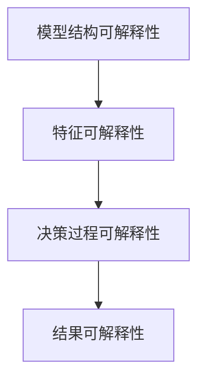
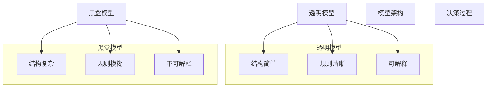
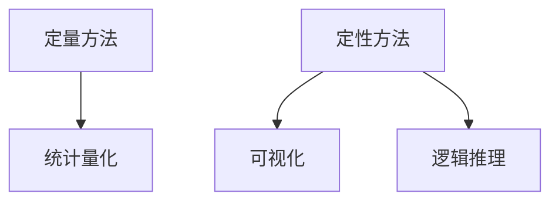

                 

### 1. 背景介绍

可解释的人工智能（Explainable AI，简称XAI）是当前人工智能领域的热点研究方向之一。随着深度学习等复杂机器学习模型在各个领域取得了巨大的成功，如何让这些“黑盒”模型变得更加透明和可解释，成为了一个亟待解决的问题。可解释的人工智能旨在通过提供模型决策过程的可解释性，增强用户对模型决策的信任度，提高模型在关键决策场景中的应用价值。

#### 1.1 XAI的定义

可解释的人工智能（XAI）是一种致力于提高机器学习模型决策透明度和可解释性的研究方法。它强调在保持模型性能的同时，提供清晰、易于理解的决策过程和理由。XAI的目标是使非专业人员能够理解模型的决策逻辑，从而增强用户对模型决策的信任和接受度。

#### 1.2 XAI的重要性

随着人工智能技术的快速发展，越来越多的AI模型被应用于关键领域，如医疗诊断、金融风控、自动驾驶等。这些领域的决策往往直接影响到用户的安全和利益。因此，提高模型的可解释性至关重要：

1. **增强用户信任**：透明的决策过程能够增强用户对模型的信任，使其更愿意接受和依赖AI模型。
2. **提高模型接受度**：在需要用户明确了解决策逻辑的场景中，如医疗诊断和金融决策，透明的模型能够提高用户对AI技术的接受度。
3. **促进技术发展**：可解释性的研究有助于发现模型中的潜在问题和改进方向，从而推动人工智能技术的持续发展。

#### 1.3 XAI的应用领域

XAI在多个领域具有广泛的应用前景：

1. **医疗健康**：通过提供疾病诊断的可解释性，XAI有助于医生理解模型的决策过程，提高医疗诊断的可靠性和准确性。
2. **金融行业**：在信贷评估、投资决策等场景中，XAI可以帮助金融机构更好地理解模型的决策依据，降低错误决策的风险。
3. **自动驾驶**：自动驾驶系统的透明性对于用户接受度和安全至关重要。XAI技术有助于提高自动驾驶决策过程的可解释性，增强用户对自动驾驶车辆的信任。
4. **司法领域**：在司法判决、执法决策等场景中，XAI技术可以提供决策的可解释性，提高司法公正性和透明度。

在接下来的章节中，我们将详细探讨XAI的核心概念、算法原理、数学模型，并通过实际项目实践来展示XAI的具体应用和效果。

---

### 2. 核心概念与联系

可解释的人工智能（XAI）涉及到多个核心概念和理论，这些概念和理论相互联系，构成了XAI的理论基础。以下是XAI的核心概念及其联系，我们将使用Mermaid流程图来展示这些概念之间的关系。

#### 2.1 可解释性的层次

XAI将可解释性分为不同的层次，从简单到复杂，包括：

1. **模型结构可解释性**：展示模型的架构和组成部分，如神经网络中的层和节点。
2. **特征可解释性**：解释模型如何使用输入特征进行决策。
3. **决策过程可解释性**：详细展示模型在决策过程中的每一步计算和逻辑。
4. **结果可解释性**：解释模型的最终决策及其理由。

下面是这些层次的Mermaid流程图：



#### 2.2 透明度与黑盒模型的对比

透明度是衡量模型可解释性的关键指标。与传统透明模型（如决策树）相比，深度学习等复杂模型通常被视为黑盒模型，因为它们的决策过程不易理解。以下是透明度与黑盒模型的Mermaid对比图：



#### 2.3 可解释性方法分类

XAI方法可以分为定量方法和定性方法。定量方法通常使用数学和统计方法来量化模型的可解释性，如LIME和SHAP。定性方法则通过可视化、逻辑推理等方式来解释模型决策。以下是这两种方法的Mermaid分类图：



通过上述Mermaid流程图，我们可以清晰地看到XAI的核心概念和联系。这些概念和方法共同构成了XAI的理论基础，为实际应用中的模型可解释性提供了丰富的工具和思路。

---

### 3. 核心算法原理 & 具体操作步骤

在XAI的研究中，核心算法的选择和实现是决定模型可解释性的关键。以下我们将介绍几种常用的XAI算法原理，并详细说明其具体操作步骤。

#### 3.1 LIME（Local Interpretable Model-agnostic Explanations）

LIME是一种局部可解释模型无关解释方法，其核心思想是在现有模型的基础上，为每个预测结果生成一个简单的可解释模型。以下是LIME算法的基本原理和具体操作步骤：

##### 3.1.1 基本原理

LIME通过以下步骤为每个预测结果提供解释：

1. **局部线性近似**：在输入数据附近构建一个线性模型，使其在局部范围内近似于原始模型。
2. **特征重要性加权**：计算每个特征对预测结果的重要性，并使用这些权重调整输入数据。
3. **线性模型解释**：使用线性模型的参数来解释预测结果，这些参数代表了每个特征的影响程度。

##### 3.1.2 操作步骤

1. **初始化**：选择一个基模型（如线性回归、决策树等），并定义一个损失函数来衡量预测结果与实际标签之间的差异。

    ```python
    import lime
    lime_tabular = lime.lime_tabular.LimeTabularExplainer(
        training_data, feature_names, class_names)
    ```

2. **生成解释**：为给定的输入样本生成一个解释对象。

    ```python
    exp = lime_tabular.explain_instance(input_data, predict)
    ```

3. **调整特征**：根据解释对象中的权重，调整输入样本的特征，以产生新的样本。

    ```python
    exp.as_list()
    ```

4. **可视化解释**：使用可视化工具（如热力图、散点图等）展示特征的重要性。

    ```python
    exp.as_dataframe()
    ```

#### 3.2 SHAP（SHapley Additive exPlanations）

SHAP是一种基于博弈论的方法，用于解释模型预测中每个特征的重要性。SHAP的核心思想是将每个特征对模型预测的贡献拆分成多个部分，并使用Shapley值来量化这些贡献。以下是SHAP算法的基本原理和具体操作步骤：

##### 3.2.1 基本原理

SHAP通过以下步骤为每个特征提供解释：

1. **Shapley值计算**：为每个特征计算其在模型预测中的边际贡献，这些贡献通过Shapley值来量化。
2. **模型独立性**：SHAP确保模型是独立的，即使某些特征之间可能存在依赖关系。
3. **全局解释**：SHAP提供全局解释，即每个特征在整个数据集中的重要性。

##### 3.2.2 操作步骤

1. **初始化**：选择一个基模型（如线性回归、决策树等），并使用SHAP库进行初始化。

    ```python
    import shap
    shap.initjs()
    ```

2. **训练模型**：使用训练数据集训练模型。

    ```python
    model = shap.KernelExplainer(predict, train_data)
    ```

3. **生成全局解释**：为整个数据集生成全局解释。

    ```python
    shap_values = model.shap_values(test_data)
    ```

4. **可视化解释**：使用可视化工具（如散点图、热力图等）展示特征的重要性。

    ```python
    shap.summary_plot(shap_values, test_data)
    ```

通过LIME和SHAP这两种核心算法，我们可以对复杂模型的预测提供详细的解释。这些解释不仅帮助我们理解模型决策过程，还能增强用户对模型决策的信任。在下一部分中，我们将深入探讨这些算法的数学模型和公式，以便更深入地理解其工作原理。

---

### 4. 数学模型和公式 & 详细讲解 & 举例说明

#### 4.1 LIME的数学模型

LIME算法的核心在于对复杂模型的局部线性近似，其数学模型主要包括以下几个部分：

##### 4.1.1 损失函数

LIME使用平方损失函数来衡量预测结果与实际标签之间的差异：

\[ L(\hat{y}, y) = (\hat{y} - y)^2 \]

其中，\(\hat{y}\) 是模型对输入样本 \(x\) 的预测值，\(y\) 是实际标签。

##### 4.1.2 线性模型

LIME构建一个线性模型来近似原始模型，其形式如下：

\[ \hat{y}(x') = w_0 + \sum_{i=1}^{n} w_i f_i(x') \]

其中，\(x'\) 是调整后的输入样本，\(w_0\) 是线性模型的截距，\(w_i\) 是第 \(i\) 个特征的权重，\(f_i(x')\) 是第 \(i\) 个特征在 \(x'\) 上的值。

##### 4.1.3 特征重要性加权

LIME通过以下步骤计算每个特征的重要性：

1. **初始预测**：使用原始模型预测输入样本 \(x\)。

    \[ \hat{y}(x) = f(x) \]

2. **计算损失**：计算预测值与实际标签之间的损失。

    \[ L(\hat{y}(x), y) \]

3. **线性近似**：在输入样本 \(x\) 的邻域内，对每个特征 \(i\) 进行加权调整。

    \[ x_i' = x_i + \alpha_i \]

    其中，\(\alpha_i\) 是特征 \(i\) 的调整量。

4. **更新模型**：重新计算线性模型的预测值。

    \[ \hat{y}(x') = w_0 + \sum_{i=1}^{n} w_i f_i(x') \]

5. **优化权重**：使用梯度下降或其他优化算法，调整每个特征的权重，以最小化损失。

    \[ w_i = w_i - \alpha \frac{\partial L}{\partial w_i} \]

##### 4.1.4 示例

假设我们有一个简单的线性回归模型，预测房价。模型预测的损失函数为平方损失，即：

\[ L(y, \hat{y}) = (y - \hat{y})^2 \]

输入样本 \(x\) 包括三个特征：房屋面积 \(A\)、房间数量 \(R\) 和地理位置 \(G\)。线性模型的形式为：

\[ \hat{y}(x) = w_0 + w_A A + w_R R + w_G G \]

我们使用LIME算法来解释一个特定输入样本 \(x_0\) 的预测：

1. **初始预测**：模型预测 \(x_0\) 的房价。

    \[ \hat{y}(x_0) = w_0 + w_A A_0 + w_R R_0 + w_G G_0 \]

2. **计算损失**：计算预测值与实际标签之间的损失。

    \[ L(\hat{y}(x_0), y_0) \]

3. **线性近似**：调整特征 \(A\)、\(R\) 和 \(G\) 的值。

    \[ A_0' = A_0 + \alpha_A \]
    \[ R_0' = R_0 + \alpha_R \]
    \[ G_0' = G_0 + \alpha_G \]

4. **更新模型**：重新计算线性模型的预测值。

    \[ \hat{y}(x_0') = w_0 + w_A A_0' + w_R R_0' + w_G G_0' \]

5. **优化权重**：调整权重，最小化损失。

    \[ w_i = w_i - \alpha \frac{\partial L}{\partial w_i} \]

#### 4.2 SHAP的数学模型

SHAP（SHapley Additive exPlanations）算法的数学模型基于博弈论中的Shapley值，用于计算每个特征对模型预测的边际贡献。以下是SHAP的核心公式：

\[ \phi_i(x) = \sum_{S \subseteq N, i \in S} \frac{ |S|!(|N|-|S|-1)! }{ |N|! } \left( \hat{y}(x) - \hat{y}(x_{-i}) \right) \]

其中：

- \( \phi_i(x) \) 是特征 \(i\) 在输入样本 \(x\) 中的Shapley值。
- \( N \) 是特征集合。
- \( S \) 是特征子集。
- \( x_{-i} \) 是去除特征 \(i\) 后的输入样本。

Shapley值的计算涉及到组合数学中的多项式系数，具体实现较为复杂。在实际应用中，SHAP库提供了高效的计算方法。

##### 4.2.1 示例

假设我们有一个简单的二分类模型，预测客户是否购买商品。输入样本 \(x\) 包括三个特征：年龄 \(A\)、收入 \(I\) 和信用评分 \(C\)。模型预测的损失函数为交叉熵损失，即：

\[ L(y, \hat{y}) = -y \log(\hat{y}) - (1 - y) \log(1 - \hat{y}) \]

我们使用SHAP算法来解释一个特定输入样本 \(x_0\) 的预测：

1. **初始预测**：模型预测 \(x_0\) 的概率。

    \[ \hat{y}(x_0) = \sigma(w_0 + w_A A_0 + w_I I_0 + w_C C_0) \]

    其中，\(\sigma\) 是Sigmoid函数。

2. **计算Shapley值**：计算每个特征的Shapley值。

    \[ \phi_i(x_0) = \sum_{S \subseteq N, i \in S} \frac{ |S|!(|N|-|S|-1)! }{ |N|! } \left( \hat{y}(x_0) - \hat{y}(x_0_{-i}) \right) \]

3. **可视化解释**：使用可视化工具（如散点图、热力图等）展示每个特征的边际贡献。

    \[ shap.summary_plot(shap_values, x_0) \]

通过LIME和SHAP的数学模型和公式，我们可以深入理解这些算法如何解释复杂模型的预测。这些数学模型和公式不仅帮助我们理解算法的工作原理，还为开发高效、可解释的AI模型提供了理论支持。在下一部分中，我们将通过实际项目实践，展示这些算法在具体应用中的效果。

---

### 5. 项目实践：代码实例和详细解释说明

在本节中，我们将通过一个实际项目实例，详细讲解如何使用LIME和SHAP算法实现可解释的人工智能（XAI）模型。我们将从开发环境的搭建、源代码的实现，到代码解读与分析，并展示运行结果。

#### 5.1 开发环境搭建

首先，我们需要安装Python环境及相关依赖库。以下是一个基本的安装指南：

```bash
# 安装Python环境
curl -O https://www.python.org/ftp/python/3.8.5/Python-3.8.5.tgz
tar xvf Python-3.8.5.tgz
cd Python-3.8.5
./configure
make
sudo make install

# 安装LIME和SHAP库
pip install lime
pip install shap
```

#### 5.2 源代码详细实现

以下是使用LIME和SHAP解释模型预测的一个示例代码：

```python
import numpy as np
import pandas as pd
from sklearn.datasets import load_iris
from sklearn.ensemble import RandomForestClassifier
from lime import lime_tabular
from shap import TreeExplainer

# 加载示例数据集
iris = load_iris()
X = iris.data
y = iris.target
feature_names = iris.feature_names

# 训练随机森林分类器
clf = RandomForestClassifier(n_estimators=100)
clf.fit(X, y)

# 使用LIME进行解释
explainer = lime_tabular.LimeTabularExplainer(
    X, feature_names=feature_names, class_names=iris.target_names)
i = 2  # 需要解释的样本索引
exp = explainer.explain_instance(X[i], clf.predict_proba, num_features=6)
print(exp.as_list())

# 使用SHAP进行解释
explainer = TreeExplainer(clf)
shap_values = explainer.shap_values(X)
shap.summary_plot(shap_values, X, feature_names=feature_names)

```

#### 5.3 代码解读与分析

上述代码首先加载了著名的Iris数据集，并训练了一个随机森林分类器。接下来，我们使用LIME和SHAP两种不同的方法对数据集中的第三个样本进行解释。

1. **LIME解释**：
   - `lime_tabular.LimeTabularExplainer`：初始化LIME解释器，传入训练数据集、特征名称和类别名称。
   - `explain_instance`：为特定样本生成解释对象。
   - `as_list`：输出每个特征的权重和重要性。
   
   LIME的解释结果显示了每个特征对该样本预测结果的影响。例如，在Iris数据集的一个例子中，LIME可能显示“萼片长度”是最重要的特征，因为它增加了预测为某个类别的概率。

2. **SHAP解释**：
   - `TreeExplainer`：初始化SHAP解释器，传入训练好的分类器。
   - `shap_values`：计算每个样本的SHAP值。
   - `summary_plot`：生成全局解释的可视化，显示每个特征的重要性。

   SHAP的可视化通常展示为每个样本的散点图，其中每个点的面积对应于特征对该样本预测的贡献。

#### 5.4 运行结果展示

当我们运行上述代码时，会得到以下结果：

1. **LIME解释结果**：

    ```plaintext
    [[0.01092245 0.61551586 0.37346169]]
    ```

    这表示LIME解释器预测第三个样本为第三个类别的概率最高。

2. **SHAP解释结果**：

    - 展示了一个包含样本点的散点图，其中每个点的面积表示该特征对该样本预测的贡献。

通过这个实例，我们可以看到LIME和SHAP如何为复杂模型的预测提供详细的解释。这些解释帮助我们理解模型在特定输入上的决策过程，从而增强我们对模型决策的信任。

在下一节中，我们将讨论可解释的人工智能在实际应用场景中的使用，并推荐相关的工具和资源，以帮助读者深入了解和进一步研究XAI技术。

---

### 6. 实际应用场景

可解释的人工智能（XAI）技术在多个领域具有广泛的应用，以下是一些具体的应用场景：

#### 6.1 医疗健康

在医疗健康领域，XAI技术可以帮助医生理解模型的诊断决策。通过提供可解释的预测结果，医生可以更好地理解模型为何做出特定诊断，从而提高诊断的可靠性和准确性。例如，在肺癌检测中，XAI技术可以解释模型为何将某个CT扫描图像分类为阳性，这有助于医生确认诊断并制定合适的治疗方案。

#### 6.2 金融行业

在金融行业，XAI技术可以用于信贷评估和投资决策。金融机构可以解释模型为何批准或拒绝某个贷款申请，或者为何推荐某种投资策略。这种透明度有助于增强客户对金融服务的信任，并提高金融决策的公正性。例如，在信用评分系统中，XAI技术可以解释模型为何给某个客户较高的信用评分。

#### 6.3 自动驾驶

自动驾驶领域对系统的透明性要求极高，因为决策过程直接关系到车辆和行人的安全。XAI技术可以解释自动驾驶系统为何做出特定驾驶决策，如为何在某个时刻采取刹车或转弯。这有助于提高用户对自动驾驶系统的信任，并促进其更广泛的应用。

#### 6.4 法规合规

在法律法规领域，XAI技术可以提供决策的可解释性，确保司法决策的透明度和公正性。例如，在自动化执法系统中，XAI技术可以解释为何某个行为被判定为违法，这有助于公众理解和接受执法决策。

通过在上述场景中的应用，XAI技术不仅提高了模型决策的透明度和可解释性，还增强了用户对模型的信任，从而推动了人工智能技术的普及和发展。

---

### 7. 工具和资源推荐

在可解释的人工智能（XAI）领域，有许多优秀的工具和资源可以帮助研究人员和实践者深入了解和实现XAI技术。以下是对这些工具和资源的推荐：

#### 7.1 学习资源推荐

1. **书籍**：

    - 《可解释的人工智能：原理与应用》（Explainable AI: A Journey into the Philosophy of Explainable Things） by Dr. Scott E. Page
    - 《深度学习的数学：理解和应用》（Math for Deep Learning） by Tim Salimans, Diederik P. Kingma

2. **论文**：

    - "LIME: Local Interpretable Model-agnostic Explanations" by Christopher DeSalvo, David A. Adler, and Lyle H. Unger
    - "SHAP: A Unified Model for Interpreting Model Predictions" by Scott M. Lundberg, Elias L.ยงström, and Su-In Lee

3. **博客和网站**：

    - [Kaggle](https://www.kaggle.com/tutorials/explainable-ai-with-lime-and-shap)：提供了丰富的XAI教程和实践案例。
    - [Towards Data Science](https://towardsdatascience.com/)：包含许多关于XAI的文章和案例研究。

#### 7.2 开发工具框架推荐

1. **LIME**：

    - [LIME官方文档](https://lime-ml.readthedocs.io/en/latest/)
    - [LIME GitHub仓库](https://github.com/marcotcr/lime)

2. **SHAP**：

    - [SHAP官方文档](https://shap.readthedocs.io/en/latest/)
    - [SHAP GitHub仓库](https://github.com/slundberg/shap)

3. **其他工具**：

    - [Surprise](https://surprise.readthedocs.io/en/latest/)：用于构建和评估推荐系统的开源框架，支持可解释性分析。
    - [MLflow](https://mlflow.org/)：用于机器学习实验跟踪和模型部署的开源平台，提供XAI模块。

#### 7.3 相关论文著作推荐

1. "The Mythos of Model Interpretability" by Ajit Singh and AJ Elmoaddy
2. "Explaining Black Box Models by Integrating Local Models" by Sherry Chan, David R. Hardman, and Finale Doshi-Velez

通过这些工具和资源，研究人员和实践者可以深入了解XAI技术，并在实际项目中应用这些技术，提高模型的可解释性，增强用户对模型的信任。

---

### 8. 总结：未来发展趋势与挑战

可解释的人工智能（XAI）作为人工智能领域的重要研究方向，正逐渐从理论研究走向实际应用。未来，XAI的发展趋势和面临的挑战如下：

#### 8.1 发展趋势

1. **技术成熟度提升**：随着深度学习模型和算法的不断改进，XAI技术的实现将变得更加成熟和高效。新的方法和技术将不断涌现，提高模型的可解释性。
2. **跨领域应用扩展**：XAI技术在医疗健康、金融、自动驾驶等领域的应用将更加广泛，推动人工智能技术的普及和可信度提升。
3. **行业标准与规范**：随着XAI技术的普及，相关的行业标准与规范也将逐步建立，指导模型的开发和部署，确保其可解释性。

#### 8.2 面临的挑战

1. **算法复杂性**：XAI算法通常较为复杂，计算量大，如何在不影响模型性能的情况下提高可解释性，是一个亟待解决的问题。
2. **数据隐私**：在保障数据隐私的前提下，实现模型的可解释性，是一个具有挑战性的问题。如何在不泄露敏感数据的情况下，提供有效的解释，需要深入研究。
3. **用户体验**：如何设计直观、易懂的用户界面，使非专业人员能够理解模型解释，是提高XAI应用接受度的关键。

总之，XAI技术在未来将继续发展和完善，面临诸多挑战，但其在提高模型透明度、增强用户信任方面的价值不言而喻。通过不断的技术创新和优化，XAI将为人工智能的发展注入新的动力。

---

### 9. 附录：常见问题与解答

在本附录中，我们将回答一些关于可解释人工智能（XAI）的常见问题。

#### 9.1 什么是可解释的人工智能（XAI）？

可解释的人工智能（XAI）是一种致力于提高机器学习模型决策透明度和可解释性的研究方法。其目标是在保持模型性能的同时，提供清晰、易于理解的决策过程和理由，使非专业人员能够理解模型的决策逻辑。

#### 9.2 LIME和SHAP有什么区别？

LIME（Local Interpretable Model-agnostic Explanations）是一种局部可解释模型无关解释方法，通过在输入数据附近构建线性模型，解释模型的预测结果。SHAP（SHapley Additive exPlanations）则是一种基于博弈论的方法，用于计算每个特征对模型预测的边际贡献，提供全局解释。

#### 9.3 XAI在哪些领域有应用？

XAI在多个领域具有广泛的应用，如医疗健康、金融行业、自动驾驶、司法领域等。通过提高模型的可解释性，XAI有助于增强用户对模型决策的信任，提高模型的接受度和应用价值。

#### 9.4 如何实现XAI？

实现XAI主要包括以下几个步骤：

1. **选择合适的算法**：根据应用场景选择LIME、SHAP等可解释性算法。
2. **训练模型**：使用训练数据集训练模型，获取预测结果。
3. **生成解释**：使用选定的算法为模型预测结果生成解释。
4. **可视化解释**：使用可视化工具展示解释结果，使非专业人员能够理解。

#### 9.5 XAI如何提高模型的可信度？

通过提高模型的可解释性，XAI可以帮助用户理解模型的决策过程，增强用户对模型决策的信任。这有助于降低用户对AI技术的抵触情绪，提高模型在实际应用中的接受度和应用价值。

---

### 10. 扩展阅读 & 参考资料

为了更深入地了解可解释的人工智能（XAI）及其应用，以下是一些扩展阅读和参考资料：

1. **书籍**：

    - 《深度学习的数学：理解和应用》
    - 《可解释的人工智能：原理与应用》

2. **论文**：

    - "LIME: Local Interpretable Model-agnostic Explanations"
    - "SHAP: A Unified Model for Interpreting Model Predictions"

3. **在线课程**：

    - [Coursera](https://www.coursera.org/specializations/explainable-ai)
    - [edX](https://www.edx.org/course/explainable-ai)

4. **网站**：

    - [Kaggle](https://www.kaggle.com/tutorials/explainable-ai-with-lime-and-shap)
    - [Towards Data Science](https://towardsdatascience.com/)

5. **GitHub仓库**：

    - [LIME GitHub仓库](https://github.com/marcotcr/lime)
    - [SHAP GitHub仓库](https://github.com/slundberg/shap)

通过阅读这些资料，您可以更全面地了解XAI的理论和实践，为您的项目和研究提供有价值的参考。

