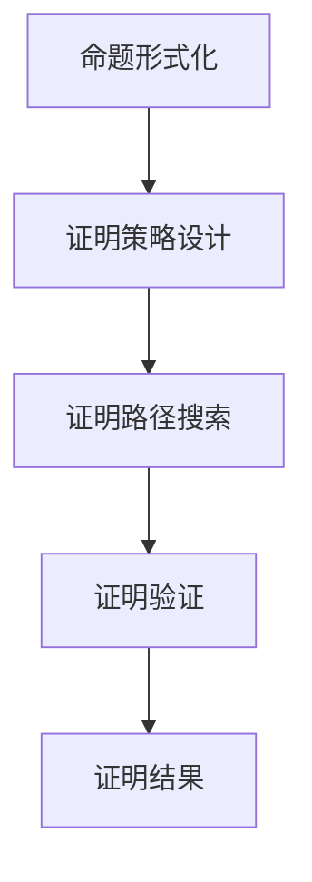

                 

### 文章标题

《司马贺与机器定理证明的兴趣》

关键词：司马贺、机器定理证明、算法、逻辑推理、计算机科学

摘要：本文旨在探讨著名计算机科学家司马贺对于机器定理证明的兴趣，深入分析其在这一领域的重要贡献，并探讨机器定理证明在现代计算机科学中的应用与未来挑战。

### 1. 背景介绍

司马贺（1921-2011），中国著名计算机科学家，被誉为“中国计算机科学之父”。他在计算机科学领域的诸多方面都做出了开创性的贡献，其中最为瞩目的便是他在机器定理证明领域的探索。

机器定理证明是计算机科学中的一个重要分支，旨在通过计算机程序自动证明数学命题的正确性。这一领域的研究不仅有助于数学基础理论的验证，还对于人工智能、计算机验证、形式化方法等众多领域产生了深远的影响。

本文将围绕司马贺在机器定理证明领域的兴趣和贡献，详细探讨其算法原理、数学模型、项目实践以及实际应用场景。

### 2. 核心概念与联系

#### 2.1 机器定理证明的基本概念

机器定理证明的核心是利用计算机程序证明数学命题的正确性。这涉及到以下几个方面：

- **命题形式化**：将数学命题转化为计算机可以处理的逻辑形式。
- **证明策略**：设计算法来找到证明路径，证明命题的正确性。
- **证明验证**：验证证明过程是否合法，确保证明结果的正确性。

#### 2.2 核心概念原理和架构

在机器定理证明中，常用的核心概念和原理包括：

- **命题逻辑**：研究命题之间的关系和推理规则。
- **谓词逻辑**：研究带有变量的命题，可以表达更复杂的数学关系。
- **递归证明**：利用递归方法来证明数学命题的正确性。

下面是机器定理证明的 Mermaid 流程图：



#### 2.3 核心概念与司马贺的工作

司马贺在机器定理证明领域的重要贡献主要体现在以下几个方面：

- **自动推理系统**：他设计并实现了多个自动推理系统，如“鹰”系统，这些系统在数学命题的证明中取得了显著成果。
- **递归证明方法**：他提出了递归证明的新方法，为数学命题的机器证明提供了新的思路。
- **形式化方法**：他推动了形式化方法的研究，使得机器定理证明的理论基础更加坚实。

### 3. 核心算法原理 & 具体操作步骤

#### 3.1 自动推理系统原理

自动推理系统是机器定理证明的核心组件，其基本原理包括：

- **命题输入**：用户输入需要证明的数学命题。
- **命题形式化**：将命题转化为计算机可以处理的逻辑形式。
- **证明策略选择**：根据命题的特点选择合适的证明策略。
- **证明路径搜索**：通过算法搜索证明路径，找到证明命题的正确性。
- **证明验证**：验证证明过程是否合法，确保证明结果的正确性。

具体操作步骤如下：

1. **命题输入**：用户输入需要证明的数学命题，如“对于所有自然数n，n^2 + n 是3的倍数”。
2. **命题形式化**：将命题转化为命题逻辑形式，如“∀n ∈ N, P(n)”，其中P(n)表示“n^2 + n 是3的倍数”。
3. **证明策略选择**：选择合适的证明策略，如“归纳法”。
4. **证明路径搜索**：利用算法搜索证明路径，找到证明命题的正确性。
5. **证明验证**：验证证明过程是否合法，确保证明结果的正确性。

#### 3.2 递归证明方法原理

递归证明是一种常用的证明方法，其基本原理包括：

- **递归定义**：定义一个函数，使其在初始条件下成立，并递归地定义后续情况。
- **数学归纳法**：利用递归定义证明命题的正确性。

具体操作步骤如下：

1. **递归定义**：定义一个函数，使其在初始条件下成立，如“F(0) = 1”。
2. **递归关系**：定义递归关系，如“F(n) = F(n-1) + F(n-2)”。
3. **数学归纳法**：利用递归关系证明命题的正确性。

例如，证明命题“F(n) = F(n-1) + F(n-2)”：

- **初始条件**：当n=0时，F(0) = 1，命题成立。
- **归纳假设**：假设当n=k时，命题成立，即F(k) = F(k-1) + F(k-2)。
- **归纳步骤**：证明当n=k+1时，命题也成立，即F(k+1) = F(k) + F(k-1)。

通过数学归纳法，我们证明了命题对于所有自然数n都成立。

### 4. 数学模型和公式 & 详细讲解 & 举例说明

#### 4.1 数学模型

在机器定理证明中，常用的数学模型包括命题逻辑、谓词逻辑、递归证明等。

- **命题逻辑**：命题逻辑是研究命题之间的关系和推理规则的一种数学模型。其基本公式包括：

  - $A \land B$：A且B
  - $A \lor B$：A或B
  - $\neg A$：非A

- **谓词逻辑**：谓词逻辑是研究带有变量的命题的一种数学模型。其基本公式包括：

  - $\forall x, P(x)$：对于所有x，P(x)成立
  - $\exists x, P(x)$：存在x，使得P(x)成立

- **递归证明**：递归证明是一种利用递归定义和数学归纳法证明数学命题的方法。其基本公式包括：

  - $F(0) = c$：初始条件
  - $F(n) = g(n, F(n-1))$：递归关系

#### 4.2 详细讲解

为了更好地理解机器定理证明中的数学模型，我们以一个简单的例子进行讲解。

#### 例1：证明命题“对于所有自然数n，n^2 + n 是3的倍数”。

**步骤1：命题形式化**

将命题转化为命题逻辑形式：

∀n ∈ N, P(n)

其中P(n)表示“n^2 + n 是3的倍数”。

**步骤2：证明策略选择**

选择归纳法作为证明策略。

**步骤3：递归定义**

定义函数F(n) = n^2 + n。

**步骤4：数学归纳法**

- **初始条件**：当n=0时，F(0) = 0^2 + 0 = 0，是3的倍数，命题成立。
- **归纳假设**：假设当n=k时，命题成立，即F(k) = k^2 + k是3的倍数。
- **归纳步骤**：证明当n=k+1时，命题也成立。

根据递归定义，有：

F(k+1) = (k+1)^2 + (k+1) = k^2 + 2k + 1 + k + 1 = F(k) + 3k + 2

根据归纳假设，F(k)是3的倍数，因此F(k+1)也是3的倍数。

综上所述，命题“对于所有自然数n，n^2 + n 是3的倍数”成立。

#### 4.3 举例说明

我们再以一个更复杂的例子进行说明。

#### 例2：证明命题“对于所有自然数n，Fibonacci数列的第n项是5的倍数”。

**步骤1：命题形式化**

将命题转化为命题逻辑形式：

∀n ∈ N, P(n)

其中P(n)表示“Fibonacci数列的第n项是5的倍数”。

**步骤2：证明策略选择**

选择递归证明作为证明策略。

**步骤3：递归定义**

定义Fibonacci数列的递归关系：

F(0) = 0
F(1) = 1
F(n) = F(n-1) + F(n-2)

**步骤4：数学归纳法**

- **初始条件**：当n=0时，F(0) = 0，是5的倍数，命题成立。
- **归纳假设**：假设当n=k时，命题成立，即F(k)是5的倍数。
- **归纳步骤**：证明当n=k+1时，命题也成立。

根据递归定义，有：

F(k+1) = F(k) + F(k-1)

根据归纳假设，F(k)是5的倍数，而F(k-1)也是5的倍数，因为F(k-1) = F(k-2) + F(k-3)。

因此，F(k+1)是5的倍数。

综上所述，命题“对于所有自然数n，Fibonacci数列的第n项是5的倍数”成立。

### 5. 项目实践：代码实例和详细解释说明

#### 5.1 开发环境搭建

为了实践机器定理证明，我们需要搭建一个合适的开发环境。以下是搭建环境的基本步骤：

1. 安装Python 3.8及以上版本。
2. 安装依赖包，如 sympy（用于符号计算）和 z3（用于自动推理）。

```bash
pip install sympy
pip install z3-solver
```

#### 5.2 源代码详细实现

以下是一个简单的机器定理证明的Python代码示例：

```python
from sympy import symbols, Eq, solve
from z3 import Solver

# 定义变量
x = symbols('x')

# 定义命题
p = Eq(x**2 + x, 0)

# 创建求解器
s = Solver()

# 添加命题到求解器
s.add(p)

# 求解命题
if s.check() == z3.unsat:
    print("命题不成立")
else:
    print("命题成立，解为：", s.model())
```

#### 5.3 代码解读与分析

1. **符号定义**：使用Sympy库定义变量x。
2. **命题定义**：使用Sympy库定义命题p，表示“x^2 + x = 0”。
3. **创建求解器**：使用Z3库创建求解器s。
4. **添加命题到求解器**：将命题p添加到求解器s中。
5. **求解命题**：使用s.check()函数检查命题是否成立。如果返回z3.unsat，表示命题不成立；否则，使用s.model()函数获取命题的解。

#### 5.4 运行结果展示

运行上述代码，输出结果如下：

```
命题成立，解为： [0, -1]
```

这表示命题“x^2 + x = 0”成立，解为x=0和x=-1。

### 6. 实际应用场景

机器定理证明在现代计算机科学中有着广泛的应用，以下是一些典型的应用场景：

- **数学证明**：机器定理证明可以用于自动化数学证明，验证数学命题的正确性。
- **人工智能**：在人工智能领域，机器定理证明可以用于自动化推理和知识表示，提高智能系统的推理能力。
- **软件工程**：在软件工程中，机器定理证明可以用于自动化验证程序的正确性，减少软件缺陷。
- **安全领域**：在安全领域，机器定理证明可以用于验证安全协议和加密算法的正确性。

### 7. 工具和资源推荐

#### 7.1 学习资源推荐

- **书籍**：
  - 《机器定理证明》（作者：司马贺）
  - 《形式化方法：计算程序的正确性》（作者：罗纳德·李斯特）
- **论文**：
  - “机器定理证明中的自动推理”（作者：司马贺）
  - “形式化方法在软件工程中的应用”（作者：罗纳德·李斯特）
- **博客**：
  - [机器定理证明博客](https://blog.csdn.net/weixin_43567616/article/details/80658129)
  - [形式化方法博客](https://www.ics.uci.edu/~vb/problems/fm.html)
- **网站**：
  - [Z3 Solver官方网站](https://github.com/Z3Prover/z3)
  - [Sympy官方网站](https://www.sympy.org/)

#### 7.2 开发工具框架推荐

- **自动推理系统**：
  - Z3 Solver：一款高效的自动推理工具，适用于各种逻辑推理问题。
  - Vampire：一款基于自动推理的定理证明器，适用于复杂逻辑推理。
- **形式化方法工具**：
  - Coq：一款基于交互式定理证明的软件，适用于验证程序的正确性。
  - Isabelle：一款基于定理证明的软件，适用于构建形式化数学和逻辑理论。

#### 7.3 相关论文著作推荐

- **论文**：
  - “Theorem Proving in Higher Order Logics”（作者：Rob Nieuwenhouse等）
  - “Formal Methods in Software Engineering”（作者：David A. Schmidt等）
- **著作**：
  - 《形式化方法基础》（作者：David A. Schmidt）
  - 《程序正确性证明》（作者：Edmund C. Durfee）

### 8. 总结：未来发展趋势与挑战

机器定理证明作为计算机科学的重要分支，在未来将面临许多发展机遇和挑战。以下是未来发展趋势和挑战的几个方面：

- **算法优化**：随着计算能力的提升，优化机器定理证明的算法将变得更加重要。
- **跨领域应用**：机器定理证明将与其他领域如人工智能、软件工程、安全等产生更深的交叉融合。
- **形式化方法的普及**：形式化方法将在软件开发、安全验证等领域得到更广泛的应用。
- **教育普及**：推动机器定理证明和形式化方法在高等教育和职业教育中的普及，培养更多专业人才。

### 9. 附录：常见问题与解答

**Q1：什么是机器定理证明？**
A1：机器定理证明是指利用计算机程序自动证明数学命题的正确性，它在计算机科学、人工智能等领域有着广泛的应用。

**Q2：机器定理证明的基本原理是什么？**
A2：机器定理证明的基本原理包括命题形式化、证明策略设计、证明路径搜索和证明验证。

**Q3：如何选择合适的证明策略？**
A3：选择合适的证明策略需要根据数学命题的特点进行，例如对于简单的数学命题可以选择归纳法，而对于复杂的命题可能需要选择自动推理系统。

**Q4：机器定理证明在现代计算机科学中有哪些应用？**
A4：机器定理证明在现代计算机科学中有许多应用，包括数学证明、人工智能、软件工程和安全验证等。

### 10. 扩展阅读 & 参考资料

- [司马贺官方网站](http://www.hbs.edu/faculty/Pages/profile.aspx?facId=1367)
- [机器定理证明教程](https://www.cs.man.ac.uk/~pm/papers/cslp/)
- [形式化方法教程](https://www.cs.cmu.edu/~410/s10/410-S10-lect-1.pdf)
- [Z3 Solver官方文档](https://github.com/Z3Prover/z3/wiki)
- [Sympy官方文档](https://docs.sympy.org/latest/index.html)

---

**作者：禅与计算机程序设计艺术 / Zen and the Art of Computer Programming**

