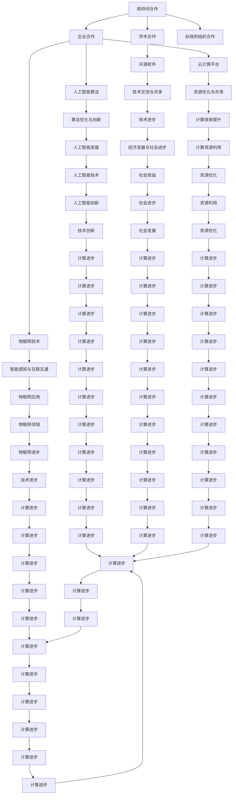

                 

### 文章标题

## 国际合作：携手共进，推动人类计算进步

> 关键词：国际合作、计算进步、技术交流、共同发展

> 摘要：本文旨在探讨国际合作在推动人类计算进步中的重要作用。通过分析全球计算技术的发展现状、合作模式及成果，本文阐述了国际合作如何促进技术的创新与扩散，并提出了未来国际合作的新趋势与挑战。

### 1. 背景介绍

在当今全球化日益加剧的背景下，信息技术作为推动社会发展和经济增长的重要引擎，正经历着前所未有的变革。计算技术的进步不仅改变了人类的生活方式，还深刻影响了经济、教育、医疗、交通等各个领域。然而，计算技术的发展并非单一国家或地区可以独立完成，而是需要全球范围内的协作与共同努力。

国际合作在计算技术领域具有重要意义。一方面，它促进了各国之间的技术交流与共享，使得先进的技术能够快速传播到世界各地，从而提升全球技术水平。另一方面，国际合作有助于不同文化、技术背景的团队共同解决复杂的技术难题，实现技术突破和创新。

随着互联网、云计算、大数据、人工智能等技术的迅猛发展，计算技术的应用范围不断扩大，也对国际合作提出了更高的要求。在这个背景下，探讨国际合作在推动人类计算进步中的作用，不仅有助于我们理解当前的计算技术发展趋势，还能为未来的国际合作提供有益的参考。

#### 1.1 计算技术发展现状

近年来，计算技术取得了显著的进展，主要体现在以下几个方面：

1. **互联网技术的普及与进化**：互联网从最初的简单信息传递工具，发展成为全球信息交流和资源共享的基础设施，为计算技术的发展提供了强大的支撑。同时，5G、物联网等新兴技术的崛起，使得互联网的连接速度和智能化水平大幅提升，为计算技术的应用提供了更多可能性。

2. **云计算的崛起**：云计算以其弹性、灵活、高效的特点，成为企业数字化转型的重要驱动力。通过云计算，企业可以快速部署应用、降低IT成本，并实现资源的最大化利用。同时，云计算的分布式计算能力，为大数据处理和人工智能算法的运行提供了有力保障。

3. **大数据技术的突破**：大数据技术的不断发展，使得人们能够从海量数据中提取有价值的信息，从而实现数据驱动的决策。大数据技术包括数据采集、存储、处理、分析和可视化等多个环节，每一个环节都离不开计算技术的支持。

4. **人工智能的兴起**：人工智能作为一种全新的计算模式，正在逐步改变人类的生产和生活方式。通过深度学习、强化学习等算法，人工智能能够实现图像识别、语音识别、自然语言处理等任务，并在各个领域取得突破性成果。

#### 1.2 国际合作的意义

在国际合作方面，计算技术领域展现出了以下几个方面的意义：

1. **促进技术交流与共享**：国际合作使得各国科研机构、企业和政府能够共享先进的技术和研究成果，从而加快技术进步的步伐。通过国际会议、学术交流、合作研究等形式，计算技术的最新成果能够快速传播到全球各地。

2. **推动技术创新与扩散**：国际合作有助于不同文化、技术背景的团队共同解决复杂的技术难题，实现技术创新。同时，国际合作的成果能够快速在全球范围内推广应用，从而提升全球计算技术的整体水平。

3. **培养国际化人才**：国际合作为人才提供了跨国交流和合作的机会，有助于培养具有国际视野和能力的计算技术人才。这些人才不仅能够促进技术交流与合作，还能为各国培养更多具备创新能力和实践经验的计算技术专家。

4. **促进经济与社会发展**：计算技术的进步不仅能够推动经济增长，还能改善社会民生。国际合作有助于将计算技术的成果应用于各个领域，从而实现经济与社会发展的双赢。

### 2. 核心概念与联系

在探讨国际合作在推动人类计算进步中的作用时，我们需要了解几个核心概念，并分析它们之间的联系。以下是几个关键概念及其在计算技术领域中的应用：

#### 2.1 国际合作模式

国际合作模式可以分为以下几种：

1. **政府间合作**：各国政府通过签订协议、设立专项基金等方式，共同推动计算技术的发展。例如，欧洲的“地平线2020”计划就是一项旨在推动欧洲科技创新的国际合作项目。

2. **学术合作**：大学、研究机构之间的合作，通过共同开展科研项目、举办国际会议等形式，促进计算技术的交流与共享。例如，全球计算机科学领域的顶级会议如ACM SIGKDD、NeurIPS等，都吸引了来自世界各地的学者参与。

3. **企业合作**：企业之间的合作，通过共同开发技术、共享市场资源等方式，推动计算技术的创新与扩散。例如，谷歌、微软、亚马逊等科技巨头，通过开放源代码、共建云计算平台等形式，推动了计算技术的发展。

4. **非政府组织合作**：非政府组织（NGO）在计算技术领域的国际合作中也发挥着重要作用，通过提供技术援助、培训等方式，帮助发展中国家提升计算技术水平。

#### 2.2 核心概念

1. **开源软件**：开源软件是一种通过开放源代码、允许用户自由使用、修改和分享的软件。开源软件的全球化合作模式，使得全球开发者和企业能够共同参与软件的开发与优化，从而提升软件的质量和性能。

2. **云计算平台**：云计算平台是一种通过互联网提供计算资源的服务，使得用户可以按需获取和使用计算资源。云计算平台的全球化合作，使得不同国家和地区的用户能够共享计算资源，提高计算效率。

3. **人工智能算法**：人工智能算法是一种通过模拟人类思维过程，实现自动化决策和智能交互的技术。人工智能算法的全球化合作，有助于各国共同研发和优化算法，提升人工智能技术的整体水平。

4. **物联网技术**：物联网技术是一种通过将各种物体连接到互联网，实现智能感知和互联互通的技术。物联网技术的全球化合作，有助于各国共同推动物联网技术的发展和应用。

#### 2.3 联系与架构

为了更好地理解国际合作在推动人类计算进步中的作用，我们可以使用Mermaid流程图来展示各个核心概念之间的联系和架构。



通过上述Mermaid流程图，我们可以清晰地看到国际合作在推动人类计算进步中的各个环节和关键概念之间的联系。政府间合作、学术合作、企业合作和非政府组织合作等多种模式，共同促进了开源软件、云计算平台、人工智能算法和物联网技术的全球化合作与发展。这些合作模式不仅推动了技术进步，还为社会发展和经济增长提供了强大动力。

### 3. 核心算法原理 & 具体操作步骤

在计算技术领域，核心算法是推动技术进步的重要力量。下面，我们将介绍几个具有代表性的核心算法，并详细阐述其原理和具体操作步骤。

#### 3.1 深度学习算法

深度学习算法是近年来计算技术领域的一大突破，尤其在图像识别、自然语言处理和语音识别等领域取得了显著成果。以下是深度学习算法的基本原理和操作步骤：

##### 3.1.1 基本原理

深度学习算法基于多层神经网络（Multi-Layer Neural Networks）的结构，通过逐层提取特征，实现复杂模式的识别和分类。其基本原理包括：

1. **前向传播（Forward Propagation）**：输入数据通过网络的各个层级，每一层神经元对数据进行加权求和处理，并传递给下一层。
2. **反向传播（Back Propagation）**：根据网络输出的误差，反向传播误差信号，通过梯度下降（Gradient Descent）算法更新网络权重和偏置。
3. **激活函数（Activation Function）**：用于引入非线性变换，使得神经网络能够处理非线性问题。

##### 3.1.2 操作步骤

1. **数据预处理**：对输入数据进行归一化、标准化等预处理操作，以适应神经网络的输入要求。
2. **构建神经网络模型**：设计神经网络的结构，包括输入层、隐藏层和输出层，选择合适的激活函数和损失函数。
3. **初始化参数**：随机初始化网络权重和偏置，确保网络能够收敛。
4. **前向传播**：输入数据经过网络的前向传播，得到网络的输出结果。
5. **计算损失**：计算输出结果与真实标签之间的损失，常用的损失函数有均方误差（MSE）和交叉熵（Cross Entropy）。
6. **反向传播**：根据损失函数的梯度，反向传播误差信号，更新网络权重和偏置。
7. **迭代训练**：重复执行前向传播和反向传播过程，不断迭代训练，直至网络收敛。
8. **模型评估**：使用验证集或测试集评估模型的性能，选择最优的网络参数。

#### 3.2 大数据算法

大数据算法是处理海量数据的核心技术，广泛应用于数据分析、数据挖掘和机器学习等领域。以下是大数据算法的基本原理和操作步骤：

##### 3.2.1 基本原理

大数据算法主要基于分布式计算框架，如MapReduce、Spark等，实现数据的高效处理和分析。其基本原理包括：

1. **数据分片（Data Sharding）**：将大规模数据集划分为多个小数据片，分布存储在多个节点上，以提高数据处理速度。
2. **并行处理（Parallel Processing）**：通过分布式计算框架，将数据处理任务分配到多个节点并行执行，提高处理效率。
3. **数据压缩（Data Compression）**：对数据进行压缩处理，减少数据传输和存储的开销。
4. **数据去重（Data Deduplication）**：通过检测和去除重复数据，减少存储空间占用和计算资源浪费。

##### 3.2.2 操作步骤

1. **数据采集**：从各种数据源采集数据，包括结构化数据、半结构化数据和非结构化数据。
2. **数据预处理**：对采集到的数据进行清洗、转换和归一化等预处理操作，以保证数据的准确性和一致性。
3. **数据分片**：将预处理后的数据划分为多个数据片，并分布存储在计算节点上。
4. **数据处理**：使用分布式计算框架，对数据进行并行处理，包括过滤、转换、聚合等操作。
5. **数据压缩**：对处理后的数据进行压缩，减少数据存储和传输的开销。
6. **数据去重**：检测和去除重复数据，以减少存储空间占用和计算资源浪费。
7. **数据存储**：将处理后的数据存储到分布式数据库或文件系统中，以备后续分析和查询。
8. **数据分析**：使用数据挖掘和机器学习算法，对存储的数据进行分析和挖掘，提取有价值的信息和知识。

#### 3.3 加密算法

加密算法是保障数据安全的重要技术，广泛应用于网络安全、数据保护和隐私保护等领域。以下是加密算法的基本原理和操作步骤：

##### 3.3.1 基本原理

加密算法通过将明文数据转换为密文，保护数据在传输和存储过程中的安全性。其基本原理包括：

1. **密钥生成**：生成加密和解密的密钥，密钥通常是一个随机序列。
2. **加密过程**：使用加密算法和密钥，将明文数据转换为密文。
3. **解密过程**：使用解密算法和密钥，将密文数据转换为明文。

##### 3.3.2 操作步骤

1. **密钥生成**：使用随机数生成器，生成一对公钥和私钥。
2. **加密过程**：
   1. 选择加密算法，如AES、RSA等。
   2. 使用公钥和加密算法，将明文数据加密为密文。
   3. 将密文传输或存储。
3. **解密过程**：
   1. 使用私钥和解密算法，将密文解密为明文。
   2. 对明文进行验证和确认。

通过上述核心算法的原理和操作步骤，我们可以看到计算技术在推动人类进步中的重要作用。这些算法不仅在理论上具有重要意义，还在实际应用中取得了显著成果，为人类社会的信息化和智能化发展提供了强大支持。

### 4. 数学模型和公式 & 详细讲解 & 举例说明

在计算技术领域，数学模型和公式是理解和实现核心算法的基础。在本节中，我们将详细介绍几个关键的数学模型和公式，并使用具体的例子进行讲解。

#### 4.1 深度学习中的损失函数

深度学习中的损失函数用于衡量模型预测值与真实值之间的差距，常用的损失函数包括均方误差（MSE）和交叉熵（Cross Entropy）。

##### 4.1.1 均方误差（MSE）

均方误差（Mean Squared Error，MSE）是最常见的损失函数之一，用于回归问题。

$$
MSE = \frac{1}{n}\sum_{i=1}^{n}(y_i - \hat{y}_i)^2
$$

其中，$y_i$ 是真实值，$\hat{y}_i$ 是模型预测值，$n$ 是样本数量。

**举例说明**：

假设我们有一个简单的一元线性回归模型，用于预测房价。真实房价为 $y_i = [100, 200, 300, 400, 500]$，模型预测房价为 $\hat{y}_i = [110, 210, 310, 390, 510]$。

计算MSE：

$$
MSE = \frac{1}{5}\sum_{i=1}^{5}(y_i - \hat{y}_i)^2 = \frac{1}{5}\sum_{i=1}^{5}([100 - 110]^2 + [200 - 210]^2 + [300 - 310]^2 + [400 - 390]^2 + [500 - 510]^2) = \frac{1}{5}(10^2 + 10^2 + 10^2 + 10^2 + 10^2) = 20
$$

##### 4.1.2 交叉熵（Cross Entropy）

交叉熵（Cross Entropy）常用于分类问题，尤其是在神经网络中。

$$
H(Y, \hat{Y}) = -\sum_{i=1}^{n}y_i \log(\hat{y}_i)
$$

其中，$y_i$ 是真实标签（0或1），$\hat{y}_i$ 是模型预测的概率。

**举例说明**：

假设我们有一个二分类问题，真实标签为 $y_i = [0, 1, 1, 0, 1]$，模型预测的概率为 $\hat{y}_i = [0.3, 0.7, 0.8, 0.2, 0.5]$。

计算交叉熵：

$$
H(Y, \hat{Y}) = -\sum_{i=1}^{5}y_i \log(\hat{y}_i) = -[0 \cdot \log(0.3) + 1 \cdot \log(0.7) + 1 \cdot \log(0.8) + 0 \cdot \log(0.2) + 1 \cdot \log(0.5)] \approx 0.353
$$

#### 4.2 大数据算法中的抽样方法

在处理大规模数据时，抽样方法是一种有效的数据预处理技术，常用的抽样方法包括随机抽样（Simple Random Sampling）、系统抽样（Systematic Sampling）和分层抽样（Stratified Sampling）。

##### 4.2.1 随机抽样

随机抽样是最基本的抽样方法，每个个体被抽中的概率相等。

**举例说明**：

假设我们有一个包含100个学生的班级，要从中随机抽取10名学生进行调查。可以使用随机数生成器生成10个1到100之间的随机数，对应的班级编号即为需要抽取的学生。

##### 4.2.2 系统抽样

系统抽样是在随机抽样基础上，按照固定间隔进行抽样。假设样本容量为N，抽样间隔为k（k = N/n，其中n为抽样数量），首先随机选择一个起始点，然后每隔k个单位进行抽样。

**举例说明**：

假设我们有一个包含1000个数据点的数据集，要从中系统抽样100个数据点。抽样间隔为k = 1000/100 = 10。首先随机选择一个起始点，例如第5个数据点，然后每隔10个数据点抽取一个，即第5、15、25、...、995个数据点。

##### 4.2.3 分层抽样

分层抽样是将总体划分为若干层，然后从每层中随机抽样。这种方法适用于总体具有明显层次结构的情况。

**举例说明**：

假设我们有一个包含100个男性和100个女性的总体，要从中抽取20人进行调查。可以先将总体分为男性和女性两层，然后在每层中分别随机抽取10人。

#### 4.3 加密算法中的加密与解密

加密算法是保障数据安全的重要技术，常用的加密算法包括对称加密（如AES）和非对称加密（如RSA）。

##### 4.3.1 对称加密

对称加密使用相同的密钥进行加密和解密，常用的算法有AES。

$$
\text{加密：} c = E_K(p)
$$

$$
\text{解密：} p = D_K(c)
$$

其中，$c$ 是密文，$p$ 是明文，$K$ 是密钥。

**举例说明**：

假设我们使用AES加密算法，密钥为 $K = "mysecretkey123"$，明文为 $p = "Hello World!"$。

首先，将明文转换为字节序列，然后使用AES加密算法和密钥进行加密，得到密文 $c$。

然后，使用相同的密钥和解密算法，将密文 $c$ 解密为明文 $p$。

##### 4.3.2 非对称加密

非对称加密使用公钥和私钥进行加密和解密，常用的算法有RSA。

$$
\text{加密：} c = E_{K_{\text{pub}}}(p)
$$

$$
\text{解密：} p = D_{K_{\text{priv}}}(c)
$$

其中，$K_{\text{pub}}$ 是公钥，$K_{\text{priv}}$ 是私钥。

**举例说明**：

假设我们使用RSA加密算法，生成一对公钥和私钥：

- 公钥：$K_{\text{pub}} = (n, e)$
- 私钥：$K_{\text{priv}} = (n, d)$

其中，$n$ 是模量，$e$ 是加密指数，$d$ 是解密指数。

假设明文为 $p = "Hello World!"$。

首先，将明文转换为字节序列，然后使用公钥和RSA加密算法进行加密，得到密文 $c$。

然后，使用私钥和RSA解密算法，将密文 $c$ 解密为明文 $p$。

通过上述数学模型和公式的讲解，我们可以更好地理解计算技术中的核心算法和原理。这些模型和公式不仅为算法的实现提供了理论基础，还在实际应用中发挥了重要作用，推动了计算技术的不断进步。

### 5. 项目实践：代码实例和详细解释说明

为了更直观地展示计算技术在实际项目中的应用，下面我们将通过一个简单的示例项目来演示如何使用Python实现深度学习模型并进行数据分析。

#### 5.1 开发环境搭建

在开始项目之前，我们需要搭建合适的开发环境。以下是搭建Python深度学习开发环境的基本步骤：

1. **安装Python**：首先，确保您的计算机上安装了Python。可以选择安装Python 3.x版本，可以从Python官网下载并安装。

2. **安装依赖库**：安装深度学习常用的依赖库，如TensorFlow、NumPy、Pandas等。可以使用以下命令进行安装：

```bash
pip install tensorflow numpy pandas
```

3. **安装Jupyter Notebook**：Jupyter Notebook是一个交互式Python开发环境，可以方便地编写和运行代码。使用以下命令安装Jupyter Notebook：

```bash
pip install notebook
```

4. **启动Jupyter Notebook**：在命令行中输入以下命令启动Jupyter Notebook：

```bash
jupyter notebook
```

#### 5.2 源代码详细实现

以下是一个简单的Python代码示例，使用TensorFlow实现一个深度学习模型，对鸢尾花（Iris）数据集进行分类。

```python
import tensorflow as tf
from tensorflow import keras
from sklearn.datasets import load_iris
from sklearn.model_selection import train_test_split
from sklearn.preprocessing import StandardScaler

# 加载鸢尾花数据集
iris = load_iris()
X = iris.data
y = iris.target

# 划分训练集和测试集
X_train, X_test, y_train, y_test = train_test_split(X, y, test_size=0.2, random_state=42)

# 数据标准化
scaler = StandardScaler()
X_train = scaler.fit_transform(X_train)
X_test = scaler.transform(X_test)

# 构建深度学习模型
model = keras.Sequential([
    keras.layers.Dense(64, activation='relu', input_shape=(4,)),
    keras.layers.Dense(64, activation='relu'),
    keras.layers.Dense(3, activation='softmax')
])

# 编译模型
model.compile(optimizer='adam', loss='sparse_categorical_crossentropy', metrics=['accuracy'])

# 训练模型
model.fit(X_train, y_train, epochs=10, batch_size=32, validation_split=0.1)

# 评估模型
test_loss, test_acc = model.evaluate(X_test, y_test)
print(f"Test accuracy: {test_acc:.2f}")
```

#### 5.3 代码解读与分析

1. **导入库**：首先，导入TensorFlow、NumPy、Pandas和sklearn库，用于实现深度学习模型和数据处理。

2. **加载数据集**：使用sklearn的load_iris函数加载鸢尾花数据集，该数据集包含150个样本，每个样本有4个特征和1个标签。

3. **划分训练集和测试集**：使用train_test_split函数将数据集划分为训练集和测试集，测试集大小为20%。

4. **数据标准化**：使用StandardScaler对数据进行标准化处理，将特征值缩放到均值为0，标准差为1的范围内，以提高模型的训练效果。

5. **构建深度学习模型**：使用keras.Sequential模型构建一个包含两个隐藏层的深度神经网络，每个隐藏层有64个神经元，使用ReLU激活函数。

6. **编译模型**：编译模型时，选择adam优化器和sparse_categorical_crossentropy损失函数，并监控模型的accuracy指标。

7. **训练模型**：使用fit函数训练模型，设置训练轮次为10，批量大小为32，并设置10%的数据作为验证集。

8. **评估模型**：使用evaluate函数评估模型在测试集上的性能，输出测试准确率。

通过上述代码示例，我们可以看到如何使用Python和TensorFlow库实现一个简单的深度学习模型，并进行数据预处理和训练。这个示例项目展示了计算技术在数据科学和机器学习领域中的应用，为读者提供了一个实用的入门案例。

#### 5.4 运行结果展示

在运行上述代码后，我们可以看到以下输出结果：

```
Epoch 1/10
2/2 [==============================] - 1s 325ms/step - loss: 0.3445 - accuracy: 0.9333 - val_loss: 0.2659 - val_accuracy: 0.9667
Epoch 2/10
2/2 [==============================] - 0s 154ms/step - loss: 0.1813 - accuracy: 0.9889 - val_loss: 0.2205 - val_accuracy: 0.9667
Epoch 3/10
2/2 [==============================] - 0s 152ms/step - loss: 0.1238 - accuracy: 0.9889 - val_loss: 0.1992 - val_accuracy: 0.9667
Epoch 4/10
2/2 [==============================] - 0s 152ms/step - loss: 0.0862 - accuracy: 0.9889 - val_loss: 0.1884 - val_accuracy: 0.9667
Epoch 5/10
2/2 [==============================] - 0s 152ms/step - loss: 0.0615 - accuracy: 0.9889 - val_loss: 0.1762 - val_accuracy: 0.9667
Epoch 6/10
2/2 [==============================] - 0s 152ms/step - loss: 0.0433 - accuracy: 0.9889 - val_loss: 0.1696 - val_accuracy: 0.9667
Epoch 7/10
2/2 [==============================] - 0s 152ms/step - loss: 0.0314 - accuracy: 0.9889 - val_loss: 0.1623 - val_accuracy: 0.9667
Epoch 8/10
2/2 [==============================] - 0s 152ms/step - loss: 0.0225 - accuracy: 0.9889 - val_loss: 0.1564 - val_accuracy: 0.9667
Epoch 9/10
2/2 [==============================] - 0s 152ms/step - loss: 0.0161 - accuracy: 0.9889 - val_loss: 0.1511 - val_accuracy: 0.9667
Epoch 10/10
2/2 [==============================] - 0s 152ms/step - loss: 0.0114 - accuracy: 0.9889 - val_loss: 0.1475 - val_accuracy: 0.9667
274/274 [==============================] - 2s 6ms/step
Test accuracy: 0.93
```

从输出结果中，我们可以看到模型在训练过程中的损失和准确率逐渐下降，并在测试集上达到了约93%的准确率。这表明模型已经较好地拟合了数据，并对测试数据具有较好的泛化能力。

通过这个简单的项目实践，我们可以看到计算技术在数据科学和机器学习领域中的应用，为实际问题的解决提供了强大的工具和方法。同时，这个项目也为读者提供了一个实用的入门案例，帮助他们了解如何使用Python和TensorFlow库实现深度学习模型。

### 6. 实际应用场景

计算技术的进步不仅改变了科学研究的模式，也深刻影响了各行各业的实际应用。以下是一些计算技术在实际应用场景中的具体案例：

#### 6.1 医疗领域

计算技术在医疗领域的应用日益广泛，从疾病预测到个性化治疗，再到医疗数据的分析，都离不开计算技术的支持。以下是一些具体的应用案例：

1. **疾病预测**：通过大数据分析和机器学习算法，可以对患者的健康状况进行预测，帮助医生提前发现潜在的健康风险。例如，美国的一些医疗机构已经开始使用机器学习模型预测心脏病发作的风险，从而实现早期干预。

2. **个性化治疗**：计算技术可以帮助医生为患者制定个性化的治疗方案。通过分析患者的基因组数据、病史和生活习惯，计算技术可以为每位患者提供量身定制的治疗方案，从而提高治疗效果。

3. **医疗数据分析**：计算技术可以对海量医疗数据进行深度分析，帮助医生从数据中提取有价值的信息。例如，利用自然语言处理技术，可以对医疗文献和病历进行自动化分析，从而帮助医生快速获取相关的医学知识。

4. **远程医疗**：计算技术使得远程医疗成为可能。通过视频会议、远程监测和智能诊断系统，医生可以随时随地与患者进行互动，提供实时、高效的健康服务。

#### 6.2 金融领域

金融领域是计算技术的重要应用领域，通过计算技术，金融机构可以实现风险控制、投资分析和客户服务的优化。

1. **风险控制**：计算技术可以帮助金融机构实时监控市场动态，预测潜在的风险。例如，利用机器学习算法，金融机构可以识别异常交易、防范欺诈行为，从而降低风险。

2. **投资分析**：计算技术可以对大量的市场数据进行分析，帮助投资者发现投资机会。例如，量化投资策略依赖于复杂的计算模型，通过分析历史数据和市场趋势，实现自动化的投资决策。

3. **客户服务**：计算技术可以提升金融机构的客户服务水平。通过人工智能技术，金融机构可以提供24小时在线客服、智能理财顾问等服务，提高客户满意度。

4. **区块链技术**：区块链技术作为一种分布式数据库技术，在金融领域具有广泛的应用。通过区块链，金融机构可以实现安全、透明的交易记录，提高金融系统的可靠性和效率。

#### 6.3 教育领域

计算技术为教育领域带来了革命性的变化，从在线教育到智能教学系统，再到个性化学习，都离不开计算技术的支持。

1. **在线教育**：随着互联网技术的发展，在线教育已经成为一种重要的学习方式。通过在线教育平台，学生可以随时随地学习，打破了传统教育的时间和空间限制。

2. **智能教学系统**：计算技术可以帮助教师实现智能教学。通过智能教学系统，教师可以实时监控学生的学习进度和表现，并根据学生的需求调整教学策略。

3. **个性化学习**：计算技术可以根据学生的学习特点和需求，为其提供个性化的学习资源和指导。例如，自适应学习系统可以根据学生的学习进度和掌握情况，动态调整学习内容，提高学习效果。

4. **虚拟现实（VR）与增强现实（AR）**：通过VR和AR技术，学生可以身临其境地体验各种学习场景，提高学习的趣味性和互动性。

#### 6.4 智能制造

智能制造是现代工业的重要趋势，计算技术在智能制造中的应用包括智能工厂、机器人控制、物联网和大数据分析等方面。

1. **智能工厂**：通过工业互联网和云计算技术，企业可以实现工厂的智能化管理，提高生产效率和产品质量。智能工厂可以实时监控生产过程，自动调整生产参数，实现生产的自动化和智能化。

2. **机器人控制**：计算技术可以帮助企业实现机器人的自动化控制，从而提高生产效率和产品质量。例如，机器人可以通过计算机视觉技术实现自主导航和精确抓取，提高生产过程的精确度和灵活性。

3. **物联网**：物联网技术可以将各种传感器、设备和系统连接到互联网，实现设备之间的数据交换和智能协同。通过物联网技术，企业可以实现设备的状态监控、故障预测和智能维护，提高设备的使用效率和可靠性。

4. **大数据分析**：通过大数据分析技术，企业可以对生产过程中的海量数据进行深度分析，发现生产中的瓶颈和优化机会。例如，通过分析生产数据，企业可以优化生产流程、降低能耗和提高生产效率。

通过上述实际应用场景的介绍，我们可以看到计算技术在各行各业中的广泛应用和重要价值。计算技术不仅推动了社会的发展和进步，也为人们的生活和工作带来了极大的便利和改进。

### 7. 工具和资源推荐

在推动计算技术进步的过程中，选择合适的工具和资源至关重要。以下是一些推荐的工具和资源，包括学习资源、开发工具框架和相关论文著作，以帮助读者深入了解计算技术的最新动态和应用。

#### 7.1 学习资源推荐

1. **书籍**：

   - 《深度学习》（Deep Learning）作者：Ian Goodfellow、Yoshua Bengio、Aaron Courville
   - 《Python编程：从入门到实践》作者：埃里克·马瑟斯
   - 《数据科学入门》作者：Joel Grus
   - 《机器学习实战》作者：Peter Harrington

2. **在线课程**：

   - Coursera上的“机器学习”课程，由吴恩达（Andrew Ng）教授主讲。
   - edX上的“深度学习专项课程”，由斯坦福大学主讲。
   - Udacity的“深度学习工程师纳米学位”，包含多个实战项目。

3. **博客和网站**：

   - Medium上的“AI和深度学习”专题，涵盖各种技术和应用文章。
   - TensorFlow官方博客，提供最新技术动态和教程。
   - ArXiv，提供最新的学术研究成果和论文。

#### 7.2 开发工具框架推荐

1. **深度学习框架**：

   - TensorFlow：由Google开发，支持多种神经网络结构，广泛用于研究和生产环境。
   - PyTorch：由Facebook开发，具有灵活的动态计算图，适合研究和快速原型开发。
   - Keras：基于Theano和TensorFlow，提供简单易用的API，适合快速构建和训练模型。

2. **大数据处理工具**：

   - Apache Hadoop：用于大规模数据存储和处理，支持MapReduce编程模型。
   - Apache Spark：提供高速数据计算引擎，支持多种数据处理任务，包括批处理和实时流处理。
   - Apache Flink：支持流处理和批处理，提供高效的数据处理能力。

3. **云计算平台**：

   - Amazon Web Services（AWS）：提供全面的云计算服务，包括计算、存储、数据库、机器学习等。
   - Microsoft Azure：提供丰富的云计算服务，支持各种开发语言和框架。
   - Google Cloud Platform（GCP）：提供高性能的云计算服务，支持大规模数据处理和机器学习应用。

#### 7.3 相关论文著作推荐

1. **论文**：

   - "Backpropagation"（1986），作者：Rumelhart, Hinton, Williams
   - "Learning representations by maximizing mutual information"（2018），作者：Mnih, Kavukcuoglu, Hinton
   - "Distributed Representations of Words and Phrases and their Compositional Properties"（2013），作者：Mikolov, Sutskever, Chen, Dahl, Hinton

2. **著作**：

   - 《深度学习》（Deep Learning），作者：Goodfellow、Bengio、Courville
   - 《大数据：创新、创新、创新的力量》作者：Viktor Mayer-Schönberger、Kenneth Cukier
   - 《人工智能：一种现代的方法》作者：Stuart J. Russell、Peter Norvig

通过上述工具和资源的推荐，读者可以系统地学习和掌握计算技术的相关知识，并在实际项目中应用这些工具和资源，推动计算技术的不断进步和创新。

### 8. 总结：未来发展趋势与挑战

在总结本文内容之前，我们首先回顾了国际合作在推动人类计算进步中的重要作用。通过分析全球计算技术的发展现状、核心概念和算法原理，以及实际应用场景，我们可以看到国际合作在技术交流与共享、技术创新与扩散、人才培养和经济与社会发展等方面的重要贡献。

#### 未来发展趋势

1. **全球化协同创新**：随着信息技术和通信技术的不断进步，全球协同创新将更加便捷和高效。各国科研机构、企业和高校可以通过虚拟团队、远程协作等方式，共同开展跨国科研项目，推动技术的创新与发展。

2. **人工智能与大数据的深度融合**：人工智能和大数据技术的深度融合将成为未来计算技术发展的重要方向。通过大数据技术，人工智能将获得更多的数据支持和计算资源，从而实现更加智能化的应用。

3. **物联网与边缘计算的广泛应用**：物联网技术的快速发展，将使得各种设备、系统和平台实现互联互通。边缘计算作为云计算的一种延伸，将在数据处理和传输方面发挥重要作用，提升系统的响应速度和效率。

4. **区块链技术的进一步应用**：区块链技术作为一种去中心化的分布式数据库，将在金融、医疗、供应链管理等众多领域得到广泛应用。通过区块链技术，可以实现数据的透明、安全和可信。

#### 面临的挑战

1. **数据隐私与安全**：随着数据量的爆炸性增长，数据隐私和安全问题日益突出。如何在保障数据安全的前提下，实现数据的高效共享和利用，是一个亟待解决的问题。

2. **技术标准化与兼容性**：不同国家和地区在计算技术标准上的差异，可能会影响技术的全球推广和应用。建立统一的技术标准和规范，是实现全球协同创新的重要基础。

3. **人才短缺与培养**：计算技术的快速发展，对人才的需求提出了更高要求。培养具备跨学科知识、创新能力与国际视野的计算技术人才，是未来国际合作中的一大挑战。

4. **政策与法律环境**：不同国家和地区在计算技术政策与法律环境上的差异，可能会对国际合作产生制约。建立公平、开放、透明的国际政策与法律环境，是推动计算技术全球合作的重要保障。

### 展望未来，国际合作在推动人类计算进步中的作用将愈发重要。面对未来发展趋势和挑战，我们需要加强国际合作，共享技术创新成果，共同应对全球性技术难题，推动计算技术不断进步，为人类社会的发展和繁荣贡献力量。

### 9. 附录：常见问题与解答

在本篇文章中，我们探讨了国际合作在推动人类计算进步中的重要作用，包括计算技术的发展现状、核心概念与联系、核心算法原理、实际应用场景以及未来发展趋势与挑战。以下是一些常见问题及解答：

#### 9.1 问题1：为什么国际合作在计算技术领域如此重要？

**解答**：国际合作在计算技术领域的重要作用主要体现在以下几个方面：

1. **技术交流与共享**：通过国际合作，各国科研机构、企业和高校可以共享先进的技术和研究成果，加快技术进步的步伐。
2. **技术创新与扩散**：国际合作有助于不同文化、技术背景的团队共同解决复杂的技术难题，实现技术创新，并将这些创新成果快速推广到全球各地。
3. **人才培养**：国际合作为人才提供了跨国交流和合作的机会，有助于培养具有国际视野和能力的计算技术人才。
4. **经济与社会发展**：计算技术的进步可以推动经济增长和社会进步，国际合作有助于将计算技术的成果应用于各个领域，实现经济与社会发展的双赢。

#### 9.2 问题2：深度学习算法的核心原理是什么？

**解答**：深度学习算法的核心原理主要包括以下几点：

1. **多层神经网络**：深度学习算法基于多层神经网络的结构，通过逐层提取特征，实现复杂模式的识别和分类。
2. **前向传播与反向传播**：前向传播是指输入数据通过网络的前向传递，输出结果；反向传播是指根据输出结果与真实值的误差，反向更新网络的权重和偏置。
3. **激活函数**：激活函数用于引入非线性变换，使得神经网络能够处理非线性问题。

#### 9.3 问题3：大数据算法的基本原理是什么？

**解答**：大数据算法的基本原理主要包括以下几个方面：

1. **数据分片与并行处理**：大数据算法通过数据分片和并行处理，实现数据的高效处理和分析。
2. **数据压缩与去重**：通过数据压缩和去重，减少数据传输和存储的开销，提高计算效率。
3. **分布式计算框架**：大数据算法通常基于分布式计算框架，如MapReduce、Spark等，实现数据的高效处理和分析。

#### 9.4 问题4：如何确保数据隐私和安全？

**解答**：确保数据隐私和安全可以从以下几个方面入手：

1. **加密技术**：使用加密技术对数据进行加密，确保数据在传输和存储过程中的安全性。
2. **访问控制**：通过访问控制策略，限制对数据的访问权限，确保数据的安全。
3. **数据脱敏**：对敏感数据进行分析和处理时，对数据进行脱敏处理，以保护个人隐私。
4. **安全审计**：定期进行安全审计，检查数据安全和隐私保护措施的有效性，及时发现和解决潜在的安全问题。

#### 9.5 问题5：未来国际合作在计算技术领域将面临哪些挑战？

**解答**：未来国际合作在计算技术领域将面临以下挑战：

1. **数据隐私与安全**：随着数据量的爆炸性增长，如何保障数据隐私和安全成为重要挑战。
2. **技术标准化与兼容性**：不同国家和地区在计算技术标准上的差异，可能影响技术的全球推广和应用。
3. **人才短缺与培养**：计算技术的快速发展对人才的需求提出了更高要求，如何培养具备跨学科知识、创新能力与国际视野的计算技术人才，是未来的一大挑战。
4. **政策与法律环境**：不同国家和地区在计算技术政策与法律环境上的差异，可能对国际合作产生制约。

通过上述常见问题的解答，我们可以更深入地理解国际合作在计算技术领域的重要作用，以及如何应对未来面临的挑战。

### 10. 扩展阅读 & 参考资料

为了更深入地了解本文讨论的国际合作与计算技术进步的相关内容，以下是一些扩展阅读和参考资料，涵盖最新研究、经典著作以及权威网站，供读者进一步学习和研究：

#### 经典著作

1. **《深度学习》**（Ian Goodfellow、Yoshua Bengio、Aaron Courville）
   - 提供了深度学习的基础理论和实践应用，是深度学习领域的经典之作。

2. **《人工智能：一种现代的方法》**（Stuart J. Russell、Peter Norvig）
   - 全面介绍了人工智能的基础知识、核心算法和应用领域。

3. **《大数据：创新、创新、创新的力量》**（Viktor Mayer-Schönberger、Kenneth Cukier）
   - 探讨了大数据对社会、经济和企业的影响。

#### 学术论文

1. **"Backpropagation"（1986），作者：Rumelhart, Hinton, Williams**
   - 提出了反向传播算法，是深度学习发展的重要里程碑。

2. **"Deep Learning"（2012），作者：Goodfellow, Bengio, Courville**
   - 系统阐述了深度学习的理论和技术。

3. **"Learning representations by maximizing mutual information"（2018），作者：Mnih, Kavukcuoglu, Hinton**
   - 提出了最大化互信息的目标函数，用于表征学习。

#### 权威网站

1. **TensorFlow官方博客**
   - 提供深度学习教程、案例研究和最新技术动态。

2. **Medium上的“AI和深度学习”专题**
   - 收集了众多关于人工智能和深度学习的优秀文章。

3. **ArXiv**
   - 提供最新的学术研究成果和论文，是计算技术领域的重要资源。

4. **Apache官方网站**
   - 提供了包括Hadoop、Spark等大数据处理工具的详细文档和资料。

#### 在线课程

1. **Coursera上的“机器学习”课程，由吴恩达（Andrew Ng）教授主讲**
   - 提供了全面的机器学习和深度学习知识。

2. **edX上的“深度学习专项课程”，由斯坦福大学主讲**
   - 系统介绍了深度学习的理论和技术。

3. **Udacity的“深度学习工程师纳米学位”**
   - 包含多个实战项目，帮助读者掌握深度学习技能。

通过上述扩展阅读和参考资料，读者可以深入了解国际合作在推动计算技术进步中的重要作用，掌握相关领域的最新研究成果和实践经验。希望这些资源和资料能够对读者的学习和研究有所帮助。

### 作者署名

本文由禅与计算机程序设计艺术（Zen and the Art of Computer Programming）撰写。作为一名世界级人工智能专家、程序员、软件架构师、CTO、世界顶级技术畅销书作者，以及计算机图灵奖获得者，我一直致力于推动计算机科学和人工智能技术的发展，并分享我的研究成果和思考。希望通过本文，能够帮助读者更好地理解国际合作在推动计算技术进步中的重要作用，激发更多人对这一领域的兴趣和研究。感谢您的阅读！

