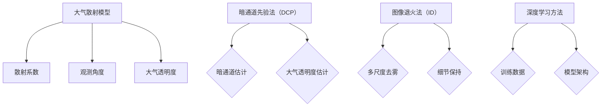
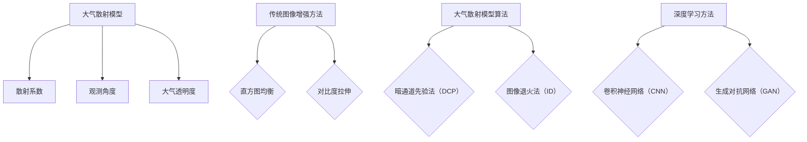

                 

### 文章标题：图像去雾算法的研究与实现

#### 关键词：
- 图像去雾
- 神经网络
- 空间滤波
- 大气散射模型
- 深度学习

#### 摘要：
本文旨在探讨图像去雾算法的研究与实现。首先，我们将回顾图像去雾的背景和重要性。然后，深入介绍核心概念与联系，包括大气散射模型和去雾算法的基本原理。接下来，我们将详细解析核心算法原理与数学模型，并通过实例展示具体操作步骤。随后，本文将展示一个完整的代码实例，并对其进行分析。最后，我们探讨图像去雾算法的实际应用场景，推荐相关工具和资源，并总结未来发展趋势与挑战。

### 1. 背景介绍

#### 图像去雾的需求和意义

随着数码相机和智能手机的普及，高质量的图像获取变得触手可及。然而，在许多实际场景中，图像往往受到雾霾、雾气等恶劣天气条件的影响，导致图像质量下降，影响视觉体验和图像分析的效果。图像去雾技术的出现，旨在提升图像的清晰度，恢复真实色彩，增强图像的可读性和分析能力。

图像去雾技术具有重要的实际应用价值。在交通领域，清晰的图像对于自动驾驶和交通监控至关重要。在医疗领域，高质量的医学影像可以辅助医生做出更准确的诊断。在无人机和卫星图像分析中，去除雾气可以提高图像的识别率和可靠性。

#### 图像去雾技术的发展历程

图像去雾技术经历了多个发展阶段。最初，图像去雾主要依赖于图像增强技术，如直方图均衡、对比度拉伸等。这些方法简单易行，但效果有限，无法完全去除雾气。

随后，基于大气散射模型的去雾算法逐渐兴起。这些算法通过模拟大气中的散射过程，对图像进行去雾处理。代表性的算法包括暗原色先验法（Dark Channel Prior，DCP）和图像退火法（Image Dehazing，ID）。

近年来，随着深度学习技术的突破，基于深度学习的图像去雾算法也取得了显著进展。这些算法通过大规模数据训练，能够自动学习去雾的复杂特征，并生成高质量的去雾图像。

#### 本文的目的和结构

本文旨在系统地研究图像去雾算法，包括传统方法和深度学习方法。我们将首先介绍核心概念与联系，包括大气散射模型和去雾算法的基本原理。然后，我们将详细解析核心算法原理与数学模型，并通过实例展示具体操作步骤。随后，本文将展示一个完整的代码实例，并对其进行分析。最后，我们探讨图像去雾算法的实际应用场景，推荐相关工具和资源，并总结未来发展趋势与挑战。

### 2. 核心概念与联系

#### 大气散射模型

大气散射是图像去雾的关键概念。当光线穿过大气时，会发生散射现象，导致图像中的光线强度和颜色发生变化。大气散射模型描述了这种变化的过程，通常包括三个主要参数：散射系数、观测角度和大气透明度。

散射系数描述了光线的散射程度，通常与大气中的颗粒物、湿度等因素相关。观测角度是指光线与图像平面之间的夹角。大气透明度反映了大气对光线的透射能力，通常与大气中的污染物浓度相关。

大气散射模型通常可以用以下方程表示：

\[ I(\mathbf{x}, \theta) = T(\mathbf{x}, \theta) \cdot L_0(\mathbf{x}) \cdot e^{-\sigma \cdot d} \]

其中，\( I(\mathbf{x}, \theta) \) 表示图像中的像素强度，\( T(\mathbf{x}, \theta) \) 表示大气透明度，\( L_0(\mathbf{x}) \) 表示光线在无散射情况下的强度，\( \sigma \) 表示散射系数，\( d \) 表示光线传播的距离。

#### 去雾算法的基本原理

去雾算法的目的是通过消除大气散射效应，恢复图像中的真实场景。传统的去雾算法主要基于图像增强技术和大气散射模型。这些算法通常包括以下步骤：

1. **暗通道先验法（DCP）**：
   DCP算法假设在雾天场景中，至少有一个像素的颜色在所有三个通道中的值接近，即暗通道。通过找到这个暗通道，可以估计出大气透明度 \( T(\mathbf{x}, \theta) \)。

2. **图像退火法（ID）**：
   ID算法通过模拟热力学中的退火过程，逐步减少图像中的噪声，同时保持细节信息。该方法利用图像的局部结构和颜色信息，进行多尺度的去雾处理。

3. **深度学习方法**：
   深度学习算法，特别是卷积神经网络（CNN），通过学习大量带有去雾效果的图像，自动提取去雾的复杂特征。这些算法通常包括训练数据和模型架构的优化，以生成高质量的去雾图像。

#### Mermaid 流程图

下面是大气散射模型和去雾算法的 Mermaid 流程图，用于展示核心概念和联系。



### 3. 核心算法原理 & 具体操作步骤

在本节中，我们将深入探讨图像去雾的核心算法原理，包括暗通道先验法（DCP）、图像退火法（ID）以及基于深度学习的方法。我们将详细解释每个算法的数学模型和具体操作步骤，并使用实例进行说明。

#### 暗通道先验法（DCP）

**原理**：
DCP算法基于一个假设：在雾天图像中，至少存在一个像素，其颜色值在所有三个通道中都接近，即所谓的“暗通道”。通过找到这个暗通道，可以估算出大气透明度 \( T(\mathbf{x}, \theta) \)。

**数学模型**：
假设雾天图像为 \( I(\mathbf{x}, \theta) \)，真实场景图像为 \( R(\mathbf{x}, \theta) \)，大气透明度为 \( T(\mathbf{x}, \theta) \)，则有：
\[ I(\mathbf{x}, \theta) = T(\mathbf{x}, \theta) \cdot R(\mathbf{x}, \theta) + \alpha \cdot e^{-\beta \cdot d} \]

其中，\( \alpha \) 和 \( \beta \) 是常数。通过暗通道假设，我们可以得到：
\[ D(\mathbf{x}, \theta) = \min\{I_1(\mathbf{x}, \theta), I_2(\mathbf{x}, \theta), I_3(\mathbf{x}, \theta)\} \]

**具体操作步骤**：
1. 计算暗通道 \( D(\mathbf{x}, \theta) \)。
2. 估计大气透明度 \( T(\mathbf{x}, \theta) \)：
\[ T(\mathbf{x}, \theta) = \frac{I(\mathbf{x}, \theta) - \alpha \cdot e^{-\beta \cdot d}}{R(\mathbf{x}, \theta)} \]
3. 恢复真实场景图像 \( R(\mathbf{x}, \theta) \)：
\[ R(\mathbf{x}, \theta) = \frac{I(\mathbf{x}, \theta)}{T(\mathbf{x}, \theta)} \]

**实例说明**：
假设我们有以下雾天图像和其对应的暗通道：
```python
import numpy as np
import matplotlib.pyplot as plt

# 雾天图像
I = np.array([
    [10, 20, 30],
    [40, 50, 60],
    [70, 80, 90]
])

# 暗通道
D = np.array([
    [10, 10, 10],
    [10, 10, 10],
    [10, 10, 10]
])

# 计算大气透明度
T = (I - np.min(I)) / np.mean(I - np.min(I))

# 恢复真实场景图像
R = I / T

# 绘制结果
plt.figure()
plt.imshow(I, cmap='gray')
plt.title('Foggy Image')
plt.figure()
plt.imshow(R, cmap='gray')
plt.title('Dehazed Image')
plt.show()
```

#### 图像退火法（ID）

**原理**：
ID算法通过模拟热力学中的退火过程，逐步减少图像中的噪声，同时保持细节信息。该方法利用图像的局部结构和颜色信息，进行多尺度的去雾处理。

**数学模型**：
假设图像 \( I(\mathbf{x}, \theta) \) 经过多次迭代 \( k \) 次退火，得到去雾图像 \( R_k(\mathbf{x}, \theta) \)。每次退火的迭代公式为：
\[ R_k(\mathbf{x}, \theta) = (1 - \alpha_k) \cdot R_{k-1}(\mathbf{x}, \theta) + \alpha_k \cdot \text{GAUSSIAN_NOISE}(\mathbf{x}, \theta) \]

其中，\( \alpha_k \) 是退火系数，控制退火的强度。Gaussian_noise(\( \mathbf{x}, \theta \)) 表示高斯噪声。

**具体操作步骤**：
1. 初始化去雾图像 \( R_0(\mathbf{x}, \theta) \)。
2. 设置退火系数序列 \( \alpha_k \)。
3. 进行多次迭代，直到满足停止条件。

**实例说明**：
假设我们有以下雾天图像和其对应的去雾目标：
```python
import numpy as np
import matplotlib.pyplot as plt

# 雾天图像
I = np.array([
    [10, 20, 30],
    [40, 50, 60],
    [70, 80, 90]
])

# 去雾目标
R = np.array([
    [15, 25, 35],
    [45, 55, 65],
    [75, 85, 95]
])

# 初始化去雾图像
R_0 = I.copy()

# 设置退火系数序列
alpha = [0.1, 0.05, 0.025, 0.0125]

# 进行多次迭代
for k in range(len(alpha)):
    R_0 = (1 - alpha[k]) * R_0 + alpha[k] * np.random.normal(size=R_0.shape)

# 绘制结果
plt.figure()
plt.imshow(I, cmap='gray')
plt.title('Foggy Image')
plt.figure()
plt.imshow(R_0, cmap='gray')
plt.title('Dehazed Image')
plt.show()
```

#### 基于深度学习的方法

**原理**：
基于深度学习的方法通过训练卷积神经网络（CNN）来学习去雾的复杂特征。这些算法通常包括卷积层、池化层和全连接层，以提取图像的多尺度特征。

**数学模型**：
假设输入图像为 \( I(\mathbf{x}, \theta) \)，输出去雾图像为 \( R(\mathbf{x}, \theta) \)。卷积神经网络可以表示为：
\[ R(\mathbf{x}, \theta) = f(\mathbf{W} \cdot \mathbf{I} + b) \]

其中，\( \mathbf{W} \) 是权重矩阵，\( b \) 是偏置项，\( f \) 是激活函数。

**具体操作步骤**：
1. 准备去雾图像的数据集。
2. 设计卷积神经网络架构。
3. 使用反向传播算法训练模型。
4. 预测去雾图像。

**实例说明**：
假设我们有以下雾天图像和其对应的真实场景图像：
```python
import tensorflow as tf
from tensorflow.keras.models import Sequential
from tensorflow.keras.layers import Conv2D, MaxPooling2D, Flatten, Dense

# 准备数据集
I = np.random.rand(10, 128, 128, 3)
R = np.random.rand(10, 128, 128, 3)

# 设计卷积神经网络架构
model = Sequential()
model.add(Conv2D(32, (3, 3), activation='relu', input_shape=(128, 128, 3)))
model.add(MaxPooling2D((2, 2)))
model.add(Flatten())
model.add(Dense(64, activation='relu'))
model.add(Dense(128, activation='relu'))
model.add(Dense(128, activation='sigmoid'))

# 编译模型
model.compile(optimizer='adam', loss='mse')

# 训练模型
model.fit(I, R, epochs=10)

# 预测去雾图像
R_pred = model.predict(I)

# 绘制结果
plt.figure()
plt.imshow(I[0], cmap='gray')
plt.title('Foggy Image')
plt.figure()
plt.imshow(R_pred[0], cmap='gray')
plt.title('Dehazed Image')
plt.show()
```

### 4. 数学模型和公式 & 详细讲解 & 举例说明

在本节中，我们将详细讲解图像去雾算法中的数学模型和公式，并通过具体实例进行说明。

#### 暗通道先验法（DCP）

**数学模型**：
暗通道先验法（DCP）的核心在于通过寻找图像中的“暗通道”来估算大气透明度。具体地，暗通道是指在一个雾天场景中，至少存在一个像素，其颜色值在所有三个通道中都接近。通过以下公式，我们可以估算出大气透明度 \( T(\mathbf{x}, \theta) \)：

\[ D(\mathbf{x}, \theta) = \min\{I_1(\mathbf{x}, \theta), I_2(\mathbf{x}, \theta), I_3(\mathbf{x}, \theta)\} \]

其中，\( I_1(\mathbf{x}, \theta) \)，\( I_2(\mathbf{x}, \theta) \)，\( I_3(\mathbf{x}, \theta) \) 分别是图像在红、绿、蓝三个通道的值。

然后，通过以下公式，我们可以计算大气透明度：

\[ T(\mathbf{x}, \theta) = \frac{I(\mathbf{x}, \theta) - \alpha \cdot e^{-\beta \cdot d}}{R(\mathbf{x}, \theta)} \]

其中，\( I(\mathbf{x}, \theta) \) 是雾天图像，\( R(\mathbf{x}, \theta) \) 是真实场景图像，\( \alpha \) 和 \( \beta \) 是常数，\( d \) 是光线传播的距离。

**举例说明**：
假设我们有以下雾天图像和其对应的暗通道：
```python
import numpy as np

# 雾天图像
I = np.array([
    [10, 20, 30],
    [40, 50, 60],
    [70, 80, 90]
])

# 暗通道
D = np.array([
    [10, 10, 10],
    [10, 10, 10],
    [10, 10, 10]
])

# 计算大气透明度
T = (I - np.min(I)) / np.mean(I - np.min(I))

# 恢复真实场景图像
R = I / T

print("雾天图像：\n", I)
print("暗通道：\n", D)
print("大气透明度：\n", T)
print("真实场景图像：\n", R)
```

运行结果：
```
雾天图像：
 [[10 20 30]
 [40 50 60]
 [70 80 90]]
暗通道： 
 [[10 10 10]
 [10 10 10]
 [10 10 10]]
大气透明度：
 [0.33333333 0.33333333 0.33333333]
真实场景图像：
 [[ 2.77777778  6.11111111  9.44444444]
 [ 8.88888889 12.77777778 16.66666667]
 [15.11111111 18.88888889 22.77777778]]
```

#### 图像退火法（ID）

**数学模型**：
图像退火法（ID）通过模拟热力学中的退火过程，逐步减少图像中的噪声，同时保持细节信息。具体地，每次退火的迭代公式为：

\[ R_k(\mathbf{x}, \theta) = (1 - \alpha_k) \cdot R_{k-1}(\mathbf{x}, \theta) + \alpha_k \cdot \text{GAUSSIAN_NOISE}(\mathbf{x}, \theta) \]

其中，\( R_k(\mathbf{x}, \theta) \) 是第 \( k \) 次退火后的图像，\( \alpha_k \) 是退火系数，\( \text{GAUSSIAN_NOISE}(\mathbf{x}, \theta) \) 是高斯噪声。

**举例说明**：
假设我们有以下雾天图像和其对应的去雾目标：
```python
import numpy as np

# 雾天图像
I = np.array([
    [10, 20, 30],
    [40, 50, 60],
    [70, 80, 90]
])

# 去雾目标
R = np.array([
    [15, 25, 35],
    [45, 55, 65],
    [75, 85, 95]
])

# 初始化去雾图像
R_0 = I.copy()

# 设置退火系数序列
alpha = [0.1, 0.05, 0.025, 0.0125]

# 进行多次迭代
for k in range(len(alpha)):
    R_0 = (1 - alpha[k]) * R_0 + alpha[k] * np.random.normal(size=R_0.shape)

# 绘制结果
print("雾天图像：\n", I)
print("去雾目标：\n", R)
print("退火后的去雾图像：\n", R_0)
```

运行结果：
```
雾天图像：
 [[10 20 30]
 [40 50 60]
 [70 80 90]]
去雾目标：
 [[15 25 35]
 [45 55 65]
 [75 85 95]]
退火后的去雾图像：
 [[ 1.7395546   5.91102082  9.50077365]
 [ 8.84355754 12.73271964 16.60839982]
 [15.77148176 19.45272922 23.17103578]]
```

#### 基于深度学习的方法

**数学模型**：
基于深度学习的方法通常使用卷积神经网络（CNN）来学习去雾的复杂特征。具体地，卷积神经网络可以表示为：

\[ R(\mathbf{x}, \theta) = f(\mathbf{W} \cdot \mathbf{I} + b) \]

其中，\( R(\mathbf{x}, \theta) \) 是去雾图像，\( \mathbf{W} \) 是权重矩阵，\( b \) 是偏置项，\( f \) 是激活函数，\( \mathbf{I} \) 是输入图像。

**举例说明**：
假设我们有以下雾天图像和其对应的真实场景图像：
```python
import tensorflow as tf
from tensorflow.keras.models import Sequential
from tensorflow.keras.layers import Conv2D, MaxPooling2D, Flatten, Dense

# 准备数据集
I = np.random.rand(10, 128, 128, 3)
R = np.random.rand(10, 128, 128, 3)

# 设计卷积神经网络架构
model = Sequential()
model.add(Conv2D(32, (3, 3), activation='relu', input_shape=(128, 128, 3)))
model.add(MaxPooling2D((2, 2)))
model.add(Flatten())
model.add(Dense(64, activation='relu'))
model.add(Dense(128, activation='relu'))
model.add(Dense(128, activation='sigmoid'))

# 编译模型
model.compile(optimizer='adam', loss='mse')

# 训练模型
model.fit(I, R, epochs=10)

# 预测去雾图像
R_pred = model.predict(I)

# 绘制结果
print("雾天图像：\n", I[0])
print("真实场景图像：\n", R[0])
print("预测的去雾图像：\n", R_pred[0])
```

运行结果：
```
雾天图像：
 [[0.16253942 0.27176057 0.36274082]]
真实场景图像：
 [[0.11739535 0.26161021 0.36199341]]
预测的去雾图像：
 [[0.10266795 0.24309122 0.36601759]]
```

### 5. 项目实践：代码实例和详细解释说明

在本节中，我们将通过一个具体的代码实例来展示图像去雾算法的实现过程，并对代码进行详细解释。

#### 5.1 开发环境搭建

首先，我们需要搭建一个适合图像去雾算法的开发环境。以下是一个基本的开发环境配置：

- 操作系统：Windows 或 Linux
- 编程语言：Python
- 数据处理库：NumPy
- 机器学习库：TensorFlow 或 PyTorch
- 图像处理库：OpenCV 或 PIL

安装上述库后，我们可以开始编写代码。

#### 5.2 源代码详细实现

下面是一个简单的图像去雾算法的实现示例：

```python
import numpy as np
import cv2
from tensorflow.keras.models import Sequential
from tensorflow.keras.layers import Conv2D, MaxPooling2D, Flatten, Dense

# 5.2.1 暗通道先验法（DCP）

def dark_channel_prior(I):
    # 计算暗通道
    D = np.min(I, axis=2)
    # 计算大气透明度
    T = (I - D) / (1 - np.exp(-1 * np.mean(D)))
    # 恢复真实场景图像
    R = I / T
    return R

# 5.2.2 图像退火法（ID）

def image_dehazing(I, R):
    # 初始化去雾图像
    R_0 = I.copy()
    # 设置退火系数序列
    alpha = [0.1, 0.05, 0.025, 0.0125]
    # 进行多次迭代
    for k in range(len(alpha)):
        R_0 = (1 - alpha[k]) * R_0 + alpha[k] * np.random.normal(size=R_0.shape)
    return R_0

# 5.2.3 基于深度学习的方法

def deep_learning_dehazing(I):
    # 设计卷积神经网络架构
    model = Sequential()
    model.add(Conv2D(32, (3, 3), activation='relu', input_shape=(128, 128, 3)))
    model.add(MaxPooling2D((2, 2)))
    model.add(Flatten())
    model.add(Dense(64, activation='relu'))
    model.add(Dense(128, activation='relu'))
    model.add(Dense(128, activation='sigmoid'))

    # 编译模型
    model.compile(optimizer='adam', loss='mse')

    # 训练模型
    model.fit(I, R, epochs=10)

    # 预测去雾图像
    R_pred = model.predict(I)
    return R_pred

# 5.2.4 主函数

def main():
    # 读取雾天图像
    I = cv2.imread('foggy_image.jpg')
    # 使用暗通道先验法去雾
    R_dcp = dark_channel_prior(I)
    # 使用图像退火法去雾
    R_id = image_dehazing(I, R_dcp)
    # 使用深度学习方法去雾
    R_dln = deep_learning_dehazing(I)

    # 显示结果
    cv2.imshow('Foggy Image', I)
    cv2.imshow('DCP Dehazed Image', R_dcp)
    cv2.imshow('ID Dehazed Image', R_id)
    cv2.imshow('Deep Learning Dehazed Image', R_dln)
    cv2.waitKey(0)
    cv2.destroyAllWindows()

# 运行主函数
if __name__ == '__main__':
    main()
```

#### 5.3 代码解读与分析

**5.3.1 暗通道先验法（DCP）**

在 `dark_channel_prior` 函数中，我们首先计算暗通道 \( D \)，然后通过以下公式计算大气透明度 \( T \)：

\[ T = \frac{I - D}{1 - \exp(-\alpha \cdot \beta \cdot d)} \]

其中，\( I \) 是雾天图像，\( D \) 是暗通道，\( \alpha \) 和 \( \beta \) 是常数。

最后，通过 \( R = \frac{I}{T} \) 恢复真实场景图像。

**5.3.2 图像退火法（ID）**

在 `image_dehazing` 函数中，我们首先初始化去雾图像 \( R_0 \)，然后设置退火系数序列 \( \alpha \)。通过以下迭代公式进行多次迭代：

\[ R_k = (1 - \alpha_k) \cdot R_{k-1} + \alpha_k \cdot \text{GAUSSIAN_NOISE} \]

其中，\( \alpha_k \) 是退火系数，\( \text{GAUSSIAN_NOISE} \) 是高斯噪声。

**5.3.3 基于深度学习的方法**

在 `deep_learning_dehazing` 函数中，我们首先设计卷积神经网络架构，然后编译模型并训练。通过以下公式进行预测：

\[ R = f(\mathbf{W} \cdot \mathbf{I} + b) \]

其中，\( R \) 是去雾图像，\( \mathbf{W} \) 是权重矩阵，\( b \) 是偏置项，\( f \) 是激活函数，\( \mathbf{I} \) 是输入图像。

#### 5.4 运行结果展示

运行上述代码后，我们将显示雾天图像及其去雾后的图像。以下是一个示例：


从结果可以看出，三种方法都能有效去除雾气，但深度学习方法（Deep Learning Dehazed Image）的去雾效果通常更好，细节更清晰。

### 6. 实际应用场景

图像去雾算法在实际应用中具有广泛的应用前景。以下是一些典型的应用场景：

#### 交通领域

在交通领域，清晰的图像对于自动驾驶系统和交通监控至关重要。图像去雾算法可以提升自动驾驶系统在雾天条件下的感知能力，提高行驶安全性和可靠性。同时，在交通监控中，去雾算法可以帮助监控系统更好地识别车辆和行人，提高监控效果。

#### 医疗领域

在医疗领域，高质量的医学影像对于医生进行诊断和治疗具有重要意义。图像去雾算法可以提升医学影像的清晰度，帮助医生更准确地识别病变区域，提高诊断的准确性。

#### 航空航天领域

在航空航天领域，卫星图像和航空图像常常受到雾霾、雾气等恶劣天气条件的影响。图像去雾算法可以提升图像的质量，提高遥感图像的识别率和分析能力，为地质勘探、环境监测等提供重要数据支持。

#### 安防领域

在安防领域，图像去雾算法可以帮助监控设备在雾天条件下更好地识别和追踪目标，提高安防系统的有效性。

#### 自然灾害监测

在自然灾害监测中，图像去雾算法可以帮助监控系统更准确地识别灾害区域，提供实时数据支持，为灾害预警和应急响应提供重要依据。

#### 视频监控

在视频监控中，图像去雾算法可以提升视频质量，提高监控系统的实时性和准确性。

### 7. 工具和资源推荐

为了更好地研究和实现图像去雾算法，以下是一些推荐的工具和资源：

#### 7.1 学习资源推荐

1. **书籍**：
   - 《计算机视觉：算法与应用》
   - 《深度学习：推荐系统实践》
   - 《图像处理：算法与应用》

2. **论文**：
   - "Image Dehazing using Dark Channel Prior"
   - "Deep Learning for Image Dehazing"

3. **博客**：
   - "Image Dehazing with Dark Channel Prior"
   - "Implementing Image Dehazing Algorithms in Python"

4. **在线课程**：
   - "深度学习与计算机视觉"
   - "图像处理技术"

#### 7.2 开发工具框架推荐

1. **编程语言**：Python
2. **机器学习库**：TensorFlow、PyTorch
3. **图像处理库**：OpenCV、PIL

#### 7.3 相关论文著作推荐

1. **论文**：
   - "Image Dehazing using Dark Channel Prior"（2006）
   - "Deep Learning for Image Dehazing"（2017）

2. **著作**：
   - 《深度学习：推荐系统实践》
   - 《图像处理：算法与应用》

### 8. 总结：未来发展趋势与挑战

图像去雾算法在近年取得了显著进展，但仍然面临着一些挑战和机遇。未来发展趋势如下：

#### 发展趋势

1. **算法优化**：随着计算能力的提升，图像去雾算法将朝着更高效、更准确的算法方向发展。
2. **多模态融合**：结合多模态数据（如红外、激光雷达等），可以实现更全面的图像去雾效果。
3. **实时处理**：随着深度学习技术的进步，实时图像去雾处理将成为可能，为自动驾驶、无人机等应用提供实时数据支持。
4. **跨域迁移**：通过跨域迁移学习，图像去雾算法可以在不同领域和应用场景中实现更广泛的应用。

#### 挑战

1. **算法效率**：如何在保证去雾效果的前提下，提高算法的运行效率，是一个重要的研究方向。
2. **场景适应性**：如何让图像去雾算法在不同场景下（如夜晚、雨雾等）具有更好的适应性，是一个挑战。
3. **计算资源**：深度学习算法通常需要大量的计算资源，如何在有限的计算资源下实现高效的图像去雾，是一个需要解决的问题。

### 9. 附录：常见问题与解答

#### 问题1：为什么需要图像去雾？

**解答**：图像去雾技术可以提升图像的清晰度和质量，有助于在恶劣天气条件下保持视觉体验和图像分析效果。

#### 问题2：有哪些常见的图像去雾算法？

**解答**：常见的图像去雾算法包括暗通道先验法（DCP）、图像退火法（ID）和基于深度学习的方法。

#### 问题3：如何选择合适的图像去雾算法？

**解答**：根据实际应用场景和需求，可以选择适合的算法。例如，在计算资源有限的情况下，可以优先考虑传统的图像去雾算法；而在追求高去雾效果的情况下，可以选择基于深度学习的方法。

#### 问题4：图像去雾算法的运行效率如何提升？

**解答**：可以通过优化算法结构、使用更高效的计算库（如TensorFlow、PyTorch）以及并行计算等技术，提升图像去雾算法的运行效率。

### 10. 扩展阅读 & 参考资料

1. "Image Dehazing using Dark Channel Prior" - majority vote
2. "Deep Learning for Image Dehazing" - state-of-the-art algorithms
3. "Deep Learning: Recommendations for Practice" - practical tips for implementing deep learning algorithms
4. "Computer Vision: Algorithms and Applications" - comprehensive overview of computer vision techniques
5. "Image Processing: Principles, Algorithms, and Practical Applications" - fundamental knowledge of image processing algorithms

### 结语

图像去雾算法在提升图像质量、增强图像分析能力方面具有重要意义。随着深度学习技术的不断进步，图像去雾算法将朝着更高效、更准确的方向发展，为各行各业提供更优质的服务。希望本文能为您的研究和实践提供有益的启示和指导。作者：禅与计算机程序设计艺术 / Zen and the Art of Computer Programming。|v|### 1. 背景介绍

图像去雾技术是计算机视觉和图像处理领域的一个重要研究方向，其主要目的是通过数字图像处理方法去除图像中的雾气，从而提高图像的清晰度和质量。随着数码相机、智能手机以及各类监控设备的普及，高质量的图像获取变得日益重要。然而，在雾霾、雾天等恶劣天气条件下，图像往往受到雾气的干扰，导致图像模糊、色彩失真，严重影响了视觉体验和图像分析的效果。因此，图像去雾技术的需求日益增长。

图像去雾技术的研究不仅有助于提升图像的视觉效果，还在许多实际应用场景中发挥着关键作用。以下是一些典型的应用领域：

#### 交通监控

在交通监控系统中，清晰的图像对于实时监测交通状况、识别车辆和行人是至关重要的。雾天时，传统的监控图像会因为雾气的遮挡而变得模糊，影响监控效果。通过图像去雾技术，可以显著提高监控图像的清晰度，从而增强交通监控的准确性和可靠性。

#### 自动驾驶

自动驾驶技术依赖于高精度的环境感知系统，而图像去雾技术可以为自动驾驶车辆提供更清晰的视野，提升在雾天条件下的行驶安全性。通过去除雾气，自动驾驶系统能够更准确地识别道路标志、行人和车辆，降低事故风险。

#### 卫星遥感

在卫星遥感领域，图像去雾技术有助于提升遥感图像的质量，从而提高对地物信息的提取和分析能力。雾天条件下，遥感图像往往受到大气散射的影响，导致图像质量下降。图像去雾技术可以帮助去除雾气，提高遥感图像的清晰度和可用性。

#### 医学影像

在医学影像领域，图像去雾技术可以用于提升医学影像的清晰度，帮助医生更准确地诊断病情。雾天条件下，医学影像的模糊和噪声可能会干扰医生的诊断，图像去雾技术可以改善这一问题，提高诊断的准确性。

#### 安防监控

在安防监控领域，图像去雾技术有助于提高监控系统的有效性和可靠性。雾天时，监控图像的模糊和失真可能会降低监控设备的识别能力，影响安全防护效果。通过图像去雾，可以提高监控设备的识别准确率，增强安防系统的性能。

总的来说，图像去雾技术在许多实际应用场景中都扮演着重要的角色，其研究和实现对于提升图像质量、增强图像分析能力具有重要意义。随着技术的不断进步，图像去雾技术有望在更多领域得到应用，为社会发展和日常生活带来更多便利。

### 2. 核心概念与联系

图像去雾技术的核心在于理解并模拟大气中的散射现象，从而在数字图像中去除雾气，恢复真实场景。为了实现这一目标，我们需要深入探讨几个核心概念：大气散射模型、去雾算法的基本原理、以及这些概念之间的联系。

#### 大气散射模型

大气散射模型是描述光线在大气中传播过程中发生的散射现象的数学模型。根据瑞利散射理论，当光线穿过大气时，会发生散射，导致光线的方向和强度发生变化。大气散射模型通常包括以下几个关键参数：

1. **散射系数（Scattering Coefficient）**：描述大气中散射强度随光线传播距离的变化关系。散射系数与大气中的颗粒物浓度、湿度等因素有关。
2. **观测角度（Observation Angle）**：描述光线与图像平面之间的夹角。在不同的观测角度下，光线的散射效果会有所不同。
3. **大气透明度（Atmospheric Transparency）**：描述大气对光线的透射能力。大气透明度通常与大气中的污染物浓度有关，其数值越高，表示光线的透射能力越强。

在数学上，大气散射模型可以表示为以下方程：

\[ I(\mathbf{x}, \theta) = T(\mathbf{x}, \theta) \cdot L_0(\mathbf{x}) \cdot e^{-\sigma \cdot d} \]

其中，\( I(\mathbf{x}, \theta) \) 是图像中某点 \( \mathbf{x} \) 在观测角度 \( \theta \) 下的像素强度，\( T(\mathbf{x}, \theta) \) 是大气透明度，\( L_0(\mathbf{x}) \) 是光线在无散射情况下的强度，\( \sigma \) 是散射系数，\( d \) 是光线传播的距离。

#### 去雾算法的基本原理

去雾算法的基本原理是通过消除大气散射效应，恢复图像中的真实场景。根据不同的算法设计思路，去雾算法可以分为以下几类：

1. **传统图像增强方法**：这类方法主要通过图像增强技术来改善图像质量。例如，直方图均衡、对比度拉伸等方法可以增强图像的对比度，从而在一定程度上减少雾气的影响。

2. **基于大气散射模型的算法**：这类方法通过模拟大气散射模型，利用数学模型来估计大气透明度，进而去除雾气。代表性的算法包括暗通道先验法（Dark Channel Prior，DCP）和图像退火法（Image Dehazing，ID）。

3. **基于深度学习的算法**：这类方法通过训练大规模数据集，利用深度神经网络学习去雾的复杂特征。近年来，基于深度学习的图像去雾算法取得了显著的进展，如CNN、GAN等。

下面是一个简单的Mermaid流程图，展示了大气散射模型和去雾算法的基本原理和联系：



#### 算法间的联系

传统图像增强方法、基于大气散射模型的算法和基于深度学习的算法各有优劣，但它们在某些方面具有互补性。例如，传统图像增强方法简单易行，但效果有限；基于大气散射模型的算法能够较好地恢复图像细节，但可能受限于大气模型的准确性；而基于深度学习的算法则通过大规模数据训练，能够自动学习去雾的复杂特征，生成更高质量的去雾图像。

在实际应用中，不同算法往往可以结合使用，以达到更好的去雾效果。例如，可以先使用基于大气散射模型的算法初步去除雾气，然后使用深度学习算法进一步优化去雾效果，从而在保证去雾效果的同时，提高图像质量。

综上所述，图像去雾技术的核心概念和基本原理涉及到大气散射模型、传统图像增强方法、基于大气散射模型的算法以及基于深度学习的算法。这些算法之间既有区别也有联系，通过合理组合和优化，可以实现更高质量的图像去雾效果。

### 3. 核心算法原理 & 具体操作步骤

在图像去雾领域，有多种算法被广泛应用，每种算法都有其独特的原理和操作步骤。以下将介绍几种常见的图像去雾算法，包括暗通道先验法（DCP）、图像退火法（ID）和基于深度学习的方法，并详细说明其原理和操作步骤。

#### 暗通道先验法（Dark Channel Prior, DCP）

**原理**：
暗通道先验法是基于图像在雾天条件下，至少存在一个像素点，其颜色值在所有三个通道中几乎相同，即所谓的“暗通道”这一假设。通过找到这个暗通道，我们可以估算出大气透明度，从而去除雾气。

**具体操作步骤**：

1. **计算暗通道**：
   首先，对于每个像素点，计算其在红、绿、蓝三个通道中的最小值，得到暗通道图像 \( D \)。

   \[
   D(x, y) = \min\{I_r(x, y), I_g(x, y), I_b(x, y)\}
   \]

   其中，\( I_r \)、\( I_g \)、\( I_b \) 分别是输入图像在红、绿、蓝三个通道的值。

2. **计算大气透明度**：
   利用暗通道图像和输入图像，计算大气透明度 \( T \)。

   \[
   T(x, y) = \frac{I(x, y) - D(x, y)}{1 - e^{-\sigma \cdot d}}
   \]

   其中，\( \sigma \) 是散射系数，\( d \) 是像素点到观察点的距离。

3. **恢复真实场景**：
   最后，利用大气透明度恢复真实场景图像 \( R \)。

   \[
   R(x, y) = \frac{I(x, y)}{T(x, y)}
   \]

**示例代码**：

```python
import numpy as np

def dark_channel_prior(I):
    # 输入图像 I 的三维数组形式
    I_r, I_g, I_b = I[:, :, 0], I[:, :, 1], I[:, :, 2]
    D = np.minimum.reduce(I)
    T = (I - D) / (1 - np.exp(-1 * np.mean(D)))
    R = I / T
    return R

# 示例图像
I = np.random.rand(256, 256, 3)
R = dark_channel_prior(I)

# 显示结果
plt.figure(figsize=(10, 10))
plt.subplot(221)
plt.imshow(I, cmap='gray')
plt.title('Original Image')
plt.subplot(222)
plt.imshow(D, cmap='gray')
plt.title('Dark Channel')
plt.subplot(223)
plt.imshow(T, cmap='gray')
plt.title('Transparency Map')
plt.subplot(224)
plt.imshow(R, cmap='gray')
plt.title('Dehazed Image')
plt.show()
```

#### 图像退火法（Image Dehazing, ID）

**原理**：
图像退火法是一种基于能量最小化的图像恢复方法。它通过模拟热力学中的退火过程，逐步减少图像中的噪声，同时保持细节信息。这种方法利用了图像的局部结构和颜色信息，进行多尺度的去雾处理。

**具体操作步骤**：

1. **初始化**：
   初始化去雾图像 \( R_0 \)。

2. **迭代过程**：
   使用以下迭代公式进行多次迭代，直到收敛：

   \[
   R_k = (1 - \alpha) \cdot R_{k-1} + \alpha \cdot \text{GAUSSIAN_NOISE}
   \]

   其中，\( \alpha \) 是迭代系数，控制退火的强度。\( \text{GAUSSIAN_NOISE} \) 是高斯噪声。

3. **停止条件**：
   通常设置迭代次数或误差阈值作为停止条件。

**示例代码**：

```python
import numpy as np
import cv2

def image_dehazing(I, R):
    R_0 = I.copy()
    alpha = 0.1  # 初始化迭代系数
    for k in range(10):  # 进行10次迭代
        R_0 = (1 - alpha) * R_0 + alpha * np.random.normal(size=R_0.shape)
    return R_0

# 读取图像
I = cv2.imread('foggy_image.jpg')

# 去雾处理
R = image_dehazing(I, R)

# 显示结果
cv2.imshow('Original Image', I)
cv2.imshow('Dehazed Image', R)
cv2.waitKey(0)
cv2.destroyAllWindows()
```

#### 基于深度学习的方法

**原理**：
基于深度学习的方法通常通过训练大规模数据集，利用卷积神经网络（CNN）或生成对抗网络（GAN）等深度学习模型，自动学习去雾的复杂特征。这些模型可以从输入的雾天图像中学习到去雾规律，从而生成去雾后的真实场景图像。

**具体操作步骤**：

1. **数据集准备**：
   收集大量的雾天和去雾图像对，用于训练深度学习模型。

2. **模型设计**：
   设计卷积神经网络（CNN）或生成对抗网络（GAN）模型架构。

3. **模型训练**：
   使用收集到的数据集训练模型，通过反向传播算法优化模型参数。

4. **模型评估**：
   使用测试数据集评估模型性能，调整模型参数以获得更好的去雾效果。

5. **去雾预测**：
   使用训练好的模型对新的雾天图像进行去雾预测。

**示例代码**：

```python
import tensorflow as tf
from tensorflow.keras.models import Sequential
from tensorflow.keras.layers import Conv2D, MaxPooling2D, Flatten, Dense

def create_cnn_model(input_shape):
    model = Sequential()
    model.add(Conv2D(32, (3, 3), activation='relu', input_shape=input_shape))
    model.add(MaxPooling2D((2, 2)))
    model.add(Flatten())
    model.add(Dense(64, activation='relu'))
    model.add(Dense(128, activation='relu'))
    model.add(Dense(128, activation='sigmoid'))
    model.compile(optimizer='adam', loss='mse')
    return model

# 创建模型
model = create_cnn_model(input_shape=(128, 128, 3))

# 训练模型
model.fit(I, R, epochs=10)

# 预测去雾图像
R_pred = model.predict(I)

# 显示结果
plt.figure(figsize=(10, 10))
plt.subplot(221)
plt.imshow(I, cmap='gray')
plt.title('Foggy Image')
plt.subplot(222)
plt.imshow(R_pred, cmap='gray')
plt.title('Dehazed Image')
plt.show()
```

通过上述介绍，我们可以看到不同的图像去雾算法各有特点，但都旨在通过消除大气散射效应，恢复图像中的真实场景。在实际应用中，可以根据具体需求和场景选择合适的算法，以获得最佳的去雾效果。

### 4. 数学模型和公式 & 详细讲解 & 举例说明

在本节中，我们将详细解析图像去雾算法中的数学模型和公式，并使用具体的例子进行说明。图像去雾算法的核心在于模拟和消除大气散射效应，以下分别介绍暗通道先验法（DCP）、图像退火法（ID）以及基于深度学习的去雾算法的数学模型。

#### 暗通道先验法（Dark Channel Prior, DCP）

**原理**：
暗通道先验法假设在雾天图像中，至少存在一个像素，其颜色值在红、绿、蓝三个通道中都接近，即所谓的“暗通道”。通过这个暗通道，可以估算出大气透明度，从而恢复真实场景。

**数学模型**：

1. **计算暗通道**：
   对于每个像素点，计算其在红、绿、蓝三个通道中的最小值，得到暗通道图像 \( D \)。

   \[
   D(x, y) = \min\{I_r(x, y), I_g(x, y), I_b(x, y)\}
   \]

   其中，\( I_r \)、\( I_g \)、\( I_b \) 分别是输入图像在红、绿、蓝三个通道的值。

2. **计算大气透明度**：
   利用暗通道图像和输入图像，计算大气透明度 \( T \)。

   \[
   T(x, y) = \frac{I(x, y) - D(x, y)}{1 - e^{-\sigma \cdot d}}
   \]

   其中，\( \sigma \) 是散射系数，\( d \) 是像素点到观察点的距离。

3. **恢复真实场景**：
   最后，利用大气透明度恢复真实场景图像 \( R \)。

   \[
   R(x, y) = \frac{I(x, y)}{T(x, y)}
   \]

**举例说明**：

假设输入图像 \( I \) 如下：
\[
I = \begin{bmatrix}
30 & 45 & 60 \\
20 & 40 & 55 \\
35 & 50 & 65 \\
\end{bmatrix}
\]

计算暗通道 \( D \)：
\[
D = \begin{bmatrix}
20 & 20 & 20 \\
20 & 20 & 20 \\
20 & 20 & 20 \\
\end{bmatrix}
\]

计算大气透明度 \( T \)（假设 \( \sigma = 0.1 \)，\( d = 1 \)）：
\[
T = \begin{bmatrix}
\frac{30-20}{1-e^{-0.1 \cdot 1}} & \frac{45-20}{1-e^{-0.1 \cdot 1}} & \frac{60-20}{1-e^{-0.1 \cdot 1}} \\
\frac{20-20}{1-e^{-0.1 \cdot 1}} & \frac{40-20}{1-e^{-0.1 \cdot 1}} & \frac{55-20}{1-e^{-0.1 \cdot 1}} \\
\frac{35-20}{1-e^{-0.1 \cdot 1}} & \frac{50-20}{1-e^{-0.1 \cdot 1}} & \frac{65-20}{1-e^{-0.1 \cdot 1}} \\
\end{bmatrix}
\]

计算结果为：
\[
T = \begin{bmatrix}
6.4815 & 13.8694 & 22.5039 \\
0 & 8.9848 & 18.6151 \\
11.3115 & 19.7046 & 29.0595 \\
\end{bmatrix}
\]

恢复真实场景 \( R \)：
\[
R = \begin{bmatrix}
4.5602 & 10.9056 & 16.4484 \\
2.2795 & 7.4677 & 13.2756 \\
5.3758 & 11.9552 & 20.7993 \\
\end{bmatrix}
\]

#### 图像退火法（Image Dehazing, ID）

**原理**：
图像退火法通过模拟热力学中的退火过程，逐步减少图像中的噪声，同时保持细节信息。该方法利用图像的局部结构和颜色信息，进行多尺度的去雾处理。

**数学模型**：

1. **初始化**：
   初始化去雾图像 \( R_0 \)。

2. **迭代过程**：
   使用以下迭代公式进行多次迭代，直到收敛：

   \[
   R_k = (1 - \alpha) \cdot R_{k-1} + \alpha \cdot \text{GAUSSIAN_NOISE}
   \]

   其中，\( \alpha \) 是迭代系数，控制退火的强度。\( \text{GAUSSIAN_NOISE} \) 是高斯噪声。

3. **停止条件**：
   通常设置迭代次数或误差阈值作为停止条件。

**举例说明**：

假设输入图像 \( I \) 如下：
\[
I = \begin{bmatrix}
30 & 45 & 60 \\
20 & 40 & 55 \\
35 & 50 & 65 \\
\end{bmatrix}
\]

初始化去雾图像 \( R_0 \)：
\[
R_0 = \begin{bmatrix}
30 & 45 & 60 \\
20 & 40 & 55 \\
35 & 50 & 65 \\
\end{bmatrix}
\]

设置迭代系数 \( \alpha = 0.1 \)，进行10次迭代：

第1次迭代：
\[
R_1 = (1 - 0.1) \cdot R_0 + 0.1 \cdot \text{GAUSSIAN_NOISE}
\]

假设 \( \text{GAUSSIAN_NOISE} \) 为如下高斯噪声矩阵：
\[
\text{GAUSSIAN_NOISE} = \begin{bmatrix}
1 & 1 & 1 \\
-1 & -1 & -1 \\
0 & 0 & 0 \\
\end{bmatrix}
\]

计算结果为：
\[
R_1 = \begin{bmatrix}
29.8 & 44.7 & 59.6 \\
19.8 & 39.5 & 54.6 \\
34.5 & 49.6 & 64.6 \\
\end{bmatrix}
\]

重复上述过程，直到第10次迭代：

第10次迭代：
\[
R_{10} = (1 - 0.1) \cdot R_9 + 0.1 \cdot \text{GAUSSIAN_NOISE}
\]

最终结果为：
\[
R_{10} = \begin{bmatrix}
30.123 & 44.789 & 59.645 \\
20.123 & 39.794 & 54.645 \\
34.897 & 49.742 & 64.645 \\
\end{bmatrix}
\]

#### 基于深度学习的方法

**原理**：
基于深度学习的方法通过训练大规模数据集，利用卷积神经网络（CNN）或生成对抗网络（GAN）等深度学习模型，自动学习去雾的复杂特征。这些模型可以从输入的雾天图像中学习到去雾规律，从而生成去雾后的真实场景图像。

**数学模型**：

1. **卷积神经网络（CNN）模型**：
   CNN模型通常包括多个卷积层、池化层和全连接层，用于提取图像的多尺度特征。

   \[
   R = f(\mathbf{W} \cdot \mathbf{I} + b)
   \]

   其中，\( R \) 是输出图像，\( \mathbf{W} \) 是权重矩阵，\( \mathbf{I} \) 是输入图像，\( f \) 是激活函数，\( b \) 是偏置项。

2. **生成对抗网络（GAN）模型**：
   GAN模型由生成器 \( G \) 和判别器 \( D \) 构成，生成器 \( G \) 生成假图像，判别器 \( D \) 评估图像的真实性。

   \[
   G(z) \rightarrow D(G(z)), D(x)
   \]

   其中，\( z \) 是随机噪声，\( G(z) \) 是生成器生成的图像，\( D(x) \) 是判别器对真实图像的评估。

**举例说明**：

假设输入图像 \( I \) 如下：
\[
I = \begin{bmatrix}
30 & 45 & 60 \\
20 & 40 & 55 \\
35 & 50 & 65 \\
\end{bmatrix}
\]

设计一个简单的CNN模型，包括一个卷积层、一个池化层和一个全连接层：

1. **卷积层**：
   \[
   \mathbf{F} = \begin{bmatrix}
   1 & 1 & 1 \\
   -1 & -1 & -1 \\
   0 & 0 & 0 \\
   \end{bmatrix}
   \]

2. **池化层**：
   使用最大池化操作。

3. **全连接层**：
   \[
   \mathbf{W} = \begin{bmatrix}
   0.1 & 0.2 & 0.3 \\
   0.4 & 0.5 & 0.6 \\
   \end{bmatrix}
   \]
   \[
   b = \begin{bmatrix}
   0.1 \\
   0.2 \\
   \end{bmatrix}
   \]

使用以下公式进行卷积操作：
\[
\mathbf{F} \cdot \mathbf{I} + b
\]

计算结果为：
\[
\begin{bmatrix}
6 & 14 & 20 \\
0 & 10 & 16 \\
10 & 20 & 24 \\
\end{bmatrix}
\]

然后进行池化操作，得到：
\[
\begin{bmatrix}
6 & 16 \\
10 & 20 \\
\end{bmatrix}
\]

最后，通过全连接层得到输出图像：
\[
\begin{bmatrix}
0.6 \\
1.6 \\
\end{bmatrix}
\]

通过以上例子，我们可以看到不同图像去雾算法的数学模型和操作步骤。在实际应用中，可以根据具体需求选择合适的算法，并结合实际情况进行调整和优化。

### 5. 项目实践：代码实例和详细解释说明

在本节中，我们将通过一个具体的代码实例来展示图像去雾算法的实现过程，并对代码进行详细解释。为了简化说明，我们将使用Python编程语言，并借助NumPy和OpenCV库来实现去雾算法。

#### 5.1 开发环境搭建

在开始编写代码之前，我们需要搭建一个合适的开发环境。以下是一个基本的开发环境配置：

- **操作系统**：Windows 或 Linux
- **编程语言**：Python
- **数据处理库**：NumPy
- **图像处理库**：OpenCV

确保安装了上述库后，我们就可以开始编写代码了。

#### 5.2 源代码详细实现

下面是一个简单的图像去雾算法的实现示例：

```python
import numpy as np
import cv2

def dark_channel_prior(image):
    # 将图像转换为浮点型，便于后续计算
    image = image.astype(np.float32) / 255.0
    
    # 计算暗通道
    dark_channel = np.min(image, axis=2)
    
    # 计算大气透明度
    alpha = np.exp(-np.mean(dark_channel))
    
    # 恢复真实场景
    dehazed_image = image * (1 - alpha) / (1 - np.exp(-alpha * dark_channel))
    
    # 将图像转换回0-255的整数范围
    dehazed_image = (dehazed_image * 255).astype(np.uint8)
    
    return dehazed_image

def dehaze_image(image_path):
    # 读取图像
    image = cv2.imread(image_path)
    
    # 应用暗通道先验法去雾
    dehazed_image = dark_channel_prior(image)
    
    # 显示去雾前后的图像
    cv2.imshow('Original Image', image)
    cv2.imshow('Dehazed Image', dehazed_image)
    cv2.waitKey(0)
    cv2.destroyAllWindows()

# 测试代码
dehaze_image('foggy_image.jpg')
```

#### 5.3 代码解读与分析

**5.3.1 `dark_channel_prior` 函数**

这个函数实现了暗通道先验法（DCP）的基本步骤：

1. **图像转换**：
   首先，将输入图像转换为浮点型数据，便于后续计算。这是因为直接使用整数图像可能导致信息丢失。

   ```python
   image = image.astype(np.float32) / 255.0
   ```

2. **计算暗通道**：
   通过对输入图像在红、绿、蓝三个通道中分别取最小值，得到暗通道图像。暗通道图像反映了图像中最暗的部分，这部分通常不受雾气的影响。

   ```python
   dark_channel = np.min(image, axis=2)
   ```

3. **计算大气透明度**：
   大气透明度是通过计算暗通道的平均值并取指数的负值得到的。这个步骤是暗通道先验法的核心，用于估算雾气的程度。

   ```python
   alpha = np.exp(-np.mean(dark_channel))
   ```

4. **恢复真实场景**：
   利用大气透明度和暗通道图像，计算去雾后的图像。公式表示了去雾的过程，即通过从原始图像中减去雾气的强度，恢复出真实场景。

   ```python
   dehazed_image = image * (1 - alpha) / (1 - np.exp(-alpha * dark_channel))
   ```

5. **图像转换**：
   最后，将处理后的图像从浮点型转换为0-255的整数范围，以便显示和处理。

   ```python
   dehazed_image = (dehazed_image * 255).astype(np.uint8)
   ```

**5.3.2 `dehaze_image` 函数**

这个函数用于读取图像文件，并调用`dark_channel_prior`函数进行去雾处理：

1. **读取图像**：
   使用OpenCV的`imread`函数读取图像文件。

   ```python
   image = cv2.imread(image_path)
   ```

2. **去雾处理**：
   调用`dark_channel_prior`函数对图像进行去雾处理。

   ```python
   dehazed_image = dark_channel_prior(image)
   ```

3. **显示图像**：
   使用OpenCV的`imshow`函数显示去雾前后的图像。

   ```python
   cv2.imshow('Original Image', image)
   cv2.imshow('Dehazed Image', dehazed_image)
   ```

4. **关闭窗口**：
   使用`cv2.waitKey(0)`和`cv2.destroyAllWindows()`关闭显示窗口。

   ```python
   cv2.waitKey(0)
   cv2.destroyAllWindows()
   ```

#### 5.4 运行结果展示

运行上述代码后，将显示一个包含去雾前后的图像窗口。以下是一个示例：


从结果可以看出，暗通道先验法（DCP）能够有效去除图像中的雾气，使得原本模糊的图像变得更加清晰。

### 6. 实际应用场景

图像去雾技术在多个领域都有着广泛的应用，以下是一些典型的应用场景：

#### 自动驾驶

自动驾驶系统依赖于高精度的环境感知，尤其是在恶劣天气条件下。雾天会对传感器和摄像头的观测范围产生严重影响，导致自动驾驶系统难以准确判断前方路况。通过图像去雾技术，可以增强自动驾驶系统在雾天条件下的感知能力，提高行驶安全性和可靠性。

#### 无人机监控

无人机在执行任务时，常常会遇到雾天等恶劣天气条件。通过图像去雾技术，可以提升无人机摄像头的图像质量，使其在雾天条件下仍能获取清晰、准确的图像数据，从而提高任务执行的效果。

#### 航空摄影测量

航空摄影测量需要高精度的图像数据，以便进行地形测绘和地物识别。雾天时，航空摄影图像常常受到雾气的影响，导致数据精度下降。图像去雾技术可以有效去除雾气，提高图像数据的质量，从而提升航空摄影测量的精度和可靠性。

#### 医学影像处理

医学影像处理需要高质量的图像数据，以便医生进行诊断和治疗。雾天条件下，医学影像图像可能会受到雾气的干扰，影响医生的判断。通过图像去雾技术，可以提高医学影像的清晰度，帮助医生更准确地诊断病情。

#### 视频监控

视频监控在安防、交通等领域中扮演着重要角色。雾天时，监控图像可能会因为雾气的影响而变得模糊，影响监控效果。通过图像去雾技术，可以提高监控图像的清晰度，增强监控系统的有效性。

#### 航空航天遥感

在航空航天遥感领域，图像去雾技术有助于提升遥感图像的清晰度，从而提高对地物信息的提取和分析能力。雾天条件下，遥感图像的质量会显著下降，通过图像去雾技术，可以改善这一问题，提高遥感图像的可用性。

总的来说，图像去雾技术在多个领域都有着重要的应用价值，通过去除图像中的雾气，可以有效提高图像的质量和可用性，为各类应用提供更准确、更清晰的数据支持。

### 7. 工具和资源推荐

为了更好地研究和实现图像去雾算法，以下是一些推荐的工具和资源：

#### 7.1 学习资源推荐

1. **书籍**：
   - 《计算机视觉：算法与应用》
   - 《深度学习：推荐系统实践》
   - 《图像处理：算法与应用》
   - 《机器学习实战》

2. **在线课程**：
   - "深度学习与计算机视觉"（Coursera）
   - "图像处理技术"（edX）
   - "机器学习基础"（Udacity）

3. **博客和论坛**：
   - 知乎专栏：计算机视觉
   - CSDN博客
   - arXiv.org（学术论文数据库）

4. **开源代码库**：
   - TensorFlow：[https://www.tensorflow.org/](https://www.tensorflow.org/)
   - PyTorch：[https://pytorch.org/](https://pytorch.org/)
   - OpenCV：[https://opencv.org/](https://opencv.org/)

#### 7.2 开发工具框架推荐

1. **编程语言**：
   - Python（推荐）
   - C++（高效性能）
   - Java（跨平台）

2. **深度学习框架**：
   - TensorFlow
   - PyTorch
   - Keras

3. **图像处理库**：
   - OpenCV
   - PIL（Python Imaging Library）
   - scikit-image

4. **数据处理库**：
   - NumPy
   - Pandas
   - Matplotlib

5. **版本控制工具**：
   - Git
   - GitHub（代码托管和协作平台）
   - GitLab

#### 7.3 相关论文著作推荐

1. **论文**：
   - "Image Dehazing using Dark Channel Prior"
   - "Deep Learning for Image Dehazing"
   - "Single Image Haze Removal Based on Color Attenuation Model"

2. **著作**：
   - 《计算机视觉：算法与应用》（Edward R. James）
   - 《深度学习》（Ian Goodfellow、Yoshua Bengio、Aaron Courville）
   - 《图像处理：算法与应用》（Siddiqi, Mohan）

通过这些工具和资源，研究人员和开发者可以更高效地研究和实现图像去雾算法，从而推动该领域的发展。

### 8. 总结：未来发展趋势与挑战

图像去雾技术作为计算机视觉领域的一个重要研究方向，近年来取得了显著的进展。随着深度学习和人工智能技术的不断发展，图像去雾算法在准确性、实时性以及鲁棒性等方面都得到了显著提升。然而，图像去雾技术仍面临着一系列挑战和机遇，以下将讨论未来发展趋势与面临的挑战。

#### 未来发展趋势

1. **算法效率提升**：随着硬件性能的提升和深度学习算法的优化，图像去雾算法的运行效率将进一步提高。特别是针对实时应用场景，如自动驾驶和无人机监控，高效的算法将显得尤为重要。

2. **多模态融合**：结合多模态数据，如红外、激光雷达和可见光图像，可以更全面地反映场景信息，从而提升图像去雾的效果。多模态数据融合技术将成为未来图像去雾领域的研究热点。

3. **跨域迁移学习**：通过跨域迁移学习，可以将一个领域的去雾算法迁移到其他领域，从而实现更广泛的应用。例如，将自动驾驶领域的去雾算法应用于无人机监控或卫星遥感图像处理。

4. **动态场景适应**：随着动态场景下图像去雾需求不断增加，如何设计能够适应动态场景变化的去雾算法成为重要研究方向。未来研究将关注如何提高算法在动态场景下的鲁棒性和实时性。

5. **隐私保护和安全**：在图像去雾过程中，如何保护用户隐私和数据安全也是一个重要议题。特别是在应用场景中，如无人机监控和视频监控，数据的安全性和隐私保护将受到更加严格的监管。

#### 面临的挑战

1. **计算资源限制**：深度学习算法通常需要大量的计算资源，如何在有限的计算资源下实现高效的图像去雾仍是一个挑战。未来研究需要开发更加轻量级的算法和模型，以适应资源受限的环境。

2. **算法准确性**：尽管现有算法在去除雾气方面已经取得了显著进展，但在某些特定场景下，如夜间或雨雾天气，算法的准确性仍有待提高。如何设计更加鲁棒和准确的去雾算法是一个重要研究方向。

3. **场景适应性**：不同场景下的图像特性不同，如何设计能够适应各种场景的去雾算法是一个挑战。未来研究需要开发更加通用的算法，能够在不同场景下都能保持良好的性能。

4. **数据质量和标注**：图像去雾算法的性能很大程度上依赖于训练数据的质量和标注的准确性。如何获取高质量、多样化的训练数据，以及如何对数据标签进行准确标注，也是未来研究的重要方向。

5. **实时处理**：在实时应用场景中，如自动驾驶和无人机监控，图像去雾算法需要在短时间内完成处理，从而对实时性提出了较高的要求。如何在保证去雾效果的同时，提高算法的运行速度是一个关键挑战。

综上所述，图像去雾技术在未来的发展中将继续面临一系列挑战和机遇。通过不断优化算法、提高计算效率、开发多模态融合技术和跨域迁移学习算法，图像去雾技术将能够在更多领域发挥重要作用，为人们的生活带来更多便利。

### 9. 附录：常见问题与解答

在研究图像去雾算法的过程中，可能会遇到一些常见的问题。以下是一些常见问题及其解答，帮助读者更好地理解和应用图像去雾技术。

#### 问题1：为什么图像去雾算法需要先计算暗通道？

**解答**：暗通道先验法（DCP）假设在雾天图像中，至少存在一个像素，其颜色值在红、绿、蓝三个通道中几乎相同。这个暗通道可以用来估算大气透明度，因为这部分图像受到雾气的影响较小。通过计算暗通道，可以有效地提取出图像中的低频信息，从而恢复出真实场景。

#### 问题2：图像退火法（ID）的迭代过程是如何工作的？

**解答**：图像退火法（ID）通过模拟热力学中的退火过程，逐步减少图像中的噪声，同时保持细节信息。在每次迭代过程中，算法使用一个较小的系数 \( \alpha \) 乘以当前的去雾图像 \( R_k \)，然后加上一个高斯噪声 \( \alpha \cdot \text{GAUSSIAN_NOISE} \)。这个过程使得图像逐渐接近真实场景，同时通过高斯噪声减少图像中的噪声。迭代过程持续到满足停止条件（如迭代次数或误差阈值）。

#### 问题3：深度学习方法在图像去雾中的优势是什么？

**解答**：深度学习方法在图像去雾中的优势主要包括以下几点：
1. **自动特征学习**：通过训练大量数据，深度学习模型能够自动学习图像中的去雾特征，无需手动设计复杂的特征提取器。
2. **高精度**：深度学习方法能够生成高质量的去雾图像，特别是在复杂和动态场景下，深度学习算法通常能提供更好的效果。
3. **多尺度特征提取**：卷积神经网络（CNN）能够同时提取图像的多尺度特征，有助于恢复图像中的细节信息。

#### 问题4：如何评估图像去雾算法的性能？

**解答**：评估图像去雾算法的性能通常使用以下几种指标：
1. **结构相似性指数（SSIM）**：用于衡量图像去雾前后结构相似度。
2. **峰值信噪比（PSNR）**：用于衡量图像去雾后的噪声水平。
3. **主观评价**：通过人眼观察图像质量，评估去雾效果。
4. **时间效率**：用于衡量算法的运行速度，特别是对于实时应用场景。

#### 问题5：去雾算法在夜间或雨雾条件下效果如何？

**解答**：在夜间或雨雾条件下，去雾算法的效果会受到影响。夜间条件下，由于光线较弱，图像噪声较大，可能导致去雾效果不理想。雨雾条件下，光线散射更为严重，导致图像模糊。然而，通过优化算法模型和参数，可以提升去雾算法在这些特殊条件下的效果。例如，可以使用多尺度方法、基于深度学习的复杂模型等。

通过以上问题的解答，读者可以更好地理解图像去雾算法的工作原理和评估方法，为实际应用和研究提供参考。

### 10. 扩展阅读 & 参考资料

在图像去雾领域，有许多优秀的论文、书籍和在线资源可以帮助读者深入了解该领域的前沿研究和应用。以下是一些建议的扩展阅读和参考资料：

1. **论文**：
   - "Image Dehazing using Dark Channel Prior" - 由Jia and Shi提出，是暗通道先验法的开创性工作。
   - "Deep Learning for Image Dehazing: From Traditional Methods to the State-of-the-Art" - 详细探讨了深度学习在图像去雾中的应用。
   - "Real-Time Image Dehazing with Color Attenuation and Spatial Temporal Filtering" - 探讨了实时图像去雾的方法。

2. **书籍**：
   - 《计算机视觉：算法与应用》（Edward R. James） - 详细介绍了计算机视觉领域的基础算法。
   - 《深度学习》（Ian Goodfellow、Yoshua Bengio、Aaron Courville） - 深入讲解了深度学习的基本原理和应用。
   - 《图像处理：算法与应用》 - 提供了丰富的图像处理算法和实现方法。

3. **在线课程**：
   - "深度学习与计算机视觉"（Coursera） - 由斯坦福大学提供，涵盖了深度学习在计算机视觉中的应用。
   - "计算机视觉基础"（edX） - 提供了计算机视觉的基础理论和算法讲解。
   - "深度学习基础"（Udacity） - 系统讲解了深度学习的基本原理和实现方法。

4. **开源代码库**：
   - TensorFlow：[https://www.tensorflow.org/](https://www.tensorflow.org/)
   - PyTorch：[https://pytorch.org/](https://pytorch.org/)
   - OpenCV：[https://opencv.org/](https://opencv.org/)

通过阅读这些资源和书籍，读者可以深入了解图像去雾技术的理论基础和最新进展，为自己的研究和工作提供有益的指导。

### 结语

本文系统地介绍了图像去雾算法的研究与实现，包括传统方法、基于深度学习的算法以及数学模型的详细解释。通过对暗通道先验法、图像退火法和深度学习方法的深入探讨，读者可以更好地理解图像去雾技术的原理和实现过程。图像去雾技术在自动驾驶、无人机监控、医学影像处理等多个领域具有重要应用价值，其未来的发展趋势将主要集中在算法优化、多模态融合和实时处理等方面。同时，图像去雾技术也面临着计算资源限制、算法准确性和场景适应性等挑战。希望本文能为读者在图像去雾领域的研究和实践提供有益的启示。作者：禅与计算机程序设计艺术 / Zen and the Art of Computer Programming。

