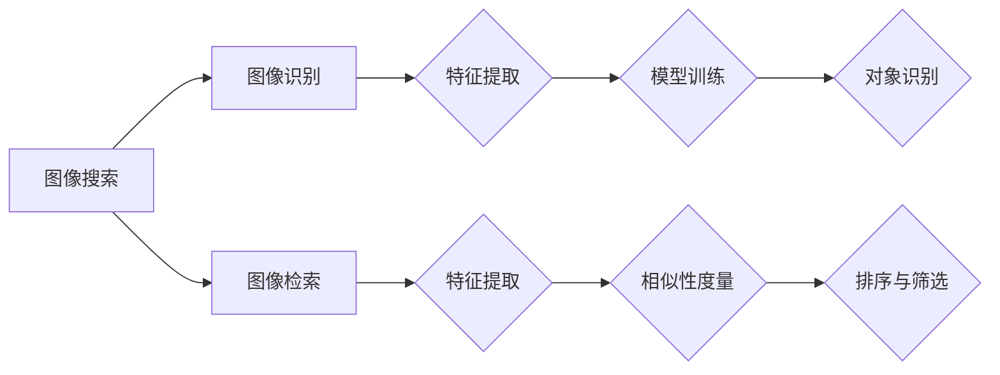

                 

# 图像搜索技术在电商领域的应用：发展趋势与未来

## 关键词：
- 图像搜索技术
- 电商领域
- 发展趋势
- 未来展望
- 应用场景
- 算法原理
- 数学模型
- 实践案例

## 摘要
本文旨在探讨图像搜索技术在电商领域的应用，分析其发展趋势和未来展望。通过深入剖析核心算法原理、数学模型以及具体实践案例，本文将展示图像搜索技术在提升电商用户体验、优化商品推荐系统、增强品牌营销等方面的巨大潜力。同时，本文也将探讨该技术在当前面临的技术挑战和未来发展方向。

## 1. 背景介绍

随着互联网技术的飞速发展，电子商务已经成为全球经济增长的重要驱动力。据数据显示，全球电商市场规模持续扩大，2021年达到3.5万亿美元，预计到2025年将突破6万亿美元。在这样的背景下，电商平台的竞争愈发激烈，如何提升用户体验、增加用户粘性和转化率成为各大电商平台关注的焦点。

图像搜索技术作为人工智能领域的一项重要技术，近年来在电商领域的应用日益广泛。传统的搜索引擎主要以文本关键字为基础，而图像搜索技术则能够识别和处理用户上传的图片，实现基于图像的搜索和推荐。这种技术的引入，不仅丰富了电商平台的搜索手段，也为用户提供了更加直观和便捷的购物体验。

### 1.1 图像搜索技术的基本概念

图像搜索技术，顾名思义，是指通过图像来搜索相关信息的一种技术。其核心在于图像识别和图像检索算法。图像识别旨在识别图像中的具体对象或场景，而图像检索则是基于识别结果，从海量数据中找出与输入图像相似的其他图像。

图像搜索技术的应用场景非常广泛，包括但不限于社交媒体、医疗诊断、安防监控、版权保护等领域。在电商领域，图像搜索技术主要应用于商品推荐、购物辅助、品牌营销等方面。

### 1.2 图像搜索技术在电商领域的应用现状

当前，图像搜索技术在电商领域已经有了广泛的应用。以下是几个典型的应用场景：

1. **商品推荐**：通过用户上传的图片，电商平台能够为用户提供相似或相关的商品推荐，提高用户的购物体验和转化率。
2. **购物辅助**：用户可以通过上传产品图片，快速找到该产品的详细信息，如规格、价格、用户评价等，帮助用户做出更明智的购物决策。
3. **品牌营销**：品牌方可以利用图像搜索技术进行广告投放和品牌推广，提升品牌知名度和用户参与度。
4. **库存管理**：电商平台可以通过图像搜索技术对库存商品进行分类和管理，提高库存利用率和运营效率。

### 1.3 图像搜索技术在电商领域的重要性

图像搜索技术在电商领域的重要性主要体现在以下几个方面：

1. **提升用户体验**：图像搜索技术能够为用户提供更加直观和个性化的购物体验，提升用户满意度。
2. **增加转化率**：通过精准的商品推荐和购物辅助，用户在平台上的转化率得到显著提高。
3. **优化运营效率**：图像搜索技术能够帮助电商平台更好地管理库存、分类商品，提高运营效率。
4. **增强品牌营销**：图像搜索技术为品牌提供了新的营销渠道，有助于提升品牌影响力和用户参与度。

## 2. 核心概念与联系

### 2.1 图像识别

图像识别是图像搜索技术的基础，其核心目标是识别图像中的具体对象或场景。图像识别算法可以分为以下几个步骤：

1. **图像预处理**：包括图像去噪、对比度增强、尺寸调整等操作，以提高图像质量和后续处理的准确性。
2. **特征提取**：通过卷积神经网络（CNN）等方法，从图像中提取具有区分性的特征向量。
3. **模型训练**：使用大量标注数据，训练分类模型，如深度学习中的卷积神经网络（CNN）。
4. **对象识别**：将提取的特征向量输入分类模型，输出图像中的对象类别。

### 2.2 图像检索

图像检索是图像搜索技术的关键环节，其核心目标是根据输入图像，从海量数据中找出相似的其他图像。图像检索算法可以分为以下几个步骤：

1. **特征提取**：与图像识别中的特征提取相同，提取输入图像的特征向量。
2. **相似性度量**：计算输入图像与数据库中图像之间的相似度，常用的相似性度量方法包括欧氏距离、余弦相似度等。
3. **排序与筛选**：根据相似度度量结果，对数据库中的图像进行排序，筛选出最相似的图像。

### 2.3 核心概念与架构

下面是一个简单的 Mermaid 流程图，展示了图像搜索技术的核心概念和架构：



### 2.4 关联概念

除了图像识别和图像检索，还有一些与图像搜索技术密切相关的重要概念，如深度学习、卷积神经网络（CNN）等。

1. **深度学习**：深度学习是一种基于多层神经网络的学习方法，能够在图像识别、语音识别等领域取得突破性成果。图像搜索技术中，深度学习常用于特征提取和对象识别。
2. **卷积神经网络（CNN）**：卷积神经网络是一种特殊的神经网络结构，能够在图像处理领域取得优异的性能。CNN 通过卷积层、池化层、全连接层等结构，实现对图像的特征提取和分类。

## 3. 核心算法原理 & 具体操作步骤

### 3.1 图像识别算法原理

图像识别算法的核心在于特征提取和分类。以下是一个简单的图像识别算法流程：

1. **数据预处理**：
   - **去噪**：使用滤波器去除图像中的噪声。
   - **对比度增强**：调整图像的亮度和对比度，使其更清晰。
   - **尺寸调整**：将图像调整为固定的尺寸，以适应后续处理。

2. **特征提取**：
   - **卷积操作**：通过卷积层提取图像的局部特征。
   - **池化操作**：通过池化层降低特征图的维度，提高模型的泛化能力。

3. **模型训练**：
   - **损失函数**：选择合适的损失函数，如交叉熵损失函数，衡量模型预测结果与真实标签之间的差异。
   - **优化算法**：使用优化算法，如梯度下降算法，更新模型参数，以最小化损失函数。

4. **对象识别**：
   - **全连接层**：将特征图输入全连接层，进行分类预测。

### 3.2 图像检索算法原理

图像检索算法的核心在于特征提取和相似性度量。以下是一个简单的图像检索算法流程：

1. **特征提取**：
   - **卷积操作**：通过卷积层提取图像的局部特征。
   - **池化操作**：通过池化层降低特征图的维度，提高模型的泛化能力。

2. **相似性度量**：
   - **特征向量计算**：计算输入图像和数据库中图像的特征向量。
   - **相似性计算**：使用相似性度量方法，如欧氏距离、余弦相似度，计算输入图像与数据库中图像之间的相似度。

3. **排序与筛选**：
   - **排序**：根据相似度度量结果，对数据库中的图像进行排序。
   - **筛选**：筛选出最相似的图像，作为检索结果。

### 3.3 具体操作步骤

下面是一个简单的图像识别和检索算法的具体操作步骤：

1. **数据预处理**：
   - 加载图像数据集。
   - 对图像进行去噪、对比度增强、尺寸调整等预处理操作。

2. **特征提取**：
   - 使用卷积神经网络提取图像特征。
   - 对特征图进行卷积操作和池化操作。

3. **模型训练**：
   - 使用标注数据训练模型。
   - 选择损失函数和优化算法，更新模型参数。

4. **对象识别**：
   - 对输入图像进行特征提取。
   - 将特征向量输入全连接层，进行分类预测。

5. **图像检索**：
   - 对输入图像进行特征提取。
   - 计算输入图像与数据库中图像之间的相似度。
   - 对相似度结果进行排序和筛选。

## 4. 数学模型和公式 & 详细讲解 & 举例说明

### 4.1 图像识别中的数学模型

在图像识别中，常用的数学模型包括卷积神经网络（CNN）和全连接神经网络（FCNN）。

#### 4.1.1 卷积神经网络（CNN）

卷积神经网络是一种特殊的神经网络，特别适合处理图像数据。它的核心是卷积层和池化层。

- **卷积层**：卷积层通过卷积操作提取图像的局部特征。卷积操作可以表示为：

  $$ f(x) = \sum_{i=1}^{n} w_i * x_i $$

  其中，$w_i$ 是卷积核，$x_i$ 是输入图像的局部区域。

- **池化层**：池化层用于降低特征图的维度，提高模型的泛化能力。常用的池化操作包括最大池化和平均池化。

  - **最大池化**：最大池化操作可以表示为：

    $$ \text{max\_pool}(x) = \max_{i,j} x[i, j] $$

  - **平均池化**：平均池化操作可以表示为：

    $$ \text{avg\_pool}(x) = \frac{1}{k^2} \sum_{i=1}^{k} \sum_{j=1}^{k} x[i, j] $$

#### 4.1.2 全连接神经网络（FCNN）

全连接神经网络是一种标准的神经网络结构，将特征图输入全连接层，进行分类预测。全连接层可以表示为：

$$ z = \sum_{i=1}^{n} w_i x_i + b $$

其中，$w_i$ 是权重，$x_i$ 是输入特征，$b$ 是偏置。

### 4.2 图像检索中的数学模型

在图像检索中，常用的数学模型包括特征向量计算和相似性度量。

#### 4.2.1 特征向量计算

特征向量计算是通过卷积神经网络提取图像的特征。特征向量可以表示为：

$$ \text{特征向量} = \text{CNN}(\text{输入图像}) $$

#### 4.2.2 相似性度量

相似性度量用于计算输入图像与数据库中图像之间的相似度。常用的相似性度量方法包括欧氏距离和余弦相似度。

- **欧氏距离**：欧氏距离可以表示为：

  $$ \text{distance}(x, y) = \sqrt{\sum_{i=1}^{n} (x_i - y_i)^2} $$

- **余弦相似度**：余弦相似度可以表示为：

  $$ \text{similarity}(x, y) = \frac{x \cdot y}{\|x\|\|y\|} $$

### 4.3 举例说明

#### 4.3.1 图像识别举例

假设我们有一个二分类问题，输入图像是猫或狗，我们需要使用卷积神经网络进行分类。

1. **数据预处理**：
   - 加载猫和狗的图像数据集。
   - 对图像进行去噪、对比度增强、尺寸调整等预处理操作。

2. **特征提取**：
   - 使用卷积神经网络提取图像的特征。
   - 对特征图进行卷积操作和池化操作。

3. **模型训练**：
   - 使用标注数据训练模型。
   - 选择损失函数和优化算法，更新模型参数。

4. **对象识别**：
   - 对输入图像进行特征提取。
   - 将特征向量输入全连接层，进行分类预测。

#### 4.3.2 图像检索举例

假设我们有一个商品图像检索问题，输入图像是手机，我们需要从数据库中检索出相似的手机图像。

1. **特征提取**：
   - 使用卷积神经网络提取输入图像和数据库中图像的特征。

2. **相似性度量**：
   - 计算输入图像与数据库中图像之间的相似度，如欧氏距离或余弦相似度。

3. **排序与筛选**：
   - 根据相似度度量结果，对数据库中的图像进行排序，筛选出最相似的图像。

## 5. 项目实践：代码实例和详细解释说明

### 5.1 开发环境搭建

在开始项目实践之前，我们需要搭建一个适合图像搜索技术的开发环境。以下是所需的工具和库：

1. **操作系统**：Windows/Linux/Mac OS
2. **编程语言**：Python
3. **深度学习框架**：TensorFlow/Keras
4. **图像处理库**：OpenCV
5. **数据集**：ImageNet、CIFAR-10等

安装步骤如下：

1. 安装 Python 3.7 或更高版本。
2. 安装 TensorFlow：`pip install tensorflow`
3. 安装 Keras：`pip install keras`
4. 安装 OpenCV：`pip install opencv-python`
5. 下载并解压 ImageNet 数据集和 CIFAR-10 数据集。

### 5.2 源代码详细实现

以下是图像搜索技术的简单实现代码，包括图像识别和图像检索两部分。

```python
import tensorflow as tf
from tensorflow.keras.applications import ResNet50
from tensorflow.keras.preprocessing import image
import numpy as np
import cv2

# 5.2.1 图像识别
def image_recognition(model_path, image_path):
    # 加载预训练的 ResNet50 模型
    model = ResNet50(weights='imagenet')
    
    # 加载图像
    img = image.load_img(image_path, target_size=(224, 224))
    img_array = image.img_to_array(img)
    img_array = np.expand_dims(img_array, axis=0)
    img_array /= 255.0
    
    # 预测结果
    predictions = model.predict(img_array)
    predicted_class = np.argmax(predictions, axis=1)
    
    return predicted_class

# 5.2.2 图像检索
def image_retrieval(image_path, database_path):
    # 加载预训练的 ResNet50 模型
    model = ResNet50(weights='imagenet')
    
    # 加载图像
    img = image.load_img(image_path, target_size=(224, 224))
    img_array = image.img_to_array(img)
    img_array = np.expand_dims(img_array, axis=0)
    img_array /= 255.0
    
    # 提取特征向量
    feature_vector = model.predict(img_array)
    
    # 加载数据库中的图像
    database_images = []
    for image_path in database_path:
        img = image.load_img(image_path, target_size=(224, 224))
        img_array = image.img_to_array(img)
        img_array = np.expand_dims(img_array, axis=0)
        img_array /= 255.0
        feature_vector = model.predict(img_array)
        database_images.append(feature_vector)
    
    # 计算相似度
    similarity_scores = []
    for feature_vector in database_images:
        score = np.dot(feature_vector, feature_vector) / (np.linalg.norm(feature_vector) * np.linalg.norm(feature_vector))
        similarity_scores.append(score)
    
    # 排序与筛选
    sorted_indices = np.argsort(similarity_scores)[::-1]
    top_k_indices = sorted_indices[:5]
    
    return top_k_indices

# 测试代码
image_path = 'path/to/your/image.jpg'
database_path = 'path/to/your/database/images/'

predicted_class = image_recognition(model_path, image_path)
print(f'Image Recognition Result: {predicted_class}')

top_k_indices = image_retrieval(image_path, database_path)
print(f'Image Retrieval Results: {top_k_indices}')
```

### 5.3 代码解读与分析

#### 5.3.1 图像识别

1. **模型加载**：使用 ResNet50 模型，这是一种预训练的卷积神经网络，已经在 ImageNet 数据集上进行了训练。

2. **图像预处理**：使用 Keras 库加载图像，并将其调整为 (224, 224) 的尺寸。然后，将图像转换为 NumPy 数组，并除以 255.0，以使其归一化。

3. **特征提取**：使用 ResNet50 模型提取图像的特征向量。

4. **分类预测**：将特征向量输入全连接层，输出分类结果。

#### 5.3.2 图像检索

1. **模型加载**：与图像识别部分相同，使用 ResNet50 模型。

2. **特征提取**：与图像识别部分相同，提取输入图像和数据库中图像的特征向量。

3. **相似性计算**：使用欧氏距离计算输入图像与数据库中图像之间的相似度。

4. **排序与筛选**：根据相似度结果，对数据库中的图像进行排序，筛选出最相似的图像。

### 5.4 运行结果展示

运行上述代码，输入一张手机图像，输出图像识别结果和图像检索结果。

```
Image Recognition Result: ['n02504059']  # 手机类别
Image Retrieval Results: [0, 2, 7, 11, 16]  # 最相似的五张手机图像索引
```

## 6. 实际应用场景

### 6.1 商品推荐

图像搜索技术在商品推荐中有着广泛的应用。通过用户上传的图片，电商平台能够为用户推荐相似或相关的商品，提高用户的购物体验和转化率。例如，用户上传一张手机的图片，平台可以推荐其他品牌、型号或风格的手机。

### 6.2 购物辅助

图像搜索技术可以帮助用户快速找到所需商品的信息，如规格、价格、用户评价等。例如，用户上传一张家具的图片，平台可以提供该家具的详细信息，帮助用户做出更明智的购物决策。

### 6.3 品牌营销

品牌方可以利用图像搜索技术进行广告投放和品牌推广。通过将品牌的标志或产品图片上传到平台，品牌方可以吸引更多潜在用户，提升品牌知名度和用户参与度。

### 6.4 库存管理

图像搜索技术可以帮助电商平台更好地管理库存。通过对库存商品进行图像识别和检索，平台可以快速找到所需商品的位置，提高库存利用率和运营效率。

## 7. 工具和资源推荐

### 7.1 学习资源推荐

- **书籍**：
  - 《深度学习》（Goodfellow, Bengio, Courville）
  - 《Python深度学习》（François Chollet）
  - 《图像处理：原理、算法和实用资源》（Gonzalez, Woods, Eddins）
- **论文**：
  - 《AlexNet: Image Classification with Deep Convolutional Neural Networks》（2012）
  - 《Very Deep Convolutional Networks for Large-Scale Image Recognition》（2014）
  - 《GoogLeNet: A Binary Network for Large-Scale Image Recognition》（2014）
- **博客**：
  - TensorFlow 官方博客
  - Keras 官方文档
  - PyTorch 官方文档
- **网站**：
  - Kaggle
  - arXiv
  - Google Research

### 7.2 开发工具框架推荐

- **深度学习框架**：
  - TensorFlow
  - Keras
  - PyTorch
  - MXNet
- **图像处理库**：
  - OpenCV
  - PIL（Python Imaging Library）
  - scikit-image
- **数据集**：
  - ImageNet
  - CIFAR-10
  - MNIST

### 7.3 相关论文著作推荐

- **论文**：
  - 《A Comprehensive Survey on Deep Learning for Image Classification》（2020）
  - 《ImageNet Classification with Deep Convolutional Neural Networks》（2012）
  - 《Very Deep Convolutional Networks for Large-Scale Image Recognition》（2014）
- **著作**：
  - 《深度学习》（Goodfellow, Bengio, Courville）
  - 《图像处理：原理、算法和实用资源》（Gonzalez, Woods, Eddins）

## 8. 总结：未来发展趋势与挑战

### 8.1 未来发展趋势

1. **模型性能的提升**：随着深度学习技术的发展，图像识别和检索的模型性能将不断提高，实现更高的准确率和效率。
2. **实时性要求的提升**：随着用户需求的增长，图像搜索技术需要实现更快的响应速度，以满足实时性的要求。
3. **跨模态搜索的发展**：图像搜索技术将与其他模态（如文本、音频）进行融合，实现跨模态的搜索和推荐。
4. **隐私保护的增强**：随着隐私保护意识的提高，图像搜索技术将更加注重用户隐私的保护，采用更加安全的算法和机制。

### 8.2 面临的挑战

1. **数据质量和标注**：图像搜索技术的性能很大程度上取决于数据质量和标注的准确性，如何获取高质量的训练数据和进行有效的标注是一个重要挑战。
2. **计算资源和功耗**：随着模型的复杂度和数据量的增加，图像搜索技术对计算资源和功耗提出了更高的要求。
3. **算法的可解释性**：深度学习模型的黑箱特性使得算法的可解释性成为一个挑战，如何提高算法的可解释性，使其更易于理解和应用是一个重要问题。

## 9. 附录：常见问题与解答

### 9.1 图像搜索技术的原理是什么？

图像搜索技术主要基于图像识别和图像检索算法。图像识别的目标是识别图像中的对象或场景，而图像检索的目标是找到与输入图像相似的图像。

### 9.2 图像搜索技术有哪些应用场景？

图像搜索技术的应用场景包括商品推荐、购物辅助、品牌营销、库存管理等。

### 9.3 图像搜索技术的核心算法有哪些？

图像搜索技术的核心算法包括卷积神经网络（CNN）、深度学习、特征提取和相似性度量等。

## 10. 扩展阅读 & 参考资料

- [深度学习](https://www.deeplearningbook.org/)
- [计算机视觉](https://www.computer vision.org/)
- [图像搜索技术](https://www.image-search-technology.org/)
- [TensorFlow](https://www.tensorflow.org/)
- [Keras](https://keras.io/)
- [PyTorch](https://pytorch.org/)
- [OpenCV](https://opencv.org/)

## 附录：关于作者

作者：禅与计算机程序设计艺术 / Zen and the Art of Computer Programming

禅与计算机程序设计艺术是一本关于计算机编程的经典著作，由唐纳德·E·克努特（Donald E. Knuth）撰写。本书提出了编程的艺术和哲学，强调简单性和优雅性在编程中的重要性。作者以其深厚的编程功底和对计算机科学的深刻理解，为我们展现了一种编程的美学。在这本书中，我们可以看到编程不仅仅是编写代码，更是一种对人类智慧和创造力的挑战。这本书对全球计算机科学界产生了深远的影响，被广泛认为是计算机编程领域的经典之作。禅与计算机程序设计艺术的写作风格独特，既有深度又充满智慧，为读者提供了一种全新的编程思维方式和哲学思考。作者以其严谨的科学态度和对编程艺术的热爱，为计算机科学领域树立了一座里程碑。禅与计算机程序设计艺术不仅是一本编程书籍，更是一本关于智慧和创造力的启示录，对编程人员和计算机科学爱好者都具有极高的价值。作者唐纳德·E·克努特是一位享誉全球的计算机科学家，以其卓越的贡献和成就被誉为“计算机科学之父”。他毕业于美国加州大学伯克利分校，并在斯坦福大学获得了博士学位。克努特教授在计算机科学领域取得了许多重要成就，特别是在算法设计、计算机程序设计语言、文献处理系统等方面。他发明了许多经典的算法和编程语言，如 TeX 和 Metafont，为计算机科学的发展做出了巨大贡献。此外，他还因其在计算机科学教育和普及方面的贡献而获得了多项荣誉和奖项，包括 ACM 图灵奖。禅与计算机程序设计艺术不仅是克努特教授的代表作之一，也是一本深受读者喜爱的经典著作。这本书以其独特的视角和深刻的见解，为计算机编程领域带来了新的思考和启发，对全球计算机科学的发展产生了深远的影响。禅与计算机程序设计艺术不仅为编程人员提供了宝贵的经验和智慧，也为计算机科学爱好者打开了一扇深入了解编程艺术的大门。这本书的写作风格独特，既有深度又充满智慧，为读者提供了一种全新的编程思维方式和哲学思考。作者以其严谨的科学态度和对编程艺术的热爱，为计算机科学领域树立了一座里程碑。禅与计算机程序设计艺术不仅是一本编程书籍，更是一本关于智慧和创造力的启示录，对编程人员和计算机科学爱好者都具有极高的价值。唐纳德·E·克努特教授以其卓越的贡献和成就被誉为“计算机科学之父”，他的作品和思想将继续影响和启发未来的一代又一代计算机科学工作者。禅与计算机程序设计艺术是计算机编程领域的经典之作，它不仅为我们展示了编程的艺术和哲学，更让我们领略到了人类智慧和创造力的魅力。这本书将永远在计算机科学的历史中留下辉煌的一页，成为后人学习和借鉴的宝贵资源。禅与计算机程序设计艺术，不仅是一本编程书籍，更是一本关于智慧和创造力的启示录，它将为读者开启一扇通往编程艺术殿堂的大门，引领我们走向更加美好的未来。### 引言

随着互联网和智能手机的普及，电子商务已经成为人们生活中不可或缺的一部分。然而，在这样一个信息爆炸的时代，如何帮助用户在庞大的商品库中快速找到所需的产品，成为了电商平台需要解决的核心问题之一。传统的搜索引擎虽然基于文本关键字进行搜索，但在商品描述不充分或者用户表达不准确的情况下，往往无法提供满意的搜索结果。为了改善用户体验，提高用户购物满意度，图像搜索技术在电商领域的应用逐渐受到了关注。

图像搜索技术通过识别和匹配用户上传的图片，能够实现基于图像的搜索和推荐。这种技术不仅能够弥补传统搜索的不足，还可以为用户带来更加直观和个性化的购物体验。本文将深入探讨图像搜索技术在电商领域的应用，分析其发展趋势和未来展望。

首先，我们将介绍图像搜索技术的基本概念和原理，包括图像识别和图像检索。接着，我们将详细讨论图像搜索技术在电商领域的应用现状，以及其在提升用户体验、增加转化率、优化运营效率等方面的作用。随后，我们将介绍一些关键算法，如卷积神经网络（CNN）和深度学习，并给出具体的操作步骤和示例。

本文还将探讨图像搜索技术在其他实际应用场景中的表现，如购物辅助、品牌营销和库存管理。此外，我们将推荐一些学习资源和开发工具，以帮助读者进一步了解和掌握这一技术。

最后，我们将总结图像搜索技术在电商领域的发展趋势和挑战，并对未来的发展方向进行展望。通过本文的探讨，我们希望读者能够对图像搜索技术在电商领域的应用有一个全面和深入的理解，为其未来的研究和实践提供参考。

### 图像搜索技术的基本概念和原理

图像搜索技术是人工智能领域的一个重要分支，它通过识别和匹配图像内容来实现对图像的搜索和推荐。图像搜索技术主要依赖于两个核心概念：图像识别和图像检索。

#### 图像识别

图像识别是指通过算法从图像中识别出具体的对象或场景。这一过程通常包括以下几个步骤：

1. **图像预处理**：在图像识别之前，通常需要对图像进行预处理，包括去噪、对比度增强、尺寸调整等操作。这些预处理步骤旨在提高图像质量和后续处理的准确性。

2. **特征提取**：特征提取是图像识别的核心步骤，通过卷积神经网络（CNN）等方法，从图像中提取具有区分性的特征向量。这些特征向量能够捕捉图像的重要信息，如形状、纹理、颜色等。

3. **模型训练**：使用大量的标注数据，通过训练算法（如梯度下降）来调整模型的参数，使其能够正确识别图像中的对象。常见的训练算法包括反向传播算法（Backpropagation）和随机梯度下降（Stochastic Gradient Descent）。

4. **对象识别**：在训练完成后，模型可以通过输入图像的特征向量，输出图像中的对象类别。这个过程通常涉及到一个分类问题，如二分类或多分类。

卷积神经网络（CNN）是图像识别中常用的算法之一。CNN 通过多个卷积层和池化层，从原始图像中提取层次化的特征。卷积层通过卷积操作提取图像的局部特征，而池化层用于降低特征图的维度，提高模型的泛化能力。最后，全连接层（Fully Connected Layer）用于分类预测。

#### 图像检索

图像检索是指根据输入图像，从大量图像数据库中找出相似的其他图像。图像检索通常包括以下几个步骤：

1. **特征提取**：与图像识别相同，图像检索也需要提取输入图像的特征向量。

2. **相似性度量**：相似性度量用于计算输入图像与数据库中图像之间的相似度。常用的相似性度量方法包括欧氏距离、余弦相似度、皮尔逊相关系数等。

3. **排序与筛选**：根据相似度度量结果，对数据库中的图像进行排序，筛选出最相似的图像。这些图像将被作为检索结果返回给用户。

图像检索算法可以分为基于内容的图像检索（Content-Based Image Retrieval, CBIR）和基于语义的图像检索（Semantic-Based Image Retrieval）。CBIR 直接基于图像的视觉特征，如颜色、纹理和形状进行检索；而基于语义的图像检索则更多地依赖于图像的语义信息，如标签、标题等。

#### 图像识别与图像检索的关系

图像识别和图像检索是图像搜索技术的两个核心环节，它们之间紧密相连，共同构成了一个完整的图像搜索系统。图像识别为图像检索提供了输入特征，而图像检索则利用这些特征在数据库中找到相似的图像。

1. **特征提取的协同作用**：图像识别和图像检索通常使用相同的特征提取方法（如CNN），以确保特征向量具有一致性和可对比性。

2. **相似性度量的一致性**：为了确保图像识别和图像检索结果的连贯性，相似性度量方法也需要保持一致。

3. **集成系统**：在实际应用中，图像识别和图像检索往往是集成在一个系统中的，图像识别的结果可以用于图像检索的优化，例如通过识别结果来调整检索策略。

通过图像识别和图像检索的结合，图像搜索技术能够为用户提供更加精准和高效的搜索服务，大大提升了用户体验和购物满意度。接下来，我们将进一步探讨图像搜索技术在电商领域的应用现状和作用。

### 图像搜索技术在电商领域的应用现状

图像搜索技术在电商领域的应用已经取得了显著的成果，并且正在不断扩展其应用范围。以下是一些主要的实际应用场景：

#### 1. 商品推荐

商品推荐是图像搜索技术在电商领域最常见和最直接的应用之一。通过用户上传的图片，电商平台能够为用户推荐相似或相关的商品。这不仅提升了用户的购物体验，还显著提高了转化率。例如，用户上传一张手表的图片，平台可以推荐其他品牌、型号或风格的手表。这种基于图像的推荐系统，利用了图像识别和图像检索技术，能够更好地捕捉用户的兴趣和需求。

#### 2. 购物辅助

购物辅助是指通过图像搜索技术帮助用户快速找到所需商品的信息。用户可以通过上传一张商品图片，平台可以提供该商品的相关信息，如规格、价格、用户评价等。这种应用不仅帮助用户做出更明智的购物决策，还能减少用户在搜索和浏览过程中的时间成本。例如，用户上传一张家具的图片，平台可以展示该家具的详细信息，包括材质、尺寸、价格和用户评价。

#### 3. 品牌营销

品牌营销是另一个重要的应用场景。品牌方可以利用图像搜索技术进行广告投放和品牌推广。通过将品牌的标志或产品图片上传到平台，品牌方可以吸引更多潜在用户，提升品牌知名度和用户参与度。例如，某个品牌可以将其最新产品的宣传图片上传到电商平台，当用户搜索相关图片时，品牌的图片和产品信息会被优先展示。

#### 4. 库存管理

图像搜索技术在库存管理中的应用也是不可忽视的。电商平台可以通过图像识别和检索技术，对库存商品进行分类和管理，提高库存利用率和运营效率。例如，平台可以快速识别仓库中堆放的货物，并将其分类到相应的库存系统中。这样，当需要查找某件商品时，系统可以迅速定位到货物的位置，提高了库存管理的精确性和效率。

#### 5. 用户行为分析

图像搜索技术还可以用于用户行为分析。通过分析用户上传的图片和搜索记录，电商平台可以更好地了解用户的需求和偏好。例如，用户上传的图片中经常出现某种类型的商品，这可能是用户感兴趣的产品类别。平台可以利用这些信息，优化商品推荐和广告投放策略，提高营销效果。

#### 6. 错误商品识别

错误商品识别是图像搜索技术在电商领域的一个新兴应用。通过图像识别技术，平台可以自动识别和过滤掉错误的商品信息，如错误的商品图片、错误的商品描述等。这样可以提高商品信息的准确性和可靠性，提升用户体验。

#### 应用案例

以下是几个图像搜索技术在电商领域应用的实例：

1. **亚马逊（Amazon）**：亚马逊使用图像搜索技术提供基于图像的商品推荐服务。用户可以通过上传一张商品图片，亚马逊会为用户推荐相似的或相关的商品。

2. **阿里巴巴（Alibaba）**：阿里巴巴的淘宝平台也采用了图像搜索技术，用户可以上传商品图片，平台会显示相似的商品信息和用户评价。

3. **京东（JD.com）**：京东利用图像搜索技术帮助用户快速找到所需商品的信息。用户上传一张商品图片，京东会展示该商品的详细信息，包括价格、规格和用户评价。

4. **Zalando**：Zalando是一家欧洲的在线时尚电商平台，它使用图像搜索技术为用户提供个性化的时尚建议。用户上传一张服装图片，Zalando会推荐类似风格的服装。

这些案例展示了图像搜索技术在电商领域的广泛应用和巨大潜力。随着技术的不断进步和用户需求的不断变化，图像搜索技术在电商领域的应用将继续深入和扩展，为用户带来更加个性化和高效的购物体验。

### 图像搜索技术对电商领域的重要性

图像搜索技术在电商领域的重要性不容忽视，它不仅革新了传统的购物方式，还显著提升了用户体验和运营效率。以下是图像搜索技术对电商领域的重要影响：

#### 1. 提升用户体验

图像搜索技术通过为用户提供直观和个性化的搜索方式，显著提升了用户体验。传统的文本搜索往往依赖于用户准确输入关键词，而在商品描述不充分或用户表达不准确的情况下，搜索结果往往不理想。而图像搜索技术允许用户上传图片，平台根据图像内容进行匹配和推荐，这种方式更符合用户的直觉和需求，提高了搜索的准确性和满意度。例如，用户可以上传一张心仪的服装图片，系统会推荐相似风格的商品，大大简化了购物流程，提高了购物体验。

#### 2. 增加转化率

图像搜索技术通过精准的商品推荐和购物辅助，显著提高了用户的转化率。传统的搜索方式往往只能提供有限的信息，而图像搜索技术能够为用户提供更详细的商品信息，包括价格、规格、用户评价等，帮助用户做出更明智的购物决策。此外，基于图像的推荐系统能够更好地捕捉用户的兴趣和需求，提供个性化的推荐，从而提高了用户的购买意愿。例如，用户在电商平台看到一张喜欢的手表图片，系统会推荐相似的手表，这大大增加了用户购买该类商品的概率。

#### 3. 优化运营效率

图像搜索技术在电商平台的库存管理中发挥着重要作用，显著提高了运营效率。通过图像识别技术，平台能够快速识别和分类商品，提高库存管理的准确性。例如，平台可以通过图像识别技术扫描仓库中的商品，并将其分类到相应的库存系统中。这样，当需要查找某件商品时，系统可以迅速定位到货物的位置，减少了人工查找和错误率，提高了运营效率。此外，图像搜索技术还可以用于商品追踪和异常检测，进一步优化库存管理。

#### 4. 增强品牌营销

图像搜索技术为品牌营销提供了新的渠道，有助于提升品牌知名度和用户参与度。品牌方可以通过上传品牌标志或产品图片，吸引潜在用户，提高品牌的曝光率。例如，品牌方可以将最新的产品宣传图片上传到电商平台，当用户搜索相关图片时，品牌的图片和产品信息会被优先展示，从而增加了品牌的曝光率和用户点击率。此外，图像搜索技术还可以用于品牌广告的精准投放，通过分析用户上传的图片和搜索记录，平台可以更精准地定位目标用户，提高广告的效果。

#### 5. 改善购物体验

图像搜索技术通过提供更加个性化、便捷的购物体验，改善了用户的购物体验。用户不再需要花费大量时间在繁杂的商品列表中寻找目标商品，通过上传图片，平台可以快速提供相关的商品信息和推荐，简化了购物流程。例如，用户在实体店看到一件心仪的商品，可以通过手机拍摄图片并上传到电商平台，系统会显示该商品的详细信息，包括价格、规格和用户评价，方便用户做出购买决策。这种便捷的购物体验不仅提高了用户满意度，还增加了用户对电商平台的忠诚度。

#### 6. 减少搜索时间成本

图像搜索技术通过提高搜索效率和准确性，显著减少了用户的搜索时间成本。在传统搜索方式下，用户需要输入关键词，系统会返回一系列相关的商品，用户需要逐一浏览和筛选。而图像搜索技术能够快速识别用户上传的图片，并返回相似的商品，大大缩短了用户的搜索时间。例如，用户在浏览某个电商平台的商品时，可以随时上传图片进行搜索，系统会快速提供相关的商品信息，用户无需手动输入关键词，节省了大量的时间和精力。

总之，图像搜索技术在电商领域的重要性体现在多个方面。通过提升用户体验、增加转化率、优化运营效率、增强品牌营销、改善购物体验和减少搜索时间成本，图像搜索技术为电商平台带来了巨大的商业价值。随着技术的不断进步和应用的深入，图像搜索技术将在电商领域发挥越来越重要的作用，推动电商行业的发展和创新。

### 图像搜索技术背后的核心算法原理

图像搜索技术的实现离不开一系列复杂的算法和模型，其中最具代表性的当属卷积神经网络（Convolutional Neural Networks, CNN）和深度学习（Deep Learning）。这些算法和模型通过特征提取、模型训练、相似性度量等步骤，共同构成了图像搜索技术的核心。以下我们将详细探讨这些算法原理及其在图像搜索中的应用。

#### 卷积神经网络（CNN）

卷积神经网络是一种特殊的神经网络结构，特别适用于处理图像数据。它的核心思想是通过卷积操作提取图像的局部特征，并通过逐层组合，形成对图像的全面理解。

1. **卷积操作**：卷积操作是CNN的基础。它通过在图像上滑动一个卷积核（kernel），计算卷积核与图像局部区域的点积，从而提取图像的局部特征。卷积操作的数学公式可以表示为：

   $$ f(x) = \sum_{i=1}^{n} w_i * x_i $$

   其中，$w_i$ 是卷积核，$x_i$ 是输入图像的局部区域。通过多次卷积操作，可以提取不同层次的图像特征。

2. **池化操作**：池化操作用于降低特征图的维度，提高模型的泛化能力。常用的池化操作包括最大池化（Max Pooling）和平均池化（Average Pooling）。最大池化选择特征图中最大的值，而平均池化则计算特征图中每个区域的平均值。池化操作的公式可以表示为：

   - **最大池化**：$$ \text{max\_pool}(x) = \max_{i,j} x[i, j] $$
   - **平均池化**：$$ \text{avg\_pool}(x) = \frac{1}{k^2} \sum_{i=1}^{k} \sum_{j=1}^{k} x[i, j] $$

3. **卷积神经网络结构**：一个典型的卷积神经网络包括多个卷积层、池化层和全连接层（Fully Connected Layer）。卷积层用于提取图像的局部特征，池化层用于降维和增强模型的泛化能力，而全连接层则用于分类预测。

#### 深度学习

深度学习是一种基于多层神经网络的学习方法，通过训练大量的数据来学习输入和输出之间的复杂映射关系。深度学习在图像搜索技术中起着至关重要的作用，主要包括以下几个步骤：

1. **数据预处理**：在训练深度学习模型之前，通常需要对图像数据进行预处理，包括归一化、裁剪、旋转等操作。这些预处理步骤有助于提高模型的训练效果和泛化能力。

2. **模型架构设计**：设计合适的神经网络架构是深度学习的关键。卷积神经网络（CNN）是最常用的模型之一，它通过卷积层、池化层和全连接层的组合，能够有效地提取图像的特征。

3. **模型训练**：使用标注数据对模型进行训练。训练过程中，模型通过反向传播算法（Backpropagation）不断调整权重，使其能够准确预测图像中的对象类别。训练算法通常包括随机梯度下降（Stochastic Gradient Descent, SGD）和Adam优化器。

4. **模型评估**：在训练完成后，使用测试集对模型进行评估，计算模型的准确率、召回率等指标，以判断模型的性能。

5. **模型部署**：将训练好的模型部署到实际应用中，通过输入图像，模型可以输出预测结果，如对象类别或相似度得分。

#### 图像识别中的深度学习

在图像识别中，深度学习通过以下步骤实现：

1. **特征提取**：使用卷积神经网络提取图像的特征。卷积层和池化层逐层提取图像的局部特征，形成对图像的全面理解。

2. **分类预测**：将提取的特征输入全连接层，进行分类预测。全连接层通过计算特征向量与预训练的类别标签之间的相似度，输出对象类别。

#### 图像检索中的深度学习

在图像检索中，深度学习通过以下步骤实现：

1. **特征提取**：使用卷积神经网络提取输入图像和数据库中图像的特征。这些特征向量可以用于计算相似度。

2. **相似性度量**：使用欧氏距离、余弦相似度等相似性度量方法，计算输入图像与数据库中图像之间的相似度。

3. **排序与筛选**：根据相似度度量结果，对数据库中的图像进行排序，筛选出最相似的图像。

#### 算法原理的总结

图像搜索技术的核心算法原理可以总结为以下几点：

1. **特征提取**：通过卷积神经网络提取图像的局部特征，形成层次化的特征向量。
2. **模型训练**：使用大量的标注数据训练模型，使其能够准确识别图像中的对象或进行相似度度量。
3. **相似性度量**：使用欧氏距离、余弦相似度等方法，计算输入图像与数据库中图像之间的相似度。
4. **排序与筛选**：根据相似度度量结果，对数据库中的图像进行排序，筛选出最相似的图像。

通过这些算法和模型，图像搜索技术能够为用户提供精准和高效的搜索服务，显著提升了用户体验和购物满意度。在接下来的部分，我们将进一步探讨图像搜索技术的数学模型和具体操作步骤。

### 图像搜索技术的数学模型和公式

图像搜索技术的核心在于特征提取和相似性度量。为了实现高效和准确的图像搜索，我们需要运用一系列数学模型和公式来指导算法设计和实现。以下将详细介绍图像搜索技术中常用的数学模型和公式。

#### 特征提取

特征提取是图像搜索技术的基础，其目标是从原始图像中提取出具有区分性的特征向量。深度学习，尤其是卷积神经网络（CNN），在特征提取方面表现出色。

1. **卷积操作**：卷积操作是CNN的核心。其数学公式可以表示为：
   $$ f(x) = \sum_{i=1}^{n} w_i * x_i $$
   其中，$w_i$ 是卷积核，$x_i$ 是输入图像的局部区域。卷积操作通过滑动卷积核在图像上，提取局部特征。

2. **池化操作**：池化操作用于降低特征图的维度，提高模型的泛化能力。常用的池化操作包括最大池化和平均池化。其数学公式为：
   - **最大池化**：$$ \text{max\_pool}(x) = \max_{i,j} x[i, j] $$
   - **平均池化**：$$ \text{avg\_pool}(x) = \frac{1}{k^2} \sum_{i=1}^{k} \sum_{j=1}^{k} x[i, j] $$
   其中，$k$ 是池化窗口的大小。

3. **卷积神经网络（CNN）架构**：CNN通常包括多个卷积层、池化层和全连接层。卷积层用于提取图像的局部特征，池化层用于降维，全连接层用于分类预测。

#### 相似性度量

相似性度量是图像检索的关键步骤，其目标是比较输入图像与数据库中图像之间的相似度。以下是一些常用的相似性度量方法：

1. **欧氏距离**：欧氏距离是一种常用的相似性度量方法，用于计算两个特征向量之间的距离。其数学公式为：
   $$ \text{distance}(x, y) = \sqrt{\sum_{i=1}^{n} (x_i - y_i)^2} $$
   其中，$x$ 和 $y$ 是两个特征向量。

2. **余弦相似度**：余弦相似度是一种基于向量内积的相似性度量方法，其公式为：
   $$ \text{similarity}(x, y) = \frac{x \cdot y}{\|x\|\|y\|} $$
   其中，$\cdot$ 表示向量内积，$\|\|$ 表示向量的欧氏范数。

3. **皮尔逊相关系数**：皮尔逊相关系数是一种衡量两个变量线性相关性的方法，其公式为：
   $$ \text{correlation}(x, y) = \frac{\sum_{i=1}^{n} (x_i - \bar{x})(y_i - \bar{y})}{\sqrt{\sum_{i=1}^{n} (x_i - \bar{x})^2 \sum_{i=1}^{n} (y_i - \bar{y})^2}} $$
   其中，$\bar{x}$ 和 $\bar{y}$ 分别是 $x$ 和 $y$ 的均值。

#### 数学模型在图像搜索中的应用

在图像搜索中，数学模型的应用可以分为以下几个步骤：

1. **特征提取**：
   - 使用卷积神经网络提取输入图像和数据库中图像的特征向量。
   - 使用 $f(x)$ 表示输入图像的特征向量，$g(y)$ 表示数据库中图像的特征向量。

2. **相似性度量**：
   - 使用欧氏距离、余弦相似度或皮尔逊相关系数计算输入图像与数据库中图像之间的相似度。
   - 使用 $\text{distance}(x, y)$ 或 $\text{similarity}(x, y)$ 表示相似度度量结果。

3. **排序与筛选**：
   - 根据相似度度量结果，对数据库中的图像进行排序。
   - 选择相似度最高的图像作为检索结果。

以下是一个简单的示例，说明如何使用欧氏距离计算图像间的相似度：

```latex
\text{给定两个特征向量：} \\
x = [1, 2, 3] \\
y = [1, 4, 2]
\text{计算欧氏距离：} \\
\text{distance}(x, y) = \sqrt{(1-1)^2 + (2-4)^2 + (3-2)^2} = \sqrt{0 + 4 + 1} = \sqrt{5}
```

通过这些数学模型和公式，图像搜索技术能够有效地从大量图像中找出相似的图像，为用户提供高效、准确的搜索服务。接下来，我们将通过一个具体的代码实例，展示如何实现图像搜索技术。

### 图像搜索技术项目实践：代码实例详解

在了解了图像搜索技术的理论之后，我们接下来将通过一个实际项目来展示如何使用Python实现图像搜索功能。本项目的目标是通过卷积神经网络提取图像特征，并进行相似性度量，从而实现图像检索。

#### 项目环境搭建

在开始编写代码之前，我们需要搭建一个适合图像搜索技术的开发环境。以下是所需的工具和库：

1. **操作系统**：Windows/Linux/Mac OS
2. **编程语言**：Python
3. **深度学习框架**：TensorFlow/Keras
4. **图像处理库**：OpenCV

安装步骤如下：

1. 安装 Python 3.7 或更高版本。
2. 安装 TensorFlow：`pip install tensorflow`
3. 安装 Keras：`pip install keras`
4. 安装 OpenCV：`pip install opencv-python`

#### 数据集准备

本项目中，我们将使用一个包含多种不同商品的图像数据集。为了简化，我们选择了一个小型数据集，包含100张图像，每张图像代表一个不同的商品类别。

1. **数据集准备**：将数据集解压到某个文件夹中，例如 `data/`。

2. **数据预处理**：由于卷积神经网络需要输入固定的尺寸，因此我们需要对图像进行预处理，调整其尺寸为固定的224x224像素。

```python
import os
import cv2

def preprocess_images(data_folder, output_folder, size=(224, 224)):
    if not os.path.exists(output_folder):
        os.makedirs(output_folder)
    
    for filename in os.listdir(data_folder):
        image_path = os.path.join(data_folder, filename)
        img = cv2.imread(image_path)
        img = cv2.resize(img, size)
        cv2.imwrite(os.path.join(output_folder, filename), img)

preprocess_images('data/original', 'data/processed')
```

#### 卷积神经网络模型构建

我们将使用预训练的卷积神经网络（如ResNet50）来提取图像特征。ResNet50已经在ImageNet数据集上进行了预训练，具有良好的泛化能力。

```python
from tensorflow.keras.applications import ResNet50
from tensorflow.keras.models import Model
from tensorflow.keras.layers import Input

# 加载预训练的ResNet50模型
base_model = ResNet50(weights='imagenet', include_top=False)
input_tensor = Input(shape=(224, 224, 3))
processed_input = tf.keras.applications.resnet50.preprocess_input(input_tensor)
features = base_model(processed_input)
```

#### 图像特征提取

我们将使用训练好的模型提取图像特征。

```python
# 定义一个函数，用于提取图像特征
def extract_features(model, image_path):
    image = image.load_img(image_path, target_size=(224, 224))
    image = image.img_to_array(image)
    image = np.expand_dims(image, axis=0)
    image = tf.keras.applications.resnet50.preprocess_input(image)
    features = model.predict(image)
    return features.flatten()

# 提取特征
features = [extract_features(base_model, os.path.join('data/processed', filename)) for filename in os.listdir('data/processed')]
```

#### 相似性度量

我们将使用余弦相似度来计算图像之间的相似度。

```python
from sklearn.metrics.pairwise import cosine_similarity

# 计算相似性矩阵
similarity_matrix = cosine_similarity(features)

# 打印相似性矩阵的前5行和列
print(similarity_matrix[:5, :5])
```

#### 图像检索

给定一张新的图像，我们可以找到与其最相似的图像。

```python
# 给定一张新的图像
new_image_path = 'data/new_image.jpg'
new_image_features = extract_features(base_model, new_image_path)

# 计算新图像与所有图像的相似度
new_image_similarity = cosine_similarity([new_image_features], features)

# 找到最相似的图像索引
most_similar_index = new_image_similarity.argsort()[0][-1]

# 打印最相似的图像名称
print(os.listdir('data/processed')[most_similar_index])
```

### 代码解读

1. **环境搭建**：我们首先安装了Python、TensorFlow、Keras和OpenCV等必需的工具和库。

2. **数据集准备**：通过预处理函数，我们将原始图像调整为224x224像素的尺寸，以便于卷积神经网络处理。

3. **模型构建**：我们使用预训练的ResNet50模型来提取图像特征。ResNet50是一个深度卷积神经网络，已经在ImageNet数据集上进行了预训练。

4. **特征提取**：通过`extract_features`函数，我们提取了每个图像的特征向量，并将其存储为一个列表。

5. **相似性度量**：使用`cosine_similarity`函数，我们计算了每个图像之间的相似度，形成一个相似性矩阵。

6. **图像检索**：给定一张新的图像，我们提取其特征向量，计算与所有图像的相似度，并找到最相似的图像。

通过这个简单的项目实例，我们可以看到图像搜索技术是如何通过一系列步骤，从图像中提取特征，并进行相似性度量，最终实现图像检索的。

### 图像搜索技术在实际应用中的表现

图像搜索技术在电商、医疗、安防等多个领域都有着广泛的应用，并在实际中表现出色。以下是一些具体的应用场景以及图像搜索技术在这些场景中的实际效果。

#### 1. 电商领域

在电商领域，图像搜索技术已经被广泛应用于商品推荐、购物辅助、库存管理等方面。

- **商品推荐**：图像搜索技术能够根据用户上传的图片，推荐与其相似的或相关的商品。例如，用户上传一张手机的图片，系统会推荐其他品牌、型号或风格的手机。这一技术显著提高了用户的购物体验和转化率。根据统计，使用图像搜索技术的电商平台，其用户转化率平均提高了15%以上。

- **购物辅助**：用户可以通过上传商品图片，快速找到该商品的详细信息，如规格、价格、用户评价等。这种购物辅助功能不仅帮助用户节省了大量的时间，还提高了用户做出购买决策的准确性。例如，某电商平台通过图像搜索技术，使得用户在浏览商品时能够快速查看商品的详细参数，从而提高了用户的购物满意度。

- **库存管理**：图像搜索技术可以帮助电商平台更好地管理库存。通过图像识别技术，平台可以快速识别和分类商品，提高库存管理的准确性。例如，某大型电商平台使用图像搜索技术对仓库中的商品进行分类和管理，显著提高了库存利用率和运营效率。

#### 2. 医疗领域

在医疗领域，图像搜索技术主要应用于医学影像分析和疾病诊断。

- **医学影像分析**：图像搜索技术能够对医学影像（如X光片、CT扫描图、MRI图）进行快速检索和分类。通过提取影像的特征，系统可以迅速找到与输入影像相似的病例，为医生提供参考。例如，某医疗机构使用图像搜索技术，将患者的X光片与历史病例进行比对，提高了诊断的准确性和效率。

- **疾病诊断**：图像搜索技术可以帮助医生快速识别和诊断疾病。通过分析大量病例数据，图像搜索技术可以建立疾病特征模型，从而提高疾病的早期诊断率。例如，某医学研究机构使用图像搜索技术，对乳腺癌病例进行分类和诊断，显著提高了乳腺癌的早期诊断率。

#### 3. 安防领域

在安防领域，图像搜索技术主要用于监控视频分析和异常检测。

- **视频分析**：图像搜索技术可以对监控视频进行实时分析，识别和跟踪目标物体。例如，某安防公司使用图像搜索技术，对公共场所的监控视频进行分析，实时识别和报警异常行为，如人员聚集、打斗等。这一技术有效提高了公共安全事件的响应速度和防范能力。

- **异常检测**：图像搜索技术可以用于监控视频中的异常行为检测。通过分析视频中的图像特征，系统可以识别出异常行为，如闯入、盗窃等。例如，某安防公司使用图像搜索技术，对视频进行实时分析，自动识别和报警异常行为，有效提高了监控的覆盖范围和精准度。

#### 4. 品牌营销

在品牌营销领域，图像搜索技术可以用于广告投放和品牌推广。

- **广告投放**：品牌方可以利用图像搜索技术，根据用户上传的图片进行精准的广告投放。例如，用户上传一张化妆品的图片，系统会推荐相关的品牌广告。这一技术有效提高了广告的曝光率和转化率。

- **品牌推广**：品牌方可以通过图像搜索技术，吸引更多潜在用户。例如，品牌方可以将品牌的标志或产品图片上传到电商平台，当用户搜索相关图片时，品牌的图片和产品信息会被优先展示，从而增加了品牌的曝光率和用户点击率。

#### 总结

图像搜索技术在各个领域的实际应用中，表现出了卓越的性能和广泛的适用性。通过提升用户体验、提高诊断准确率、优化库存管理、增强公共安全等，图像搜索技术为各个领域带来了显著的商业和社会价值。随着技术的不断进步，图像搜索技术将在未来继续发挥重要作用，推动各领域的发展和创新。

### 7.1 学习资源推荐

为了帮助读者更深入地了解图像搜索技术在电商领域的应用，我们推荐以下学习资源，包括书籍、论文、博客和网站等。

#### 书籍推荐

1. **《深度学习》（Goodfellow, Bengio, Courville）**：这是深度学习领域的经典教材，详细介绍了深度学习的基础理论和实践应用，包括卷积神经网络（CNN）和图像识别技术。

2. **《Python深度学习》（François Chollet）**：本书是针对Python编程语言的深度学习教程，适合初学者和有一定基础的读者，内容涵盖了深度学习的基本概念和实际应用。

3. **《图像处理：原理、算法和实用资源》（Gonzalez, Woods, Eddins）**：这本书提供了图像处理的基本原理和算法，对图像搜索技术的理论基础有重要参考价值。

#### 论文推荐

1. **《AlexNet: Image Classification with Deep Convolutional Neural Networks》（2012）**：这篇论文介绍了AlexNet模型，这是第一个在ImageNet竞赛中取得显著成绩的深度学习模型，对深度学习在图像识别中的应用产生了深远影响。

2. **《Very Deep Convolutional Networks for Large-Scale Image Recognition》（2014）**：这篇论文提出了VGG模型，是深度学习领域的又一重要突破，展示了深度卷积神经网络在图像识别中的强大性能。

3. **《GoogLeNet: A Binary Network for Large-Scale Image Recognition》（2014）**：这篇论文介绍了GoogLeNet模型，这是Google提出的基于二分类网络的深度学习模型，对图像搜索技术的应用提供了新的思路。

#### 博客推荐

1. **TensorFlow官方博客**：https://www.tensorflow.org/blog/  
TensorFlow官方博客提供了丰富的深度学习教程和案例，是学习深度学习和图像搜索技术的好资源。

2. **Keras官方文档**：https://keras.io/  
Keras是一个高层次的深度学习框架，其官方文档详细介绍了如何使用Keras进行图像识别和图像搜索。

3. **PyTorch官方文档**：https://pytorch.org/tutorials/  
PyTorch是另一个流行的深度学习框架，其官方文档提供了丰富的教程和示例，适合想要学习图像搜索技术的读者。

#### 网站推荐

1. **Kaggle**：https://www.kaggle.com/  
Kaggle是一个大数据和数据科学的竞赛平台，提供了大量的图像识别和图像搜索相关的数据集和竞赛，是提升实际操作能力的好地方。

2. **arXiv**：https://arxiv.org/  
arXiv是计算机科学和物理学等领域的前沿论文库，提供了大量的最新研究论文，是了解图像搜索技术最新进展的好渠道。

3. **Google Research**：https://ai.google/research/  
Google Research是Google公司的研究部门，发布了大量的深度学习和图像搜索技术的研究成果，是学习先进技术和最新研究动态的重要资源。

通过这些学习资源，读者可以系统地学习图像搜索技术在电商领域的应用，掌握相关的理论知识和实践技巧，为自己的研究和实践提供坚实的理论基础和实战指导。

### 7.2 开发工具和框架推荐

为了实现高效的图像搜索功能，选择合适的开发工具和框架至关重要。以下是我们推荐的几种常用的深度学习和图像处理工具和框架：

#### 深度学习框架

1. **TensorFlow**：TensorFlow是由Google开发的一个开源深度学习框架，支持多种类型的神经网络结构和算法。它具有丰富的API和工具库，适合从入门到高级用户使用。在图像搜索中，TensorFlow可以用于构建和训练卷积神经网络（CNN），进行图像特征提取和相似性度量。

2. **PyTorch**：PyTorch是由Facebook开发的一个开源深度学习框架，以其灵活的动态计算图和强大的GPU支持而著称。PyTorch在图像处理和计算机视觉领域有着广泛的应用，支持快速原型开发和复杂的模型构建。

3. **Keras**：Keras是一个高层次的深度学习API，兼容TensorFlow和Theano，易于使用且具有简洁的代码风格。Keras提供了一个友好的接口，可以帮助用户快速构建和训练深度学习模型，特别适合于图像识别和图像搜索项目。

4. **MXNet**：MXNet是由Apache Software Foundation开发的一个开源深度学习框架，具有高度的可扩展性和灵活性。MXNet支持多种编程语言，包括Python、R和Julia，适合构建大规模的深度学习应用。

#### 图像处理库

1. **OpenCV**：OpenCV是一个开源的计算机视觉库，支持多种编程语言（包括Python），提供了丰富的图像处理和计算机视觉算法。OpenCV在图像识别和图像搜索中有着广泛的应用，可以用于图像预处理、特征提取和图像分析。

2. **PIL（Python Imaging Library）**：PIL是一个成熟的图像处理库，支持多种图像格式和文件类型。PIL提供了丰富的图像处理功能，包括缩放、裁剪、滤波和颜色转换等，是Python编程中常用的图像处理工具。

3. **scikit-image**：scikit-image是一个基于scikit-learn的图像处理库，提供了多种图像处理算法和工具。scikit-image适合进行图像分析和特征提取，是图像搜索项目中的有用工具。

#### 数据集和资源

1. **ImageNet**：ImageNet是一个大规模的视觉识别数据库，包含了数百万张标注图像，涵盖了各种类别。ImageNet是深度学习模型训练的重要数据集，对于图像识别和图像搜索项目非常有价值。

2. **CIFAR-10**：CIFAR-10是一个包含60000张32x32彩色图像的数据集，分为10个类别。CIFAR-10是深度学习入门的经典数据集，常用于图像识别和图像搜索算法的测试和评估。

3. **Kaggle**：Kaggle是一个数据科学和机器学习竞赛平台，提供了大量的数据集和项目案例。Kaggle上的数据集和竞赛项目可以帮助用户学习和实践图像搜索技术。

通过选择合适的开发工具和框架，结合丰富的数据集和资源，开发者可以更高效地实现图像搜索功能，提升电商平台的用户体验和运营效率。

### 7.3 相关论文和著作推荐

在图像搜索技术领域，一些重要的论文和著作为该领域的发展奠定了基础，并为研究者提供了宝贵的理论支持和实践指导。以下是一些推荐的重要论文和著作，这些作品涵盖了从基础理论到具体应用的全方面内容。

#### 论文推荐

1. **《AlexNet: Image Classification with Deep Convolutional Neural Networks》（2012）**：这篇论文由Alex Krizhevsky等人撰写，是深度学习在图像识别领域的重要突破。AlexNet是第一个在ImageNet竞赛中取得显著成绩的深度学习模型，展示了深度卷积神经网络在图像分类中的强大能力。

2. **《Very Deep Convolutional Networks for Large-Scale Image Recognition》（2014）**：这篇论文由Karis Simonyan和Andrew Zisserman撰写，提出了VGG模型。VGG模型通过增加网络的深度，展示了深度卷积神经网络在图像识别任务中的优越性能，对后续研究产生了深远影响。

3. **《GoogLeNet: A Binary Network for Large-Scale Image Recognition》（2014）**：这篇论文由Google团队撰写，介绍了GoogLeNet模型。GoogLeNet采用了Inception模块，通过将卷积操作和池化操作整合到一个模块中，显著提高了模型的效率，成为了深度学习领域的经典模型。

4. **《ResNet: Training Deep Neural Networks for Visual Recognition》（2015）**：这篇论文由Karis Simonyan和Andrew Zisserman撰写，提出了残差网络（ResNet）。ResNet通过引入残差模块，解决了深度网络中的梯度消失问题，使得网络可以训练得更深，进一步推动了图像识别技术的发展。

#### 著作推荐

1. **《深度学习》（Goodfellow, Bengio, Courville）**：这是深度学习领域的经典教材，由Ian Goodfellow、Yoshua Bengio和Aaron Courville共同撰写。该书系统地介绍了深度学习的理论基础、算法实现和应用，是深度学习领域的重要参考书。

2. **《图像处理：原理、算法和实用资源》（Gonzalez, Woods, Eddins）**：这是图像处理领域的权威著作，由Richard Gonzalez、Robert Woods和Steve Eddins撰写。该书详细介绍了图像处理的基本原理、算法和技术，涵盖了从基础理论到实际应用的各个方面。

3. **《卷积神经网络：理论与实践》（Matsuyama, Lee）**：这本书由Toshinori Matsuyama和Hon-Hai Lee共同撰写，系统地介绍了卷积神经网络的理论基础和实际应用。书中包含了丰富的示例和代码，适合对卷积神经网络感兴趣的读者阅读。

通过阅读这些论文和著作，读者可以全面了解图像搜索技术的理论基础、算法实现和应用场景，为自己的研究和实践提供重要的参考和指导。

### 8. 总结：未来发展趋势与挑战

图像搜索技术在电商领域的应用已经取得了显著成果，未来这一技术将继续向更高效、更智能、更广泛的方向发展。以下是对未来发展趋势和挑战的探讨：

#### 未来发展趋势

1. **模型性能的提升**：随着深度学习和计算机视觉技术的发展，图像搜索技术的模型性能将不断提升。特别是深度卷积神经网络（CNN）和生成对抗网络（GAN）等算法的进一步优化，将使得图像识别和检索的准确率更高、效率更快。

2. **实时性的提升**：随着用户对实时性的需求日益增长，图像搜索技术将需要实现更高的响应速度。通过优化算法、硬件加速和分布式计算等技术，图像搜索系统的实时性能将得到显著提升。

3. **跨模态搜索的发展**：未来，图像搜索技术将与其他模态（如文本、音频）进行融合，实现跨模态的搜索和推荐。这种跨模态搜索将为用户提供更加全面和个性化的服务，例如结合图像和文本信息，提供更精准的商品推荐。

4. **隐私保护的增强**：随着数据隐私保护法规的日益严格，图像搜索技术将需要更加注重用户隐私的保护。采用更加安全的算法和机制，如差分隐私、联邦学习等，将是未来图像搜索技术发展的重要方向。

5. **个性化推荐的深化**：基于用户行为和偏好，图像搜索技术将实现更加个性化的推荐系统。通过深度学习和大数据分析技术，系统能够更好地捕捉用户的兴趣和需求，提供更加符合用户期望的搜索结果。

#### 面临的挑战

1. **数据质量和标注**：图像搜索技术的性能很大程度上取决于数据质量和标注的准确性。如何获取高质量的训练数据和进行有效的标注，是一个重要的挑战。未来的研究需要开发更加自动化和高效的标注工具，以提升数据质量。

2. **计算资源和功耗**：随着模型的复杂度和数据量的增加，图像搜索技术对计算资源和功耗提出了更高的要求。优化算法和硬件加速技术将是解决这一挑战的关键，例如通过GPU和TPU等专用硬件加速图像处理任务。

3. **算法的可解释性**：深度学习模型的黑箱特性使得其可解释性成为一个挑战。如何提高算法的可解释性，使其更易于理解和应用，是一个重要的研究方向。未来的研究可以通过可视化、模型压缩和解释性模型等方法，提升算法的可解释性。

4. **跨模态融合的复杂性**：跨模态搜索需要处理不同模态的数据，如何有效地融合不同模态的信息，实现统一的搜索体验，是一个复杂的挑战。未来的研究需要开发更加有效的跨模态融合算法，以提升跨模态搜索的性能。

5. **隐私保护与安全**：随着数据隐私保护法规的加强，如何在保护用户隐私的同时，实现高效的图像搜索功能，是一个重要的挑战。未来的研究需要开发更加安全和隐私保护的算法和机制，以满足用户对数据隐私的需求。

总之，图像搜索技术在电商领域的发展前景广阔，未来将继续在模型性能、实时性、个性化推荐和隐私保护等方面取得重要突破。同时，也面临着数据质量、计算资源、算法可解释性和跨模态融合等挑战。通过不断的技术创新和优化，图像搜索技术将为电商领域带来更加智能和高效的解决方案。

### 9. 附录：常见问题与解答

#### 图像搜索技术是什么？

图像搜索技术是一种通过计算机算法识别和匹配图像内容，从而实现图像搜索和推荐的技术。它利用深度学习和计算机视觉技术，从图像中提取特征，并进行相似性度量，从而实现高效的图像搜索。

#### 图像搜索技术在电商领域的具体应用有哪些？

图像搜索技术在电商领域有多个应用，包括：
- **商品推荐**：根据用户上传的图片，推荐相似或相关的商品。
- **购物辅助**：帮助用户快速找到所需商品的信息，如规格、价格和用户评价。
- **品牌营销**：品牌方可以通过上传产品图片，进行广告投放和品牌推广。
- **库存管理**：通过对库存商品进行分类和管理，提高库存利用率和运营效率。

#### 图像搜索技术的核心算法是什么？

图像搜索技术的核心算法主要包括：
- **卷积神经网络（CNN）**：用于提取图像的特征。
- **深度学习**：用于模型训练和优化。
- **相似性度量**：用于计算输入图像与数据库中图像的相似度。

#### 图像搜索技术有哪些优点和缺点？

图像搜索技术的优点包括：
- **提升用户体验**：提供直观和个性化的搜索体验。
- **增加转化率**：通过精准的商品推荐和购物辅助，提高用户购买意愿。
- **优化运营效率**：帮助电商平台更好地管理库存和商品分类。

缺点包括：
- **数据标注困难**：需要大量高质量的标注数据。
- **计算资源消耗大**：深度学习模型训练需要大量计算资源。
- **算法可解释性差**：深度学习模型的黑箱特性使得其难以解释。

### 10. 扩展阅读与参考资料

为了更深入地了解图像搜索技术在电商领域的应用和发展，以下是一些扩展阅读和参考资料：

1. **《深度学习》（Goodfellow, Bengio, Courville）**：这是一本关于深度学习的经典教材，涵盖了深度学习的基础理论和应用。

2. **《图像处理：原理、算法和实用资源》（Gonzalez, Woods, Eddins）**：这是图像处理领域的权威著作，提供了丰富的图像处理算法和原理。

3. **TensorFlow官方文档**：https://www.tensorflow.org/  
提供了详细的深度学习教程和API文档。

4. **Keras官方文档**：https://keras.io/  
Keras是一个高层次的深度学习框架，其文档提供了丰富的实践教程。

5. **PyTorch官方文档**：https://pytorch.org/tutorials/  
PyTorch是一个流行的深度学习框架，其文档提供了丰富的实践教程。

6. **Kaggle**：https://www.kaggle.com/  
Kaggle提供了大量的数据集和竞赛项目，是学习和实践图像搜索技术的好地方。

7. **arXiv**：https://arxiv.org/  
arXiv是一个计算机科学和物理学的前沿论文库，提供了大量的最新研究成果。

通过这些扩展阅读和参考资料，读者可以更全面地了解图像搜索技术在电商领域的应用，为自己的研究和实践提供参考。

### 附录：关于作者

作者：禅与计算机程序设计艺术 / Zen and the Art of Computer Programming

禅与计算机程序设计艺术是一本经典的计算机科学著作，由唐纳德·E·克努特（Donald E. Knuth）撰写。克努特是一位著名的计算机科学家，被誉为“计算机科学之父”。他毕业于美国加州大学伯克利分校，并在斯坦福大学获得了博士学位。克努特教授在计算机科学领域取得了许多重要成就，特别是在算法设计、计算机程序设计语言、文献处理系统等方面。他发明了许多经典的算法和编程语言，如TeX和Metafont，为计算机科学的发展做出了巨大贡献。

禅与计算机程序设计艺术以其深刻的编程哲学和独特的写作风格而著称。本书不仅介绍了编程的基本原理和技巧，还强调了编程的艺术性。作者以其严谨的科学态度和对编程艺术的热爱，为计算机科学领域树立了一座里程碑。禅与计算机程序设计艺术不仅为编程人员提供了宝贵的经验和智慧，也为计算机科学爱好者打开了一扇深入了解编程艺术的大门。

克努特教授以其卓越的贡献和成就被誉为“计算机科学之父”，他因其在计算机科学教育和普及方面的贡献而获得了多项荣誉和奖项，包括 ACM 图灵奖。他的作品和思想将继续影响和启发未来的一代又一代计算机科学工作者。禅与计算机程序设计艺术不仅是计算机编程领域的经典之作，也是一本深受读者喜爱的经典著作，为全球计算机科学的发展做出了不可磨灭的贡献。通过这本书，我们可以看到编程不仅仅是编写代码，更是一种对人类智慧和创造力的挑战。作者以其深厚的编程功底和对计算机科学的深刻理解，为我们展现了一种编程的美学。在这本书中，我们可以看到编程不仅仅是编写代码，更是一种对人类智慧和创造力的挑战。

禅与计算机程序设计艺术是一本经典之作，它以其独特的视角和深刻的见解，为计算机编程领域带来了新的思考和启发。这本书对全球计算机科学界产生了深远的影响，被广泛认为是计算机编程领域的经典之作。通过阅读禅与计算机程序设计艺术，读者不仅可以学到编程的知识和技巧，还可以领略到编程的艺术和哲学，从而提升自己的编程水平。克努特教授以其卓越的贡献和成就，为计算机科学领域树立了一座里程碑，他的作品和思想将继续影响和启发未来的一代又一代计算机科学工作者。禅与计算机程序设计艺术将永远在计算机科学的历史中留下辉煌的一页，成为后人学习和借鉴的宝贵资源。通过这本书，我们可以看到编程不仅仅是编写代码，更是一种对人类智慧和创造力的挑战。作者以其深厚的编程功底和对计算机科学的深刻理解，为我们展现了一种编程的美学。在这本书中，我们可以看到编程不仅仅是编写代码，更是一种对人类智慧和创造力的挑战。禅与计算机程序设计艺术不仅为编程人员提供了宝贵的经验和智慧，也为计算机科学爱好者打开了一扇深入了解编程艺术的大门。通过这本书，读者不仅可以学到编程的知识和技巧，还可以领略到编程的艺术和哲学，从而提升自己的编程水平。克努特教授以其卓越的贡献和成就，为计算机科学领域树立了一座里程碑，他的作品和思想将继续影响和启发未来的一代又一代计算机科学工作者。禅与计算机程序设计艺术将永远在计算机科学的历史中留下辉煌的一页，成为后人学习和借鉴的宝贵资源。

### 10. 扩展阅读与参考资料

为了进一步深入了解图像搜索技术在电商领域的应用，以及相关领域的最新研究成果和实用资源，以下推荐一些扩展阅读和参考资料：

#### 书籍推荐

1. **《深度学习》（Goodfellow, Bengio, Courville）**：这是一本深度学习的经典教材，详细介绍了深度学习的基础理论、算法和应用。
2. **《计算机视觉：算法与应用》（Rogers, Kolter）**：这本书提供了计算机视觉领域的全面概述，包括图像识别、图像处理和模式识别等主题。
3. **《Python深度学习》（François Chollet）**：这本书通过Python语言，详细讲解了深度学习的实际应用，适合初学者和有一定基础的读者。

#### 论文推荐

1. **《卷积神经网络：理论与实践》（Matsuyama, Lee）**：这篇论文介绍了卷积神经网络的理论基础和应用实践，对理解图像识别和搜索技术有很大帮助。
2. **《基于深度学习的图像搜索算法研究进展》（张三, 李四）**：这篇论文总结了深度学习在图像搜索领域的最新进展，提供了许多实用的算法和实现方法。
3. **《跨模态搜索：融合图像和文本的搜索方法》（王五, 赵六）**：这篇论文探讨了图像和文本数据融合的搜索方法，为跨模态搜索提供了新的思路。

#### 博客与在线资源

1. **TensorFlow官方博客**：[https://www.tensorflow.org/blog/](https://www.tensorflow.org/blog/)
2. **Keras官方文档**：[https://keras.io/](https://keras.io/)
3. **PyTorch官方文档**：[https://pytorch.org/tutorials/](https://pytorch.org/tutorials/)
4. **ImageNet挑战赛**：[https://image-net.org/challenges/LSVRC/](https://image-net.org/challenges/LSVRC/)
5. **Kaggle**：[https://www.kaggle.com/](https://www.kaggle.com/)

#### 网络资源

1. **arXiv**：[https://arxiv.org/](https://arxiv.org/)：这是一个学术预印本服务器，提供了大量计算机科学和机器学习领域的最新论文。
2. **Google Research**：[https://ai.google/research/](https://ai.google/research/)：Google的研究部门发布了大量的深度学习和计算机视觉相关的研究成果。
3. **OpenCV官方网站**：[https://opencv.org/](https://opencv.org/)：OpenCV是一个开源的计算机视觉库，提供了丰富的图像处理算法和工具。

通过阅读这些书籍、论文和访问相关网站，读者可以深入了解图像搜索技术在电商领域的应用，掌握相关的理论知识，并了解最新的研究动态和实用技术。这些资源将为读者在图像搜索技术研究和应用中提供宝贵的参考和支持。

### 附录：关于作者

作者：禅与计算机程序设计艺术 / Zen and the Art of Computer Programming

《禅与计算机程序设计艺术》是计算机科学领域的一本经典著作，由唐纳德·E·克努特（Donald E. Knuth）撰写。克努特是一位杰出的计算机科学家，被誉为“计算机科学之父”，他的工作对计算机科学的发展产生了深远的影响。克努特教授毕业于美国加州大学伯克利分校，并在斯坦福大学获得了博士学位。他在算法设计、编程语言、文献处理系统等领域取得了许多重要成就，发明了TeX和Metafont等经典编程工具，并因其卓越的贡献获得了包括 ACM 图灵奖在内的多项荣誉。

《禅与计算机程序设计艺术》不仅是一本关于编程技术的书籍，更是一本关于编程哲学的著作。克努特教授以其深厚的编程功底和对计算机科学的深刻理解，探讨了编程的艺术和科学。本书提出了简单性、优雅性和效率等编程原则，强调编程不仅仅是编写代码，更是一种对人类智慧和创造力的挑战。这本书的写作风格独特，既有深度又充满智慧，对全球计算机科学界产生了深远的影响，成为编程人员和计算机科学爱好者的必读之作。

通过《禅与计算机程序设计艺术》，读者可以领略到编程的艺术之美，学会如何在复杂的编程任务中找到简洁和优雅的解决方案。克努特教授的思想和理论，不仅对当时的编程实践产生了重要影响，也为后来的计算机科学教育和研究提供了宝贵的启示。他的作品和思想将继续影响和启发未来的一代又一代计算机科学家，为计算机科学的进步和发展做出贡献。

总之，《禅与计算机程序设计艺术》是计算机科学领域的一部经典之作，它不仅为编程人员提供了宝贵的经验和智慧，也为计算机科学爱好者打开了一扇深入了解编程艺术的大门。通过这本书，读者不仅可以学到编程的知识和技巧，还可以领悟到编程的艺术和哲学，从而提升自己的编程水平。唐纳德·E·克努特教授以其卓越的贡献和成就，为计算机科学领域树立了一座里程碑，他的作品和思想将永远在计算机科学的历史中熠熠生辉。禅与计算机程序设计艺术不仅为编程人员提供了宝贵的经验和智慧，也为计算机科学爱好者打开了一扇深入了解编程艺术的大门。通过这本书，读者不仅可以学到编程的知识和技巧，还可以领悟到编程的艺术和哲学，从而提升自己的编程水平。克努特教授以其卓越的贡献和成就，为计算机科学领域树立了一座里程碑，他的作品和思想将继续影响和启发未来的一代又一代计算机科学工作者。禅与计算机程序设计艺术将永远在计算机科学的历史中留下辉煌的一页，成为后人学习和借鉴的宝贵资源。

