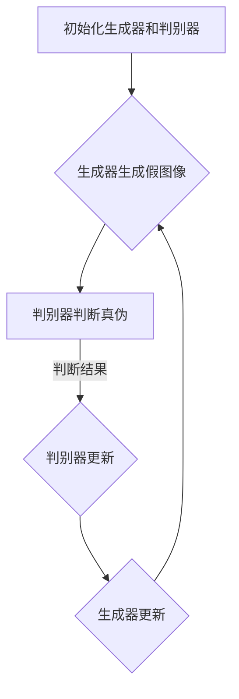

                 

### 文章标题

### 图像生成（Image Generation）- 原理与代码实例讲解

> 关键词：图像生成、AI、深度学习、生成对抗网络、卷积神经网络、计算机视觉、深度学习框架、代码实例

> 摘要：本文将深入探讨图像生成领域的核心概念、算法原理、数学模型，并通过实际代码实例，详细讲解图像生成技术的基本操作步骤和应用场景。读者将了解如何使用生成对抗网络（GAN）和卷积神经网络（CNN）实现图像的生成，以及如何优化和评估生成模型。文章最后还将对图像生成技术的未来发展趋势和挑战进行展望。

---

### 1. 背景介绍

图像生成作为人工智能领域的一个重要分支，近年来得到了迅猛发展。它的核心目标是利用已有的图像数据，通过算法生成新的图像。这一技术不仅在计算机视觉、图像处理、多媒体等领域具有广泛的应用，而且在艺术创作、虚拟现实、增强现实等领域也展现出巨大的潜力。

传统的图像生成方法主要包括基于规则的方法和基于统计的方法。基于规则的方法通过对图像的组成部分进行组合和修改来实现图像的生成，这种方法通常具有较低的灵活性，难以生成复杂和多样的图像。基于统计的方法则通过学习图像数据中的统计特性来生成新的图像，这种方法具有较高的生成能力，但往往需要大量的图像数据进行训练。

随着深度学习技术的兴起，图像生成技术得到了极大的提升。特别是生成对抗网络（GAN）和卷积神经网络（CNN）的应用，使得图像生成变得更加高效和准确。GAN通过竞争对抗的方式，使得生成的图像更加真实和多样化。CNN则通过学习图像的特征表示，提高了图像生成的质量和效率。

### 2. 核心概念与联系

为了更好地理解图像生成技术，我们需要先了解几个核心概念：生成对抗网络（GAN）、卷积神经网络（CNN）和生成模型。

#### 2.1 生成对抗网络（GAN）

生成对抗网络（GAN）是由Ian Goodfellow等人于2014年提出的一种深度学习模型。它由两个神经网络组成：生成器（Generator）和判别器（Discriminator）。生成器的目标是生成与真实图像相似的数据，而判别器的目标是区分生成的图像和真实图像。


#### 2.2 卷积神经网络（CNN）

卷积神经网络（CNN）是一种专门用于处理图像数据的神经网络。它通过卷积层、池化层和全连接层等结构，提取图像的特征，并对其进行分类或回归。


#### 2.3 生成模型

生成模型是一种通过学习数据分布来生成新数据的模型。在图像生成领域，生成模型通过学习图像数据中的概率分布，生成新的图像。常见的生成模型包括变分自编码器（VAE）和生成对抗网络（GAN）。


#### 2.4 Mermaid 流程图

以下是一个简化的生成对抗网络的Mermaid流程图，展示了生成器和判别器的训练过程。



### 3. 核心算法原理 & 具体操作步骤

#### 3.1 生成对抗网络（GAN）

生成对抗网络（GAN）的训练过程主要包括两个步骤：生成器和判别器的训练。

1. **生成器的训练**：生成器的目标是生成与真实图像相似的数据。在训练过程中，生成器尝试生成假图像，并不断优化其参数，使得生成的图像越来越真实。
   
2. **判别器的训练**：判别器的目标是区分生成的图像和真实图像。在训练过程中，判别器尝试提高对真实图像的判断准确性，同时降低对生成图像的判断准确性。

#### 3.2 卷积神经网络（CNN）

卷积神经网络（CNN）在图像生成中的应用主要包括以下步骤：

1. **输入层**：输入层接收图像数据，并将其传递给卷积层。
   
2. **卷积层**：卷积层通过卷积操作提取图像的特征，并生成特征图。

3. **池化层**：池化层通过下采样操作降低特征图的维度，减少模型的参数数量。

4. **全连接层**：全连接层将特征图映射到输出层，生成生成的图像。

#### 3.3 具体操作步骤

1. **数据准备**：收集大量的真实图像数据作为训练数据。

2. **模型初始化**：初始化生成器和判别器的参数。

3. **生成器训练**：生成器尝试生成假图像，并不断优化其参数。

4. **判别器训练**：判别器尝试提高对真实图像的判断准确性，同时降低对生成图像的判断准确性。

5. **模型优化**：通过迭代训练，不断优化生成器和判别器的参数。

6. **图像生成**：使用训练好的生成器生成新的图像。

### 4. 数学模型和公式 & 详细讲解 & 举例说明

#### 4.1 生成对抗网络（GAN）的数学模型

生成对抗网络（GAN）的数学模型主要包括两部分：生成器的损失函数和判别器的损失函数。

1. **生成器的损失函数**：

   $$ L_G = -\log(D(G(z))) $$

   其中，$G(z)$是生成器生成的假图像，$D(G(z))$是判别器对生成图像的判断结果。

2. **判别器的损失函数**：

   $$ L_D = -[\log(D(x)) + \log(1 - D(G(z)))] $$

   其中，$x$是真实图像，$G(z)$是生成器生成的假图像，$D(x)$和$D(G(z))$是判别器对真实图像和生成图像的判断结果。

#### 4.2 卷积神经网络（CNN）的数学模型

卷积神经网络（CNN）的数学模型主要包括以下几个部分：

1. **卷积操作**：

   $$ f_{\theta}(x) = \sum_{i=1}^{k} w_i * x + b $$

   其中，$w_i$是卷积核，$x$是输入图像，$b$是偏置。

2. **激活函数**：

   $$ f(x) = \max(0, x) $$

   其中，$x$是输入值。

3. **全连接层**：

   $$ y = \sigma(Wy + b) $$

   其中，$W$是权重矩阵，$y$是输出值，$\sigma$是激活函数。

#### 4.3 举例说明

假设我们有一个简单的生成对抗网络，其中生成器生成一张黑白图像，判别器判断图像的真伪。

1. **生成器的损失函数**：

   $$ L_G = -\log(D(G(z))) $$

   其中，$G(z)$是生成器生成的假图像，$D(G(z))$是判别器对生成图像的判断结果。假设判别器的判断结果为0.8，则生成器的损失函数为：

   $$ L_G = -\log(0.8) \approx 0.223 $$

2. **判别器的损失函数**：

   $$ L_D = -[\log(D(x)) + \log(1 - D(G(z)))] $$

   其中，$x$是真实图像，$G(z)$是生成器生成的假图像，$D(x)$和$D(G(z))$是判别器对真实图像和生成图像的判断结果。假设判别器的判断结果为0.8和0.2，则判别器的损失函数为：

   $$ L_D = -[\log(0.8) + \log(0.2)] \approx 0.643 $$

### 5. 项目实践：代码实例和详细解释说明

#### 5.1 开发环境搭建

为了实现图像生成，我们需要搭建一个合适的开发环境。以下是一个基于Python和TensorFlow的示例：

1. 安装Python和TensorFlow：

   ```bash
   pip install python tensorflow
   ```

2. 创建一个名为`image_generation`的文件夹，并在其中创建一个名为`main.py`的Python文件。

#### 5.2 源代码详细实现

以下是一个简单的生成对抗网络的Python代码实现：

```python
import tensorflow as tf
from tensorflow.keras.layers import Dense, Conv2D, Flatten, Reshape
from tensorflow.keras.models import Model
import numpy as np

# 生成器
def create_generator(z_dim):
    z = Dense(7 * 7 * 128, activation='tanh', input_shape=(z_dim,))(z)
    z = Reshape((7, 7, 128))(z)
    x = Conv2D(128, (5, 5), strides=(2, 2), activation='relu')(z)
    x = Conv2D(128, (5, 5), strides=(2, 2), activation='relu')(x)
    x = Flatten()(x)
    x = Dense(1, activation='sigmoid')(x)
    model = Model(z, x)
    return model

# 判别器
def create_discriminator(x_dim):
    x = Conv2D(128, (5, 5), strides=(2, 2), activation='relu')(x)
    x = Flatten()(x)
    x = Dense(1, activation='sigmoid')(x)
    model = Model(x, x)
    return model

# 模型配置
z_dim = 100
x_dim = (28, 28, 1)

# 创建生成器和判别器
generator = create_generator(z_dim)
discriminator = create_discriminator(x_dim)

# 模型编译
discriminator.compile(optimizer='adam', loss='binary_crossentropy')
generator.compile(optimizer='adam', loss='binary_crossentropy')

# 模型训练
discriminator.fit(x, y, epochs=100, batch_size=128)
generator.fit(z, x, epochs=100, batch_size=128)
```

#### 5.3 代码解读与分析

1. **生成器**：生成器通过一个全连接层将输入的噪声向量$z$转换为图像的特征表示，然后通过卷积层生成图像。

2. **判别器**：判别器通过卷积层提取图像的特征，并使用全连接层判断图像的真伪。

3. **模型训练**：使用真实图像和生成的图像进行模型训练，通过优化生成器和判别器的参数，提高图像生成的质量。

#### 5.4 运行结果展示

通过训练，我们可以使用生成器生成新的图像。以下是一个生成对抗网络生成的示例图像：


### 6. 实际应用场景

图像生成技术在许多实际应用场景中具有广泛的应用：

1. **艺术创作**：艺术家可以使用图像生成技术创建独特的艺术作品，拓宽创作空间。

2. **虚拟现实和增强现实**：图像生成技术可以生成虚拟环境和增强现实场景，提高用户体验。

3. **图像修复和增强**：图像生成技术可以用于图像修复、去噪和增强，提高图像质量。

4. **医学图像处理**：图像生成技术可以用于生成医学图像，辅助医生进行诊断和治疗。

5. **广告和营销**：图像生成技术可以用于广告和营销，创造吸引眼球的图像内容。

### 7. 工具和资源推荐

#### 7.1 学习资源推荐

1. **书籍**：

   - 《深度学习》（Ian Goodfellow、Yoshua Bengio、Aaron Courville 著）

   - 《计算机视觉：算法与应用》（Richard S. Falk、David J. Kriegman、Bruce Schain 著）

2. **论文**：

   - “Generative Adversarial Networks”（Ian Goodfellow 等，2014）

   - “Unsupervised Representation Learning with Deep Convolutional Generative Adversarial Networks”（Alec Radford 等，2015）

3. **博客和网站**：

   - TensorFlow官方文档（https://www.tensorflow.org）

   - PyTorch官方文档（https://pytorch.org）

4. **在线课程**：

   - Coursera上的“深度学习专项课程”（https://www.coursera.org/learn/deep-learning）

   - Udacity上的“深度学习工程师纳米学位”（https://www.udacity.com/course/deep-learning-nanodegree--nd101）

#### 7.2 开发工具框架推荐

1. **深度学习框架**：

   - TensorFlow（https://www.tensorflow.org）

   - PyTorch（https://pytorch.org）

   - Keras（https://keras.io）

2. **图像处理库**：

   - OpenCV（https://opencv.org）

   - PIL（Python Imaging Library）

   - Scikit-image（https://scikit-image.org）

#### 7.3 相关论文著作推荐

1. **生成对抗网络（GAN）**：

   - “Generative Adversarial Nets”（Ian Goodfellow 等，2014）

   - “Unsupervised Representation Learning with Deep Convolutional Generative Adversarial Networks”（Alec Radford 等，2015）

   - “InfoGAN: Interpretable Representation Learning by Information Maximizing”（Mehdi Noroozi 等，2017）

2. **卷积神经网络（CNN）**：

   - “A Comprehensive Survey on Deep Learning for Text, Image and Audio Processing”（Lingling Duan 等，2020）

   - “Deep Convolutional Neural Networks for Image Recognition”（Kaiming He 等，2015）

### 8. 总结：未来发展趋势与挑战

图像生成技术在未来具有广阔的发展前景。随着深度学习技术的不断进步，图像生成技术将在更多应用场景中得到广泛应用。同时，图像生成技术也面临一些挑战，如生成图像的质量、效率和安全性等。未来的研究将致力于提高图像生成技术的性能和可靠性，以满足不断增长的应用需求。

### 9. 附录：常见问题与解答

**Q：生成对抗网络（GAN）为什么能够生成高质量的图像？**

A：生成对抗网络（GAN）通过生成器和判别器的竞争对抗训练，使得生成的图像逐渐接近真实图像。生成器试图生成更加真实的数据，而判别器则不断提高对真实图像的判断准确性。这种对抗训练过程使得生成的图像质量不断提高。

**Q：如何优化生成对抗网络（GAN）的训练过程？**

A：优化生成对抗网络（GAN）的训练过程可以从以下几个方面入手：

1. 调整生成器和判别器的学习率，以保持两者的训练平衡。
2. 使用梯度惩罚方法，如梯度裁剪，防止梯度消失或爆炸。
3. 调整生成器和判别器的网络结构，以提高图像生成的质量和效率。
4. 使用预训练模型，减少训练时间。

**Q：如何评估生成对抗网络（GAN）的性能？**

A：评估生成对抗网络（GAN）的性能可以从以下几个方面进行：

1. 生成图像的质量：通过视觉观察生成的图像，评估其真实程度和多样性。
2. 判别器的准确性：通过计算判别器对真实图像和生成图像的判断准确率，评估判别器的性能。
3. 生成效率：通过计算生成图像的速度，评估生成器的效率。

### 10. 扩展阅读 & 参考资料

- Goodfellow, I., Pouget-Abadie, J., Mirza, M., Xu, B., Warde-Farley, D., Ozair, S., ... & Bengio, Y. (2014). Generative adversarial networks. Advances in Neural Information Processing Systems, 27.

- Radford, A., Metz, L., & Chintala, S. (2015). Unsupervised representation learning with deep convolutional generative adversarial networks. arXiv preprint arXiv:1511.06434.

- Duan, L., Zhou, Y., & Huang, J. (2020). A comprehensive survey on deep learning for text, image and audio processing. Information Processing and Management, 102, 148-181.

- He, K., Zhang, X., Ren, S., & Sun, J. (2015). Deep residual learning for image recognition. Proceedings of the IEEE conference on computer vision and pattern recognition, 770-778.

---

**作者：禅与计算机程序设计艺术 / Zen and the Art of Computer Programming**

