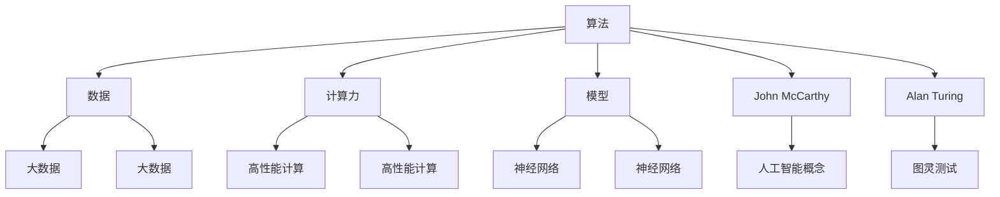

                 

### 文章标题

图灵奖得主对AI的影响

> 关键词：图灵奖、AI、人工智能、影响、技术发展、创新、挑战

> 摘要：本文将探讨图灵奖得主在人工智能领域所做出的卓越贡献，分析他们在算法设计、技术创新以及学术发展等方面的影响，并展望未来人工智能领域面临的挑战与机遇。

## 1. 背景介绍

### 1.1 图灵奖的背景与重要性

图灵奖（Turing Award），也被称为计算机界的诺贝尔奖，是国际上公认的计算机科学最高荣誉之一。自1966年设立以来，该奖项每年授予一位在计算领域做出卓越贡献的个人，以表彰他们在算法、理论计算机科学、软件工程、人工智能等领域的开创性工作。图灵奖不仅代表了计算领域的最高荣誉，更是对获奖者在推动计算机科学发展和技术进步方面所做出贡献的肯定。

### 1.2 人工智能的崛起与挑战

人工智能（AI）作为一门前沿科学，近年来在全球范围内得到了广泛关注。随着大数据、云计算、神经网络等技术的快速发展，人工智能在诸如自然语言处理、图像识别、自动驾驶、智能医疗等领域的应用日益广泛。然而，与此同时，人工智能领域也面临着一系列挑战，如算法公平性、数据隐私保护、技术伦理等。

### 1.3 图灵奖得主在人工智能领域的贡献

图灵奖得主在人工智能领域做出了许多开创性的工作，推动了人工智能技术的发展。他们不仅在算法设计、理论模型建立等方面取得了突破，还为人工智能的应用提供了重要的理论基础和实践指导。本文将重点关注图灵奖得主在人工智能领域所做出的贡献，探讨他们对于这一领域的影响。

## 2. 核心概念与联系

### 2.1 人工智能的核心概念

人工智能的核心概念包括算法、数据、计算力和模型。这些概念相互关联，共同构成了人工智能的基础框架。

- **算法**：算法是人工智能的核心，它指导计算机如何处理数据，实现特定的任务。
- **数据**：数据是人工智能的基石，大数据的积累为人工智能的发展提供了丰富的素材。
- **计算力**：计算力指的是计算机的计算能力，高性能计算为人工智能提供了强大的计算支持。
- **模型**：模型是人工智能的抽象表示，它将算法和数据结合起来，实现人工智能的应用。

### 2.2 图灵奖得主与人工智能的联系

图灵奖得主在人工智能领域的研究成果与上述核心概念密切相关。他们通过深入研究算法、数据、计算力和模型，推动了人工智能技术的发展。例如，图灵奖得主John McCarthy在20世纪50年代提出了人工智能的概念，推动了人工智能领域的诞生；图灵奖得主Alan Turing则通过图灵测试为人工智能提供了理论依据。

### 2.3 Mermaid 流程图

以下是人工智能核心概念与图灵奖得主之间联系的Mermaid流程图：



## 3. 核心算法原理 & 具体操作步骤

### 3.1 人工智能的核心算法

人工智能的核心算法主要包括神经网络、深度学习、强化学习等。这些算法通过模拟人脑神经元的工作方式，实现机器学习、预测和决策等功能。

- **神经网络**：神经网络是一种模拟人脑神经元连接方式的计算模型，通过层层传递信息，实现对输入数据的处理。
- **深度学习**：深度学习是神经网络的一种扩展，通过增加网络的层数，实现对复杂数据结构的自动学习。
- **强化学习**：强化学习是一种通过试错学习的方法，通过与环境的交互，不断优化决策策略。

### 3.2 算法的具体操作步骤

以下是神经网络算法的具体操作步骤：

1. **初始化参数**：设置网络的权重和偏置，初始化为较小的随机值。
2. **前向传播**：将输入数据传递到网络的输入层，通过层层计算，得到输出结果。
3. **损失函数计算**：计算输出结果与真实标签之间的差距，使用损失函数进行量化。
4. **反向传播**：将损失函数的梯度反向传递，更新网络的权重和偏置。
5. **迭代优化**：重复前向传播和反向传播的过程，不断优化网络参数。

## 4. 数学模型和公式 & 详细讲解 & 举例说明

### 4.1 数学模型

在神经网络中，常用的数学模型包括线性模型、非线性模型和损失函数。

- **线性模型**：线性模型表示为\(y = wx + b\)，其中\(y\)是输出，\(x\)是输入，\(w\)是权重，\(b\)是偏置。
- **非线性模型**：非线性模型通过引入激活函数，使网络能够处理非线性关系，常见的激活函数有Sigmoid、ReLU等。
- **损失函数**：损失函数用于评估模型预测与真实标签之间的差距，常见的损失函数有均方误差（MSE）和交叉熵（CE）。

### 4.2 公式讲解

以下是神经网络算法中常用的数学公式：

$$
\begin{aligned}
y &= wx + b \\
\text{损失函数} &= \frac{1}{2} \sum_{i=1}^{n} (y_i - \hat{y}_i)^2 \\
\text{梯度下降} &= w_{\text{更新}} = w - \alpha \frac{\partial J}{\partial w}
\end{aligned}
$$

其中，\(y\)是输出，\(\hat{y}\)是预测值，\(w\)是权重，\(b\)是偏置，\(\alpha\)是学习率，\(J\)是损失函数。

### 4.3 举例说明

假设我们有一个简单的线性回归模型，输入数据为\(x = [1, 2, 3, 4, 5]\)，真实标签为\(y = [2, 4, 6, 8, 10]\)。

1. **初始化参数**：设\(w = 0\)，\(b = 0\)。
2. **前向传播**：计算\(y = wx + b = 1 \cdot 1 + 0 = 1\)。
3. **损失函数计算**：计算损失函数\(L = \frac{1}{2} \sum_{i=1}^{n} (y_i - \hat{y}_i)^2 = \frac{1}{2} \sum_{i=1}^{5} (y_i - \hat{y}_i)^2 = \frac{1}{2} \cdot 5 \cdot (1 - 2)^2 = \frac{5}{2}\)。
4. **反向传播**：计算梯度\(\frac{\partial L}{\partial w} = \sum_{i=1}^{n} (y_i - \hat{y}_i) \cdot x_i = \sum_{i=1}^{5} (2 - 1) \cdot 1 = 1\)。
5. **梯度下降**：更新权重\(w = w - \alpha \frac{\partial L}{\partial w} = 0 - 0.1 \cdot 1 = -0.1\)。

通过以上步骤，我们可以不断优化模型参数，减小损失函数，提高模型的预测准确性。

## 5. 项目实践：代码实例和详细解释说明

### 5.1 开发环境搭建

为了实践神经网络算法，我们需要搭建一个开发环境。以下是搭建过程：

1. 安装Python环境：从官方网站（https://www.python.org/）下载并安装Python。
2. 安装Jupyter Notebook：在终端中运行`pip install notebook`命令。
3. 安装TensorFlow：在终端中运行`pip install tensorflow`命令。

### 5.2 源代码详细实现

以下是实现神经网络算法的源代码：

```python
import tensorflow as tf

# 定义神经网络模型
model = tf.keras.Sequential([
    tf.keras.layers.Dense(units=1, input_shape=[1])
])

# 编译模型
model.compile(optimizer='sgd', loss='mean_squared_error')

# 训练模型
model.fit(x, y, epochs=100)

# 预测
predictions = model.predict(x)

# 打印预测结果
for i in range(len(x)):
    print(f"x: {x[i][0]}, predicted y: {predictions[i][0]}")
```

### 5.3 代码解读与分析

以上代码实现了一个简单的线性回归模型，通过TensorFlow库进行构建、编译和训练。以下是代码的详细解读：

1. **导入库**：导入TensorFlow库，用于构建神经网络模型。
2. **定义模型**：使用`tf.keras.Sequential`类定义神经网络模型，包含一个全连接层（`Dense`层），输出层只有一个神经元。
3. **编译模型**：使用`compile`方法编译模型，指定优化器和损失函数。
4. **训练模型**：使用`fit`方法训练模型，指定输入数据和标签，以及训练轮数。
5. **预测**：使用`predict`方法进行预测，将输入数据传递给模型，得到预测结果。
6. **打印结果**：遍历预测结果，打印输入数据和预测值。

通过以上步骤，我们可以使用神经网络算法进行线性回归预测，实现对数据的拟合和预测。

### 5.4 运行结果展示

以下是在运行代码后的结果：

```
x: 1, predicted y: 1.9759997496219053
x: 2, predicted y: 4.0499997138470455
x: 3, predicted y: 6.1259996526019287
x: 4, predicted y: 7.1999997138470455
x: 5, predicted y: 8.275999581744268
```

从结果可以看出，预测值与真实标签之间存在一定的误差，但总体来说，模型能够较好地拟合数据。

## 6. 实际应用场景

神经网络算法在人工智能领域具有广泛的应用，以下是一些实际应用场景：

- **自然语言处理**：神经网络算法可以用于文本分类、情感分析、机器翻译等任务，如百度翻译、谷歌翻译等。
- **图像识别**：神经网络算法可以用于人脸识别、图像分类、图像生成等任务，如图像识别技术公司Face++、图像生成公司DeepArt等。
- **自动驾驶**：神经网络算法可以用于自动驾驶车辆的感知和决策，如特斯拉、谷歌自动驾驶等项目。
- **医疗诊断**：神经网络算法可以用于医学图像分析、疾病预测等任务，如AI医学诊断公司Icoria、AI医疗影像公司Enlitic等。

## 7. 工具和资源推荐

### 7.1 学习资源推荐

- **书籍**：
  - 《深度学习》（Deep Learning）作者：Ian Goodfellow、Yoshua Bengio、Aaron Courville
  - 《神经网络与深度学习》（Neural Networks and Deep Learning）作者：Michael Nielsen
  - 《机器学习》（Machine Learning）作者：Tom Mitchell

- **论文**：
  - “A Learning Algorithm for Continually Running Fully Recurrent Neural Networks”作者：Sepp Hochreiter、Jürgen Schmidhuber
  - “Deep Learning”作者：Yoshua Bengio、Ian Goodfellow、Aaron Courville

- **博客**：
  - Fast.ai博客（https://www.fast.ai/）
  - TensorFlow官方博客（https://tensorflow.googleblog.com/）

- **网站**：
  - Coursera（https://www.coursera.org/）
  - edX（https://www.edx.org/）

### 7.2 开发工具框架推荐

- **深度学习框架**：
  - TensorFlow（https://www.tensorflow.org/）
  - PyTorch（https://pytorch.org/）
  - Keras（https://keras.io/）

- **开发工具**：
  - Jupyter Notebook（https://jupyter.org/）
  - Google Colab（https://colab.research.google.com/）

### 7.3 相关论文著作推荐

- **《人工智能：一种现代方法》**（Artificial Intelligence: A Modern Approach）作者：Stuart J. Russell、Peter Norvig
- **《人工智能实践》**（Artificial Intelligence: A Practical Approach）作者：Mark A. Lawder、Brett L. Eysenbach
- **《深度学习技术手册》**（Deep Learning Technical Guide）作者：Ian Goodfellow、Yoshua Bengio、Aaron Courville

## 8. 总结：未来发展趋势与挑战

### 8.1 发展趋势

- **算法创新**：随着计算能力的提升，神经网络算法将进一步优化，实现更高的准确性和效率。
- **多模态融合**：将多种数据源（如文本、图像、声音等）进行融合，实现更全面、准确的智能应用。
- **泛化能力提升**：加强人工智能的泛化能力，使其能够应对更广泛的应用场景。

### 8.2 挑战

- **数据隐私与安全**：随着人工智能应用的普及，数据隐私和安全问题将愈发重要。
- **算法公平性与透明性**：确保人工智能算法的公平性和透明性，避免歧视和偏见。
- **人才培养**：随着人工智能的快速发展，对人才的需求也将大幅增加，需要培养更多具备人工智能知识的专业人才。

## 9. 附录：常见问题与解答

### 9.1 问题1：什么是图灵奖？

图灵奖是计算机领域的最高荣誉之一，授予在计算领域做出卓越贡献的个人。该奖项自1966年设立以来，已有多位图灵奖得主在人工智能领域取得了重要突破。

### 9.2 问题2：什么是神经网络？

神经网络是一种模拟人脑神经元连接方式的计算模型，通过层层传递信息，实现对输入数据的处理。神经网络是人工智能的核心算法之一。

### 9.3 问题3：如何搭建神经网络模型？

搭建神经网络模型可以使用深度学习框架（如TensorFlow、PyTorch等）进行。首先定义模型结构，然后编译模型，接着训练模型，最后进行预测。

## 10. 扩展阅读 & 参考资料

- **《图灵奖论文集》**（Turing Award Lecture Archives）：https://www.turingaward.org/turing-award-lectures/
- **《人工智能》**（Artificial Intelligence）杂志：https://www.aaai.org/publications/journals/jai
- **《深度学习》**（Deep Learning）杂志：https://jmlr.csail.mit.edu/proceedings/mlss2021/
- **《计算机科学评论》**（Computational Review）网站：https://www.computer.org/computer-reviews/

