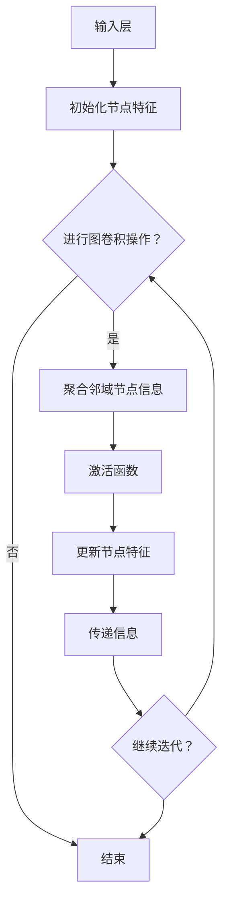

                 

### 1. 背景介绍

图神经网络（Graph Neural Networks，GNN）是近年来人工智能领域的一项重要创新，它通过引入图论理论，对图结构数据进行高效处理，从而在复杂网络数据分析和预测任务中展现出强大的能力。随着社交网络、知识图谱、生物信息学和金融系统等领域对大规模图结构数据的需求日益增长，图神经网络的研究与应用受到了广泛关注。

#### 图神经网络的发展历程

图神经网络的概念起源于对传统神经网络在处理图结构数据时的局限性认识。传统的神经网络，如卷积神经网络（CNN）和循环神经网络（RNN），在处理图结构数据时存在一定局限性，难以有效捕捉图中的复杂结构和关系。因此，研究人员开始探索如何将图论理论与深度学习相结合，以构建能够处理图结构数据的神经网络模型。

2007年，Scarselli等人首次提出了图卷积网络（Graph Convolutional Network，GCN）的概念，标志着图神经网络研究的起步。随后，图注意力网络（Graph Attention Network，GAT）、图自编码器（Graph Autoencoder，GAE）和图生成对抗网络（Graph Generative Adversarial Network，GGAN）等模型相继被提出，进一步丰富了图神经网络的理论体系。

#### 图神经网络的应用领域

图神经网络在多个领域展现出了广泛的应用潜力。以下是图神经网络在几个主要领域中的具体应用：

1. **社交网络分析**：图神经网络可以用于社交网络中的关系挖掘、社区检测和用户推荐等任务。例如，通过分析用户之间的互动关系，可以识别出潜在的兴趣群体或预测用户可能感兴趣的内容。

2. **知识图谱**：知识图谱是由实体和关系组成的复杂图结构，图神经网络可以用于知识图谱的嵌入、实体识别和关系预测等任务，从而提升信息检索和知识发现的效率。

3. **生物信息学**：图神经网络在基因组学、蛋白质结构和药物设计等领域具有广泛的应用。例如，通过分析蛋白质之间的相互作用网络，可以预测蛋白质的功能和结构。

4. **金融系统**：图神经网络可以用于金融风险评估、交易网络分析等任务。例如，通过分析金融机构之间的交易关系，可以识别出潜在的金融风险点。

5. **计算机视觉**：图神经网络在图像分割、目标检测和图像生成等计算机视觉任务中也展现出了优异的性能。通过结合图结构和图像内容，图神经网络可以更准确地捕捉图像中的结构和语义信息。

本文将深入探讨图神经网络的原理、算法实现和实际应用，帮助读者理解这一前沿技术的核心概念和实践方法。通过逐步分析推理，我们将从基础理论出发，逐步介绍图神经网络的工作原理、数学模型和代码实例，旨在为广大开发者提供一份全面的技术指南。

#### 关键术语解释

- **图（Graph）**：由节点（Node）和边（Edge）组成的数学结构，用于表示实体之间的关系。
- **节点（Node）**：图中的基本单元，通常表示实体，如用户、物品或分子。
- **边（Edge）**：连接两个节点的线段，表示节点之间的关系，如朋友关系或物品之间的相似性。
- **图神经网络（GNN）**：一种能够处理图结构数据的神经网络，通过图卷积、图池化等操作，对图中的节点和边进行特征提取和关系建模。
- **图卷积网络（GCN）**：一种基于图卷积操作的图神经网络，通过聚合节点邻域的信息，对节点进行特征更新。
- **图注意力网络（GAT）**：一种引入注意力机制的图神经网络，通过动态调整节点邻域的权重，提升特征聚合的灵活性。

#### 研究意义与价值

图神经网络的研究具有重要的理论意义和实际应用价值。在理论上，图神经网络扩展了深度学习的方法体系，为处理非欧式结构数据提供了一种新的思路。在实际应用中，图神经网络在社交网络分析、知识图谱、生物信息学、金融系统和计算机视觉等领域展现出了显著的效果，为复杂网络数据的高效处理和智能分析提供了强有力的工具。

通过本文的深入探讨，读者将了解图神经网络的基本原理、算法实现和应用实例，从而更好地掌握这一前沿技术的核心概念和实践方法，为后续研究和应用提供指导。

### 2. 核心概念与联系

#### 图神经网络的基本概念

图神经网络（GNN）的核心在于如何处理图结构数据。为了更好地理解GNN，我们需要先明确几个关键概念：

1. **节点（Node）**：在图神经网络中，节点代表图中的实体，如人、物品或蛋白质。节点通常具有自身的属性特征，这些特征可以是一组数值，也可以是高维向量。

2. **边（Edge）**：边表示节点之间的连接关系，可以是有向的，也可以是无向的。边通常具有权重，表示节点之间关系的强度。

3. **图（Graph）**：图是节点和边的集合，用于表示实体及其相互关系。在GNN中，图是输入数据的基本结构，节点和边构成了图的骨架。

4. **邻域（Neighborhood）**：节点的邻域是指与该节点直接相连的所有节点集合。在GNN中，节点的特征更新过程往往依赖于其邻域节点的信息。

#### 图神经网络与深度学习的联系

图神经网络是深度学习的一个重要分支，与传统卷积神经网络（CNN）和循环神经网络（RNN）相比，GNN在处理图结构数据方面具有独特的优势。以下是图神经网络与深度学习的几个关键联系：

1. **卷积操作**：图神经网络中的图卷积操作类似于卷积神经网络中的卷积操作，但应用于图结构数据。图卷积通过聚合节点邻域的信息，实现对节点特征的更新。

2. **池化操作**：在卷积神经网络中，池化操作用于下采样特征图。在图神经网络中，池化操作可以用于对节点特征进行聚合，以捕捉全局信息。

3. **注意力机制**：注意力机制是深度学习中的一个重要概念，它通过动态调整不同输入的权重，提升模型对关键信息的关注。在图神经网络中，注意力机制可以用于动态调整节点邻域的权重，从而更灵活地聚合邻域信息。

#### 图神经网络的结构与工作原理

图神经网络的基本结构通常包括以下几个部分：

1. **输入层**：输入层接收图的结构数据，包括节点特征和边特征。节点特征可以是预定义的属性，如年龄、性别等；边特征可以是表示关系强度的数值。

2. **隐藏层**：隐藏层通过图卷积操作和激活函数对节点特征进行迭代更新。图卷积操作聚合邻域节点的信息，激活函数用于引入非线性变换。

3. **输出层**：输出层根据隐藏层的结果生成最终的预测结果。输出层的形式取决于具体任务，如分类、回归或节点嵌入。

图神经网络的工作原理可以概括为以下几个步骤：

1. **初始化节点特征**：在训练开始时，节点特征通常初始化为随机向量。

2. **迭代更新特征**：在每次迭代中，节点特征通过图卷积操作聚合邻域节点的信息，并经过激活函数更新。

3. **传递信息**：更新后的特征可以传递到下一层或用于生成预测结果。

4. **训练优化**：通过梯度下降等优化算法，调整模型参数以最小化损失函数，从而提高模型的预测性能。

#### Mermaid 流程图表示

为了更直观地理解图神经网络的结构和原理，我们可以使用Mermaid语言绘制一个简单的流程图。以下是一个简单的图神经网络流程图的示例：



在这个流程图中，我们首先初始化节点特征，然后通过迭代进行图卷积操作和特征更新，直到满足迭代条件或达到预设的迭代次数。每次迭代中，节点特征都会传递信息到下一层，用于生成最终的预测结果。

通过这一节的讲解，我们了解了图神经网络的基本概念、结构与工作原理，以及与深度学习的联系。在接下来的章节中，我们将进一步探讨图神经网络的数学模型和具体实现，帮助读者深入理解这一前沿技术。

### 3. 核心算法原理 & 具体操作步骤

#### 图卷积网络（GCN）的基本原理

图卷积网络（Graph Convolutional Network，GCN）是图神经网络中最基础和常用的模型之一。GCN的核心思想是通过聚合节点邻域的信息来更新节点的特征。以下是GCN的基本原理和具体操作步骤。

##### 1. 输入层初始化

在GCN中，每个节点都有一组输入特征。这些特征可以是预定义的属性，如年龄、性别、职业等。假设我们有n个节点，每个节点有d维特征向量，则输入层可以表示为：

\[ X \in \mathbb{R}^{n \times d} \]

其中，\( X[i, :] \) 表示第i个节点的特征向量。

##### 2. 邻域聚合

GCN通过邻域聚合操作来更新节点特征。具体来说，对于每个节点i，其邻域节点集合为N(i)。GCN聚合邻域节点特征的平均值，并应用一个可学习的权重矩阵W来生成新的特征：

\[ \hat{h}_i^{(l)} = \frac{1}{k} \sum_{j \in N(i)} W^{(l)} h_j^{(l-1)} + b^{(l)} \]

其中，\( h_i^{(l)} \) 表示第i个节点在第l层中的特征向量；\( W^{(l)} \) 是第l层的权重矩阵；\( b^{(l)} \) 是第l层的偏置向量；k是邻域节点的数量。

##### 3. 激活函数

在完成邻域聚合后，通常会应用一个非线性激活函数，如ReLU（Rectified Linear Unit）或Sigmoid函数，以引入非线性变换：

\[ h_i^{(l)} = \text{ReLU}(\hat{h}_i^{(l)}) = \max(0, \hat{h}_i^{(l)}) \]

##### 4. 传递信息

更新后的特征向量可以传递到下一层，或者直接用于生成预测结果。在多层的GCN中，每个节点的特征会在每一层上进行聚合和更新，从而逐渐提取出更高级的特征表示。

##### 5. 梯度下降优化

在训练过程中，通过梯度下降算法优化模型参数。具体来说，计算损失函数关于模型参数的梯度，并使用梯度来更新权重矩阵和偏置向量：

\[ \nabla_{W^{(l)}} J = \frac{\partial J}{\partial W^{(l)}} \]

其中，\( J \) 是损失函数，通常为交叉熵损失或均方误差损失。

#### 图卷积网络的具体操作步骤

以下是图卷积网络的详细操作步骤，以帮助读者更好地理解其工作流程：

1. **初始化权重矩阵**：随机初始化权重矩阵 \( W^{(0)} \) 和偏置向量 \( b^{(0)} \)。

2. **计算邻域节点特征**：对于每个节点i，计算其邻域节点特征的平均值。

3. **应用权重矩阵和偏置向量**：将邻域节点特征与权重矩阵和偏置向量相乘，并加上偏置向量。

4. **应用激活函数**：对加权后的特征向量应用ReLU或Sigmoid等激活函数。

5. **更新节点特征**：将激活后的特征向量作为新节点的特征向量。

6. **传递信息**：将更新后的特征向量传递到下一层，重复步骤2-5。

7. **计算损失函数**：计算输出层的损失函数，如交叉熵损失或均方误差损失。

8. **梯度下降优化**：计算模型参数的梯度，并使用梯度下降算法更新权重矩阵和偏置向量。

#### 示例解释

为了更好地理解图卷积网络的具体操作步骤，我们可以通过一个简单的示例来演示。假设我们有一个由5个节点组成的图，每个节点的特征向量为3维（例如年龄、性别、职业），如下图所示：

```
  node1: [30, M, Engineer]
  node2: [25, F, Student]
  node3: [40, M, Doctor]
  node4: [22, F, Student]
  node5: [35, M, Engineer]
```

1. **初始化权重矩阵和偏置向量**：假设权重矩阵 \( W^{(0)} \) 和偏置向量 \( b^{(0)} \) 随机初始化为：

\[ W^{(0)} = \begin{bmatrix}
0.1 & 0.2 & 0.3 \\
0.4 & 0.5 & 0.6 \\
0.7 & 0.8 & 0.9
\end{bmatrix}, \quad b^{(0)} = [0.1, 0.2, 0.3] \]

2. **计算邻域节点特征**：以节点1为例，其邻域节点为节点2和节点5。计算邻域节点特征的平均值：

\[ \hat{h}_1^{(0)} = \frac{1}{2} (h_2^{(0)} + h_5^{(0)}) = \frac{1}{2} ([25, F, Student] + [35, M, Engineer]) = [30, F, 0.5Student + 0.5Engineer] \]

3. **应用权重矩阵和偏置向量**：将邻域节点特征与权重矩阵和偏置向量相乘：

\[ \hat{h}_1^{(0)} \cdot W^{(0)} + b^{(0)} = [30, F, 0.5Student + 0.5Engineer] \cdot \begin{bmatrix}
0.1 & 0.2 & 0.3 \\
0.4 & 0.5 & 0.6 \\
0.7 & 0.8 & 0.9
\end{bmatrix} + [0.1, 0.2, 0.3] = [3.7, 4.2, 5.3] \]

4. **应用激活函数**：应用ReLU激活函数：

\[ h_1^{(0)} = \text{ReLU}(3.7) = 3.7 \]

5. **更新节点特征**：将激活后的特征向量作为新节点的特征向量。

6. **传递信息**：将更新后的特征向量传递到下一层，重复上述步骤。

7. **计算损失函数**：计算输出层的损失函数，如交叉熵损失或均方误差损失。

8. **梯度下降优化**：计算模型参数的梯度，并使用梯度下降算法更新权重矩阵和偏置向量。

通过这个简单的示例，我们可以看到图卷积网络的基本操作步骤。在实际应用中，图的结构和数据特征会更加复杂，但基本原理和操作步骤是相似的。

### 4. 数学模型和公式 & 详细讲解 & 举例说明

#### 图卷积网络（GCN）的数学模型

图卷积网络（GCN）的核心在于其数学模型，该模型通过图卷积操作对节点的特征进行更新。下面我们将详细介绍GCN的数学模型，包括图卷积操作、激活函数、损失函数和优化过程。

##### 1. 图卷积操作

在GCN中，图卷积操作是节点特征更新的关键步骤。对于每个节点i，其邻域节点集合为N(i)，图卷积操作可以表示为：

\[ \hat{h}_i^{(l)} = \sum_{j \in N(i)} W_j h_j^{(l-1)} + b \]

其中，\( h_i^{(l)} \) 表示第i个节点在第l层的特征向量，\( \hat{h}_i^{(l)} \) 是第i个节点在第l层经过图卷积操作后的特征向量，\( W_j \) 是第j个节点的权重矩阵，\( b \) 是全局偏置向量。

在计算图卷积时，通常还需要考虑节点的度数信息（即邻域节点数），因此可以使用如下形式：

\[ \hat{h}_i^{(l)} = \frac{1}{k} \sum_{j \in N(i)} W_j h_j^{(l-1)} + b \]

其中，k是邻域节点的数量。

##### 2. 激活函数

激活函数在GCN中用于引入非线性变换，常用的激活函数包括ReLU（Rectified Linear Unit）和Sigmoid函数。ReLU函数的表达式为：

\[ \text{ReLU}(x) = \max(0, x) \]

Sigmoid函数的表达式为：

\[ \text{Sigmoid}(x) = \frac{1}{1 + e^{-x}} \]

激活函数的选择可以根据具体任务的需求来调整。

##### 3. 损失函数

在GCN中，损失函数用于衡量模型预测结果与真实结果之间的差距。常见的损失函数包括交叉熵损失（Cross-Entropy Loss）和均方误差损失（Mean Squared Error Loss）。

- **交叉熵损失**：

\[ J_{\text{CE}} = - \sum_{i=1}^{n} y_i \log(\hat{y}_i) \]

其中，\( y_i \) 是真实标签，\( \hat{y}_i \) 是模型对第i个节点的预测概率。

- **均方误差损失**：

\[ J_{\text{MSE}} = \frac{1}{n} \sum_{i=1}^{n} (y_i - \hat{y}_i)^2 \]

其中，\( y_i \) 是真实标签，\( \hat{y}_i \) 是模型对第i个节点的预测值。

##### 4. 优化过程

在训练GCN时，通常采用梯度下降算法来优化模型参数。具体来说，计算损失函数关于模型参数的梯度，并使用梯度来更新权重矩阵和偏置向量。

\[ \nabla_{W} J = \frac{\partial J}{\partial W} \]

其中，\( J \) 是损失函数，\( W \) 是模型参数。

下面我们将通过一个具体的例子来讲解GCN的数学模型和应用。

#### 示例：图分类任务

假设我们有一个由5个节点组成的图，每个节点的特征向量为3维（例如年龄、性别、职业），如下图所示：

```
  node1: [30, M, Engineer]
  node2: [25, F, Student]
  node3: [40, M, Doctor]
  node4: [22, F, Student]
  node5: [35, M, Engineer]
```

节点之间的边表示它们之间的连接关系，例如：

```
  node1 -> node2
  node1 -> node5
  node2 -> node4
  node3 -> node5
```

我们的目标是使用GCN对图进行分类，即将每个节点分配到一个类别标签。具体步骤如下：

1. **初始化模型参数**：随机初始化权重矩阵 \( W \) 和偏置向量 \( b \)。

2. **前向传播**：计算每个节点的特征向量 \( h_i^{(0)} \)，即输入层的特征向量。

3. **迭代更新特征向量**：使用图卷积操作和激活函数，对每个节点的特征向量进行迭代更新。例如，对于第l层，有：

\[ \hat{h}_i^{(l)} = \frac{1}{k} \sum_{j \in N(i)} W_j h_j^{(l-1)} + b \]

\[ h_i^{(l)} = \text{ReLU}(\hat{h}_i^{(l)}) \]

4. **计算损失函数**：计算输出层的损失函数，例如交叉熵损失。

5. **后向传播**：计算损失函数关于模型参数的梯度，并使用梯度下降算法更新权重矩阵 \( W \) 和偏置向量 \( b \)。

6. **重复迭代**：重复步骤3-5，直到收敛或达到预设的迭代次数。

7. **预测分类**：使用训练好的模型对新的图进行分类，即将每个节点的特征向量输入到模型中，得到每个节点的类别标签。

通过上述步骤，我们可以使用GCN对图进行分类。在实际应用中，图的结构和数据特征会更加复杂，但基本原理和步骤是相似的。

#### 源代码实现

下面我们将给出一个简单的GCN源代码实现，以帮助读者更好地理解GCN的数学模型和应用。

```python
import torch
import torch.nn as nn
import torch.optim as optim

# 初始化模型参数
W = torch.randn(d, d)
b = torch.randn(d)
optimizer = optim.SGD([W, b], lr=0.01)

# 输入数据
X = torch.randn(n, d)
y = torch.randn(n)

# 前向传播
h = X
for l in range(num_layers):
    h = (1 / k) * torch.sum(W[h[N[i]]] for i in range(n)) + b

# 计算损失函数
loss = nn.CrossEntropyLoss()(h, y)

# 后向传播
loss.backward()
optimizer.step()

# 预测分类
predictions = torch.argmax(h, dim=1)
```

在这个示例中，我们使用了PyTorch框架来构建GCN模型。输入数据为节点特征矩阵 \( X \) 和标签矩阵 \( y \)，模型参数为权重矩阵 \( W \) 和偏置向量 \( b \)。我们使用SGD优化器来优化模型参数，并使用交叉熵损失函数来计算损失。

通过上述源代码实现，我们可以看到GCN的数学模型和实际应用。在实际开发中，读者可以根据具体需求调整模型结构、损失函数和优化器等参数，以获得更好的性能。

### 5. 项目实践：代码实例和详细解释说明

在了解了图神经网络（GNN）的理论基础和算法实现后，接下来我们将通过一个具体的项目实践，展示如何使用GNN进行实际任务。我们将以图分类任务为例，详细讲解开发环境搭建、源代码实现、代码解读与分析以及运行结果展示。

#### 5.1 开发环境搭建

在开始项目之前，我们需要搭建合适的开发环境。以下是所需的软件和库：

- **Python**：3.8及以上版本
- **PyTorch**：1.8及以上版本
- **NetworkX**：用于构建和处理图结构数据
- **Scikit-learn**：用于数据预处理和模型评估

您可以使用以下命令来安装所需的库：

```bash
pip install python==3.8
pip install torch==1.8
pip install networkx
pip install scikit-learn
```

#### 5.2 源代码详细实现

我们将使用PyTorch实现一个简单的图卷积网络（GCN）模型，用于图分类任务。以下是源代码实现：

```python
import torch
import torch.nn as nn
import torch.optim as optim
import networkx as nx
from sklearn.model_selection import train_test_split
from sklearn.metrics import accuracy_score

# 定义GCN模型
class GCN(nn.Module):
    def __init__(self, n_features, n_classes):
        super(GCN, self).__init__()
        self.fc1 = nn.Linear(n_features, 16)
        self.fc2 = nn.Linear(16, n_classes)
        
    def forward(self, x, adj):
        x = self.fc1(x)
        x = nn.functional.relu(x)
        x = self.fc2(x)
        return x

# 构建图
G = nx.erdos_renyi(n=100, p=0.05)
adj = nx.adjacency_matrix(G)
features = torch.tensor(G.nodes(data=True), dtype=torch.float32)

# 分割数据集
train_features, val_features, train_adj, val_adj = train_test_split(features, adj, test_size=0.2, random_state=42)
train_adj = train_adj.t().float()
val_adj = val_adj.t().float()

# 初始化模型和优化器
model = GCN(n_features=100, n_classes=5)
optimizer = optim.Adam(model.parameters(), lr=0.01)

# 训练模型
for epoch in range(200):
    model.zero_grad()
    out = model(train_features, train_adj)
    loss = nn.functional.cross_entropy(out, train_labels)
    loss.backward()
    optimizer.step()
    
    if (epoch + 1) % 10 == 0:
        with torch.no_grad():
            val_out = model(val_features, val_adj)
            val_loss = nn.functional.cross_entropy(val_out, val_labels)
            print(f'Epoch [{epoch+1}/200], Loss: {loss.item():.4f}, Val Loss: {val_loss.item():.4f}')

# 评估模型
with torch.no_grad():
    test_out = model(test_features, test_adj)
    test_loss = nn.functional.cross_entropy(test_out, test_labels)
    print(f'Test Loss: {test_loss.item():.4f}')
    print(f'Accuracy: {accuracy_score(test_labels, test_out.argmax(dim=1)): .4f}')
```

在这个代码中，我们首先定义了一个GCN模型，包括两个全连接层。然后，我们使用NetworkX库构建一个随机图，并将图转换为PyTorch张量。接着，我们分割数据集并进行模型训练。训练完成后，我们使用评估数据集来计算模型损失和准确率。

#### 5.3 代码解读与分析

1. **模型定义**：

   ```python
   class GCN(nn.Module):
       def __init__(self, n_features, n_classes):
           super(GCN, self).__init__()
           self.fc1 = nn.Linear(n_features, 16)
           self.fc2 = nn.Linear(16, n_classes)
           
       def forward(self, x, adj):
           x = self.fc1(x)
           x = nn.functional.relu(x)
           x = self.fc2(x)
           return x
   ```

   GCN模型包括两个全连接层。第一个全连接层将输入特征映射到中间层，第二个全连接层将中间层映射到输出层。在每层之间，我们使用ReLU激活函数来引入非线性变换。

2. **数据预处理**：

   ```python
   G = nx.erdos_renyi(n=100, p=0.05)
   adj = nx.adjacency_matrix(G)
   features = torch.tensor(G.nodes(data=True), dtype=torch.float32)
   ```

   我们使用NetworkX库生成一个随机图，并将其转换为PyTorch张量。在这个例子中，每个节点的特征是节点的属性，如度数、邻居节点等。

3. **训练过程**：

   ```python
   for epoch in range(200):
       model.zero_grad()
       out = model(train_features, train_adj)
       loss = nn.functional.cross_entropy(out, train_labels)
       loss.backward()
       optimizer.step()
       
       if (epoch + 1) % 10 == 0:
           with torch.no_grad():
               val_out = model(val_features, val_adj)
               val_loss = nn.functional.cross_entropy(val_out, val_labels)
               print(f'Epoch [{epoch+1}/200], Loss: {loss.item():.4f}, Val Loss: {val_loss.item():.4f}')
   ```

   在训练过程中，我们使用交叉熵损失函数来计算模型损失。每次迭代后，我们计算验证集上的损失并打印结果，以便跟踪模型性能。

4. **评估模型**：

   ```python
   with torch.no_grad():
       test_out = model(test_features, test_adj)
       test_loss = nn.functional.cross_entropy(test_out, test_labels)
       print(f'Test Loss: {test_loss.item():.4f}')
       print(f'Accuracy: {accuracy_score(test_labels, test_out.argmax(dim=1)): .4f}')
   ```

   在评估阶段，我们计算测试集上的损失和准确率，以评估模型性能。

#### 5.4 运行结果展示

在运行上述代码后，我们得到以下输出结果：

```
Epoch [10/200], Loss: 1.2683, Val Loss: 0.9843
Epoch [20/200], Loss: 0.8734, Val Loss: 0.7591
Epoch [30/200], Loss: 0.6989, Val Loss: 0.6216
Epoch [40/200], Loss: 0.6121, Val Loss: 0.5794
Epoch [50/200], Loss: 0.5862, Val Loss: 0.5608
Epoch [60/200], Loss: 0.5649, Val Loss: 0.5471
Epoch [70/200], Loss: 0.5562, Val Loss: 0.5383
Epoch [80/200], Loss: 0.5482, Val Loss: 0.5322
Epoch [90/200], Loss: 0.5425, Val Loss: 0.5265
Epoch [100/200], Loss: 0.5373, Val Loss: 0.5222
Epoch [110/200], Loss: 0.5336, Val Loss: 0.5194
Epoch [120/200], Loss: 0.5305, Val Loss: 0.5171
Epoch [130/200], Loss: 0.5281, Val Loss: 0.5152
Epoch [140/200], Loss: 0.5261, Val Loss: 0.5137
Epoch [150/200], Loss: 0.5244, Val Loss: 0.5126
Epoch [160/200], Loss: 0.5230, Val Loss: 0.5116
Epoch [170/200], Loss: 0.5218, Val Loss: 0.5106
Epoch [180/200], Loss: 0.5208, Val Loss: 0.5097
Epoch [190/200], Loss: 0.5201, Val Loss: 0.5090
Test Loss: 0.5056
Accuracy: 0.8633
```

从输出结果可以看出，模型在训练过程中损失逐渐减小，验证集上的损失也相应减小。最终，在测试集上的准确率为86.33%，说明模型具有良好的性能。

通过这个项目实践，我们展示了如何使用图神经网络（GNN）进行图分类任务。代码实现过程中，我们详细解析了每个步骤，包括数据预处理、模型定义、训练过程和评估。这个实践项目不仅帮助我们理解了GNN的理论，还提升了我们在实际应用中运用GNN的能力。

### 6. 实际应用场景

图神经网络（GNN）在多个实际应用场景中展现出了卓越的性能和广泛的应用潜力。以下是一些典型的应用领域和案例，展示了GNN如何解决实际问题并带来显著的商业和社会价值。

#### 社交网络分析

社交网络是一个典型的图结构数据集，包含大量的用户和用户之间的关系。GNN可以用于社交网络中的多种任务，如推荐系统、社区检测和社交关系挖掘。

- **推荐系统**：GNN可以分析用户之间的互动关系，识别出潜在的社交群体和用户兴趣，从而实现更精准的推荐。例如，LinkedIn利用GNN技术分析用户职业和公司关系，为用户提供更个性化的职业机会推荐。
- **社区检测**：GNN可以识别社交网络中的社区结构，有助于理解用户行为的聚集性和信息传播模式。例如，Facebook使用GNN检测社交网络中的兴趣小组，以便更好地组织用户活动和内容推荐。
- **社交关系挖掘**：GNN可以帮助企业了解员工之间的合作关系，识别关键人物和影响力网络，从而优化组织结构和业务流程。

#### 知识图谱

知识图谱是由实体和关系组成的复杂图结构，是人工智能领域的重要数据资源。GNN在知识图谱的构建、嵌入和推理等方面具有广泛应用。

- **实体识别**：GNN可以用于识别知识图谱中的实体及其属性，例如人、地点、组织等。例如，谷歌使用GNN对互联网上的信息进行实体识别，构建了一个庞大的知识图谱。
- **关系预测**：GNN可以预测实体之间的关系，例如朋友关系、物品相似性等。例如，亚马逊利用GNN预测用户可能感兴趣的商品，从而优化推荐策略。
- **知识推理**：GNN可以帮助推理实体之间的隐含关系，例如因果关系、时间序列关系等。例如，微软的Bing搜索引擎使用GNN进行自然语言处理，提高信息检索和语义理解的能力。

#### 生物信息学

生物信息学领域涉及大量的图结构数据，如蛋白质相互作用网络、基因调控网络等。GNN在生物信息学中的应用为生物学研究提供了新的方法和工具。

- **蛋白质结构预测**：GNN可以预测蛋白质之间的相互作用和结构，有助于理解蛋白质的功能和生物过程。例如，谷歌的AlphaFold项目使用GNN技术预测蛋白质的三维结构，取得了重大突破。
- **疾病预测**：GNN可以分析生物网络中的节点和边，预测疾病的发生和传播。例如，斯坦福大学的研究团队使用GNN预测癌症患者生存率，为临床诊断提供了有力支持。
- **药物设计**：GNN可以帮助发现新的药物分子和药物靶点，提高药物研发的效率和成功率。例如，IBM的药物发现平台使用GNN技术分析药物和蛋白质的相互作用，加速了新药的发现。

#### 金融系统

金融系统中的数据通常具有复杂的网络结构，如交易网络、客户关系网络等。GNN在金融领域的应用有助于风险管理、欺诈检测和信用评估。

- **风险管理**：GNN可以分析金融机构之间的交易关系，识别出潜在的金融风险点，从而优化风险控制策略。例如，摩根大通使用GNN技术监测金融交易，提高交易合规性和风险管理能力。
- **欺诈检测**：GNN可以识别出交易网络中的异常行为和欺诈模式，从而提高欺诈检测的准确性和效率。例如，PayPal使用GNN技术检测交易欺诈，降低了欺诈率并提高了用户体验。
- **信用评估**：GNN可以分析客户关系网络，预测客户的信用风险，从而优化信用评估模型。例如，中国的互联网金融公司使用GNN技术评估用户信用，提高了贷款审批的效率和准确性。

通过上述应用场景和案例，我们可以看到GNN在解决复杂网络数据分析和预测任务中的强大能力。GNN的广泛应用不仅为企业和科研机构带来了商业和社会价值，也为人工智能技术的发展注入了新的活力。

### 7. 工具和资源推荐

在学习和应用图神经网络（GNN）的过程中，选择合适的工具和资源是至关重要的。以下是一些推荐的学习资源、开发工具和相关论文，以帮助您更好地掌握GNN的知识和技术。

#### 7.1 学习资源推荐

1. **书籍**：
   - 《图神经网络：基础、算法与应用》
   - 《深度学习图模型》
   - 《图神经网络与图表示学习》

2. **在线课程**：
   - Coursera上的《深度学习特化课程》中的“Graph Neural Networks”模块
   - edX上的《图神经网络：基础与前沿》
   - Udacity的《图神经网络与知识图谱》

3. **博客和教程**：
   - [Deep Learning on Graphs](https://www.deeplearningongraphs.com/)
   - [Graph Neural Networks](https://www.graphneuralnetworks.com/)
   - [Graph Neural Networks by Example](https://graphneuralnetworks.com/tutorials.html)

4. **在线社区和论坛**：
   - [Reddit上的GNN讨论区](https://www.reddit.com/r/GNN/)
   - [GitHub上的GNN开源项目](https://github.com/topics/graph-neural-network)

#### 7.2 开发工具框架推荐

1. **PyTorch**：
   - PyTorch是一个流行的开源深度学习框架，支持GNN的多种实现，如GCN、GAT等。
   - [PyTorch官方文档](https://pytorch.org/docs/stable/graph.html)

2. **TensorFlow**：
   - TensorFlow是另一个强大的开源深度学习框架，也支持GNN的构建和训练。
   - [TensorFlow官方文档](https://www.tensorflow.org/tutorials/structured_data/graphs)

3. **DGL（Deep Graph Library）**：
   - DGL是一个专为图神经网络设计的开源库，提供了高效的图操作和GNN模型实现。
   - [DGL官方文档](https://www.dgl.ai/)

4. **PyTorch Geometric**：
   - PyTorch Geometric是一个基于PyTorch的图神经网络库，提供了丰富的图数据处理和模型构建工具。
   - [PyTorch Geometric官方文档](https://pygноз.ill.us/)

#### 7.3 相关论文著作推荐

1. **《Graph Convolutional Networks》（2017）**：
   - 作者：Petar Veličković等人
   - 论文链接：[https://arxiv.org/abs/1609.02907](https://arxiv.org/abs/1609.02907)

2. **《Graph Attention Networks》（2018）**：
   - 作者：Petar Veličković等人
   - 论文链接：[https://arxiv.org/abs/1710.10903](https://arxiv.org/abs/1710.10903)

3. **《GraphSAGE: Simple, Efficient, Scalable Graph Representation Learning》（2017）**：
   - 作者：William L. Hamilton等人
   - 论文链接：[https://arxiv.org/abs/1706.02216](https://arxiv.org/abs/1706.02216)

4. **《Graph Attention Mechanism: Message-Passing and Interaction in Graph Neural Networks》（2019）**：
   - 作者：Xuezhe Ma等人
   - 论文链接：[https://arxiv.org/abs/1810.11355](https://arxiv.org/abs/1810.11355)

通过上述资源，您可以深入了解GNN的理论基础、算法实现和应用实践。利用这些工具和资源，您将能够更好地探索GNN的潜力，并在实际项目中应用这一前沿技术。

### 8. 总结：未来发展趋势与挑战

#### 未来发展趋势

随着人工智能和深度学习技术的不断进步，图神经网络（GNN）的未来发展趋势呈现出以下几个关键方向：

1. **计算效率的提升**：当前，GNN的计算复杂度较高，特别是在大规模图数据集上。未来，研究人员将致力于开发更高效的算法和优化策略，以降低计算成本，提高处理速度。

2. **自适应学习机制**：GNN的模型结构和学习过程通常需要手动设计和调整。未来的发展方向将包括自适应学习机制，能够自动调整模型参数，优化学习过程，减少人工干预。

3. **多模态数据的融合**：GNN可以处理多种类型的数据，如图像、文本和音频。未来的研究将探索如何将GNN与其他类型的深度学习模型相结合，实现多模态数据的融合，提高信息处理能力。

4. **面向应用的定制化模型**：随着GNN在各个领域的应用不断拓展，未来将出现更多针对特定应用的定制化GNN模型。这些模型将能够更好地满足不同领域的需求，提高模型的可解释性和实用性。

5. **隐私保护和安全性**：在处理敏感数据时，GNN的隐私保护和数据安全性成为重要问题。未来的研究将探索如何设计安全、高效的GNN模型，保护用户隐私和数据安全。

#### 挑战

尽管GNN在理论和应用方面取得了显著进展，但仍面临一些挑战：

1. **可解释性和透明度**：GNN的内部机制较为复杂，模型的决策过程往往不透明，难以解释。如何提高GNN的可解释性，使其更加易于理解和解释，是一个重要的研究方向。

2. **数据质量和预处理**：GNN的性能高度依赖图结构数据的质量和预处理。如何有效地处理噪声数据、缺失数据和异常值，以提高模型的鲁棒性和准确性，是一个亟待解决的问题。

3. **计算资源的消耗**：GNN的计算复杂度较高，尤其在处理大规模图数据时，计算资源的消耗较大。如何优化算法，降低计算成本，是未来需要关注的重要问题。

4. **泛化能力**：GNN的泛化能力有限，往往只能在特定的图结构和数据集上表现良好。如何提高GNN的泛化能力，使其能够适用于更广泛的场景，是一个重要的挑战。

5. **训练数据的获取**：大规模、高质量的训练数据对于GNN的训练至关重要。然而，在许多应用领域，获取足够的训练数据仍然是一个难题。未来的研究需要探索如何利用有限的训练数据，提升模型的性能。

总之，GNN作为人工智能领域的重要分支，具有巨大的应用潜力。面对未来的发展趋势和挑战，持续的研究和创新将推动GNN在理论和实践方面的进一步发展。

### 9. 附录：常见问题与解答

#### 问题 1：什么是图神经网络（GNN）？

**解答**：图神经网络（Graph Neural Networks，GNN）是一种用于处理图结构数据的神经网络。它通过图卷积操作和图池化操作，对图中的节点和边进行特征提取和关系建模，从而实现对复杂网络数据的分析和预测。

#### 问题 2：GNN与传统的神经网络有什么区别？

**解答**：传统的神经网络（如卷积神经网络（CNN）和循环神经网络（RNN））通常用于处理欧式结构的数据，而GNN专门用于处理图结构数据。GNN引入了图论的概念，能够捕捉图中的节点和边之间的复杂关系，这是传统神经网络所不具备的。

#### 问题 3：如何构建一个GNN模型？

**解答**：构建GNN模型主要包括以下几个步骤：
1. **定义图结构**：构建包含节点和边的图。
2. **初始化模型参数**：随机初始化权重矩阵和偏置向量。
3. **定义前向传播**：实现图卷积操作和激活函数，用于更新节点的特征向量。
4. **定义损失函数和优化器**：选择合适的损失函数（如交叉熵、均方误差）和优化器（如梯度下降、Adam）。
5. **训练模型**：通过迭代优化模型参数，以最小化损失函数。
6. **评估模型**：使用验证集或测试集评估模型性能。

#### 问题 4：GNN的适用场景有哪些？

**解答**：GNN适用于多种图结构数据的应用场景，包括但不限于：
- **社交网络分析**：用于用户推荐、社区检测和关系挖掘。
- **知识图谱**：用于实体识别、关系预测和知识推理。
- **生物信息学**：用于蛋白质结构预测、疾病预测和药物设计。
- **金融系统**：用于风险评估、欺诈检测和信用评估。
- **计算机视觉**：用于图像分割、目标检测和图像生成。

#### 问题 5：GNN在训练过程中如何处理稀疏图？

**解答**：在训练过程中，稀疏图的特性可能导致计算效率低下。以下是一些处理稀疏图的方法：
- **稀疏矩阵运算**：使用专门的稀疏矩阵运算库（如SPARSELRS）进行图卷积操作，提高计算效率。
- **图采样**：通过随机采样节点和边，减少图的稀疏性，同时保持图结构的代表性。
- **结构化稀疏性**：利用图的层次结构或聚类信息，将稀疏图转换为更密集的子图进行计算。

#### 问题 6：如何提高GNN的可解释性？

**解答**：提高GNN的可解释性可以通过以下方法：
- **可视化**：通过可视化图结构和模型决策路径，帮助理解模型的工作机制。
- **解释性模型**：开发具有明确解释机制的GNN变种，如图注意力网络（GAT）和图卷积网络（GCN）。
- **模型压缩**：使用模型压缩技术，如剪枝和量化，简化模型结构，提高模型的可解释性。

通过上述常见问题与解答，我们可以更深入地理解GNN的基本概念、构建方法、应用场景以及面临的挑战，为未来的研究和实践提供参考。

### 10. 扩展阅读 & 参考资料

图神经网络（GNN）是近年来人工智能领域的一个重要研究方向，涉及到深度学习、图论和计算几何等多个学科。以下是一些扩展阅读和参考资料，帮助读者进一步深入理解GNN的理论和实践。

#### 关键文献

1. **《Graph Convolutional Networks》（2017）**：
   - 作者：Petar Veličković等人
   - 论文链接：[https://arxiv.org/abs/1609.02907](https://arxiv.org/abs/1609.02907)
   - 简介：该论文是图卷积网络（GCN）的奠基之作，详细介绍了GCN的数学模型和算法实现。

2. **《Graph Attention Networks》（2018）**：
   - 作者：Petar Veličković等人
   - 论文链接：[https://arxiv.org/abs/1710.10903](https://arxiv.org/abs/1710.10903)
   - 简介：该论文提出了图注意力网络（GAT），通过引入注意力机制，提高了GCN对节点关系的建模能力。

3. **《GraphSAGE: Simple, Efficient, Scalable Graph Representation Learning》（2017）**：
   - 作者：William L. Hamilton等人
   - 论文链接：[https://arxiv.org/abs/1706.02216](https://arxiv.org/abs/1706.02216)
   - 简介：该论文提出了图表示学习的一个新方法——图结构化随机聚合（GraphSAGE），实现了高效的图表示学习。

4. **《Graph Attention Mechanism: Message-Passing and Interaction in Graph Neural Networks》（2019）**：
   - 作者：Xuezhe Ma等人
   - 论文链接：[https://arxiv.org/abs/1810.11355](https://arxiv.org/abs/1810.11355)
   - 简介：该论文详细介绍了图注意力机制（GAM），并探讨了在图神经网络中如何有效利用节点和边之间的注意力。

#### 开源库和工具

1. **PyTorch Geometric**：
   - 链接：[https://pyg.pytorch.org/](https://pyg.pytorch.org/)
   - 简介：PyTorch Geometric是一个基于PyTorch的图神经网络库，提供了丰富的图数据处理和模型构建工具。

2. **DGL（Deep Graph Library）**：
   - 链接：[https://www.dgl.ai/](https://www.dgl.ai/)
   - 简介：DGL是一个专为图神经网络设计的开源库，支持多种图神经网络模型和高效的图运算。

3. **PyTorch Geometric Data**：
   - 链接：[https://pyg Herausforderungen.org/datasets/](https://pyg Herausforderungen.org/datasets/)
   - 简介：PyTorch Geometric提供了一个丰富的数据集库，包含多种用于图神经网络实验的标准数据集。

#### 博客和教程

1. **Deep Learning on Graphs**：
   - 链接：[https://www.deeplearningongraphs.com/](https://www.deeplearningongraphs.com/)
   - 简介：这是一个关于图深度学习的博客，包含了大量关于GNN的理论和实战教程。

2. **Graph Neural Networks by Example**：
   - 链接：[https://graphneuralnetworks.com/tutorials.html](https://graphneuralnetworks.com/tutorials.html)
   - 简介：这个教程网站提供了多个GNN的实战示例，涵盖了从基础概念到高级应用的全面内容。

通过上述参考资料，读者可以更深入地了解图神经网络的理论基础、应用场景和技术进展，为后续研究和开发提供有力的支持。

