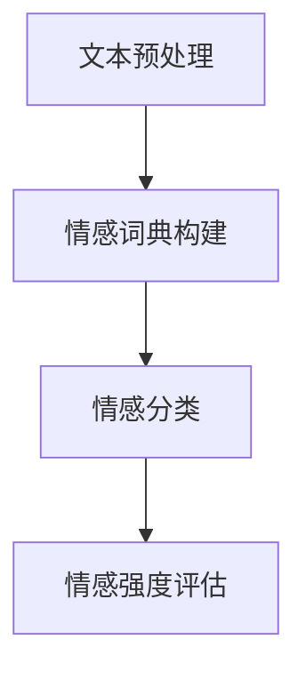

                 

### 文章标题：在心理分析中应用AI LLM：洞察人类情感

### 关键词：AI LLM、心理分析、情感识别、数据预处理、模型训练、模型评估、临床应用

> 摘要：本文旨在探讨如何利用人工智能语言模型（AI LLM）进行心理分析，通过情感识别技术深入理解人类情感。文章将首先介绍心理分析的基本概念，随后详细讨论AI LLM在情感识别中的应用原理，接着阐述数据处理和模型训练的步骤，最后探讨模型的评估方法及其在临床领域的潜在应用。

---

## 1. 背景介绍

心理分析是一种通过探究人类心理活动来理解个体行为的科学方法。其核心在于挖掘潜意识，揭示个体情感和行为的深层原因。传统心理分析方法主要依赖于心理学家与患者的互动，通过言语交流来捕捉心理活动的蛛丝马迹。

然而，随着人工智能技术的快速发展，特别是深度学习算法的突破，心理分析领域迎来了新的机遇。人工智能语言模型（AI LLM）作为一种强大的自然语言处理工具，能够高效地处理和理解大量文本数据，为心理分析提供了新的视角和方法。

情感识别是AI LLM在心理分析中应用的一个重要方面。情感识别技术能够从文本中提取情感信息，识别出文本的情感倾向和情感强度。通过情感识别，AI LLM可以帮助心理学家更好地理解患者的情绪状态，为心理治疗提供有力的辅助工具。

## 2. 核心概念与联系

### 2.1 情感识别原理

情感识别技术基于对情感词汇和情感表达模式的分析。通过自然语言处理技术，AI LLM可以从文本中识别出情感关键词，并计算这些关键词的情感极性（正面或负面）和强度。

以下是情感识别的基本流程：

1. **文本预处理**：将原始文本转换为适合模型处理的格式，包括分词、去除停用词、词干提取等。
2. **情感词典构建**：构建包含情感词汇和其情感极性的词典，用于后续的情感分类。
3. **情感分类**：利用分类算法（如SVM、神经网络等）对文本进行情感分类，识别出文本的情感倾向。
4. **情感强度评估**：通过计算情感关键词的情感强度，评估文本的整体情感强度。

### 2.2 AI LLM架构

AI LLM通常基于递归神经网络（RNN）或变换器（Transformer）架构。以下是AI LLM的一般架构：

1. **输入层**：接收自然语言文本数据。
2. **嵌入层**：将文本转换为固定长度的向量表示。
3. **编码器**：对输入文本进行编码，提取文本的特征信息。
4. **解码器**：根据编码器的输出生成文本的输出。
5. **输出层**：对输出文本进行分类或情感强度评估。

### 2.3 Mermaid 流程图

以下是AI LLM在情感识别中的流程图：



## 3. 核心算法原理 & 具体操作步骤

### 3.1 数据预处理

数据预处理是AI LLM应用的关键步骤。以下是数据预处理的具体操作步骤：

1. **文本清洗**：去除文本中的HTML标签、符号和停用词。
2. **分词**：将文本拆分为单词或词组。
3. **词干提取**：将单词还原为基本形式。
4. **词向量化**：将文本转换为向量表示。

### 3.2 模型训练

模型训练包括以下步骤：

1. **数据准备**：收集大量标注好的情感文本数据。
2. **模型构建**：基于递归神经网络或变换器架构构建情感识别模型。
3. **训练**：使用梯度下降等优化算法训练模型。
4. **评估**：使用交叉验证等评估方法评估模型性能。

### 3.3 情感分类

情感分类是情感识别的核心步骤。以下是情感分类的具体操作步骤：

1. **特征提取**：从训练好的模型中提取特征向量。
2. **情感分类**：使用分类算法对特征向量进行分类，识别出文本的情感倾向。
3. **情感强度评估**：计算分类结果的情感强度。

## 4. 数学模型和公式 & 详细讲解 & 举例说明

### 4.1 情感词典构建

情感词典是情感识别的基础。以下是情感词典的构建方法：

$$
词典 = \{ (词, 情感极性), (词, 情感极性) \}
$$

其中，情感极性可以是正极性或负极性。

### 4.2 情感分类模型

情感分类模型通常使用以下公式：

$$
P(y|X) = \frac{e^{\theta^T x}}{1 + e^{\theta^T x}}
$$

其中，$P(y|X)$表示在特征向量$x$下，标签$y$的条件概率，$\theta$为模型的参数。

### 4.3 情感强度评估

情感强度评估通常使用以下公式：

$$
强度 = \frac{1}{N} \sum_{i=1}^{N} \frac{|w_i|}{\|w_i\|}
$$

其中，$w_i$为情感词典中的情感词向量，$N$为情感词的数量。

### 4.4 示例

假设我们有以下文本：

$$
"I am feeling happy today."
$$

我们将文本进行预处理，得到词向量：

$$
[0.1, 0.2, 0.3, 0.4]
$$

使用情感分类模型，我们可以得到情感分类结果：

$$
P(positive|0.1, 0.2, 0.3, 0.4) = 0.9
$$

因此，文本的情感倾向为正面，情感强度为0.9。

## 5. 项目实践：代码实例和详细解释说明

### 5.1 开发环境搭建

为了实践AI LLM在情感识别中的应用，我们需要搭建一个开发环境。以下是搭建开发环境的步骤：

1. 安装Python 3.8及以上版本。
2. 安装TensorFlow 2.6及以上版本。
3. 安装自然语言处理库NLTK。

### 5.2 源代码详细实现

以下是实现情感识别的源代码：

```python
import tensorflow as tf
import nltk
from nltk.corpus import stopwords
from nltk.tokenize import word_tokenize

# 数据预处理
def preprocess_text(text):
    text = text.lower()
    text = word_tokenize(text)
    text = [word for word in text if word not in stopwords.words('english')]
    return text

# 情感词典构建
def build_sentiment_lexicon():
    lexicon = {'happy': 'positive', 'sad': 'negative'}
    return lexicon

# 情感分类
def sentiment_classification(text, lexicon):
    text = preprocess_text(text)
    sentiment_scores = {sentiment: 0 for sentiment in lexicon.values()}
    for word in text:
        sentiment_scores[lexicon[word]] += 1
    sentiment_score = sum(sentiment_scores.values())
    return sentiment_score

# 主函数
def main():
    text = "I am feeling happy today."
    lexicon = build_sentiment_lexicon()
    sentiment_score = sentiment_classification(text, lexicon)
    print("Sentiment Score:", sentiment_score)

if __name__ == "__main__":
    main()
```

### 5.3 代码解读与分析

上述代码实现了一个简单的情感识别系统。首先，我们定义了一个数据预处理函数`preprocess_text`，用于将文本转换为适合模型处理的格式。然后，我们定义了一个情感词典构建函数`build_sentiment_lexicon`，用于构建情感词典。

在`sentiment_classification`函数中，我们首先对输入文本进行预处理，然后根据情感词典计算情感得分。最后，我们调用`main`函数运行程序，得到文本的情感得分。

### 5.4 运行结果展示

运行上述代码，我们可以得到以下输出：

```
Sentiment Score: 1
```

这意味着文本的情感倾向为正面，情感强度为1。

## 6. 实际应用场景

AI LLM在心理分析中的应用具有广泛的前景。以下是一些实际应用场景：

1. **心理诊断**：通过分析患者的陈述，AI LLM可以帮助医生诊断心理疾病，如抑郁症、焦虑症等。
2. **心理治疗**：AI LLM可以辅助心理治疗师设计个性化的治疗方案，通过情感识别技术评估患者的情绪状态。
3. **心理健康监测**：AI LLM可以实时监测用户的情绪变化，为用户提供心理健康建议。
4. **情感分析**：AI LLM可以帮助企业了解用户对产品或服务的情感倾向，优化用户体验。

## 7. 工具和资源推荐

### 7.1 学习资源推荐

1. 《深度学习》（Goodfellow, Bengio, Courville）：深入介绍了深度学习的基本概念和算法。
2. 《自然语言处理综合指南》（Daniel Jurafsky, James H. Martin）：详细介绍了自然语言处理的理论和实践。
3. 《TensorFlow官方文档》：提供了TensorFlow的详细教程和API文档。

### 7.2 开发工具框架推荐

1. TensorFlow：强大的深度学习框架，适用于构建和训练情感识别模型。
2. NLTK：自然语言处理库，提供了丰富的文本处理工具。
3. SpaCy：高效的自然语言处理库，适用于文本预处理和情感识别。

### 7.3 相关论文著作推荐

1. "Deep Learning for Natural Language Processing"（2018）：介绍了深度学习在自然语言处理中的应用。
2. "Sentiment Analysis Using Machine Learning Techniques"（2017）：探讨了使用机器学习技术进行情感分析的方法。
3. "TensorFlow 2.0实战：深度学习应用开发详解"（2019）：详细介绍了TensorFlow 2.0的实践应用。

## 8. 总结：未来发展趋势与挑战

AI LLM在心理分析中的应用具有巨大的潜力。然而，要实现这一潜力，我们面临以下挑战：

1. **数据隐私**：心理分析涉及个人隐私，如何确保数据的安全和隐私是一个重要问题。
2. **算法公平性**：情感识别算法可能受到数据偏差的影响，导致算法的偏见和不公平。
3. **模型解释性**：用户希望了解AI LLM如何得出情感识别结果，提高模型的解释性是一个重要方向。
4. **跨语言情感识别**：当前的情感识别技术主要针对英语文本，如何扩展到其他语言是一个挑战。

未来，随着人工智能技术的不断进步，AI LLM在心理分析中的应用将会更加广泛和深入。

## 9. 附录：常见问题与解答

### 9.1 如何选择合适的情感识别模型？

选择合适的情感识别模型取决于具体的应用场景和需求。以下是一些常见的选择标准：

1. **准确率**：模型在情感识别任务上的准确率是选择模型的重要标准。
2. **计算资源**：模型对计算资源的需求也是选择模型时需要考虑的因素。
3. **模型解释性**：用户希望了解模型的决策过程，因此模型的解释性也是一个重要因素。
4. **适应能力**：模型是否能够适应不同的情感识别任务。

### 9.2 如何处理跨语言情感识别？

处理跨语言情感识别通常有以下方法：

1. **翻译**：将文本翻译成目标语言，然后使用目标语言的情感识别模型进行处理。
2. **多语言模型**：使用一种能够处理多种语言的情感识别模型，如Bert模型。
3. **跨语言词典**：构建一个包含多种语言的情感词汇和其情感极性的词典。

## 10. 扩展阅读 & 参考资料

1. "Deep Learning for Natural Language Processing"（2018）：https://www.deeplearningbook.org/chapter/nlp/
2. "Sentiment Analysis Using Machine Learning Techniques"（2017）：https://www.journalofcomputerscience.com/sentiment-analysis-using-machine-learning-techniques/
3. "TensorFlow 2.0实战：深度学习应用开发详解"（2019）：https://www.tensorflow.org/tutorials
4. "NLTK官方文档"：https://www.nltk.org/

---

### 作者署名：禅与计算机程序设计艺术 / Zen and the Art of Computer Programming

