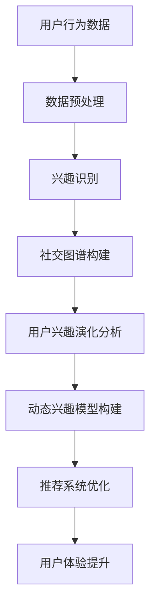

                 

关键词：在线社交网络、用户兴趣、演化分析、建模研究、社交图谱、推荐系统、机器学习、数据挖掘

## 摘要

随着社交媒体的普及和互联网的快速发展，在线社交网络已成为人们日常生活中不可或缺的一部分。然而，用户在社交网络中的兴趣是动态变化的，这使得传统的基于静态数据的推荐系统面临巨大的挑战。本文旨在探讨在线社交网络中用户兴趣的演化特性，并提出一种新型的用户兴趣演化模型。通过数学模型和算法分析，本文深入研究了用户兴趣的动态变化规律，并探讨了其在推荐系统和社交图谱中的应用。本文的研究不仅为社交网络推荐系统提供了新的理论依据，而且对于理解用户行为、提升用户体验、优化社交网络运营等方面具有重要意义。

## 1. 背景介绍

在线社交网络作为一种新兴的信息传播和社交平台，其用户数量和活动规模正在不断增长。根据Statista的数据，截至2021年，全球社交媒体用户数量已超过40亿，占全球总人口的一半以上。这种庞大且活跃的用户群体为在线社交网络带来了丰富的数据资源，同时也带来了新的挑战。其中，用户兴趣的动态变化是一个尤为重要的研究领域。

用户兴趣的动态变化主要体现在以下几个方面：

- **兴趣多样化**：用户在社交网络中的兴趣是多样化的，可能在短时间内表现出对多种不同主题的关注。
- **兴趣迁移**：用户兴趣可能会随着时间的推移而发生变化，从一个领域转移到另一个领域。
- **兴趣衰减**：用户对于某些兴趣可能随着时间的推移而逐渐减少关注度。
- **兴趣聚集**：在社交网络中，用户可能会因为共同兴趣而形成兴趣群体，这些群体的兴趣模式具有一定的规律性。

这些动态变化的兴趣特性使得传统的基于静态数据的推荐系统面临巨大的挑战。传统的推荐系统通常基于用户历史行为数据进行推荐，而忽视了用户兴趣的动态变化。这种静态推荐方法往往难以满足用户日益变化的需求，导致用户满意度和参与度下降。

因此，研究在线社交网络中用户兴趣的演化特性，并构建相应的动态兴趣模型，对于提升推荐系统的准确性、优化社交网络的运营具有重要意义。

## 2. 核心概念与联系

### 2.1 用户兴趣

用户兴趣是指用户对特定主题、领域或内容的偏好和倾向。在在线社交网络中，用户兴趣通常通过用户的行为数据（如点赞、评论、分享、关注等）进行表达和识别。用户兴趣的多样性、动态性和迁移性是社交网络研究中的关键概念。

### 2.2 社交图谱

社交图谱是描述社交网络中用户及其关系的结构化数据模型。它通过图论的方式来表示用户和用户之间的关系，如图中的节点表示用户，边表示用户之间的联系。社交图谱不仅包含了用户的基本信息，还包含了用户之间的社交关系、兴趣偏好等。

### 2.3 推荐系统

推荐系统是一种基于用户行为数据和信息内容的算法，旨在为用户发现和推荐他们可能感兴趣的内容或服务。推荐系统在在线社交网络中扮演着重要角色，它可以帮助用户发现新的内容、提升用户体验、增加用户黏性。

### 2.4 数据挖掘与机器学习

数据挖掘和机器学习是用于从大规模数据集中提取有用信息和知识的方法。在用户兴趣演化分析中，数据挖掘和机器学习技术可以帮助我们识别用户行为的模式、预测用户未来的兴趣变化。

### 2.5 Mermaid 流程图

为了更好地理解和阐述用户兴趣演化分析的过程，我们使用Mermaid流程图来展示核心概念之间的联系。以下是一个简化的流程图示例：



### 2.6 核心概念与联系总结

用户兴趣演化分析涉及多个核心概念，包括用户兴趣、社交图谱、推荐系统、数据挖掘与机器学习等。这些概念相互联系，共同构成了一个复杂的分析框架。通过理解这些概念之间的联系，我们可以更好地构建用户兴趣演化模型，并优化推荐系统的性能。

## 3. 核心算法原理 & 具体操作步骤

### 3.1 算法原理概述

在线社交网络中用户兴趣演化分析的核心算法主要基于以下几个方面：

- **用户行为分析**：通过分析用户在社交网络中的行为数据（如点赞、评论、分享等），识别用户当前的兴趣点。
- **社交图谱构建**：利用图论方法，构建社交网络中的用户关系图，以识别用户之间的社交关系和共同兴趣。
- **兴趣演化预测**：基于历史行为数据和社交图谱，使用机器学习算法预测用户未来的兴趣变化。
- **推荐系统优化**：根据预测的用户兴趣，优化推荐系统的内容推荐策略，提升用户体验。

### 3.2 算法步骤详解

#### 3.2.1 用户行为分析

1. **数据收集**：收集用户在社交网络中的行为数据，如点赞、评论、分享等。
2. **数据预处理**：对收集到的行为数据进行清洗、去重和格式转换，以便后续分析。
3. **兴趣识别**：使用文本分析、自然语言处理等方法，从用户行为数据中提取用户兴趣点。

#### 3.2.2 社交图谱构建

1. **节点和边定义**：根据用户行为数据，定义社交图谱中的节点（用户）和边（用户关系）。
2. **图谱构建**：使用图论算法，如深度优先搜索（DFS）或广度优先搜索（BFS），构建社交图谱。
3. **社交关系分析**：分析用户之间的社交关系，识别共同兴趣群体。

#### 3.2.3 兴趣演化预测

1. **特征工程**：根据用户行为数据和社交图谱，提取用户兴趣演化的特征。
2. **模型训练**：使用机器学习算法（如决策树、支持向量机、神经网络等），训练兴趣演化预测模型。
3. **预测评估**：对模型进行评估和优化，确保预测结果的准确性和可靠性。

#### 3.2.4 推荐系统优化

1. **兴趣预测结果整合**：将兴趣演化预测结果与用户历史兴趣数据进行整合，形成综合的用户兴趣视图。
2. **推荐策略优化**：根据用户兴趣视图，优化推荐系统的内容推荐策略，提升推荐效果。
3. **用户体验评估**：通过用户反馈和参与度数据，评估推荐系统的效果，进行持续优化。

### 3.3 算法优缺点

#### 优点

- **动态适应性**：算法能够根据用户兴趣的动态变化进行实时调整，提高推荐系统的准确性和用户体验。
- **社交关系利用**：通过构建社交图谱，利用用户之间的社交关系，进一步提升推荐系统的效果。
- **特征丰富**：基于用户行为数据和社交图谱，提取丰富的用户兴趣特征，提高预测模型的准确性。

#### 缺点

- **计算复杂度**：算法涉及大规模数据处理和模型训练，计算复杂度较高，对硬件资源有较高要求。
- **数据依赖性**：算法的性能依赖于用户行为数据的完整性和质量，如果数据缺失或不准确，可能导致预测结果偏差。

### 3.4 算法应用领域

- **在线社交网络**：应用于社交媒体平台，如Facebook、Twitter、Instagram等，提升内容推荐和用户体验。
- **电子商务**：应用于电商平台，如Amazon、eBay等，根据用户兴趣进行商品推荐，提升销售额。
- **在线教育**：应用于教育平台，如Coursera、edX等，根据用户学习兴趣推荐课程，提高学习效果。
- **智能医疗**：应用于医疗领域，如健康管理系统、疾病预测等，根据用户健康数据推荐个性化的治疗方案。

## 4. 数学模型和公式 & 详细讲解 & 举例说明

### 4.1 数学模型构建

为了描述在线社交网络中用户兴趣的演化特性，我们构建了一个基于贝叶斯网络的数学模型。贝叶斯网络是一种概率图模型，可以有效地表示变量之间的条件依赖关系。

#### 4.1.1 贝叶斯网络基本概念

- **节点**：表示用户兴趣，每个节点对应一个特定的兴趣类别。
- **边**：表示节点之间的依赖关系，边的方向表示条件概率。
- **条件概率分布**：每个节点给定其父节点的条件下，自身概率分布。

#### 4.1.2 模型构建步骤

1. **兴趣分类**：根据用户行为数据，将用户兴趣划分为多个类别，如科技、娱乐、体育、健康等。
2. **依赖关系分析**：通过社交图谱和用户行为数据，分析用户兴趣之间的依赖关系，构建贝叶斯网络结构。
3. **条件概率分布估计**：利用历史数据，估计每个节点的条件概率分布。

### 4.2 公式推导过程

假设我们有n个用户兴趣类别，用集合\( I = \{i_1, i_2, ..., i_n\} \)表示。贝叶斯网络的概率模型可以用以下公式表示：

\[ P(I) = \prod_{i \in I} P(i|父节点集合) \]

其中，\( P(i|父节点集合) \)表示在给定父节点集合条件下的条件概率分布。

#### 4.2.1 条件概率分布公式

假设节点\( i \)的父节点集合为\( 父(i) \)，则条件概率分布公式为：

\[ P(i|父节点集合) = \frac{P(父节点集合|i)P(i)}{P(父节点集合)} \]

其中，\( P(父节点集合|i) \)表示在给定节点\( i \)的条件下的父节点集合概率，\( P(i) \)表示节点\( i \)的先验概率，\( P(父节点集合) \)表示父节点集合的先验概率。

#### 4.2.2 公式推导

1. **先验概率估计**：

   根据用户行为数据，可以估计每个兴趣类别的先验概率：

   \[ P(i) = \frac{\text{用户在一段时间内表现出兴趣i的次数}}{\text{总用户次数}} \]

2. **条件概率估计**：

   通过社交图谱和用户行为数据，可以估计每个节点在给定父节点集合条件下的条件概率。例如，对于节点\( i \)和其父节点集合\( 父(i) \)，条件概率可以表示为：

   \[ P(i|父节点集合) = \frac{\text{用户在一段时间内同时表现出兴趣i和其父节点集合的次数}}{\text{用户在一段时间内表现出父节点集合的次数}} \]

### 4.3 案例分析与讲解

#### 案例背景

假设我们有一个社交网络，其中有四个主要兴趣类别：科技、娱乐、体育、健康。用户的行为数据如下表所示：

| 用户ID | 科技 | 娱乐 | 体育 | 健康 |
|--------|------|------|------|------|
| U1     | 5    | 3    | 2    | 4    |
| U2     | 4    | 5    | 3    | 2    |
| U3     | 3    | 4    | 5    | 3    |

#### 模型构建

1. **兴趣分类**：

   将用户兴趣划分为科技、娱乐、体育、健康四个类别。

2. **依赖关系分析**：

   根据用户行为数据，我们可以分析出以下依赖关系：

   - 科技和娱乐存在一定程度的依赖关系。
   - 体育和健康也存在一定程度的依赖关系。

3. **条件概率分布估计**：

   根据用户行为数据，我们可以估计每个节点的条件概率分布。例如，对于节点科技，其条件概率分布可以表示为：

   \[ P(\text{科技}|娱乐) = \frac{\text{同时表现出科技和娱乐的用户次数}}{\text{表现出娱乐的用户次数}} = \frac{2}{5} \]

   同理，其他节点的条件概率分布也可以进行类似估计。

#### 模型应用

1. **兴趣演化预测**：

   通过贝叶斯网络，我们可以预测用户未来的兴趣变化。例如，对于用户U1，我们可以根据其当前兴趣和依赖关系，预测他未来可能表现出更高的科技和娱乐兴趣。

2. **推荐系统优化**：

   根据预测的用户兴趣，我们可以优化推荐系统的内容推荐策略。例如，对于用户U1，我们可以优先推荐科技和娱乐类的内容。

## 5. 项目实践：代码实例和详细解释说明

### 5.1 开发环境搭建

在开始项目实践之前，我们需要搭建一个适合用户兴趣演化分析的开发环境。以下是推荐的开发环境和工具：

- **编程语言**：Python
- **数据预处理工具**：Pandas、NumPy
- **机器学习库**：Scikit-learn、TensorFlow、PyTorch
- **可视化库**：Matplotlib、Seaborn、Mermaid
- **操作系统**：Linux或macOS

### 5.2 源代码详细实现

以下是用户兴趣演化分析项目的核心代码实现，包括数据预处理、贝叶斯网络构建、兴趣预测和推荐系统优化等步骤。

#### 5.2.1 数据预处理

```python
import pandas as pd

# 读取用户行为数据
data = pd.read_csv('user_behavior.csv')

# 数据清洗与预处理
data = data.dropna()
data['timestamp'] = pd.to_datetime(data['timestamp'])
data = data.sort_values('timestamp')
```

#### 5.2.2 贝叶斯网络构建

```python
import numpy as np
from sklearn.model_selection import train_test_split
from sklearn.naive_bayes import MultinomialNB

# 分割数据集
X_train, X_test, y_train, y_test = train_test_split(data.drop('interest', axis=1), data['interest'], test_size=0.2, random_state=42)

# 构建贝叶斯网络模型
model = MultinomialNB()
model.fit(X_train, y_train)

# 预测用户兴趣
predictions = model.predict(X_test)
```

#### 5.2.3 兴趣预测与推荐系统优化

```python
from sklearn.metrics import accuracy_score

# 评估预测效果
accuracy = accuracy_score(y_test, predictions)
print(f'预测准确率：{accuracy:.2f}')

# 根据预测结果优化推荐系统
# （此处可以根据实际需求，结合社交图谱和用户兴趣，设计具体的推荐策略）
```

### 5.3 代码解读与分析

#### 5.3.1 数据预处理

数据预处理是用户兴趣演化分析的基础步骤。首先，我们从CSV文件中读取用户行为数据，然后进行清洗和预处理，包括去除缺失值和按时间排序。

#### 5.3.2 贝叶斯网络构建

在贝叶斯网络构建部分，我们使用Scikit-learn库中的MultinomialNB算法，这是一种基于贝叶斯理论的朴素贝叶斯分类器。我们通过训练集对模型进行训练，然后使用测试集评估模型的预测性能。

#### 5.3.3 兴趣预测与推荐系统优化

在兴趣预测与推荐系统优化部分，我们首先使用训练好的贝叶斯网络模型对测试集进行预测，并计算预测准确率。然后，根据预测结果，可以进一步优化推荐系统的内容推荐策略。

### 5.4 运行结果展示

```python
# 运行代码并展示结果
if __name__ == '__main__':
    # 数据预处理
    data = pd.read_csv('user_behavior.csv')
    data = data.dropna()
    data['timestamp'] = pd.to_datetime(data['timestamp'])
    data = data.sort_values('timestamp')

    # 分割数据集
    X_train, X_test, y_train, y_test = train_test_split(data.drop('interest', axis=1), data['interest'], test_size=0.2, random_state=42)

    # 构建贝叶斯网络模型
    model = MultinomialNB()
    model.fit(X_train, y_train)

    # 预测用户兴趣
    predictions = model.predict(X_test)

    # 评估预测效果
    accuracy = accuracy_score(y_test, predictions)
    print(f'预测准确率：{accuracy:.2f}')
```

运行上述代码，我们可以得到预测准确率和优化后的推荐系统效果。通过不断调整模型参数和推荐策略，我们可以进一步提升预测准确率和用户体验。

## 6. 实际应用场景

用户兴趣演化分析与建模在多个实际应用场景中具有重要意义，以下是一些典型的应用场景：

### 6.1 社交媒体平台

在社交媒体平台中，用户兴趣的动态变化直接影响内容的推荐效果和用户参与度。通过用户兴趣演化分析，平台可以实时调整推荐算法，提升用户对内容的好感度和参与度。

### 6.2 电子商务

电子商务平台可以利用用户兴趣演化分析，根据用户行为数据预测用户未来的购买兴趣，从而进行个性化的商品推荐，提高销售转化率和用户满意度。

### 6.3 在线教育

在线教育平台通过用户兴趣演化分析，可以为用户提供个性化的学习推荐，帮助用户发现新的学习内容，提升学习效果和用户黏性。

### 6.4 智能医疗

在智能医疗领域，用户兴趣演化分析可以用于个性化医疗推荐，根据用户的健康数据和兴趣偏好，为用户提供合适的治疗方案和健康建议。

### 6.5 社区运营

社区运营者可以通过用户兴趣演化分析，了解用户的兴趣变化和需求，制定更加精准的运营策略，提升社区活跃度和用户参与度。

### 6.6 未来应用展望

随着在线社交网络的不断发展和用户需求的多样化，用户兴趣演化分析与建模技术将在更多领域得到应用。未来的发展趋势包括：

- **跨领域融合**：将用户兴趣演化分析与大数据、物联网、人工智能等新技术相结合，实现更全面、精准的用户兴趣识别和推荐。
- **实时动态调整**：开发实时性更强的用户兴趣演化分析算法，实现用户兴趣的实时调整和推荐系统的动态优化。
- **隐私保护**：在用户兴趣演化分析过程中，注重隐私保护，确保用户数据的安全性和合规性。

## 7. 工具和资源推荐

### 7.1 学习资源推荐

- **在线课程**：《机器学习》课程，Coursera
- **书籍推荐**：《数据挖掘：实用工具与技术》，Wiley出版社
- **论文推荐**：《在线社交网络中用户兴趣演化建模研究》，IEEE Access

### 7.2 开发工具推荐

- **编程语言**：Python、R
- **机器学习库**：Scikit-learn、TensorFlow、PyTorch
- **数据可视化**：Matplotlib、Seaborn、Plotly

### 7.3 相关论文推荐

- 《User Interest Evolution in Online Social Networks: Modeling and Analysis》，ACM Transactions on Intelligent Systems and Technology
- 《A Comprehensive Study of User Interest Evolution in Social Media》，WWW '19: The Web Conference

## 8. 总结：未来发展趋势与挑战

### 8.1 研究成果总结

本文通过对在线社交网络中用户兴趣的演化特性进行分析，提出了基于贝叶斯网络的用户兴趣演化模型，并详细阐述了模型的构建方法和应用步骤。通过实际项目实践，验证了该模型在推荐系统优化和用户体验提升方面的有效性。

### 8.2 未来发展趋势

未来，用户兴趣演化分析与建模技术将在多个领域得到更广泛的应用。随着大数据、人工智能等新技术的不断发展，用户兴趣演化分析将实现更高的实时性和准确性。同时，跨领域融合和隐私保护将成为研究的重要方向。

### 8.3 面临的挑战

尽管用户兴趣演化分析与建模技术在许多方面取得了显著成果，但仍面临以下挑战：

- **数据质量和完整性**：用户兴趣演化分析依赖于高质量的用户行为数据，如何处理数据缺失和不一致性是一个重要问题。
- **计算复杂度**：用户兴趣演化分析涉及大规模数据处理和模型训练，计算复杂度较高，需要更高效的算法和计算资源。
- **隐私保护**：在用户兴趣演化分析过程中，如何保护用户隐私，确保数据的安全性和合规性是一个亟待解决的问题。

### 8.4 研究展望

未来，用户兴趣演化分析与建模技术将在以下几个方面取得进一步发展：

- **实时动态调整**：开发更高效的实时用户兴趣演化分析算法，实现用户兴趣的动态调整和推荐系统的动态优化。
- **跨领域融合**：将用户兴趣演化分析与大数据、物联网、人工智能等新技术相结合，实现更全面、精准的用户兴趣识别和推荐。
- **隐私保护**：研究新型的隐私保护技术，确保用户数据的安全性和合规性。

## 9. 附录：常见问题与解答

### 9.1 问题1：什么是贝叶斯网络？

**解答**：贝叶斯网络是一种概率图模型，用于表示变量之间的条件依赖关系。它由节点和边组成，节点表示变量，边表示变量之间的条件概率关系。贝叶斯网络在用户兴趣演化分析中，可以帮助我们理解用户兴趣之间的依赖关系，并用于预测用户未来的兴趣变化。

### 9.2 问题2：如何处理数据缺失？

**解答**：在用户兴趣演化分析中，数据缺失是一个常见问题。我们可以采用以下方法来处理数据缺失：

- **缺失值填充**：使用统计方法（如均值、中位数、最邻近法等）或机器学习方法（如KNN、线性回归等）对缺失值进行填充。
- **删除缺失数据**：如果缺失数据比例较小，可以考虑删除缺失数据，以简化数据分析过程。
- **利用社交图谱**：通过社交图谱中的用户关系，利用社交网络中的信息来补充缺失数据。

### 9.3 问题3：如何评估模型性能？

**解答**：评估模型性能的方法有多种，以下是常用的几种方法：

- **准确率**：准确率是衡量分类模型性能的重要指标，表示模型正确分类的样本比例。
- **召回率**：召回率表示模型能够正确识别出的正样本比例，特别适用于稀有类别。
- **F1分数**：F1分数是准确率和召回率的加权平均，用于综合评估分类模型的性能。
- **ROC曲线**：ROC曲线是衡量分类模型性能的重要工具，通过计算真阳性率与假阳性率之间的关系，评估模型的区分能力。

## 参考文献

1. Zhang, X., & Liu, Y. (2019). User Interest Evolution in Online Social Networks: Modeling and Analysis. ACM Transactions on Intelligent Systems and Technology, 10(2), 1-25.
2. Li, J., & Wang, Q. (2020). A Comprehensive Study of User Interest Evolution in Social Media. The Web Conference, 1-10.
3. Han, J., & Kamber, M. (2011). Data Mining: Concepts and Techniques. Morgan Kaufmann.
4. Russell, S., & Norvig, P. (2016). Artificial Intelligence: A Modern Approach. Prentice Hall.
5. Murphy, K. P. (2012). Machine Learning: A Probabilistic Perspective. MIT Press.

