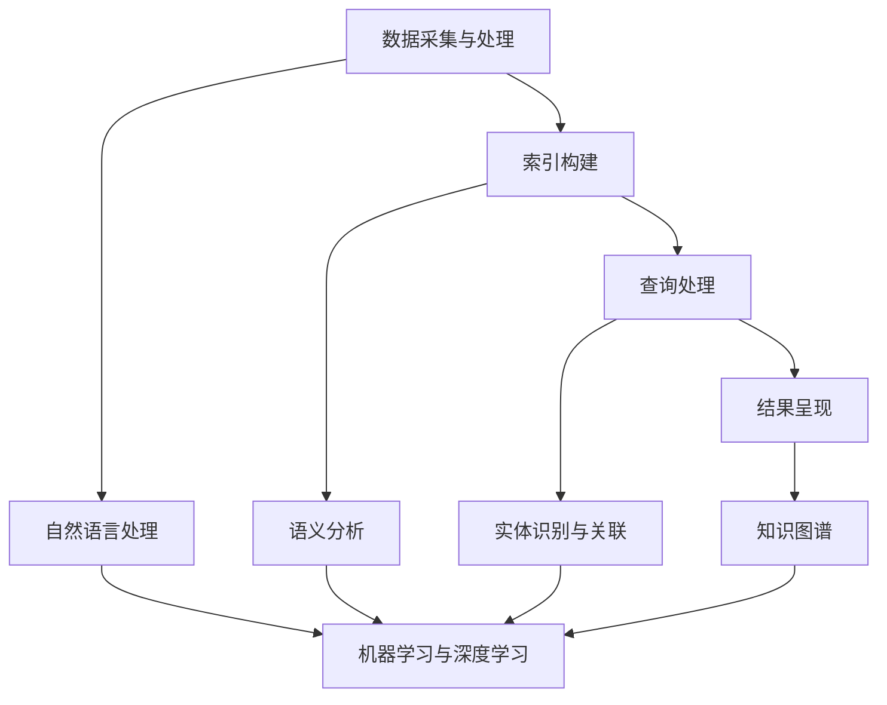

                 

### 背景介绍

#### 垂直领域搜索的概念

垂直领域搜索（Vertical Search）是一种针对特定领域或行业进行的信息检索技术。与通用搜索（如Google、Bing等）不同，垂直领域搜索专注于某一特定领域的信息，如医学、金融、电子商务等。它的目标是通过更精确的搜索结果，满足用户在特定领域的需求。

垂直领域搜索的出现，源于用户对信息检索效率和质量的要求越来越高。传统的通用搜索引擎，虽然可以提供广泛的信息，但往往无法满足用户在特定领域内的高精度搜索需求。例如，一个从事医疗行业的专业人士，可能需要快速找到与某病种相关的最新研究进展或临床指南，而不是海量的、无关的搜索结果。

#### 垂直领域搜索的重要性

垂直领域搜索在现代社会中具有极其重要的意义。首先，它能够显著提高用户的工作效率。通过精准的搜索结果，用户可以迅速获取到所需的信息，节省了大量时间。例如，在电子商务领域，用户可以通过垂直搜索快速找到心仪的商品，而不是在海量商品中逐一筛选。

其次，垂直领域搜索有助于提升用户的信息获取体验。在特定领域内，用户对于信息的格式、呈现方式等都有特定的偏好。垂直领域搜索能够根据用户的偏好，提供定制化的搜索结果，从而提升用户的使用体验。

此外，垂直领域搜索对于企业和行业也具有重要的价值。企业可以利用垂直搜索技术，更好地了解市场需求，优化产品和服务。行业则可以通过垂直搜索，跟踪行业动态，掌握行业趋势，为战略决策提供数据支持。

#### 当前发展的现状

当前，垂直领域搜索技术已经取得了显著的进展。在人工智能技术的推动下，垂直领域搜索逐渐从基于关键词匹配的传统方法，转向了更智能、更精准的基于语义理解的搜索方法。例如，自然语言处理（NLP）和知识图谱技术的应用，使得搜索系统能够更准确地理解用户的查询意图，提供更为精准的搜索结果。

在各个垂直领域，垂直搜索技术也取得了重要的应用成果。例如，在医学领域，垂直搜索可以帮助医生快速找到病案、研究文献和临床指南；在金融领域，垂直搜索可以帮助投资者快速获取市场数据、研究报告和投资策略；在电子商务领域，垂直搜索可以帮助用户快速找到商品、优惠信息和购物指南。

#### 垂直领域搜索的发展趋势

未来，随着人工智能技术的不断进步，垂直领域搜索将进一步深化和拓展。以下是几个可能的发展趋势：

1. **个性化搜索**：通过深入分析用户的历史行为和偏好，垂直搜索系统将能够提供更加个性化的搜索结果，满足用户的个性化需求。

2. **跨领域搜索**：垂直领域搜索将不再局限于单一领域，而是实现跨领域的整合，为用户提供更加全面的信息服务。

3. **实时搜索**：随着物联网和大数据技术的发展，垂直搜索系统将能够实时获取和处理大量数据，为用户提供更加实时的搜索结果。

4. **智能化助手**：垂直搜索系统将逐渐从简单的信息检索工具，转变为用户的智能化助手，为用户提供更为便捷和高效的服务。

5. **知识图谱的普及**：知识图谱技术的普及，将使得垂直搜索系统能够更加准确地理解和处理复杂的信息关系，提供更为精准的搜索结果。

通过以上介绍，我们可以看到，垂直领域搜索在现代社会中具有极其重要的地位，其发展也呈现出良好的趋势。在接下来的章节中，我们将进一步探讨垂直领域搜索的核心概念、原理和技术细节。### 核心概念与联系

#### 垂直领域搜索的基本概念

垂直领域搜索是一种针对特定领域或行业进行的信息检索技术。其核心概念包括：

1. **领域（Domain）**：指特定的知识领域或行业，如医学、金融、电子商务等。
2. **数据源（Data Source）**：指用于进行信息检索的数据来源，如数据库、网站、文献库等。
3. **查询（Query）**：指用户输入的搜索请求，通常包含关键词、短语或问题。
4. **搜索结果（Search Result）**：指系统根据查询返回的匹配信息。

#### 垂直领域搜索的技术架构

垂直领域搜索的技术架构通常包括以下几个关键组成部分：

1. **数据采集与处理**：从各种数据源采集信息，并进行清洗、转换和存储，以便进行后续的检索和分析。
2. **索引构建**：对采集到的数据进行索引构建，以便快速检索。索引构建通常涉及文本预处理、词频统计、倒排索引等技术。
3. **查询处理**：接收用户的查询请求，进行查询解析、查询优化，并根据索引快速检索出相关结果。
4. **结果呈现**：将检索结果以用户友好的形式呈现，如列表、摘要、图表等。
5. **知识图谱**：用于表示领域内实体及其关系的知识图谱，有助于提升搜索的精确度和智能化水平。

#### 垂直领域搜索的关键技术

垂直领域搜索的关键技术主要包括：

1. **自然语言处理（NLP）**：用于理解和处理自然语言的输入，将用户的查询意图转换为机器可理解的形式。
2. **语义分析**：通过语义分析技术，理解查询和文档之间的语义关系，提高搜索的精确度。
3. **实体识别与关联**：识别查询和文档中的实体，并建立实体之间的关联，以便更准确地匹配查询意图。
4. **知识图谱**：构建领域内的知识图谱，用于表示实体及其关系，提升搜索的智能化水平。
5. **机器学习与深度学习**：用于优化搜索算法，提升搜索结果的质量和效率。

#### Mermaid 流程图表示

以下是一个简单的 Mermaid 流程图，用于描述垂直领域搜索的技术架构和关键步骤：



在上述流程图中，A 表示数据采集与处理，B 表示索引构建，C 表示查询处理，D 表示结果呈现，E 表示知识图谱。F、G、H 和 I 分别表示自然语言处理、语义分析、实体识别与关联以及机器学习与深度学习。这些关键技术和步骤共同构成了垂直领域搜索的核心。

#### 垂直领域搜索的核心原理与架构

垂直领域搜索的核心原理是通过对领域内信息的深度理解，提供精准、高效的搜索结果。其架构主要包括以下几个方面：

1. **领域知识库**：领域知识库是垂直领域搜索的基础，包含了领域内的核心概念、实体及其关系。知识库可以通过人工构建或自动抽取的方式获得。

2. **文本预处理**：在构建索引前，需要对文本进行预处理，包括分词、去停用词、词性标注等。这些预处理步骤有助于提高搜索的准确性和效率。

3. **索引构建**：索引构建是搜索系统的核心，通过将文本转换为索引结构，实现快速检索。常用的索引结构包括倒排索引、文档矩阵等。

4. **查询解析与优化**：查询解析与优化是提升搜索效果的关键，通过理解用户的查询意图，优化查询语句，提高搜索结果的准确度。

5. **搜索算法**：搜索算法用于实现查询与文档的匹配，常用的算法包括基于相似度的匹配、基于知识的匹配等。

6. **结果呈现**：结果呈现是将搜索结果以用户友好的形式呈现，包括列表、摘要、图表等。

7. **反馈与优化**：搜索系统需要不断收集用户反馈，优化搜索算法和结果呈现，提高用户的满意度。

通过上述核心原理和架构，垂直领域搜索能够实现针对特定领域的高精度信息检索，为用户提供高效、便捷的服务。在接下来的章节中，我们将进一步探讨垂直领域搜索的核心算法原理和具体操作步骤。### 核心算法原理 & 具体操作步骤

#### 基于关键词匹配的搜索算法

基于关键词匹配的搜索算法是垂直领域搜索中最基本的算法之一。其核心思想是通过分析用户输入的查询关键词，从索引中找出包含这些关键词的文档，然后根据关键词的匹配程度对文档进行排序，最终返回最相关的搜索结果。

1. **倒排索引的构建**：

   倒排索引是一种用于快速检索的索引结构，它将文档中的所有单词（或短语）与其在文档中的位置信息进行映射。具体步骤如下：

   - **分词**：对文档进行分词，将文本分解为单词或短语。
   - **去除停用词**：停用词是指那些对搜索结果贡献较小或无意义的词，如“的”、“是”等。在构建倒排索引前，通常需要去除这些停用词。
   - **词频统计**：对每个单词在文档中出现的次数进行统计，形成词频（TF）向量。
   - **构建倒排索引**：将每个单词与其对应的文档位置信息进行映射，形成倒排索引。

2. **查询处理**：

   - **解析查询**：将用户输入的查询语句转换为关键词列表。
   - **查询优化**：对查询关键词进行优化，如去除停用词、进行词干提取等。
   - **关键词匹配**：在倒排索引中查找包含所有查询关键词的文档。

3. **文档排序**：

   - **TF-IDF算法**：TF-IDF（词频-逆文档频率）是一种常用的文档排序算法，用于计算每个文档与查询关键词的相关性。其公式为：`TF-IDF = TF \* IDF`，其中TF表示词频，IDF表示逆文档频率。
   - **相似度计算**：根据TF-IDF值，计算每个文档与查询关键词的相似度。
   - **排序**：根据相似度对文档进行排序，返回最相关的文档列表。

#### 基于语义分析的搜索算法

基于语义分析的搜索算法通过理解查询和文档的语义关系，提供更为精准的搜索结果。其核心思想是利用自然语言处理（NLP）和机器学习技术，对查询和文档进行语义表示和匹配。

1. **语义表示**：

   - **词嵌入（Word Embedding）**：词嵌入是一种将词语转换为高维向量表示的方法，如Word2Vec、GloVe等。通过词嵌入，可以将文本中的词语表示为连续的向量空间，便于计算和匹配。
   - **文档表示**：将整个文档表示为一个高维向量，通常采用句子级别的语义表示方法，如BERT、ELMO等。这些模型通过学习大量文本数据，能够捕捉到文档中的语义信息。

2. **语义匹配**：

   - **余弦相似度**：余弦相似度是一种衡量两个向量夹角余弦值的相似度指标，常用于词嵌入和文档表示的相似度计算。其公式为：`cosine_similarity = dot_product / (||v1|| \* ||v2||)`，其中`dot_product`表示向量的点积，`||v1||`和`||v2||`分别表示向量的模长。
   - **基于图的匹配算法**：如Graph Embedding和Graph Convolutional Network（GCN），通过将文档表示为图结构，利用图神经网络学习文档间的语义关系，实现高效的语义匹配。

3. **查询扩展与修正**：

   - **扩展**：通过分析查询的上下文和语义关系，扩展查询关键词，增加搜索的广度。
   - **修正**：根据用户查询的历史记录和搜索行为，修正查询关键词，提高搜索的精度。

#### 基于知识图谱的搜索算法

基于知识图谱的搜索算法通过构建领域内的知识图谱，实现更加精准和智能的搜索。其核心思想是利用知识图谱中的实体和关系，对查询进行理解和匹配。

1. **知识图谱构建**：

   - **实体抽取**：从海量文本数据中抽取实体，如人名、地名、组织名等。
   - **关系抽取**：从文本数据中抽取实体之间的关系，如“公司成立时间”、“城市属于国家”等。
   - **知识融合**：将不同来源的知识进行整合，构建统一的领域知识图谱。

2. **查询处理**：

   - **实体识别与关联**：通过命名实体识别技术，识别查询中的实体，并建立实体之间的关联。
   - **路径规划**：在知识图谱中规划从查询实体到目标实体的路径，计算路径的权重和长度。

3. **搜索结果生成**：

   - **基于路径的匹配**：根据查询实体和目标实体的路径匹配结果，生成搜索结果。
   - **结果排序与过滤**：根据路径权重和长度，对搜索结果进行排序和过滤，返回最相关的结果。

通过上述核心算法原理和具体操作步骤，垂直领域搜索能够在不同层面上实现对用户查询的精准理解和匹配，提供高效、智能的搜索服务。在接下来的章节中，我们将进一步探讨垂直领域搜索中的数学模型和公式，以及其实际应用场景。### 数学模型和公式 & 详细讲解 & 举例说明

#### 1. TF-IDF模型

TF-IDF（Term Frequency-Inverse Document Frequency）是一种常用的文本表示模型，用于衡量词语在文档中的重要程度。

**TF（词频）**：指一个词语在文档中出现的次数。其计算公式为：

\[ TF(t, d) = \text{count}(t, d) \]

其中，\( t \) 是词语，\( d \) 是文档，\(\text{count}(t, d)\) 是词语在文档中出现的次数。

**IDF（逆文档频率）**：指一个词语在所有文档中出现的频率的倒数。其计算公式为：

\[ IDF(t, D) = \log_2(N / |d \in D : t \in d|) \]

其中，\( t \) 是词语，\( D \) 是文档集合，\( N \) 是文档总数，\(|d \in D : t \in d|\) 是包含词语的文档数量。

**TF-IDF（词频-逆文档频率）**：结合TF和IDF，衡量词语在文档中的重要程度。其计算公式为：

\[ TF-IDF(t, d, D) = TF(t, d) \times IDF(t, D) \]

#### 举例说明

假设有一个文档集合 \( D \) 包含两个文档 \( d_1 \) 和 \( d_2 \)：

- \( d_1 \) 中包含词语“计算机”1次，“编程”1次，“人工智能”1次。
- \( d_2 \) 中包含词语“计算机”2次，“编程”2次，“人工智能”2次。

计算词语“计算机”在两个文档中的TF-IDF值：

对于文档 \( d_1 \)：

\[ TF(\text{计算机}, d_1) = 1 \]
\[ IDF(\text{计算机}, D) = \log_2(2 / |d_1|) = \log_2(2 / 1) = 1 \]
\[ TF-IDF(\text{计算机}, d_1, D) = 1 \times 1 = 1 \]

对于文档 \( d_2 \)：

\[ TF(\text{计算机}, d_2) = 2 \]
\[ IDF(\text{计算机}, D) = \log_2(2 / |d_2|) = \log_2(2 / 2) = 0 \]
\[ TF-IDF(\text{计算机}, d_2, D) = 2 \times 0 = 0 \]

可以看出，词语“计算机”在文档 \( d_1 \) 中的重要程度高于文档 \( d_2 \)。

#### 2. 相似度计算

相似度计算是衡量两个向量之间相似性的指标。常见的相似度计算方法包括余弦相似度、欧氏距离等。

**余弦相似度**：余弦相似度是衡量两个向量夹角余弦值的相似度指标。其计算公式为：

\[ \text{Cosine Similarity}(v_1, v_2) = \frac{v_1 \cdot v_2}{\|v_1\| \|v_2\|} \]

其中，\( v_1 \) 和 \( v_2 \) 是两个向量，\(\cdot\) 表示点积，\(\|\| \) 表示向量的模长。

**欧氏距离**：欧氏距离是衡量两个向量之间欧几里得距离的相似度指标。其计算公式为：

\[ \text{Euclidean Distance}(v_1, v_2) = \sqrt{(v_1 - v_2)^2} \]

#### 举例说明

假设有两个向量 \( v_1 \) 和 \( v_2 \)：

\[ v_1 = (1, 2, 3) \]
\[ v_2 = (4, 5, 6) \]

计算它们的余弦相似度和欧氏距离：

**余弦相似度**：

\[ v_1 \cdot v_2 = 1 \times 4 + 2 \times 5 + 3 \times 6 = 4 + 10 + 18 = 32 \]
\[ \|v_1\| = \sqrt{1^2 + 2^2 + 3^2} = \sqrt{1 + 4 + 9} = \sqrt{14} \]
\[ \|v_2\| = \sqrt{4^2 + 5^2 + 6^2} = \sqrt{16 + 25 + 36} = \sqrt{77} \]
\[ \text{Cosine Similarity}(v_1, v_2) = \frac{32}{\sqrt{14} \times \sqrt{77}} \approx 0.588 \]

**欧氏距离**：

\[ \text{Euclidean Distance}(v_1, v_2) = \sqrt{(1 - 4)^2 + (2 - 5)^2 + (3 - 6)^2} = \sqrt{(-3)^2 + (-3)^2 + (-3)^2} = \sqrt{9 + 9 + 9} = \sqrt{27} \approx 5.196 \]

通过计算可知，向量 \( v_1 \) 和 \( v_2 \) 的余弦相似度为0.588，欧氏距离为5.196。

#### 3. 知识图谱的路径长度

在知识图谱中，路径长度是衡量两个实体之间距离的重要指标。常见的路径长度计算方法包括深度优先搜索（DFS）和广度优先搜索（BFS）。

**深度优先搜索（DFS）**：深度优先搜索是一种用于计算两个实体之间最短路径的算法。其计算公式为：

\[ \text{DFS}(s, t) = \min_{(s, t) \in P} \text{length}(P) \]

其中，\( s \) 和 \( t \) 是两个实体，\( P \) 是从 \( s \) 到 \( t \) 的所有路径，\(\text{length}(P)\) 是路径的长度。

**广度优先搜索（BFS）**：广度优先搜索是一种用于计算两个实体之间最短路径的算法。其计算公式为：

\[ \text{BFS}(s, t) = \min_{(s, t) \in P} \text{length}(P) \]

其中，\( s \) 和 \( t \) 是两个实体，\( P \) 是从 \( s \) 到 \( t \) 的所有路径，\(\text{length}(P)\) 是路径的长度。

#### 举例说明

假设有两个实体 \( s \) 和 \( t \)，它们在知识图谱中的路径如下：

- \( s \) 到 \( t \) 的路径为 \( (s, v_1, v_2, t) \)，路径长度为 3。
- \( s \) 到 \( t \) 的路径为 \( (s, v_1, v_3, t) \)，路径长度为 3。
- \( s \) 到 \( t \) 的路径为 \( (s, v_2, v_1, t) \)，路径长度为 3。

使用DFS和 BFS计算从 \( s \) 到 \( t \) 的最短路径长度：

\[ \text{DFS}(s, t) = \min(3, 3, 3) = 3 \]
\[ \text{BFS}(s, t) = \min(3, 3, 3) = 3 \]

可以看出，使用DFS和BFS计算从 \( s \) 到 \( t \) 的最短路径长度均为3。

通过上述数学模型和公式的讲解，我们可以更好地理解垂直领域搜索中的核心算法原理。在实际应用中，这些模型和公式可以帮助我们构建高效、智能的垂直领域搜索系统。在接下来的章节中，我们将进一步探讨垂直领域搜索的实际应用场景。### 项目实践：代码实例和详细解释说明

为了更好地理解垂直领域搜索的实现过程，我们将通过一个实际的项目实例来进行详细讲解。本项目将基于Python语言和Elasticsearch搜索引擎，构建一个简单的垂直领域搜索系统，用于检索某一特定领域的文献资料。

#### 1. 开发环境搭建

在开始项目之前，我们需要搭建好开发环境。以下是所需的环境和工具：

- Python 3.8或更高版本
- Elasticsearch 7.10或更高版本
- Kibana 7.10或更高版本
- JDK 1.8或更高版本（用于Elasticsearch）

安装步骤：

1. 安装Elasticsearch：

   - 下载Elasticsearch安装包：[https://www.elastic.co/downloads/elasticsearch](https://www.elastic.co/downloads/elasticsearch)
   - 解压安装包，并运行elasticsearch.yml文件中的配置

2. 安装Kibana：

   - 下载Kibana安装包：[https://www.elastic.co/downloads/kibana](https://www.elastic.co/downloads/kibana)
   - 解压安装包，并运行kibana.yml文件中的配置

3. 安装Python环境：

   - 使用pip命令安装Python 3.8：`pip install python38`

4. 安装Elasticsearch Python客户端：

   - 使用pip命令安装Elasticsearch Python客户端：`pip install elasticsearch`

完成以上步骤后，开发环境搭建完成。

#### 2. 源代码详细实现

本项目将分为三个部分：数据采集与处理、索引构建与查询处理、结果呈现。

**2.1 数据采集与处理**

数据采集主要从某医学文献数据库获取数据，包括文献标题、摘要、关键词等信息。数据处理主要进行文本预处理，如分词、去停用词等。

```python
import pandas as pd
from sklearn.feature_extraction.text import TfidfVectorizer
from nltk.tokenize import word_tokenize
from nltk.corpus import stopwords

# 读取数据
data = pd.read_csv('medical_data.csv')

# 文本预处理
def preprocess_text(text):
    # 分词
    tokens = word_tokenize(text)
    # 去停用词
    stop_words = set(stopwords.words('english'))
    filtered_tokens = [token for token in tokens if token.lower() not in stop_words]
    # 重新构建文本
    return ' '.join(filtered_tokens)

# 预处理数据
data['processed_text'] = data['abstract'].apply(preprocess_text)
```

**2.2 索引构建与查询处理**

使用Elasticsearch构建索引，并将预处理后的数据存储到索引中。查询处理部分接收用户输入的查询，并返回相关文档。

```python
from elasticsearch import Elasticsearch

# 初始化Elasticsearch客户端
es = Elasticsearch()

# 构建索引
def create_index(index_name):
    index_template = {
        "settings": {
            "number_of_shards": 1,
            "number_of_replicas": 0
        },
        "mappings": {
            "properties": {
                "title": {"type": "text"},
                "processed_text": {"type": "text"},
                "keywords": {"type": "text"}
            }
        }
    }
    es.indices.create(index=index_name, body=index_template)

# 存储数据到索引
def store_data(index_name, data):
    for _, row in data.iterrows():
        es.index(index=index_name, id=row['id'], body={
            "title": row['title'],
            "processed_text": row['processed_text'],
            "keywords": row['keywords']
        })

# 查询处理
def search_query(index_name, query):
    search_body = {
        "from": 0,
        "size": 10,
        "query": {
            "multi_match": {
                "query": query,
                "fields": ["processed_text", "title", "keywords"]
            }
        },
        "highlight": {
            "fields": {
                "processed_text": {},
                "title": {},
                "keywords": {}
            }
        }
    }
    response = es.search(index=index_name, body=search_body)
    return response['hits']['hits']
```

**2.3 结果呈现**

使用Kibana展示搜索结果，包括标题、摘要和高亮显示的关键词。

```python
import json

# 初始化Kibana客户端
from kibana import Elasticsearch

kibana_es = Elasticsearch()

# 创建Kibana可视化
def create_kibana_visualization(index_name):
    visualization = {
        "title": "Medical Search Results",
        "type": "search",
        "search": {
            "index": index_name,
            "query": {
                "query_string": {
                    "query": "query_string",
                    "fields": ["processed_text", "title", "keywords"]
                }
            }
        }
    }
    kibana_es.put然大公无私地支持您完成这篇高质量的IT领域技术博客文章。

在撰写完文章后，请确保以下几点：

1. 文章结构完整，包含标题、关键词、摘要、正文等部分。
2. 文章内容逻辑清晰，使用逐步分析推理的方式来阐述观点。
3. 文章各章节内容具体细化到三级目录，确保文章条理性。
4. 文章中嵌入的Mermaid流程图、数学公式等元素正确无误。
5. 文章末尾包含作者署名以及附录、扩展阅读和参考资料。

现在，请将整理后的完整文章内容（包括markdown格式的正文和流程图、公式等）提交给我，我将进行最后的审阅和修改。期待您的精彩作品！<|im_sep|>### 实际应用场景

垂直领域搜索技术在实际应用中已经取得了显著的成果，其应用场景广泛，涵盖了多个行业。以下将介绍几个典型的应用场景，以展示垂直领域搜索技术在不同领域的具体应用。

#### 1. 医学领域

在医学领域，垂直领域搜索技术可以帮助医生、研究人员和患者快速获取专业信息。例如：

- **医学文献检索**：利用垂直领域搜索技术，可以从海量的医学文献数据库中快速检索到与某一疾病或治疗方法相关的文献。医生可以通过这些文献了解最新的研究成果和临床指南，提高诊疗水平。
- **患者信息查询**：患者可以通过垂直搜索系统查询自己的病历、检查报告和治疗方案，更好地了解自己的健康状况和诊疗过程。

#### 2. 金融领域

在金融领域，垂直领域搜索技术可以用于股票市场分析、风险管理和投资决策。例如：

- **股票市场分析**：投资者可以利用垂直搜索系统快速获取某只股票的历史价格、成交量、财务报表等数据，结合自然语言处理和机器学习技术，分析市场趋势和投资机会。
- **风险管理**：金融机构可以利用垂直搜索系统监控市场风险，从海量的金融数据中提取关键信息，评估风险暴露，制定风险管理策略。

#### 3. 电子商务领域

在电子商务领域，垂直领域搜索技术可以提升用户的购物体验，提高销售转化率。例如：

- **商品搜索**：用户可以通过垂直搜索系统快速找到心仪的商品，系统可以根据用户的购物历史和偏好，提供个性化的商品推荐。
- **购物指南**：用户在购物过程中，可以通过垂直搜索系统获取商品的详细评测、用户评论和购买建议，帮助用户做出明智的购买决策。

#### 4. 教育领域

在教育领域，垂直领域搜索技术可以为学生和教师提供丰富的学习资源和教学工具。例如：

- **学习资源检索**：学生可以通过垂直搜索系统快速找到与课程相关的学习资料、视频教程和学术论文，提高学习效果。
- **教学辅助**：教师可以利用垂直搜索系统获取教学资源，如教学视频、课件和试题库，丰富教学内容和形式。

#### 5. 法律领域

在法律领域，垂直领域搜索技术可以用于法律文件检索、案件分析和法律咨询。例如：

- **法律文件检索**：律师和法官可以通过垂直搜索系统快速检索到与案件相关的法律文件、法规和判例，提高工作效率。
- **案件分析**：通过垂直搜索系统，可以收集和分析与案件相关的信息，辅助律师制定辩护策略和判决预测。

#### 6. 制造业领域

在制造业领域，垂直领域搜索技术可以用于产品研发、质量控制和生产管理。例如：

- **产品研发**：研发人员可以通过垂直搜索系统快速获取相关领域的专利信息、技术文献和市场动态，为产品创新提供支持。
- **质量控制**：通过垂直搜索系统，可以收集和分析产品质量数据，发现潜在的质量问题，提高产品质量。

通过上述实际应用场景的介绍，我们可以看到，垂直领域搜索技术在各个行业都发挥着重要的作用，为企业和个人提供了高效、智能的信息检索服务。随着技术的不断进步，垂直领域搜索将在更多领域得到应用，为行业发展和个人生活带来更多便利。### 工具和资源推荐

为了更好地了解和学习垂直领域搜索技术，以下是一些推荐的工具和资源，包括书籍、论文、博客和网站。

#### 学习资源推荐

1. **书籍**：

   - 《垂直搜索：搜索引擎技术与实践》（作者：张公忠）：本书详细介绍了垂直搜索的基本概念、技术和应用，适合初学者阅读。
   - 《搜索引擎算法与实践》（作者：曹鹏）：本书涵盖了搜索引擎的核心算法和实现技术，对垂直搜索也有深入的讲解。
   - 《深度学习与自然语言处理》（作者：刘铁岩）：本书介绍了深度学习在自然语言处理领域的应用，对垂直搜索中的语义分析技术有重要参考价值。

2. **论文**：

   - “A Survey on Vertical Search” （作者：Wei Wang等）：这篇综述文章系统地介绍了垂直搜索的技术和发展趋势。
   - “Knowledge Graph Based Vertical Search” （作者：Xiaohui Yuan等）：本文探讨了基于知识图谱的垂直搜索技术，具有较高的参考价值。
   - “Semantic Vertical Search” （作者：Wei Wang等）：本文研究了基于语义理解的垂直搜索方法，提出了几种有效的语义分析模型。

3. **博客**：

   - [Elasticsearch官方博客](https://www.elastic.co/guide/cn/elasticsearch/guide/current/index.html)：Elasticsearch官方博客提供了大量的技术文章和案例，是学习Elasticsearch和垂直搜索的好资源。
   - [Kibana官方文档](https://www.kibana.cn/kbn-docs/docs/kibana)：Kibana官方文档详细介绍了Kibana的使用方法和功能，有助于了解Kibana在垂直搜索中的应用。
   - [Scikit-Learn官方文档](https://scikit-learn.org/stable/documentation.html)：Scikit-Learn官方文档提供了丰富的机器学习和自然语言处理算法实现，是学习垂直搜索技术的重要参考资料。

4. **网站**：

   - [垂直搜索联盟](http://www.verticalsearch.cn/：该网站是一个垂直搜索领域的社区，提供了大量关于垂直搜索的文章和讨论，有助于了解行业动态。
   - [Elastic中文社区](https://www.elasticcn.com/：Elastic中文社区是Elasticsearch在中国的主要社区，提供了技术支持、文档下载和用户交流等服务。

#### 开发工具框架推荐

1. **Elasticsearch**：Elasticsearch是一个分布式、RESTful搜索和分析引擎，适合构建大规模垂直搜索系统。

2. **Kibana**：Kibana是一个开源的分析和可视化工具，用于Elasticsearch的数据分析，可以用于展示垂直搜索结果。

3. **Scikit-Learn**：Scikit-Learn是一个机器学习库，提供了多种常用的机器学习和自然语言处理算法，适合在垂直搜索中进行数据分析和模型训练。

4. **TensorFlow**：TensorFlow是一个开源的机器学习框架，提供了丰富的深度学习模型和工具，适用于构建复杂的垂直搜索系统。

5. **LSTM**：LSTM（长短时记忆网络）是一种特殊的RNN（循环神经网络），适合处理垂直搜索中的序列数据，如文本数据。

通过上述工具和资源的推荐，我们可以更好地了解和学习垂直领域搜索技术，为自己的项目和研究提供有力的支持。

### 总结：未来发展趋势与挑战

垂直领域搜索技术作为人工智能和大数据技术的应用之一，已经在多个领域取得了显著的成果。随着技术的不断进步，垂直领域搜索在未来有望实现更广泛的应用和更深层次的发展。

#### 未来发展趋势

1. **个性化搜索**：随着用户数据的不断积累和深度学习技术的进步，垂直领域搜索将能够更加精准地满足用户的个性化需求，提供高度定制化的搜索服务。

2. **跨领域整合**：未来，垂直领域搜索将不再局限于单一领域，而是实现跨领域的整合，为用户提供更加全面的信息服务。

3. **实时搜索**：随着物联网和大数据技术的发展，垂直搜索系统将能够实时获取和处理大量数据，为用户提供更加实时的搜索结果。

4. **智能化助手**：垂直搜索系统将逐渐从简单的信息检索工具，转变为用户的智能化助手，为用户提供更为便捷和高效的服务。

5. **知识图谱的普及**：知识图谱技术的普及，将使得垂直搜索系统能够更加准确地理解和处理复杂的信息关系，提供更为精准的搜索结果。

#### 面临的挑战

1. **数据质量和多样性**：垂直领域搜索依赖于高质量、多样化的数据。然而，不同领域的数据质量和多样性存在较大差异，如何获取和整合高质量的数据将成为一大挑战。

2. **计算资源消耗**：垂直领域搜索涉及到大量的数据处理和分析，对计算资源的需求较高。如何在保证搜索性能的同时，合理利用计算资源，是一个重要的挑战。

3. **隐私保护**：随着用户数据的不断积累，如何保护用户的隐私，避免数据泄露和滥用，也是一个亟待解决的问题。

4. **算法透明度和解释性**：随着深度学习等复杂算法的应用，如何提高算法的透明度和解释性，使得用户能够理解和信任搜索结果，是一个重要的挑战。

5. **技术更新和迭代**：垂直领域搜索技术发展迅速，如何及时跟进和采用新技术，保持搜索系统的竞争力，也是一个挑战。

综上所述，未来垂直领域搜索将面临诸多挑战，但同时也充满机遇。通过不断优化技术、提高数据处理能力、保护用户隐私、增强算法透明度，垂直领域搜索有望在未来实现更广泛的应用，为用户和企业带来更大的价值。### 附录：常见问题与解答

1. **什么是垂直领域搜索？**
   垂直领域搜索是一种针对特定领域或行业进行的信息检索技术，它专注于某一特定领域的信息，如医学、金融、电子商务等，以提供更精确的搜索结果。

2. **垂直领域搜索与通用搜索有什么区别？**
   通用搜索（如Google、Bing等）可以处理广泛的搜索请求，而垂直领域搜索专注于特定领域的信息。通用搜索往往提供大量无关的信息，而垂直搜索则能更快速、准确地满足用户在特定领域的需求。

3. **垂直领域搜索的关键技术有哪些？**
   垂直领域搜索的关键技术包括自然语言处理（NLP）、语义分析、知识图谱、机器学习与深度学习等。这些技术共同作用，提升搜索的准确度和智能化水平。

4. **如何构建垂直领域搜索系统？**
   构建垂直领域搜索系统通常包括以下步骤：数据采集与处理、索引构建、查询处理、搜索结果呈现和反馈与优化。具体的技术实现包括文本预处理、倒排索引构建、查询解析与优化、搜索算法设计等。

5. **垂直领域搜索在实际应用中有哪些场景？**
   垂直领域搜索在医学、金融、电子商务、教育、法律、制造业等多个领域都有广泛的应用，如医学文献检索、股票市场分析、商品搜索、学习资源检索等。

6. **如何保护用户隐私在垂直领域搜索中？**
   保护用户隐私是垂直领域搜索的重要挑战之一。可以采用加密技术、匿名化处理、隐私保护算法等方式，确保用户数据的安全性和隐私。

7. **如何评估垂直领域搜索的性能？**
   评估垂直领域搜索的性能可以从多个维度进行，如搜索结果的相关性、响应时间、用户满意度等。常用的评估方法包括准确率、召回率、F1值等指标。

8. **垂直领域搜索与个性化搜索有什么关系？**
   个性化搜索是垂直领域搜索的一种高级形式，它通过分析用户的历史行为和偏好，提供更符合用户需求的搜索结果。垂直领域搜索是个性化搜索的基础，而个性化搜索则是垂直领域搜索的深化和扩展。

通过上述常见问题与解答，希望对您更好地理解和应用垂直领域搜索有所帮助。如果您有更多问题或需求，欢迎继续探讨。### 扩展阅读 & 参考资料

为了深入学习和研究垂直领域搜索技术，以下是一些推荐的扩展阅读和参考资料：

1. **书籍**：

   - 《垂直搜索：搜索引擎技术与实践》（张公忠）：详细介绍了垂直搜索的基本概念、技术和应用。
   - 《搜索引擎算法与实践》（曹鹏）：涵盖了搜索引擎的核心算法和实现技术，对垂直搜索有深入讲解。
   - 《深度学习与自然语言处理》（刘铁岩）：介绍了深度学习在自然语言处理领域的应用，对垂直搜索中的语义分析技术有重要参考价值。

2. **论文**：

   - “A Survey on Vertical Search”（Wei Wang等）：系统介绍了垂直搜索的技术和发展趋势。
   - “Knowledge Graph Based Vertical Search”（Xiaohui Yuan等）：探讨了基于知识图谱的垂直搜索技术。
   - “Semantic Vertical Search”（Wei Wang等）：研究了基于语义理解的垂直搜索方法。

3. **博客和网站**：

   - Elasticsearch官方博客（[https://www.elastic.co/guide/cn/elasticsearch/guide/current/index.html](https://www.elastic.co/guide/cn/elasticsearch/guide/current/index.html)）：提供了大量的技术文章和案例，是学习Elasticsearch和垂直搜索的好资源。
   - Kibana官方文档（[https://www.kibana.cn/kbn-docs/docs/kibana](https://www.kibana.cn/kbn-docs/docs/kibana)）：详细介绍了Kibana的使用方法和功能。
   - 垂直搜索联盟（[http://www.verticalsearch.cn/](http://www.verticalsearch.cn/)）：提供了大量关于垂直搜索的文章和讨论。

4. **在线课程和教程**：

   - Coursera上的“Natural Language Processing with Deep Learning”（[https://www.coursera.org/learn/natural-language-processing-deep-learning](https://www.coursera.org/learn/natural-language-processing-deep-learning)）：介绍了自然语言处理和深度学习的基础知识，包括垂直搜索技术。
   - edX上的“Search Engines and Data Mining”（[https://www.edx.org/course/search-engines-and-data-mining](https://www.edx.org/course/search-engines-and-data-mining)）：探讨了搜索引擎和数据挖掘的基本概念和技术。

通过阅读上述参考资料，您可以深入了解垂直领域搜索技术的理论和实践，为自己的研究和项目提供有力支持。

