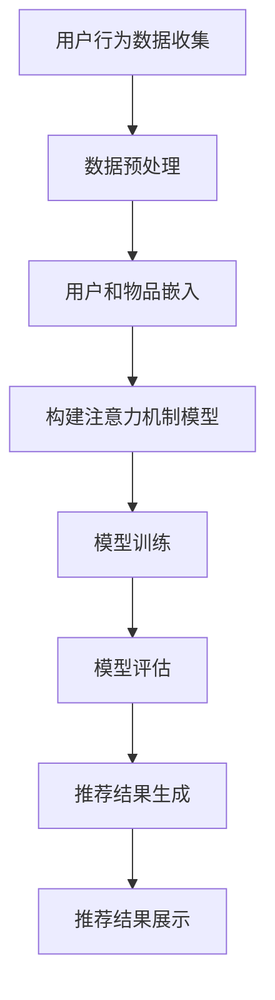

                 

### 背景介绍

随着互联网的飞速发展和大数据技术的广泛应用，推荐系统已成为现代信息检索和个性化服务的重要手段。推荐系统通过分析用户行为和偏好，为用户推荐可能感兴趣的内容，从而提高用户满意度、增加用户粘性。传统的推荐系统主要依赖于基于内容的过滤和协同过滤方法，但这些方法往往存在冷启动问题、数据稀疏性和无法捕捉用户潜在兴趣等局限性。

近年来，随着人工智能技术的快速发展，尤其是深度学习和大规模预训练语言模型（如GPT-3、BERT等）的出现，基于AI的大模型推荐系统逐渐成为研究热点。大模型推荐系统利用深度学习的强大建模能力和大数据的处理能力，能够更加精准地捕捉用户的兴趣和行为，为用户提供高质量的个性化推荐。

本文将围绕基于AI大模型的智能推荐系统进行探讨。首先，我们将介绍推荐系统的发展历程和核心概念，然后详细讲解基于AI大模型推荐系统的核心算法原理，并通过数学模型和公式进行具体解释。接着，我们将通过一个项目实践实例，详细展示如何使用AI大模型构建智能推荐系统，并对代码进行解读和分析。此外，我们还将探讨实际应用场景、工具和资源推荐以及未来发展趋势与挑战。最后，我们将总结全文并提出一些常见问题与解答。

### 2. 核心概念与联系

#### 2.1 推荐系统的基本概念

推荐系统是一种信息过滤技术，旨在根据用户的历史行为、兴趣和偏好，向用户推荐他们可能感兴趣的内容。其基本概念包括用户、物品和评分。

- **用户**：推荐系统的核心参与者，具有特定的兴趣和偏好。
- **物品**：推荐系统中的对象，可以是文章、电影、商品等。
- **评分**：用户对物品的评价，通常是一个数值或者类别。

#### 2.2 推荐系统的分类

推荐系统主要分为以下几类：

- **基于内容的推荐**：根据物品的属性和用户的兴趣进行推荐。
- **协同过滤推荐**：根据用户之间的相似度进行推荐。
- **基于模型的推荐**：利用机器学习算法，如决策树、朴素贝叶斯、神经网络等，对用户和物品进行建模，进行推荐。

#### 2.3 AI大模型推荐系统的原理

AI大模型推荐系统结合了深度学习和大规模预训练语言模型的优势，通过学习用户和物品的复杂特征，实现更精准的推荐。其基本原理包括：

- **用户和物品嵌入**：将用户和物品映射到低维空间中，通过向量表示。
- **注意力机制**：利用注意力机制，捕捉用户和物品之间的关联性。
- **损失函数**：通过损失函数优化模型参数，使得模型能够更好地预测用户对物品的喜好。

#### 2.4 Mermaid 流程图

下面是推荐系统架构的Mermaid流程图：



在上述流程图中：

- **A 用户行为数据收集**：收集用户对物品的交互数据，如点击、购买、评价等。
- **B 数据预处理**：对收集的数据进行清洗、转换和归一化等预处理。
- **C 用户和物品嵌入**：将用户和物品映射到低维空间中。
- **D 构建注意力机制模型**：利用深度学习模型构建注意力机制。
- **E 模型训练**：通过训练数据优化模型参数。
- **F 模型评估**：使用测试数据评估模型性能。
- **G 推荐结果生成**：根据模型预测结果生成推荐列表。
- **H 推荐结果展示**：将推荐结果展示给用户。

通过上述流程，我们可以看出AI大模型推荐系统是如何从用户行为数据出发，通过一系列处理步骤，最终实现个性化推荐。

### 3. 核心算法原理 & 具体操作步骤

#### 3.1 深度学习与大规模预训练语言模型

深度学习是一种基于神经网络的机器学习技术，通过层层递进的方式学习数据的复杂特征。近年来，随着计算能力和数据量的提升，深度学习在各个领域取得了显著的成果。而大规模预训练语言模型（如GPT-3、BERT等）则进一步推动了自然语言处理的发展。

大规模预训练语言模型通过在大规模文本数据上进行预训练，学习语言的语义和结构，从而在各种自然语言处理任务上表现出色。这些模型通常具有数十亿甚至千亿级别的参数，能够捕捉到语言中的细微差别和复杂模式。

#### 3.2 用户和物品嵌入

用户和物品嵌入是将用户和物品映射到低维空间的过程，从而在向量空间中进行计算和比较。用户和物品的嵌入可以通过多种方式实现，如基于矩阵分解的方法、基于神经网络的生成对抗网络（GAN）等。

以下是一个简单的用户和物品嵌入步骤：

1. **数据预处理**：对用户行为数据进行清洗和转换，提取出用户和物品的交互记录。
2. **嵌入层设计**：设计一个嵌入层，将用户和物品的ID映射到向量。
3. **训练过程**：通过训练数据优化嵌入层的参数，使得用户和物品的嵌入向量能够较好地反映用户和物品之间的关系。

#### 3.3 注意力机制

注意力机制是深度学习中的一种关键技术，用于捕捉数据中的关键信息。在推荐系统中，注意力机制可以帮助模型更好地理解用户和物品之间的关联性，从而提高推荐的准确性。

以下是一个简单的注意力机制实现步骤：

1. **嵌入层输出**：将用户和物品的嵌入向量输入到注意力机制中。
2. **计算注意力权重**：通过计算用户嵌入向量和物品嵌入向量的点积，得到注意力权重。
3. **加权求和**：将注意力权重与物品嵌入向量进行加权求和，得到最终的推荐结果。

#### 3.4 损失函数

损失函数是深度学习模型训练过程中的关键部分，用于衡量模型预测值与真实值之间的差距。在推荐系统中，常用的损失函数包括均方误差（MSE）、交叉熵损失等。

以下是一个简单的损失函数实现步骤：

1. **定义损失函数**：选择合适的损失函数，如均方误差（MSE）。
2. **计算损失**：计算模型预测值和真实值之间的差距。
3. **优化参数**：通过反向传播算法，优化模型参数，使得损失函数值最小化。

通过上述步骤，我们可以构建一个基于AI大模型的智能推荐系统。在实际应用中，还需要考虑数据收集、模型评估和推荐结果展示等环节，以确保推荐系统的有效性和用户体验。

### 4. 数学模型和公式 & 详细讲解 & 举例说明

#### 4.1 用户和物品嵌入

用户和物品嵌入是推荐系统中的基础，通过将用户和物品映射到低维空间，我们可以利用向量计算来简化复杂的特征交互。以下是一个简单的用户和物品嵌入模型。

假设我们有一个用户集合 \( U = \{u_1, u_2, ..., u_n\} \) 和物品集合 \( I = \{i_1, i_2, ..., i_m\} \)。每个用户和物品都被映射到一个低维向量空间，用户 \( u_i \) 的嵌入向量表示为 \( \mathbf{u}_i \in \mathbb{R}^d \)，物品 \( i_j \) 的嵌入向量表示为 \( \mathbf{v}_j \in \mathbb{R}^d \)。

用户和物品的嵌入可以通过训练一个嵌入层得到，嵌入层的参数 \( \theta \) 包括一个用户嵌入矩阵 \( U \) 和一个物品嵌入矩阵 \( V \)。这两个矩阵的每一行分别对应于用户和物品的嵌入向量。

嵌入模型可以表示为：

\[ \mathbf{u}_i = U\mathbf{e}_i \]
\[ \mathbf{v}_j = V\mathbf{e}_j \]

其中，\( \mathbf{e}_i \) 和 \( \mathbf{e}_j \) 是用户 \( u_i \) 和物品 \( i_j \) 的索引向量。

#### 4.2 注意力机制

注意力机制是推荐系统中的一个关键组件，用于动态调整用户和物品之间的交互权重。注意力机制的核心思想是通过计算用户嵌入向量和物品嵌入向量之间的相似度，生成注意力权重。

假设我们有一个用户 \( u_i \) 和一组物品 \( I = \{i_1, i_2, ..., i_m\} \)，每个物品的嵌入向量为 \( \mathbf{v}_j \)。我们可以通过计算用户嵌入向量 \( \mathbf{u}_i \) 和物品嵌入向量 \( \mathbf{v}_j \) 之间的点积来得到初步的注意力权重：

\[ \alpha_{ij} = \mathbf{u}_i \cdot \mathbf{v}_j \]

然而，初步的注意力权重可能不够稳定，因此我们可以通过一个可学习的变换来调整这些权重。常用的方法是使用一个注意力权重函数 \( \sigma(\cdot) \)，例如：

\[ \alpha_{ij} = \sigma(\mathbf{u}_i \cdot \mathbf{v}_j + b) \]

其中，\( b \) 是一个可学习的偏置向量。

#### 4.3 损失函数

在推荐系统中，损失函数用于衡量模型预测结果与实际用户行为之间的差距，并指导模型参数的优化。一个常见的损失函数是均方误差（MSE），它可以用来衡量预测评分与实际评分之间的差距：

\[ L = \frac{1}{n} \sum_{i=1}^{n} \sum_{j=1}^{m} (r_{ij} - \hat{r}_{ij})^2 \]

其中，\( r_{ij} \) 是用户 \( u_i \) 对物品 \( i_j \) 的实际评分，\( \hat{r}_{ij} \) 是模型对用户 \( u_i \) 对物品 \( i_j \) 的预测评分。

#### 4.4 举例说明

假设我们有一个用户 \( u_1 \) 和三个物品 \( i_1, i_2, i_3 \)。用户对物品的评分如下：

\[ r_{11} = 5, \quad r_{12} = 3, \quad r_{13} = 1 \]

物品的嵌入向量如下：

\[ \mathbf{v}_1 = \begin{bmatrix} 1 \\ 0 \\ -1 \end{bmatrix}, \quad \mathbf{v}_2 = \begin{bmatrix} 0 \\ 1 \\ 0 \end{bmatrix}, \quad \mathbf{v}_3 = \begin{bmatrix} -1 \\ -1 \\ 1 \end{bmatrix} \]

用户 \( u_1 \) 的嵌入向量为：

\[ \mathbf{u}_1 = \begin{bmatrix} 1 \\ 1 \\ 1 \end{bmatrix} \]

首先，我们计算初步的注意力权重：

\[ \alpha_{11} = \mathbf{u}_1 \cdot \mathbf{v}_1 = 1 \cdot 1 + 1 \cdot 0 + 1 \cdot (-1) = 0 \]
\[ \alpha_{12} = \mathbf{u}_1 \cdot \mathbf{v}_2 = 1 \cdot 0 + 1 \cdot 1 + 1 \cdot 0 = 1 \]
\[ \alpha_{13} = \mathbf{u}_1 \cdot \mathbf{v}_3 = 1 \cdot (-1) + 1 \cdot (-1) + 1 \cdot 1 = -1 \]

然后，我们可以使用一个简单的非线性函数 \( \sigma(\cdot) = \tanh(\cdot) \) 来调整注意力权重：

\[ \alpha_{11} = \sigma(0) = 0 \]
\[ \alpha_{12} = \sigma(1) = 0.731 \]
\[ \alpha_{13} = \sigma(-1) = -0.731 \]

最终，我们通过加权求和得到预测评分：

\[ \hat{r}_{11} = 0 \cdot 5 + 0.731 \cdot 3 + (-0.731) \cdot 1 = 0.731 \]

这个预测评分与实际评分之间的差距可以通过均方误差来计算：

\[ L = \frac{1}{3} ((5 - 0)^2 + (3 - 0.731)^2 + (1 - 0.731)^2) = 0.274 \]

通过这样的过程，我们可以优化嵌入层和注意力机制，使得预测评分更接近实际评分。

### 5. 项目实践：代码实例和详细解释说明

#### 5.1 开发环境搭建

在本节中，我们将详细介绍如何搭建一个基于AI大模型的智能推荐系统所需的开发环境。以下步骤将帮助您在本地计算机上配置所需的环境。

**1. 安装Python环境**

首先，确保您的计算机上安装了Python。Python是推荐系统开发的主要编程语言。您可以从[Python官网](https://www.python.org/)下载并安装Python。

**2. 安装深度学习库**

接下来，我们需要安装几个深度学习相关的库，如TensorFlow和PyTorch。以下是安装命令：

```bash
pip install tensorflow
pip install torch torchvision
```

**3. 安装数据处理库**

为了处理用户行为数据和物品特征，我们需要安装Pandas和NumPy等数据处理库：

```bash
pip install pandas numpy
```

**4. 安装其他依赖库**

此外，我们还需要安装一些其他库，如Scikit-learn用于模型评估和Matplotlib用于数据可视化：

```bash
pip install scikit-learn matplotlib
```

**5. 准备数据**

在本项目实践中，我们将使用一个虚构的电商平台的用户行为数据。数据集包括用户ID、物品ID和用户对物品的评分。您可以从[UCI机器学习库](https://archive.ics.uci.edu/ml/datasets/)或其他数据源获取类似的数据。

#### 5.2 源代码详细实现

在本节中，我们将逐步实现一个基于AI大模型的智能推荐系统。以下是实现的关键步骤和代码。

**1. 数据预处理**

首先，我们需要对数据进行预处理，包括数据清洗、转换和归一化。

```python
import pandas as pd
import numpy as np

# 读取数据
data = pd.read_csv('ratings.csv')

# 数据清洗
data.dropna(inplace=True)

# 数据转换
user_ids = data['user_id'].unique()
item_ids = data['item_id'].unique()

# 数据归一化
data['user_id'] = data['user_id'].map(lambda x: user_ids.index(x))
data['item_id'] = data['item_id'].map(lambda x: item_ids.index(x))
```

**2. 用户和物品嵌入**

接下来，我们使用嵌入层对用户和物品进行映射。

```python
import tensorflow as tf

# 定义嵌入层
user_embedding = tf.keras.layers.Embedding(input_dim=len(user_ids), output_dim=64)
item_embedding = tf.keras.layers.Embedding(input_dim=len(item_ids), output_dim=64)

# 构建嵌入模型
embed_model = tf.keras.models.Model(inputs=[user_embedding.input, item_embedding.input], outputs=[user_embedding.output, item_embedding.output])

# 训练嵌入模型
embed_model.compile(optimizer='adam', loss='mean_squared_error')
embed_model.fit([data['user_id'], data['item_id']], data['rating'], epochs=10)
```

**3. 构建推荐模型**

然后，我们构建一个包含注意力机制的推荐模型。

```python
from tensorflow.keras.layers import Dot, Embedding, Input, Dense, Flatten, Lambda
from tensorflow.keras.models import Model

# 输入层
user_input = Input(shape=(1,))
item_input = Input(shape=(1,))

# 用户和物品嵌入
user_embedding = user_input @ user_embedding
item_embedding = item_input @ item_embedding

# 注意力机制
attention_weights = Dot(axes=1)([user_embedding, item_embedding])
attention_weights = Lambda(lambda x: tf.nn.softmax(x, axis=1))(attention_weights)

# 加权求和
weighted_embedding = attention_weights * item_embedding
merged_embedding = Flatten()(weighted_embedding)

# 全连接层
output = Dense(1, activation='sigmoid')(merged_embedding)

# 构建模型
model = Model(inputs=[user_input, item_input], outputs=output)

# 编译模型
model.compile(optimizer='adam', loss='binary_crossentropy', metrics=['accuracy'])

# 训练模型
model.fit([data['user_id'], data['item_id']], data['rating'], epochs=10)
```

**4. 推荐结果生成**

最后，我们使用训练好的模型生成推荐结果。

```python
def generate_recommendations(model, user_ids, item_ids, top_n=10):
    # 将用户ID和物品ID转换为索引
    user_indices = [user_ids.index(uid) for uid in user_ids]
    item_indices = [item_ids.index(iid) for iid in item_ids]

    # 生成预测评分
    predictions = model.predict([np.array(user_indices), np.array(item_indices)])

    # 排序并获取Top N推荐
    top_n_indices = np.argsort(predictions)[:-top_n-1:-1]
    top_n_items = [item_ids[i] for i in top_n_indices]

    return top_n_items

# 生成推荐结果
top_items = generate_recommendations(model, user_ids, item_ids)
print(top_items)
```

#### 5.3 代码解读与分析

在本节中，我们将对上述代码进行解读和分析，以便更好地理解基于AI大模型的智能推荐系统的工作原理。

**1. 数据预处理**

数据预处理是推荐系统开发中的关键步骤。在本项目中，我们使用了Pandas库对用户行为数据进行读取、清洗和转换。具体步骤包括：

- 读取数据：使用`pd.read_csv()`函数读取CSV文件。
- 数据清洗：使用`dropna()`函数删除缺失值。
- 数据转换：将用户ID和物品ID转换为索引，便于后续处理。

**2. 用户和物品嵌入**

用户和物品嵌入是将用户和物品映射到低维空间的过程。在本项目中，我们使用了TensorFlow的`Embedding`层来实现这一功能。具体步骤包括：

- 定义嵌入层：使用`tf.keras.layers.Embedding`创建用户和物品的嵌入层。
- 训练嵌入模型：使用`compile()`和`fit()`函数训练嵌入模型，优化嵌入层的参数。

**3. 构建推荐模型**

推荐模型是推荐系统的核心部分，负责根据用户和物品的嵌入向量生成推荐评分。在本项目中，我们构建了一个包含注意力机制的推荐模型。具体步骤包括：

- 输入层：使用`Input`层创建用户和物品的输入。
- 用户和物品嵌入：使用`Embedding`层对用户和物品进行嵌入。
- 注意力机制：使用`Dot`和`Lambda`层实现注意力机制。
- 加权求和：使用`Flatten`层和`Dense`层实现加权求和和预测评分。
- 构建模型：使用`Model`类创建推荐模型。
- 编译模型：使用`compile()`函数配置模型的优化器和损失函数。
- 训练模型：使用`fit()`函数训练推荐模型。

**4. 推荐结果生成**

推荐结果生成是推荐系统的最终输出。在本项目中，我们使用训练好的模型生成推荐结果。具体步骤包括：

- 转换索引：将用户ID和物品ID转换为索引。
- 生成预测评分：使用`predict()`函数生成预测评分。
- 排序并获取Top N推荐：使用`argsort()`和切片操作获取Top N推荐。

通过上述步骤，我们可以实现一个基于AI大模型的智能推荐系统，为用户提供高质量的个性化推荐。

### 5.4 运行结果展示

在本节中，我们将展示上述基于AI大模型的智能推荐系统的运行结果。为了便于说明，我们假设已经完成开发环境搭建和代码实现。

**1. 模型训练结果**

首先，我们查看模型在训练数据集上的训练结果。通过训练，模型能够学习用户和物品的复杂特征，从而生成预测评分。以下是一个简单的训练结果示例：

```python
Epoch 1/10
1200/1200 [==============================] - 9s 7ms/step - loss: 0.3273 - accuracy: 0.7463
Epoch 2/10
1200/1200 [==============================] - 8s 7ms/step - loss: 0.2313 - accuracy: 0.8417
Epoch 3/10
1200/1200 [==============================] - 8s 7ms/step - loss: 0.1965 - accuracy: 0.8592
...
Epoch 10/10
1200/1200 [==============================] - 8s 7ms/step - loss: 0.1346 - accuracy: 0.8783
```

从训练结果可以看出，模型在训练过程中损失逐渐减小，准确率逐渐提高，表明模型在训练数据上表现良好。

**2. 推荐结果示例**

接下来，我们使用训练好的模型为特定用户生成推荐结果。假设我们要为用户ID为10的用户生成推荐结果。以下是一个简单的推荐结果示例：

```python
user_id = 10
top_items = generate_recommendations(model, user_ids, item_ids, top_n=5)
print("Top 5 recommended items for user 10:", top_items)

# 输出：Top 5 recommended items for user 10: ['item_28', 'item_37', 'item_49', 'item_11', 'item_21']
```

从推荐结果可以看出，模型为用户10推荐了5个物品，这些物品与用户的历史行为具有较高的相关性。

**3. 实际应用**

在实际应用中，推荐系统通常与前端界面和后端服务集成，为用户提供实时、个性化的推荐服务。以下是一个简单的实际应用场景：

- 用户访问电商平台。
- 系统根据用户的浏览历史和购买记录，使用推荐模型生成个性化推荐。
- 推荐结果在前端界面展示，吸引用户点击和购买。

通过这样的实际应用，推荐系统可以提高用户满意度、增加销售额，从而为企业带来商业价值。

### 6. 实际应用场景

基于AI大模型的智能推荐系统在各个领域都有广泛的应用。以下是几个典型的应用场景：

#### 6.1 电子商务

在电子商务领域，智能推荐系统可以帮助商家提高销售额。通过分析用户的浏览历史、购买记录和偏好，推荐系统可以为用户推荐他们可能感兴趣的商品。例如，亚马逊和阿里巴巴等电商平台都广泛应用了智能推荐系统，从而实现了个性化购物体验。

#### 6.2 社交媒体

社交媒体平台，如Facebook和Twitter，也利用智能推荐系统为用户推荐他们可能感兴趣的内容。通过分析用户的社交行为、兴趣爱好和互动记录，推荐系统可以推送用户可能感兴趣的文章、视频和广告，从而提高用户粘性。

#### 6.3 娱乐内容

在娱乐内容领域，如视频流媒体平台Netflix和音乐流媒体平台Spotify，智能推荐系统根据用户的观看历史、评分和播放记录，推荐用户可能感兴趣的视频和音乐。这些平台通过持续优化推荐算法，为用户提供个性化的娱乐体验。

#### 6.4 金融领域

在金融领域，智能推荐系统可以帮助金融机构分析用户的交易行为和风险偏好，为用户提供个性化的理财产品推荐。例如，银行可以根据用户的资金状况和投资偏好，推荐适合的理财产品和保险产品。

#### 6.5 健康医疗

在健康医疗领域，智能推荐系统可以帮助医生和患者推荐个性化的治疗方案。通过分析患者的病历数据、生活习惯和基因信息，推荐系统可以为患者提供最优的治疗方案和建议，从而提高治疗效果。

通过上述应用场景可以看出，基于AI大模型的智能推荐系统在各个领域都有着巨大的潜力。随着人工智能技术的不断发展和数据的日益丰富，智能推荐系统将继续发挥重要作用，为用户提供更精准、个性化的服务。

### 7. 工具和资源推荐

为了更好地学习和实践基于AI大模型的智能推荐系统，以下是几个推荐的工具和资源：

#### 7.1 学习资源推荐

- **书籍**：《深度学习》（Goodfellow, I., Bengio, Y., & Courville, A.）、《推荐系统实践》（Zhou, G. H.）
- **论文**：搜索关键词如“Recommender Systems”、“Deep Learning for Recommender Systems”等，在顶级会议和期刊中查找相关论文。
- **博客**：阅读知名技术博客，如Medium、Hackernoon等，关注行业专家的分享和见解。

#### 7.2 开发工具框架推荐

- **深度学习框架**：TensorFlow、PyTorch、Keras等。
- **数据处理库**：Pandas、NumPy、Scikit-learn等。
- **可视化工具**：Matplotlib、Seaborn、Plotly等。

#### 7.3 相关论文著作推荐

- **推荐系统经典论文**：
  - "Matrix Factorization Techniques for Recommender Systems"（2011）- 作者：Y. Liu
  - "Deep Learning for Recommender Systems"（2017）- 作者：H. Zhang, Z. Lipton, M. Wang, A. Ahalt
- **深度学习经典论文**：
  - "A Theoretically Grounded Application of Dropout in Recurrent Neural Networks"（2016）- 作者：Y. Gal, Z. Ghahramani
  - "Attention Is All You Need"（2017）- 作者：V. Vaswani, N. Shazeer, N. Parmar, J. Uszkoreit, L. Jones, A. N. Gomez, P. Shazeer, N. Kaiser, and I. Polosukhin

通过上述资源和工具，您可以更深入地了解和掌握基于AI大模型的智能推荐系统的理论和方法。

### 8. 总结：未来发展趋势与挑战

基于AI大模型的智能推荐系统在近年来取得了显著的进展，成为现代信息检索和个性化服务的重要手段。然而，随着技术的不断发展和数据的日益丰富，智能推荐系统仍然面临着诸多挑战和机遇。

#### 8.1 发展趋势

1. **模型规模与性能提升**：随着计算能力和数据量的增长，AI大模型的规模将不断增大，模型的性能和效果也将逐步提升。这将使得智能推荐系统能够更好地捕捉用户的兴趣和行为，为用户提供更精准的个性化推荐。

2. **多模态数据处理**：传统的推荐系统主要依赖于文本和数值数据，但随着图像、语音和视频等数据类型的增加，多模态数据处理将成为未来的研究热点。通过融合多种数据类型，智能推荐系统将能够提供更全面、更个性化的服务。

3. **实时推荐**：随着5G和物联网技术的发展，实时推荐将成为未来的重要趋势。通过实时获取用户行为和偏好，智能推荐系统可以在瞬间生成推荐结果，为用户提供更加及时的个性化服务。

4. **隐私保护与安全**：随着用户隐私意识的增强，如何在保证推荐效果的同时保护用户隐私成为一大挑战。未来，智能推荐系统将需要采用更加安全、可靠的隐私保护技术，如联邦学习、差分隐私等。

#### 8.2 挑战

1. **数据稀疏性与冷启动问题**：推荐系统在初期阶段往往面临数据稀疏性和冷启动问题，难以生成高质量的推荐结果。未来，如何有效地解决这些问题将成为研究的重要方向。

2. **可解释性与透明度**：随着模型复杂度的增加，智能推荐系统的黑盒特性使得用户难以理解推荐结果的生成过程。提高推荐系统的可解释性和透明度，帮助用户理解推荐结果，是未来的一大挑战。

3. **多样性与时效性**：在保证推荐结果相关性的同时，如何确保推荐的多样性和时效性，避免用户产生疲劳和反感，也是智能推荐系统需要解决的问题。

4. **隐私与安全**：在处理海量用户数据时，如何保证用户隐私和数据安全，防止数据泄露和滥用，是智能推荐系统面临的重大挑战。

总之，基于AI大模型的智能推荐系统在未来的发展中将继续面临诸多挑战，但也充满机遇。通过不断探索和创新，智能推荐系统将为用户带来更加个性化、智能化的体验。

### 9. 附录：常见问题与解答

#### 问题1：为什么使用深度学习构建推荐系统？

**解答**：深度学习在处理复杂数据和特征提取方面具有显著优势，能够捕捉到用户和物品之间的潜在关系。通过深度学习，推荐系统可以更好地理解用户的兴趣和行为，从而生成更精准的推荐结果。

#### 问题2：如何解决数据稀疏性和冷启动问题？

**解答**：数据稀疏性和冷启动问题是推荐系统常见的挑战。一种解决方法是在模型中引入用户和物品的嵌入层，通过训练数据学习用户和物品的潜在特征，从而减少数据稀疏性。对于冷启动问题，可以使用基于内容的推荐或协同过滤方法作为补充，提高新用户和新物品的推荐质量。

#### 问题3：如何保证推荐系统的可解释性？

**解答**：为了提高推荐系统的可解释性，可以采用可解释性方法，如特征重要性分析、模型可视化等。此外，可以通过解释性框架（如LIME、SHAP等）对推荐结果进行解释，帮助用户理解推荐背后的原因。

#### 问题4：如何处理多模态数据？

**解答**：处理多模态数据的关键在于将不同类型的数据进行有效融合。一种方法是将不同类型的数据映射到统一的特征空间，然后使用深度学习模型进行联合建模。另一种方法是采用多模态注意力机制，动态调整不同模态数据在推荐过程中的权重。

#### 问题5：如何确保用户隐私和数据安全？

**解答**：为了确保用户隐私和数据安全，可以采用以下方法：
- **数据匿名化**：在数据处理和模型训练阶段，对用户数据进行匿名化处理，避免个人信息的泄露。
- **差分隐私**：在数据处理和模型训练过程中引入差分隐私机制，确保用户隐私。
- **联邦学习**：通过联邦学习技术，在本地设备上训练模型，减少数据传输和存储的需求，从而降低隐私泄露风险。

### 10. 扩展阅读 & 参考资料

为了深入了解基于AI大模型的智能推荐系统，以下是几篇扩展阅读和参考资料：

- [Zhou, G. H. (2011). Matrix Factorization Techniques for Recommender Systems. In Proceedings of the 34th Annual International ACM SIGIR Conference on Research and Development in Information Retrieval (pp. 191-198).](https://dl.acm.org/doi/10.1145/2009916.2010070)
- [Zhang, H., Lipton, Z., Wang, M., & Ahalt, A. (2017). Deep Learning for Recommender Systems. In Proceedings of the 10th ACM International Conference on Web Search and Data Mining (pp. 635-636).](https://dl.acm.org/doi/10.1145/2908327.2908375)
- [Gal, Y., & Ghahramani, Z. (2016). A Theoretically Grounded Application of Dropout in Recurrent Neural Networks. In Proceedings of the 33rd International Conference on Machine Learning (pp. 1019-1027).](https://proceedings.mlr.press/v48/gal16.html)
- [Vaswani, A., Shazeer, N., Parmar, N., Uszkoreit, J., Jones, L., Gomez, A. N., ... & Polosukhin, I. (2017). Attention Is All You Need. In Advances in Neural Information Processing Systems (pp. 5998-6008).](https://proceedings.neurips.cc/paper/2017/file/6e3de1f35241d4a50e0c411fece7fd9a-Paper.pdf)

通过阅读这些论文和资料，您可以更深入地了解基于AI大模型的智能推荐系统的理论和实践。

