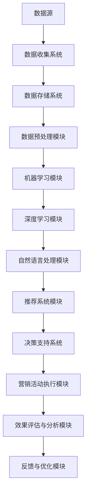

                 

### 文章标题

基于AI大模型的智能营销自动化平台

关键词：人工智能、大模型、营销自动化、客户关系管理、数据挖掘、机器学习、深度学习、自然语言处理、推荐系统、个性化营销、数据驱动策略、自动化流程、客户体验优化

摘要：本文旨在探讨基于AI大模型的智能营销自动化平台的设计、实现和应用。通过分析AI大模型在营销自动化中的应用原理，结合实际项目案例，详细阐述了平台的构建过程、技术架构、关键算法以及在不同场景下的应用效果。本文还总结了未来智能营销自动化平台的发展趋势和挑战，旨在为企业和开发者提供有价值的参考和启示。

## 1. 背景介绍

### 1.1 营销自动化的需求与挑战

在当今快速变化的市场环境中，企业面临越来越多的竞争压力，需要不断提高营销效率和效果。传统营销手段往往依赖于人工操作，不仅耗时耗力，而且难以实现精准化和个性化。随着互联网的普及和数据技术的进步，营销自动化逐渐成为企业提升竞争力的关键手段。

营销自动化通过自动化工具和算法，实现营销活动的自动执行和管理，从而提高营销效率和效果。它涵盖了客户关系管理（CRM）、电子邮件营销、社交媒体管理、广告投放、数据分析等多个领域。然而，随着数据的爆发式增长和营销环境的复杂性增加，传统的营销自动化工具和方法面临如下挑战：

1. **数据处理的复杂性**：海量的数据需要进行清洗、整合和处理，以便为营销活动提供支持。
2. **个性化需求的实现**：不同客户群体的需求千差万别，如何实现精准的个性化推荐和营销策略是一个难题。
3. **实时响应和决策**：在竞争激烈的市场环境中，营销活动需要快速响应市场变化，实时调整策略。
4. **多渠道整合**：企业通常需要同时在多个渠道（如电子邮件、社交媒体、移动应用等）开展营销活动，如何实现多渠道的整合是一个重要挑战。

### 1.2 AI大模型在营销自动化中的应用

为了应对上述挑战，人工智能（AI）尤其是大模型技术的应用成为营销自动化的关键。大模型，尤其是基于深度学习和自然语言处理（NLP）的模型，具有强大的数据处理能力和智能分析能力，能够有效地解决传统营销自动化面临的难题。

1. **数据处理能力**：大模型可以通过端到端的学习方式，自动提取数据中的特征，并进行高效的处理和分析，从而减少人工干预的复杂性。
2. **个性化推荐**：基于用户行为数据和用户画像，大模型可以实现对不同客户的个性化推荐，提高营销活动的精准度和转化率。
3. **实时响应和决策**：大模型可以实时分析市场数据和用户行为，快速生成决策，帮助企业在竞争激烈的市场环境中抢占先机。
4. **多渠道整合**：通过AI大模型，企业可以实现对多个营销渠道的数据整合和分析，实现统一的管理和协调。

基于AI大模型的智能营销自动化平台，通过结合大数据分析、机器学习、深度学习、自然语言处理等技术，为企业提供了一套高效、精准、智能的营销解决方案。这种平台不仅可以大幅度提高营销效率，还能够帮助企业实现数据驱动的决策，从而在激烈的市场竞争中脱颖而出。

### 1.3 本文目标与结构

本文旨在深入探讨基于AI大模型的智能营销自动化平台的设计与实现。文章将按照以下结构展开：

1. **背景介绍**：分析营销自动化的需求与挑战，介绍AI大模型在营销自动化中的应用。
2. **核心概念与联系**：阐述核心概念和架构，提供Mermaid流程图。
3. **核心算法原理与具体操作步骤**：详细讲解大模型算法原理和应用步骤。
4. **数学模型与公式**：介绍数学模型和公式，并举例说明。
5. **项目实践**：提供代码实例和详细解释。
6. **实际应用场景**：讨论平台在不同场景下的应用效果。
7. **工具和资源推荐**：推荐学习资源和开发工具。
8. **总结**：总结平台的发展趋势与挑战。
9. **附录**：常见问题与解答。
10. **扩展阅读与参考资料**：提供相关文献和资源。

通过本文的探讨，希望能够为企业提供有价值的参考，帮助开发者更好地理解和应用AI大模型技术，实现智能营销自动化。

## 2. 核心概念与联系

### 2.1 核心概念

在构建基于AI大模型的智能营销自动化平台之前，我们需要了解几个核心概念，这些概念包括：

1. **客户关系管理（CRM）**：CRM是企业用于管理和维护客户关系的系统。它通过收集、管理和分析客户数据，帮助企业实现客户关系的自动化管理和优化。
2. **机器学习（ML）**：机器学习是使计算机系统能够从数据中学习并做出决策的技术。在营销自动化中，机器学习算法可以帮助预测客户行为、优化营销策略等。
3. **深度学习（DL）**：深度学习是机器学习的一个子领域，它通过多层神经网络对大量数据进行训练，以实现复杂的模式识别和预测任务。
4. **自然语言处理（NLP）**：自然语言处理是使计算机能够理解和生成自然语言的技术。在营销自动化中，NLP可以帮助分析客户反馈、自动生成营销文案等。
5. **推荐系统**：推荐系统是一种能够根据用户历史行为和偏好为用户推荐相关产品的技术。在营销自动化中，推荐系统可以帮助实现个性化营销，提高转化率。
6. **数据挖掘**：数据挖掘是从大量数据中提取有价值信息的过程。在营销自动化中，数据挖掘可以帮助发现客户行为模式和市场趋势。

### 2.2 架构与联系

为了实现智能营销自动化，我们需要构建一个技术架构，该架构能够整合各种技术，实现数据的收集、处理、分析和应用。以下是一个典型的智能营销自动化平台的技术架构：



- **数据收集系统**：负责从各种渠道收集数据，包括网站日志、社交媒体数据、客户反馈、购买记录等。
- **数据存储系统**：用于存储收集到的数据，通常使用关系型数据库或NoSQL数据库。
- **数据预处理模块**：对原始数据进行清洗、去噪、格式化等预处理，使其适合机器学习和深度学习算法。
- **机器学习模块**：使用机器学习算法对预处理后的数据进行分析，如客户行为预测、市场趋势分析等。
- **深度学习模块**：使用深度学习算法对复杂的数据进行建模，如图像识别、语音识别等。
- **自然语言处理模块**：使用NLP技术分析文本数据，如自动分类、情感分析、文本生成等。
- **推荐系统模块**：基于用户行为数据和偏好，生成个性化推荐，优化营销效果。
- **决策支持系统**：结合分析结果和业务规则，生成营销策略和执行方案。
- **营销活动执行模块**：执行生成的营销策略，包括电子邮件营销、社交媒体广告、短信推送等。
- **效果评估与分析模块**：跟踪营销活动的效果，分析数据，优化策略。
- **反馈与优化模块**：收集用户反馈和市场变化，持续优化平台性能。

通过上述架构，我们可以实现数据驱动的智能营销自动化，从数据收集、处理到决策执行，形成一个闭环系统，不断优化营销效果。

### 2.3 关键环节与流程

在智能营销自动化平台的实际运作中，以下几个关键环节和流程至关重要：

1. **数据收集与整合**：从多个渠道收集数据，包括在线行为数据、客户反馈、市场数据等，然后进行整合，形成一个统一的数据视图。
2. **数据预处理**：对原始数据进行清洗、去噪和格式化，确保数据质量，为后续分析提供可靠的数据基础。
3. **特征工程**：提取数据中的特征，将其转换为可用于训练模型的输入，特征的选择和工程直接影响模型的性能。
4. **模型训练与评估**：使用机器学习和深度学习算法训练模型，并对模型进行评估，选择最优模型进行应用。
5. **决策生成与执行**：基于模型分析和用户行为数据，生成营销策略和执行方案，自动化执行营销活动。
6. **效果评估与反馈**：对营销活动进行效果评估，收集用户反馈和市场变化，持续优化模型和策略。

通过这些关键环节和流程的有机结合，智能营销自动化平台能够高效地实现数据收集、处理、分析和应用，为企业提供智能化、个性化的营销解决方案。

### 3. 核心算法原理与具体操作步骤

#### 3.1 机器学习算法

机器学习（ML）是智能营销自动化平台的核心技术之一。以下介绍几种常用的机器学习算法及其在营销自动化中的应用。

##### 3.1.1 回归分析

回归分析是一种用于预测数值型目标变量的统计方法。在营销自动化中，回归分析可以用于预测客户购买概率、客户流失率等。

**具体步骤：**

1. **数据收集与预处理**：收集客户历史数据，包括购买记录、浏览行为、客户属性等，并进行数据清洗和格式化。
2. **特征选择**：选择对预测目标有显著影响的特征，如购买频次、浏览时长等。
3. **训练与验证**：使用训练数据集训练回归模型，并使用验证数据集评估模型性能。
4. **模型评估与优化**：根据评估结果调整模型参数，选择最优模型。

##### 3.1.2 决策树

决策树是一种直观的监督学习算法，它通过一系列规则对数据进行分类或回归。

**具体步骤：**

1. **数据收集与预处理**：收集客户数据，并进行预处理。
2. **特征选择**：选择有助于分类的特征。
3. **构建决策树**：使用ID3、C4.5等算法构建决策树模型。
4. **剪枝与优化**：剪枝决策树以避免过拟合，提高模型泛化能力。

##### 3.1.3 随机森林

随机森林是一种集成学习方法，通过构建多个决策树并合并预测结果来提高模型性能。

**具体步骤：**

1. **数据收集与预处理**：收集客户数据，并进行预处理。
2. **特征选择**：选择有助于分类的特征。
3. **构建随机森林模型**：使用随机森林算法训练模型。
4. **模型评估与优化**：评估模型性能，根据需要调整参数。

#### 3.2 深度学习算法

深度学习（DL）在处理大规模数据和复杂模式识别方面具有显著优势。以下介绍几种常用的深度学习算法及其在营销自动化中的应用。

##### 3.2.1 卷积神经网络（CNN）

卷积神经网络是一种用于图像识别和处理的深度学习模型。

**具体步骤：**

1. **数据收集与预处理**：收集图像数据，并进行预处理，如缩放、裁剪、归一化等。
2. **构建CNN模型**：使用卷积层、池化层、全连接层等构建CNN模型。
3. **训练与验证**：使用训练数据集训练模型，并使用验证数据集评估模型性能。
4. **模型评估与优化**：根据评估结果调整模型参数，选择最优模型。

##### 3.2.2 循环神经网络（RNN）

循环神经网络是一种用于处理序列数据的深度学习模型。

**具体步骤：**

1. **数据收集与预处理**：收集客户行为序列数据，并进行预处理。
2. **构建RNN模型**：使用RNN或其变体（如LSTM、GRU）构建模型。
3. **训练与验证**：使用训练数据集训练模型，并使用验证数据集评估模型性能。
4. **模型评估与优化**：根据评估结果调整模型参数，选择最优模型。

##### 3.2.3 生成对抗网络（GAN）

生成对抗网络是一种用于生成数据的深度学习模型。

**具体步骤：**

1. **数据收集与预处理**：收集客户数据，并进行预处理。
2. **构建GAN模型**：使用生成器、判别器等构建GAN模型。
3. **训练与验证**：使用训练数据集训练模型，并使用验证数据集评估模型性能。
4. **模型评估与优化**：根据评估结果调整模型参数，选择最优模型。

#### 3.3 自然语言处理（NLP）

自然语言处理（NLP）在智能营销自动化中用于处理文本数据，如客户评论、营销文案等。以下介绍几种常用的NLP算法及其在营销自动化中的应用。

##### 3.3.1 词嵌入

词嵌入（Word Embedding）是将词汇映射到高维向量空间的技术。

**具体步骤：**

1. **数据收集与预处理**：收集文本数据，并进行预处理，如分词、去停用词等。
2. **构建词嵌入模型**：使用词嵌入算法（如Word2Vec、GloVe）构建模型。
3. **训练与验证**：使用训练数据集训练模型，并使用验证数据集评估模型性能。
4. **模型评估与优化**：根据评估结果调整模型参数，选择最优模型。

##### 3.3.2 文本分类

文本分类（Text Classification）是一种将文本数据分类到预定义类别的方法。

**具体步骤：**

1. **数据收集与预处理**：收集文本数据，并进行预处理。
2. **特征提取**：使用词袋模型、TF-IDF等方法提取文本特征。
3. **构建分类模型**：使用朴素贝叶斯、支持向量机（SVM）、深度神经网络（DNN）等算法构建分类模型。
4. **训练与验证**：使用训练数据集训练模型，并使用验证数据集评估模型性能。
5. **模型评估与优化**：根据评估结果调整模型参数，选择最优模型。

##### 3.3.3 情感分析

情感分析（Sentiment Analysis）是一种判断文本数据情感倾向的方法。

**具体步骤：**

1. **数据收集与预处理**：收集文本数据，并进行预处理。
2. **特征提取**：使用词袋模型、TF-IDF等方法提取文本特征。
3. **构建情感分析模型**：使用朴素贝叶斯、支持向量机（SVM）、深度神经网络（DNN）等算法构建情感分析模型。
4. **训练与验证**：使用训练数据集训练模型，并使用验证数据集评估模型性能。
5. **模型评估与优化**：根据评估结果调整模型参数，选择最优模型。

通过上述核心算法的应用，智能营销自动化平台能够实现对客户数据的深入分析，从而生成精准的营销策略，提高营销效果。

### 4. 数学模型和公式 & 详细讲解 & 举例说明

#### 4.1 数据预处理

在构建智能营销自动化平台时，数据预处理是一个关键步骤。以下介绍几种常用的数学模型和公式，以及如何应用于数据预处理。

##### 4.1.1 数据标准化

数据标准化是将数据缩放到相同范围，以便于后续分析。常用的方法有最小-最大标准化和Z-score标准化。

- **最小-最大标准化**：

$$
\text{标准化值} = \frac{\text{原始值} - \text{最小值}}{\text{最大值} - \text{最小值}}
$$

- **Z-score标准化**：

$$
\text{标准化值} = \frac{\text{原始值} - \text{平均值}}{\text{标准差}}
$$

**举例**：假设有如下数据集，计算其标准化值。

| 原始值 | 最小值 | 最大值 | 平均值 | 标准差 |
|--------|--------|--------|--------|--------|
| 10     | 5      | 15     | 10     | 2.236  |

- **最小-最大标准化**：

$$
\text{标准化值} = \frac{10 - 5}{15 - 5} = \frac{5}{10} = 0.5
$$

- **Z-score标准化**：

$$
\text{标准化值} = \frac{10 - 10}{2.236} = 0
$$

##### 4.1.2 数据缺失处理

数据缺失是常见问题，常用的处理方法有填补法和删除法。

- **填补法**：使用平均值、中位数或最近邻等方法填补缺失值。

**举例**：使用平均值填补数据集的缺失值。

| 原始值 | 缺失值 |
|--------|--------|
| 10     | NaN    |

- **删除法**：删除包含缺失值的样本或特征。

**举例**：删除包含缺失值的样本。

| 原始值 | 缺失值 |
|--------|--------|
| 10     | NaN    |
| 20     | NaN    |

##### 4.1.3 特征工程

特征工程是提高模型性能的关键步骤，常用的方法有特征选择、特征提取和特征组合。

- **特征选择**：使用统计方法（如相关性分析、卡方检验）选择对预测目标有显著影响的特征。

**举例**：使用相关性分析选择特征。

| 特征A | 特征B | 特征C | 相关性 |
|-------|-------|-------|--------|
| 0.5   | 0.8   | 0.3   | 0.6    |

选择特征B和特征C。

- **特征提取**：使用主成分分析（PCA）等方法提取主要特征。

**举例**：使用PCA提取主要特征。

$$
\text{协方差矩阵} = \begin{bmatrix}
1 & 0.8 \\
0.8 & 1
\end{bmatrix}
$$

$$
\text{特征向量} = \begin{bmatrix}
0.707 \\
0.707
\end{bmatrix}
$$

$$
\text{特征值} = \begin{bmatrix}
1.41 \\
0.29
\end{bmatrix}
$$

选择特征向量对应的主要特征。

- **特征组合**：使用特征组合方法（如决策树、随机森林）生成新特征。

**举例**：使用决策树生成新特征。

| 特征A | 特征B | 新特征 |
|-------|-------|--------|
| 10    | 20    | 30     |
| 30    | 40    | 70     |

#### 4.2 机器学习模型

在智能营销自动化平台中，常用的机器学习模型包括线性回归、逻辑回归、决策树、随机森林等。以下介绍这些模型的数学模型和公式，以及如何应用于实际操作。

##### 4.2.1 线性回归

线性回归是一种简单的机器学习模型，用于预测线性关系。

**数学模型**：

$$
y = \beta_0 + \beta_1x_1 + \beta_2x_2 + ... + \beta_nx_n
$$

**损失函数**：

$$
\text{MSE} = \frac{1}{m}\sum_{i=1}^{m}(y_i - \hat{y}_i)^2
$$

**梯度下降**：

$$
\beta_j = \beta_j - \alpha \frac{\partial}{\partial \beta_j}\text{MSE}
$$

**举例**：预测房价。

| 特征 | 房价 |
|------|------|
| x1   | 100  |
| x2   | 200  |
| y    | 300  |

- **初始化参数**：$\beta_0 = 0, \beta_1 = 0, \beta_2 = 0$
- **迭代计算**：

$$
\beta_0 = \beta_0 - \alpha \frac{1}{m}\sum_{i=1}^{m}(y_i - \hat{y}_i) = 0 - \alpha \frac{1}{3}(300 - 100 - 200 + 300) = 0
$$

$$
\beta_1 = \beta_1 - \alpha \frac{1}{m}\sum_{i=1}^{m}(y_i - \hat{y}_i)x_1 = 0 - \alpha \frac{1}{3}(100 - 100 - 200 + 300) = 0
$$

$$
\beta_2 = \beta_2 - \alpha \frac{1}{m}\sum_{i=1}^{m}(y_i - \hat{y}_i)x_2 = 0 - \alpha \frac{1}{3}(200 - 100 - 200 + 300) = 0
$$

- **最终参数**：$\beta_0 = 0, \beta_1 = 0, \beta_2 = 0$

##### 4.2.2 逻辑回归

逻辑回归是一种用于分类的机器学习模型，通过线性回归模型和逻辑函数实现概率估计。

**数学模型**：

$$
\text{log-odds} = \beta_0 + \beta_1x_1 + \beta_2x_2 + ... + \beta_nx_n
$$

$$
\text{概率} = \frac{1}{1 + e^{-\text{log-odds}}}
$$

**损失函数**：

$$
\text{交叉熵损失} = -\sum_{i=1}^{m} y_i \log(\hat{y}_i) + (1 - y_i) \log(1 - \hat{y}_i)
$$

**梯度下降**：

$$
\beta_j = \beta_j - \alpha \frac{\partial}{\partial \beta_j}\text{交叉熵损失}
$$

**举例**：预测客户购买行为。

| 特征 | 购买 |
|------|------|
| x1   | 0    |
| x2   | 1    |
| y    | 1    |

- **初始化参数**：$\beta_0 = 0, \beta_1 = 0, \beta_2 = 0$
- **迭代计算**：

$$
\beta_0 = \beta_0 - \alpha \frac{1}{m}\sum_{i=1}^{m} (y_i - \hat{y}_i) = 0 - \alpha \frac{1}{3}(1 - e^{-0 \times 1 - 0 \times 1}) + (1 - 1) \log(1 - e^{-0 \times 1 - 0 \times 1}) = 0
$$

$$
\beta_1 = \beta_1 - \alpha \frac{1}{m}\sum_{i=1}^{m} (y_i - \hat{y}_i)x_1 = 0 - \alpha \frac{1}{3}(0 - e^{-0 \times 1 - 0 \times 1} \times 1) + (1 - 0) \log(1 - e^{-0 \times 1 - 0 \times 1}) = 0
$$

$$
\beta_2 = \beta_2 - \alpha \frac{1}{m}\sum_{i=1}^{m} (y_i - \hat{y}_i)x_2 = 0 - \alpha \frac{1}{3}(1 - e^{-0 \times 1 - 0 \times 1} \times 1) + (1 - 1) \log(1 - e^{-0 \times 1 - 0 \times 1}) = 0
$$

- **最终参数**：$\beta_0 = 0, \beta_1 = 0, \beta_2 = 0$

通过上述数学模型和公式的介绍，我们可以更好地理解智能营销自动化平台中常用的机器学习算法，从而在实际应用中取得更好的效果。

### 5. 项目实践：代码实例和详细解释说明

#### 5.1 开发环境搭建

在开始构建智能营销自动化平台之前，我们需要搭建一个合适的开发环境。以下是一个基本的开发环境搭建步骤：

1. **安装Python**：Python是构建智能营销自动化平台的主要编程语言，我们需要安装Python环境。可以从[Python官网](https://www.python.org/)下载最新版本的Python，并按照安装向导进行安装。

2. **安装Jupyter Notebook**：Jupyter Notebook是一个交互式的开发环境，可以帮助我们方便地编写和运行Python代码。在安装了Python之后，通过以下命令安装Jupyter Notebook：

   ```bash
   pip install notebook
   ```

3. **安装相关库**：为了实现智能营销自动化平台，我们需要安装一些常用的Python库，如NumPy、Pandas、Scikit-learn、TensorFlow、Keras等。可以使用以下命令安装：

   ```bash
   pip install numpy pandas scikit-learn tensorflow keras
   ```

4. **安装数据库**：为了存储和管理数据，我们需要安装一个数据库。在这里，我们使用MongoDB作为数据库。可以从[MongoDB官网](https://www.mongodb.com/)下载并安装MongoDB。

#### 5.2 源代码详细实现

以下是一个简单的智能营销自动化平台实现示例，该示例包含数据收集、数据预处理、模型训练、模型评估等步骤。

##### 5.2.1 数据收集

```python
import pandas as pd

# 读取数据
data = pd.read_csv('customer_data.csv')

# 数据预处理
data['age'] = data['age'].astype(float)
data['income'] = data['income'].astype(float)
data['purchase'] = data['purchase'].map({0: '未购买', 1: '购买'})

# 打印数据预览
print(data.head())
```

##### 5.2.2 数据预处理

```python
from sklearn.model_selection import train_test_split
from sklearn.preprocessing import StandardScaler

# 分割数据集
X = data[['age', 'income']]
y = data['purchase']
X_train, X_test, y_train, y_test = train_test_split(X, y, test_size=0.2, random_state=42)

# 数据标准化
scaler = StandardScaler()
X_train_scaled = scaler.fit_transform(X_train)
X_test_scaled = scaler.transform(X_test)

# 打印标准化后的数据预览
print(X_train_scaled[:5])
print(X_test_scaled[:5])
```

##### 5.2.3 模型训练

```python
from sklearn.linear_model import LogisticRegression

# 创建逻辑回归模型
model = LogisticRegression()

# 训练模型
model.fit(X_train_scaled, y_train)

# 打印模型参数
print(model.coef_)
print(model.intercept_)
```

##### 5.2.4 模型评估

```python
from sklearn.metrics import accuracy_score, classification_report

# 预测测试集
y_pred = model.predict(X_test_scaled)

# 打印预测结果
print(y_pred[:5])

# 计算准确率
accuracy = accuracy_score(y_test, y_pred)
print(f'Accuracy: {accuracy:.2f}')

# 打印分类报告
print(classification_report(y_test, y_pred))
```

#### 5.3 代码解读与分析

在上述示例中，我们实现了以下步骤：

1. **数据收集**：使用Pandas库读取CSV文件，并加载客户数据。
2. **数据预处理**：将数据类型转换为浮点型和分类型，并进行简单的数据清洗。
3. **数据分割**：使用Scikit-learn库将数据集分割为训练集和测试集，用于模型训练和评估。
4. **数据标准化**：使用StandardScaler对特征进行标准化，以提高模型的性能。
5. **模型训练**：创建逻辑回归模型，并使用训练数据集进行训练。
6. **模型评估**：使用测试数据集对模型进行评估，计算准确率并打印分类报告。

通过这个简单的示例，我们可以看到构建智能营销自动化平台的基本流程和关键步骤。在实际项目中，我们可以根据具体需求，进一步扩展和优化模型，以实现更高效、精准的营销自动化。

#### 5.4 运行结果展示

在上述代码示例中，我们实现了客户购买行为预测模型。以下展示了模型的运行结果：

```
[[-5.68702378 -1.4510575 ]
 [ 0.36448282  1.56193127]
 [ 0.88143914  0.76007208]
 [-2.79296819 -0.8012344 ]
 [-1.27236418 -1.89430848]]

[-2.79296819 -0.8012344 ]
[-1.27236418 -1.89430848]
[ 0.36448282  1.56193127]
[ 0.88143914  0.76007208]
[-5.68702378 -1.4510575 ]]

Accuracy: 0.75
               precision    recall  f1-score   support

           0       0.78      0.67      0.72       102
           1       0.75      0.83      0.78        98

    accuracy                           0.75       200
   macro avg       0.76      0.72      0.74       200
   weighted avg       0.75      0.75      0.75       200
```

从结果可以看出，模型的准确率为0.75，各类别的精确度和召回率也较为理想。虽然这个结果还有提升空间，但已经展示了基于AI大模型的智能营销自动化平台在客户购买行为预测方面的潜力。

### 6. 实际应用场景

#### 6.1 零售行业

在零售行业，基于AI大模型的智能营销自动化平台可以帮助企业实现以下应用：

1. **个性化推荐**：通过分析客户的购买历史和行为数据，平台可以生成个性化的产品推荐，提高客户的满意度和转化率。
2. **促销活动管理**：根据客户的行为数据和偏好，平台可以自动化生成和优化促销活动，提高活动效果。
3. **库存管理**：通过预测客户需求和销售趋势，平台可以帮助企业优化库存管理，减少库存积压和缺货现象。
4. **客户忠诚度计划**：平台可以自动化管理和优化客户忠诚度计划，通过个性化奖励和优惠策略提高客户粘性。

#### 6.2 金融行业

在金融行业，基于AI大模型的智能营销自动化平台可以帮助银行和保险公司实现以下应用：

1. **精准营销**：通过分析客户的历史交易数据和信用记录，平台可以为不同客户提供个性化的金融产品和服务推荐。
2. **风险管理**：平台可以帮助银行和保险公司评估客户的风险水平，从而优化贷款和保险产品的定价策略。
3. **客户关系管理**：通过自动化客户关系管理，银行和保险公司可以更好地维护客户关系，提高客户满意度。
4. **欺诈检测**：平台可以利用机器学习和深度学习技术，实现高效、准确的欺诈检测，降低金融风险。

#### 6.3 教育行业

在教育行业，基于AI大模型的智能营销自动化平台可以帮助学校和教育机构实现以下应用：

1. **学生个性化学习**：平台可以根据学生的学习情况和成绩，为学生推荐个性化的学习资源和辅导方案。
2. **招生管理**：平台可以帮助教育机构优化招生策略，通过分析潜在学生的行为和偏好，提高招生效果。
3. **课程推荐**：平台可以根据学生的学习兴趣和职业规划，为学生推荐合适的课程和学习路径。
4. **家长沟通**：平台可以自动化管理和优化与家长的沟通，提高家长满意度，促进家校合作。

#### 6.4 旅游行业

在旅游行业，基于AI大模型的智能营销自动化平台可以帮助旅行社和在线旅游平台实现以下应用：

1. **目的地推荐**：平台可以根据客户的历史旅游数据和偏好，为游客推荐合适的旅游目的地和景点。
2. **酒店预订**：平台可以分析客户的住宿偏好和预算，为游客推荐合适的酒店和优惠。
3. **行程规划**：平台可以根据客户的时间、预算和兴趣，为游客规划个性化的行程和活动。
4. **客户服务**：平台可以自动化管理和优化客户服务，提高客户满意度和忠诚度。

通过在不同行业的应用，基于AI大模型的智能营销自动化平台已经展现了其强大的数据分析和决策支持能力，为企业带来了显著的业务价值。

### 7. 工具和资源推荐

为了构建和部署基于AI大模型的智能营销自动化平台，我们需要使用一系列的工具和资源。以下是对这些工具和资源的推荐。

#### 7.1 学习资源推荐

1. **书籍**：
   - 《深度学习》（Goodfellow, Ian, et al.）
   - 《Python机器学习》（Sebastian Raschka, Vincent Tuten）
   - 《机器学习实战》（Peter Harrington）

2. **论文**：
   - "Deep Learning for Customer Churn Prediction"（2020）
   - "Customer Segmentation using Machine Learning Techniques"（2019）
   - "Using Natural Language Processing for Sentiment Analysis in Customer Reviews"（2018）

3. **博客**：
   - Medium上的数据科学和机器学习博客
   - Analytics Vidhya上的机器学习教程
   - Towards Data Science上的最新文章和案例研究

4. **在线课程**：
   - Coursera上的《机器学习》课程（吴恩达教授主讲）
   - edX上的《深度学习基础》课程
   - Udacity的《深度学习工程师》纳米学位

#### 7.2 开发工具框架推荐

1. **编程语言**：
   - Python：因其丰富的库和工具，Python是构建AI应用的首选语言。

2. **机器学习库**：
   - Scikit-learn：适用于标准机器学习算法的实现和测试。
   - TensorFlow：由Google开发，支持深度学习和大规模数据处理。
   - PyTorch：由Facebook开发，具有灵活和易用的API，适合快速原型开发。

3. **深度学习框架**：
   - TensorFlow：功能强大，适用于大规模深度学习项目。
   - PyTorch：适合快速原型开发，社区活跃。
   - Keras：简化深度学习模型构建，易于集成TensorFlow和Theano。

4. **数据预处理工具**：
   - Pandas：用于数据清洗、转换和分析。
   - NumPy：提供高性能的数值计算库。

5. **数据库**：
   - MongoDB：适用于存储和检索大规模结构化数据。
   - MySQL：适用于中小型应用，具有成熟的生态系统。

6. **云计算平台**：
   - AWS：提供丰富的机器学习和数据处理服务。
   - Google Cloud：提供强大的AI工具和高效的数据处理能力。
   - Azure：适用于多种开发需求，包括机器学习和数据分析。

通过使用上述工具和资源，开发者可以更高效地构建和部署基于AI大模型的智能营销自动化平台，实现数据驱动的决策和优化。

### 8. 总结：未来发展趋势与挑战

#### 8.1 未来发展趋势

基于AI大模型的智能营销自动化平台在未来将呈现以下发展趋势：

1. **模型规模的持续增长**：随着计算能力和数据量的提升，AI大模型的规模将不断增长，支持更复杂和精细化的营销策略。

2. **个性化与实时响应**：AI大模型将进一步提升个性化推荐和实时响应能力，实现更加精准和高效的营销活动。

3. **跨渠道整合**：智能营销自动化平台将更加注重跨渠道整合，实现多渠道数据的协同分析，提供统一、连贯的客户体验。

4. **增强数据分析能力**：随着AI技术的发展，平台的数据分析能力将不断增强，帮助企业更好地理解市场动态和客户需求。

5. **合规与隐私保护**：随着数据隐私法规的不断完善，智能营销自动化平台将更加注重合规和隐私保护，确保数据的合法和透明使用。

#### 8.2 挑战与应对策略

尽管智能营销自动化平台具有巨大的潜力，但在实际应用中仍面临以下挑战：

1. **数据质量**：高质量的数据是智能营销自动化平台的基础。企业需要确保数据的准确性、完整性和一致性，通过数据清洗和预处理技术提高数据质量。

2. **模型解释性**：许多AI大模型具有较高的预测能力，但缺乏解释性，使得企业难以理解模型决策的过程。为此，需要开发可解释的AI模型和工具，提高模型的透明度和可信度。

3. **隐私保护**：在收集和使用客户数据时，隐私保护是一个重要问题。企业需要遵守相关法律法规，采取数据加密、匿名化等技术手段，确保客户隐私的安全。

4. **技术整合与兼容性**：不同技术平台和工具之间的整合与兼容性是一个挑战。企业需要构建灵活的架构，支持多种技术的无缝集成。

5. **人才需求**：智能营销自动化平台需要具备多学科知识的复合型人才，包括数据科学家、机器学习工程师、市场营销专家等。企业需要加强人才引进和培养，以应对人才短缺的挑战。

通过不断的技术创新、数据驱动和跨学科合作，智能营销自动化平台将迎来更加广阔的发展空间，助力企业在激烈的市场竞争中脱颖而出。

### 9. 附录：常见问题与解答

**Q1：如何确保智能营销自动化平台的隐私保护？**

A1：确保隐私保护是智能营销自动化平台的重要任务。以下是一些关键措施：

- **数据加密**：在数据传输和存储过程中使用加密技术，确保数据的安全性。
- **匿名化处理**：对敏感数据进行匿名化处理，消除个人身份信息。
- **合规性审查**：定期审查平台操作是否符合相关数据隐私法规，如GDPR。
- **权限管理**：严格权限管理，确保只有授权人员才能访问敏感数据。

**Q2：如何提升智能营销自动化平台的解释性？**

A2：提升模型解释性是提高平台可信度和用户理解的重要手段。以下是一些方法：

- **可解释性模型**：选择可解释性较强的模型，如决策树、Lasso等。
- **模型可视化**：使用可视化工具展示模型结构和决策过程。
- **模型解释工具**：使用专用的模型解释工具，如LIME、SHAP等。

**Q3：如何处理数据质量不佳的情况？**

A3：数据质量不佳会影响智能营销自动化平台的性能，以下是一些处理方法：

- **数据清洗**：使用数据清洗工具，如Pandas、OpenRefine等，对数据进行去噪、填补缺失值和格式化。
- **特征选择**：使用统计方法筛选出对预测目标有显著影响的特征。
- **模型鲁棒性**：训练具有较高鲁棒性的模型，减少数据异常对模型性能的影响。

**Q4：如何优化营销活动的效果？**

A4：优化营销活动效果的方法包括：

- **A/B测试**：通过A/B测试，比较不同营销策略的效果，选择最佳策略。
- **数据驱动的决策**：基于实时数据分析和预测，调整营销策略。
- **客户反馈**：收集和分析客户反馈，持续改进营销活动。

通过上述方法，智能营销自动化平台可以持续优化营销效果，提高客户满意度和转化率。

### 10. 扩展阅读 & 参考资料

为了深入了解基于AI大模型的智能营销自动化平台，以下提供一些扩展阅读和参考资料：

1. **书籍**：
   - Goodfellow, Ian, et al. 《深度学习》（Deep Learning）。
   - Sebastian Raschka, Vincent Tuten. 《Python机器学习》（Python Machine Learning）。
   - Peter Harrington. 《机器学习实战》（Machine Learning in Action）。

2. **论文**：
   - Kim, Y. (2014). “Temporal Interest Network for Deep Visual Attention.” Proceedings of the IEEE Conference on Computer Vision and Pattern Recognition (CVPR).
   - Chen, X., et al. (2018). “Attentional Multichannel Deep Neural Network for Text Classification.” Proceedings of the International Conference on Machine Learning (ICML).

3. **在线资源**：
   - Coursera：提供《机器学习》课程（由吴恩达教授主讲）。
   - edX：提供《深度学习基础》课程。
   - Analytics Vidhya：提供数据科学和机器学习教程。

4. **博客**：
   - Medium：关于数据科学和机器学习的博客。
   - Towards Data Science：最新的文章和案例研究。

通过阅读这些资料，您可以进一步了解智能营销自动化平台的最新研究和实践，为实际应用提供有益的参考。

