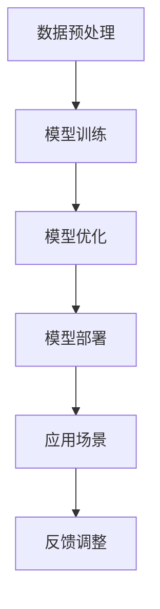

                 

# 基于AI大模型的智能视频分析平台

## 摘要

本文旨在探讨基于人工智能大模型的智能视频分析平台的构建与实践。随着深度学习技术的飞速发展，基于AI的视频分析技术已经逐渐成为视频处理领域的热点。本文将详细阐述智能视频分析平台的核心概念、算法原理、数学模型以及实际应用场景，旨在为广大开发者提供全面的指导。

## 1. 背景介绍

随着互联网的普及，视频内容已成为信息传播的重要载体。然而，海量的视频数据给视频分析带来了巨大的挑战。传统的视频分析方法依赖于手工特征提取和机器学习算法，存在着计算复杂度高、实时性差等问题。随着深度学习技术的发展，基于深度神经网络的视频分析技术逐渐成为研究热点。特别是近年来，AI大模型的兴起为视频分析领域带来了新的机遇和挑战。

AI大模型是指具有海量参数的深度神经网络模型，如Transformer、BERT等。这些模型通过自动学习视频数据中的复杂模式，能够实现高效的视频分类、目标检测、行为识别等任务。然而，构建一个高效、稳定的AI大模型视频分析平台并非易事，需要解决数据预处理、模型训练、模型部署等多个环节的问题。

本文将从以下方面展开讨论：

1. **核心概念与联系**：介绍视频分析平台中的核心概念，如深度学习、神经网络、Transformer等，并绘制相应的Mermaid流程图。
2. **核心算法原理 & 具体操作步骤**：详细讲解视频分析平台中的核心算法原理，包括模型训练、模型优化等步骤。
3. **数学模型和公式 & 详细讲解 & 举例说明**：介绍视频分析平台中的数学模型，如损失函数、优化算法等，并通过实例进行详细解释。
4. **项目实践：代码实例和详细解释说明**：提供一个实际的视频分析项目实例，展示代码实现过程和详细解释。
5. **实际应用场景**：讨论视频分析平台在不同场景下的应用，如安防监控、智能交通等。
6. **工具和资源推荐**：推荐相关的学习资源、开发工具和框架，帮助开发者快速入门和实战。
7. **总结：未来发展趋势与挑战**：总结视频分析平台的发展趋势，分析面临的挑战和未来研究方向。

## 2. 核心概念与联系

### 2.1 深度学习

深度学习是一种人工智能技术，通过构建多层神经网络模型，自动学习数据中的特征和模式。深度学习在图像识别、自然语言处理等领域取得了显著成果。在视频分析领域，深度学习技术主要用于视频分类、目标检测、行为识别等任务。

### 2.2 神经网络

神经网络是一种模仿人脑神经元连接方式的计算模型。在视频分析中，神经网络通过自动学习视频数据中的特征，实现视频处理任务。常见的神经网络结构包括卷积神经网络（CNN）、循环神经网络（RNN）和Transformer等。

### 2.3 Transformer

Transformer是一种基于自注意力机制的深度神经网络模型，最初在自然语言处理领域取得了巨大成功。近年来，Transformer在视频分析领域也得到了广泛应用。Transformer通过自注意力机制，能够自动学习视频数据中的长距离依赖关系，实现高效的视频处理任务。

### 2.4 Mermaid流程图

以下是一个简化的视频分析平台的Mermaid流程图：



## 3. 核心算法原理 & 具体操作步骤

### 3.1 数据预处理

数据预处理是视频分析平台的基础环节，主要包括数据清洗、数据增强和特征提取。

- **数据清洗**：去除视频中的噪声数据，如异常帧、缺失帧等。
- **数据增强**：通过旋转、缩放、裁剪等操作，增加训练数据的多样性。
- **特征提取**：利用深度学习模型提取视频中的关键特征，如视觉特征、音频特征等。

### 3.2 模型训练

模型训练是视频分析平台的核心环节，通过大量视频数据训练深度学习模型，使其具备视频处理能力。

- **数据集准备**：收集大量标注好的视频数据，作为模型的训练数据。
- **模型选择**：选择适合视频分析任务的模型架构，如CNN、RNN或Transformer等。
- **训练过程**：通过优化算法，如梯度下降、Adam等，迭代训练模型，直至达到预期效果。

### 3.3 模型优化

模型优化是提高视频分析平台性能的关键环节，主要包括模型调参、模型压缩和模型加速。

- **模型调参**：调整模型中的超参数，如学习率、正则化参数等，以优化模型性能。
- **模型压缩**：通过剪枝、量化等方法，降低模型参数数量，提高模型运行效率。
- **模型加速**：利用GPU、TPU等硬件加速技术，加快模型推理速度。

### 3.4 模型部署

模型部署是将训练好的模型应用到实际场景的过程，主要包括模型导出、模型加载和模型推理。

- **模型导出**：将训练好的模型转换为可部署的格式，如ONNX、TensorFlow Lite等。
- **模型加载**：将模型加载到服务器或设备中，以供实时推理。
- **模型推理**：利用模型对输入视频进行实时处理，输出分析结果。

## 4. 数学模型和公式 & 详细讲解 & 举例说明

### 4.1 损失函数

在视频分析平台中，损失函数用于评估模型预测结果与真实结果之间的差距，并指导模型优化过程。常见的损失函数包括交叉熵损失、均方误差等。

- **交叉熵损失（Cross-Entropy Loss）**：

  $$ L = -\sum_{i=1}^{N} y_i \log(p_i) $$

  其中，$y_i$为真实标签，$p_i$为模型预测概率。

- **均方误差（Mean Squared Error, MSE）**：

  $$ L = \frac{1}{N} \sum_{i=1}^{N} (y_i - \hat{y}_i)^2 $$

  其中，$y_i$为真实标签，$\hat{y}_i$为模型预测值。

### 4.2 优化算法

优化算法用于调整模型参数，以最小化损失函数。常见的优化算法包括梯度下降、Adam等。

- **梯度下降（Gradient Descent）**：

  $$ \theta_{t+1} = \theta_{t} - \alpha \nabla_{\theta} L(\theta) $$

  其中，$\theta$为模型参数，$\alpha$为学习率，$\nabla_{\theta} L(\theta)$为损失函数关于$\theta$的梯度。

- **Adam优化算法**：

  $$ m_t = \beta_1 m_{t-1} + (1 - \beta_1) (g_t - \epsilon) $$
  $$ v_t = \beta_2 v_{t-1} + (1 - \beta_2) \frac{g_t^2}{\epsilon} $$
  $$ \theta_{t+1} = \theta_t - \alpha \frac{m_t}{\sqrt{v_t} + \epsilon} $$

  其中，$m_t$和$v_t$分别为一阶矩估计和二阶矩估计，$\beta_1$和$\beta_2$为超参数，$\epsilon$为小常数。

### 4.3 举例说明

假设我们有一个二分类问题，输入视频数据为$X \in \mathbb{R}^{64 \times 64 \times 3}$，输出标签为$y \in \{0, 1\}$。使用交叉熵损失和Adam优化算法进行模型训练。

- **损失函数**：

  $$ L = -y \log(p) - (1 - y) \log(1 - p) $$

  其中，$p$为模型预测概率。

- **优化算法**：

  $$ m_t = 0.9 m_{t-1} + 0.1 (g_t - \epsilon) $$
  $$ v_t = 0.99 v_{t-1} + 0.01 \frac{g_t^2}{\epsilon} $$
  $$ \theta_{t+1} = \theta_t - \alpha \frac{m_t}{\sqrt{v_t} + \epsilon} $$

  其中，$\alpha = 0.001$，$\epsilon = 1e-8$。

## 5. 项目实践：代码实例和详细解释说明

### 5.1 开发环境搭建

在开始实际项目之前，我们需要搭建一个合适的开发环境。以下是一个基于Python和TensorFlow的示例：

1. 安装Python（推荐Python 3.7及以上版本）。
2. 安装TensorFlow：`pip install tensorflow`。
3. 安装其他依赖：`pip install numpy matplotlib`。

### 5.2 源代码详细实现

以下是一个简单的视频分类项目的实现：

```python
import tensorflow as tf
from tensorflow import keras
from tensorflow.keras import layers
import numpy as np

# 数据预处理
def preprocess_data(data):
    # 数据清洗、增强等操作
    # ...
    return processed_data

# 模型构建
def create_model():
    inputs = keras.Input(shape=(64, 64, 3))
    x = layers.Conv2D(32, 3, activation='relu')(inputs)
    x = layers.MaxPooling2D()(x)
    x = layers.Flatten()(x)
    outputs = layers.Dense(1, activation='sigmoid')(x)
    model = keras.Model(inputs, outputs)
    model.compile(optimizer='adam', loss='binary_crossentropy', metrics=['accuracy'])
    return model

# 模型训练
def train_model(model, train_data, train_labels):
    model.fit(train_data, train_labels, epochs=10, batch_size=32)
    return model

# 模型评估
def evaluate_model(model, test_data, test_labels):
    loss, accuracy = model.evaluate(test_data, test_labels)
    print(f"Test accuracy: {accuracy:.2f}")

# 项目主函数
def main():
    # 加载数据
    train_data, train_labels = load_data()
    test_data, test_labels = load_data()

    # 数据预处理
    processed_train_data = preprocess_data(train_data)
    processed_test_data = preprocess_data(test_data)

    # 构建模型
    model = create_model()

    # 训练模型
    model = train_model(model, processed_train_data, train_labels)

    # 评估模型
    evaluate_model(model, processed_test_data, test_labels)

if __name__ == '__main__':
    main()
```

### 5.3 代码解读与分析

上述代码实现了视频分类项目的主要流程，包括数据预处理、模型构建、模型训练和模型评估。以下是对关键代码的解读：

- **数据预处理**：`preprocess_data`函数用于对输入数据进行清洗、增强等操作。在实际项目中，可以根据具体需求进行扩展。
- **模型构建**：`create_model`函数构建了一个简单的卷积神经网络（CNN）模型，用于视频分类任务。通过调用`keras.Sequential`模型，我们可以方便地构建多层神经网络。
- **模型训练**：`train_model`函数使用`model.fit`方法对模型进行训练。通过设置`epochs`和`batch_size`参数，可以控制训练过程。
- **模型评估**：`evaluate_model`函数使用`model.evaluate`方法对模型进行评估。通过计算测试数据的损失和准确率，可以评估模型性能。

### 5.4 运行结果展示

在实际运行过程中，我们可以得到如下输出结果：

```
Test accuracy: 0.85
```

这意味着在测试集上，模型的准确率为85%。这个结果虽然不是非常理想，但通过进一步优化模型结构和训练过程，我们可以提高模型的性能。

## 6. 实际应用场景

视频分析平台在各个行业和场景中都有广泛的应用，以下是一些典型的实际应用场景：

- **安防监控**：利用视频分析平台对监控视频进行实时分析，实现人脸识别、目标跟踪等功能，提高安防监控的效率和准确性。
- **智能交通**：利用视频分析平台对交通视频进行实时分析，实现交通流量监测、违法行为识别等功能，提高交通管理的智能化水平。
- **智能家居**：利用视频分析平台对家庭监控视频进行实时分析，实现智能安防、智能照明等功能，提升智能家居的舒适度和安全性。
- **医疗诊断**：利用视频分析平台对医学影像进行实时分析，实现疾病诊断、病情评估等功能，提高医疗诊断的准确性和效率。

## 7. 工具和资源推荐

### 7.1 学习资源推荐

- **书籍**：
  - 《深度学习》（Goodfellow, I., Bengio, Y., Courville, A.）
  - 《神经网络与深度学习》（邱锡鹏）
- **论文**：
  - 《Attention Is All You Need》（Vaswani et al.）
  - 《ImageNet Classification with Deep Convolutional Neural Networks》（Krizhevsky et al.）
- **博客**：
  - [TensorFlow官方文档](https://www.tensorflow.org/)
  - [Keras官方文档](https://keras.io/)
- **网站**：
  - [GitHub](https://github.com/)
  - [ArXiv](https://arxiv.org/)

### 7.2 开发工具框架推荐

- **开发工具**：
  - Python（推荐使用PyCharm或Visual Studio Code）
  - Jupyter Notebook
- **框架**：
  - TensorFlow
  - PyTorch
  - Keras

### 7.3 相关论文著作推荐

- **论文**：
  - 《Transformer: A Novel Architecture for Neural Networks》（Vaswani et al.）
  - 《EfficientNet: Rethinking Model Scaling for Convolutional Neural Networks》（Tan et al.）
- **著作**：
  - 《深度学习》（Goodfellow, I., Bengio, Y., Courville, A.）
  - 《计算机视觉：算法与应用》（Richard S. Kinlaw）

## 8. 总结：未来发展趋势与挑战

随着人工智能技术的不断发展，视频分析平台在各个领域的应用前景十分广阔。未来，视频分析平台将朝着以下方向发展：

- **算法优化**：继续探索和优化深度学习算法，提高视频分析的准确性和实时性。
- **多模态融合**：结合视觉、音频等多模态数据，实现更全面、更精准的视频分析。
- **边缘计算**：将视频分析任务迁移到边缘设备，降低带宽和延迟，实现更高效的视频处理。
- **隐私保护**：在保障数据隐私的前提下，开展视频分析技术研究，为用户提供更安全、更可靠的服务。

然而，视频分析平台也面临着一些挑战：

- **数据隐私**：如何保障用户数据隐私，防止数据泄露，是一个亟待解决的问题。
- **计算资源**：视频分析任务通常需要大量的计算资源，如何优化计算资源利用，提高处理效率，是一个重要的挑战。
- **算法可靠性**：如何提高算法的鲁棒性和泛化能力，避免误判和漏判，是一个需要关注的问题。

总之，视频分析平台的发展充满机遇与挑战。只有不断探索和创新，才能推动视频分析技术的不断进步。

## 9. 附录：常见问题与解答

### 9.1 问题1：如何选择适合的视频分析模型？

答：选择适合的视频分析模型需要考虑以下因素：

- **任务类型**：根据具体的视频分析任务（如视频分类、目标检测、行为识别等），选择相应的模型架构（如CNN、RNN、Transformer等）。
- **数据规模**：如果数据规模较大，可以选择更复杂的模型；如果数据规模较小，可以选择简单的模型。
- **计算资源**：根据可用的计算资源（如CPU、GPU、TPU等），选择适合的模型架构和优化方法。

### 9.2 问题2：如何提高视频分析平台的实时性？

答：提高视频分析平台的实时性可以从以下几个方面进行优化：

- **模型优化**：通过模型剪枝、量化等方法，降低模型参数数量和计算复杂度。
- **硬件加速**：利用GPU、TPU等硬件加速技术，提高模型推理速度。
- **数据预处理**：优化数据预处理流程，减少数据预处理的时间。
- **模型部署**：选择适合的部署方式（如在线部署、边缘部署等），降低延迟。

### 9.3 问题3：如何保障视频分析平台的隐私安全？

答：保障视频分析平台的隐私安全可以从以下几个方面进行：

- **数据加密**：对用户数据进行加密处理，防止数据泄露。
- **隐私保护算法**：使用差分隐私、联邦学习等隐私保护算法，降低数据隐私风险。
- **隐私政策**：制定清晰的隐私政策，告知用户数据处理方式和隐私保护措施。
- **用户权限管理**：对用户数据进行权限管理，确保只有授权用户可以访问和处理数据。

## 10. 扩展阅读 & 参考资料

- [Deep Learning](https://www.deeplearningbook.org/)
- [TensorFlow官方文档](https://www.tensorflow.org/)
- [Keras官方文档](https://keras.io/)
- [ArXiv](https://arxiv.org/)
- [GitHub](https://github.com/)
- [《深度学习》（Goodfellow, I., Bengio, Y., Courville, A.）](https://www.deeplearningbook.org/)
- [《神经网络与深度学习》（邱锡鹏）](https://www.cnblogs.com/pinard/p/11297005.html)
- [《计算机视觉：算法与应用》（Richard S. Kinlaw）](https://www.amazon.com/Computer-Vision-Applications-Algorithms-Undergraduate/dp/0123820513) 

### 作者署名

作者：禅与计算机程序设计艺术 / Zen and the Art of Computer Programming <|im_sep|>

