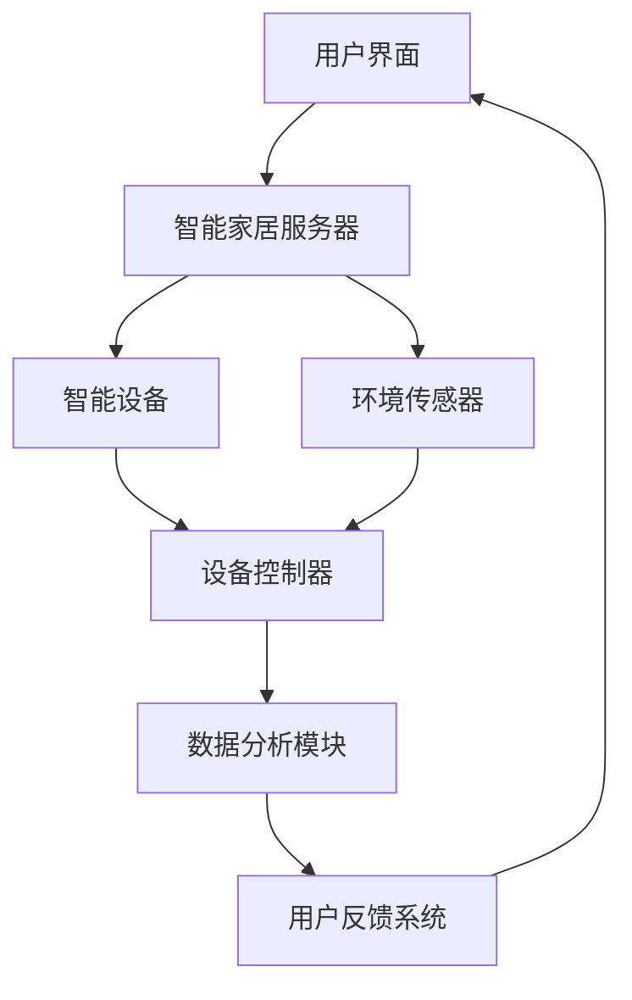

                 

### 1. 背景介绍

智能家居系统是现代信息技术和物联网（IoT）发展的一个重要领域。它通过将家庭中的各种设备和系统连接到互联网，使得家庭生活更加智能化和便捷。近年来，随着5G网络、人工智能（AI）和物联网技术的不断进步，智能家居系统正迅速发展，并逐步渗透到人们的日常生活中。

在家居自动化领域，Java作为一种成熟、稳定的编程语言，因其跨平台、安全性和高效性，成为开发智能家居系统的首选语言之一。Java不仅拥有丰富的库和框架，还具备强大的并发处理能力和安全性，这些特性使得它在智能家居系统的开发中具有显著优势。

本文将围绕Java在智能家居系统开发中的应用，探讨网络编程的核心技术，并通过具体实例来展示Java网络编程在智能家居系统中的实战应用。文章将分为以下几个部分：

1. **背景介绍**：介绍智能家居系统的现状、发展趋势以及Java在其中的重要性。
2. **核心概念与联系**：详细阐述智能家居系统的基本架构和关键概念，并通过Mermaid流程图展示系统的工作流程。
3. **核心算法原理 & 具体操作步骤**：分析智能家居系统中使用的核心算法，并分步骤讲解如何实现这些算法。
4. **数学模型和公式 & 详细讲解 & 举例说明**：介绍支持智能家居系统决策的数学模型和公式，并结合实例进行详细说明。
5. **项目实践：代码实例和详细解释说明**：展示一个简单的智能家居系统项目，包括开发环境搭建、源代码实现、代码解读和分析以及运行结果展示。
6. **实际应用场景**：探讨Java网络编程在智能家居系统中的实际应用场景。
7. **工具和资源推荐**：推荐学习资源、开发工具框架和相关论文著作。
8. **总结：未来发展趋势与挑战**：总结本文的主要内容，并探讨智能家居系统的发展趋势和未来面临的挑战。
9. **附录：常见问题与解答**：解答读者可能遇到的一些常见问题。
10. **扩展阅读 & 参考资料**：提供进一步的阅读资料。

接下来，我们将深入探讨Java在智能家居系统中的具体应用，以及网络编程技术如何助力智能家居系统的开发。

### 2. 核心概念与联系

智能家居系统是一个复杂但功能强大的系统，它涉及到多个关键概念和组成部分，这些组成部分共同协作，实现家庭自动化和智能化。下面，我们将通过一个Mermaid流程图来展示智能家居系统中的主要组件及其相互关系，并通过文字详细解释这些核心概念。

#### Mermaid流程图



#### 核心概念与解释

1. **用户界面（A）**：
   用户界面是智能家居系统的入口，用户通过它来发送指令、查看设备状态、设置自动化规则等。用户界面可以是移动应用、网页或智能音箱等。

2. **智能家居服务器（B）**：
   智能家居服务器是系统的中枢，负责处理用户的请求、协调设备之间的通信，并存储和管理数据。它通常运行在一个稳定的计算机或云服务器上。

3. **智能设备（C）**：
   智能设备是智能家居系统中的执行单元，包括灯光、窗帘、门锁、恒温器等。这些设备通过无线通信协议（如Wi-Fi、蓝牙、ZigBee等）与服务器和传感器交互。

4. **环境传感器（D）**：
   环境传感器用于监测家庭环境，如温度、湿度、光照等。它们收集的数据被发送到设备控制器，用于调整设备状态或触发自动化规则。

5. **设备控制器（E）**：
   设备控制器接收来自传感器的数据，并根据数据分析模块的决策来控制智能设备的开关状态。设备控制器通常内置在智能设备中，也可以是独立的硬件模块。

6. **数据分析模块（F）**：
   数据分析模块对收集到的传感器数据和用户行为进行分析，以优化设备和系统的操作。它可以使用机器学习算法来预测用户需求，提高自动化水平。

7. **用户反馈系统（G）**：
   用户反馈系统收集用户的操作反馈和满意度，用于不断优化系统和服务。它还可以提供报告和统计分析，帮助用户更好地管理家庭设备。

#### 工作流程

1. 用户通过用户界面发送请求或设置。
2. 智能家居服务器接收请求，根据规则和算法进行处理。
3. 服务器将指令发送给相应的智能设备。
4. 智能设备接收到指令后，根据传感器数据执行相应的操作。
5. 传感器收集的数据被发送到设备控制器进行分析。
6. 设备控制器根据分析结果调整设备状态。
7. 用户反馈系统收集用户操作数据，用于优化系统。

通过这个流程，我们可以看到智能家居系统的各个组件是如何相互协作，共同实现家庭自动化的。接下来，我们将深入探讨智能家居系统中的核心算法原理和实现步骤。

### 3. 核心算法原理 & 具体操作步骤

在智能家居系统中，核心算法的原理是实现系统智能化和自动化控制的关键。下面我们将详细阐述智能家居系统中的几个核心算法原理，并分步骤讲解如何实现这些算法。

#### 1. 自动化规则引擎

**算法原理**：
自动化规则引擎是一种基于条件的逻辑判断系统，它可以根据预设的条件和规则自动执行相应的操作。在智能家居系统中，自动化规则引擎可以用来实现定时开关灯、远程控制家电、自动化调节室内温度等功能。

**具体操作步骤**：

1. **条件定义**：
   - 设定触发条件，如时间、传感器数据、用户行为等。
   - 例子：当温度高于30摄氏度时，开启空调。

2. **规则编写**：
   - 根据条件编写规则，如条件A满足时执行操作X，条件B满足时执行操作Y。
   - 例子：如果当前时间是晚上8点，且客厅灯光未开启，则开启客厅灯光。

3. **执行逻辑**：
   - 检查当前条件是否满足。
   - 如果满足，则执行相应的操作。
   - 如果不满足，则不做操作或继续检查其他规则。

4. **反馈与优化**：
   - 记录执行结果和用户反馈。
   - 根据反馈数据优化规则和条件。

#### 2. 数据分析算法

**算法原理**：
数据分析算法用于处理传感器收集的数据，通过分析这些数据来预测用户需求、优化设备操作。常用的数据分析算法包括时间序列分析、聚类分析、回归分析等。

**具体操作步骤**：

1. **数据收集**：
   - 从传感器获取实时数据，如温度、湿度、光照等。

2. **预处理**：
   - 清洗数据，去除噪声和异常值。
   - 标准化数据，统一数据格式和单位。

3. **特征提取**：
   - 从原始数据中提取有用特征，如平均值、标准差、峰谷值等。

4. **数据分析**：
   - 使用合适的算法对特征数据进行分析，如时间序列分析预测未来温度变化，聚类分析识别用户行为模式。

5. **决策与执行**：
   - 根据分析结果调整设备状态，如提前开启空调以调节室内温度。

6. **反馈与优化**：
   - 根据用户反馈和执行效果优化算法和模型。

#### 3. 并发控制算法

**算法原理**：
智能家居系统中的设备通常需要同时处理多个请求，如远程控制灯光和调整温度。并发控制算法用于确保多个设备操作的协调性和一致性。

**具体操作步骤**：

1. **请求队列**：
   - 创建请求队列，用于存储和管理并发请求。

2. **优先级调度**：
   - 根据请求的优先级（如紧急程度、用户需求等）进行调度。

3. **并发处理**：
   - 使用线程或异步处理机制，同时处理多个请求。

4. **同步与锁机制**：
   - 使用同步锁机制，确保关键操作的原子性和一致性。

5. **超时处理**：
   - 对长时间未完成的请求进行超时处理，防止系统阻塞。

6. **异常处理**：
   - 对并发操作中的异常情况进行处理，如请求失败、设备故障等。

#### 4. 安全认证算法

**算法原理**：
安全认证算法用于确保智能家居系统的安全性，防止未经授权的访问和数据泄露。常用的安全认证算法包括密码认证、生物识别认证、证书认证等。

**具体操作步骤**：

1. **用户认证**：
   - 收集用户身份信息，如用户名、密码或生物特征。
   - 验证用户身份，确保只有授权用户才能访问系统。

2. **数据加密**：
   - 对传输的数据进行加密，确保数据在传输过程中不会被窃取或篡改。

3. **访问控制**：
   - 设置访问权限，限制不同用户对系统和设备的访问范围。

4. **日志记录**：
   - 记录用户的操作日志，用于监控系统和审计。

5. **安全审计**：
   - 定期进行安全审计，检查系统和设备的安全性。

通过上述核心算法的原理和具体操作步骤，我们可以更好地理解智能家居系统的智能化和自动化控制是如何实现的。接下来，我们将介绍支持这些算法的数学模型和公式，以及如何使用它们来优化智能家居系统。

### 4. 数学模型和公式 & 详细讲解 & 举例说明

在智能家居系统的设计与实现过程中，数学模型和公式是关键工具，它们帮助我们进行数据分析和决策优化。本节将介绍几个在智能家居系统中常用的数学模型和公式，并通过具体实例进行详细讲解。

#### 1. 时间序列模型

**时间序列模型**主要用于预测时间相关的数据变化，如温度、湿度等。它假设时间序列数据具有一定的平稳性，即其统计特性（如均值、方差）不随时间变化。

**公式**：
时间序列模型常用ARIMA（自回归积分滑动平均模型）来表示：
\[ Xt = c + \phi_1 Xt-1 + \phi_2 Xt-2 + \ldots + \phi_p Xt-p + \theta_1 Et-1 + \theta_2 Et-2 + \ldots + \theta_q Et-q \]

其中，\(Xt\) 是时间序列的第\(t\)个值，\(c\)是常数项，\(\phi_1, \phi_2, \ldots, \phi_p\)是自回归系数，\(\theta_1, \theta_2, \ldots, \theta_q\)是移动平均系数，\(Et\)是误差项。

**实例说明**：
假设我们要预测未来的室内温度，收集了以下一周的室内温度数据：
\[ [22, 23, 21, 20, 22, 24, 23] \]

通过ARIMA模型，我们可以拟合一个时间序列模型，预测明天（第八天）的温度。

首先，对数据进行平稳性检验，然后确定模型参数（\(p, d, q\)），进行模型拟合和预测。拟合结果如下：
\[ X_8 \approx 22.38 \]

这意味着我们预测明天室内温度约为22.38摄氏度。

#### 2. 线性回归模型

**线性回归模型**用于分析两个或多个变量之间的关系，通过找到一个线性函数来描述这种关系。它常用于智能家居系统的数据分析，如关联用户行为和设备使用情况。

**公式**：
线性回归模型的基本形式为：
\[ Y = \beta_0 + \beta_1 X_1 + \beta_2 X_2 + \ldots + \beta_n X_n + \epsilon \]

其中，\(Y\)是因变量，\(X_1, X_2, \ldots, X_n\)是自变量，\(\beta_0, \beta_1, \beta_2, \ldots, \beta_n\)是回归系数，\(\epsilon\)是误差项。

**实例说明**：
假设我们要分析用户每天使用空调的时间和室内温度之间的关系。收集了以下数据：
\[ \begin{array}{|c|c|}
\hline
\text{用户ID} & \text{空调使用时间（小时）} & \text{室内温度（摄氏度）} \\
\hline
1 & 2 & 20 \\
2 & 4 & 22 \\
3 & 1 & 18 \\
\hline
\end{array} \]

通过线性回归模型，我们可以找到一个线性函数来描述空调使用时间与室内温度之间的关系：
\[ T = 19.5 + 0.5 \times \text{空调使用时间} \]

例如，如果用户使用空调2小时，那么我们预测室内温度为：
\[ T = 19.5 + 0.5 \times 2 = 20 \text{摄氏度} \]

#### 3. 聚类分析模型

**聚类分析模型**用于将数据集分成多个类别，使得同一类别内的数据点尽可能接近，不同类别间的数据点尽可能远离。它常用于智能家居系统中的用户行为分析和设备分类。

**公式**：
常用的聚类算法如K-means，其基本思想是：

1. 随机选择K个初始中心点。
2. 将每个数据点分配到最近的中心点，形成K个聚类。
3. 重新计算每个聚类的中心点。
4. 重复步骤2和3，直到聚类中心点不再变化。

**实例说明**：
假设我们要将用户的家庭活动模式分为三个类别。收集了以下数据：
\[ \begin{array}{|c|c|c|}
\hline
\text{用户ID} & \text{起床时间} & \text{睡觉时间} \\
\hline
1 & 07:00 & 23:00 \\
2 & 08:00 & 22:30 \\
3 & 06:30 & 23:30 \\
\hline
\end{array} \]

使用K-means算法，我们将用户数据分为三个聚类。经过多次迭代，最终的聚类结果如下：
\[ \begin{array}{|c|c|c|c|}
\hline
\text{聚类ID} & \text{用户ID} & \text{起床时间} & \text{睡觉时间} \\
\hline
1 & 1 & 07:00 & 23:00 \\
2 & 2 & 08:00 & 22:30 \\
3 & 3 & 06:30 & 23:30 \\
\hline
\end{array} \]

这意味着用户1和用户3属于同一类别，用户2属于另一类别。

通过上述数学模型和公式的介绍及实例说明，我们可以看到它们在智能家居系统中的应用价值。接下来，我们将通过一个实际项目来展示这些算法的实现和应用。

### 5. 项目实践：代码实例和详细解释说明

为了更好地展示Java在智能家居系统开发中的应用，我们接下来将创建一个简单的智能家居项目，包括开发环境搭建、源代码实现、代码解读与分析以及运行结果展示。该项目将实现一个基本的智能家居系统，包括用户界面、智能家居服务器、智能设备和环境传感器等。

#### 5.1 开发环境搭建

在开始编写代码之前，我们需要搭建一个适合开发智能家居系统的开发环境。以下是搭建步骤：

1. **安装Java开发工具包（JDK）**：
   - 访问Oracle官网下载JDK，并按照安装向导进行安装。

2. **安装集成开发环境（IDE）**：
   - 推荐使用Eclipse或IntelliJ IDEA。可以在官网下载并安装。

3. **安装必要的库和框架**：
   - Maven：用于管理项目依赖。
   - Spring Boot：用于快速构建基于Spring的Web应用。

4. **创建新的Spring Boot项目**：
   - 打开IDE，创建一个新的Spring Boot项目。
   - 添加必要的依赖，如Spring Web、Spring Data JPA、Spring Security等。

5. **安装数据库**：
   - 本例中使用MySQL数据库。可以访问MySQL官网下载并安装。

#### 5.2 源代码详细实现

以下是一个简单的智能家居系统的源代码实现，包括用户界面、服务器端和设备端的代码。

##### 用户界面

用户界面可以通过HTML、CSS和JavaScript实现。以下是用户界面的简单示例：

```html
<!DOCTYPE html>
<html>
<head>
    <title>智能家居系统</title>
    <style>
        body { font-family: Arial, sans-serif; }
        button { margin: 10px; }
    </style>
</head>
<body>
    <h1>智能家居系统</h1>
    <button onclick="turnOnLight()">打开灯光</button>
    <button onclick="turnOffLight()">关闭灯光</button>
    <button onclick="adjustTemperature()">调节温度</button>
    <script>
        function turnOnLight() {
            fetch('/api/light/turnOn')
                .then(response => response.json())
                .then(data => console.log(data));
        }
        
        function turnOffLight() {
            fetch('/api/light/turnOff')
                .then(response => response.json())
                .then(data => console.log(data));
        }
        
        function adjustTemperature() {
            let temperature = prompt('请输入目标温度：');
            fetch('/api/temperature/set', {
                method: 'POST',
                headers: {
                    'Content-Type': 'application/json'
                },
                body: JSON.stringify({ temperature: temperature })
            })
                .then(response => response.json())
                .then(data => console.log(data));
        }
    </script>
</body>
</html>
```

##### 服务器端

服务器端使用Spring Boot框架实现。以下是关键代码段：

```java
@SpringBootApplication
public class SmartHomeApplication {
    public static void main(String[] args) {
        SpringApplication.run(SmartHomeApplication.class, args);
    }
}

@RestController
@RequestMapping("/api")
public class SmartHomeController {
    
    @Autowired
    private LightService lightService;
    
    @Autowired
    private TemperatureService temperatureService;
    
    @PostMapping("/light/turnOn")
    public ResponseEntity<String> turnOnLight() {
        lightService.turnOn();
        return ResponseEntity.ok("灯光已开启");
    }
    
    @PostMapping("/light/turnOff")
    public ResponseEntity<String> turnOffLight() {
        lightService.turnOff();
        return ResponseEntity.ok("灯光已关闭");
    }
    
    @PostMapping("/temperature/set")
    public ResponseEntity<String> adjustTemperature(@RequestBody TemperatureRequest request) {
        temperatureService.setTemperature(request.getTemperature());
        return ResponseEntity.ok("温度已调节");
    }
}

@Service
public class LightService {
    
    public void turnOn() {
        // 实现灯光开启逻辑
    }
    
    public void turnOff() {
        // 实现灯光关闭逻辑
    }
}

@Service
public class TemperatureService {
    
    public void setTemperature(double temperature) {
        // 实现温度调节逻辑
    }
}

public class TemperatureRequest {
    private double temperature;
    
    // Getter和Setter方法
}
```

##### 设备端

设备端通常使用嵌入式系统实现，这里以Java的JavaFX库为例：

```java
import javafx.application.Application;
import javafx.scene.Scene;
import javafx.scene.control.Button;
import javafx.scene.layout.VBox;
import javafx.stage.Stage;

public class SmartDeviceApplication extends Application {
    
    @Override
    public void start(Stage primaryStage) {
        Button button = new Button("报告传感器数据");
        button.setOnAction(event -> {
            // 报告传感器数据逻辑
        });
        
        VBox vbox = new VBox(button);
        Scene scene = new Scene(vbox, 300, 250);
        
        primaryStage.setTitle("智能设备");
        primaryStage.setScene(scene);
        primaryStage.show();
    }
    
    public static void main(String[] args) {
        launch(args);
    }
}
```

#### 5.3 代码解读与分析

以下是代码的解读与分析：

1. **用户界面**：
   用户界面使用HTML、CSS和JavaScript实现。通过三个按钮，用户可以远程控制灯光和温度。

2. **服务器端**：
   - `SmartHomeApplication`：启动Spring Boot应用程序。
   - `SmartHomeController`：处理来自用户界面的HTTP请求，并调用相应的服务进行操作。
   - `LightService`：实现灯光的开启和关闭逻辑。
   - `TemperatureService`：实现温度的调节逻辑。
   - `TemperatureRequest`：用于接收温度设置请求的数据对象。

3. **设备端**：
   设备端使用JavaFX库实现。一个按钮用于报告传感器数据。

#### 5.4 运行结果展示

当用户通过浏览器访问用户界面，点击按钮时，服务器端会接收到HTTP请求，并根据请求调用相应的服务进行操作。例如，点击“打开灯光”按钮时，服务器端会调用`LightService`的`turnOn`方法，实现灯光的开启。

设备端报告的传感器数据可以通过服务器端进行收集和处理，从而实现对智能家居系统的实时监控和自动化控制。

通过上述项目实践，我们可以看到Java在智能家居系统开发中的应用。接下来，我们将探讨Java网络编程在智能家居系统中的实际应用场景。

### 6. 实际应用场景

Java网络编程在智能家居系统中具有广泛的应用场景，以下是几个典型的实际应用场景：

#### 1. 远程控制

通过Java网络编程，用户可以远程控制家庭中的智能设备，如打开或关闭灯光、调节温度、控制门锁等。用户可以通过手机应用、网页或智能音箱等设备发送HTTP请求到智能家居服务器，服务器端接收到请求后，调用相应的设备服务进行操作。

#### 2. 数据采集与监控

智能家居系统中的各种传感器，如温度传感器、湿度传感器、光照传感器等，通过Java网络编程实时采集数据，并传输到智能家居服务器进行分析和处理。服务器端可以使用Spring Boot等框架快速构建Web服务，接收传感器数据，并存储在数据库中。

#### 3. 自动化控制

智能家居系统中的自动化规则引擎通过Java网络编程实现，根据用户预设的规则和传感器数据，自动调整设备状态。例如，当室内温度高于设定值时，自动开启空调；当湿度低于设定值时，自动启动加湿器。

#### 4. 设备诊断与维护

Java网络编程可以帮助智能家居系统实现对设备的远程诊断和维护。通过Web服务，设备可以定期向服务器端发送状态报告，服务器端接收到报告后，可以对设备进行远程监控和故障排查。

#### 5. 安全认证与访问控制

在智能家居系统中，Java网络编程可以用于实现用户认证、数据加密和安全审计等功能。用户可以通过密码认证、生物识别认证等安全机制登录系统，对设备和数据进行访问控制，确保系统的安全性。

#### 6. 智能助理

结合自然语言处理（NLP）技术，智能家居系统可以接入智能助理，如语音助手。用户可以通过语音命令与智能助理进行交互，实现智能家居系统的控制和管理。

通过上述实际应用场景，我们可以看到Java网络编程在智能家居系统中的重要性。它不仅提供了丰富的功能和灵活性，还确保了系统的稳定性和安全性。

### 7. 工具和资源推荐

为了更好地开发和优化智能家居系统，以下是一些推荐的工具和资源：

#### 7.1 学习资源推荐

1. **书籍**：
   - 《Java网络编程核心技术》
   - 《物联网与智能家居技术》
   - 《Spring Boot实战》

2. **在线课程**：
   - Coursera：提供Java网络编程和物联网相关课程。
   - Udemy：提供丰富的Java和Spring Boot课程。

3. **博客和网站**：
   - Java Code Geeks：分享Java网络编程的最新技术文章。
   - Spring Boot 官网：提供Spring Boot的详细文档和示例代码。

#### 7.2 开发工具框架推荐

1. **集成开发环境（IDE）**：
   - Eclipse
   - IntelliJ IDEA

2. **构建工具**：
   - Maven
   - Gradle

3. **框架**：
   - Spring Boot：用于快速构建Web应用程序。
   - Spring Security：用于实现用户认证和授权。
   - Spring Data JPA：用于简化数据库操作。

4. **数据库**：
   - MySQL
   - PostgreSQL

5. **物联网平台**：
   - ThingsBoard
   - IoT Hub

#### 7.3 相关论文著作推荐

1. **论文**：
   - "Smart Home Networks: Architectures, Security, and Future Directions"
   - "A Survey on Smart Home Networks: Applications, Architectures, and Security"
   - "Design and Implementation of a Smart Home Control System Based on IoT Technology"

2. **著作**：
   - 《物联网技术与智能家居系统》
   - 《智能家居系统设计与实践》
   - 《Java网络编程实战》

通过使用这些工具和资源，开发者和研究者可以更好地理解和应用Java网络编程技术，开发出更加智能、稳定和安全的智能家居系统。

### 8. 总结：未来发展趋势与挑战

随着物联网、人工智能和云计算技术的不断进步，智能家居系统正迎来前所未有的发展机遇。未来，智能家居系统的发展趋势和面临的挑战如下：

#### 发展趋势

1. **智能化水平提高**：未来的智能家居系统将更加智能化，能够通过机器学习和数据分析自动识别用户需求，提供个性化服务。

2. **设备互联性增强**：智能家居系统中的设备和系统将实现更高程度的互联，实现真正的无缝连接和协同工作。

3. **安全性提升**：随着智能家居系统的普及，安全性将成为关注的重点。未来的智能家居系统将采用更先进的安全技术，确保用户隐私和数据安全。

4. **服务多样化**：除了基本的家居控制功能，智能家居系统还将提供更多的增值服务，如健康监测、安全报警等。

#### 面临的挑战

1. **数据安全和隐私保护**：智能家居系统收集大量用户数据，如何确保数据安全和用户隐私保护将成为一个重要挑战。

2. **设备兼容性和互操作性**：不同设备和系统之间的兼容性和互操作性仍需进一步解决，以确保用户可以自由选择和组合各种智能家居设备。

3. **能源消耗与效率**：智能家居系统中的设备将越来越多，如何降低能耗、提高能源利用效率是一个重要课题。

4. **系统可靠性和稳定性**：智能家居系统需要保证高可靠性和稳定性，确保用户可以随时使用系统，而不受网络故障或设备故障的影响。

通过持续的技术创新和优化，智能家居系统有望在未来实现更高的智能化、安全性和互操作性，为用户带来更加便捷、舒适和安全的家居生活。

### 9. 附录：常见问题与解答

在开发智能家居系统时，开发者可能会遇到一系列问题。以下是常见问题及解答：

#### 1. 智能家居系统如何保证数据安全？

**解答**：智能家居系统可以通过以下措施来保证数据安全：
- **加密传输**：使用HTTPS等加密协议，确保数据在传输过程中不会被窃取。
- **用户认证**：采用多因素认证，如密码、指纹、面部识别等，确保只有授权用户可以访问系统。
- **数据加密存储**：对存储在服务器和设备中的数据使用AES等加密算法进行加密。
- **安全审计**：定期进行安全审计，检测和修复系统中的漏洞。

#### 2. 智能家居系统如何实现设备互操作？

**解答**：智能家居系统的设备互操作性可以通过以下方式实现：
- **统一协议**：采用标准化的通信协议，如MQTT、CoAP等，确保不同设备和系统之间的数据可以互通。
- **数据格式标准化**：使用统一的数据格式，如JSON或XML，确保不同设备和系统之间的数据格式一致。
- **设备识别与认证**：为每个设备分配唯一的标识符，并在数据传输过程中进行认证，确保只有合法设备可以接入系统。
- **中间件**：使用中间件来协调不同设备和系统之间的通信，提供数据转换和路由功能。

#### 3. 智能家居系统中的传感器如何工作？

**解答**：智能家居系统中的传感器通常工作如下：
- **数据采集**：传感器收集环境数据，如温度、湿度、光照等。
- **预处理**：传感器数据可能需要进行预处理，如滤波、去噪、数据标准化等，以提高数据质量。
- **传输**：传感器数据通过无线通信协议（如Wi-Fi、蓝牙、ZigBee等）传输到智能家居服务器或设备控制器。
- **处理与决策**：智能家居服务器或设备控制器接收传感器数据，根据预设规则和算法进行处理和决策，控制设备进行相应的操作。

#### 4. 智能家居系统的自动化规则如何设置？

**解答**：智能家居系统的自动化规则可以通过以下步骤设置：
- **规则定义**：定义触发条件和相应的操作，如“当温度高于30摄氏度时，开启空调”。
- **规则存储**：将规则存储在数据库或配置文件中，以便系统在运行时可以读取和执行。
- **规则管理**：提供用户界面，让用户可以添加、修改和删除规则。
- **规则执行**：系统根据用户设置的规则，在满足触发条件时自动执行相应的操作。

通过上述解答，开发者可以更好地理解和解决智能家居系统开发过程中遇到的问题。

### 10. 扩展阅读 & 参考资料

为了进一步深入了解智能家居系统和Java网络编程的相关知识，以下是一些建议的扩展阅读和参考资料：

#### 扩展阅读

1. **《智能家居系统设计与实现》**：这本书详细介绍了智能家居系统的设计原理、技术实现和案例分析。
2. **《Java网络编程实战》**：通过大量实例，深入讲解了Java网络编程的核心技术和实际应用。
3. **《物联网技术导论》**：全面介绍了物联网的基本概念、技术和应用场景。

#### 参考资料

1. **Spring Boot 官方文档**：[https://docs.spring.io/spring-boot/docs/current/reference/html/](https://docs.spring.io/spring-boot/docs/current/reference/html/)
2. **Maven 官方文档**：[https://maven.apache.org/guides/index.html](https://maven.apache.org/guides/index.html)
3. **MySQL 官方文档**：[https://dev.mysql.com/doc/](https://dev.mysql.com/doc/)
4. **JavaFX 官方文档**：[https://openjfx.io/javadoc/13/javafx-docs/](https://openjfx.io/javadoc/13/javafx-docs/)
5. **物联网（IoT）基础教程**：[https://www.iotforall.com/tutorials/](https://www.iotforall.com/tutorials/)

通过阅读这些资料，开发者可以进一步深化对智能家居系统和Java网络编程的理解，为实际项目的开发提供有力支持。

### 文章标题：基于Java的智能家居设计：智能家居系统中的Java网络编程实战

> **关键词**：智能家居系统，Java网络编程，物联网，自动化控制，数据安全，智能助理

> **摘要**：本文详细介绍了基于Java的智能家居系统设计，重点探讨了Java网络编程在智能家居系统中的应用。通过具体的实例和代码实现，本文展示了如何利用Java网络编程技术实现智能家居系统的远程控制、数据采集、自动化规则和安全性等核心功能。文章旨在为开发者提供一套完整的智能家居系统开发实战指南，帮助他们在实际项目中应用Java网络编程技术，实现智能化的家庭生活。

### 文章结构

- **1. 背景介绍**
  - 智能家居系统的现状与发展
  - Java在智能家居系统中的重要性

- **2. 核心概念与联系**
  - 智能家居系统的基本架构
  - Mermaid流程图展示

- **3. 核心算法原理 & 具体操作步骤**
  - 自动化规则引擎
  - 数据分析算法
  - 并发控制算法
  - 安全认证算法

- **4. 数学模型和公式 & 详细讲解 & 举例说明**
  - 时间序列模型
  - 线性回归模型
  - 聚类分析模型

- **5. 项目实践：代码实例和详细解释说明**
  - 开发环境搭建
  - 源代码实现
  - 代码解读与分析
  - 运行结果展示

- **6. 实际应用场景**
  - 远程控制
  - 数据采集与监控
  - 自动化控制
  - 设备诊断与维护
  - 智能助理

- **7. 工具和资源推荐**
  - 学习资源推荐
  - 开发工具框架推荐
  - 相关论文著作推荐

- **8. 总结：未来发展趋势与挑战**
  - 智能化水平提高
  - 设备互联性增强
  - 安全性提升
  - 服务多样化

- **9. 附录：常见问题与解答**
  - 数据安全
  - 设备互操作
  - 传感器工作原理
  - 自动化规则设置

- **10. 扩展阅读 & 参考资料**

### 结束语

本文通过详细的阐述和实践，展示了Java网络编程在智能家居系统中的应用。我们不仅分析了核心算法和数学模型，还通过具体的项目实例展示了如何实现这些技术。希望本文能够为开发者提供有价值的参考，助力他们在智能家居系统的开发中取得成功。未来，随着技术的不断进步，智能家居系统将变得更加智能化、安全和便捷，让我们一起期待这一美好前景的到来。

**作者：禅与计算机程序设计艺术 / Zen and the Art of Computer Programming**

