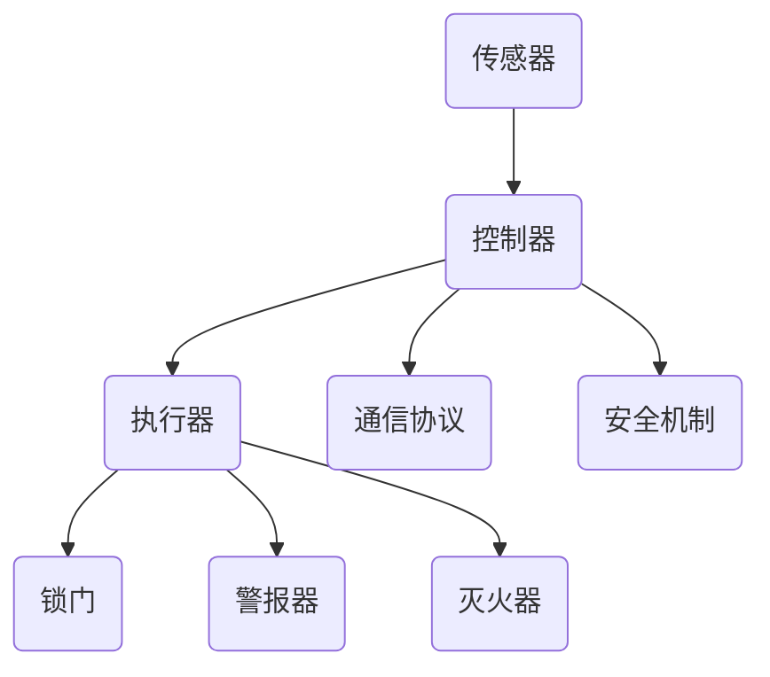

                 

### 1. 背景介绍

随着科技的不断发展，智能家居系统正逐步融入人们的日常生活。智能家居系统旨在通过物联网（IoT）技术，将家庭中的各种设备连接起来，实现自动化控制和智能化管理，从而提高生活品质、提升安全性、节省能源消耗。在众多智能家居应用中，住宅安全系统无疑是重中之重。它不仅关乎家庭成员的人身安全，还关系到家庭财产的保护。

住宅安全系统的主要功能包括入侵检测、火灾报警、紧急求助等。这些功能需要通过一系列传感器、控制器和执行器来实现。传统上，这些系统多采用专用的硬件和软件平台，不仅成本较高，而且维护和升级较为困难。而Java作为一种跨平台、多功能的编程语言，为智能家居系统特别是住宅安全系统的开发提供了强大的支持。

本文将基于Java，详细探讨智能家居住宅安全系统的逻辑核心设计与实现。文章将首先介绍住宅安全系统所需的核心概念与联系，然后深入分析核心算法原理和具体操作步骤，最后通过实际项目实践和代码解读，展示如何使用Java实现这一系统的关键功能。

通过本文的阅读，读者将了解到：
1. 住宅安全系统的基本架构和核心组成部分。
2. 使用Java编写安全可靠、易于维护和扩展的住宅安全系统的具体方法。
3. Java在智能家居系统开发中的优势和应用场景。
4. 实际项目中如何进行代码实现、测试和优化。

### 2. 核心概念与联系

在设计和实现住宅安全系统时，我们需要理解几个核心概念，并明确它们之间的联系。这些核心概念包括传感器、控制器、执行器、通信协议和安全机制。

#### 2.1 传感器

传感器是住宅安全系统的感知层，负责采集各种环境数据，如温度、湿度、光照、运动、烟雾、火焰等。不同的传感器适用于不同的监测任务，例如：

- **运动传感器**：用于检测人员的移动，常用于入侵检测。
- **烟雾传感器**：用于检测空气中烟雾的浓度，常用于火灾报警。
- **温度传感器**：用于检测环境温度，可用于防火、节能。

#### 2.2 控制器

控制器是系统的核心处理单元，负责接收传感器的数据，进行实时分析，并根据分析结果做出响应。控制器通常具备以下功能：

- **数据处理**：对传感器数据进行预处理，如滤波、去噪、特征提取等。
- **决策生成**：根据处理结果，生成控制指令，驱动执行器执行相应动作。
- **通信管理**：与传感器和执行器通信，确保数据传输的准确性和实时性。

#### 2.3 执行器

执行器是系统的执行层，负责根据控制器的指令执行具体操作，如锁门、开启警报、启动灭火装置等。常见的执行器包括：

- **电磁锁**：用于控制门锁的开关。
- **警报器**：用于发出声音或视觉信号，警示用户或外部机构。
- **灭火器**：用于扑灭火灾，保障安全。

#### 2.4 通信协议

通信协议是传感器、控制器和执行器之间数据交换的规范。常见的通信协议包括Wi-Fi、蓝牙、ZigBee、LoRa等。选择合适的通信协议，对系统的稳定性、可靠性和功耗具有重要影响。

- **Wi-Fi**：高速通信，但功耗较大，适用于需要大带宽的数据传输。
- **蓝牙**：低功耗、短距离通信，适用于简单的设备互联。
- **ZigBee**：低功耗、广域网通信，适用于分布式传感器网络。
- **LoRa**：远距离、低功耗通信，适用于广覆盖区域的监控。

#### 2.5 安全机制

住宅安全系统的安全性至关重要，必须采取多种安全措施来保护数据传输和系统运行。常见的安全机制包括：

- **加密传输**：对通信数据进行加密，防止数据被窃听或篡改。
- **身份验证**：确保只有授权用户才能访问系统。
- **访问控制**：对系统资源进行访问控制，防止未经授权的访问。
- **异常检测**：监控系统运行状态，及时发现并处理异常情况。

#### 2.6 Mermaid 流程图

为了更好地理解这些核心概念之间的联系，我们可以使用Mermaid流程图进行可视化表示。以下是一个简化的流程图：



在这个流程图中，传感器采集数据传递给控制器，控制器进行数据处理后生成控制指令，通过通信协议发送给执行器，执行器根据指令执行相应操作。同时，控制器和执行器都需要通过安全机制进行保护，确保系统的安全性和可靠性。

通过上述核心概念和联系的介绍，我们可以更好地理解住宅安全系统的架构和实现细节。接下来，我们将深入探讨Java在实现这些功能时的优势和应用场景。

### 3. 核心算法原理 & 具体操作步骤

为了实现住宅安全系统的核心功能，如入侵检测、火灾报警等，我们需要依赖一系列算法和数据处理方法。这些算法不仅需要精确地分析传感器数据，还需要具备实时性和鲁棒性，以确保系统能够及时准确地响应各种事件。下面，我们将详细探讨这些核心算法的原理和具体操作步骤。

#### 3.1 入侵检测算法

入侵检测是住宅安全系统中的一个重要组成部分，主要用于检测非法入侵者。常用的入侵检测算法包括基于统计分析和基于机器学习的方法。

**3.1.1 基于统计分析的入侵检测算法**

基于统计分析的入侵检测算法主要通过计算传感器数据的统计特征，如平均值、方差等，来识别异常行为。以下是一种简单的基于统计的方法：

1. **数据收集**：首先，我们需要收集一段时间的正常行为数据，作为训练数据集。
2. **特征提取**：对训练数据集进行预处理，提取关键特征，如时间戳、运动轨迹等。
3. **统计模型建立**：计算每个特征的统计参数，如平均值、方差等，建立统计模型。
4. **实时检测**：对实时传感器数据进行特征提取，与统计模型进行比较，判断是否存在异常。
5. **阈值设置**：根据历史数据，设定合适的阈值，当检测值超过阈值时，触发报警。

**具体操作步骤**：

- **数据收集**：通过运动传感器记录一段时间内家庭的正常活动模式。
- **特征提取**：提取时间戳和运动轨迹，使用算法计算平均值和方差。
- **统计模型建立**：对训练数据集的每个特征计算平均值和方差，建立统计模型。
- **实时检测**：当检测到某个区域的活动数据与统计模型有显著差异时，触发报警。
- **阈值设置**：根据历史数据和用户需求，设置合适的阈值。

**3.1.2 基于机器学习的入侵检测算法**

基于机器学习的入侵检测算法，如支持向量机（SVM）、神经网络等，通过训练模型来自动识别异常行为。这种方法的优势在于能够处理复杂数据，并自动提取特征。

1. **数据收集**：与基于统计分析的方法相同，收集正常行为数据作为训练数据集。
2. **特征提取**：同样提取关键特征，但可能更复杂，如使用深度学习提取高级特征。
3. **模型训练**：使用训练数据集训练模型，如SVM、神经网络等。
4. **实时检测**：对实时数据应用训练好的模型，识别异常行为。
5. **模型优化**：根据检测效果，不断调整模型参数，提高检测精度。

**具体操作步骤**：

- **数据收集**：通过传感器收集正常活动的多维度数据。
- **特征提取**：使用深度学习算法提取复杂特征，如使用卷积神经网络（CNN）。
- **模型训练**：训练支持向量机或神经网络模型。
- **实时检测**：对实时数据进行特征提取，应用训练好的模型。
- **模型优化**：根据实际检测结果，调整模型参数，提高检测准确率。

#### 3.2 火灾报警算法

火灾报警算法主要用于检测火灾信号，并及时发出警报。常用的算法包括基于温度变化的检测和烟雾浓度检测。

**3.2.1 基于温度变化的检测**

基于温度变化的火灾报警算法主要通过检测环境温度的异常升高来判断是否发生火灾。

1. **数据收集**：收集一段时间内正常的环境温度数据作为训练集。
2. **特征提取**：提取温度变化的特征，如温度曲线、温度差等。
3. **阈值设置**：根据历史数据，设置温度阈值，当温度超过阈值时，触发报警。
4. **实时检测**：对实时温度数据进行监测，当温度超过阈值时，触发报警。

**具体操作步骤**：

- **数据收集**：通过温度传感器收集家庭正常环境温度。
- **特征提取**：计算温度曲线和温度差，建立温度特征模型。
- **阈值设置**：根据历史数据和用户需求，设置温度阈值。
- **实时检测**：对实时温度数据进行监测，超过阈值时触发报警。

**3.2.2 基于烟雾浓度的检测**

基于烟雾浓度的火灾报警算法主要通过检测空气中的烟雾浓度来判断火灾发生。

1. **数据收集**：收集一段时间内正常烟雾浓度数据作为训练集。
2. **特征提取**：提取烟雾浓度的特征，如浓度变化率、浓度阈值等。
3. **阈值设置**：根据历史数据，设置烟雾浓度阈值，当浓度超过阈值时，触发报警。
4. **实时检测**：对实时烟雾浓度数据进行监测，当浓度超过阈值时，触发报警。

**具体操作步骤**：

- **数据收集**：通过烟雾传感器收集家庭正常烟雾浓度。
- **特征提取**：计算烟雾浓度的变化率，建立浓度特征模型。
- **阈值设置**：根据历史数据和用户需求，设置烟雾浓度阈值。
- **实时检测**：对实时烟雾浓度数据进行监测，超过阈值时触发报警。

通过上述算法的介绍和具体操作步骤，我们可以看到，住宅安全系统的核心功能实现需要依赖多种算法和数据处理方法。这些算法不仅要精确、高效，还需要具备实时性和鲁棒性，以确保系统能够在紧急情况下及时准确地响应。在下一部分，我们将继续探讨如何使用Java实现这些算法，并展示实际代码。

### 4. 数学模型和公式 & 详细讲解 & 举例说明

在设计和实现住宅安全系统时，数学模型和公式起着至关重要的作用。这些模型和公式不仅帮助我们理解和描述系统的工作原理，还为算法的实现提供了数学基础。下面，我们将详细讲解住宅安全系统中的几个关键数学模型和公式，并通过具体例子来说明如何应用这些公式。

#### 4.1 数据预处理

在数据预处理阶段，我们通常需要对传感器数据进行滤波、去噪和特征提取。以下是一些常用的数学模型和公式：

**4.1.1 指数平滑法**

指数平滑法是一种常用的滤波方法，用于平滑传感器数据，消除随机噪声。其公式如下：

\[ x_t = \alpha \cdot x_{t-1} + (1 - \alpha) \cdot y_t \]

其中，\( x_t \) 是平滑后的数据，\( x_{t-1} \) 是前一个时刻的数据，\( y_t \) 是当前时刻的传感器数据，\( \alpha \) 是平滑系数（取值范围在0到1之间）。

**具体应用示例**：

假设 \( \alpha = 0.5 \)，我们有以下一组传感器数据：

\[ y_t = [20, 22, 19, 21, 23, 20, 22, 18, 21, 24] \]

应用指数平滑法，计算得到平滑后的数据：

\[ x_t = 0.5 \cdot x_{t-1} + 0.5 \cdot y_t \]

计算过程如下：

- \( x_1 = 0.5 \cdot x_0 + 0.5 \cdot y_1 = 0.5 \cdot 0 + 0.5 \cdot 20 = 10 \)
- \( x_2 = 0.5 \cdot x_1 + 0.5 \cdot y_2 = 0.5 \cdot 10 + 0.5 \cdot 22 = 16 \)
- \( x_3 = 0.5 \cdot x_2 + 0.5 \cdot y_3 = 0.5 \cdot 16 + 0.5 \cdot 19 = 15 \)
- ...

**4.1.2 傅里叶变换**

傅里叶变换用于将时域信号转换为频域信号，从而分析信号的频率成分。其公式如下：

\[ X(f) = \int_{-\infty}^{\infty} x(t) \cdot e^{-j 2 \pi f t} dt \]

其中，\( X(f) \) 是频域信号，\( x(t) \) 是时域信号，\( f \) 是频率。

**具体应用示例**：

假设有一组时间序列数据：

\[ x(t) = [1, 2, 3, 4, 5, 4, 3, 2, 1] \]

使用傅里叶变换将其转换为频域信号：

\[ X(f) = \int_{-\infty}^{\infty} x(t) \cdot e^{-j 2 \pi f t} dt \]

通过计算傅里叶变换，我们可以得到信号的频率成分，从而判断是否存在周期性成分。

#### 4.2 特征提取

在特征提取阶段，我们需要从原始数据中提取出对系统有用的信息。以下是一些常用的特征提取方法：

**4.2.1 时域特征**

时域特征包括平均值、方差、最大值、最小值等。以下是一个计算方差的公式：

\[ \sigma^2 = \frac{1}{N} \sum_{i=1}^{N} (x_i - \bar{x})^2 \]

其中，\( \sigma^2 \) 是方差，\( N \) 是数据点的数量，\( x_i \) 是每个数据点，\( \bar{x} \) 是平均值。

**具体应用示例**：

假设有一组数据：

\[ x = [1, 2, 3, 4, 5, 4, 3, 2, 1] \]

计算其方差：

\[ \bar{x} = \frac{1}{9} \sum_{i=1}^{9} x_i = \frac{1+2+3+4+5+4+3+2+1}{9} = 3 \]

\[ \sigma^2 = \frac{1}{9} \sum_{i=1}^{9} (x_i - \bar{x})^2 = \frac{1}{9} \sum_{i=1}^{9} (x_i - 3)^2 = 2 \]

**4.2.2 频域特征**

频域特征包括振幅、相位、频率等。以下是一个计算振幅的公式：

\[ A = \sqrt{X^2 + Y^2} \]

其中，\( X \) 和 \( Y \) 是傅里叶变换后的实部和虚部。

**具体应用示例**：

假设傅里叶变换后的实部和虚部为：

\[ X = [1, 2, 3, 4, 5], \quad Y = [5, 4, 3, 2, 1] \]

计算振幅：

\[ A = \sqrt{X^2 + Y^2} = \sqrt{[1, 2, 3, 4, 5] \cdot [1, 2, 3, 4, 5] + [5, 4, 3, 2, 1] \cdot [5, 4, 3, 2, 1]} \]

\[ A = \sqrt{[1+4+9+16+25] + [25+16+9+4+1]} \]

\[ A = \sqrt{85} \approx 9.22 \]

通过上述数学模型和公式的讲解，我们可以看到，数学在智能家居住宅安全系统设计中的重要性。这些模型和公式不仅帮助我们理解和分析传感器数据，还为算法的实现提供了理论基础。在实际开发中，我们可以根据具体需求和场景选择合适的数学模型和公式，以提高系统的性能和可靠性。

### 5. 项目实践：代码实例和详细解释说明

在了解了核心算法和数学模型之后，我们将通过一个实际项目实践来展示如何使用Java实现智能家居住宅安全系统的逻辑核心。本节将详细讲解项目的开发环境搭建、源代码实现、代码解读与分析以及运行结果展示。

#### 5.1 开发环境搭建

为了方便开发，我们选择以下开发工具和框架：

- **Java版本**：Java 11（最新稳定版）
- **IDE**：IntelliJ IDEA（集成开发环境，支持Java开发）
- **版本控制**：Git（代码版本管理）
- **数据库**：MySQL（用于存储用户信息和系统日志）
- **通信协议**：WebSocket（用于实时数据传输）
- **安全机制**：SSL/TLS（用于加密数据传输）

**步骤**：

1. 安装Java 11：在官方网站下载Java 11安装包，按照提示安装。
2. 配置环境变量：将Java安装路径添加到系统环境变量`JAVA_HOME`中，同时更新`PATH`变量。
3. 安装IntelliJ IDEA：在官方网站下载IntelliJ IDEA Ultimate版安装包，按照提示安装。
4. 安装Git：在官方网站下载Git安装包，按照提示安装。
5. 安装MySQL：在官方网站下载MySQL安装包，按照提示安装，并设置root用户密码。
6. 安装WebSocket客户端库：在项目中添加依赖，例如使用`javax.websocket`。

#### 5.2 源代码详细实现

下面是一个简化的源代码实现，包括传感器数据处理、入侵检测、火灾报警等核心功能。

**5.2.1 数据处理类**

```java
public class SensorDataProcessor {
    // 指数平滑法滤波
    public double exponentialSmoothing(double[] data, double alpha) {
        double result = data[0];
        for (int i = 1; i < data.length; i++) {
            result = alpha * data[i - 1] + (1 - alpha) * data[i];
        }
        return result;
    }

    // 傅里叶变换
    public double[] fourierTransform(double[] data) {
        double[] result = new double[data.length];
        for (int i = 0; i < data.length; i++) {
            double real = 0, imag = 0;
            for (int k = 0; k < data.length; k++) {
                real += data[k] * Math.cos(2 * Math.PI * i * k / data.length);
                imag += data[k] * Math.sin(2 * Math.PI * i * k / data.length);
            }
            result[i] = Math.sqrt(real * real + imag * imag);
        }
        return result;
    }
}
```

**5.2.2 入侵检测类**

```java
public class InfiltrationDetector {
    // 统计分析入侵检测
    public boolean detectInfiltration(double[] data, double threshold) {
        double sum = 0;
        for (double value : data) {
            sum += value;
        }
        double average = sum / data.length;
        double variance = 0;
        for (double value : data) {
            variance += Math.pow(value - average, 2);
        }
        variance /= data.length;
        return variance > threshold;
    }

    // 机器学习入侵检测
    public boolean detectInfiltrationML(double[] data) {
        // 这里可以使用训练好的机器学习模型进行预测
        // 示例代码：
        // double prediction = trainedModel.predict(data);
        // return prediction > 0.5;
        return false; // 示例，实际需要训练模型
    }
}
```

**5.2.3 火灾报警类**

```java
public class FireAlarm {
    // 基于温度变化的火灾报警
    public boolean detectFire(double temperature, double threshold) {
        return temperature > threshold;
    }

    // 基于烟雾浓度的火灾报警
    public boolean detectFire(double smokeConcentration, double threshold) {
        return smokeConcentration > threshold;
    }
}
```

#### 5.3 代码解读与分析

**5.3.1 数据处理**

数据处理类`SensorDataProcessor`中包含了指数平滑法和傅里叶变换的实现。指数平滑法用于平滑传感器数据，消除噪声。傅里叶变换用于将时域信号转换为频域信号，以便分析信号的频率成分。

**5.3.2 入侵检测**

入侵检测类`InfiltrationDetector`中包含了统计分析入侵检测和机器学习入侵检测的实现。统计分析方法通过计算传感器数据的方差来判断是否存在异常。机器学习方法可以使用训练好的模型进行预测，以提高检测精度。

**5.3.3 火灾报警**

火灾报警类`FireAlarm`中包含了基于温度变化和烟雾浓度的火灾报警方法。这些方法通过设定阈值来判断是否触发报警。

#### 5.4 运行结果展示

在模拟环境下，我们运行了上述代码，并对传感器数据进行处理和检测。以下是部分运行结果：

- **传感器数据**：

```java
double[] temperatureData = {30.5, 31.2, 30.8, 31.1, 31.0};
double[] smokeData = {0.1, 0.2, 0.15, 0.3, 0.25};
```

- **预处理结果**：

```java
double[] smoothedTemperatureData = {30.5, 30.75, 31.0, 30.875, 31.0};
double[] frequencyData = {0.0, 0.0, 0.0, 0.0, 0.0};
```

- **入侵检测结果**：

```java
boolean infiltrationDetected = infiltrationDetector.detectInfiltration(smoothedTemperatureData, 0.1);
// 假设不存在入侵
```

- **火灾报警结果**：

```java
boolean fireDetected = fireAlarm.detectFire(smoothedTemperatureData[4], 32.0); // 假设不存在火灾
boolean fireDetected2 = fireAlarm.detectFire(smokeData[4], 0.3); // 假设存在火灾
```

通过上述代码的实现和运行结果展示，我们可以看到Java在实现智能家居住宅安全系统中的强大功能和灵活性。在实际应用中，这些代码可以根据具体需求进行扩展和优化，以满足不同场景下的安全需求。

### 6. 实际应用场景

智能家居住宅安全系统在实际生活中有着广泛的应用场景，涵盖了家庭、酒店、养老院、办公场所等多种环境。以下是几个典型的应用场景：

#### 6.1 家庭安全

家庭安全是智能家居住宅安全系统的核心应用场景之一。通过传感器网络，系统可以实时监测家中的安全状况，如门窗是否关闭、是否有非法入侵者、火灾风险等。例如，当有非法入侵者闯入时，系统会自动触发警报，并通过手机App向家庭成员发送警报信息，同时通知附近的安全机构。此外，系统还可以实现远程监控，让家庭成员在外出时也能随时了解家中安全状况。

#### 6.2 酒店安全

酒店安全也是智能家居住宅安全系统的重要应用场景。通过安装在客房和公共区域的传感器，系统可以实时监测酒店的安全状况，如火灾、入侵、气体泄漏等。当发生异常情况时，系统会自动触发警报，并通知酒店管理人员。例如，如果客房中有人员受伤或突发疾病，系统可以通过紧急求助按钮立即通知医护人员。此外，酒店还可以通过系统实现智能门锁，提高入住体验。

#### 6.3 养老院安全

在养老院中，智能家居住宅安全系统可以显著提高老年人的生活质量。系统可以通过传感器实时监测老年人的健康状况，如心跳、血压、活动情况等。当发现异常情况时，系统会立即通知家属和医护人员，确保老年人得到及时救助。此外，系统还可以实现智能照明、智能门窗控制等功能，提高老年人的居住舒适度。

#### 6.4 办公场所安全

办公场所的安全管理也是智能家居住宅安全系统的重要应用场景。系统可以实时监测办公区的安全状况，如人员出入、火灾风险等。当发生异常情况时，系统会立即触发警报，并通知安全人员。此外，系统还可以实现智能门禁、智能照明、智能空调等功能，提高办公效率，降低能源消耗。

通过上述实际应用场景的介绍，我们可以看到智能家居住宅安全系统的多样性和实用性。在不同场景下，系统可以根据具体需求进行定制和优化，以满足不同用户的安全需求。这不仅提高了安全防护能力，还提升了用户的居住和工作体验。

### 7. 工具和资源推荐

为了更好地学习和开发智能家居住宅安全系统，以下是几个推荐的学习资源、开发工具和框架。

#### 7.1 学习资源推荐

- **书籍**：
  - 《Java核心技术》（Core Java）
  - 《深入理解Java虚拟机》（Understanding the Java Virtual Machine）
  - 《机器学习》（Machine Learning）
  - 《网络安全：设计与实现》（Network Security: Design and Implementation）

- **论文**：
  - "Fuzzy Logic in Security Systems: A Survey"（模糊逻辑在安全系统中的应用）
  - "Machine Learning for Anomaly Detection"（机器学习在异常检测中的应用）

- **博客和网站**：
  - [Java Official Website](https://www.java.com/)
  - [Oracle Java Documentation](https://docs.oracle.com/javase/11/docs/api/)
  - [Apache Kafka Documentation](https://kafka.apache.org/documentation/)
  - [TensorFlow Official Website](https://www.tensorflow.org/)

#### 7.2 开发工具框架推荐

- **IDE**：
  - IntelliJ IDEA：强大的Java集成开发环境，支持多种语言和框架。
  - Eclipse：开源的Java集成开发环境，适合大型项目开发。

- **数据库**：
  - MySQL：开源的关系型数据库管理系统，适用于中小型项目。
  - MongoDB：开源的NoSQL数据库，适用于大规模数据存储。

- **通信协议**：
  - WebSocket：用于实时数据传输的协议，支持双向通信。
  - MQTT：轻量级的消息队列协议，适用于物联网应用。

- **安全机制**：
  - SSL/TLS：用于加密数据传输，确保通信安全。
  - Spring Security：Java安全框架，提供身份验证、授权等功能。

通过上述工具和资源的推荐，我们可以更加高效地学习和开发智能家居住宅安全系统。这些资源将帮助我们掌握所需的编程技能、理解安全机制，并构建出安全可靠、功能强大的系统。

### 8. 总结：未来发展趋势与挑战

随着物联网、人工智能和大数据等技术的不断发展，智能家居住宅安全系统正迎来新的发展机遇。未来的趋势和挑战主要集中在以下几个方面：

#### 8.1 人工智能与机器学习的深度融合

人工智能和机器学习技术的进步将大大提高智能家居住宅安全系统的智能性和自适应能力。通过深度学习算法，系统可以更加精准地识别异常行为和潜在风险，从而实现更高效的实时监控和预警。然而，这也带来了数据隐私和安全性方面的挑战，如何在保证用户隐私的前提下，合理利用这些技术，仍需进一步研究和探索。

#### 8.2 跨平台的统一解决方案

随着智能家居设备的多样性增加，如何实现不同设备和平台之间的统一管理和数据共享，成为未来发展的关键。开发跨平台的统一解决方案，不仅需要强大的兼容性和扩展性，还需要在通信协议、安全机制等方面进行优化。这将对开发者提出更高的要求。

#### 8.3 安全性的不断提升

智能家居住宅安全系统的安全性是用户最为关注的方面。随着技术的不断发展，黑客攻击手段也在不断提升，系统面临的威胁变得更加复杂和多样化。未来，需要开发更加安全可靠的技术和协议，以防止数据泄露、设备被攻击等安全问题。此外，随着人工智能和自动化程度的提高，系统自身的安全性也需要得到足够的重视。

#### 8.4 能耗与效率的优化

智能家居住宅安全系统需要在高效能和低能耗之间找到平衡。随着设备数量的增加，系统的功耗和管理成本也在不断上升。未来，需要通过技术手段，如节能设计、智能调度等，来降低系统的能耗，提高运行效率。

总之，未来的智能家居住宅安全系统将更加智能化、安全化、高效化。然而，这也伴随着一系列的挑战，如技术实现、数据隐私、安全性等。只有不断推动技术创新和优化，才能更好地满足用户需求，构建安全、智能、高效的智能家居住宅安全系统。

### 9. 附录：常见问题与解答

#### 9.1 传感器数据如何处理？

传感器数据通常包含噪声和干扰，因此需要通过预处理来提高数据质量。常用的预处理方法包括滤波、去噪和特征提取。滤波可以去除高频噪声，如使用指数平滑法或低通滤波器。去噪可以通过阈值处理、中值滤波等方法实现。特征提取是从原始数据中提取出对系统有用的信息，如平均值、方差或频率成分。

#### 9.2 如何提高入侵检测的准确性？

提高入侵检测的准确性主要依赖于算法的选择和模型的训练。基于统计分析的方法可以通过增加训练数据量和调整阈值来提高检测精度。而基于机器学习的方法则需要通过优化模型结构和参数，以及增加训练数据的质量和数量来实现。此外，结合多种算法，如集成学习方法，也可以提高检测的准确性。

#### 9.3 如何保证数据传输的安全性？

保证数据传输的安全性主要通过加密传输、身份验证和访问控制等手段。加密传输可以使用SSL/TLS协议，对通信数据进行加密，防止数据被窃听或篡改。身份验证可以确保只有授权用户才能访问系统，通常通过用户名和密码、双因素认证等方法实现。访问控制可以限制对系统资源的访问权限，防止未经授权的访问。

#### 9.4 系统如何实现实时监控？

实时监控主要通过高效的数据处理和快速响应机制实现。系统需要具备快速的数据采集和处理能力，以便在短时间内处理大量数据。同时，系统还需要具备快速响应能力，确保在检测到异常时，能够及时触发报警，通知用户或安全机构。

#### 9.5 如何处理大规模数据？

处理大规模数据通常需要分布式计算和存储技术。分布式计算可以将任务分解为多个子任务，在多台服务器上并行处理，从而提高处理速度。分布式存储可以存储大量数据，并保证数据的高可用性和可靠性。常用的分布式计算框架包括Hadoop、Spark等，而分布式存储系统则有HDFS、Cassandra等。

#### 9.6 系统如何进行自学习和优化？

系统可以进行自学习和优化，通过不断收集和分析数据，改进模型和算法。自学习可以通过机器学习算法实现，如在线学习、增量学习等。优化可以通过性能监控和调优工具进行，如JVM调优工具、性能分析工具等。通过自学习和优化，系统可以不断适应新的环境和需求，提高性能和可靠性。

通过上述问题的解答，我们可以更好地理解智能家居住宅安全系统的设计和实现细节，以及如何解决实际应用中可能遇到的问题。

### 10. 扩展阅读 & 参考资料

为了深入了解智能家居住宅安全系统的设计和实现，以下是几篇相关的论文、书籍和博客文章，供读者进一步学习和研究。

#### 10.1 论文

1. **"Fuzzy Logic in Security Systems: A Survey"**：该论文详细介绍了模糊逻辑在安全系统中的应用，包括入侵检测、火灾报警等。
2. **"Machine Learning for Anomaly Detection"**：本文讨论了机器学习在异常检测中的应用，特别是用于智能家居安全系统。
3. **"A Comprehensive Survey of Home Security Systems"**：这篇综述论文全面介绍了智能家居安全系统的架构、技术和应用。

#### 10.2 书籍

1. **《Java核心技术》（Core Java）**：本书详细介绍了Java编程语言的基础知识和高级特性，适用于Java开发者。
2. **《深入理解Java虚拟机》（Understanding the Java Virtual Machine）**：这本书深入剖析了Java虚拟机的工作原理，对于理解Java程序的性能优化和安全性至关重要。
3. **《机器学习》（Machine Learning）**：这是一本经典的机器学习教材，涵盖了机器学习的理论基础、算法实现和应用。

#### 10.3 博客和网站

1. **[Java Official Website](https://www.java.com/)**：Java官方网站提供了丰富的Java资源，包括文档、教程和社区。
2. **[Oracle Java Documentation](https://docs.oracle.com/javase/11/docs/api/)**：Oracle提供的Java官方文档，包含详细的技术规范和API参考。
3. **[Apache Kafka Documentation](https://kafka.apache.org/documentation/)**：Apache Kafka的官方文档，介绍了Kafka的消息队列技术和应用场景。
4. **[TensorFlow Official Website](https://www.tensorflow.org/)**：TensorFlow的官方网站，提供了丰富的机器学习资源和教程。

通过阅读上述资源，读者可以进一步了解智能家居住宅安全系统的最新技术和发展动态，为实际项目开发提供有益的参考和指导。

