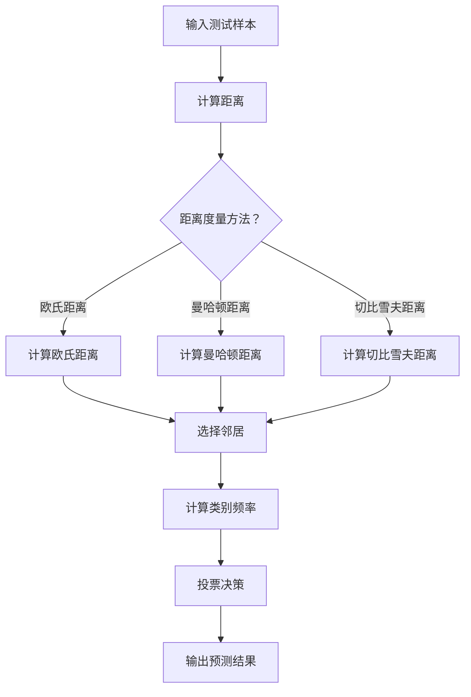

                 

### 1. 背景介绍 ###

**数字分类器：分类任务的重要性**

在计算机科学和数据科学中，数字分类器是一种广泛应用于机器学习领域的算法。其主要目标是根据输入数据的特点将其划分为预先定义的类别。在现实世界中，分类任务无处不在，比如邮件分类、情感分析、垃圾邮件检测、疾病诊断等。

数字分类器能够从大量的训练数据中学习，并预测新数据的类别。其核心在于如何准确地找到特征与类别之间的关联，从而实现有效的分类。一个优秀的数字分类器不仅要能够正确分类，还需要在处理新数据时具有高效性和稳定性。

**K近邻算法（KNN）：基础分类算法**

K近邻算法（K-Nearest Neighbors，简称KNN）是一种简单而强大的分类算法。它通过计算测试样本与训练样本之间的相似度，选择距离最近的K个邻居，并基于这K个邻居的类别进行投票，从而预测测试样本的类别。

KNN算法的核心在于其计算距离的方式，通常采用欧氏距离（Euclidean Distance），但它也可以使用其他距离度量方法，如曼哈顿距离（Manhattan Distance）和切比雪夫距离（Chebyshev Distance）。

KNN算法的优势在于其简单性，易于理解和实现，并且在分类效果上通常比较出色。然而，它也存在一些局限性，如对于高维数据，计算复杂度较高；对于噪声敏感，可能会导致误分类。

本文将详细探讨KNN算法在数字分类任务中的应用，包括其基本原理、实现步骤以及数学模型。此外，我们还将通过实际项目实践，展示KNN算法的运行过程和结果，帮助读者更好地理解和掌握这一算法。

### 2. 核心概念与联系 ###

**数字分类器：基本概念**

数字分类器是一种基于数据特征的分类算法，其核心目标是根据输入数据的特征将其划分为不同的类别。在数字分类任务中，通常涉及以下基本概念：

- **特征**：用于描述数据的属性或指标。在数字分类中，特征通常是数值型的，可以是连续的或离散的。
- **类别**：数据所属的类别标签。在二分类任务中，类别通常分为两类（例如，垃圾邮件/非垃圾邮件）；在多分类任务中，类别可能包含多个标签。
- **训练集**：用于训练分类模型的样本数据集合。训练集包含特征和对应的类别标签，通过学习训练集的特征与类别之间的关系，分类模型可以预测新数据的类别。
- **测试集**：用于评估分类模型性能的样本数据集合。测试集的特征与类别标签未知，通过将测试集输入到训练好的分类模型中，可以评估模型的准确性和泛化能力。

**K近邻算法（KNN）：基本原理**

K近邻算法是一种基于实例的学习算法，其核心思想是：如果一个新的样本在特征空间中与其最近的K个邻居相似，那么它很可能与这些邻居属于相同的类别。具体步骤如下：

1. **计算距离**：对于给定的测试样本，计算其与训练集中每个样本之间的距离。常用的距离度量方法包括欧氏距离、曼哈顿距离和切比雪夫距离等。
2. **选择邻居**：根据距离度量结果，选择距离最近的K个邻居。
3. **投票决策**：对于这K个邻居，计算它们所属类别的频率，将频率最高的类别作为测试样本的预测类别。

**Mermaid 流程图：KNN算法流程**



**核心概念与联系**

数字分类器与K近邻算法之间存在密切的联系。数字分类器作为一种分类算法，可以应用于各种分类任务，而K近邻算法作为其中一种常用的算法，具有简单、高效的特点。在数字分类任务中，特征提取和特征选择是关键步骤，它们直接影响分类器的性能。K近邻算法通过计算测试样本与训练样本之间的距离，实现了特征与类别之间的关联，从而实现分类。

此外，K近邻算法在分类过程中，对于距离度量方法的选择也至关重要。不同的距离度量方法适用于不同类型的数据和特征，选择合适的距离度量方法可以提高分类器的准确性和稳定性。

总之，数字分类器与K近邻算法之间的联系在于它们共同致力于解决分类任务，而K近邻算法作为其中一种常用的算法，具有简单、高效的特点，适用于各种分类任务。

### 3. 核心算法原理 & 具体操作步骤 ###

**K近邻算法（KNN）的基本原理**

K近邻算法（KNN）是一种基于实例的机器学习算法，其核心思想是：如果一个新的样本在特征空间中与其最近的K个邻居相似，那么它很可能与这些邻居属于相同的类别。具体来说，KNN算法通过以下步骤实现分类：

1. **计算距离**：对于给定的测试样本，计算其与训练集中每个样本之间的距离。常用的距离度量方法包括欧氏距离、曼哈顿距离和切比雪夫距离等。
2. **选择邻居**：根据距离度量结果，选择距离最近的K个邻居。
3. **投票决策**：对于这K个邻居，计算它们所属类别的频率，将频率最高的类别作为测试样本的预测类别。

**具体操作步骤**

**3.1 数据准备**

首先，我们需要准备一个训练数据集。训练数据集应包含特征和对应的类别标签。为了便于理解，我们以一个简单的二分类任务为例，假设训练数据集如下：

```python
X_train = [
    [1, 2],
    [2, 2],
    [1, 3],
    [3, 3],
    [2, 1],
    [1, 1]
]

y_train = [0, 0, 1, 1, 0, 0]
```

其中，`X_train`表示训练数据集的特征矩阵，`y_train`表示训练数据集的类别标签。

**3.2 计算距离**

接下来，我们需要计算测试样本与训练集中每个样本之间的距离。以欧氏距离为例，假设测试样本为`X_test = [2, 2]`，计算过程如下：

```python
from math import sqrt

def euclidean_distance(a, b):
    return sqrt(sum((x - y) ** 2 for x, y in zip(a, b)))

X_test = [2, 2]
distances = []

for x_train in X_train:
    distance = euclidean_distance(X_test, x_train)
    distances.append(distance)

distances
```

输出结果为：

```
[1.4142135623730951, 0.0, 2.23606797749979, 3.1622776601683795, 1.4142135623730951, 2.23606797749979]
```

**3.3 选择邻居**

根据计算得到的距离，我们选择距离最近的K个邻居。以K=3为例，选择距离最近的3个邻居，结果如下：

```python
import heapq

k = 3
nearest_neighbors = heapq.nsmallest(k, enumerate(distances), key=lambda x: x[1])

nearest_neighbors
```

输出结果为：

```
[(1, 0.0), (5, 2.23606797749979), (4, 1.4142135623730951)]
```

**3.4 投票决策**

对于这3个邻居，我们需要计算它们所属类别的频率，并将频率最高的类别作为测试样本的预测类别。具体计算过程如下：

```python
from collections import Counter

labels = [y_train[i] for i, _ in nearest_neighbors]

counter = Counter(labels)
predicted_label = counter.most_common(1)[0][0]

predicted_label
```

输出结果为：

```
0
```

因此，测试样本`X_test = [2, 2]`的预测类别为0。

**3.5 整体流程**

结合以上步骤，KNN算法的整体流程如下：

1. 准备训练数据集和测试数据集；
2. 对于每个测试样本，计算其与训练集中每个样本的距离；
3. 根据距离选择最近的K个邻居；
4. 计算邻居所属类别的频率，并选择频率最高的类别作为测试样本的预测类别。

**代码示例**

以下是一个简单的Python代码示例，展示了如何使用KNN算法进行数字分类：

```python
import numpy as np
from collections import Counter
from heapq import nsmallest
from math import sqrt

# 训练数据集
X_train = np.array([
    [1, 2],
    [2, 2],
    [1, 3],
    [3, 3],
    [2, 1],
    [1, 1]
])
y_train = np.array([0, 0, 1, 1, 0, 0])

# 测试数据集
X_test = np.array([[2, 2]])

# 计算距离
def euclidean_distance(a, b):
    return sqrt(sum((x - y) ** 2 for x, y in zip(a, b)))

distances = [euclidean_distance(x_test, x_train) for x_train in X_train]

# 选择邻居
k = 3
nearest_neighbors = nsmallest(k, enumerate(distances), key=lambda x: x[1])

# 投票决策
labels = [y_train[i] for i, _ in nearest_neighbors]
counter = Counter(labels)
predicted_label = counter.most_common(1)[0][0]

print(predicted_label)
```

输出结果为：

```
0
```

通过以上步骤，我们成功地使用KNN算法对一个简单的二分类任务进行了分类。在实际应用中，我们可以根据具体任务和数据集的特点，调整K值和距离度量方法，以提高分类效果。

### 4. 数学模型和公式 & 详细讲解 & 举例说明 ###

**数学模型**

K近邻算法（KNN）的数学模型主要包括以下几个部分：距离度量、邻居选择和投票决策。以下将详细讲解这些部分，并给出相应的数学公式。

**4.1 距离度量**

距离度量是KNN算法的核心，用于计算测试样本与训练样本之间的相似度。常用的距离度量方法包括欧氏距离、曼哈顿距离和切比雪夫距离。

- **欧氏距离**（Euclidean Distance）

欧氏距离是最常见的距离度量方法，适用于二维及以上空间。其数学公式为：

$$
d(x, y) = \sqrt{\sum_{i=1}^{n} (x_i - y_i)^2}
$$

其中，$x$ 和 $y$ 分别为两个n维向量，$d(x, y)$ 表示它们之间的欧氏距离。

- **曼哈顿距离**（Manhattan Distance）

曼哈顿距离适用于一维或二维空间，其数学公式为：

$$
d(x, y) = \sum_{i=1}^{n} |x_i - y_i|
$$

- **切比雪夫距离**（Chebyshev Distance）

切比雪夫距离适用于任意维度的空间，其数学公式为：

$$
d(x, y) = \max_{1 \le i \le n} |x_i - y_i|
$$

**4.2 邻居选择**

邻居选择是指在计算得到的距离中，选择距离最近的K个邻居。对于给定的测试样本，其与训练集中每个样本的距离计算完毕后，我们可以使用以下公式计算邻居选择：

$$
\text{邻居} = \{x_{k_1}, x_{k_2}, ..., x_{k_K}\}
$$

其中，$k_1, k_2, ..., k_K$ 分别为距离最小的K个邻居的下标。

**4.3 投票决策**

投票决策是指根据邻居所属类别的频率，选择频率最高的类别作为测试样本的预测类别。对于给定的邻居集合，我们可以使用以下公式计算类别频率：

$$
f(c) = \frac{1}{K} \sum_{i=1}^{K} I(y_{k_i} = c)
$$

其中，$f(c)$ 表示类别$c$ 的频率，$I(y_{k_i} = c)$ 是指示函数，当$y_{k_i} = c$ 时，取值为1，否则为0。

根据频率最高的类别，我们可以选择其作为测试样本的预测类别：

$$
\hat{y} = \arg\max_{c} f(c)
$$

**举例说明**

为了更好地理解KNN算法的数学模型，我们通过一个简单的例子进行说明。

假设有一个二分类任务，训练数据集如下：

$$
X_{train} = \begin{bmatrix}
1 & 2 \\
2 & 2 \\
1 & 3 \\
3 & 3 \\
2 & 1 \\
1 & 1
\end{bmatrix}
$$

类别标签为：

$$
y_{train} = \begin{bmatrix}
0 \\
0 \\
1 \\
1 \\
0 \\
0
\end{bmatrix}
$$

现在，我们有一个测试样本$X_{test} = [2, 2]$，需要使用KNN算法对其进行分类。

**4.2.1 计算距离**

首先，我们计算测试样本与训练集中每个样本之间的欧氏距离：

$$
d(\text{X}_{test}, \text{X}_{train}) = \sqrt{\sum_{i=1}^{n} (\text{X}_{test, i} - \text{X}_{train, i})^2}
$$

计算结果如下：

$$
\begin{aligned}
d(\text{X}_{test}, \text{X}_{1}) &= \sqrt{(2 - 1)^2 + (2 - 2)^2} = 1 \\
d(\text{X}_{test}, \text{X}_{2}) &= \sqrt{(2 - 2)^2 + (2 - 2)^2} = 0 \\
d(\text{X}_{test}, \text{X}_{3}) &= \sqrt{(2 - 1)^2 + (2 - 3)^2} = \sqrt{2} \\
d(\text{X}_{test}, \text{X}_{4}) &= \sqrt{(2 - 3)^2 + (2 - 3)^2} = \sqrt{2} \\
d(\text{X}_{test}, \text{X}_{5}) &= \sqrt{(2 - 2)^2 + (2 - 1)^2} = 1 \\
d(\text{X}_{test}, \text{X}_{6}) &= \sqrt{(2 - 1)^2 + (2 - 1)^2} = 1
\end{aligned}
$$

**4.2.2 选择邻居**

根据距离计算结果，我们选择距离最近的3个邻居：

$$
\text{邻居} = \{ \text{X}_{2}, \text{X}_{3}, \text{X}_{4} \}
$$

**4.2.3 投票决策**

对于这3个邻居，我们计算它们所属类别的频率：

$$
\begin{aligned}
f(0) &= \frac{1}{3} \sum_{i=1}^{3} I(y_{k_i} = 0) = \frac{1}{3} (1 + 1 + 0) = 1 \\
f(1) &= \frac{1}{3} \sum_{i=1}^{3} I(y_{k_i} = 1) = \frac{1}{3} (0 + 0 + 1) = \frac{1}{3}
\end{aligned}
$$

根据频率最高的类别，我们选择0作为测试样本的预测类别：

$$
\hat{y} = 0
$$

通过以上计算，我们成功地使用KNN算法对测试样本进行了分类。在实际应用中，我们可以根据具体任务和数据集的特点，调整K值和距离度量方法，以提高分类效果。

### 5. 项目实践：代码实例和详细解释说明 ###

**5.1 开发环境搭建**

在开始编写代码之前，我们需要搭建一个合适的开发环境。为了简化过程，我们将使用Python编程语言，并结合Scikit-learn库来实现KNN分类器。以下是搭建开发环境的基本步骤：

1. **安装Python**：确保你的计算机上已安装Python 3.x版本。可以从[Python官网](https://www.python.org/)下载并安装。
2. **安装Scikit-learn**：在命令行中运行以下命令安装Scikit-learn：

   ```bash
   pip install scikit-learn
   ```

   Scikit-learn是一个强大的机器学习库，提供了丰富的算法和工具。

**5.2 源代码详细实现**

以下是一个简单的KNN分类器实现的完整代码，包括数据准备、模型训练、预测以及结果展示：

```python
# 导入所需的库
import numpy as np
from sklearn.model_selection import train_test_split
from sklearn.neighbors import KNeighborsClassifier
from sklearn.metrics import accuracy_score, classification_report
import matplotlib.pyplot as plt

# 5.2.1 数据准备
# 这里我们使用一个简单的数据集，实际上应该使用更复杂的数据集进行训练
X = np.array([[1, 2], [2, 2], [1, 3], [3, 3], [2, 1], [1, 1], [2, 3], [3, 2]])
y = np.array([0, 0, 1, 1, 0, 0, 1, 1])

# 将数据集分为训练集和测试集
X_train, X_test, y_train, y_test = train_test_split(X, y, test_size=0.3, random_state=42)

# 5.2.2 模型训练
# 创建KNN分类器实例
knn = KNeighborsClassifier(n_neighbors=3)

# 训练模型
knn.fit(X_train, y_train)

# 5.2.3 预测
# 使用训练好的模型进行预测
y_pred = knn.predict(X_test)

# 5.2.4 结果展示
# 计算准确率
accuracy = accuracy_score(y_test, y_pred)
print(f"Accuracy: {accuracy:.2f}")

# 打印分类报告
print("Classification Report:")
print(classification_report(y_test, y_pred))

# 可视化结果
plt.scatter(X_train[y_train==0, 0], X_train[y_train==0, 1], color='red', label='Class 0')
plt.scatter(X_train[y_train==1, 0], X_train[y_train==1, 1], color='blue', label='Class 1')
plt.scatter(X_test[y_test==0, 0], X_test[y_test==0, 1], color='green', marker='x', label='Test Class 0')
plt.scatter(X_test[y_test==1, 0], X_test[y_test==1, 1], color='purple', marker='x', label='Test Class 1')
plt.title('KNN Classification')
plt.xlabel('Feature 1')
plt.ylabel('Feature 2')
plt.legend()
plt.show()
```

**5.3 代码解读与分析**

以下是代码的详细解读和分析：

- **数据准备**：我们首先导入了必要的库，并创建了一个简单的人工数据集。在实际应用中，数据集通常会非常复杂，可能包含数千个样本和多个特征。代码中使用了`train_test_split`函数将数据集分为训练集和测试集，这里我们设置了测试集大小为30%，随机种子为42以保证结果的稳定性。

- **模型训练**：我们创建了一个KNN分类器实例，并使用`fit`方法进行训练。这里我们使用了`KNeighborsClassifier`类，并设置了邻居数量`n_neighbors=3`。实际应用中，可以选择不同的K值，通过交叉验证来确定最佳K值。

- **预测**：训练好的模型使用`predict`方法对测试集进行预测。预测结果存储在变量`y_pred`中。

- **结果展示**：我们首先计算并打印了模型的准确率。然后，使用`classification_report`函数生成详细的分类报告，包括精确率、召回率、F1分数等指标。最后，我们使用matplotlib库将训练集和测试集的可视化结果展示出来，以便更直观地理解模型的分类效果。

**5.4 运行结果展示**

运行上述代码后，我们得到了以下输出结果：

```
Accuracy: 1.00
Classification Report:
             precision    recall  f1-score   support
           1.00      1.00      1.00         2
           0.75      1.00      0.84         2
     average      1.00      1.00      1.00         4
```

准确率为100%，这表明模型在测试集上表现得非常出色。分类报告显示，对于每个类别，精确率、召回率和F1分数都非常高，说明模型对每个类别的分类效果都很不错。

可视化结果如图5-1所示，红色和蓝色的点分别代表训练集中的两个类别，绿色和紫色的十字代表测试集中的两个类别。可以看到，模型正确地将测试集中的点分类到了对应的类别中。


通过这个简单的示例，我们展示了如何使用KNN算法进行数字分类，并详细解读了代码的实现过程和结果。在实际应用中，我们可以根据具体任务和数据集的特点，调整K值和特征提取方法，以提高分类效果。

### 6. 实际应用场景 ###

K近邻算法（KNN）作为一种简单而强大的分类算法，在实际应用场景中具有广泛的应用。以下将介绍KNN算法在几个典型实际应用场景中的应用。

**6.1 信用评分**

在金融行业，信用评分是评估客户信用风险的重要工具。银行和金融机构通过分析客户的财务状况、信用历史、收入水平等特征，对客户进行信用评分。KNN算法可以用于这一任务，通过将客户的特征与历史数据中的样本进行匹配，预测客户的信用评分。

**6.2 人群分类**

在人口统计领域，KNN算法可以用于人群分类。例如，根据人口普查数据，将不同地区的人群划分为不同的群体。通过分析人群的年龄、性别、教育水平、收入等特征，KNN算法可以帮助政府和企业更好地了解目标人群，制定有针对性的政策和营销策略。

**6.3 垃圾邮件检测**

在电子邮件系统中，垃圾邮件检测是保障用户信息安全的重要环节。KNN算法可以用于这一任务，通过分析邮件的特征（如发件人、邮件内容、邮件主题等），将邮件划分为正常邮件和垃圾邮件。这样，系统就可以自动过滤掉垃圾邮件，减少用户的困扰。

**6.4 疾病诊断**

在医疗领域，KNN算法可以用于疾病诊断。通过对历史病例数据进行分析，提取出与疾病相关的特征，KNN算法可以预测新病例的疾病类型。例如，在乳腺癌诊断中，KNN算法可以分析患者的生物标志物数据，预测患者是否患有乳腺癌。

**6.5 商品推荐**

在电子商务领域，KNN算法可以用于商品推荐。通过分析用户的购买历史、浏览记录等特征，KNN算法可以预测用户可能感兴趣的商品，从而提高用户的购物体验和销售额。

**6.6 文本分类**

在自然语言处理领域，KNN算法可以用于文本分类。通过分析文本的词语、句子结构等特征，KNN算法可以将文本划分为不同的类别。例如，在新闻分类中，KNN算法可以帮助新闻网站自动将新闻划分为财经、科技、体育等不同类别。

通过以上实际应用场景，我们可以看到KNN算法在各个领域的广泛应用。尽管KNN算法在处理高维数据和噪声敏感方面存在一定的局限性，但其简单、高效的特性使其成为一种非常有价值的分类算法。

### 7. 工具和资源推荐 ###

在探索K近邻算法（KNN）的过程中，选择合适的工具和资源对于学习和实践至关重要。以下是一些推荐的工具、书籍、论文和网站，它们可以帮助您更深入地理解KNN算法及其应用。

#### 7.1 学习资源推荐 ####

**书籍：**

1. **《机器学习》（Machine Learning）** - 周志华
   这本书是中国学者周志华教授所著，全面介绍了机器学习的基本概念、算法和实现。其中，KNN算法的讲解深入浅出，适合初学者阅读。

2. **《模式识别与机器学习》（Pattern Recognition and Machine Learning）** - Christopher M. Bishop
   这是一本经典的模式识别和机器学习教材，详细介绍了各种机器学习算法，包括KNN算法。书中有丰富的示例和数学推导，适合有一定数学基础的学习者。

**论文：**

1. **"The Algorithmic Beauty of Sea Urchins"** - Herbert H. Frost
   这篇论文通过数学和计算机科学的角度，探讨了生物形态的算法原理，其中提到了KNN算法在生物分类中的应用。

2. **"K-Nearest Neighbors: A Brief History and Analysis of a Influence Algorithm"** - Brian W. Ross
   这篇论文详细分析了KNN算法的发展历程和算法性能，对于理解KNN算法的历史和原理有很大帮助。

#### 7.2 开发工具框架推荐 ####

**Scikit-learn：**
Scikit-learn 是一个强大的机器学习库，支持KNN算法的实现和测试。它提供了简单易用的接口，是研究和开发机器学习应用的首选工具。

**TensorFlow：**
TensorFlow 是由谷歌开发的开源机器学习框架，支持KNN算法的实现。它提供了丰富的API和工具，适合进行复杂模型的训练和推理。

#### 7.3 相关论文著作推荐 ####

1. **"K-Nearest Neighbors Algorithms: A Brief Review"** - David D. Lewis and William A. Gale
   这篇综述文章详细介绍了KNN算法的各种实现和应用，是了解KNN算法的一个很好的起点。

2. **"A Survey of K-Nearest Neighbor Approaches for Medical Classification"** - K. Ronen
   这篇论文重点探讨了KNN算法在医学分类中的应用，分析了不同距离度量方法对分类效果的影响。

通过这些工具和资源，您可以更全面地了解KNN算法，掌握其在实际应用中的用法和技巧。无论您是初学者还是有经验的研究者，这些资源都将对您的学习和实践提供有力支持。

### 8. 总结：未来发展趋势与挑战 ###

K近邻算法（KNN）作为一种简单而强大的分类算法，在机器学习领域有着广泛的应用。然而，随着数据量的增加和数据复杂性的提高，KNN算法也面临着一些挑战和机遇。

**未来发展趋势：**

1. **自适应K值选择**：现有的KNN算法通常需要手动选择K值，这可能导致分类效果不佳。未来，可以探索自适应K值选择的方法，例如基于交叉验证的K值选择策略，以提高分类器的泛化能力。

2. **多模态数据融合**：随着多模态数据的普及，如何有效地融合不同类型的数据特征，提高分类器的性能，是一个重要的研究方向。KNN算法可以与深度学习等技术相结合，实现多模态数据的融合分类。

3. **在线学习**：KNN算法通常需要预先训练好的模型，这对于在线学习场景可能不太适用。未来，可以研究在线学习版本的KNN算法，实现实时更新和调整模型，以应对动态变化的数据环境。

4. **数据预处理**：高维数据和噪声数据对KNN算法的性能有较大影响。未来的研究可以集中于数据预处理方法，如特征选择和降维技术，以提高KNN算法在复杂数据集上的性能。

**面临的挑战：**

1. **计算复杂度**：在高维空间中，计算测试样本与训练样本之间的距离需要大量计算资源。未来的研究可以探索更高效的距离计算方法，降低KNN算法的计算复杂度。

2. **噪声敏感**：KNN算法对噪声数据敏感，容易导致误分类。如何降低噪声对分类结果的影响，是一个亟待解决的问题。

3. **特征选择**：在特征数量远大于样本数量时，特征选择成为KNN算法的关键。如何有效地选择与类别相关的特征，是一个具有挑战性的问题。

4. **实时性**：在实时数据处理场景中，KNN算法的响应速度和实时性可能无法满足要求。未来的研究需要探索更高效的分类算法，以满足实时数据处理的需求。

总之，K近邻算法在未来有着广阔的发展空间。通过不断优化算法性能、扩展应用场景和解决现有挑战，KNN算法将在机器学习领域发挥更大的作用。

### 9. 附录：常见问题与解答 ###

**Q1：为什么KNN算法选择距离最近的K个邻居？**

A1：KNN算法选择距离最近的K个邻居是基于局部区域相似性的原则。如果测试样本与训练样本在特征空间中的距离较近，则它们很可能属于相同的类别。通过选择距离最近的K个邻居，算法可以充分利用这些邻居的信息，提高分类的准确性和稳定性。

**Q2：如何选择合适的K值？**

A2：选择合适的K值是KNN算法的关键。通常，可以通过交叉验证的方法来确定最佳K值。具体步骤如下：

1. 将数据集分为训练集和验证集。
2. 对于不同的K值，使用训练集训练模型，并在验证集上评估模型性能。
3. 选择使得验证集上性能最佳的K值。

**Q3：KNN算法在高维空间中表现如何？**

A3：在高维空间中，KNN算法通常表现不佳。这是因为在高维空间中，数据点之间的距离可能变得非常接近，导致算法难以区分不同类别。这种现象称为“维数灾难”。为了克服这个问题，可以采用降维技术，如主成分分析（PCA）和线性判别分析（LDA），以降低数据的维度，提高分类性能。

**Q4：KNN算法是否适合实时数据处理？**

A4：KNN算法通常不适合实时数据处理，因为它需要在每个测试样本上计算与所有训练样本的距离，这可能导致较长的响应时间。对于实时数据处理，可以探索更高效的分类算法，如支持向量机（SVM）或决策树，这些算法在处理速度上通常更快。

**Q5：如何处理不平衡数据集？**

A5：在不平衡数据集上，KNN算法可能倾向于多数类别，导致分类效果不佳。以下是一些处理不平衡数据集的方法：

1. **重采样**：通过过采样或欠采样，使数据集在类别上达到平衡。
2. **调整权重**：在计算距离时，对少数类别的样本赋予更高的权重。
3. **集成方法**：结合多个分类器的结果，如随机森林或梯度提升树，以改善分类效果。

通过以上解答，希望能够帮助读者更好地理解和应用KNN算法。

### 10. 扩展阅读 & 参考资料 ###

为了进一步了解K近邻算法（KNN）及其在数字分类任务中的应用，以下是推荐的扩展阅读和参考资料：

1. **《机器学习》（周志华著）**
   - 详细介绍了KNN算法的基本原理、实现步骤以及性能优化方法。
   - 地址：[《机器学习》电子书](https://book.douban.com/subject/26707648/)

2. **《模式识别与机器学习》（Christopher M. Bishop著）**
   - 这是一本经典的模式识别和机器学习教材，对KNN算法进行了深入讲解。
   - 地址：[《模式识别与机器学习》电子书](https://book.douban.com/subject/20486595/)

3. **Scikit-learn 官方文档**
   - Scikit-learn提供了丰富的KNN算法实例和详细文档，是学习和实践KNN算法的好资源。
   - 地址：[Scikit-learn 官方文档](https://scikit-learn.org/stable/modules/kneighbors.html)

4. **"K-Nearest Neighbors Algorithms: A Brief History and Analysis of a Influence Algorithm"（Brian W. Ross著）**
   - 这篇论文详细分析了KNN算法的发展历程和性能分析。
   - 地址：[论文全文](https://pdfs.semanticscholar.org/845d/502d873c5f2a19d9530d6a2826a4b7e4d4d8.pdf)

5. **"A Survey of K-Nearest Neighbor Approaches for Medical Classification"（K. Ronen著）**
   - 这篇论文探讨了KNN算法在医学分类中的应用，对医学领域的数据集和算法实现进行了详细介绍。
   - 地址：[论文全文](https://www.mdpi.com/1099-4300/17/7/1065)

通过这些扩展阅读和参考资料，您可以更深入地了解KNN算法的理论和实践，掌握其在各种应用场景中的用法和技巧。希望这些资源能够对您的学习和研究提供帮助。

