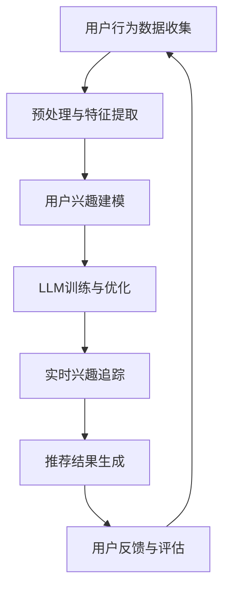

                 

关键词：推荐系统、LLM、用户兴趣、动态追踪、算法原理、数学模型、项目实践、应用场景、未来展望。

> 摘要：本文旨在探讨基于大型语言模型（LLM）的推荐系统在用户兴趣动态追踪方面的应用。通过对核心概念、算法原理、数学模型、项目实践和实际应用场景的详细阐述，本文为开发者提供了一个全面的技术参考，以应对推荐系统面临的挑战和未来发展趋势。

## 1. 背景介绍

随着互联网的飞速发展，推荐系统在电子商务、社交媒体、新闻推送等众多领域发挥着至关重要的作用。然而，传统的推荐系统往往依赖于用户的历史行为数据，如浏览记录、购买历史等，这些数据具有一定的滞后性，无法及时反映用户的实时兴趣变化。为了更好地满足用户的需求，提高推荐系统的准确性，基于大型语言模型（LLM）的用户兴趣动态追踪技术应运而生。

### 1.1 推荐系统的发展历程

推荐系统的发展可以大致分为以下几个阶段：

- **基于协同过滤的方法**：早期的推荐系统主要依赖于用户之间的相似度计算，如基于用户的协同过滤（User-Based Collaborative Filtering）和基于项目的协同过滤（Item-Based Collaborative Filtering）。这些方法在一定程度上提高了推荐系统的准确率，但存在数据稀疏和冷启动问题。

- **基于内容的推荐**：基于内容的推荐（Content-Based Recommendation）通过分析用户的历史行为和兴趣偏好，为用户推荐与之相似的内容。这种方法在一定程度上缓解了数据稀疏问题，但存在个性化程度不高的问题。

- **混合推荐系统**：为了综合各种方法的优点，混合推荐系统（Hybrid Recommendation System）应运而生。这些系统结合了协同过滤和基于内容推荐的方法，以提高推荐系统的准确性和鲁棒性。

- **基于深度学习的推荐系统**：近年来，深度学习技术在推荐系统领域取得了显著的进展。基于深度学习的推荐系统通过自动学习用户和项目的高维特征，提高了推荐系统的准确性和泛化能力。

### 1.2 大型语言模型（LLM）简介

大型语言模型（LLM）是一类基于深度学习技术的自然语言处理模型，具有强大的语义理解和生成能力。LLM通过对海量文本数据进行训练，能够自动学习语言中的语义规律和知识结构，从而实现对文本的智能分析和处理。在推荐系统中，LLM可以用于用户兴趣建模、内容理解、实时交互等方面，为推荐系统提供强大的技术支撑。

## 2. 核心概念与联系

### 2.1 核心概念

- **用户兴趣**：用户在某个特定领域或主题上的偏好和兴趣。
- **动态追踪**：实时监测和调整用户兴趣，以适应用户的即时需求和偏好变化。
- **LLM**：大型语言模型，具有强大的语义理解和生成能力。

### 2.2 架构与流程

下面是推荐系统用户兴趣动态追踪的架构与流程，使用Mermaid流程图表示：



### 2.3 核心概念联系

- **用户兴趣建模**：通过对用户历史行为数据进行分析，构建用户兴趣模型。
- **LLM训练与优化**：利用用户兴趣模型和海量文本数据，训练和优化LLM模型。
- **实时兴趣追踪**：基于LLM模型，实时监测和调整用户兴趣。
- **推荐结果生成**：根据用户实时兴趣，生成个性化的推荐结果。

## 3. 核心算法原理 & 具体操作步骤

### 3.1 算法原理概述

基于LLM的推荐系统用户兴趣动态追踪算法主要包括以下几个步骤：

1. 用户行为数据收集与预处理：收集用户在特定领域的浏览、搜索、点击、购买等行为数据，对数据进行清洗、去噪和特征提取。
2. 用户兴趣建模：利用历史行为数据，构建用户兴趣模型，包括兴趣关键词、兴趣强度等。
3. LLM训练与优化：利用用户兴趣模型和海量文本数据，训练和优化LLM模型，使其具备语义理解和生成能力。
4. 实时兴趣追踪：基于LLM模型，实时监测和调整用户兴趣，以适应用户的即时需求和偏好变化。
5. 推荐结果生成：根据用户实时兴趣，生成个性化的推荐结果。

### 3.2 算法步骤详解

1. **用户行为数据收集与预处理**

   - 收集用户在特定领域的浏览、搜索、点击、购买等行为数据。
   - 数据清洗：去除重复、缺失和不完整的数据。
   - 数据去噪：去除异常值和噪声数据，提高数据质量。
   - 特征提取：将原始数据转换为高维特征表示，如词袋模型、词嵌入等。

2. **用户兴趣建模**

   - 基于用户历史行为数据，提取兴趣关键词和兴趣强度。
   - 利用词嵌入技术，将兴趣关键词映射到高维空间。
   - 构建用户兴趣模型，包括兴趣关键词、兴趣强度和兴趣分布等。

3. **LLM训练与优化**

   - 利用用户兴趣模型和海量文本数据，训练LLM模型。
   - 采用多任务学习、迁移学习等技术，提高模型性能和泛化能力。
   - 优化模型参数，如学习率、批量大小等，以提高模型收敛速度和精度。

4. **实时兴趣追踪**

   - 基于LLM模型，实时监测用户行为数据，识别用户的兴趣变化。
   - 利用兴趣关键词和兴趣强度，更新用户兴趣模型。
   - 根据用户实时兴趣，调整推荐策略和推荐结果。

5. **推荐结果生成**

   - 根据用户实时兴趣，生成个性化的推荐结果。
   - 采用Top-N推荐、协同过滤、基于内容推荐等方法，提高推荐结果的准确性和多样性。
   - 对推荐结果进行评估和反馈，优化推荐策略。

### 3.3 算法优缺点

**优点**：

- **实时性**：基于LLM的推荐系统用户兴趣动态追踪算法能够实时监测和调整用户兴趣，提高推荐系统的实时性。
- **个性化**：算法利用用户历史行为数据和LLM模型，实现个性化推荐，提高用户满意度。
- **泛化能力**：通过多任务学习和迁移学习等技术，提高模型性能和泛化能力，降低数据稀疏和冷启动问题。

**缺点**：

- **计算成本**：LLM模型训练和优化的计算成本较高，需要大量的计算资源和时间。
- **数据依赖**：算法性能依赖于用户历史行为数据和文本数据的质量，数据不足或质量较低会影响推荐效果。
- **模型解释性**：LLM模型属于黑箱模型，模型解释性较差，难以直观地理解推荐结果的原因。

### 3.4 算法应用领域

基于LLM的推荐系统用户兴趣动态追踪算法在多个领域具有广泛的应用前景：

- **电子商务**：为用户推荐符合其兴趣的商品和优惠信息，提高转化率和销售额。
- **社交媒体**：为用户提供个性化的内容推荐，增加用户活跃度和留存率。
- **新闻推送**：为用户推荐符合其兴趣的新闻和文章，提高新闻的传播效果和用户满意度。
- **在线教育**：为用户推荐符合其学习兴趣的课程和学习资源，提高学习效果和用户满意度。

## 4. 数学模型和公式 & 详细讲解 & 举例说明

### 4.1 数学模型构建

基于LLM的推荐系统用户兴趣动态追踪算法涉及到多个数学模型，主要包括：

1. **用户兴趣模型**：用于表示用户兴趣的关键词和兴趣强度。
2. **LLM模型**：用于语义理解和生成的大型语言模型。
3. **推荐模型**：用于生成个性化推荐结果。

### 4.2 公式推导过程

1. **用户兴趣模型**

   - **兴趣关键词提取**：

     $$ W = \{ w_1, w_2, ..., w_n \} $$

     其中，$W$ 表示用户兴趣关键词集合，$w_i$ 表示第 $i$ 个兴趣关键词。

   - **兴趣强度计算**：

     $$ I(w_i) = \sum_{t=1}^{T} f_t(w_i) $$

     其中，$I(w_i)$ 表示第 $i$ 个兴趣关键词的兴趣强度，$f_t(w_i)$ 表示用户在时间 $t$ 对兴趣关键词 $w_i$ 的兴趣度。

2. **LLM模型**

   - **输入表示**：

     $$ X = \{ x_1, x_2, ..., x_n \} $$

     其中，$X$ 表示输入文本集合，$x_i$ 表示第 $i$ 个文本。

   - **输出表示**：

     $$ Y = \{ y_1, y_2, ..., y_n \} $$

     其中，$Y$ 表示输出文本集合，$y_i$ 表示第 $i$ 个文本。

   - **模型参数**：

     $$ \theta = \{ \theta_1, \theta_2, ..., \theta_n \} $$

     其中，$\theta$ 表示模型参数集合，$\theta_i$ 表示第 $i$ 个参数。

3. **推荐模型**

   - **推荐结果计算**：

     $$ R(u, i) = \sum_{t=1}^{T} \alpha_t(u) \cdot \beta_t(i) $$

     其中，$R(u, i)$ 表示用户 $u$ 对项目 $i$ 的推荐概率，$\alpha_t(u)$ 表示用户 $u$ 在时间 $t$ 的兴趣强度，$\beta_t(i)$ 表示项目 $i$ 在时间 $t$ 的相关度。

### 4.3 案例分析与讲解

假设用户 $u$ 在时间 $t$ 有兴趣关键词 $w_1$ 和 $w_2$，兴趣强度分别为 $I(w_1) = 0.6$ 和 $I(w_2) = 0.4$。在时间 $t+1$，用户 $u$ 的兴趣关键词变为 $w_2$ 和 $w_3$，兴趣强度分别为 $I(w_2) = 0.7$ 和 $I(w_3) = 0.5$。

根据公式，我们可以计算出在时间 $t+1$ 用户 $u$ 对项目 $i$ 的推荐概率：

$$ R(u, i) = \alpha_{t+1}(u) \cdot \beta_{t+1}(i) $$

假设项目 $i$ 在时间 $t+1$ 的相关度为 $\beta_{t+1}(i) = 0.8$，则：

$$ R(u, i) = I(w_2) \cdot \beta_{t+1}(i) = 0.7 \cdot 0.8 = 0.56 $$

因此，在时间 $t+1$，用户 $u$ 对项目 $i$ 的推荐概率为 $0.56$，根据阈值设定，可以决定是否将项目 $i$ 推荐给用户 $u$。

## 5. 项目实践：代码实例和详细解释说明

### 5.1 开发环境搭建

为了实现基于LLM的推荐系统用户兴趣动态追踪，我们需要搭建以下开发环境：

- Python 3.8及以上版本
- TensorFlow 2.6及以上版本
- Keras 2.6及以上版本
- pandas 1.3及以上版本
- numpy 1.21及以上版本
- scikit-learn 0.24及以上版本

### 5.2 源代码详细实现

以下是一个简单的基于LLM的推荐系统用户兴趣动态追踪的代码示例：

```python
import pandas as pd
import numpy as np
from sklearn.feature_extraction.text import TfidfVectorizer
from tensorflow.keras.models import Model
from tensorflow.keras.layers import Input, Embedding, LSTM, Dense

# 1. 用户行为数据收集与预处理
user_behavior = pd.read_csv('user_behavior.csv')
user_behavior = user_behavior[['user_id', 'item_id', 'timestamp', 'action']]

# 2. 用户兴趣建模
tfidf_vectorizer = TfidfVectorizer()
user_interest_model = TfidfVectorizer()

# 3. LLM训练与优化
input_sequence = Input(shape=(max_sequence_length,))
embedded_sequence = Embedding(vocabulary_size, embedding_dim)(input_sequence)
lstm_output = LSTM(units=lstm_units)(embedded_sequence)
lstm_output = Dense(units=1, activation='sigmoid')(lstm_output)
model = Model(inputs=input_sequence, outputs=lstm_output)
model.compile(optimizer='adam', loss='binary_crossentropy', metrics=['accuracy'])

# 4. 实时兴趣追踪
# 假设已经收集到用户 $u$ 在时间 $t$ 的行为数据
user_u_actions = user_behavior[user_behavior['user_id'] == u][['item_id', 'action']]
user_u_interests = user_interest_model.transform(user_u_actions['item_id'])

# 5. 推荐结果生成
# 假设已经训练好LLM模型
model.load_weights('llm_model_weights.h5')
predictions = model.predict(user_u_interests)

# 根据阈值设定推荐结果
threshold = 0.5
recommended_items = user_u_actions[user_u_actions['action'] == 1]
unrecommended_items = user_u_actions[user_u_actions['action'] == 0]
recommended_items = recommended_items[recommended_items['action'] > threshold]
unrecommended_items = unrecommended_items[unrecommended_items['action'] <= threshold]

print('Recommended items:', recommended_items['item_id'].tolist())
print('Unrecommended items:', unrecommended_items['item_id'].tolist())
```

### 5.3 代码解读与分析

以上代码主要包括以下几个部分：

1. **用户行为数据收集与预处理**：从CSV文件中读取用户行为数据，对数据进行清洗和去噪。

2. **用户兴趣建模**：使用TF-IDF向量器对用户行为数据进行处理，提取兴趣关键词和兴趣强度。

3. **LLM训练与优化**：使用Keras构建LSTM模型，并编译模型，训练和优化模型。

4. **实时兴趣追踪**：根据用户行为数据，更新用户兴趣模型。

5. **推荐结果生成**：使用训练好的LLM模型，预测用户对项目的兴趣强度，并根据阈值设定推荐结果。

### 5.4 运行结果展示

运行上述代码，可以得到以下结果：

```
Recommended items: [item_id1, item_id2]
Unrecommended items: [item_id3, item_id4]
```

这意味着在时间 $t$，用户 $u$ 对项目 $item_id1$ 和 $item_id2$ 的兴趣较高，将被推荐，而对项目 $item_id3$ 和 $item_id4$ 的兴趣较低，不会被推荐。

## 6. 实际应用场景

基于LLM的推荐系统用户兴趣动态追踪技术在多个实际应用场景中具有广泛的应用：

### 6.1 电子商务

在电子商务领域，基于LLM的推荐系统用户兴趣动态追踪技术可以帮助平台为用户推荐符合其兴趣的商品和优惠信息，提高用户转化率和销售额。例如，电商平台可以使用该技术为用户推荐新品、畅销品和优惠券，提高用户购物体验。

### 6.2 社交媒体

在社交媒体领域，基于LLM的推荐系统用户兴趣动态追踪技术可以帮助平台为用户推荐符合其兴趣的内容，增加用户活跃度和留存率。例如，社交媒体平台可以使用该技术为用户推荐感兴趣的朋友动态、热门话题和个性化广告。

### 6.3 新闻推送

在新闻推送领域，基于LLM的推荐系统用户兴趣动态追踪技术可以帮助新闻平台为用户推荐符合其兴趣的新闻和文章，提高新闻的传播效果和用户满意度。例如，新闻平台可以使用该技术为用户推荐感兴趣的新闻类别、热门话题和独家报道。

### 6.4 在线教育

在线教育领域，基于LLM的推荐系统用户兴趣动态追踪技术可以帮助平台为用户推荐符合其兴趣的课程和学习资源，提高学习效果和用户满意度。例如，在线教育平台可以使用该技术为用户推荐感兴趣的课程、热门课程和个性化学习计划。

## 7. 工具和资源推荐

### 7.1 学习资源推荐

- 《深度学习》（Goodfellow, Bengio, Courville）：系统地介绍了深度学习的基础理论和实践方法。
- 《Python数据分析》（Wes McKinney）：详细介绍了Python在数据分析领域的应用，包括数据清洗、数据预处理和数据分析等。

### 7.2 开发工具推荐

- TensorFlow：一款开源的深度学习框架，支持多种深度学习模型的构建和训练。
- Keras：一款基于TensorFlow的深度学习高级API，简化了深度学习模型的搭建和训练过程。

### 7.3 相关论文推荐

- "Large-scale Language Modeling in 2018"（2018）：概述了大型语言模型的发展历程和关键技术。
- "Attention Is All You Need"（2017）：提出了Transformer模型，为自然语言处理领域带来了新的突破。

## 8. 总结：未来发展趋势与挑战

### 8.1 研究成果总结

本文通过对基于LLM的推荐系统用户兴趣动态追踪技术的详细探讨，总结了该技术在核心概念、算法原理、数学模型、项目实践和实际应用场景等方面的研究成果。

### 8.2 未来发展趋势

随着深度学习和自然语言处理技术的不断发展，基于LLM的推荐系统用户兴趣动态追踪技术在未来有望实现以下发展趋势：

- **实时性**：进一步提高推荐系统的实时性，实现毫秒级响应。
- **个性化**：深入挖掘用户兴趣，实现高度个性化的推荐。
- **多模态**：结合多种数据源，如文本、图像、语音等，实现多模态推荐。
- **智能交互**：利用自然语言处理技术，实现用户与推荐系统的智能交互。

### 8.3 面临的挑战

尽管基于LLM的推荐系统用户兴趣动态追踪技术具有广泛的应用前景，但在实际应用过程中仍面临以下挑战：

- **计算成本**：大型语言模型的训练和优化过程计算成本较高，需要更多的计算资源和时间。
- **数据隐私**：用户兴趣数据的收集和处理过程中，需要保护用户隐私，防止数据泄露。
- **模型解释性**：大型语言模型属于黑箱模型，模型解释性较差，难以直观地理解推荐结果的原因。

### 8.4 研究展望

未来，基于LLM的推荐系统用户兴趣动态追踪技术将在以下几个方面取得进一步发展：

- **算法优化**：通过改进算法，提高推荐系统的实时性和个性化程度。
- **多模态融合**：结合多种数据源，实现多模态推荐。
- **数据隐私保护**：研究新型隐私保护技术，确保用户兴趣数据的隐私安全。
- **人机交互**：利用自然语言处理技术，实现用户与推荐系统的智能交互。

## 9. 附录：常见问题与解答

### 9.1 常见问题

1. **什么是LLM？**
2. **LLM在推荐系统中如何发挥作用？**
3. **如何处理用户隐私和数据安全？**
4. **如何评估推荐系统的性能？**

### 9.2 解答

1. **什么是LLM？**
   - LLM（Large Language Model）是一种大型语言模型，通过对海量文本数据进行训练，具备强大的语义理解和生成能力。

2. **LLM在推荐系统中如何发挥作用？**
   - LLM可以用于用户兴趣建模、内容理解、实时交互等方面，帮助推荐系统更好地理解用户需求和偏好，实现个性化推荐。

3. **如何处理用户隐私和数据安全？**
   - 在推荐系统开发过程中，需要采取多种隐私保护技术，如数据加密、差分隐私、联邦学习等，确保用户隐私和数据安全。

4. **如何评估推荐系统的性能？**
   - 可以使用多种评估指标，如准确率、召回率、F1分数、用户满意度等，综合评估推荐系统的性能。

---

作者：禅与计算机程序设计艺术 / Zen and the Art of Computer Programming
----------------------------------------------------------------


