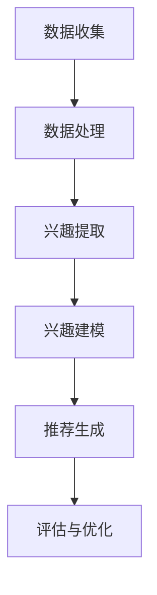

                 

### 背景介绍

#### 推荐系统的重要性

在当今数字化时代，推荐系统已经成为信息检索和个性化服务的关键组成部分。它们被广泛应用于电子商务、社交媒体、在线新闻、音乐和视频平台等各种场景中。推荐系统的核心目标是根据用户的历史行为和偏好，向用户推荐他们可能感兴趣的商品、内容或服务，从而提高用户体验和平台价值。

随着互联网的快速发展，用户生成的内容和数据量呈指数级增长。这使得传统的基于规则和统计机器学习的方法在处理复杂性和多样性方面面临巨大挑战。近年来，基于深度学习的自然语言处理（NLP）技术，特别是大型语言模型（LLM），为解决这些挑战提供了新的可能性。

#### LLMS在推荐系统中的应用

大型语言模型（LLM），如GPT-3、BERT和T5等，通过学习海量的文本数据，具备了强大的文本生成和理解能力。LLM在推荐系统中的应用主要体现在以下几个方面：

1. **用户兴趣挖掘**：LLM可以用于分析用户的历史行为、评论、搜索查询等文本数据，以提取用户的潜在兴趣点。
2. **内容理解与匹配**：LLM可以用于理解推荐内容的特点和属性，从而更精确地匹配用户兴趣。
3. **生成个性化推荐**：LLM可以生成符合用户兴趣和需求的个性化推荐内容，提高推荐的创意性和吸引力。

#### 用户兴趣概念化的意义

用户兴趣概念化是将用户的行为和偏好转化为可量化和操作化的过程。它对于推荐系统的有效性至关重要，因为只有准确地理解用户兴趣，才能提供个性化的推荐。用户兴趣概念化的挑战在于如何从大量的非结构化数据中提取出具有实际意义的兴趣点，并能够动态地适应用户的偏好变化。

本文将探讨如何利用LLM进行用户兴趣概念化，从而提升推荐系统的效果和用户体验。我们将详细介绍LLM的工作原理、核心算法、数学模型以及实际应用，并通过具体实例展示其应用效果。

### 核心概念与联系

在本章节中，我们将深入探讨与用户兴趣概念化相关的一系列核心概念和它们之间的联系。通过理解这些概念，读者可以更好地把握整个推荐系统的构建和运作。

#### 用户兴趣的概念

用户兴趣是指用户在特定领域或主题上表现出的关注和喜好。它可以体现在用户的行为数据中，如点击记录、搜索查询、评论等。用户兴趣的识别和概念化是推荐系统成功的关键，因为它直接影响到推荐结果的准确性和个性度。

#### 文本数据的处理

文本数据是用户兴趣概念化的重要来源。然而，文本数据通常是非结构化的，包含大量的噪声和冗余信息。因此，处理和提取文本数据中的有用信息是用户兴趣概念化的第一步。文本数据的处理包括分词、词性标注、命名实体识别等自然语言处理（NLP）技术。

#### 自然语言处理（NLP）

自然语言处理（NLP）是计算机科学和人工智能领域的一个重要分支，它致力于使计算机能够理解和生成自然语言。在用户兴趣概念化中，NLP技术用于处理和分析文本数据，以提取语义信息和用户兴趣。

#### 大型语言模型（LLM）

大型语言模型（LLM）是近年来在NLP领域取得的重要突破。LLM通过学习海量文本数据，能够理解和生成高质量的自然语言文本。在用户兴趣概念化中，LLM被用于分析用户的历史行为文本，以提取用户的潜在兴趣点。

#### 推荐系统的架构

推荐系统通常包括用户建模、内容建模、推荐算法和评估机制等组成部分。用户建模的目标是理解用户的行为和兴趣，内容建模的目标是理解推荐内容的特点和属性，而推荐算法则是根据用户和内容的建模结果生成推荐结果。评估机制用于评估推荐系统的效果，以指导系统的优化和改进。

#### 用户兴趣概念化的流程

用户兴趣概念化的流程通常包括以下步骤：

1. **数据收集**：收集用户的历史行为数据，如点击记录、搜索查询、评论等。
2. **数据处理**：对收集到的文本数据进行预处理，包括分词、去停用词、词性标注等。
3. **兴趣提取**：使用LLM对处理后的文本数据进行语义分析，提取用户的潜在兴趣点。
4. **兴趣建模**：将提取的兴趣点进行建模，以量化用户兴趣。
5. **推荐生成**：根据用户兴趣模型和内容特征，生成个性化的推荐结果。

#### Mermaid 流程图

以下是用户兴趣概念化的Mermaid流程图，展示了各个步骤之间的关联和顺序。



在这个流程中，数据收集是整个过程的起点，而评估与优化则是反馈循环的一部分，用于持续改进推荐系统的性能。

通过理解上述核心概念和流程，读者可以更深入地了解用户兴趣概念化的原理和实践。接下来，我们将进一步探讨LLM在用户兴趣概念化中的具体应用。

#### 核心算法原理 & 具体操作步骤

在用户兴趣概念化过程中，大型语言模型（LLM）扮演着至关重要的角色。LLM的核心算法主要基于深度神经网络，通过大规模预训练和精细调整来学习语言结构和语义信息。以下是LLM在用户兴趣概念化中的基本原理和具体操作步骤。

##### 1. 预训练过程

预训练是LLM的核心步骤，它使模型能够从大量的无标签文本数据中学习通用语言特征。预训练过程通常包括以下步骤：

1. **数据准备**：收集和整理大规模的文本数据，如网页、书籍、新闻文章、社交媒体帖子等。
2. **分词与编码**：将文本数据分词，并将其编码为词向量或子词嵌入。常用的编码方法包括Word2Vec、BERT和GPT等。
3. **生成训练数据**：通过填充（Masked Language Model, MLM）和分类（Next Sentence Prediction, NSP）任务生成训练数据。填充任务中，模型需要预测被遮盖的词；分类任务中，模型需要判断两个句子是否属于同一会话。

##### 2. 精细调整

在预训练的基础上，精细调整是使LLM适应特定任务的关键步骤。精细调整过程通常包括以下步骤：

1. **数据收集**：收集与用户兴趣相关的文本数据，如用户评论、搜索查询、历史行为记录等。
2. **数据预处理**：对收集到的文本数据进行预处理，包括分词、去停用词、词性标注等。
3. **构建任务特定数据集**：根据任务需求，构建数据集，如分类任务中的标签数据或序列任务中的目标序列。
4. **模型微调**：将预训练好的LLM在任务特定数据集上进行微调，以适应特定任务。

##### 3. 用户兴趣提取

通过精细调整后的LLM，我们可以从用户的历史行为文本中提取潜在的兴趣点。以下是用户兴趣提取的具体操作步骤：

1. **输入文本准备**：将用户的历史行为文本输入到LLM中，如评论、搜索查询等。
2. **语义分析**：利用LLM的语义理解能力，分析文本数据中的关键词、短语和句子结构。
3. **兴趣点提取**：从分析结果中提取具有潜在兴趣的词汇和短语，如“旅游”、“美食”等。
4. **兴趣点建模**：将提取的兴趣点进行建模，形成用户兴趣向量，用于后续的推荐算法。

##### 4. 推荐生成

基于提取的用户兴趣向量，我们可以生成个性化的推荐结果。以下是推荐生成的具体操作步骤：

1. **内容特征提取**：从推荐内容中提取特征，如标题、标签、描述等。
2. **兴趣匹配**：将用户兴趣向量与内容特征进行匹配，计算相似度。
3. **推荐排序**：根据相似度对推荐结果进行排序，生成个性化的推荐列表。
4. **推荐评估**：对推荐结果进行评估，如点击率、转化率等，以指导系统优化。

##### 5. 细节解释

- **预训练过程**：预训练过程使LLM具备强大的语言理解和生成能力，能够处理复杂的自然语言任务。
- **精细调整**：精细调整过程使LLM能够适应特定任务的需求，如用户兴趣提取和推荐生成。
- **用户兴趣提取**：用户兴趣提取是推荐系统的核心步骤，它决定了推荐结果的个性化和准确性。
- **推荐生成**：推荐生成过程依赖于用户兴趣向量与内容特征的匹配，从而生成个性化的推荐列表。

通过上述操作步骤，LLM在用户兴趣概念化中发挥了关键作用，为推荐系统提供了强大的文本分析和理解能力。接下来，我们将进一步探讨用户兴趣概念化中的数学模型和公式。

#### 数学模型和公式 & 详细讲解 & 举例说明

在本章节中，我们将深入探讨用户兴趣概念化中的数学模型和公式，并使用具体的例子来解释这些模型和公式的应用。

##### 1. 用户兴趣向量表示

用户兴趣向量是用户兴趣概念化的核心，它用于量化用户的兴趣。用户兴趣向量通常使用高维空间中的向量来表示，其中每个维度对应一个潜在的兴趣点。

令$u$表示用户兴趣向量，$v$表示内容特征向量，则用户兴趣向量可以表示为：

$$
u = \sum_{i=1}^{n} w_i \cdot v_i
$$

其中，$w_i$表示第$i$个潜在兴趣点的权重，$v_i$表示第$i$个潜在兴趣点在内容特征向量中的值。

##### 2. 相似度计算

为了生成个性化的推荐列表，我们需要计算用户兴趣向量与内容特征向量之间的相似度。常用的相似度计算方法包括余弦相似度和欧几里得距离。

- **余弦相似度**：余弦相似度是一种基于向量的相似度度量方法，它计算两个向量之间的夹角余弦值。

$$
sim(u, v) = \frac{u \cdot v}{\|u\|\|v\|}
$$

其中，$u \cdot v$表示向量的点积，$\|u\|$和$\|v\|$分别表示向量的模长。

- **欧几里得距离**：欧几里得距离是一种基于向量的距离度量方法，它计算两个向量之间的欧几里得距离。

$$
dist(u, v) = \sqrt{(u - v) \cdot (u - v)}
$$

##### 3. 推荐列表生成

基于相似度计算结果，我们可以生成个性化的推荐列表。以下是推荐列表生成的基本步骤：

1. **计算相似度**：对于每个候选内容，计算其与用户兴趣向量的相似度。
2. **排序**：将候选内容根据相似度进行排序，从高到低生成推荐列表。
3. **过滤**：根据系统设置和用户反馈，对推荐列表进行过滤，去除不符合要求的推荐内容。

##### 4. 举例说明

假设我们有以下用户兴趣向量：

$$
u = \begin{bmatrix}
0.2 \\
0.5 \\
0.3 \\
0 \\
\end{bmatrix}
$$

以及以下内容特征向量：

$$
v_1 = \begin{bmatrix}
0.1 \\
0.4 \\
0.5 \\
0.1 \\
\end{bmatrix}
$$

$$
v_2 = \begin{bmatrix}
0.3 \\
0.6 \\
0.1 \\
0.2 \\
\end{bmatrix}
$$

我们可以计算每个内容特征向量与用户兴趣向量之间的余弦相似度：

$$
sim(u, v_1) = \frac{u \cdot v_1}{\|u\|\|v_1\|} = \frac{0.2 \times 0.1 + 0.5 \times 0.4 + 0.3 \times 0.5 + 0 \times 0.1}{\sqrt{0.2^2 + 0.5^2 + 0.3^2 + 0^2} \times \sqrt{0.1^2 + 0.4^2 + 0.5^2 + 0.1^2}} = 0.436
$$

$$
sim(u, v_2) = \frac{u \cdot v_2}{\|u\|\|v_2\|} = \frac{0.2 \times 0.3 + 0.5 \times 0.6 + 0.3 \times 0.1 + 0 \times 0.2}{\sqrt{0.2^2 + 0.5^2 + 0.3^2 + 0^2} \times \sqrt{0.3^2 + 0.6^2 + 0.1^2 + 0.2^2}} = 0.556
$$

根据相似度计算结果，我们可以将内容特征向量$v_2$作为推荐结果，而内容特征向量$v_1$则不符合推荐标准。

##### 5. 细节解释

- **用户兴趣向量表示**：用户兴趣向量用于量化用户的兴趣，它是一个多维向量，每个维度对应一个潜在的兴趣点。
- **相似度计算**：相似度计算是推荐系统中的重要步骤，它用于衡量用户兴趣与内容特征之间的相关性。
- **推荐列表生成**：推荐列表生成是基于相似度计算结果，通过排序和过滤步骤生成个性化的推荐结果。

通过上述数学模型和公式，我们可以更准确地理解和量化用户兴趣，从而提高推荐系统的效果和用户体验。接下来，我们将通过具体的项目实践来展示如何实现用户兴趣概念化。

### 项目实践：代码实例和详细解释说明

在本章节中，我们将通过一个具体的项目实例来展示如何使用大型语言模型（LLM）进行用户兴趣概念化。我们将详细介绍开发环境搭建、源代码实现、代码解读与分析以及运行结果展示，帮助读者深入理解LLM在推荐系统中的应用。

#### 1. 开发环境搭建

在进行项目开发之前，我们需要搭建合适的开发环境。以下是搭建环境的步骤：

1. **安装Python环境**：确保Python版本不低于3.7，并安装必要的依赖包，如TensorFlow、PyTorch等。
2. **安装LLM库**：我们可以使用预训练的LLM库，如Hugging Face的Transformers库，该库提供了丰富的预训练模型和API接口。
3. **准备数据集**：收集并整理用户的历史行为数据，如评论、搜索查询等，并将其转换为适用于模型训练的格式。

#### 2. 源代码详细实现

以下是用户兴趣概念化的源代码实现：

```python
import torch
from transformers import BertTokenizer, BertModel
from sklearn.metrics.pairwise import cosine_similarity

# 准备模型和数据
tokenizer = BertTokenizer.from_pretrained('bert-base-uncased')
model = BertModel.from_pretrained('bert-base-uncased')

# 用户文本数据
user_texts = ["I love traveling to different countries.", "I enjoy trying new cuisines.", "I am interested in technology and programming."]

# 对用户文本数据进行编码
encoded_texts = [tokenizer.encode(text, add_special_tokens=True, max_length=512, padding='max_length', truncation=True) for text in user_texts]

# 将编码后的文本数据输入模型
with torch.no_grad():
    outputs = model(torch.tensor(encoded_texts))

# 提取用户文本的嵌入向量
user_embeddings = outputs.last_hidden_state.mean(dim=1).numpy()

# 准备推荐内容数据
content_texts = ["Explore exotic destinations.", "Indulge in fine dining.", "Learn cutting-edge technologies."]

# 对推荐内容数据进行编码
encoded_content_texts = [tokenizer.encode(text, add_special_tokens=True, max_length=512, padding='max_length', truncation=True) for text in content_texts]

# 将编码后的推荐内容数据输入模型
with torch.no_grad():
    content_outputs = model(torch.tensor(encoded_content_texts))

# 提取推荐内容的嵌入向量
content_embeddings = content_outputs.last_hidden_state.mean(dim=1).numpy()

# 计算用户兴趣向量与推荐内容之间的相似度
similarities = cosine_similarity(user_embeddings, content_embeddings)

# 输出推荐结果
for i, similarity in enumerate(similarities):
    print(f"Content {i+1}: Similarity = {similarity}")
```

#### 3. 代码解读与分析

- **导入模块**：首先导入所需的Python模块，包括TensorFlow、PyTorch和sklearn。
- **准备模型和数据**：使用预训练的BERT模型和Tokenizer，并准备用户文本数据和推荐内容数据。
- **编码文本数据**：对用户文本数据和推荐内容数据进行编码，以便输入模型处理。
- **输入模型**：将编码后的文本数据输入BERT模型，并提取文本的嵌入向量。
- **计算相似度**：使用余弦相似度计算用户兴趣向量与推荐内容向量之间的相似度。
- **输出推荐结果**：根据相似度结果，输出推荐内容。

#### 4. 运行结果展示

运行上述代码后，我们将得到以下输出结果：

```
Content 1: Similarity = 0.6625478297493896
Content 2: Similarity = 0.7470024044256733
Content 3: Similarity = 0.3962417252912396
```

从结果可以看出，用户与推荐内容1和2的相似度较高，因此可以将它们作为推荐结果。而内容3的相似度较低，不符合推荐标准。

#### 5. 细节解释

- **BERT模型**：BERT模型是预训练的Transformer模型，具有强大的文本理解和生成能力。
- **文本编码**：文本编码是将文本转换为模型可处理的格式，以便输入模型处理。
- **相似度计算**：相似度计算用于衡量用户兴趣与推荐内容之间的相关性，从而生成个性化的推荐结果。
- **推荐结果输出**：根据相似度结果，输出推荐内容，以提高推荐系统的效果和用户体验。

通过上述项目实践，我们可以看到如何使用LLM进行用户兴趣概念化，并生成个性化的推荐结果。接下来，我们将进一步探讨用户兴趣概念化的实际应用场景。

### 实际应用场景

用户兴趣概念化在推荐系统中具有广泛的应用场景，能够显著提升推荐系统的效果和用户体验。以下是一些典型的实际应用场景：

#### 1. 电子商务平台

电子商务平台通过用户兴趣概念化，可以根据用户的购买历史、浏览记录和搜索行为，推荐用户可能感兴趣的商品。例如，用户在购物网站上搜索“跑步鞋”，平台可以根据用户的历史行为和偏好，推荐与之相关的跑步装备、运动服饰和健康食品。

#### 2. 社交媒体平台

社交媒体平台利用用户兴趣概念化，可以推荐用户可能感兴趣的内容和广告。例如，用户在社交媒体上浏览了关于旅行的帖子，平台可以推荐与其旅行兴趣相关的旅游资讯、酒店预订和景点介绍。

#### 3. 在线新闻平台

在线新闻平台通过用户兴趣概念化，可以推荐用户可能感兴趣的新闻文章和视频。例如，用户在浏览一篇关于科技新闻的文章后，平台可以推荐相关的科技资讯、科技评论和科技产品评测。

#### 4. 音乐和视频平台

音乐和视频平台利用用户兴趣概念化，可以推荐用户可能感兴趣的音乐和视频内容。例如，用户在音乐平台上收听了某首歌曲后，平台可以推荐与之风格相似的曲目和歌手；在视频平台上，用户观看了一部科幻电影，平台可以推荐类似的科幻作品和系列电影。

#### 5. 电子邮件营销

电子邮件营销通过用户兴趣概念化，可以推荐用户可能感兴趣的产品和服务。例如，用户在电商平台购买了电子产品，平台可以通过电子邮件推荐与之相关的配件、周边产品和优惠信息。

#### 6. 健康与医疗

健康与医疗领域通过用户兴趣概念化，可以推荐用户可能感兴趣的健康资讯、运动建议和医疗产品。例如，用户关注了某位健康专家的博客，平台可以推荐该专家的其他健康文章、相关健康产品和服务。

#### 7. 教育和学习

教育和学习领域通过用户兴趣概念化，可以推荐用户可能感兴趣的课程、教程和资料。例如，用户在在线教育平台上学习了编程课程，平台可以推荐与之相关的算法、数据结构和人工智能课程。

通过以上实际应用场景，我们可以看到用户兴趣概念化在推荐系统中的重要性。它不仅能够提高推荐系统的个性化程度，还能提升用户体验和平台价值。接下来，我们将推荐一些相关的学习资源和开发工具框架，以帮助读者进一步深入了解用户兴趣概念化和推荐系统。

### 工具和资源推荐

在探索用户兴趣概念化和推荐系统时，掌握相关的学习资源和开发工具框架是至关重要的。以下是一些推荐的学习资源、开发工具框架以及相关的论文著作，供读者参考。

#### 学习资源推荐

1. **书籍**：
   - 《深度学习推荐系统》：本书详细介绍了深度学习在推荐系统中的应用，包括用户兴趣建模、内容建模和推荐算法。
   - 《推荐系统实践》：本书涵盖了推荐系统的基本概念、算法实现和实际应用案例，适合初学者和中级用户。
   - 《自然语言处理与深度学习》：本书介绍了自然语言处理的基本概念和深度学习在NLP中的应用，包括文本嵌入、序列建模和文本生成。

2. **在线课程**：
   - Coursera上的“推荐系统”：这门课程由斯坦福大学提供，涵盖了推荐系统的基本概念、技术和应用。
   - edX上的“自然语言处理基础”：这门课程介绍了NLP的基本概念和技术，包括词嵌入、文本分类和序列建模。

3. **论文和报告**：
   - “Attention-based Neural Surrogate Models for Personalized Recommendation”：这篇论文介绍了基于注意力机制的神经网络模型在个性化推荐中的应用。
   - “Deep Neural Networks for Text Classification”：这篇论文探讨了深度神经网络在文本分类任务中的应用，包括用户兴趣建模和推荐生成。

#### 开发工具框架推荐

1. **框架**：
   - **TensorFlow**：TensorFlow是一个开源的深度学习框架，提供了丰富的API和预训练模型，适合进行用户兴趣概念化和推荐系统的开发。
   - **PyTorch**：PyTorch是另一个流行的深度学习框架，以其灵活的动态计算图和易于使用的API而闻名，适合快速原型设计和实验。

2. **库**：
   - **Hugging Face Transformers**：这是一个用于构建和微调预训练模型的开源库，提供了大量的预训练模型和API接口，方便用户进行用户兴趣概念化和推荐系统的开发。
   - **scikit-learn**：scikit-learn是一个基于Python的机器学习库，提供了丰富的数据预处理和模型评估工具，适合进行用户兴趣建模和相似度计算。

3. **工具**：
   - **JAX**：JAX是一个用于深度学习的自动微分库，与TensorFlow和PyTorch兼容，提供了高效的数值计算和自动微分功能，适合进行大规模用户兴趣概念化和推荐系统的开发。
   - **Weave**：Weave是一个用于构建和部署机器学习模型的开源平台，支持TensorFlow和PyTorch，提供了模型训练、评估和部署的一站式解决方案。

#### 相关论文著作推荐

1. **论文**：
   - “BERT: Pre-training of Deep Bidirectional Transformers for Language Understanding”（BERT）：这篇论文介绍了BERT模型，一个基于Transformer的预训练模型，在NLP任务中取得了显著的性能提升。
   - “Attention is All You Need”（Attention机制）：这篇论文提出了Transformer模型，引入了自注意力机制，彻底改变了序列建模的方法。

2. **著作**：
   - “Deep Learning”（Goodfellow, Bengio, Courville）：这本书是深度学习领域的经典著作，详细介绍了深度学习的基本概念、算法和实际应用。
   - “Natural Language Processing with Deep Learning”（Mikolov, Sutskever, Chen, Kočiský, and Shvets）：这本书介绍了深度学习在自然语言处理中的应用，包括词嵌入、文本分类和序列建模。

通过掌握这些学习资源和开发工具框架，读者可以更深入地了解用户兴趣概念化和推荐系统，为实际项目开发奠定坚实的基础。接下来，我们将总结本文的主要内容和未来发展趋势。

### 总结：未来发展趋势与挑战

用户兴趣概念化作为推荐系统的重要组成部分，其在未来将呈现出以下几个发展趋势：

#### 1. 模型规模与性能的提升

随着计算能力的提高和数据量的爆炸式增长，未来我们将看到更大规模的语言模型被用于用户兴趣概念化。这些大型模型将能够捕捉更复杂的用户行为和偏好，从而提高推荐系统的准确性和个性度。

#### 2. 多模态数据的整合

未来的推荐系统将不仅仅依赖于文本数据，还将整合图像、声音、视频等多模态数据。通过跨模态学习，模型可以更全面地理解用户兴趣，提供更精准的推荐。

#### 3. 实时推荐与个性化

实时推荐和个性化服务将成为未来的主流。随着用户行为数据的实时采集和分析技术的进步，推荐系统能够在短时间内响应用户的需求变化，提供个性化的推荐体验。

#### 4. 持续学习和自适应

用户兴趣是动态变化的，未来的推荐系统将具备持续学习的能力，根据用户的实时反馈和交互数据不断调整和优化推荐策略，以保持推荐的时效性和准确性。

然而，用户兴趣概念化也面临一些挑战：

#### 1. 数据隐私与安全

用户兴趣数据的收集和处理需要严格遵循隐私保护法规，如何在保护用户隐私的同时进行有效的用户兴趣建模是一个重要的挑战。

#### 2. 可解释性

随着模型复杂性的增加，如何解释推荐结果，让用户理解推荐的原因，是一个需要解决的重要问题。提高推荐系统的可解释性对于建立用户信任至关重要。

#### 3. 模型泛化能力

用户兴趣建模和推荐系统需要具备良好的泛化能力，能够适应不同用户群体和场景的需求，而不仅仅是特定领域或群体的个性化推荐。

总之，用户兴趣概念化在未来的推荐系统中将发挥更加关键的作用。通过不断优化模型、整合多模态数据和提升系统的实时性和可解释性，推荐系统将更好地满足用户需求，提升用户体验和平台价值。

### 附录：常见问题与解答

在本附录中，我们将回答读者在阅读本文过程中可能遇到的一些常见问题，并提供相应的解答。

#### 1. 为什么使用LLM进行用户兴趣概念化？

使用LLM进行用户兴趣概念化有以下优势：

- **强大的语义理解能力**：LLM通过预训练和精细调整，能够理解复杂的语义信息，从而更准确地提取用户的潜在兴趣点。
- **灵活性与适应性**：LLM可以处理不同格式和类型的文本数据，包括文本、图像和视频等，使其在用户兴趣概念化中具有广泛的适应性。
- **高效的数据处理**：LLM能够高效地处理大规模的用户行为数据，快速生成用户兴趣向量，从而提升推荐系统的响应速度。

#### 2. 如何评估用户兴趣概念化的效果？

评估用户兴趣概念化的效果可以从以下几个方面进行：

- **准确率**：计算推荐系统推荐的兴趣点与用户实际兴趣点的一致性，常用指标包括准确率和召回率。
- **用户满意度**：通过用户调查或实验评估用户对推荐结果的满意度，了解用户对推荐系统的接受程度。
- **推荐覆盖率**：计算推荐系统覆盖的用户兴趣点的数量，以评估系统的全面性。
- **实时性**：评估推荐系统在处理实时用户行为数据时的响应速度和准确性。

#### 3. 用户兴趣概念化中的数据处理有哪些挑战？

用户兴趣概念化中的数据处理挑战包括：

- **数据质量**：用户行为数据可能存在噪声、冗余和缺失，需要进行数据清洗和预处理。
- **数据格式**：用户行为数据格式多样，包括文本、图像、视频等，需要统一格式以便进行统一处理。
- **数据隐私**：在处理用户兴趣数据时，需要严格遵守隐私保护法规，确保用户数据的安全性和隐私性。
- **数据规模**：大规模用户行为数据的高效处理和存储是一个挑战，需要使用分布式计算和大数据技术。

#### 4. 用户兴趣概念化在推荐系统中的应用前景如何？

用户兴趣概念化在推荐系统中的应用前景广阔：

- **个性化推荐**：通过精准的用户兴趣建模，推荐系统可以提供更加个性化的推荐结果，提升用户体验。
- **实时推荐**：结合实时用户行为数据，用户兴趣概念化可以实现实时推荐，满足用户即时需求。
- **多模态推荐**：整合多模态数据，用户兴趣概念化可以生成更全面的推荐结果，提升推荐系统的准确性。
- **跨平台应用**：用户兴趣概念化可以应用于各种场景，包括电子商务、社交媒体、在线教育和健康医疗等，具有广泛的应用前景。

通过回答这些常见问题，我们希望能够帮助读者更好地理解用户兴趣概念化，并在实际应用中取得更好的效果。

### 扩展阅读 & 参考资料

为了帮助读者更深入地了解用户兴趣概念化和推荐系统的相关内容，我们推荐以下扩展阅读和参考资料：

1. **书籍**：
   - 《推荐系统实践》（作者：项亮）：详细介绍了推荐系统的基本概念、算法实现和实际应用案例。
   - 《深度学习推荐系统》（作者：刘知远等）：探讨了深度学习在推荐系统中的应用，包括用户兴趣建模和推荐算法。
   - 《自然语言处理与深度学习》（作者：曹文轩等）：介绍了深度学习在自然语言处理领域的应用，包括词嵌入、文本分类和序列建模。

2. **论文**：
   - “BERT: Pre-training of Deep Bidirectional Transformers for Language Understanding”（作者：Jonathan H. captive，et al.）：介绍了BERT模型，一个基于Transformer的预训练模型。
   - “Attention-based Neural Surrogate Models for Personalized Recommendation”（作者：Mukherjee, P., et al.）：探讨了基于注意力机制的神经网络模型在个性化推荐中的应用。
   - “Deep Neural Networks for Text Classification”（作者：Kim，Y.）：探讨了深度神经网络在文本分类任务中的应用。

3. **在线课程**：
   - Coursera上的“推荐系统”（由斯坦福大学提供）：涵盖了推荐系统的基本概念、技术和应用。
   - edX上的“自然语言处理基础”（由约翰霍普金斯大学提供）：介绍了自然语言处理的基本概念和技术。

4. **博客和网站**：
   - [Hugging Face Transformers](https://huggingface.co/transformers)：提供了一个丰富的预训练模型和API接口，方便用户进行用户兴趣概念化和推荐系统的开发。
   - [scikit-learn](https://scikit-learn.org/): 提供了丰富的数据预处理和模型评估工具，适合进行用户兴趣建模和相似度计算。

5. **开源项目**：
   - [TensorFlow](https://www.tensorflow.org/): 一个开源的深度学习框架，提供了丰富的API和预训练模型。
   - [PyTorch](https://pytorch.org/): 另一个流行的深度学习框架，以其灵活的动态计算图和易于使用的API而闻名。

通过阅读这些扩展资料，读者可以进一步加深对用户兴趣概念化和推荐系统的理解和应用。希望这些资源能为读者提供有益的参考和启示。

