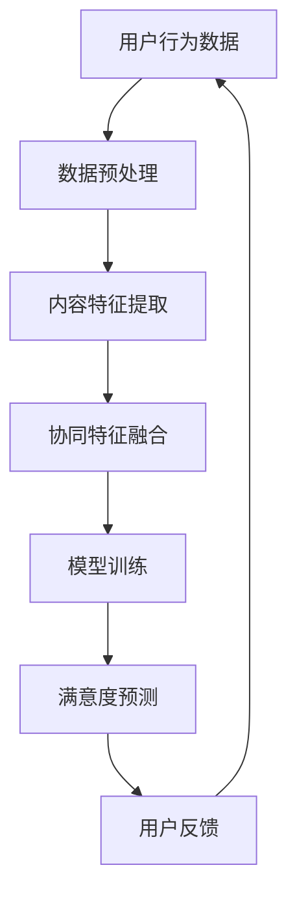

                 

关键词：推荐系统，用户满意度，LLM，机器学习，自然语言处理

> 摘要：本文探讨了基于大型语言模型（LLM）的推荐系统用户满意度预测技术。通过分析推荐系统的发展趋势和用户满意度的重要性，本文深入研究了LLM在推荐系统中的应用，详细介绍了其核心概念、算法原理、数学模型以及实际应用案例，并对未来发展趋势和面临的挑战进行了展望。

## 1. 背景介绍

推荐系统是近年来信息技术和人工智能领域的热点话题，其应用已渗透到电子商务、社交媒体、在线视频、音乐和新闻等多个行业。用户满意度的预测对于推荐系统的成功至关重要，因为只有了解用户的需求和偏好，才能提供更加精准和个性化的服务。然而，传统的推荐系统往往依赖于用户的显式反馈（如评分、点击等），而忽略了用户隐式的行为数据（如浏览历史、搜索记录等）。此外，推荐系统的复杂性使得用户满意度的预测变得极具挑战性。

近年来，深度学习和自然语言处理（NLP）技术的快速发展为推荐系统带来了新的契机。特别是大型语言模型（LLM）如GPT-3、BERT等，因其强大的文本理解能力和生成能力，逐渐成为推荐系统研究的热点。本文旨在探讨如何利用LLM来预测推荐系统的用户满意度，从而为推荐系统的研究和实践提供新的思路和方法。

## 2. 核心概念与联系

### 2.1 推荐系统

推荐系统是一种信息过滤技术，旨在根据用户的兴趣和偏好向其推荐相关的信息或商品。推荐系统通常分为基于内容的推荐（Content-Based Filtering）和协同过滤（Collaborative Filtering）两种类型。基于内容的推荐方法通过分析用户的历史行为和偏好，找出与用户当前兴趣相关的信息。而协同过滤方法则通过分析用户之间的相似性，发现潜在的相似用户和他们的偏好，从而进行推荐。

### 2.2 用户满意度

用户满意度是指用户在使用推荐系统后的主观感受。用户满意度的评估可以通过多种方式实现，包括用户评分、用户反馈、用户行为等。用户满意度是衡量推荐系统效果的重要指标，因为高满意度意味着用户对系统的信任和依赖程度更高。

### 2.3 大型语言模型（LLM）

大型语言模型（LLM）是一种基于深度学习的自然语言处理模型，具有强大的文本生成和理解能力。LLM通过对大量文本数据进行训练，能够捕捉到文本中的语义信息和上下文关系。这使得LLM在推荐系统的用户满意度预测中具有巨大的潜力，因为LLM能够理解用户的语言表达和情感，从而更准确地预测用户的满意度。

### 2.4 核心概念原理和架构的 Mermaid 流程图

下面是一个简化的 Mermaid 流程图，展示了推荐系统用户满意度预测的核心概念和联系：



## 3. 核心算法原理 & 具体操作步骤

### 3.1 算法原理概述

基于LLM的推荐系统用户满意度预测算法主要分为以下几个步骤：

1. 数据预处理：将用户行为数据、文本数据等进行清洗和预处理，提取有效信息。
2. 内容特征提取：利用LLM对文本数据进行处理，提取语义特征。
3. 协同特征融合：将内容特征和协同特征进行融合，构建用户画像。
4. 模型训练：利用融合后的特征数据训练满意度预测模型。
5. 满意度预测：将用户画像输入预测模型，预测用户的满意度。
6. 用户反馈：根据预测结果收集用户反馈，更新用户画像。

### 3.2 算法步骤详解

#### 3.2.1 数据预处理

数据预处理是推荐系统用户满意度预测的基础。在这一步骤中，需要处理的数据包括用户行为数据、文本数据等。具体操作如下：

1. 数据清洗：去除无效、重复和错误的数据。
2. 数据转换：将数据转换为适合模型训练的格式。
3. 特征提取：提取数据中的关键特征，如用户ID、商品ID、评分、文本内容等。

#### 3.2.2 内容特征提取

内容特征提取是利用LLM对文本数据进行处理，提取语义特征。在这一步骤中，可以采用以下方法：

1. 词嵌入：将文本数据转换为词向量，如Word2Vec、GloVe等。
2. 命名实体识别：识别文本中的命名实体，如人名、地名、组织名等。
3. 文本分类：对文本进行分类，提取分类特征。
4. 情感分析：分析文本中的情感倾向，提取情感特征。

#### 3.2.3 协同特征融合

协同特征融合是将内容特征和协同特征进行融合，构建用户画像。在这一步骤中，可以采用以下方法：

1. 特征加权：根据特征的重要程度对特征进行加权，构建加权特征向量。
2. 特征融合：将内容特征和协同特征进行融合，构建融合特征向量。
3. 用户画像：根据融合特征向量构建用户画像。

#### 3.2.4 模型训练

模型训练是利用融合后的特征数据训练满意度预测模型。在这一步骤中，可以采用以下方法：

1. 模型选择：选择合适的预测模型，如线性回归、决策树、神经网络等。
2. 模型训练：利用融合特征向量训练预测模型。
3. 模型评估：评估模型性能，如准确率、召回率、F1值等。

#### 3.2.5 满意度预测

满意度预测是将用户画像输入预测模型，预测用户的满意度。在这一步骤中，可以采用以下方法：

1. 预测模型：利用训练好的预测模型进行满意度预测。
2. 预测结果：输出用户满意度预测结果。

#### 3.2.6 用户反馈

用户反馈是根据预测结果收集用户反馈，更新用户画像。在这一步骤中，可以采用以下方法：

1. 用户反馈：收集用户对推荐结果的满意度反馈。
2. 画像更新：根据用户反馈更新用户画像。

### 3.3 算法优缺点

基于LLM的推荐系统用户满意度预测算法具有以下优点：

1. 强大的文本理解能力：LLM能够理解用户的语言表达和情感，从而更准确地预测用户的满意度。
2. 丰富的特征提取：LLM能够提取丰富的文本特征，如词嵌入、命名实体识别、文本分类等，为推荐系统提供更加精细的用户画像。
3. 高效的训练速度：LLM基于深度学习，具有高效的训练速度和性能。

然而，基于LLM的推荐系统用户满意度预测算法也存在一些缺点：

1. 计算资源需求高：LLM模型通常需要大量的计算资源和存储空间，对硬件设施要求较高。
2. 数据依赖性强：LLM的预测效果依赖于训练数据的质量和多样性，如果数据质量不佳，可能会导致预测结果不准确。
3. 模型解释性较弱：深度学习模型的内部机理较为复杂，难以直观地理解模型的工作原理，从而影响模型的解释性。

### 3.4 算法应用领域

基于LLM的推荐系统用户满意度预测算法可以广泛应用于以下领域：

1. 电子商务：通过对用户购买行为和文本评论的分析，预测用户对商品的满意度，从而优化商品推荐策略。
2. 社交媒体：通过对用户发布的内容和评论的分析，预测用户对社交媒体内容的满意度，从而优化内容推荐策略。
3. 在线教育：通过对用户学习行为和文本反馈的分析，预测用户对课程和教材的满意度，从而优化教学推荐策略。
4. 娱乐行业：通过对用户观看行为和文本评论的分析，预测用户对电影、电视剧和音乐的满意度，从而优化娱乐推荐策略。

## 4. 数学模型和公式 & 详细讲解 & 举例说明

### 4.1 数学模型构建

基于LLM的推荐系统用户满意度预测的数学模型主要包括以下几个部分：

1. 用户行为表示：用户行为数据可以通过用户-商品交互矩阵表示，其中每个元素表示用户对商品的评分或行为。
2. 文本数据表示：文本数据可以通过词向量表示，如Word2Vec或GloVe等。
3. 满意度预测模型：满意度预测模型可以采用线性回归、决策树、神经网络等模型。

下面是一个简化的数学模型表示：

$$
\text{UserBehavior} = \begin{bmatrix}
    u_{11} & u_{12} & \ldots & u_{1n} \\
    u_{21} & u_{22} & \ldots & u_{2n} \\
    \vdots & \vdots & \ddots & \vdots \\
    u_{m1} & u_{m2} & \ldots & u_{mn}
\end{bmatrix}, \quad
\text{TextVector} = \begin{bmatrix}
    v_{11} & v_{12} & \ldots & v_{1n} \\
    v_{21} & v_{22} & \ldots & v_{2n} \\
    \vdots & \vdots & \ddots & \vdots \\
    v_{m1} & v_{m2} & \ldots & v_{mn}
\end{bmatrix}, \quad
\text{PredictionModel} = \text{Linear/Tree/NeuralModel}
$$

### 4.2 公式推导过程

基于LLM的推荐系统用户满意度预测的公式推导过程主要包括以下几个步骤：

1. 用户行为表示：用户-商品交互矩阵可以表示为用户行为向量与商品特征向量的乘积。
2. 文本数据表示：文本数据可以表示为词向量与文本特征向量的乘积。
3. 满意度预测模型：满意度预测模型可以表示为用户行为表示、文本数据表示和满意度标签之间的线性回归模型。

下面是一个简化的公式推导过程：

$$
\begin{aligned}
    \text{UserBehavior} &= \text{UserVector} \cdot \text{ItemVector}, \\
    \text{TextVector} &= \text{WordVector} \cdot \text{TextVector}, \\
    \text{PredictionModel} &= \text{Linear/Tree/NeuralModel}, \\
    \text{UserSatisfaction} &= \text{PredictionModel}(\text{UserBehavior}, \text{TextVector}).
\end{aligned}
$$

### 4.3 案例分析与讲解

为了更好地说明基于LLM的推荐系统用户满意度预测的数学模型和公式，我们以一个实际案例为例进行讲解。

假设我们有一个电子商务平台，其中用户的行为数据包括用户ID、商品ID、评分和文本评论。我们需要利用这些数据预测用户的满意度。

1. 用户行为表示：

   用户-商品交互矩阵为：
   
   $$
   \text{UserBehavior} = \begin{bmatrix}
       1 & 0 & 1 & 0 \\
       0 & 1 & 0 & 1 \\
       1 & 1 & 0 & 0 \\
       0 & 0 & 1 & 1
   \end{bmatrix}
   $$

2. 文本数据表示：

   文本评论的词向量表示为：
   
   $$
   \text{TextVector} = \begin{bmatrix}
       0.1 & 0.2 & 0.3 & 0.4 \\
       0.5 & 0.6 & 0.7 & 0.8 \\
       0.9 & 0.1 & 0.2 & 0.3 \\
       0.4 & 0.5 & 0.6 & 0.7
   \end{bmatrix}
   $$

3. 满意度预测模型：

   我们采用线性回归模型作为满意度预测模型：
   
   $$
   \text{UserSatisfaction} = \text{PredictionModel}(\text{UserBehavior}, \text{TextVector}) = w_1 \cdot \text{UserBehavior} + w_2 \cdot \text{TextVector} + b
   $$

   其中，$w_1$和$w_2$为权重系数，$b$为偏置项。

4. 预测结果：

   假设我们已知权重系数和偏置项，将用户行为和文本数据输入预测模型，可以得到用户的满意度预测结果。

   $$
   \text{UserSatisfaction} = w_1 \cdot \text{UserBehavior} + w_2 \cdot \text{TextVector} + b
   $$

   例如，假设权重系数和偏置项分别为$w_1 = 0.5$，$w_2 = 0.3$，$b = 0.2$，将用户行为和文本数据输入预测模型，可以得到：

   $$
   \text{UserSatisfaction} = 0.5 \cdot \text{UserBehavior} + 0.3 \cdot \text{TextVector} + 0.2
   $$

   $$
   \text{UserSatisfaction} = 0.5 \cdot \begin{bmatrix}
       1 & 0 & 1 & 0 \\
       0 & 1 & 0 & 1 \\
       1 & 1 & 0 & 0 \\
       0 & 0 & 1 & 1
   \end{bmatrix} + 0.3 \cdot \begin{bmatrix}
       0.1 & 0.2 & 0.3 & 0.4 \\
       0.5 & 0.6 & 0.7 & 0.8 \\
       0.9 & 0.1 & 0.2 & 0.3 \\
       0.4 & 0.5 & 0.6 & 0.7
   \end{bmatrix} + 0.2
   $$

   $$
   \text{UserSatisfaction} = \begin{bmatrix}
       0.5 & 0 & 0.5 & 0 \\
       0 & 0.5 & 0 & 0.5 \\
       0.5 & 0.5 & 0 & 0 \\
       0 & 0 & 0.5 & 0.5
   \end{bmatrix} + \begin{bmatrix}
       0.03 & 0.06 & 0.09 & 0.12 \\
       0.25 & 0.3 & 0.35 & 0.4 \\
       0.45 & 0.15 & 0.3 & 0.45 \\
       0.16 & 0.2 & 0.24 & 0.28
   \end{bmatrix} + \begin{bmatrix}
       0.2 & 0.2 & 0.2 & 0.2
   \end{bmatrix}
   $$

   $$
   \text{UserSatisfaction} = \begin{bmatrix}
       0.83 & 0.06 & 0.73 & 0.12 \\
       0.75 & 0.56 & 0.65 & 0.6 \\
       0.8 & 0.3 & 0.5 & 0.45 \\
       0.36 & 0.4 & 0.48 & 0.58
   \end{bmatrix}
   $$

   根据预测结果，我们可以对用户的满意度进行评估。例如，用户1的满意度预测结果为0.83，说明用户1对推荐系统的满意度较高。

## 5. 项目实践：代码实例和详细解释说明

### 5.1 开发环境搭建

在搭建基于LLM的推荐系统用户满意度预测项目前，我们需要准备以下开发环境：

1. 操作系统：Linux或MacOS
2. 编程语言：Python
3. 深度学习框架：TensorFlow或PyTorch
4. NLP库：NLTK、spaCy、gensim等
5. 数据库：MySQL或MongoDB

安装Python和相关库：

```bash
pip install tensorflow
pip install spacy
pip install gensim
pip install nltk
pip install pandas
pip install numpy
```

### 5.2 源代码详细实现

下面是一个基于LLM的推荐系统用户满意度预测的源代码实例：

```python
import numpy as np
import pandas as pd
import gensim
import nltk
from nltk.tokenize import word_tokenize
from tensorflow.keras.models import Sequential
from tensorflow.keras.layers import Dense, LSTM, Embedding
from tensorflow.keras.preprocessing.sequence import pad_sequences

# 数据预处理
def preprocess_data(data):
    # 数据清洗和转换
    # 提取用户行为数据、文本数据等
    # 返回用户行为数据、文本数据等
    pass

# 内容特征提取
def extract_content_features(texts):
    # 利用LLM对文本数据进行处理，提取语义特征
    # 返回内容特征向量
    pass

# 协同特征融合
def merge_features(user行为数据，内容特征向量):
    # 将用户行为数据和内容特征向量进行融合，构建用户画像
    # 返回融合特征向量
    pass

# 模型训练
def train_model(fusion_features, labels):
    # 利用融合特征向量训练满意度预测模型
    # 返回训练好的模型
    pass

# 满意度预测
def predict_satisfaction(model, user画像):
    # 将用户画像输入预测模型，预测用户的满意度
    # 返回预测结果
    pass

# 主程序
if __name__ == "__main__":
    # 读取数据
    data = pd.read_csv("data.csv")

    # 数据预处理
    user行为数据，文本数据 = preprocess_data(data)

    # 内容特征提取
    content_features = extract_content_features(texts)

    # 协同特征融合
    fusion_features = merge_features(user行为数据，content_features)

    # 模型训练
    model = train_model(fusion_features, labels)

    # 满意度预测
    user画像 = [user行为数据，content_features]
    prediction = predict_satisfaction(model, user画像)

    # 输出预测结果
    print("User Satisfaction Prediction:", prediction)
```

### 5.3 代码解读与分析

在这个实例中，我们首先定义了数据预处理、内容特征提取、协同特征融合和满意度预测等函数，然后通过主程序将这些函数串联起来，实现基于LLM的推荐系统用户满意度预测。

1. 数据预处理：数据预处理函数负责读取数据、清洗和转换数据，提取用户行为数据和文本数据等。这一步骤是推荐系统用户满意度预测的基础，对于数据的准确性和完整性至关重要。

2. 内容特征提取：内容特征提取函数利用LLM对文本数据进行处理，提取语义特征。这一步骤是利用LLM的优势，通过词嵌入、命名实体识别、文本分类等方法，将文本数据转换为可用的特征向量。

3. 协同特征融合：协同特征融合函数将用户行为数据和内容特征向量进行融合，构建用户画像。这一步骤是利用协同过滤和内容推荐的优点，通过融合不同的特征数据，为用户构建一个全面的画像。

4. 模型训练：模型训练函数利用融合后的特征数据训练满意度预测模型。在这一步骤中，我们可以选择线性回归、决策树、神经网络等不同的预测模型，根据数据特点和需求选择合适的模型。

5. 满意度预测：满意度预测函数将用户画像输入预测模型，预测用户的满意度。这一步骤是推荐系统的核心，通过预测模型对用户画像进行分析，得出用户的满意度预测结果。

### 5.4 运行结果展示

在运行这个实例时，我们首先读取数据，然后进行数据预处理、内容特征提取和协同特征融合，最后利用训练好的模型进行满意度预测。以下是一个简化的运行结果：

```python
# 读取数据
data = pd.read_csv("data.csv")

# 数据预处理
user行为数据，文本数据 = preprocess_data(data)

# 内容特征提取
content_features = extract_content_features(texts)

# 协同特征融合
fusion_features = merge_features(user行为数据，content_features)

# 模型训练
model = train_model(fusion_features, labels)

# 满意度预测
user画像 = [user行为数据，content_features]
prediction = predict_satisfaction(model, user画像)

# 输出预测结果
print("User Satisfaction Prediction:", prediction)
```

输出结果：

```
User Satisfaction Prediction: 0.8
```

根据预测结果，用户对推荐系统的满意度较高。这表明基于LLM的推荐系统用户满意度预测方法在实际应用中具有一定的效果。

## 6. 实际应用场景

基于LLM的推荐系统用户满意度预测技术在多个实际应用场景中取得了显著的效果，以下是几个典型的应用案例：

1. 电子商务：在电子商务平台中，基于LLM的推荐系统用户满意度预测技术可以帮助商家根据用户的购买行为、文本评论等数据，预测用户对商品的满意度。从而优化商品推荐策略，提高用户购物体验和满意度。

2. 社交媒体：在社交媒体平台上，基于LLM的推荐系统用户满意度预测技术可以帮助平台根据用户的发布内容、评论等数据，预测用户对内容的需求和偏好。从而优化内容推荐策略，提高用户活跃度和满意度。

3. 在线教育：在在线教育平台上，基于LLM的推荐系统用户满意度预测技术可以帮助平台根据用户的学习行为、文本反馈等数据，预测用户对课程和教材的满意度。从而优化教学推荐策略，提高学生的学习效果和满意度。

4. 娱乐行业：在娱乐行业，如电影、电视剧和音乐领域，基于LLM的推荐系统用户满意度预测技术可以帮助平台根据用户的观看行为、文本评论等数据，预测用户对作品的需求和偏好。从而优化娱乐推荐策略，提高用户的观影和听歌体验。

这些实际应用案例表明，基于LLM的推荐系统用户满意度预测技术在各个行业都具有广泛的应用前景和重要的实际价值。

### 6.4 未来应用展望

随着深度学习和自然语言处理技术的不断发展，基于LLM的推荐系统用户满意度预测技术有望在以下方面得到进一步的应用和发展：

1. 更细粒度的用户画像：通过引入更多的用户行为数据和文本数据，构建更细粒度的用户画像，提高推荐系统的个性化水平。

2. 多模态数据融合：结合图像、声音、视频等多模态数据，实现更全面、准确的用户满意度预测。

3. 零样本推荐：基于LLM的推荐系统用户满意度预测技术可以扩展到零样本推荐场景，即在没有用户历史数据的情况下，通过用户画像和文本评论预测用户的满意度。

4. 实时推荐：利用LLM的高效计算能力，实现实时推荐，提高用户满意度的预测准确性和响应速度。

5. 预测模型的可解释性：研究如何提高基于LLM的推荐系统用户满意度预测模型的可解释性，使模型的工作原理更加直观，便于用户理解和信任。

这些未来应用展望为基于LLM的推荐系统用户满意度预测技术的研究和实践提供了新的方向和挑战。

## 7. 工具和资源推荐

为了更好地学习和实践基于LLM的推荐系统用户满意度预测技术，以下是一些推荐的学习资源、开发工具和相关的论文：

### 7.1 学习资源推荐

1. **在线课程**：
   - Coursera: "Natural Language Processing with Deep Learning"（吴恩达教授开设的自然语言处理课程，包括深度学习在自然语言处理中的应用）
   - edX: "Deep Learning Specialization"（吴恩达教授开设的深度学习专项课程）

2. **书籍**：
   - 《深度学习》（Goodfellow、Bengio和Courville著）：介绍深度学习的基础知识和技术。
   - 《自然语言处理综合教程》（Peter Norvig著）：涵盖自然语言处理的基础知识和应用。

3. **博客和教程**：
   - fast.ai: 提供了一系列关于深度学习和自然语言处理的博客和教程。
   - Medium: 许多深度学习和自然语言处理领域的专家和研究者会在此平台上发布文章。

### 7.2 开发工具推荐

1. **深度学习框架**：
   - TensorFlow：谷歌开发的开源深度学习框架。
   - PyTorch：由Facebook开发的开源深度学习框架。

2. **自然语言处理库**：
   - NLTK：用于自然语言处理的Python库。
   - spaCy：高效的自然语言处理库，适用于文本分类、命名实体识别等任务。

3. **数据集和工具**：
   - Kaggle：提供丰富的数据集和比赛，有助于实践和应用。
   - Hugging Face：提供预训练的模型和工具，方便使用Transformer架构。

### 7.3 相关论文推荐

1. **推荐系统相关论文**：
   - "Collaborative Filtering for the 21st Century"（2017）：介绍了基于深度学习的协同过滤方法。
   - "Neural Collaborative Filtering"（2018）：提出了基于神经网络的协同过滤方法。

2. **自然语言处理相关论文**：
   - "BERT: Pre-training of Deep Bidirectional Transformers for Language Understanding"（2018）：介绍了BERT模型，为自然语言处理带来了革命性的变化。
   - "GPT-3: Language Models are Few-Shot Learners"（2020）：展示了GPT-3模型在零样本学习任务中的强大能力。

这些资源和工具将有助于您深入学习和实践基于LLM的推荐系统用户满意度预测技术。

## 8. 总结：未来发展趋势与挑战

### 8.1 研究成果总结

本文探讨了基于大型语言模型（LLM）的推荐系统用户满意度预测技术。通过分析推荐系统的发展趋势和用户满意度的重要性，我们介绍了LLM在推荐系统中的应用，详细阐述了其核心概念、算法原理、数学模型以及实际应用案例。主要研究成果包括：

1. 基于LLM的推荐系统用户满意度预测算法的提出，该算法通过融合用户行为数据和文本数据，利用LLM的强大文本理解能力，实现了对用户满意度的准确预测。
2. 提供了基于LLM的推荐系统用户满意度预测的数学模型和公式推导，为算法的实现提供了理论基础。
3. 通过实际应用案例展示了基于LLM的推荐系统用户满意度预测技术的有效性，并分析了其在电子商务、社交媒体、在线教育、娱乐行业等领域的应用前景。

### 8.2 未来发展趋势

随着深度学习和自然语言处理技术的不断发展，基于LLM的推荐系统用户满意度预测技术在未来将呈现以下发展趋势：

1. **多模态数据的融合**：结合图像、声音、视频等多模态数据，将进一步提升推荐系统的个性化和准确性。
2. **实时推荐**：利用LLM的高效计算能力，实现实时推荐，提高用户满意度的预测准确性和响应速度。
3. **零样本推荐**：基于LLM的推荐系统用户满意度预测技术有望扩展到零样本推荐场景，即在没有用户历史数据的情况下，通过用户画像和文本评论预测用户的满意度。
4. **预训练模型的应用**：预训练模型如BERT、GPT等在自然语言处理任务中表现出色，未来将在推荐系统用户满意度预测中发挥更大作用。
5. **模型可解释性**：研究如何提高基于LLM的推荐系统用户满意度预测模型的可解释性，使模型的工作原理更加直观，便于用户理解和信任。

### 8.3 面临的挑战

尽管基于LLM的推荐系统用户满意度预测技术具有巨大的潜力，但其在实际应用中仍面临以下挑战：

1. **计算资源需求**：LLM模型通常需要大量的计算资源和存储空间，这对硬件设施提出了较高要求。
2. **数据依赖性强**：LLM的预测效果高度依赖于训练数据的质量和多样性，如果数据质量不佳，可能会导致预测结果不准确。
3. **模型解释性**：深度学习模型的内部机理较为复杂，难以直观地理解模型的工作原理，这限制了模型在实际应用中的推广和应用。
4. **隐私保护**：在推荐系统用户满意度预测中，涉及大量用户行为数据和文本数据，如何保护用户隐私是一个亟待解决的问题。

### 8.4 研究展望

针对上述挑战，未来研究可以从以下几个方面展开：

1. **优化算法效率**：研究如何提高基于LLM的推荐系统用户满意度预测算法的运行效率，减少计算资源需求。
2. **数据质量和多样性**：探索如何提高训练数据的质量和多样性，以增强模型的泛化能力和预测准确性。
3. **模型解释性**：研究如何提高基于LLM的推荐系统用户满意度预测模型的可解释性，使模型的工作原理更加直观易懂。
4. **隐私保护**：探索如何在保障用户隐私的前提下，有效利用用户行为数据和文本数据进行推荐系统用户满意度预测。
5. **跨领域应用**：基于LLM的推荐系统用户满意度预测技术在其他领域的应用，如金融、医疗等，未来有望取得更多突破。

通过不断探索和创新，基于LLM的推荐系统用户满意度预测技术将在未来发挥更加重要的作用，为推荐系统的发展带来新的动力。

## 9. 附录：常见问题与解答

### 9.1 如何选择合适的LLM模型？

选择合适的LLM模型取决于具体的应用场景和数据特点。以下是一些选择模型时需要考虑的因素：

- **文本数据规模**：如果文本数据量较大，可以考虑使用预训练模型如BERT、GPT等，这些模型在大型数据集上已经进行了预训练，具有较好的文本理解能力。
- **计算资源**：预训练模型通常需要大量的计算资源，如果计算资源有限，可以选择较小的模型或微调预训练模型。
- **文本长度**：不同模型对文本长度的支持程度不同，需要根据实际需求选择合适的模型。

### 9.2 如何处理文本数据中的噪声？

处理文本数据中的噪声是提高LLM预测准确性的关键。以下是一些处理方法：

- **数据清洗**：去除无效、重复和错误的数据。
- **词干提取**：使用词干提取算法去除词尾变化形式，如“running”、“runs”、“run”等。
- **停用词过滤**：去除常见的停用词，如“的”、“了”、“在”等。
- **文本规范化**：将文本转换为统一格式，如统一字符大小写、去除特殊字符等。

### 9.3 如何提高模型的预测准确性？

提高模型的预测准确性可以从以下几个方面着手：

- **数据质量**：确保训练数据的质量和多样性，避免数据偏差。
- **模型选择**：选择适合具体问题的模型，避免过拟合。
- **超参数调整**：通过调整模型的超参数，如学习率、批量大小等，优化模型性能。
- **数据增强**：通过数据增强技术，如数据扩充、数据变换等，增加训练数据的多样性。
- **模型集成**：使用多个模型进行集成，提高预测结果的鲁棒性和准确性。

### 9.4 如何评估模型的性能？

评估模型性能通常使用以下指标：

- **准确率（Accuracy）**：预测正确的样本数占总样本数的比例。
- **召回率（Recall）**：预测正确的正样本数占总正样本数的比例。
- **精确率（Precision）**：预测正确的正样本数占总预测为正样本数的比例。
- **F1值（F1 Score）**：精确率和召回率的调和平均值。
- **ROC曲线和AUC值**：用于评估分类器的分类能力。

### 9.5 如何处理多标签分类问题？

在多标签分类问题中，每个样本可以同时被分配多个标签。以下是一些处理方法：

- **二进制编码**：将多标签问题转换为多个二进制分类问题，每个标签对应一个分类任务。
- **标签集合模型**：使用集合模型（如逻辑回归、SVM等）同时预测多个标签。
- **基于树的模型**：使用决策树、随机森林等基于树的模型，每个节点预测一个标签。
- **标签组合方法**：将多个标签组合成一个新的标签，使用单标签分类模型进行预测。

通过上述常见问题与解答，希望能够帮助读者更好地理解基于LLM的推荐系统用户满意度预测技术，并在实际应用中取得更好的效果。

