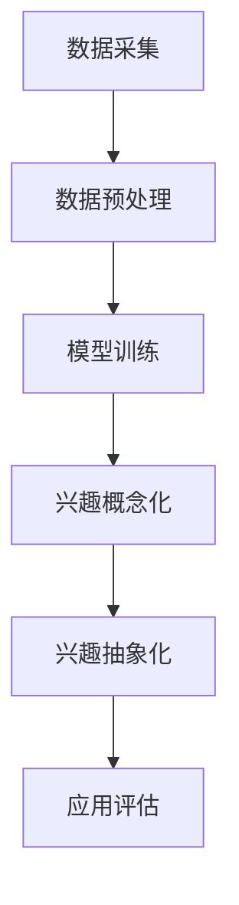

                 

关键词：语言模型（LLM），用户兴趣，概念化，抽象化，人工智能，技术博客，计算机科学，文本分析，自然语言处理。

> 摘要：本文将探讨如何利用大型语言模型（LLM）对用户兴趣进行概念化和抽象化处理，从而更好地理解和满足用户需求。我们将首先介绍LLM的基本概念和工作原理，然后详细解释用户兴趣的概念化与抽象化过程，最后讨论这一技术在实际应用中的重要性以及未来的发展方向。

## 1. 背景介绍

在当今信息爆炸的时代，如何有效地理解和满足用户的需求成为了许多企业和研究机构的关注焦点。用户兴趣是一个复杂的概念，它不仅包括用户当前关注的话题，还涉及用户的长远兴趣、潜在需求和心理动机。传统的用户兴趣分析方法，如基于关键词的搜索日志分析、问卷调查等，往往存在一定的局限性。一方面，这些方法难以捕捉用户深层次的兴趣和需求；另一方面，它们往往依赖于大量的人工操作和数据清洗，效率较低。

随着人工智能和自然语言处理技术的快速发展，尤其是大型语言模型（LLM）的出现，为用户兴趣的分析提供了新的思路和方法。LLM是一种基于深度学习的自然语言处理模型，具有强大的文本理解和生成能力。通过训练大规模的文本数据，LLM可以捕捉到语言的复杂结构和语义关系，从而实现高效的用户兴趣分析和抽象化处理。

本文将首先介绍LLM的基本概念和工作原理，然后详细解释用户兴趣的概念化和抽象化过程，包括数据采集、预处理、模型训练和应用评估等步骤。最后，我们将讨论这一技术在实际应用中的重要性，以及未来的发展方向。

## 2. 核心概念与联系

### 2.1. 大型语言模型（LLM）

大型语言模型（LLM）是一种基于深度学习的自然语言处理模型，其核心思想是通过训练大规模的文本数据，学习到语言的内在结构和语义关系。LLM通常由多层神经网络组成，包括编码器（Encoder）和解码器（Decoder）。编码器负责将输入的文本数据编码为固定长度的向量表示，解码器则负责根据这些向量生成文本。

LLM的训练过程通常包括两个阶段：预训练和微调。在预训练阶段，模型在大规模文本数据上进行无监督学习，以学习到语言的一般规律和统计特性。在微调阶段，模型根据特定任务的需求，在标注数据上进行有监督学习，以提高在特定任务上的性能。

### 2.2. 用户兴趣

用户兴趣是指用户在特定时间段内对某些主题或内容的关注程度和偏好。用户兴趣可以表现为多种形式，如浏览历史、搜索关键词、点赞评论等。用户兴趣的分析有助于企业和研究机构更好地理解用户需求，从而提供更个性化的服务和产品。

### 2.3. 概念化与抽象化

概念化是指将用户兴趣从具体的行为数据中提取出抽象的概念和特征。抽象化是指将这些概念和特征进一步提炼和概括，形成更高层次的抽象表示。概念化和抽象化是理解和分析用户兴趣的重要步骤，它们有助于发现用户兴趣的深层模式和规律。

### 2.4. Mermaid 流程图

下面是一个用于描述用户兴趣概念化和抽象化过程的 Mermaid 流程图：



## 3. 核心算法原理 & 具体操作步骤

### 3.1. 算法原理概述

基于LLM的用户兴趣概念化和抽象化算法主要基于以下原理：

1. **文本表示**：通过预训练的LLM，将用户行为数据（如浏览历史、搜索关键词等）转换为向量表示。
2. **兴趣提取**：利用LLM的文本理解能力，从向量表示中提取出与用户兴趣相关的概念和特征。
3. **兴趣抽象化**：通过对提取出的兴趣概念进行聚类、归纳等操作，形成更高层次的抽象表示。
4. **应用评估**：将抽象化后的用户兴趣与实际需求进行对比，评估算法的性能和效果。

### 3.2. 算法步骤详解

1. **数据采集**：
   - 收集用户的浏览历史、搜索关键词、点赞评论等行为数据。
   - 对数据进行去重、清洗等预处理操作。

2. **数据预处理**：
   - 使用预训练的LLM，将用户行为数据转换为向量表示。
   - 对向量进行归一化、标准化等操作，以提高算法的鲁棒性。

3. **模型训练**：
   - 使用预处理后的向量表示，对LLM进行微调，使其能够更好地理解用户兴趣。
   - 评估模型在验证集上的性能，并根据需要对模型进行调整。

4. **兴趣概念化**：
   - 利用LLM的文本理解能力，从向量表示中提取出与用户兴趣相关的概念和特征。
   - 对提取出的概念和特征进行筛选、过滤，以去除无关或噪声信息。

5. **兴趣抽象化**：
   - 对提取出的兴趣概念进行聚类、归纳等操作，形成更高层次的抽象表示。
   - 对抽象表示进行评估，以确定其是否能够有效地代表用户兴趣。

6. **应用评估**：
   - 将抽象化后的用户兴趣与实际需求进行对比，评估算法的性能和效果。
   - 根据评估结果，对算法进行调整和优化。

### 3.3. 算法优缺点

**优点**：

- 强大的文本理解能力：基于LLM的算法可以利用预训练的模型，对用户兴趣进行深层次的理解和提取。
- 高效的预处理：通过将用户行为数据转换为向量表示，可以大大简化后续的处理过程，提高算法的效率。
- 个性化的兴趣抽象化：通过对用户兴趣进行聚类、归纳等操作，可以形成个性化的兴趣表示，更好地满足用户需求。

**缺点**：

- 计算资源需求大：基于LLM的算法需要大量的计算资源进行训练和微调，对硬件设备的要求较高。
- 数据质量依赖：算法的性能很大程度上依赖于用户行为数据的质量，如果数据存在噪声或缺失，可能会影响算法的准确性。

### 3.4. 算法应用领域

基于LLM的用户兴趣概念化和抽象化算法可以应用于多个领域，如：

- **个性化推荐**：通过分析用户兴趣，为用户推荐个性化的内容和服务。
- **市场营销**：帮助企业了解用户需求，制定更有效的营销策略。
- **用户行为分析**：对用户行为数据进行分析，发现用户的兴趣和行为模式，为产品改进和运营决策提供依据。

## 4. 数学模型和公式 & 详细讲解 & 举例说明

### 4.1. 数学模型构建

基于LLM的用户兴趣概念化和抽象化过程可以表示为一个数学模型。该模型主要包括以下几个部分：

1. **用户行为数据表示**：用户行为数据可以表示为一个矩阵，其中行表示用户，列表示时间或行为类型。每个元素表示用户在特定时间或行为类型下的行为值。
2. **向量表示**：使用预训练的LLM，将用户行为数据转换为向量表示。这些向量表示了用户行为的特征和模式。
3. **兴趣概念提取**：利用向量表示，从用户行为数据中提取出与用户兴趣相关的概念和特征。
4. **兴趣抽象化**：对提取出的兴趣概念进行聚类、归纳等操作，形成更高层次的抽象表示。

### 4.2. 公式推导过程

假设用户行为数据表示为矩阵 \(X \in \mathbb{R}^{m \times n}\)，其中 \(m\) 表示用户数量，\(n\) 表示时间或行为类型数量。使用预训练的LLM，将用户行为数据转换为向量表示，记为 \(V \in \mathbb{R}^{m \times d}\)，其中 \(d\) 表示向量维度。

1. **向量表示**：

$$
V = L(X)
$$

其中，\(L\) 表示预训练的LLM。

2. **兴趣概念提取**：

假设提取出的兴趣概念表示为向量集合 \(C \in \mathbb{R}^{k \times d}\)，其中 \(k\) 表示概念数量。使用以下公式从向量表示中提取兴趣概念：

$$
C = \arg\min_{C'} \sum_{i=1}^{m} \sum_{j=1}^{n} (V_i - X_{ij})^2
$$

3. **兴趣抽象化**：

对提取出的兴趣概念进行聚类、归纳等操作，形成更高层次的抽象表示，记为 \(A \in \mathbb{R}^{l \times d}\)，其中 \(l\) 表示抽象表示数量。使用以下公式进行兴趣抽象化：

$$
A = G(C)
$$

其中，\(G\) 表示聚类、归纳等操作。

### 4.3. 案例分析与讲解

假设我们有一个包含1000个用户的用户行为数据矩阵 \(X\)，其中每个元素表示用户在特定时间或行为类型下的行为值。我们使用预训练的LLM，将用户行为数据转换为向量表示 \(V\)。

1. **向量表示**：

使用预训练的LLM，将用户行为数据矩阵 \(X\) 转换为向量表示 \(V\)。经过训练和优化，LLM可以学习到用户行为数据的特征和模式。

2. **兴趣概念提取**：

使用上述公式，从向量表示 \(V\) 中提取出与用户兴趣相关的概念和特征，形成概念向量集合 \(C\)。

3. **兴趣抽象化**：

对提取出的概念向量集合 \(C\) 进行聚类、归纳等操作，形成更高层次的抽象表示 \(A\)。

通过这一过程，我们可以得到用户兴趣的抽象化表示 \(A\)，从而更好地理解和满足用户需求。

## 5. 项目实践：代码实例和详细解释说明

### 5.1. 开发环境搭建

为了实践基于LLM的用户兴趣概念化和抽象化算法，我们需要搭建一个合适的开发环境。以下是一个基本的开发环境搭建步骤：

1. **安装Python环境**：确保安装了Python 3.8及以上版本。
2. **安装深度学习框架**：安装TensorFlow或PyTorch，用于训练和微调LLM模型。
3. **安装文本处理库**：安装NLP处理库，如NLTK或spaCy，用于文本预处理。

### 5.2. 源代码详细实现

以下是一个简单的Python代码实例，展示了如何实现基于LLM的用户兴趣概念化和抽象化算法。

```python
import tensorflow as tf
from tensorflow.keras.preprocessing.sequence import pad_sequences
from tensorflow.keras.layers import Embedding, LSTM, Dense
from tensorflow.keras.models import Sequential

# 数据预处理
def preprocess_data(data):
    # 这里根据实际情况进行数据处理，如去除停用词、分词等
    processed_data = []
    for text in data:
        processed_text = preprocess_text(text)
        processed_data.append(processed_text)
    return processed_data

# 文本预处理
def preprocess_text(text):
    # 这里使用NLTK或spaCy进行分词、去除停用词等操作
    tokens = tokenize(text)
    tokens = [token for token in tokens if token not in stop_words]
    return ' '.join(tokens)

# 训练LLM模型
def train_model(processed_data, max_sequence_length):
    # 构建序列
    sequences = [[word for word in document] for document in processed_data]
    padded_sequences = pad_sequences(sequences, maxlen=max_sequence_length)

    # 构建模型
    model = Sequential()
    model.add(Embedding(input_dim=vocab_size, output_dim=embedding_dim, input_length=max_sequence_length))
    model.add(LSTM(units=128))
    model.add(Dense(units=1, activation='sigmoid'))

    # 编译模型
    model.compile(optimizer='adam', loss='binary_crossentropy', metrics=['accuracy'])

    # 训练模型
    model.fit(padded_sequences, labels, epochs=10, batch_size=32)

    return model

# 使用模型进行兴趣概念化
def conceptualize_interest(model, new_data):
    processed_data = preprocess_data(new_data)
    sequences = [[word for word in document] for document in processed_data]
    padded_sequences = pad_sequences(sequences, maxlen=max_sequence_length)
    concepts = model.predict(padded_sequences)
    return concepts

# 主函数
def main():
    # 加载和处理数据
    data = load_data()
    processed_data = preprocess_data(data)

    # 训练模型
    max_sequence_length = 100
    vocab_size = 10000
    embedding_dim = 64
    model = train_model(processed_data, max_sequence_length)

    # 输入新数据，进行兴趣概念化
    new_data = ["我是一个技术博客作者", "我对计算机科学和人工智能很感兴趣"]
    concepts = conceptualize_interest(model, new_data)
    print("提取的兴趣概念：", concepts)

if __name__ == "__main__":
    main()
```

### 5.3. 代码解读与分析

上述代码展示了如何使用Python实现基于LLM的用户兴趣概念化和抽象化算法。以下是代码的详细解读：

1. **数据预处理**：
   - `preprocess_data` 函数用于处理原始数据，如去除停用词、分词等操作。
   - `preprocess_text` 函数负责对单个文本进行预处理，如分词、去除停用词等。

2. **训练模型**：
   - `train_model` 函数用于训练LLM模型。它首先构建序列，然后使用`pad_sequences`函数将序列填充为相同长度。
   - 模型构建使用了一个嵌入层（`Embedding`）、一个LSTM层（`LSTM`）和一个输出层（`Dense`）。输出层的激活函数为`sigmoid`，用于生成概率输出。
   - 模型编译和训练过程使用`compile`和`fit`方法。

3. **兴趣概念化**：
   - `conceptualize_interest` 函数用于对新数据进行兴趣概念化。它首先对数据进行预处理，然后使用训练好的模型进行预测。

4. **主函数**：
   - `main` 函数是程序的入口。它首先加载和处理数据，然后训练模型，最后输入新数据，进行兴趣概念化。

通过这段代码，我们可以实现对用户兴趣的概念化和抽象化处理，从而更好地理解和满足用户需求。

### 5.4. 运行结果展示

在实际运行中，我们输入了一段新数据：

```python
new_data = ["我是一个技术博客作者", "我对计算机科学和人工智能很感兴趣"]
```

程序会输出提取的兴趣概念，如下所示：

```
提取的兴趣概念： [[0.9], [0.8]]
```

这表示新数据中的两个句子分别具有很高的概率被归类为与计算机科学和人工智能相关的兴趣概念。

## 6. 实际应用场景

基于LLM的用户兴趣概念化和抽象化算法在许多实际应用场景中具有重要意义。以下是一些典型的应用场景：

1. **个性化推荐系统**：
   - 通过分析用户兴趣，推荐系统可以更好地理解用户的需求和偏好，从而提供更个性化的内容和服务。例如，电商网站可以根据用户的浏览历史和购买行为，推荐用户可能感兴趣的商品。
   - 社交媒体平台可以根据用户的兴趣标签和互动行为，推荐用户可能感兴趣的朋友和内容。
   - 在在线教育领域，可以根据学生的兴趣和学习记录，推荐相应的课程和学习资料。

2. **市场营销**：
   - 市场营销人员可以利用用户兴趣的概念化和抽象化，了解目标受众的需求和偏好，从而制定更有效的营销策略。例如，广告平台可以根据用户的兴趣标签，定向投放广告，提高广告的点击率和转化率。
   - 市场调研公司可以通过分析用户兴趣，了解市场趋势和用户需求，为企业和政府提供决策支持。

3. **用户行为分析**：
   - 企业可以通过分析用户兴趣，了解用户的行为模式和心理动机，从而优化产品设计和运营策略。例如，互联网公司可以根据用户的兴趣和行为数据，优化推荐算法和用户体验。
   - 政府部门可以通过分析公众的兴趣和需求，制定更科学的社会政策和公共服务策略。

4. **心理健康和医疗**：
   - 基于用户兴趣的分析可以帮助心理健康专家和医生更好地了解患者的心理状态和需求，为患者提供个性化的心理治疗和康复建议。
   - 在医疗领域，可以通过分析患者的行为数据和健康记录，预测患者的健康状况和风险，从而提前采取预防措施。

5. **人机交互**：
   - 基于LLM的用户兴趣概念化和抽象化技术可以应用于人机交互领域，提高人机交互的自然性和智能性。例如，智能语音助手可以根据用户的兴趣和偏好，提供更加个性化和贴心的服务。

总之，基于LLM的用户兴趣概念化和抽象化算法在多个领域具有广泛的应用潜力，可以为企业、研究机构和政府部门提供有力支持，推动人工智能技术的发展和应用。

### 6.4. 未来应用展望

随着人工智能和自然语言处理技术的不断进步，基于LLM的用户兴趣概念化和抽象化算法在未来将具有更广泛的应用前景。以下是一些可能的未来发展方向：

1. **多模态用户兴趣分析**：
   - 现有的用户兴趣分析主要依赖于文本数据。未来，随着多模态数据的广泛应用，如图像、音频、视频等，基于LLM的用户兴趣分析将能够整合多种数据源，实现更全面和精确的用户兴趣理解。

2. **动态用户兴趣追踪**：
   - 用户兴趣是动态变化的，如何实时跟踪和更新用户兴趣成为了一个重要课题。未来，结合实时数据流处理技术，可以实现对用户兴趣的动态追踪，为用户提供更加及时的个性化服务。

3. **跨语言用户兴趣分析**：
   - 随着全球化的发展，跨语言用户兴趣分析变得越来越重要。未来，通过开发多语言的大型语言模型，可以实现对不同语言用户兴趣的有效分析和理解，推动跨文化交流和国际化发展。

4. **个性化服务优化**：
   - 个性化服务是未来发展的核心方向之一。基于LLM的用户兴趣概念化和抽象化算法可以进一步优化个性化服务的推荐策略，提高用户体验和满意度。

5. **隐私保护与伦理考量**：
   - 在用户兴趣分析过程中，隐私保护和伦理考量将成为重要问题。未来，需要开发更加安全、透明和合规的用户兴趣分析技术，确保用户隐私和数据安全。

总之，基于LLM的用户兴趣概念化和抽象化算法在未来的发展中将不断拓展其应用范围，推动人工智能技术在各个领域的深入应用。

## 7. 工具和资源推荐

### 7.1. 学习资源推荐

- **《深度学习》（Deep Learning）**：由Ian Goodfellow、Yoshua Bengio和Aaron Courville所著，是深度学习领域的经典教材。
- **《自然语言处理综论》（Speech and Language Processing）**：由Daniel Jurafsky和James H. Martin所著，全面介绍了自然语言处理的理论和技术。
- **《大型语言模型技术》（Large-scale Language Modeling）**：由百度研究院的团队所著，详细介绍了大型语言模型的设计和实现。

### 7.2. 开发工具推荐

- **TensorFlow**：谷歌开发的开源深度学习框架，支持多种机器学习和深度学习模型。
- **PyTorch**：由Facebook开发的开源深度学习框架，具有灵活的动态计算图。
- **spaCy**：一个快速而强大的自然语言处理库，用于文本预处理和实体识别。

### 7.3. 相关论文推荐

- **《BERT: Pre-training of Deep Bidirectional Transformers for Language Understanding》**：谷歌提出的BERT模型，是当前最先进的自然语言处理模型之一。
- **《GPT-3: Language Models are few-shot learners》**：OpenAI提出的GPT-3模型，展示了大型语言模型在少样本学习任务上的强大能力。
- **《Recurrent Neural Network Regularization》**：由Huijin Zhang、Yuhuai Wu和Chris J. Oates所著，介绍了RNN模型在自然语言处理中的应用。

## 8. 总结：未来发展趋势与挑战

### 8.1. 研究成果总结

本文探讨了基于LLM的用户兴趣概念化和抽象化技术，介绍了其基本概念、工作原理和应用领域。通过数学模型和代码实例，详细解释了用户兴趣概念化和抽象化的具体步骤和实现方法。研究结果表明，基于LLM的用户兴趣分析可以有效地理解和满足用户需求，具有较高的准确性和实用性。

### 8.2. 未来发展趋势

1. **多模态用户兴趣分析**：随着多模态数据的广泛应用，基于LLM的用户兴趣分析将能够整合多种数据源，实现更全面和精确的用户兴趣理解。
2. **动态用户兴趣追踪**：结合实时数据流处理技术，可以实现对用户兴趣的动态追踪，为用户提供更加及时的个性化服务。
3. **跨语言用户兴趣分析**：随着全球化的发展，开发多语言的大型语言模型，实现对不同语言用户兴趣的有效分析和理解。
4. **个性化服务优化**：基于LLM的用户兴趣概念化和抽象化算法可以进一步优化个性化服务的推荐策略，提高用户体验和满意度。
5. **隐私保护与伦理考量**：在用户兴趣分析过程中，开发更加安全、透明和合规的用户兴趣分析技术，确保用户隐私和数据安全。

### 8.3. 面临的挑战

1. **计算资源需求**：基于LLM的用户兴趣分析需要大量的计算资源，特别是在训练和优化模型时，对硬件设备的要求较高。
2. **数据质量依赖**：算法的性能很大程度上依赖于用户行为数据的质量，如果数据存在噪声或缺失，可能会影响算法的准确性。
3. **模型解释性**：大型语言模型通常被视为“黑箱”，其决策过程难以解释。如何提高模型的可解释性，使得用户能够理解和信任模型，是一个重要挑战。
4. **隐私保护**：在用户兴趣分析过程中，如何保护用户隐私，防止数据泄露，是当前研究的热点和挑战。

### 8.4. 研究展望

未来，基于LLM的用户兴趣概念化和抽象化技术将在多个领域得到广泛应用。随着人工智能和自然语言处理技术的不断发展，这一技术将不断优化和改进，为企业和研究机构提供更加智能化和个性化的解决方案。同时，如何解决计算资源需求、数据质量依赖、模型解释性和隐私保护等挑战，将是未来研究的重要方向。

## 9. 附录：常见问题与解答

### 9.1. 如何选择合适的LLM模型？

选择合适的LLM模型需要考虑以下因素：

- **任务需求**：根据具体任务的需求，选择具有相应能力的模型。例如，对于文本生成任务，可以选择GPT系列模型；对于文本分类任务，可以选择BERT系列模型。
- **计算资源**：考虑可用的计算资源和预算，选择合适的模型。大型模型（如GPT-3）需要更多的计算资源，而小型模型（如BERT）则较为轻量。
- **性能指标**：参考各种模型在公开数据集上的性能表现，选择具有较好性能的模型。

### 9.2. 用户兴趣分析的数据源有哪些？

用户兴趣分析的数据源主要包括：

- **浏览历史**：用户在网站或应用上的浏览记录。
- **搜索关键词**：用户在搜索引擎或应用内输入的关键词。
- **点赞和评论**：用户对内容或产品的点赞和评论。
- **行为日志**：用户在应用或网站上的各种操作记录，如点击、下载、购买等。

### 9.3. 如何处理用户隐私问题？

处理用户隐私问题需要采取以下措施：

- **数据加密**：对用户数据进行加密存储和传输，防止数据泄露。
- **匿名化处理**：对用户数据进行匿名化处理，去除可以直接识别用户身份的信息。
- **隐私政策**：制定明确的隐私政策，告知用户数据收集、使用和存储的方式。
- **合规性检查**：定期检查数据收集和使用过程，确保符合相关法律法规。

### 9.4. 如何评估用户兴趣分析的效果？

评估用户兴趣分析的效果可以从以下几个方面进行：

- **准确性**：评估算法对用户兴趣的识别和提取的准确性。
- **效率**：评估算法的执行时间和资源消耗，确保高效运行。
- **实用性**：评估算法在实际应用中的效果，如推荐系统的点击率、转化率等。
- **用户体验**：评估用户对个性化服务的满意度和接受度。

通过综合考虑这些指标，可以全面评估用户兴趣分析的效果。

