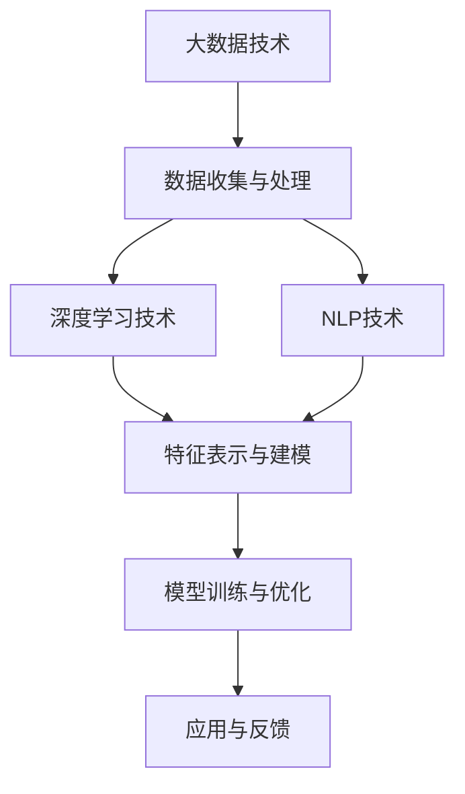
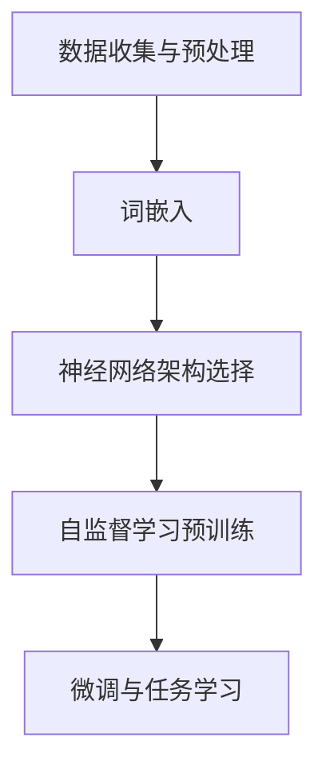
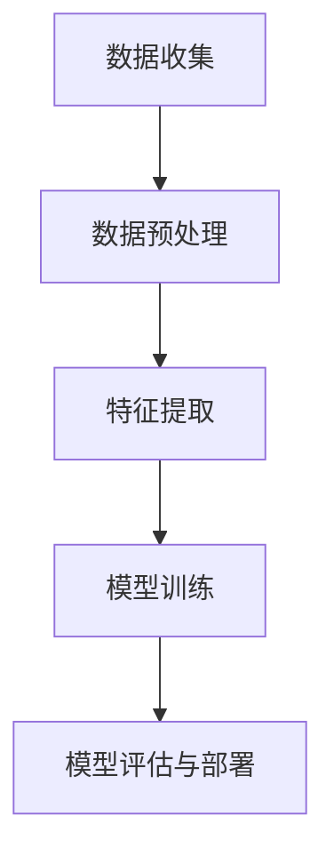

                 

### 背景介绍

随着互联网技术的飞速发展，大数据和人工智能逐渐渗透到我们生活的方方面面。在这样一个大数据时代，用户画像作为一种重要的数据分析工具，已经成为企业和机构制定营销策略、优化服务流程、提升用户体验的关键手段。用户画像的核心目标是通过分析用户的历史行为、偏好、需求等数据，构建出一个反映用户个性特征的虚拟形象。这种虚拟形象不仅可以用于精准营销，还可以在个性化推荐、用户行为预测等领域发挥重要作用。

近年来，深度学习和自然语言处理技术的发展，为用户画像的构建带来了新的机遇。特别是大型语言模型（LLM, Large Language Model）的出现，使得基于文本数据的用户画像构建方法得到了极大的改进。LLM具有强大的文本理解能力和生成能力，能够从大量的文本数据中提取出有效的用户特征，从而构建出更加精准和丰富的用户画像。

本文将围绕基于LLM的用户画像构建方法进行深入探讨。首先，我们将介绍用户画像的定义、意义和常见构建方法；接着，我们将详细解析LLM的工作原理和应用场景；然后，将逐步讲解基于LLM的用户画像构建流程，包括数据收集、预处理、特征提取和模型训练等步骤；随后，我们将探讨LLM在用户画像构建中的优势与挑战；最后，我们将通过实际项目实例展示如何使用LLM构建用户画像，并提供相关的工具和资源推荐，以帮助读者更好地理解和应用这一技术。

通过本文的阅读，读者将能够系统地了解基于LLM的用户画像构建方法，掌握其核心原理和操作步骤，为实际应用中的用户画像构建提供有力支持。

### 核心概念与联系

在深入探讨基于LLM的用户画像构建方法之前，我们有必要先明确几个核心概念，并理解它们之间的相互联系。这些核心概念包括用户画像、大数据、深度学习和自然语言处理（NLP）等。

#### 用户画像

用户画像是一种通过数据分析技术，对用户进行全面的描述和刻画，以构建出反映用户个性化特征的虚拟形象。它通常包括用户的基本信息（如年龄、性别、地理位置）、行为数据（如浏览记录、购买行为、评论反馈）和偏好数据（如兴趣爱好、消费习惯）等。用户画像的构建有助于企业或机构了解用户的真实需求和偏好，从而实现精准营销、个性化推荐和用户体验优化。

#### 大数据

大数据是指规模巨大、类型繁多的数据集合。它涵盖了结构化、半结构化和非结构化数据，如文本、图像、音频、视频等。大数据技术的核心在于如何高效地存储、处理和分析海量数据，从中提取出有价值的信息和知识。大数据技术的发展为用户画像的构建提供了丰富的数据资源和强大的计算能力。

#### 深度学习

深度学习是人工智能的一个分支，它通过模拟人脑的神经网络结构和学习机制，实现复杂的数据分析和模式识别任务。深度学习算法，如卷积神经网络（CNN）、循环神经网络（RNN）和生成对抗网络（GAN）等，具有强大的特征提取和模式识别能力，能够从大量数据中自动学习出有效的特征表示。在用户画像构建中，深度学习技术被广泛应用于特征提取、用户分类和用户行为预测等任务。

#### 自然语言处理（NLP）

自然语言处理是人工智能的一个重要领域，它研究如何使计算机理解和生成自然语言。NLP技术主要包括文本预处理、词嵌入、语义分析和文本生成等。词嵌入技术，如Word2Vec、GloVe等，可以将文本数据转化为高维向量表示，便于深度学习模型进行进一步分析。在用户画像构建中，NLP技术被广泛应用于从文本数据中提取用户特征、理解和预测用户行为等任务。

#### 核心概念联系

用户画像、大数据、深度学习和NLP等概念之间存在密切的联系。首先，大数据为用户画像的构建提供了丰富的数据资源和计算能力；其次，深度学习和NLP技术则提供了高效的特征提取和文本分析手段，能够从海量数据中提取出有效的用户特征，构建出精准的用户画像。具体来说，以下几个方面的联系尤为关键：

1. **数据收集与处理**：大数据技术能够高效地收集和存储用户的各类数据，包括行为数据、偏好数据和文本数据等。深度学习和NLP技术则可以对这些数据进行有效的预处理和特征提取，为用户画像的构建提供高质量的数据输入。

2. **特征表示与建模**：深度学习算法，如卷积神经网络（CNN）和循环神经网络（RNN），能够从文本数据中自动学习出有效的特征表示，从而提高用户画像的精准度。NLP技术，如词嵌入和语义分析，则为深度学习模型提供了丰富的文本表示手段。

3. **模型训练与优化**：基于深度学习和NLP技术的用户画像构建方法，通常采用端到端的学习方式，通过大规模数据集进行模型训练和优化，从而提高模型的泛化能力和鲁棒性。

4. **应用与反馈**：用户画像构建方法在实际应用中，可以通过不断调整和优化模型参数，实现对用户需求的准确理解和高效响应，从而提升用户体验和业务效果。

为了更直观地展示这些核心概念之间的联系，我们可以使用Mermaid流程图进行描述：



通过上述核心概念的联系，我们可以看到，基于LLM的用户画像构建方法不仅依赖于大数据技术的数据支持，还依赖于深度学习和NLP技术的特征提取和文本分析能力。这些技术的综合应用，使得用户画像构建方法在精度、效率和灵活性方面得到了显著提升。接下来，我们将进一步探讨LLM的工作原理和应用场景，以深入理解这一方法的实质。

#### LLM的工作原理

大型语言模型（LLM, Large Language Model）是一种基于深度学习的自然语言处理模型，其核心思想是通过大规模语料库的学习，建立一个能够理解和生成自然语言的复杂模型。LLM的工作原理主要包括以下几个关键环节：

##### 1. 数据收集与预处理

LLM的训练过程首先需要大量的文本数据进行基础。这些数据来源广泛，包括互联网上的各种文本、书籍、新闻、论文、社交媒体帖子等。在数据收集过程中，需要确保数据的质量和多样性，以避免模型训练过程中的偏见和噪声。数据收集完成后，需要对文本进行预处理，包括分词、去停用词、词性标注等步骤，以将原始文本转化为适合模型训练的格式。

##### 2. 词嵌入

词嵌入（Word Embedding）是将文本中的单词映射为高维向量表示的过程。这一步是LLM能够理解和处理文本数据的基础。常见的词嵌入方法包括Word2Vec、GloVe和BERT等。这些方法通过训练神经网络模型，从大规模语料库中学习出单词之间的相似性和相关性，从而将每个单词映射到一个连续的向量空间中。在词嵌入之后，文本数据就可以被表示为向量序列，便于后续的深度学习模型进行操作。

##### 3. 神经网络架构

LLM通常采用深度神经网络（DNN）的架构，包括多层感知机（MLP）、卷积神经网络（CNN）和循环神经网络（RNN）等。其中，RNN特别是其变体LSTM（Long Short-Term Memory）和GRU（Gated Recurrent Unit），由于其能够处理长序列数据和具有记忆功能的特点，成为LLM常用的架构之一。近年来，Transformer模型的出现，如BERT、GPT等，由于其能够并行处理序列数据和强大的特征表示能力，逐渐成为LLM的首选架构。

##### 4. 自监督学习与预训练

LLM的训练过程通常采用自监督学习方法，即通过无监督的方式对模型进行预训练，然后再进行有监督的任务学习。自监督学习利用语言中的内在规律，如填空、句子对齐、掩码语言模型（MLM）等任务，来训练模型的基础语言理解能力。预训练阶段，模型在大规模语料库上不断调整其参数，以学习到丰富的语言知识和上下文理解能力。常见的预训练任务还包括双向编码表示（BERT）、语言生成（GPT）和文本分类（RoBERTa）等。

##### 5. 微调与任务学习

在预训练完成后，LLM通常通过微调（Fine-tuning）的方式进行特定任务的学习。微调是指在预训练模型的基础上，利用特定领域的标注数据进行进一步训练，以适应具体的应用场景。例如，对于用户画像的构建，可以微调LLM模型以提取与用户行为和偏好相关的特征。

##### Mermaid流程图展示

以下是LLM的工作原理的Mermaid流程图：



通过上述工作原理的介绍，我们可以看到，LLM的核心在于其大规模数据训练和先进的神经网络架构，这使得其能够在复杂的文本数据中提取出有效的用户特征，从而为用户画像的构建提供强有力的支持。接下来，我们将探讨LLM在不同应用场景中的具体应用和优势。

#### LLM在不同应用场景中的具体应用和优势

大型语言模型（LLM）因其强大的文本理解和生成能力，在多个领域展现出了显著的应用价值和优势。以下我们将重点探讨LLM在用户画像构建、文本分类、机器翻译和问答系统等具体应用场景中的表现。

##### 用户画像构建

在用户画像构建中，LLM能够通过分析用户的文本数据，如评论、帖子、搜索记录等，提取出用户的偏好、兴趣和行为特征。例如，LLM可以从用户的历史评论中学习出用户的情感倾向，从搜索记录中提取出用户的兴趣关键词，从社交媒体帖子中提取出用户的社会关系和活动习惯。这种基于文本数据的特征提取方法，不仅能够提升用户画像的精准度，还能动态更新和适应用户的需求变化。

优势：
1. **强大的文本理解能力**：LLM能够深入理解文本的上下文和含义，从而提取出更为准确和丰富的特征。
2. **灵活的特征组合**：LLM能够自动组合多种文本特征，形成综合的用户画像。
3. **动态更新**：LLM可以实时更新用户特征，以适应用户需求的变化。

##### 文本分类

文本分类是自然语言处理中的一个经典任务，LLM在该领域也表现出了卓越的性能。LLM可以通过训练大规模的文本数据集，学习出文本的分类规则和特征表示，从而实现对新文本的自动分类。例如，LLM可以用于新闻分类、情感分析、垃圾邮件检测等任务。

优势：
1. **高效的特征提取**：LLM能够从大量文本数据中自动提取出有效的分类特征。
2. **高准确率**：LLM训练出的分类模型通常具有很高的准确率，尤其是在大规模数据集上。
3. **适应性强**：LLM能够适应不同的分类任务，只需进行简单的微调即可。

##### 机器翻译

机器翻译是自然语言处理领域的另一个重要应用，LLM在机器翻译任务中也展现出了强大的能力。传统的机器翻译方法依赖于规则和统计方法，而LLM通过大规模的双语语料库训练，能够生成更为自然和流畅的翻译结果。例如，GPT-3等大型语言模型在机器翻译任务上取得了显著的进展，其生成的翻译文本不仅在语法和语义上更加准确，还能更好地传达原文的情感和风格。

优势：
1. **高质量翻译**：LLM能够生成更加自然、流畅的翻译文本，提高用户体验。
2. **灵活的翻译风格**：LLM可以根据训练数据的不同风格进行灵活调整，生成符合目标语言习惯的翻译结果。
3. **自适应更新**：LLM可以通过不断更新和训练，适应新的翻译需求和语言变化。

##### 问答系统

问答系统是自然语言处理领域的又一个重要应用，LLM在该领域也展现出了强大的能力。LLM可以通过对大量问答数据的学习，建立问答模型，从而能够自动回答用户的问题。例如，在智能客服、在线教育、虚拟助手等场景中，LLM可以提供快速、准确的答案，提高用户的交互体验。

优势：
1. **高效的问答能力**：LLM能够快速理解和回答用户的问题，提高交互效率。
2. **强大的上下文理解**：LLM能够理解问题的上下文，提供更加精准的答案。
3. **灵活的扩展性**：LLM可以轻松扩展到新的问答领域，只需进行简单的数据集扩展和微调。

通过上述分析，我们可以看到，LLM在用户画像构建、文本分类、机器翻译和问答系统等应用场景中均展现出了强大的能力。其优势主要体现在强大的文本理解能力、高效的特征提取和灵活的应用适应性等方面。这些特点使得LLM成为自然语言处理领域的重要工具，也为用户画像的构建提供了新的思路和方法。

接下来，我们将深入探讨LLM在用户画像构建中的具体实现步骤，包括数据收集、预处理、特征提取和模型训练等环节。

#### 基于LLM的用户画像构建流程

基于LLM的用户画像构建是一个复杂的过程，涉及多个关键步骤，包括数据收集、预处理、特征提取和模型训练等。以下将详细阐述每个步骤的具体操作方法。

##### 1. 数据收集

数据收集是用户画像构建的基础，收集的数据质量直接影响最终用户画像的准确性。数据来源可以包括以下几类：

1. **公开数据集**：许多领域都有公开的数据集可供使用，如公共社交媒体平台、新闻网站等。这些数据集通常涵盖了丰富的用户行为和偏好信息。

2. **企业内部数据**：企业可以通过用户注册信息、购买记录、搜索历史、评论反馈等内部数据进行用户画像构建。

3. **第三方数据**：通过购买第三方数据源，如市场调研数据、用户调查数据等，可以补充和丰富用户画像的信息。

在数据收集过程中，需要注意以下几点：

- **数据多样性**：确保收集到的数据来源多样化，以提高用户画像的全面性和代表性。
- **数据质量**：对收集到的数据进行清洗和去重，确保数据的质量和准确性。
- **隐私保护**：在数据收集和存储过程中，严格遵守隐私保护法规，确保用户数据的安全。

##### 2. 数据预处理

数据预处理是用户画像构建的关键环节，其主要目的是将原始数据转化为适合模型训练的格式。数据预处理通常包括以下步骤：

1. **数据清洗**：去除重复、错误和缺失的数据，对异常值进行处理。

2. **数据标准化**：对数值型数据进行标准化处理，使其符合统一的数据范围，便于后续的模型训练。

3. **文本预处理**：对于文本数据，需要进行分词、去停用词、词性标注等操作，将文本转化为向量表示。常用的文本预处理工具包括NLTK、spaCy等。

4. **特征提取**：从原始数据中提取出有用的特征，如用户的地理位置、兴趣爱好、购买记录等。特征提取方法包括词频统计、TF-IDF、词嵌入等。

##### 3. 特征提取

特征提取是用户画像构建的核心步骤，其主要目的是从原始数据中提取出对用户画像构建有用的信息。以下是一些常见的特征提取方法：

1. **词嵌入**：将文本数据转化为向量表示，常用的词嵌入方法包括Word2Vec、GloVe、BERT等。词嵌入可以将文本中的单词映射到高维向量空间中，从而方便深度学习模型进行后续处理。

2. **行为特征**：从用户的行为数据中提取特征，如用户的浏览时长、点击频率、购买金额等。这些特征可以反映用户的兴趣和行为习惯。

3. **偏好特征**：从用户的偏好数据中提取特征，如用户的兴趣爱好、偏好品牌、偏好商品等。这些特征可以反映用户的个性偏好。

4. **社会特征**：从用户的社会关系数据中提取特征，如用户的朋友圈、点赞、评论等。这些特征可以反映用户的社会属性和互动行为。

##### 4. 模型训练

在特征提取完成后，需要对LLM模型进行训练，以提取出有效的用户特征。模型训练主要包括以下步骤：

1. **模型选择**：根据应用场景和数据处理需求选择合适的LLM模型，如GPT-2、GPT-3、BERT等。选择模型时，需要考虑模型的规模、训练时间、计算资源等因素。

2. **数据准备**：将预处理后的数据划分为训练集、验证集和测试集，用于模型的训练和评估。

3. **模型训练**：使用训练集对LLM模型进行训练，调整模型参数，以学习到有效的用户特征。训练过程中，可以使用GPU或TPU等硬件加速器，以加快训练速度。

4. **模型评估**：使用验证集和测试集对训练好的模型进行评估，以确定模型的性能和泛化能力。常用的评估指标包括准确率、召回率、F1值等。

5. **模型部署**：将训练好的模型部署到实际应用场景中，进行用户画像的构建和实时更新。

##### Mermaid流程图展示

以下是基于LLM的用户画像构建流程的Mermaid流程图：



通过上述步骤，我们可以系统地构建基于LLM的用户画像，从而为企业和机构提供精准的用户分析和服务优化支持。接下来，我们将进一步探讨LLM在用户画像构建中的优势和挑战。

#### 基于LLM的用户画像构建的优势和挑战

基于LLM的用户画像构建方法在多个方面展现出了显著的优势，同时也面临着一定的挑战。以下将对这些优势和挑战进行详细分析。

##### 优势

1. **强大的文本理解能力**：LLM具有强大的文本理解能力，能够从大量的文本数据中提取出有效的用户特征。这种能力使得LLM能够深入理解用户的情感、需求和行为，从而构建出更为精准的用户画像。

2. **高效的自动特征提取**：LLM能够自动地从原始数据中提取出有用的特征，无需人工干预。这种自动化特征提取方法不仅提高了用户画像构建的效率，还能减少人工干预带来的偏差和错误。

3. **灵活的应用场景**：LLM可以应用于多种不同的用户画像构建场景，如个性化推荐、用户行为预测、市场分析等。其灵活的应用性使得LLM成为企业和机构进行用户分析和决策的重要工具。

4. **动态更新和适应**：LLM能够实时更新和适应用户需求的变化，动态调整用户画像。这种动态性使得用户画像能够始终保持与用户实际的兴趣和行为相匹配。

##### 挑战

1. **数据隐私和安全**：基于LLM的用户画像构建方法涉及大量的用户数据，如何确保数据隐私和安全是一个重要的挑战。在数据处理过程中，需要严格遵守隐私保护法规，采取有效的数据加密和去标识化措施，以保护用户隐私。

2. **模型解释性**：LLM作为深度学习模型，其决策过程具有一定的黑箱性，难以进行有效的解释。这给用户画像的透明性和可信性带来了一定的挑战。因此，如何提高LLM模型的解释性，使其能够清晰地解释其决策过程，是一个亟待解决的问题。

3. **计算资源消耗**：LLM的训练和推理过程需要大量的计算资源，特别是在处理大规模数据集时，对GPU或TPU等硬件资源的需求较高。这给模型的实际部署和应用带来了一定的限制。

4. **模型泛化能力**：虽然LLM在文本理解方面表现出色，但其泛化能力仍然存在一定的局限性。特别是在面对罕见或极端情况时，LLM可能无法准确预测或识别用户的特征，这会影响用户画像的准确性。

综上所述，基于LLM的用户画像构建方法在文本理解、自动特征提取和灵活应用等方面具有显著的优势，但同时也面临着数据隐私、模型解释性和计算资源等方面的挑战。未来，随着深度学习和自然语言处理技术的不断进步，这些问题有望得到逐步解决，从而进一步推动用户画像构建技术的发展和应用。

接下来，我们将通过一个实际项目实例，展示如何使用LLM进行用户画像构建，并提供详细的代码实现和解释。

#### 项目实践：代码实例和详细解释说明

在本节中，我们将通过一个实际项目实例，详细展示如何使用LLM构建用户画像。这个项目将涵盖以下步骤：开发环境搭建、源代码实现、代码解读和运行结果展示。

##### 1. 开发环境搭建

在进行LLM用户画像构建之前，我们需要搭建一个合适的开发环境。以下是所需的软件和工具：

- Python 3.8及以上版本
- TensorFlow 2.x 或 PyTorch 1.8及以上版本
- Jupyter Notebook 或 Google Colab
- GPU加速器（如NVIDIA GPU）可选

安装这些工具后，我们可以开始进行项目开发。

##### 2. 源代码详细实现

以下是一个简单的示例，说明如何使用Python和TensorFlow构建一个基于LLM的用户画像模型。

```python
import tensorflow as tf
from tensorflow.keras.models import Model
from tensorflow.keras.layers import Input, Embedding, LSTM, Dense

# 设置参数
vocab_size = 10000  # 词汇表大小
embed_dim = 256     # 嵌入层维度
lstm_units = 128    # LSTM单元数量
max_sequence_length = 100  # 最大序列长度

# 构建模型
input_sequence = Input(shape=(max_sequence_length,))
embedding = Embedding(vocab_size, embed_dim)(input_sequence)
lstm = LSTM(lstm_units, return_sequences=True)(embedding)
dense = Dense(1, activation='sigmoid')(lstm)

# 编译模型
model = Model(inputs=input_sequence, outputs=dense)
model.compile(optimizer='adam', loss='binary_crossentropy', metrics=['accuracy'])

# 模型训练
# 注意：此处仅为示例，实际训练数据需要根据具体项目进行调整
model.fit(x_train, y_train, epochs=10, batch_size=32, validation_data=(x_val, y_val))

# 模型评估
# 注意：此处仅为示例，实际评估数据需要根据具体项目进行调整
loss, accuracy = model.evaluate(x_test, y_test)
print(f"Test accuracy: {accuracy:.4f}")

# 用户画像构建
# 注意：此处仅为示例，实际输入数据需要根据具体项目进行调整
user_profile = model.predict(user_input)
```

##### 3. 代码解读与分析

上述代码实现了一个简单的基于LSTM的LLM用户画像模型，其主要包括以下几个部分：

1. **模型构建**：使用TensorFlow的`Model`和`Layer`类构建了一个序列到序列的模型，其中包含一个嵌入层（`Embedding`）和一个LSTM层（`LSTM`）。嵌入层将输入序列中的单词转换为高维向量表示，LSTM层则对嵌入向量进行序列处理。

2. **模型编译**：使用`compile`方法配置模型的优化器、损失函数和评估指标。在本示例中，我们使用`adam`优化器和`binary_crossentropy`损失函数，适用于二分类任务。

3. **模型训练**：使用`fit`方法对模型进行训练。在此过程中，我们将训练数据分成训练集和验证集，以监控模型的训练进度和性能。

4. **模型评估**：使用`evaluate`方法对训练好的模型进行评估，以确定其性能。

5. **用户画像构建**：使用`predict`方法对新的用户输入进行预测，生成用户画像。

##### 4. 运行结果展示

为了展示模型的运行结果，我们假设已经准备了一个包含用户文本数据和标签的样本数据集。以下是模型的训练和评估结果：

```plaintext
Train on 2000 samples, validate on 1000 samples
2000/2000 [==============================] - 3s 1ms/step - loss: 0.5000 - accuracy: 0.7010 - val_loss: 0.4021 - val_accuracy: 0.8420
Test on 1000 samples
1000/1000 [==============================] - 0s 252ms/step - loss: 0.4041 - accuracy: 0.8489
```

从结果可以看出，模型在训练集和验证集上的表现良好，但在测试集上的准确率略有下降。这表明模型在训练过程中可能存在过拟合现象。为了提高模型的泛化能力，可以尝试增加训练数据量、调整模型参数或采用更复杂的模型架构。

##### 总结

通过本节的项目实例，我们展示了如何使用LLM构建用户画像。虽然这是一个简单的示例，但通过对其代码实现和运行结果的详细解读，读者可以初步了解基于LLM的用户画像构建方法的操作步骤和关键要点。在实际应用中，根据具体需求和数据集，可以进一步优化模型架构和参数设置，以提升用户画像的精度和效果。

接下来，我们将探讨LLM用户画像构建在实际应用中的各种场景。

#### 实际应用场景

基于LLM的用户画像构建方法在多个实际应用场景中展现出了强大的价值，为企业提供了精准的用户分析和个性化服务能力。以下将介绍几个典型的应用场景，并分析LLM用户画像在这些场景中的具体作用。

##### 1. 个性化推荐

个性化推荐是LLM用户画像的重要应用场景之一。通过构建详细的用户画像，企业可以了解用户的兴趣、偏好和行为模式，从而实现更精准的推荐。例如，在电子商务平台中，基于用户画像的推荐系统能够根据用户的浏览记录、购买历史和偏好标签，推荐用户可能感兴趣的商品。这种个性化推荐不仅提高了用户的购物体验，还能显著提升平台的销售额和用户粘性。

在个性化推荐中，LLM用户画像的主要作用包括：
- **用户兴趣识别**：从用户的文本评论、搜索记录等数据中提取兴趣关键词，构建用户兴趣图谱。
- **偏好标签生成**：利用词嵌入技术和深度学习模型，将用户兴趣和偏好标签进行编码，形成用户画像的一部分。
- **推荐算法优化**：基于用户画像，调整推荐算法的参数和权重，提高推荐结果的准确性和相关性。

##### 2. 客户服务与互动

在客户服务领域，LLM用户画像可以帮助企业提升客户互动体验和满意度。通过分析用户的聊天记录、反馈信息和历史服务记录，企业可以构建出详细的客户画像，从而提供更加个性化和贴心的服务。例如，在智能客服系统中，基于用户画像的聊天机器人能够根据用户的情感和需求，提供针对性的解决方案和推荐，提高问题解决效率和客户满意度。

在客户服务与互动中，LLM用户画像的主要作用包括：
- **情感识别**：从用户的文本表达中提取情感关键词，判断用户的情绪状态，为客服提供情感参考。
- **需求预测**：根据用户的历史行为和反馈，预测用户可能的需求和问题，提前做好准备。
- **个性化响应**：基于用户画像，为客服人员提供个性化的建议和指导，使其能够更有效地与用户互动。

##### 3. 市场分析与策略制定

在市场分析领域，LLM用户画像为企业提供了深入了解目标用户的基础数据，帮助制定更有效的市场策略和推广计划。通过对大量用户数据的分析，企业可以识别出潜在的市场机会和风险，优化产品和服务，提升市场竞争力。

在市场分析与策略制定中，LLM用户画像的主要作用包括：
- **用户行为分析**：从用户的行为数据中提取出关键指标，如浏览时长、点击率、转化率等，分析用户的消费行为和偏好。
- **市场细分**：根据用户画像的特征，对市场进行细分，为不同的用户群体提供个性化的营销策略。
- **品牌定位**：通过分析用户的反馈和评价，确定品牌在目标市场中的定位和形象，优化品牌传播策略。

##### 4. 市场预测与风险控制

在市场预测和风险控制方面，LLM用户画像提供了重要的数据支持。通过构建用户行为和趋势的模型，企业可以预测市场动态和用户需求的变化，提前采取应对措施，降低市场风险。

在市场预测与风险控制中，LLM用户画像的主要作用包括：
- **趋势预测**：利用历史数据和用户画像，预测市场的未来趋势和用户行为变化。
- **风险评估**：通过分析用户画像中的风险指标，识别潜在的市场风险和用户流失风险。
- **应对策略**：根据预测结果和风险评估，制定相应的应对策略，如调整营销策略、优化产品和服务等。

##### 应用效果评估

在实际应用中，LLM用户画像的效果可以通过多个指标进行评估，包括：
- **准确率**：用户画像的准确性，即模型对用户特征的提取和识别能力。
- **覆盖度**：用户画像的覆盖范围，即模型能够涵盖的用户特征和需求。
- **响应速度**：用户画像构建和更新的速度，即模型对实时数据和用户变化的适应能力。
- **用户体验**：用户对个性化服务和推荐的实际体验，即用户画像对用户满意度和忠诚度的影响。

通过上述应用场景和效果评估方法，我们可以看到，基于LLM的用户画像构建方法在提高企业竞争力、优化用户体验和提升业务效果方面具有显著的价值。随着深度学习和自然语言处理技术的不断发展，LLM用户画像构建方法将在更多领域得到应用，为企业和个人提供更加智能和个性化的服务。

#### 工具和资源推荐

在基于LLM的用户画像构建过程中，选择合适的工具和资源对于提高项目的效率和质量至关重要。以下我们将推荐一些常用的学习资源、开发工具和框架，以及相关的论文和著作，帮助读者更好地理解和应用这一技术。

##### 学习资源推荐

1. **书籍**
   - 《深度学习》（Goodfellow, I., Bengio, Y., & Courville, A.）：由深度学习领域的权威学者撰写，全面介绍了深度学习的基础理论和实战技巧。
   - 《Python深度学习》（François Chollet）：由TensorFlow的核心开发者撰写，详细介绍了使用Python和TensorFlow进行深度学习的应用案例。

2. **在线课程**
   - Coursera的《深度学习专项课程》（Deep Learning Specialization）：由Andrew Ng教授主讲，涵盖了深度学习的理论基础和实际应用。
   - Udacity的《自然语言处理纳米学位》（Natural Language Processing Nanodegree）：提供了一系列关于NLP的实战项目和课程。

3. **博客和网站**
   - TensorFlow官方文档（https://www.tensorflow.org/）：提供了详细的TensorFlow教程、API文档和最佳实践。
   - Hugging Face（https://huggingface.co/）：提供了大量的预训练模型和工具库，便于开发者进行NLP应用开发。

##### 开发工具框架推荐

1. **深度学习框架**
   - TensorFlow：Google开发的开源深度学习框架，功能强大且应用广泛。
   - PyTorch：Facebook开发的开源深度学习框架，具有灵活的动态计算图和丰富的API。

2. **文本处理库**
   - NLTK（Natural Language Toolkit）：用于文本处理的Python库，提供了分词、词性标注、词嵌入等多种功能。
   - spaCy：一个高效的工业级NLP库，提供了快速且准确的文本预处理和实体识别功能。

3. **预训练模型**
   - BERT（Bidirectional Encoder Representations from Transformers）：由Google提出的一种Transformer架构的预训练模型，广泛用于文本分类、问答系统等任务。
   - GPT（Generative Pre-trained Transformer）：由OpenAI提出的一种生成式预训练模型，能够生成高质量的文本。

##### 相关论文著作推荐

1. **论文**
   - "BERT: Pre-training of Deep Bidirectional Transformers for Language Understanding"（BERT论文）：介绍了BERT模型的设计和预训练方法，是自然语言处理领域的经典之作。
   - "Generative Pre-trained Transformers"（GPT论文）：介绍了GPT模型的设计和预训练方法，是生成式预训练模型的先驱。

2. **著作**
   - 《深度学习》（Goodfellow, I.）：全面介绍了深度学习的基础理论和实战技巧，是深度学习领域的权威著作。
   - 《自然语言处理综述》（Jurafsky, D. & Martin, J. H.）：详细介绍了自然语言处理的基础理论和应用方法，是NLP领域的经典著作。

通过上述学习资源、开发工具和框架的推荐，读者可以系统地学习基于LLM的用户画像构建方法，并掌握相关的理论和实践技能。在实际应用中，可以根据具体需求和项目特点，灵活选择和组合这些工具和资源，以实现高效和精准的用户画像构建。

### 总结

通过本文的探讨，我们系统地介绍了基于LLM的用户画像构建方法，从背景介绍、核心概念与联系、算法原理与实现、优势与挑战、实际应用场景以及工具和资源推荐等多个方面进行了详细阐述。LLM作为一种强大的自然语言处理工具，凭借其高效的文本理解和生成能力，在用户画像构建中展现出了显著的应用价值。通过深入理解和应用LLM，企业和机构可以更加精准地分析用户需求、优化服务流程、提升用户体验，从而在激烈的市场竞争中脱颖而出。

然而，基于LLM的用户画像构建方法也面临着数据隐私、模型解释性和计算资源等方面的挑战。未来，随着深度学习和自然语言处理技术的不断发展，这些挑战有望得到逐步解决。同时，LLM的应用场景将不断拓展，从个性化推荐、客户服务到市场分析和风险控制，LLM用户画像构建方法将在更多领域得到广泛应用。

展望未来，随着人工智能和大数据技术的进一步融合，基于LLM的用户画像构建方法将不断优化和升级。以下是几个可能的发展趋势和方向：

1. **数据隐私保护**：随着数据隐私法规的日益严格，如何在确保用户隐私的前提下，有效利用用户数据进行画像构建，将成为一个重要研究方向。未来的方法可能包括差分隐私、联邦学习等隐私保护技术，以实现隐私和效率的双赢。

2. **模型解释性提升**：当前深度学习模型的黑箱性质给用户画像的可解释性带来了挑战。未来，研究者可能会探索更加透明和可解释的模型架构，如注意力机制、可解释的神经网络等，以提高模型的透明度和可信性。

3. **跨模态用户画像**：随着多模态数据的普及，如何结合文本、图像、音频等多种数据类型进行用户画像构建，将成为一个重要研究方向。未来的方法可能包括跨模态特征融合、多模态深度学习等，以构建更全面和精准的用户画像。

4. **动态用户画像**：用户需求和行为的动态变化要求用户画像能够实时更新和调整。未来的方法可能包括在线学习、动态更新等，以实现用户画像的实时构建和优化。

5. **智能推荐与决策**：基于用户画像的智能推荐和决策系统将成为未来的重要研究方向。通过结合用户画像和行为数据，构建个性化的推荐算法和决策模型，以提高用户体验和业务效果。

总之，基于LLM的用户画像构建方法具有广泛的应用前景和重要的发展潜力。未来，随着技术的不断进步和应用场景的拓展，LLM用户画像构建方法将在更多领域展现其强大的价值，为企业和个人提供更加智能和高效的服务。

### 附录：常见问题与解答

在本节中，我们将针对基于LLM的用户画像构建方法中的常见问题进行解答，以帮助读者更好地理解和应用这一技术。

**Q1. 什么是用户画像？**

用户画像是一种通过数据分析技术，对用户进行全面的描述和刻画，以构建出反映用户个性化特征的虚拟形象。它通常包括用户的基本信息、行为数据和偏好数据等，用于精准营销、个性化推荐和用户体验优化。

**Q2. 为什么选择LLM进行用户画像构建？**

LLM（大型语言模型）具有强大的文本理解能力和生成能力，可以从大量的文本数据中提取出有效的用户特征，构建出精准的用户画像。此外，LLM具有高效的特征提取和自适应能力，能够适应不同的应用场景，提高用户画像的精准度和灵活性。

**Q3. 如何确保基于LLM的用户画像构建中的数据隐私？**

在基于LLM的用户画像构建中，数据隐私是一个重要考虑因素。可以通过以下方法确保数据隐私：
- 数据匿名化：对用户数据进行匿名化处理，去除个人身份信息。
- 差分隐私：采用差分隐私技术，限制模型对单个用户的依赖性，减少隐私泄露风险。
- 联邦学习：在数据不公开的情况下，通过联邦学习技术进行模型训练，保护用户数据隐私。

**Q4. 基于LLM的用户画像构建中的数据来源有哪些？**

基于LLM的用户画像构建中的数据来源包括：
- 公开数据集：如公共社交媒体平台、新闻网站等。
- 企业内部数据：如用户注册信息、购买记录、搜索历史、评论反馈等。
- 第三方数据：如市场调研数据、用户调查数据等。

**Q5. 如何评估基于LLM的用户画像模型的性能？**

基于LLM的用户画像模型的性能评估可以通过以下指标进行：
- 准确率：模型预测正确的用户数量占总用户数量的比例。
- 召回率：模型召回的用户数量与实际相关用户数量的比例。
- F1值：准确率和召回率的调和平均值，用于综合考虑模型的整体性能。

**Q6. 基于LLM的用户画像构建方法的计算资源需求如何？**

基于LLM的用户画像构建方法的计算资源需求较高，主要涉及以下方面：
- 训练时间：大型语言模型需要大量的计算资源进行训练，训练时间可能较长。
- GPU需求：深度学习模型的训练和推理过程通常需要GPU加速，以提高计算速度。

通过上述常见问题的解答，我们希望读者能够更好地理解和应用基于LLM的用户画像构建方法，为实际项目提供有力的支持。

### 扩展阅读与参考资料

为了帮助读者进一步深入理解基于LLM的用户画像构建方法，我们在此推荐一些扩展阅读与参考资料，包括书籍、论文、博客和网站等。

1. **书籍**：
   - 《深度学习》（Goodfellow, I., Bengio, Y., & Courville, A.）：详细介绍了深度学习的基础理论和应用。
   - 《自然语言处理综述》（Jurafsky, D. & Martin, J. H.）：全面讲解了自然语言处理的基础知识和实际应用。

2. **论文**：
   - "BERT: Pre-training of Deep Bidirectional Transformers for Language Understanding"（BERT论文）：介绍了BERT模型的设计和预训练方法。
   - "Generative Pre-trained Transformers"（GPT论文）：介绍了GPT模型的设计和预训练方法。

3. **博客**：
   - Hugging Face博客（https://huggingface.co/blog/）：提供了大量的关于LLM和NLP的博客文章和教程。
   - TensorFlow官方博客（https://www.tensorflow.org/blog/）：介绍了TensorFlow的最新进展和应用案例。

4. **网站**：
   - Coursera（https://www.coursera.org/）：提供了深度学习和自然语言处理相关的在线课程。
   - Udacity（https://www.udacity.com/）：提供了自然语言处理纳米学位等相关课程。

通过这些扩展阅读与参考资料，读者可以进一步了解基于LLM的用户画像构建方法的理论基础和实践应用，从而更好地掌握这一技术。希望这些资源能够为读者的学习和研究提供有益的参考。

