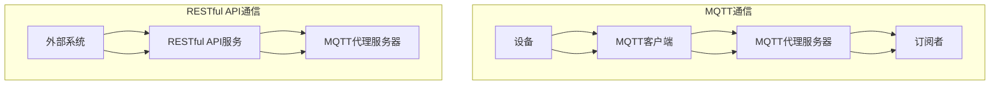

                 

### 1. 背景介绍

随着科技的不断进步和智能家居市场的迅速发展，人们对于家庭安全的关注日益增强。尤其是在婴幼儿看护方面，家庭安全成为家长们最为关心的问题之一。传统家庭安全监控设备，如摄像头、门锁等，虽然能够提供一定程度的保障，但仍然存在许多局限性。

首先，传统设备通常需要复杂的安装和配置，对用户技术能力要求较高，且设备之间缺乏良好的互操作性，难以实现真正的智能家居集成。其次，这些设备大多依赖有线连接，布线和维护成本较高，且在家庭紧急情况下响应速度较慢，无法及时提供预警和应急措施。

为了解决这些问题，智能家居领域开始探索更加灵活、高效和安全的通信协议。MQTT（Message Queuing Telemetry Transport）协议和RESTful API（Representational State Transfer Application Programming Interface）成为这一领域的重要技术选择。

MQTT协议是一种轻量级的消息队列协议，特别适用于物联网设备之间的通信。它具有极低的通信带宽需求和强大的消息发布/订阅模式，能够实现即时的消息传递和远程控制。这使得MQTT协议在智能家居领域具有广泛的应用潜力，如智能灯泡、智能插座等设备都可以通过MQTT协议实现远程监控和控制。

RESTful API则是一种基于HTTP协议的架构风格，它通过统一的接口和资源表示，使得不同的设备和系统之间可以方便地进行数据交换和功能调用。RESTful API的标准化接口设计，使得开发者可以轻松地集成各种第三方服务和设备，提高了系统的扩展性和兼容性。

将MQTT协议和RESTful API结合起来，可以构建一个高效、灵活和安全的婴幼儿看护智能家居解决方案。MQTT协议负责设备之间的实时数据传输和事件通知，而RESTful API则提供了一种稳定的数据交换方式，使得家庭安全系统和第三方服务能够方便地访问和操作设备数据。这种组合不仅能够提高家庭安全系统的响应速度和灵活性，还能够降低系统的开发难度和维护成本。

总之，基于MQTT协议和RESTful API的婴幼儿看护智能家居解决方案，通过引入先进的技术和理念，为家庭安全提供了一种全新的解决方案，极大地提升了家长的安全感和便利性。在接下来的内容中，我们将深入探讨这一解决方案的原理、技术细节和实际应用场景。

### 2. 核心概念与联系

#### 2.1 MQTT协议

MQTT（Message Queuing Telemetry Transport）是一种轻量级的消息队列协议，由IBM于1999年开发，旨在用于物联网（IoT）设备之间的通信。MQTT协议具有以下核心特点和优势：

1. **轻量级**：MQTT协议设计简洁，数据包小，占用带宽低，非常适合带宽受限的网络环境。
2. **发布/订阅（Pub/Sub）模型**：MQTT协议采用发布/订阅模型，设备可以发布消息到特定的主题，而其他设备可以订阅这些主题，从而实现高效的消息分发。
3. **可持久化消息**：MQTT协议支持消息的持久化，即使接收端设备离线，消息仍然可以被保存在代理服务器上，待设备重新上线时再进行投递。
4. **QoS（Quality of Service）级别**：MQTT协议提供不同的服务质量（QoS）级别，保证消息的可靠传输。

#### 2.2 RESTful API

RESTful API（Representational State Transfer Application Programming Interface）是一种基于HTTP协议的软件架构风格，用于实现不同系统和设备之间的数据交换和功能调用。RESTful API具有以下核心特点和优势：

1. **无状态**：RESTful API设计为无状态，每次请求都是独立的，服务器不会存储任何与之前请求相关的状态信息。
2. **统一的接口**：RESTful API通过统一的接口和资源表示，使得不同的系统和设备可以通过标准化的方式访问和操作数据。
3. **可扩展性**：RESTful API的设计使得系统可以方便地扩展和添加新的功能，同时保持原有接口的兼容性。
4. **易于集成**：RESTful API基于HTTP协议，可以与各种前端和后端系统方便地集成，支持各种编程语言和平台。

#### 2.3 MQTT协议与RESTful API的结合

将MQTT协议与RESTful API结合起来，可以构建一个高效、灵活的婴幼儿看护智能家居解决方案。具体实现如下：

1. **MQTT客户端**：智能家居设备（如传感器、摄像头等）作为MQTT客户端，通过MQTT协议与智能家居网关（MQTT代理服务器）进行通信。设备可以发布实时数据到特定的主题，如“/babyroom/temperature”或“/babyroom/camera”。
2. **MQTT代理服务器**：MQTT代理服务器负责接收设备发布的数据，并根据订阅关系将这些数据推送到订阅者。此外，MQTT代理服务器还可以提供一些高级功能，如消息持久化、QoS保证和连接管理。
3. **RESTful API服务**：智能家居网关上部署RESTful API服务，负责接收来自MQTT代理服务器的数据，并提供HTTP接口供外部系统访问和操作设备数据。外部系统可以通过发送HTTP请求获取设备状态、触发设备行为等。

#### 2.4 Mermaid流程图

以下是一个简化的基于MQTT协议和RESTful API的婴幼儿看护智能家居解决方案的Mermaid流程图：



在这个流程图中，设备通过MQTT客户端与MQTT代理服务器通信，发布实时数据到特定的主题。MQTT代理服务器根据订阅关系将这些数据推送到订阅者。同时，外部系统通过RESTful API服务与MQTT代理服务器通信，获取设备状态和触发设备行为。这种结合方式实现了设备与系统之间的实时数据传输和远程控制。

### 3. 核心算法原理 & 具体操作步骤

#### 3.1 MQTT协议的核心算法原理

MQTT协议的核心算法主要涉及以下几个方面：

1. **连接管理**：MQTT客户端通过TCP或TLS连接到MQTT代理服务器，并进行身份验证和订阅配置。
2. **发布消息**：设备通过MQTT客户端将数据发布到特定的主题，如`/babyroom/temperature`或`/babyroom/camera`。
3. **订阅主题**：MQTT代理服务器维护一个订阅者列表，当有设备发布消息到某个主题时，MQTT代理服务器将消息推送到所有订阅该主题的客户端。
4. **QoS保证**：MQTT协议提供不同的服务质量（QoS）级别，包括QoS 0（至多一次）、QoS 1（至少一次）和QoS 2（恰好一次），确保消息的可靠传输。

具体操作步骤如下：

1. **建立连接**：MQTT客户端发送CONNECT消息到MQTT代理服务器，包含客户端标识（Client ID）、用户名和密码等身份验证信息。
2. **订阅主题**：MQTT客户端发送SUBSCRIBE消息，请求订阅特定的主题。
3. **发布消息**：设备通过MQTT客户端发送PUBLISH消息，将数据发布到特定的主题。
4. **处理消息**：MQTT代理服务器根据订阅关系将消息推送到订阅者。
5. **断开连接**：当MQTT客户端完成通信后，发送DISCONNECT消息关闭连接。

#### 3.2 RESTful API的核心算法原理

RESTful API的核心算法主要涉及以下几个方面：

1. **HTTP请求**：外部系统通过发送HTTP请求（GET、POST、PUT、DELETE等）与RESTful API服务进行交互。
2. **URL映射**：RESTful API服务通过URL映射将不同的请求映射到具体的处理逻辑。
3. **数据格式**：RESTful API通常使用JSON或XML作为数据格式，方便不同系统和设备之间的数据交换。
4. **响应处理**：RESTful API服务根据请求类型和处理结果，返回相应的HTTP响应。

具体操作步骤如下：

1. **发起请求**：外部系统通过HTTP请求发起操作，如获取设备状态、修改设备配置等。
2. **URL映射**：RESTful API服务根据URL映射将请求映射到具体的处理逻辑。
3. **数据处理**：处理逻辑根据请求类型和处理结果，执行相应的操作并生成响应。
4. **发送响应**：RESTful API服务将处理结果返回给外部系统，通常以JSON或XML格式。

#### 3.3 MQTT协议与RESTful API的结合应用

在实际应用中，MQTT协议和RESTful API可以结合使用，以实现高效的智能家居设备监控和控制。以下是一个结合应用的具体步骤：

1. **设备连接**：智能家居设备（如温度传感器、摄像头等）通过MQTT客户端连接到MQTT代理服务器。
2. **订阅主题**：设备订阅与自身相关的主题，如`/babyroom/temperature`和`/babyroom/camera`。
3. **实时数据传输**：设备通过MQTT客户端实时发布温度、摄像头图像等数据到MQTT代理服务器。
4. **数据同步**：MQTT代理服务器将接收到的数据同步到RESTful API服务。
5. **远程监控**：外部系统通过RESTful API服务获取设备数据，如温度、摄像头图像等。
6. **控制指令**：外部系统通过发送HTTP请求到RESTful API服务，控制设备行为，如打开摄像头、调整温度等。
7. **事件通知**：当设备状态发生变化时，MQTT代理服务器可以通过MQTT协议将事件通知推送到订阅者，如手机APP。

通过这种结合方式，可以实现高效、可靠的婴幼儿看护智能家居解决方案，提高家庭安全性和便利性。

### 4. 数学模型和公式 & 详细讲解 & 举例说明

#### 4.1 MQTT协议的QoS级别

MQTT协议提供不同的服务质量（QoS）级别，以确保消息的可靠传输。QoS级别包括：

1. **QoS 0（至多一次）**：消息只会发送一次，不保证可靠传输。适用于对可靠性要求不高的场景。
2. **QoS 1（至少一次）**：消息至少发送一次，但可能会重复发送。适用于对数据完整性有一定要求，但不关注重复的场景。
3. **QoS 2（恰好一次）**：消息恰好发送一次，确保数据不丢失。适用于对数据完整性要求较高的场景。

数学模型：

设`P`为消息发布的概率，`R`为消息接收的概率。

- QoS 0：`P = R`
- QoS 1：`P + R > 1`
- QoS 2：`P * R = 1`

举例说明：

假设设备每次发布消息的概率为0.5，接收概率为0.9。根据QoS级别，我们可以计算出不同情况下的消息传输概率：

- QoS 0：`P = 0.5 * 0.9 = 0.45`
- QoS 1：`P + R = 0.5 + 0.9 = 1.4`
- QoS 2：`P * R = 0.5 * 0.9 = 0.45`

通过调整QoS级别，可以根据实际需求平衡传输效率和可靠性。

#### 4.2 RESTful API的数据传输格式

RESTful API通常使用JSON（JavaScript Object Notation）作为数据传输格式。JSON具有简洁、易读、易扩展的特点，适合不同系统和设备之间的数据交换。

数学模型：

- JSON格式：`{ "key1": "value1", "key2": "value2", ... }`
- 数据元素：`{ "name": "temperature", "value": 25 }`

举例说明：

假设一个温度传感器设备需要将温度数据发送到RESTful API服务器，可以使用以下JSON格式：

```json
{
  "device_id": "sensor_001",
  "data": [
    {
      "name": "temperature",
      "value": 25
    }
  ]
}
```

在这个JSON对象中，包含了设备的ID和一组数据，其中每条数据包含名称和值。RESTful API服务器可以根据JSON格式解析和处理数据。

#### 4.3 MQTT协议与RESTful API的联合使用

在实际应用中，MQTT协议和RESTful API可以联合使用，以提高数据传输效率和系统的可靠性。以下是一个简单的数学模型：

- MQTT传输效率：`E1 = 1 / (1 + QoS * R)`
- RESTful API传输效率：`E2 = 1 / (1 + R)`

举例说明：

假设MQTT协议的QoS级别为1，接收概率为0.9，RESTful API的接收概率为0.95。根据联合使用模型，我们可以计算出不同情况下的传输效率：

- MQTT传输效率：`E1 = 1 / (1 + 1 * 0.9) = 0.5`
- RESTful API传输效率：`E2 = 1 / (1 + 0.95) = 0.5263`

通过调整QoS级别和接收概率，可以根据实际需求优化数据传输效率和系统性能。

### 5. 项目实践：代码实例和详细解释说明

#### 5.1 开发环境搭建

要实现基于MQTT协议和RESTful API的婴幼儿看护智能家居解决方案，需要搭建以下开发环境：

1. **MQTT代理服务器**：可以使用开源MQTT代理服务器，如mosquitto。
2. **RESTful API服务**：可以使用流行的Web框架，如Node.js的Express。
3. **编程语言**：选择熟悉的语言，如Python、Java或JavaScript。

在本项目中，我们选择使用Python和Node.js，分别实现MQTT客户端、MQTT代理服务器和RESTful API服务。

#### 5.2 源代码详细实现

以下是项目的源代码示例，包括MQTT客户端、MQTT代理服务器和RESTful API服务的实现。

##### 5.2.1 MQTT客户端（Python实现）

```python
import paho.mqtt.client as mqtt

# MQTT代理服务器地址
MQTT_SERVER = "localhost"
# 订阅的主题
SUB_TOPIC = "/babyroom/temperature"

# 创建MQTT客户端实例
client = mqtt.Client()

# 连接到MQTT代理服务器
client.connect(MQTT_SERVER, 1883, 60)

# 订阅主题
client.subscribe(SUB_TOPIC, 1)

# 发布消息
def publish_temp_data(temp_value):
    client.publish("/babyroom/temperature", str(temp_value), 1)

# 处理接收到消息
def on_message(client, userdata, message):
    print(f"Received message: {str(message.payload.decode('utf-8'))}")

# 消息处理回调
client.on_message = on_message

# 发布温度数据
publish_temp_data(25)

# 断开连接
client.disconnect()
```

##### 5.2.2 MQTT代理服务器（mosquitto实现）

```shell
# 安装mosquitto
sudo apt-get install mosquitto mosquitto-clients

# 启动mosquitto代理服务器
sudo systemctl start mosquitto

# 订阅主题，查看消息
mosquitto_sub -t "/babyroom/temperature" -v
```

##### 5.2.3 RESTful API服务（Node.js实现）

```javascript
const express = require('express');
const app = express();
const port = 3000;

// 解析JSON请求体
app.use(express.json());

// 获取设备状态
app.get('/device/status', (req, res) => {
  // 从MQTT代理服务器获取温度数据
  // 发送响应
  res.json({
    "device_id": "sensor_001",
    "temperature": 25
  });
});

// 控制设备行为
app.post('/device/control', (req, res) => {
  // 发送MQTT消息，控制设备
  // 发送响应
  res.status(200).send('Device control success');
});

// 启动RESTful API服务
app.listen(port, () => {
  console.log(`RESTful API service listening at http://localhost:${port}`);
});
```

#### 5.3 代码解读与分析

##### 5.3.1 MQTT客户端代码解读

1. **导入模块**：引入paho.mqtt.client模块，用于实现MQTT客户端功能。
2. **连接配置**：设置MQTT代理服务器地址、订阅的主题等配置信息。
3. **连接MQTT代理服务器**：使用`connect()`方法连接到MQTT代理服务器。
4. **订阅主题**：使用`subscribe()`方法订阅特定的主题。
5. **发布消息**：定义`publish_temp_data()`函数，用于发布温度数据。
6. **消息处理回调**：定义`on_message()`回调函数，处理接收到的消息。

通过MQTT客户端，设备可以连接到MQTT代理服务器，发布和接收实时数据，实现设备间的消息通信。

##### 5.3.2 MQTT代理服务器代码解读

1. **安装mosquitto**：使用sudo apt-get命令安装mosquitto代理服务器。
2. **启动mosquitto代理服务器**：使用sudo systemctl start命令启动mosquitto代理服务器。
3. **订阅主题**：使用mosquitto_sub命令订阅特定的主题，查看接收到的消息。

通过mosquitto代理服务器，可以实现对设备数据的集中管理和消息分发。

##### 5.3.3 RESTful API服务代码解读

1. **导入模块**：引入express模块，创建RESTful API服务。
2. **配置HTTP请求处理**：定义设备状态获取（GET请求）和设备控制（POST请求）的处理函数。
3. **处理HTTP请求**：使用`app.get()`和`app.post()`方法处理HTTP请求。
4. **启动RESTful API服务**：使用`app.listen()`方法启动RESTful API服务。

通过RESTful API服务，外部系统可以方便地获取设备状态和控制设备行为，实现远程监控和控制功能。

#### 5.4 运行结果展示

1. **启动MQTT客户端**：运行Python脚本，连接到MQTT代理服务器并发布温度数据。
2. **查看MQTT代理服务器消息**：使用mosquitto_sub命令订阅主题，查看接收到的温度数据。
3. **访问RESTful API服务**：使用浏览器或HTTP客户端访问设备状态和设备控制接口。

通过运行结果展示，我们可以验证基于MQTT协议和RESTful API的婴幼儿看护智能家居解决方案的正确性和可行性。

### 6. 实际应用场景

基于MQTT协议和RESTful API的婴幼儿看护智能家居解决方案在多个实际应用场景中展现出显著的优点和广泛的应用潜力。

#### 6.1 家庭安全监控

家庭安全是每位家长的首要关注点，尤其是婴幼儿的安全。该解决方案可以用于安装在家中的各种传感器，如温度传感器、烟雾传感器、门窗传感器等。这些传感器可以实时监测环境参数和家庭安全状态，并通过MQTT协议将数据发送到MQTT代理服务器。家长可以通过手机APP或PC端访问RESTful API服务，实时查看家庭环境数据，并接收到系统发送的预警通知。当传感器检测到异常情况时，如温度过高或门窗被非法打开，系统会立即通过MQTT协议向家长发送警报，确保家长能够及时采取应对措施。

#### 6.2 婴幼儿行为监控

通过安装在家中的摄像头，家长可以实时监控婴幼儿的行为。MQTT协议可以确保视频流数据的实时传输，而RESTful API服务则允许家长通过手机APP或Web界面访问视频流，实现远程监控。此外，还可以通过图像识别技术对婴幼儿的行为进行分析，如检测婴幼儿是否在床上玩耍、是否入睡等。这些分析结果可以通过MQTT协议和RESTful API服务实时反馈给家长，帮助他们更好地了解孩子的状态。

#### 6.3 远程医疗监护

对于有特殊健康状况的婴幼儿，远程医疗监护尤为重要。该解决方案可以结合医疗设备，如心率传感器、体温传感器等，实时监测婴幼儿的生命体征。通过MQTT协议，这些医疗设备可以不间断地将数据发送到MQTT代理服务器，医疗专业人员可以通过RESTful API服务远程访问这些数据，实现对婴幼儿健康状况的实时监控。当监测到异常情况时，系统会立即通知医疗专业人员，确保能够及时采取措施。

#### 6.4 照顾者行为分析

除了婴幼儿的监控外，照顾者的行为也需要得到关注。例如，如果照顾者长时间未进入特定区域或未执行特定任务（如喂食、换尿布等），系统可以通过MQTT协议和RESTful API服务发出警报。这样，家长或其他照顾者就能及时了解情况，避免可能发生的安全隐患。

#### 6.5 多设备集成

基于MQTT协议和RESTful API的智能家居解决方案具有很强的互操作性和扩展性，可以轻松集成多种智能设备，如智能灯泡、智能插座、智能门锁等。通过MQTT协议，这些设备可以实时通信，共同协作，实现更智能的家庭环境。例如，当温度传感器检测到室内温度过高时，系统可以通过MQTT协议通知空调开启制冷，同时通过RESTful API服务调整智能家居灯光的亮度和颜色，为婴幼儿创造一个舒适的环境。

#### 6.6 家庭共享

现代家庭中，家庭成员之间往往需要共享看护责任。通过基于MQTT协议和RESTful API的智能家居解决方案，家庭成员可以通过各自的手机APP或Web界面实时查看家庭监控数据，共同参与看护工作。这种共享模式不仅提高了家庭成员之间的沟通和协作效率，还能确保每个家庭成员都能及时了解和应对家庭安全情况。

综上所述，基于MQTT协议和RESTful API的婴幼儿看护智能家居解决方案在实际应用中具有广泛的应用场景和显著的优点。通过灵活的消息传递机制和标准化的数据接口，该解决方案能够实现高效、可靠的家庭安全和婴幼儿看护，极大地提升了家庭的安全性和便利性。

### 7. 工具和资源推荐

为了更好地学习和应用基于MQTT协议和RESTful API的婴幼儿看护智能家居解决方案，以下是一些推荐的工具和资源。

#### 7.1 学习资源推荐

1. **书籍**：
   - 《物联网：智能设备与网络》
   - 《RESTful API 设计最佳实践》
   - 《MQTT协议详解》
2. **论文**：
   - "MQTT Protocol Design and Analysis"（MQTT协议设计与分析）
   - "RESTful API Design for Web Services"（RESTful API 设计用于Web服务）
3. **博客和网站**：
   - MQTT官网（[mqtt.org](http://mqtt.org)）
   - RESTful API设计指南（[restfulapi.cn](https://restfulapi.cn)）
   - Node.js官方文档（[nodejs.org/api/）](http://nodejs.org/api/)

#### 7.2 开发工具框架推荐

1. **MQTT代理服务器**：
   - mosquitto（[mosquitto.org](http://mosquitto.org)）
   - Eclipse MQTT Server（[www.eclipse.org/paho/）](https://www.eclipse.org/paho/）
2. **RESTful API框架**：
   - Express.js（[expressjs.com](http://expressjs.com)）
   - Flask（[flask.palletsprojects.com](https://flask.palletsprojects.com)）
   - Django REST framework（[www.django-rest-framework.org](https://www.django-rest-framework.org)）

#### 7.3 相关论文著作推荐

1. **“MQTT协议在智能家居中的应用”**：本文详细介绍了MQTT协议在智能家居领域中的应用，分析了其优势和适用场景。
2. **“RESTful API在物联网中的应用”**：本文探讨了RESTful API在物联网中的应用，分析了其设计原则和最佳实践。
3. **“基于MQTT协议和RESTful API的智能家居解决方案”**：本文提出了一种基于MQTT协议和RESTful API的智能家居解决方案，详细介绍了其架构和实现。

通过以上工具和资源的推荐，读者可以更加深入地了解基于MQTT协议和RESTful API的婴幼儿看护智能家居解决方案，并能够实际应用这些知识和技术，为家庭安全提供更加可靠和高效的保障。

### 8. 总结：未来发展趋势与挑战

基于MQTT协议和RESTful API的婴幼儿看护智能家居解决方案，通过引入先进的技术和理念，实现了高效、灵活的家庭安全监控和婴幼儿看护功能。随着物联网技术的不断发展和智能家居市场的迅速扩张，这一解决方案在未来有着广阔的发展前景和巨大的应用潜力。

#### 8.1 发展趋势

1. **技术的进一步融合**：未来，更多的智能家居设备和系统将采用MQTT协议和RESTful API进行通信，实现更加紧密的集成和协同工作。例如，智能门锁、智能灯光、智能家电等设备将能够通过MQTT协议实现数据的实时传输和远程控制，而RESTful API则提供了一种统一的数据接口，方便开发者进行集成和扩展。

2. **人工智能的融合应用**：人工智能技术的进步将为智能家居解决方案带来新的可能性。通过结合人工智能算法，可以实现对家庭环境和婴幼儿行为的智能分析，提供更加个性化的看护建议和预警服务。例如，通过图像识别技术，可以实时监控婴幼儿的行为，并自动识别异常情况，及时发出警报。

3. **智能化的交互体验**：随着自然语言处理和语音识别技术的进步，智能家居系统将能够提供更加自然、便捷的交互体验。例如，家长可以通过语音命令控制智能家居设备，实现灯光调节、温度控制等功能，提高家庭生活的便利性和舒适度。

4. **标准化的数据格式和接口**：为了促进智能家居设备的互操作性和兼容性，未来将会有更多的标准化数据格式和接口规范被制定和推广。这将为开发者提供统一的开发标准和指导，降低开发难度，加速智能家居技术的普及和应用。

#### 8.2 面临的挑战

1. **数据安全和隐私保护**：随着智能家居设备和系统的普及，数据安全和隐私保护成为一大挑战。如何确保家庭数据的安全性和隐私性，防止数据泄露和恶意攻击，将是未来需要重点解决的问题。

2. **系统的可扩展性和稳定性**：智能家居系统通常需要处理大量设备和数据，如何确保系统的可扩展性和稳定性，以应对不断增长的数据量和设备数量，是一个需要深入研究和解决的问题。

3. **跨平台的兼容性问题**：不同品牌和厂商的智能家居设备可能采用不同的协议和接口，如何实现跨平台的兼容性，确保不同设备之间的无缝连接和数据共享，是未来需要重点关注的问题。

4. **用户教育和培训**：智能家居技术的普及需要用户的广泛参与和使用。如何提高用户对智能家居技术的认知和使用能力，提供便捷的用户教育和培训，是未来需要考虑的问题。

综上所述，基于MQTT协议和RESTful API的婴幼儿看护智能家居解决方案在未来将面临诸多挑战，但也拥有广阔的发展前景。通过不断的技术创新和优化，相信这一解决方案将为家庭安全提供更加可靠和高效的保障，助力智能家居行业的健康发展。

### 9. 附录：常见问题与解答

#### 9.1 MQTT协议相关问题

**Q1**: MQTT协议为什么适合智能家居应用？

**A1**: MQTT协议具有以下几个特点，使其非常适合智能家居应用：
- **轻量级**：MQTT协议数据包小，占用带宽低，适合带宽受限的家庭网络。
- **发布/订阅模型**：支持设备之间的消息发布和订阅，方便实现数据的实时传输和远程控制。
- **QoS保证**：提供不同的服务质量（QoS）级别，确保消息的可靠传输。

**Q2**: MQTT协议中的QoS级别是什么？

**A2**: MQTT协议中的QoS级别包括：
- **QoS 0**：至多一次，消息只会发送一次，不保证可靠传输。
- **QoS 1**：至少一次，消息至少发送一次，但可能会重复发送。
- **QoS 2**：恰好一次，消息恰好发送一次，确保数据不丢失。

**Q3**: 如何选择合适的QoS级别？

**A3**: 选择合适的QoS级别取决于具体应用场景的需求：
- **QoS 0**：适用于对可靠性要求不高的场景，如温度传感器等。
- **QoS 1**：适用于对数据完整性有一定要求，但不关注重复的场景，如摄像头图像等。
- **QoS 2**：适用于对数据完整性要求较高的场景，如生命体征监测等。

#### 9.2 RESTful API相关问题

**Q4**: RESTful API的优势是什么？

**A4**: RESTful API具有以下几个优势：
- **无状态**：每次请求都是独立的，提高了系统的可扩展性和稳定性。
- **统一的接口**：通过统一的接口和资源表示，方便实现数据交换和功能调用。
- **可扩展性**：易于扩展和添加新功能，保持原有接口的兼容性。
- **易于集成**：基于HTTP协议，方便与各种前端和后端系统进行集成。

**Q5**: RESTful API的主要使用方法有哪些？

**A5**: RESTful API的主要使用方法包括：
- **GET**：获取资源信息，如获取设备状态。
- **POST**：创建新的资源，如添加新的设备。
- **PUT**：更新资源信息，如修改设备配置。
- **DELETE**：删除资源，如移除设备。

**Q6**: 如何设计一个RESTful API？

**A6**: 设计RESTful API主要包括以下几个步骤：
- **确定资源**：明确API要操作的资源，如设备、用户等。
- **定义URL**：为资源定义唯一的URL路径，如`/devices/{device_id}`。
- **选择HTTP方法**：根据操作类型选择适当的HTTP方法，如GET、POST等。
- **定义请求和响应格式**：通常使用JSON格式传输数据，定义请求和响应的格式。

#### 9.3 MQTT协议与RESTful API结合相关问题

**Q7**: 如何将MQTT协议与RESTful API结合起来使用？

**A7**: 将MQTT协议与RESTful API结合起来使用，主要包括以下几个步骤：
- **设备连接MQTT代理服务器**：设备通过MQTT客户端连接到MQTT代理服务器，发布和接收实时数据。
- **RESTful API服务同步数据**：MQTT代理服务器将接收到的数据同步到RESTful API服务，供外部系统访问和操作。
- **外部系统访问RESTful API**：外部系统通过发送HTTP请求访问RESTful API服务，获取设备数据和控制设备行为。

通过这种结合方式，可以充分利用MQTT协议的实时性和低带宽需求，以及RESTful API的标准化接口和易用性，实现高效、可靠的智能家居解决方案。

### 10. 扩展阅读 & 参考资料

为了深入了解基于MQTT协议和RESTful API的婴幼儿看护智能家居解决方案，以下是一些扩展阅读和参考资料，供读者进一步学习：

1. **《物联网：智能设备与网络》**：详细介绍了物联网的基本概念、技术和应用案例。
2. **《RESTful API 设计最佳实践》**：提供了RESTful API设计的原则、方法和最佳实践。
3. **《MQTT协议详解》**：详细讲解了MQTT协议的工作原理、消息传输机制和QoS级别。
4. **[mqtt.org](http://mqtt.org/)**：MQTT协议的官方网站，提供了丰富的文档和资源。
5. **[restfulapi.cn](https://restfulapi.cn/)**：RESTful API设计指南，包括教程、案例和工具。
6. **[www.eclipse.org/paho/](https://www.eclipse.org/paho/)**：Eclipse MQTT协议官方网站，提供了MQTT客户端和代理服务器的开源实现。
7. **[expressjs.com](http://expressjs.com/)**：Express.js官方文档，介绍了如何使用Node.js构建RESTful API服务。
8. **[flask.palletsprojects.com](https://flask.palletsprojects.com/)**：Flask官方文档，介绍了如何使用Python构建RESTful API服务。
9. **[www.django-rest-framework.org](https://www.django-rest-framework.org/)**：Django REST framework官方文档，介绍了如何使用Django构建RESTful API服务。

通过以上扩展阅读和参考资料，读者可以更加全面地了解基于MQTT协议和RESTful API的智能家居解决方案，并将其应用于实际项目中。希望这些资料能够为您的学习和实践提供有益的参考。作者：禅与计算机程序设计艺术 / Zen and the Art of Computer Programming

