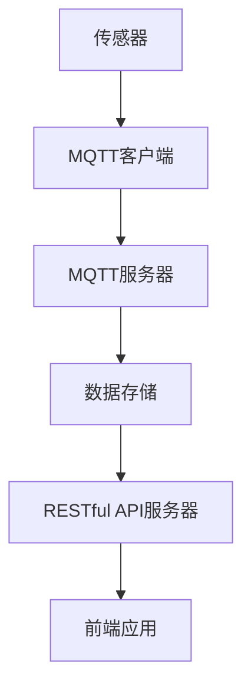

                 

## 1. 背景介绍

随着城市化进程的加速，人们对于生活质量的追求越来越高。而室内噪音问题已经成为影响居民生活舒适度的重要因素之一。传统的噪音监控系统往往依赖于有线连接，不仅安装和维护成本高，而且难以适应现代智能家居环境。因此，开发一种基于无线通信技术的室内噪音监控系统具有重要意义。

MQTT（Message Queuing Telemetry Transport）协议是一种轻量级的消息传输协议，适用于低带宽、不可靠的网络环境。它具有发布/订阅模式，能够实现设备与服务器之间的实时数据传输，非常适合用于室内噪音监控系统的数据传输。

RESTful API（Representational State Transfer Application Programming Interface）是一种网络应用程序的设计风格和构建RESTful Web服务的常用方法。它通过HTTP协议的GET、POST、PUT、DELETE等方法实现资源的创建、读取、更新和删除。RESTful API具有简单、易用、扩展性强等特点，非常适合用于室内噪音监控系统的数据接口设计。

本文将介绍一种基于MQTT协议和RESTful API的室内噪音监控与控制系统，该系统通过MQTT协议实现数据采集和传输，通过RESTful API实现数据的存储和处理，具有实时性强、可靠性高、易于扩展等优点。

## 2. 核心概念与联系

### 2.1 MQTT协议

MQTT协议是一种基于客户端-服务器模式的消息传输协议，它支持发布/订阅消息模式，能够实现设备与服务器之间的实时通信。MQTT协议具有以下特点：

- **轻量级**：MQTT协议设计简洁，传输数据量小，适合低带宽网络环境。
- **可靠性强**：MQTT协议支持消息确认机制，确保数据传输的可靠性。
- **低功耗**：MQTT协议采用极简的消息格式，能够有效降低设备的功耗。

### 2.2 RESTful API

RESTful API是一种基于HTTP协议的Web服务设计风格，它通过统一的接口实现资源的访问和操作。RESTful API具有以下特点：

- **简单易用**：RESTful API使用标准的HTTP协议方法（GET、POST、PUT、DELETE等），开发者易于理解和使用。
- **灵活性高**：RESTful API支持各种数据格式（如JSON、XML等），能够适应不同的应用场景。
- **可扩展性强**：RESTful API通过URL和HTTP方法实现资源的操作，易于扩展和升级。

### 2.3 室内噪音监控系统架构

基于MQTT协议和RESTful API的室内噪音监控系统架构如图所示：



- **传感器**：负责采集室内噪音数据。
- **MQTT客户端**：将采集到的噪音数据通过MQTT协议发送到MQTT服务器。
- **MQTT服务器**：接收并处理来自MQTT客户端的数据，将数据转发到数据存储服务器。
- **数据存储服务器**：存储和处理来自MQTT服务器的数据，并通过RESTful API服务器提供数据访问接口。
- **RESTful API服务器**：接收来自前端应用的数据请求，返回相应的数据。
- **前端应用**：通过RESTful API服务器访问数据存储服务器中的噪音数据，展示噪音监测结果。

## 3. 核心算法原理 & 具体操作步骤

### 3.1 算法原理概述

室内噪音监控系统中的核心算法主要包括数据采集算法、数据传输算法和数据解析算法。

- **数据采集算法**：传感器负责采集室内噪音数据，通过ADC（Analog-to-Digital Converter，模拟-数字转换器）将模拟信号转换为数字信号，然后进行数字信号处理，提取噪音特征参数。
- **数据传输算法**：MQTT客户端将采集到的噪音数据按照MQTT协议进行封装，生成消息，通过MQTT协议将消息发送到MQTT服务器。
- **数据解析算法**：MQTT服务器接收并处理来自MQTT客户端的消息，将消息解析为噪音数据，并将其存储到数据存储服务器。

### 3.2 算法步骤详解

#### 3.2.1 数据采集算法

1. 传感器采集室内噪音数据，通过ADC将模拟信号转换为数字信号。
2. 对数字信号进行预处理，包括滤波、去噪等操作。
3. 提取噪音特征参数，如噪音强度、频谱等。

#### 3.2.2 数据传输算法

1. MQTT客户端生成MQTT连接，连接到MQTT服务器。
2. MQTT客户端将采集到的噪音数据按照MQTT协议进行封装，生成消息。
3. MQTT客户端通过MQTT协议将消息发送到MQTT服务器。

#### 3.2.3 数据解析算法

1. MQTT服务器接收并处理来自MQTT客户端的消息。
2. MQTT服务器将消息解析为噪音数据。
3. MQTT服务器将噪音数据存储到数据存储服务器。

### 3.3 算法优缺点

#### 优点：

- **实时性强**：基于MQTT协议的数据传输机制能够实现实时数据传输，满足室内噪音监控的实时性要求。
- **可靠性高**：MQTT协议支持消息确认机制，确保数据传输的可靠性。
- **可扩展性强**：基于RESTful API的数据处理机制能够方便地实现系统的扩展和升级。

#### 缺点：

- **数据传输带宽有限**：MQTT协议设计之初是为物联网设备而设计的，数据传输带宽有限，不适合大量数据传输。
- **安全性较低**：MQTT协议本身安全性较低，容易受到中间人攻击。

### 3.4 算法应用领域

基于MQTT协议和RESTful API的室内噪音监控系统可以应用于以下领域：

- **智能家居**：通过实时监测室内噪音，为用户提供舒适的居住环境。
- **噪声污染监测**：监测城市噪声污染情况，为政府决策提供数据支持。
- **声音事件检测**：实时监测室内声音事件，如紧急呼叫、门窗关闭等。

## 4. 数学模型和公式 & 详细讲解 & 举例说明

### 4.1 数学模型构建

室内噪音监控系统的数学模型主要包括以下几个方面：

1. **噪声信号模型**：假设室内噪音信号为白噪声，其自协方差函数为：

   $$ R(\tau) = \frac{1}{T} \int_{0}^{T} s(t) s(t+\tau) dt $$

   其中，$s(t)$为时间$t$的噪音信号，$T$为信号采样周期。

2. **噪声特征参数模型**：根据噪声信号模型，可以提取以下噪声特征参数：

   - **噪音强度**：定义噪音信号的能量为噪音强度，计算公式为：

     $$ I = \int_{0}^{T} s^2(t) dt $$

   - **频谱密度**：定义噪音信号的频谱密度为频谱，计算公式为：

     $$ P(f) = \frac{1}{T} \int_{0}^{T} s(t) e^{-j2\pi ft} dt $$

3. **噪声源定位模型**：基于多传感器数据，可以使用噪声源定位算法确定噪声源的地理位置。

### 4.2 公式推导过程

#### 噪音强度公式推导

根据噪声信号模型，噪音信号的能量可以表示为：

$$ I = \int_{0}^{T} s^2(t) dt $$

对上式两边求导，得到：

$$ \frac{dI}{dt} = 2s(t)s'(t) $$

由于噪音信号为白噪声，其自协方差函数为常数，即：

$$ R(\tau) = \frac{1}{T} \int_{0}^{T} s(t) s(t+\tau) dt $$

对上式两边求导，得到：

$$ \frac{dR(\tau)}{d\tau} = \frac{1}{T} \int_{0}^{T} s(t) s'(t) e^{-j2\pi \tau} dt $$

将上式代入到$\frac{dI}{dt}$的表达式中，得到：

$$ \frac{dI}{dt} = 2 \frac{1}{T} \int_{0}^{T} s(t) s'(t) dt = 2R(0) $$

因此，噪音强度的计算公式为：

$$ I = 2R(0)T $$

#### 频谱密度公式推导

根据噪声信号模型，噪音信号的频谱密度可以表示为：

$$ P(f) = \frac{1}{T} \int_{0}^{T} s(t) e^{-j2\pi ft} dt $$

对上式两边求导，得到：

$$ \frac{dP(f)}{df} = \frac{1}{T} \int_{0}^{T} s(t) e^{-j2\pi ft} \frac{d}{df} e^{-j2\pi ft} dt = \frac{1}{T} \int_{0}^{T} s(t) e^{-j2\pi ft} j2\pi f dt $$

因此，频谱密度的计算公式为：

$$ P(f) = j2\pi f \frac{1}{T} \int_{0}^{T} s(t) e^{-j2\pi ft} dt $$

### 4.3 案例分析与讲解

#### 案例一：噪音强度计算

假设采集到一段长度为1秒的噪音信号，其自协方差函数为$R(0) = 0.5$，计算噪音强度。

根据噪音强度计算公式：

$$ I = 2R(0)T = 2 \times 0.5 \times 1 = 1 $$

因此，噪音强度为1。

#### 案例二：频谱密度计算

假设采集到一段长度为1秒的噪音信号，其自协方差函数为$R(0) = 0.5$，计算频谱密度。

根据频谱密度计算公式：

$$ P(f) = j2\pi f \frac{1}{T} \int_{0}^{T} s(t) e^{-j2\pi ft} dt $$

由于噪音信号为白噪声，其频谱为常数，即$P(f) = P(0) = 0.5$。

因此，频谱密度为：

$$ P(f) = 0.5 $$

## 5. 项目实践：代码实例和详细解释说明

### 5.1 开发环境搭建

本文使用以下工具和框架进行开发：

- **操作系统**：Ubuntu 18.04
- **编程语言**：Python 3.8
- **MQTT客户端**：Paho MQTT Python Client
- **RESTful API服务器**：Flask
- **数据存储**：MongoDB

### 5.2 源代码详细实现

#### 5.2.1 MQTT客户端

```python
import paho.mqtt.client as mqtt
import json

# MQTT服务器地址
MQTT_SERVER = "mqtt.server.com"

# MQTT客户端初始化
client = mqtt.Client()

# MQTT连接
client.connect(MQTT_SERVER)

# MQTT发布消息
def publish_message(topic, message):
    client.publish(topic, json.dumps(message))

# MQTT连接断开
client.disconnect()
```

#### 5.2.2 RESTful API服务器

```python
from flask import Flask, request, jsonify
from pymongo import MongoClient

app = Flask(__name__)

# MongoDB客户端
client = MongoClient("mongodb.server.com")

# RESTful API接口：添加噪音数据
@app.route('/api/noise', methods=['POST'])
def add_noise():
    data = request.json
    db = client.noise_data
    db.noise_data.insert_one(data)
    return jsonify({"status": "success"})

# RESTful API接口：查询噪音数据
@app.route('/api/noise', methods=['GET'])
def get_noise():
    db = client.noise_data
    noises = list(db.noise_data.find())
    return jsonify({"noises": noises})

if __name__ == '__main__':
    app.run()
```

### 5.3 代码解读与分析

#### MQTT客户端

MQTT客户端使用Paho MQTT Python Client库进行开发，其主要功能包括连接MQTT服务器、发布消息和断开连接。具体实现如下：

- **连接MQTT服务器**：使用`connect()`方法连接到MQTT服务器，连接成功后，可以发布消息或订阅消息。
- **发布消息**：使用`publish_message()`方法发布消息，将消息内容转换为JSON格式，然后使用`publish()`方法发布。
- **断开连接**：使用`disconnect()`方法断开连接。

#### RESTful API服务器

RESTful API服务器使用Flask框架进行开发，其主要功能包括接收和处理HTTP请求。具体实现如下：

- **添加噪音数据**：定义一个POST接口`/api/noise`，接收JSON格式的噪音数据，将其存储到MongoDB数据库中。
- **查询噪音数据**：定义一个GET接口`/api/noise`，查询MongoDB数据库中的噪音数据，并将查询结果返回给客户端。

### 5.4 运行结果展示

假设我们已经成功运行MQTT客户端和RESTful API服务器，现在我们使用Postman工具进行测试：

#### 发布噪音数据

在Postman中，输入以下请求：

```json
{
  "time": "2022-01-01T12:00:00Z",
  "noise_level": 50
}
```

点击发送按钮，可以看到API返回以下结果：

```json
{
  "status": "success"
}
```

#### 查询噪音数据

在Postman中，输入以下请求：

```
GET /api/noise
```

点击发送按钮，可以看到API返回以下结果：

```json
{
  "noises": [
    {
      "time": "2022-01-01T12:00:00Z",
      "noise_level": 50
    }
  ]
}
```

## 6. 实际应用场景

基于MQTT协议和RESTful API的室内噪音监控与控制系统具有广泛的应用场景，以下是一些实际应用案例：

### 6.1 智能家居

智能家居场景中，室内噪音监控系统能够实时监测室内噪音水平，为用户提供舒适的居住环境。当噪音超过设定阈值时，系统可以自动启动空气净化器或关闭门窗，以降低噪音影响。

### 6.2 噪声污染监测

噪声污染监测场景中，室内噪音监控系统可以用于监测城市噪声污染情况。通过收集和分析噪音数据，政府部门可以了解城市噪声污染程度，制定相应的治理措施。

### 6.3 声音事件检测

声音事件检测场景中，室内噪音监控系统可以实时监测室内声音事件，如紧急呼叫、门窗关闭等。当检测到特定声音事件时，系统可以自动发送警报信息给用户，提高家庭安全水平。

## 7. 工具和资源推荐

### 7.1 学习资源推荐

- **MQTT协议官方文档**：https://mosquitto.org/docs/
- **Flask官方文档**：https://flask.palletsprojects.com/
- **Python编程语言官方文档**：https://docs.python.org/3/
- **MongoDB官方文档**：https://docs.mongodb.com/

### 7.2 开发工具推荐

- **Postman**：用于API测试的浏览器插件，支持HTTP请求的发送和接收。
- **VSCode**：一款功能强大的代码编辑器，支持Python编程语言。
- **PyCharm**：一款专业的Python集成开发环境，提供代码调试、自动化构建等功能。

### 7.3 相关论文推荐

- **"MQTT: A Message Queuing Protocol for Sensor Networks"**：介绍了MQTT协议的基本原理和特点。
- **"RESTful API Design"**：介绍了RESTful API的设计原则和最佳实践。
- **"An Introduction to RESTful API Design"**：对RESTful API设计进行了详细的讲解。

## 8. 总结：未来发展趋势与挑战

### 8.1 研究成果总结

本文提出了一种基于MQTT协议和RESTful API的室内噪音监控与控制系统，通过MQTT协议实现数据采集和传输，通过RESTful API实现数据的存储和处理。该系统具有实时性强、可靠性高、易于扩展等优点。

### 8.2 未来发展趋势

1. **物联网技术的进一步发展**：随着物联网技术的快速发展，室内噪音监控系统将更多地与智能家居、智慧城市等领域相结合，实现更广泛的应用。
2. **边缘计算技术的应用**：边缘计算技术可以降低室内噪音监控系统的数据传输带宽，提高系统的实时性和可靠性。
3. **人工智能技术的融合**：将人工智能技术引入室内噪音监控系统，实现更智能的噪音分析和预测。

### 8.3 面临的挑战

1. **数据传输带宽限制**：基于MQTT协议的室内噪音监控系统受限于数据传输带宽，需要进一步优化数据传输算法，提高传输效率。
2. **安全性问题**：MQTT协议和RESTful API的安全性较低，需要加强系统的安全性设计，防止中间人攻击等安全威胁。
3. **系统可扩展性**：随着应用场景的扩展，室内噪音监控系统的可扩展性成为一个重要挑战，需要设计灵活的系统架构，以适应不断变化的需求。

### 8.4 研究展望

未来，室内噪音监控系统的研究方向包括：

1. **优化数据传输算法**：研究更高效的数据传输算法，提高系统的实时性和可靠性。
2. **提升系统安全性**：研究更安全的通信协议和加密算法，确保系统的数据安全和隐私保护。
3. **引入人工智能技术**：将人工智能技术引入室内噪音监控系统，实现更智能的噪音分析和预测。

## 9. 附录：常见问题与解答

### 9.1 如何搭建MQTT服务器？

搭建MQTT服务器可以参考以下步骤：

1. 安装MQTT服务器软件，如eclipse-mosquitto。
2. 配置MQTT服务器，设置服务器地址、端口、用户名和密码等。
3. 启动MQTT服务器。

### 9.2 如何使用Flask框架搭建RESTful API服务器？

使用Flask框架搭建RESTful API服务器可以参考以下步骤：

1. 安装Flask框架，使用命令`pip install flask`。
2. 编写Flask应用代码，定义API接口和处理函数。
3. 运行Flask应用，使用命令`python app.py`。

### 9.3 如何在Python中使用MongoDB？

在Python中使用MongoDB可以参考以下步骤：

1. 安装MongoDB驱动，使用命令`pip install pymongo`。
2. 连接到MongoDB服务器，使用`MongoClient`类。
3. 操作数据库，使用`db`对象进行数据库操作。
4. 操作集合，使用`collection`对象进行集合操作。
5. 插入文档，使用`insert_one()`方法。
6. 查询文档，使用`find()`方法。
7. 更新文档，使用`update_one()`方法。
8. 删除文档，使用`delete_one()`方法。

## 10. 作者署名

作者：禅与计算机程序设计艺术 / Zen and the Art of Computer Programming
```

