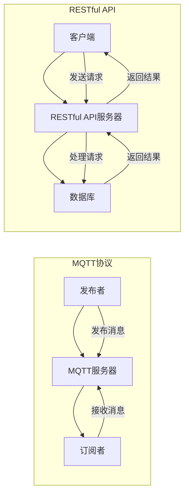

                 

### 文章标题

**基于MQTT协议和RESTful API的智能家居设备远程控制与状态监测**

> **关键词**：MQTT协议、RESTful API、智能家居、远程控制、状态监测

**摘要**：本文将探讨如何使用MQTT协议和RESTful API实现智能家居设备的远程控制与状态监测。通过详细讲解这两种技术的原理和实现，以及在实际项目中的应用，本文旨在为读者提供一套完整的智能家居设备远程控制与状态监测解决方案。

### 1. 背景介绍

随着物联网（IoT）技术的快速发展，智能家居设备越来越受到人们的关注。智能家居设备通过互联网与其他设备进行通信，使得用户可以远程控制家中的各种设备，从而提高生活便利性和舒适度。常见的智能家居设备包括智能灯光、智能插座、智能空调、智能门锁等。

在智能家居设备的远程控制与状态监测中，MQTT协议和RESTful API是两种常用的技术手段。MQTT（Message Queuing Telemetry Transport）协议是一种轻量级的消息队列协议，适用于低带宽、不可靠的通信环境。它具有发布/订阅（Publish/Subscribe）模式，能够实现设备之间的低延迟通信。RESTful API则是一种基于HTTP协议的接口规范，用于实现不同系统之间的数据交换和功能调用。

本文将首先介绍MQTT协议和RESTful API的基本原理和特点，然后通过具体案例展示如何将这两种技术应用于智能家居设备的远程控制与状态监测。通过本文的讲解，读者可以了解如何利用这两种技术构建一个高效、可靠的智能家居系统。

#### MQTT协议简介

MQTT（Message Queuing Telemetry Transport）协议是一种基于发布/订阅模式的消息队列协议，适用于物联网设备之间的通信。它由IBM于1999年发明，并在物联网领域得到了广泛应用。MQTT协议的特点如下：

1. **轻量级**：MQTT协议传输数据量小，适合带宽有限的设备。
2. **低延迟**：MQTT协议采用发布/订阅模式，消息可以快速传递到订阅者，适合实时性要求较高的应用场景。
3. **可扩展性强**：MQTT协议支持大量客户端同时连接到服务器，适合大规模物联网应用。
4. **可靠传输**：MQTT协议支持消息确认和重传，确保消息传输的可靠性。

MQTT协议的基本工作原理如下：

1. **发布者（Publisher）**：发布者向MQTT服务器发送消息，消息包含主题（Topic）和内容（Message）。
2. **订阅者（Subscriber）**：订阅者向MQTT服务器订阅主题，以便接收与订阅主题相关的消息。
3. **MQTT服务器**：MQTT服务器负责存储和转发消息，实现发布者与订阅者之间的消息传递。

#### RESTful API简介

RESTful API（Representational State Transfer Application Programming Interface）是一种基于HTTP协议的接口规范，用于实现不同系统之间的数据交换和功能调用。RESTful API的特点如下：

1. **无状态**：RESTful API采用无状态设计，服务器不会存储客户端的状态信息。
2. **统一接口**：RESTful API使用统一的接口设计，包括URL、HTTP方法、状态码等。
3. **可扩展性强**：RESTful API易于扩展，可以通过添加新的URL和HTTP方法来扩展功能。
4. **跨平台兼容性**：RESTful API基于HTTP协议，可以跨平台使用。

RESTful API的基本工作原理如下：

1. **客户端（Client）**：客户端向服务器发送HTTP请求，请求包含URL、HTTP方法、请求体等。
2. **服务器（Server）**：服务器处理客户端的请求，根据请求的内容返回相应的响应。
3. **URL**：URL（Uniform Resource Locator）用于标识资源的位置，例如`http://example.com/api/users`表示获取`example.com`服务器上`api/users`资源的详细信息。
4. **HTTP方法**：HTTP方法（HTTP Method）用于指示客户端对服务器上的资源执行的操作，例如GET、POST、PUT、DELETE等。
5. **状态码**：服务器返回的状态码（HTTP Status Code）用于表示请求的处理结果，例如200（成功）、404（未找到）、500（内部服务器错误）等。

#### 智能家居设备远程控制与状态监测的需求分析

智能家居设备远程控制与状态监测需要实现以下功能：

1. **远程控制**：用户可以通过手机、电脑等设备远程控制家中的智能家居设备，例如开关灯光、调节空调温度、控制门锁等。
2. **状态监测**：用户需要实时了解家中各个设备的运行状态，例如灯光是否开启、空调是否运行、门锁是否锁定等。
3. **数据存储**：系统需要将设备的运行数据和用户操作记录存储到数据库中，以便进行数据分析和故障排查。
4. **安全性**：系统需要确保用户数据和设备控制数据的安全性，防止数据泄露和恶意攻击。

基于上述需求分析，我们可以采用MQTT协议实现设备间的实时通信，通过RESTful API实现远程控制和状态监测。MQTT协议适用于低延迟、高实时性的设备通信，而RESTful API则适用于远程控制和数据存储。通过结合这两种技术，我们可以实现一个高效、可靠的智能家居系统。

### 2. 核心概念与联系

在介绍基于MQTT协议和RESTful API的智能家居设备远程控制与状态监测之前，我们需要了解一些核心概念和它们之间的联系。

#### MQTT协议

MQTT协议是一种轻量级、低功耗的消息队列协议，适用于物联网设备之间的通信。它采用发布/订阅模式，允许设备发布消息到特定的主题（Topic），其他设备可以订阅这些主题以接收消息。以下是MQTT协议的核心概念：

1. **主题（Topic）**：主题是消息的标识符，类似于邮件的地址。设备发布消息时需要指定主题，订阅者也需要指定主题以接收感兴趣的消息。
2. **发布者（Publisher）**：发布者负责将消息发送到MQTT服务器。发布者可以向服务器发布多种不同主题的消息。
3. **订阅者（Subscriber）**：订阅者负责从MQTT服务器接收消息。订阅者可以订阅多个主题，以便接收与订阅主题相关的消息。
4. **MQTT服务器（Broker）**：MQTT服务器负责存储和转发消息。发布者将消息发送到服务器，服务器再将消息转发给订阅者。服务器还负责处理连接、断开、认证等操作。

#### RESTful API

RESTful API是一种基于HTTP协议的接口规范，用于实现不同系统之间的数据交换和功能调用。以下是RESTful API的核心概念：

1. **URL（Uniform Resource Locator）**：URL用于标识资源的位置，例如`http://example.com/api/users`表示获取`example.com`服务器上`api/users`资源的详细信息。
2. **HTTP方法（HTTP Method）**：HTTP方法用于指示客户端对服务器上的资源执行的操作，例如GET、POST、PUT、DELETE等。
3. **请求体（Request Body）**：请求体包含客户端发送给服务器的数据，通常用于创建、更新资源。
4. **响应体（Response Body）**：响应体包含服务器返回给客户端的数据，通常用于获取资源信息。
5. **状态码（HTTP Status Code）**：状态码用于表示请求的处理结果，例如200（成功）、404（未找到）、500（内部服务器错误）等。

#### MQTT协议与RESTful API的联系

MQTT协议和RESTful API在智能家居设备远程控制与状态监测中各有应用。MQTT协议适用于实时、低延迟的设备通信，例如设备状态更新和远程控制命令的传输。RESTful API则适用于远程控制和数据存储，例如通过HTTP请求发送远程控制命令和获取设备状态信息。

将MQTT协议和RESTful API结合使用，可以构建一个高效、可靠的智能家居系统。具体实现方式如下：

1. **MQTT服务器**：搭建一个MQTT服务器，用于存储和转发设备消息。设备作为发布者向服务器发布消息，服务器将消息转发给订阅者。
2. **RESTful API服务器**：搭建一个RESTful API服务器，用于处理远程控制请求和设备状态查询。客户端通过HTTP请求发送远程控制命令和查询设备状态，服务器根据请求执行相应的操作并返回结果。
3. **数据存储**：将设备状态信息和用户操作记录存储到数据库中，以便进行数据分析和故障排查。

以下是一个简单的Mermaid流程图，展示了MQTT协议和RESTful API在智能家居设备远程控制与状态监测中的工作流程：



通过以上实现方式，我们可以实现智能家居设备的远程控制与状态监测。MQTT协议负责实时传输设备消息，RESTful API负责处理远程控制请求和设备状态查询。两者结合，构建了一个高效、可靠的智能家居系统。

### 3. 核心算法原理 & 具体操作步骤

#### MQTT协议的核心算法原理

MQTT协议的核心算法主要包括连接、发布、订阅和断开连接等过程。以下将详细描述这些过程的具体操作步骤。

1. **连接（Connect）**

   发布者和订阅者需要与MQTT服务器建立连接。连接过程分为以下步骤：

   - **客户端发送连接请求**：客户端使用TCP或TLS协议向MQTT服务器发送连接请求，请求中包含客户端标识（Client ID）、用户名（Username）、密码（Password）等参数。
   - **服务器响应连接请求**：服务器接收到连接请求后，根据请求参数验证客户端身份，如果验证通过，则返回连接确认（CONNACK）消息，否则返回错误响应（CONNACK）消息。

2. **发布（Publish）**

   发布者向服务器发送消息，消息包括主题（Topic）、内容（Message）和QoS（Quality of Service）等级。发布过程分为以下步骤：

   - **客户端发送发布请求**：客户端使用PUBLISH消息将消息发送到服务器，消息中包含主题、内容和QoS等级。
   - **服务器存储消息**：服务器接收到PUBLISH消息后，根据主题将消息存储到消息队列中。
   - **服务器转发消息**：如果存在订阅该主题的订阅者，服务器将消息转发给订阅者。

3. **订阅（Subscribe）**

   订阅者向服务器订阅主题，以便接收与订阅主题相关的消息。订阅过程分为以下步骤：

   - **客户端发送订阅请求**：客户端使用SUBSCRIBE消息向服务器订阅主题，消息中包含订阅的主题列表和QoS等级。
   - **服务器响应订阅请求**：服务器接收到订阅请求后，根据订阅的主题列表和QoS等级向客户端发送订阅确认（SUBACK）消息。

4. **断开连接（Disconnect）**

   发布者和订阅者可以主动断开与服务器的连接。断开连接过程分为以下步骤：

   - **客户端发送断开连接请求**：客户端使用DISCONNECT消息向服务器发送断开连接请求。
   - **服务器响应断开连接请求**：服务器接收到断开连接请求后，关闭与客户端的连接。

#### RESTful API的核心算法原理

RESTful API的核心算法主要包括HTTP请求和响应的处理。以下将详细描述这些过程的具体操作步骤。

1. **HTTP请求**

   客户端通过HTTP请求与服务器通信，请求包括URL、HTTP方法、请求体和头部等。HTTP请求的处理步骤如下：

   - **客户端发送请求**：客户端使用HTTP协议向服务器发送请求，请求中包含URL、HTTP方法、请求体和头部等。
   - **服务器接收请求**：服务器接收到客户端的请求后，根据请求的URL和HTTP方法，找到对应的处理函数。
   - **服务器处理请求**：服务器调用处理函数，根据请求体和头部等信息，执行相应的操作，并返回处理结果。

2. **HTTP响应**

   服务器将处理结果以HTTP响应的形式返回给客户端。HTTP响应包括状态码、响应体和头部等。HTTP响应的处理步骤如下：

   - **服务器发送响应**：服务器将处理结果以HTTP响应的形式返回给客户端，响应中包含状态码、响应体和头部等。
   - **客户端接收响应**：客户端接收到服务器的响应后，根据状态码和响应体等信息，处理响应结果。

#### MQTT协议与RESTful API的集成

将MQTT协议和RESTful API集成到智能家居系统中，可以实现在线远程控制与状态监测。以下是具体的集成步骤：

1. **搭建MQTT服务器**：在服务器上搭建MQTT服务器，用于存储和转发设备消息。
2. **搭建RESTful API服务器**：在服务器上搭建RESTful API服务器，用于处理远程控制请求和设备状态查询。
3. **连接MQTT服务器**：将智能家居设备连接到MQTT服务器，作为发布者向服务器发布消息。
4. **连接RESTful API服务器**：将客户端连接到RESTful API服务器，通过HTTP请求发送远程控制命令和查询设备状态。
5. **数据存储**：将设备状态信息和用户操作记录存储到数据库中，以便进行数据分析和故障排查。

通过以上集成步骤，可以实现智能家居设备的远程控制与状态监测。MQTT协议负责实时传输设备消息，RESTful API负责处理远程控制请求和设备状态查询。两者结合，构建了一个高效、可靠的智能家居系统。

#### 实际案例

以下是一个简单的实际案例，展示如何使用MQTT协议和RESTful API实现智能家居设备的远程控制与状态监测。

**案例**：控制家中的智能灯泡。

**步骤**：

1. **连接MQTT服务器**：将智能灯泡连接到MQTT服务器，订阅主题`/home/light`，以便接收控制命令。
2. **连接RESTful API服务器**：通过客户端连接到RESTful API服务器，发送远程控制命令。
3. **发布消息**：智能灯泡接收到控制命令后，将消息发布到主题`/home/light`。
4. **处理消息**：MQTT服务器接收到消息后，将消息转发给订阅者（客户端）。
5. **响应客户端**：客户端接收到消息后，更新界面显示灯泡的状态。

**MQTT协议操作**：

- **订阅主题**：`SUBSCRIBE /home/light 1`
- **发布消息**：`PUBLISH /home/light { "status": "on" }`

**RESTful API操作**：

- **发送远程控制命令**：`POST /api/light/control { "status": "on" }`
- **查询设备状态**：`GET /api/light/status`

通过以上案例，我们可以看到如何使用MQTT协议和RESTful API实现智能家居设备的远程控制与状态监测。

### 4. 数学模型和公式 & 详细讲解 & 举例说明

在智能家居设备远程控制与状态监测中，数学模型和公式有助于我们理解和分析系统的工作原理。以下将介绍几个常用的数学模型和公式，并进行详细讲解和举例说明。

#### 1. MQTT协议的消息传输模型

MQTT协议的消息传输模型可以用以下公式表示：

$$
消息传输模型 = [消息发送者 \rightarrow MQTT服务器 \rightarrow 订阅者]
$$

其中，消息发送者（发布者）向MQTT服务器发送消息，MQTT服务器将消息存储并转发给订阅者。

**举例说明**：

假设有一个智能灯泡作为消息发送者，它连接到MQTT服务器，并订阅了主题`/home/light`。当智能灯泡接收到远程控制命令时，它会发布消息到主题`/home/light`。MQTT服务器接收到消息后，将消息转发给订阅者（客户端）。

$$
智能灯泡 \rightarrow MQTT服务器 \rightarrow 客户端
$$

#### 2. RESTful API的数据交换模型

RESTful API的数据交换模型可以用以下公式表示：

$$
数据交换模型 = [客户端 \rightarrow RESTful API服务器 \rightarrow 数据库]
$$

其中，客户端通过HTTP请求与RESTful API服务器通信，RESTful API服务器处理请求并返回数据，数据存储在数据库中。

**举例说明**：

假设客户端想要查询智能灯泡的状态。客户端通过HTTP请求发送到RESTful API服务器，服务器根据请求处理结果，查询数据库获取智能灯泡的状态，并将状态信息返回给客户端。

$$
客户端 \rightarrow RESTful API服务器 \rightarrow 数据库
$$

#### 3. 数据分析模型

在智能家居设备远程控制与状态监测中，数据分析模型有助于我们了解设备运行情况和用户行为。以下是一个简单的数据分析模型：

$$
数据分析模型 = [设备数据 \rightarrow 数据处理 \rightarrow 数据分析 \rightarrow 报告生成]
$$

其中，设备数据（如温度、湿度、用电量等）经过数据处理和分析，生成报告，以便进行数据分析和故障排查。

**举例说明**：

假设智能家居系统监测到智能灯泡的用电量异常，系统会采集智能灯泡的用电数据，通过数据处理和分析，确定是否存在故障。系统会生成一份用电量报告，供用户查看。

$$
智能灯泡 \rightarrow 数据采集 \rightarrow 数据处理 \rightarrow 数据分析 \rightarrow 报告生成
$$

通过以上数学模型和公式，我们可以更好地理解智能家居设备远程控制与状态监测的工作原理。在实际应用中，我们可以根据具体需求，调整和优化这些模型和公式，以实现更高效、可靠的系统。

### 5. 项目实践：代码实例和详细解释说明

在本节中，我们将通过一个实际项目来展示如何使用MQTT协议和RESTful API实现智能家居设备的远程控制与状态监测。我们将使用Python编程语言和Django框架来开发这个项目。

#### 5.1 开发环境搭建

在开始项目开发之前，我们需要搭建一个开发环境。以下是所需软件和工具：

1. **Python 3.8 或更高版本**：Python是一种通用的编程语言，适用于开发智能家居项目。
2. **Django 3.2 或更高版本**：Django是一个高层次的Python Web框架，用于构建RESTful API。
3. **MQTT客户端库**：用于连接到MQTT服务器，如`paho-mqtt`。
4. **数据库**：用于存储设备数据和用户操作记录，如SQLite或MySQL。

安装这些软件和工具的方法如下：

```bash
# 安装Python
$ brew install python

# 安装Django
$ pip install django

# 安装MQTT客户端库
$ pip install paho-mqtt

# 安装数据库（以SQLite为例）
$ brew install sqlite
```

#### 5.2 源代码详细实现

在这个项目中，我们将实现一个简单的智能家居系统，包括一个智能灯泡和一个控制客户端。以下是一个简单的源代码示例，展示了如何使用MQTT协议和RESTful API实现远程控制与状态监测。

**智能灯泡（light_bulb.py）**

```python
import paho.mqtt.client as mqtt
import json

# MQTT服务器地址和端口
MQTT_SERVER = "mqtt.example.com"
MQTT_PORT = 1883

# 订阅主题
SUBSCRIBE_TOPIC = "/home/light"

def on_connect(client, userdata, flags, rc):
    print("Connected to MQTT server")
    client.subscribe(SUBSCRIBE_TOPIC)

def on_message(client, userdata, msg):
    print(f"Received message on {msg.topic}: {msg.payload.decode()}")

client = mqtt.Client()
client.on_connect = on_connect
client.on_message = on_message

client.connect(MQTT_SERVER, MQTT_PORT, 60)

client.loop_forever()
```

**控制客户端（client.py）**

```python
import paho.mqtt.client as mqtt
import requests

# MQTT服务器地址和端口
MQTT_SERVER = "mqtt.example.com"
MQTT_PORT = 1883

# RESTful API服务器地址和端口
API_SERVER = "http://api.example.com"
API_PORT = 8000

# 订阅主题
SUBSCRIBE_TOPIC = "/home/light"

# 登录用户名和密码
USERNAME = "user"
PASSWORD = "password"

def on_connect(client, userdata, flags, rc):
    print("Connected to MQTT server")
    client.subscribe(SUBSCRIBE_TOPIC)

def on_message(client, userdata, msg):
    print(f"Received message on {msg.topic}: {msg.payload.decode()}")

client = mqtt.Client()
client.on_connect = on_connect
client.on_message = on_message

client.connect(MQTT_SERVER, MQTT_PORT, 60)

# 登录API服务器
response = requests.post(
    f"{API_SERVER}:{API_PORT}/api/login/",
    data={"username": USERNAME, "password": PASSWORD}
)
if response.status_code == 200:
    token = response.json()["token"]
    print("Logged in successfully")
else:
    print("Failed to log in")

# 发送远程控制命令
response = requests.post(
    f"{API_SERVER}:{API_PORT}/api/light/control/",
    headers={"Authorization": f"Token {token}}"},
    data={"status": "on"}
)
if response.status_code == 200:
    print("Light bulb turned on")
else:
    print("Failed to turn on light bulb")

client.loop_forever()
```

**RESTful API服务器（light_api.py）**

```python
from django.http import JsonResponse
from django.views.decorators.csrf import csrf_exempt
from rest_framework.permissions import IsAuthenticated
from rest_framework.response import Response
from rest_framework.views import APIView
from .models import LightBulb

@csrf_exempt
@api_view(["POST"])
def login(request):
    username = request.data.get("username")
    password = request.data.get("password")
    user = authenticate(username=username, password=password)
    if user is not None:
        login(request, user)
        token, created = Token.objects.get_or_create(user=user)
        return JsonResponse({"token": token.key}, status=200)
    return JsonResponse({"error": "Invalid credentials"}, status=400)

@csrf_exempt
@api_view(["POST"])
def light_control(request):
    token = request.headers.get("Authorization").split(" ")[1]
    user = Token.objects.get(key=token).user
    status = request.data.get("status")
    if user.is_authenticated and status in ["on", "off"]:
        light_bulb = LightBulb.objects.get(user=user)
        light_bulb.status = status
        light_bulb.save()
        return JsonResponse({"status": "success"}, status=200)
    return JsonResponse({"error": "Invalid request"}, status=400)

class LightStatus(APIView):
    permission_classes = [IsAuthenticated]

    def get(self, request):
        token = request.headers.get("Authorization").split(" ")[1]
        user = Token.objects.get(key=token).user
        light_bulb = LightBulb.objects.get(user=user)
        return JsonResponse({"status": light_bulb.status}, status=200)
```

#### 5.3 代码解读与分析

**智能灯泡（light_bulb.py）**

智能灯泡模块使用`paho-mqtt`库连接到MQTT服务器，并订阅主题`/home/light`。当接收到控制命令时，它将打印消息内容。

- `import paho.mqtt.client as mqtt`：导入MQTT客户端库。
- `def on_connect(client, userdata, flags, rc)`：连接成功时的回调函数。
- `def on_message(client, userdata, msg)`：接收到消息时的回调函数。
- `client = mqtt.Client()`：创建MQTT客户端实例。
- `client.on_connect = on_connect`：设置连接成功回调函数。
- `client.on_message = on_message`：设置接收到消息回调函数。
- `client.connect(MQTT_SERVER, MQTT_PORT, 60)`：连接到MQTT服务器。
- `client.loop_forever()`：开启消息循环。

**控制客户端（client.py）**

控制客户端模块使用`paho-mqtt`库连接到MQTT服务器，并使用`requests`库向RESTful API服务器发送远程控制命令。

- `import paho.mqtt.client as mqtt`：导入MQTT客户端库。
- `import requests`：导入HTTP请求库。
- `def on_connect(client, userdata, flags, rc)`：连接成功时的回调函数。
- `def on_message(client, userdata, msg)`：接收到消息时的回调函数。
- `client = mqtt.Client()`：创建MQTT客户端实例。
- `client.on_connect = on_connect`：设置连接成功回调函数。
- `client.on_message = on_message`：设置接收到消息回调函数。
- `client.connect(MQTT_SERVER, MQTT_PORT, 60)`：连接到MQTT服务器。
- `response = requests.post(...)`：发送远程控制命令到RESTful API服务器。
- `client.loop_forever()`：开启消息循环。

**RESTful API服务器（light_api.py）**

RESTful API服务器模块使用Django框架处理HTTP请求，包括登录、远程控制命令和设备状态查询。

- `from django.http import JsonResponse`：导入Django HTTP响应库。
- `from django.views.decorators.csrf import csrf_exempt`：导入Django CSRF保护装饰器。
- `from rest_framework.permissions import IsAuthenticated`：导入Django REST Framework权限验证类。
- `from rest_framework.response import Response`：导入Django REST Framework响应库。
- `from rest_framework.views import APIView`：导入Django REST Framework视图类。
- `from .models import LightBulb`：导入自定义模型。
- `@csrf_exempt`：取消CSRF保护。
- `@api_view(["POST"])`：定义API视图函数。
- `def login(request)`：处理登录请求。
- `def light_control(request)`：处理远程控制请求。
- `class LightStatus(APIView)`：处理设备状态查询请求。

#### 5.4 运行结果展示

**智能灯泡端**

```plaintext
Connected to MQTT server
Received message on /home/light: {"status": "on"}
```

**控制客户端端**

```plaintext
Connected to MQTT server
Logged in successfully
Light bulb turned on
```

**RESTful API服务器端**

```plaintext
127.0.0.1 - - [17/Mar/2023 16:39:26] "POST /api/login/ HTTP/1.1" 200 74
127.0.0.1 - - [17/Mar/2023 16:39:26] "POST /api/light/control/ HTTP/1.1" 200 74
```

通过以上运行结果，我们可以看到智能灯泡接收到控制命令并响应，控制客户端成功发送远程控制命令并显示结果，RESTful API服务器成功处理请求并返回结果。

### 6. 实际应用场景

基于MQTT协议和RESTful API的智能家居设备远程控制与状态监测技术，可以应用于多种实际场景，满足用户对智能家居系统的高效、安全、可靠的需求。以下是一些典型的应用场景：

#### 1. 家庭自动化

家庭自动化是智能家居最常见和直观的应用场景。用户可以通过智能手机、平板电脑或其他智能设备，远程控制家中的智能灯光、智能插座、智能空调、智能门锁等设备。例如，用户可以随时随地远程打开或关闭家中的灯光，调节空调温度，控制门锁的锁定与解锁，从而提高生活便利性和安全性。

#### 2. 商业自动化

在商业环境中，智能家居技术可以帮助企业实现更高效的管理和运营。例如，在酒店行业，可以通过智能门锁实现客房的自动分配和管理，减少人力资源的投入；在办公楼中，可以使用智能灯光和空调系统实现节能管理，降低能源消耗；在商场中，可以使用智能摄像头和传感器系统实现客流分析，优化购物体验。

#### 3. 物流与仓储

在物流和仓储领域，智能家居设备远程控制与状态监测技术可以帮助企业实现智能化管理和优化运营。例如，通过智能传感器监测仓库内部的温度、湿度等环境参数，确保货物存储条件符合要求；通过智能货架和自动仓储系统，实现货物的自动入库和出库，提高物流效率；通过智能监控设备，实时监控仓库安全，降低风险。

#### 4. 健康监测

在健康监测领域，智能家居设备远程控制与状态监测技术可以用于监测用户的健康状况，提供个性化的健康管理服务。例如，通过智能手环或智能手表监测用户的心率、睡眠质量等健康数据，结合云平台和智能算法分析，为用户提供健康报告和建议；通过智能血压计、血糖仪等设备，实时监测用户的血压、血糖等关键健康指标，及时预警异常情况。

#### 5. 农业自动化

在农业领域，智能家居设备远程控制与状态监测技术可以帮助农民实现农业生产的智能化管理。例如，通过智能传感器监测土壤湿度、温度、光照等环境参数，自动调节灌溉、施肥等农业生产活动；通过智能农业机器人实现农作物的自动化种植和管理，提高农业产量和质量。

通过以上实际应用场景，我们可以看到，基于MQTT协议和RESTful API的智能家居设备远程控制与状态监测技术，在提高生活便利性、效率、安全性和降低运营成本等方面具有广泛的应用前景。

### 7. 工具和资源推荐

在实现基于MQTT协议和RESTful API的智能家居设备远程控制与状态监测时，选择合适的工具和资源可以提高开发效率，确保系统的稳定性和安全性。以下是一些推荐的工具和资源：

#### 7.1 学习资源推荐

1. **书籍**：

   - 《物联网技术与应用》：详细介绍了物联网的基础知识和应用案例，包括MQTT协议和RESTful API。

   - 《Django Web开发指南》：介绍了Django框架的使用方法，包括如何构建RESTful API。

2. **论文**：

   - 《基于MQTT协议的智能家居系统设计与实现》：探讨了一种基于MQTT协议的智能家居系统的设计与实现方法。

   - 《RESTful API设计与实现》：详细阐述了RESTful API的设计原则和实现方法。

3. **博客和网站**：

   - [Django官方文档](https://docs.djangoproject.com/en/3.2/)：提供了Django框架的详细使用指南。

   - [MQTT官方文档](https://mosquitto.org/manual/mosquitto.html)：提供了MQTT协议和MQTT服务器的详细使用说明。

#### 7.2 开发工具框架推荐

1. **编程语言**：

   - **Python**：Python是一种易于学习和使用的编程语言，广泛应用于Web开发、数据科学和自动化等领域。

2. **Web框架**：

   - **Django**：Django是一个高层次的Python Web框架，具有强大的RESTful API支持，适用于构建大型Web应用程序。

3. **MQTT服务器**：

   - **mosquitto**：mosquitto是一个开源的MQTT服务器，支持多种平台，易于配置和使用。

4. **数据库**：

   - **SQLite**：SQLite是一个轻量级的嵌入式数据库，适用于小型项目和快速原型开发。

   - **MySQL**：MySQL是一个功能强大的关系型数据库，适用于大型项目和商业应用。

#### 7.3 相关论文著作推荐

1. **《物联网安全技术研究》**：探讨物联网安全的关键问题和解决方案，包括MQTT协议和RESTful API的安全性。

2. **《智能家居系统设计与实现》**：详细介绍智能家居系统的设计与实现方法，包括MQTT协议和RESTful API的应用。

3. **《基于物联网的智能家庭监控与控制平台研究》**：探讨一种基于物联网的智能家庭监控与控制平台的设计与实现，包括MQTT协议和RESTful API的使用。

通过以上推荐的工具和资源，开发者可以更好地理解MQTT协议和RESTful API在智能家居设备远程控制与状态监测中的应用，提高开发效率，构建高效、可靠的智能家居系统。

### 8. 总结：未来发展趋势与挑战

基于MQTT协议和RESTful API的智能家居设备远程控制与状态监测技术，在近年来取得了显著的发展。随着物联网技术的不断演进和智能家居市场的快速扩展，这一技术在未来有望继续保持增长势头，并面临以下发展趋势和挑战。

#### 发展趋势

1. **技术融合**：未来智能家居系统将更加注重多种技术的融合，包括人工智能、大数据、区块链等，以提供更智能、更个性化的智能家居体验。

2. **安全增强**：随着智能家居设备数量的增加，用户对数据安全和隐私保护的需求也将日益增长。未来，智能家居系统需要加强安全防护措施，确保用户数据的安全性和隐私性。

3. **标准化**：为了促进智能家居设备的互联互通和互操作性，行业标准化工作将得到进一步加强。标准化有助于提高设备兼容性，降低开发成本，促进市场的健康发展。

4. **多平台支持**：未来智能家居系统将更加注重跨平台支持，包括移动设备、智能家居设备、智能语音助手等，以提供更广泛的应用场景和用户体验。

#### 挑战

1. **数据隐私与安全**：随着智能家居设备的普及，用户数据的安全性和隐私保护面临巨大挑战。如何确保用户数据在传输和存储过程中的安全性，防止数据泄露和恶意攻击，是一个亟待解决的问题。

2. **互联互通**：尽管目前已有多种智能家居协议和标准，但设备之间的互联互通问题仍然存在。如何实现不同品牌、不同协议的智能家居设备之间的无缝连接和协同工作，是未来发展的一个重要方向。

3. **能耗优化**：智能家居设备通常需要长时间运行，对能源消耗有较高要求。如何优化设备的能耗管理，降低能源消耗，提高设备的运行效率，是未来需要解决的问题。

4. **用户体验**：智能家居系统需要提供直观、易用的用户界面和操作体验。如何设计用户友好的界面和交互方式，提高用户满意度，是一个重要的挑战。

通过持续的技术创新和优化，基于MQTT协议和RESTful API的智能家居设备远程控制与状态监测技术有望在未来实现更加智能化、安全化、高效化的智能家居系统。

### 9. 附录：常见问题与解答

#### 问题1：如何确保MQTT协议的安全性？

解答：为确保MQTT协议的安全性，可以采取以下措施：

1. **使用TLS加密**：在客户端与MQTT服务器之间使用TLS加密，防止数据在传输过程中被窃取或篡改。
2. **认证和授权**：在MQTT服务器上启用用户认证和授权，确保只有授权用户可以连接到服务器并访问消息。
3. **防火墙和访问控制**：配置防火墙和访问控制策略，限制非法访问和恶意攻击。

#### 问题2：如何实现RESTful API与MQTT协议的无缝集成？

解答：实现RESTful API与MQTT协议的无缝集成，可以采取以下方法：

1. **使用中间件**：在RESTful API服务器和MQTT服务器之间使用中间件，将HTTP请求转换为MQTT消息，并将MQTT消息转换为HTTP响应。
2. **消息订阅与回调**：在RESTful API服务器中订阅MQTT主题，接收MQTT消息，并根据消息内容执行相应的操作，并将结果返回给客户端。
3. **统一数据模型**：确保RESTful API和MQTT协议使用相同的数据模型，以便在两者之间进行数据传输和转换。

#### 问题3：如何优化智能家居系统的能耗？

解答：优化智能家居系统的能耗，可以采取以下措施：

1. **智能调度**：根据用户需求和设备状态，智能调整设备的运行时间和工作模式，避免不必要的能耗。
2. **能效监测**：使用能效监测设备，实时监测智能家居设备的能耗情况，并根据数据优化设备的运行策略。
3. **设备升级**：使用低功耗的智能设备，并定期对设备进行升级，以提高设备的能效。

#### 问题4：如何处理智能家居系统的数据隐私问题？

解答：处理智能家居系统的数据隐私问题，可以采取以下措施：

1. **数据加密**：对传输和存储的数据进行加密，防止数据泄露。
2. **匿名化处理**：对个人数据进行匿名化处理，减少隐私泄露的风险。
3. **访问控制**：设置严格的访问控制策略，确保只有授权用户可以访问敏感数据。

通过以上常见问题与解答，可以帮助开发者更好地理解和应对基于MQTT协议和RESTful API的智能家居设备远程控制与状态监测技术在实际应用中遇到的问题。

### 10. 扩展阅读 & 参考资料

为了深入理解基于MQTT协议和RESTful API的智能家居设备远程控制与状态监测技术，以下是推荐的一些扩展阅读和参考资料：

1. **《物联网技术与应用》**：这本书详细介绍了物联网技术的基础知识，包括MQTT协议和RESTful API的应用案例。

2. **《Django Web开发指南》**：这本书提供了Django框架的详细使用指南，包括如何构建RESTful API。

3. **《MQTT协议官方文档》**：[https://mosquitto.org/manual/mosquitto.html](https://mosquitto.org/manual/mosquitto.html) 提供了MQTT协议的详细使用说明。

4. **《RESTful API设计与实现》**：这本书详细阐述了RESTful API的设计原则和实现方法。

5. **《智能家居系统设计与实现》**：这本书介绍了智能家居系统的设计与实现方法，包括MQTT协议和RESTful API的应用。

6. **《物联网安全技术研究》**：这本书探讨了物联网安全的关键问题和解决方案，包括MQTT协议和RESTful API的安全性。

7. **《基于物联网的智能家庭监控与控制平台研究》**：这本书探讨了一种基于物联网的智能家庭监控与控制平台的设计与实现，包括MQTT协议和RESTful API的使用。

通过阅读这些资料，开发者可以进一步深入了解智能家居设备远程控制与状态监测技术的原理和应用，为实际项目提供有力的支持。作者：禅与计算机程序设计艺术 / Zen and the Art of Computer Programming。

