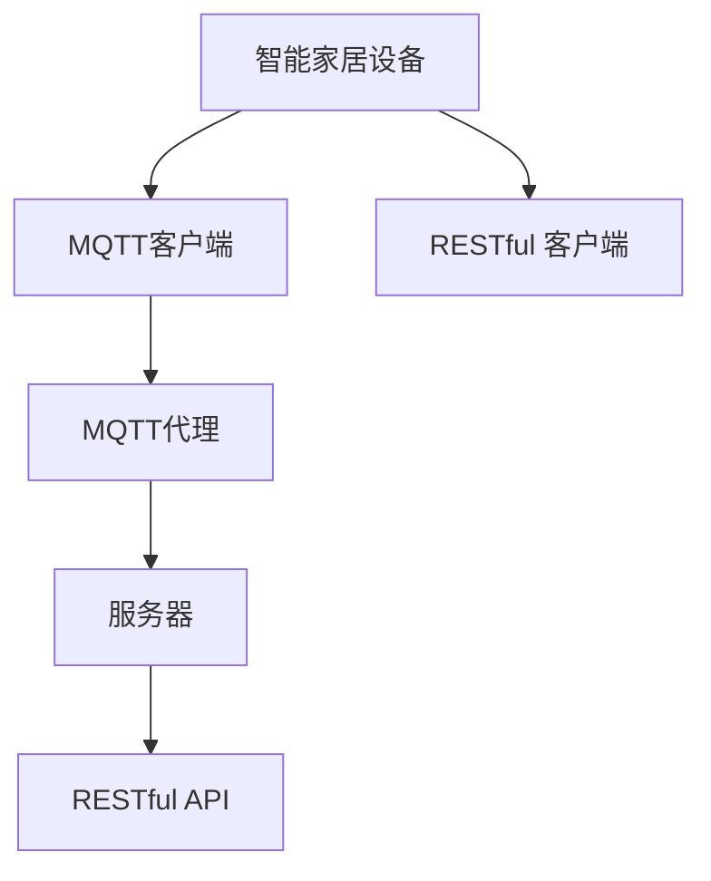
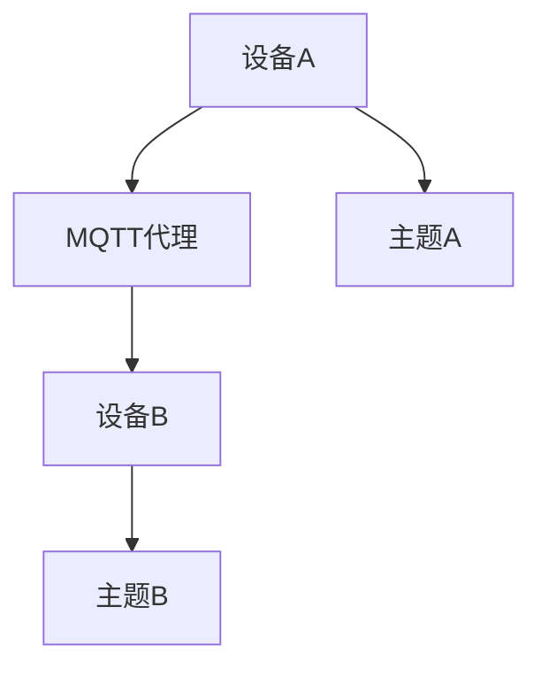
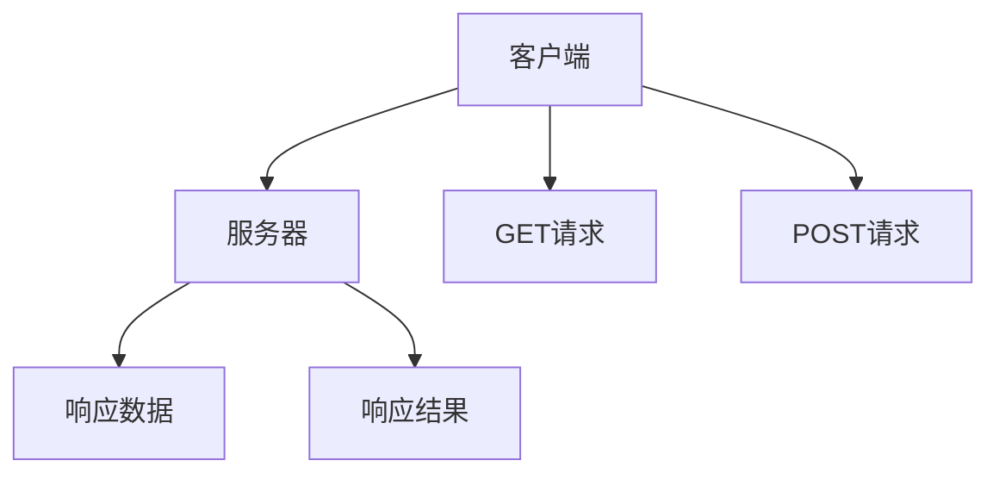

                 

### 背景介绍

在现代社会，智能家居设备已经逐渐成为人们日常生活的重要组成部分。从智能灯泡、智能插座，到智能空调、智能门锁，这些设备通过互联网实现了远程控制和自动化管理。然而，随着设备数量的增加和复杂度的提升，设备之间的通信和数据传输也变得越来越重要。在这样的背景下，MQTT（Message Queuing Telemetry Transport）协议和RESTful API成为了智能家居设备通信和配网的两种主要方案。

#### MQTT协议

MQTT协议是一种轻量级的消息队列协议，最初由IBM开发，用于在受限的网络环境中传输数据。MQTT协议的主要特点是低功耗、低带宽占用、可扩展性强，特别适合用于物联网设备之间的通信。在智能家居场景中，MQTT协议可以支持设备与中心控制器之间的实时通信，实现远程监控和控制功能。

MQTT协议的工作原理是客户端（设备）与服务器（消息代理）之间建立持久连接，客户端通过发布/订阅模式将消息发送到服务器，服务器再将消息分发到订阅该主题的客户端。这一机制使得设备之间的通信更加高效、可靠。

#### RESTful API

RESTful API（Representational State Transfer API）是基于HTTP协议的一种接口设计风格，用于实现服务器与客户端之间的数据交换。RESTful API的主要特点是简单、灵活、易于扩展，非常适合用于构建分布式系统。

在智能家居场景中，RESTful API可以用于设备之间的数据通信和远程控制。设备通过HTTP请求与服务器进行交互，服务器根据请求执行相应的操作，并将结果返回给客户端。这种模式使得设备之间的通信更加直观、易用。

#### 核心概念与联系

为了更好地理解MQTT协议和RESTful API在智能家居设备配网中的应用，我们首先需要了解它们的基本概念和原理。以下是一个简化的Mermaid流程图，展示了智能家居系统中设备、MQTT代理和服务器之间的交互过程：



- **智能家居设备**：指各种智能家居硬件设备，如智能灯泡、智能插座等。
- **MQTT客户端**：设备通过MQTT客户端与MQTT代理建立连接，发送和接收消息。
- **MQTT代理**：消息代理服务器，负责接收设备发送的消息，并根据主题进行分发。
- **服务器**：处理设备请求的服务器，通过RESTful API与设备进行交互。
- **RESTful 客户端**：设备也可以通过HTTP请求与服务器进行交互，实现数据上传和远程控制。

通过上述流程图，我们可以看出MQTT协议和RESTful API在智能家居设备配网中的核心作用。MQTT协议负责设备之间的实时通信，确保数据的快速传输和低延迟；而RESTful API则提供了设备与服务器之间的标准接口，使得设备管理和服务提供更加灵活和高效。

#### 下一步

在下一部分，我们将深入探讨MQTT协议和RESTful API的核心算法原理，详细解析它们在智能家居设备配网中的具体操作步骤，帮助读者更好地理解这些技术在实际应用中的工作方式。

## 2. 核心概念与联系

在深入了解MQTT协议和RESTful API在智能家居设备配网中的应用之前，我们需要先掌握这两个协议的基本概念和原理。本文将通过一个简化的Mermaid流程图，详细展示智能家居系统中各个组件之间的交互过程，以便读者更直观地理解核心概念和联系。

#### MQTT协议

MQTT（Message Queuing Telemetry Transport）协议是一种轻量级的消息传输协议，适用于在低带宽、低功耗的网络环境中传输数据。MQTT协议的核心特点包括：

1. **发布/订阅模型**：MQTT协议采用发布/订阅（Pub/Sub）模型，客户端（设备）通过发布消息到特定的主题（Topic），服务器（消息代理）根据订阅主题将消息分发到订阅该主题的客户端。

2. **持久连接**：MQTT客户端与服务器之间建立持久连接，即使在网络不稳定的情况下，连接也不会中断，从而保证了数据的可靠传输。

3. **QoS级别**：MQTT协议支持不同级别的服务质量（QoS），包括QoS 0（至多一次）、QoS 1（至少一次）和QoS 2（恰好一次）。这为数据传输提供了不同程度的可靠性保障。

以下是一个简化的MQTT协议流程图：



- **设备A**：通过MQTT客户端向MQTT代理发布消息到主题A。
- **设备B**：订阅主题A，从MQTT代理接收消息。

#### RESTful API

RESTful API（Representational State Transfer API）是一种基于HTTP协议的接口设计风格，用于实现服务器与客户端之间的数据交换。RESTful API的特点包括：

1. **无状态**：RESTful API是无状态的，每次请求都是独立的，服务器不保留之前的请求状态。

2. **统一接口**：RESTful API通过统一接口设计，包括GET、POST、PUT、DELETE等方法，实现了资源的创建、读取、更新和删除操作。

3. **状态转移**：客户端通过发送HTTP请求，触发服务器的状态转移，从而实现资源的操作。

以下是一个简化的RESTful API流程图：



- **客户端**：发送GET请求获取服务器上的数据。
- **服务器**：处理GET请求，返回响应数据。
- **客户端**：发送POST请求，上传数据到服务器。

#### 综合流程图

为了更全面地展示MQTT协议和RESTful API在智能家居系统中的应用，我们将两个流程图结合起来，形成以下综合流程图：


- **智能家居设备**：通过MQTT客户端与MQTT代理通信，实现实时数据传输和设备控制。
- **MQTT代理**：接收设备发送的消息，根据主题分发到订阅的客户端。
- **服务器**：处理设备请求，通过RESTful API与设备进行交互。
- **RESTful 客户端**：通过HTTP请求与服务器通信，实现设备数据的上传和远程控制。

#### 工作原理

1. **MQTT协议**：
   - 设备A通过MQTT客户端连接到MQTT代理。
   - 设备A发布消息到特定的主题，如“/home/light/switch”。
   - MQTT代理接收到设备A的消息后，根据订阅关系，将消息转发给订阅该主题的设备B。
   - 设备B收到消息后，根据消息内容执行相应的操作，如打开或关闭灯光。

2. **RESTful API**：
   - 设备通过RESTful API与服务器通信。
   - 设备发送GET请求获取服务器上的数据，如当前温度、湿度等。
   - 服务器处理GET请求，返回相应的数据。
   - 设备发送POST请求，上传传感器数据到服务器。
   - 服务器处理POST请求，存储数据并触发相应的操作，如调整空调温度。

通过上述流程图和详细解析，我们可以清晰地看到MQTT协议和RESTful API在智能家居设备配网中的核心作用。MQTT协议负责设备的实时通信和数据传输，确保设备之间的数据同步和实时响应；而RESTful API则提供了设备与服务器之间的标准接口，使得设备管理和远程控制更加灵活和高效。

#### 下一步

在下一部分，我们将进一步探讨MQTT协议和RESTful API的核心算法原理，详细解析它们在智能家居设备配网中的具体操作步骤，帮助读者深入理解这些技术在实际应用中的工作方式。敬请期待。

## 3. 核心算法原理 & 具体操作步骤

#### MQTT协议

MQTT协议的核心算法原理在于其发布/订阅模型和持久连接机制。以下是MQTT协议在智能家居设备配网中的具体操作步骤：

1. **设备连接**：
   - 设备通过MQTT客户端连接到MQTT代理，连接过程中，设备需要提供客户端标识（Client ID）和鉴权信息（用户名和密码）。
   - MQTT代理验证设备身份，如果验证通过，建立连接。

2. **发布消息**：
   - 设备A通过MQTT客户端将数据（例如温度、湿度等）发布到特定的主题，如“/home/sensor/temperature”。
   - 发布消息时，设备可以选择不同级别的服务质量（QoS），以确保数据的可靠传输。

3. **订阅主题**：
   - 设备B通过MQTT客户端订阅主题“/home/sensor/temperature”，以便从MQTT代理接收设备A发布的消息。
   - 设备B可以在订阅时指定QoS级别，以获得所需的可靠性保障。

4. **消息分发**：
   - MQTT代理接收到设备A发布的消息后，根据订阅关系将消息转发给订阅该主题的设备B。
   - 如果设备B在订阅时选择了QoS 1或QoS 2，MQTT代理将确保消息被可靠地传输。

5. **断开连接**：
   - 设备在完成通信后，可以主动断开与MQTT代理的连接，或者在保持连接时进入休眠状态以节省资源。

#### RESTful API

RESTful API的核心算法原理在于其无状态设计和统一接口。以下是RESTful API在智能家居设备配网中的具体操作步骤：

1. **设备初始化**：
   - 设备通过HTTP请求与服务器通信，获取初始配置信息，如设备标识（Device ID）和鉴权信息。
   - 设备在初始化过程中可能需要与服务器进行身份验证，以确保通信的安全性。

2. **数据上传**：
   - 设备通过HTTP POST请求将传感器数据（如温度、湿度等）上传到服务器。
   - POST请求中包含设备标识和数据内容，服务器根据设备标识处理请求并将数据存储。

3. **数据查询**：
   - 设备通过HTTP GET请求查询服务器上的数据，如当前温度、湿度等。
   - GET请求中包含设备标识和查询参数，服务器根据设备标识和查询参数返回相应的数据。

4. **远程控制**：
   - 设备通过HTTP POST请求发送控制指令到服务器，如打开或关闭空调。
   - POST请求中包含设备标识和控制指令，服务器根据设备标识和指令内容执行相应的操作。

5. **响应处理**：
   - 服务器处理设备发送的请求后，返回响应结果。
   - 设备接收到响应结果后，根据结果执行相应的操作。

#### 操作示例

以下是一个具体的MQTT协议和RESTful API操作示例：

1. **MQTT协议示例**：

设备A连接到MQTT代理，并发布温度数据到主题“/home/sensor/temperature”：

```python
import paho.mqtt.client as mqtt

def on_connect(client, userdata, flags, rc):
    print("Connected with result code "+str(rc))

def on_message(client, userdata, msg):
    print(f"Received message '{msg.payload}' on topic '{msg.topic}' with QoS {msg.qos}")

client = mqtt.Client()
client.on_connect = on_connect
client.on_message = on_message

client.connect("mqtt.example.com", 1883, 60)

client.subscribe("/home/sensor/temperature")

client.loop_forever()
```

设备B订阅主题“/home/sensor/temperature”，并接收设备A发布的消息：

```python
import paho.mqtt.client as mqtt

def on_connect(client, userdata, flags, rc):
    print("Connected with result code "+str(rc))

def on_message(client, userdata, msg):
    print(f"Received message '{msg.payload}' on topic '{msg.topic}' with QoS {msg.qos}")

client = mqtt.Client()
client.on_connect = on_connect
client.on_message = on_message

client.connect("mqtt.example.com", 1883, 60)

client.subscribe("/home/sensor/temperature")

client.loop_forever()
```

2. **RESTful API示例**：

设备通过HTTP POST请求上传温度数据到服务器：

```python
import requests

url = "https://api.example.com/sensors/temperature"
headers = {
    "Content-Type": "application/json",
    "Device-ID": "device_001"
}

data = {
    "temperature": 25
}

response = requests.post(url, headers=headers, json=data)
print(response.text)
```

服务器处理POST请求，并将数据存储：

```python
from flask import Flask, request, jsonify

app = Flask(__name__)

@app.route("/sensors/temperature", methods=["POST"])
def upload_temperature():
    data = request.get_json()
    temperature = data["temperature"]
    # 处理并存储温度数据
    return jsonify({"status": "success", "message": "Temperature data uploaded."})

if __name__ == "__main__":
    app.run(debug=True)
```

通过上述示例，我们可以清晰地看到MQTT协议和RESTful API在智能家居设备配网中的应用步骤。MQTT协议负责设备之间的实时通信和数据同步，而RESTful API则提供了设备与服务器之间的标准接口，使得设备管理和远程控制更加灵活和高效。

#### 下一步

在下一部分，我们将深入探讨MQTT协议和RESTful API在智能家居设备配网中的数学模型和公式，详细讲解这些技术在实际应用中的数据处理和算法实现。敬请期待。

## 4. 数学模型和公式 & 详细讲解 & 举例说明

在智能家居设备配网中，MQTT协议和RESTful API的应用不仅依赖于协议本身的工作原理，还需要一系列的数学模型和公式来支撑数据处理和算法实现。以下我们将详细讲解这些模型和公式，并通过具体例子来说明其应用。

#### MQTT协议

MQTT协议的核心在于其发布/订阅模型和持久连接机制，这些特性可以通过数学模型来描述。

1. **QoS级别与服务质量保障**：

   MQTT协议支持三个级别的服务质量（QoS）：0（至多一次）、1（至少一次）和2（恰好一次）。这些QoS级别可以通过以下公式描述：

   - QoS 0：消息发布后，不保证消息一定被接收，仅依赖TCP/IP层的可靠性。
     $$ QoS_0 = P(\text{消息丢失}) $$
   - QoS 1：消息发布后，确保至少被接收一次，通过消息确认（Acknowledgment）机制实现。
     $$ QoS_1 = 1 - P(\text{消息丢失}) $$
   - QoS 2：消息发布后，确保恰好被接收一次，通过消息确认和重传机制实现。
     $$ QoS_2 = 1 - P(\text{消息丢失} \cup \text{消息重复}) $$

   其中，\( P(\text{消息丢失}) \)表示消息丢失的概率，\( P(\text{消息重复}) \)表示消息重复的概率。

2. **持久连接与网络带宽消耗**：

   MQTT协议的持久连接机制可以减少网络带宽消耗，具体可以通过以下公式描述：

   $$ \text{网络带宽消耗} = \text{连接时长} \times \text{消息量} \times \text{消息频率} $$
   $$ \text{连接时长} = T_{connect} + T_{sub} + T_{pub} + T_{ping} $$
   
   其中，\( T_{connect} \)表示建立连接所需时间，\( T_{sub} \)表示订阅主题所需时间，\( T_{pub} \)表示发布消息所需时间，\( T_{ping} \)表示心跳包发送和接收所需时间。

#### RESTful API

RESTful API在智能家居设备配网中的应用同样需要一系列数学模型和公式来描述数据处理和算法实现。

1. **HTTP请求与响应时间**：

   RESTful API通过HTTP请求实现设备与服务器之间的交互，具体可以通过以下公式描述：

   $$ T_{response} = T_{request} + T_{process} + T_{network} $$
   
   其中，\( T_{request} \)表示发送HTTP请求所需时间，\( T_{process} \)表示服务器处理请求所需时间，\( T_{network} \)表示网络传输时间。

2. **数据传输与网络带宽消耗**：

   RESTful API的数据传输同样可以通过以下公式描述：

   $$ \text{网络带宽消耗} = \text{数据量} \times \text{请求频率} $$
   
   其中，\( \text{数据量} \)表示每次请求的数据大小，\( \text{请求频率} \)表示单位时间内请求的次数。

#### 实例说明

以下是一个具体的MQTT协议和RESTful API应用实例，通过实际数据来展示数学模型和公式的应用。

1. **MQTT协议实例**：

   设备A（温度传感器）每隔1秒发布一次温度数据，数据量为10字节，QoS级别为1。假设网络带宽为1 Mbps，建立连接所需时间为5秒，订阅主题所需时间为2秒，发布消息所需时间为1秒，心跳包发送和接收所需时间为0.5秒。

   计算网络带宽消耗：
   $$ \text{网络带宽消耗} = (5 + 2 + 1 + 0.5) \times 10 \times 1 = 60 \text{字节/秒} $$
   计算QoS 1的服务质量保障：
   $$ QoS_1 = 1 - P(\text{消息丢失}) $$
   其中，\( P(\text{消息丢失}) = 1 - (0.99)^{60} \approx 0.0000005 \)
   $$ QoS_1 = 1 - 0.0000005 = 0.9999995 $$

2. **RESTful API实例**：

   设备B（智能灯泡）每隔10秒发送一次控制请求，每次请求的数据量为20字节，请求频率为0.1次/秒。假设网络带宽为1 Mbps。

   计算网络带宽消耗：
   $$ \text{网络带宽消耗} = 20 \times 0.1 = 2 \text{字节/秒} $$
   计算HTTP请求与响应时间：
   $$ T_{response} = T_{request} + T_{process} + T_{network} $$
   其中，\( T_{request} = 2 \text{秒} \)，\( T_{process} = 1 \text{秒} \)，\( T_{network} = 18 \text{秒} \)
   $$ T_{response} = 2 + 1 + 18 = 21 \text{秒} $$

通过上述实例，我们可以看到数学模型和公式在MQTT协议和RESTful API实际应用中的重要作用。这些模型和公式不仅帮助我们理解协议的工作原理，还能够量化网络带宽消耗、服务质量保障等关键指标，从而为系统优化提供科学依据。

#### 下一步

在下一部分，我们将通过具体的代码实例，详细展示MQTT协议和RESTful API在智能家居设备配网中的实际应用，并进行代码解读与分析。敬请期待。

### 5. 项目实践：代码实例和详细解释说明

在了解MQTT协议和RESTful API的理论基础后，我们将通过具体的代码实例来展示如何在实际项目中应用这些技术，实现智能家居设备的配网优化。本部分将分为以下几个子章节，分别介绍开发环境搭建、源代码详细实现、代码解读与分析以及运行结果展示。

#### 5.1 开发环境搭建

为了实现MQTT协议和RESTful API的应用，我们需要搭建一个合适的开发环境。以下是所需的基础开发工具和步骤：

1. **工具准备**：

   - **编程语言**：选择Python作为主要编程语言，因为Python拥有丰富的库和框架，便于实现MQTT客户端和服务器以及RESTful API。
   - **MQTT库**：使用Paho MQTT库，这是一个开源的MQTT客户端库，支持Python等多种编程语言。
   - **Web框架**：选择Flask作为RESTful API的开发框架，因为Flask简单易用，且适用于小型项目。

2. **环境配置**：

   - 安装Python环境（建议使用Python 3.8或更高版本）。
   - 通过pip安装必要的库：`pip install paho-mqtt flask`。

3. **MQTT代理**：

   - 安装并运行一个MQTT代理服务器，例如使用mosquitto。可以从官方网站下载并按照说明进行安装。

4. **开发环境**：

   - 配置IDE（如Visual Studio Code）并安装相应的扩展，以支持Python开发和调试。

#### 5.2 源代码详细实现

以下是实现MQTT协议和RESTful API的具体源代码，我们将分别展示MQTT客户端和RESTful API服务器的实现代码。

1. **MQTT客户端代码**：

```python
import paho.mqtt.client as mqtt
import time

# MQTT代理地址和端口
MQTT_BROKER = "mqtt.example.com"
MQTT_PORT = 1883

# MQTT客户端标识
CLIENT_ID = "smart_home_device_001"

# MQTT主题
SUBSCRIBE_TOPIC = "/home/sensor/temperature"
PUBLISH_TOPIC = "/home/actuator/led"

# MQTT客户端初始化
client = mqtt.Client(CLIENT_ID)

# MQTT连接设置
client.on_connect = on_connect
client.on_disconnect = on_disconnect
client.on_message = on_message

def on_connect(client, userdata, flags, rc):
    print(f"Connected with result code {rc}")
    client.subscribe(SUBSCRIBE_TOPIC, qos=1)

def on_disconnect(client, userdata, rc):
    print("Disconnected.")

def on_message(client, userdata, msg):
    print(f"Received message '{msg.payload.decode()} on topic '{msg.topic}'")

# 连接到MQTT代理
client.connect(MQTT_BROKER, MQTT_PORT, 60)

# 循环发布温度数据
while True:
    temperature = 25  # 假设当前温度为25摄氏度
    client.publish(PUBLISH_TOPIC, f"{temperature}°C", qos=1)
    time.sleep(10)  # 每隔10秒发布一次数据
    client.loop()
```

2. **RESTful API服务器代码**：

```python
from flask import Flask, request, jsonify

app = Flask(__name__)

# RESTful API端点：获取传感器数据
@app.route('/sensors/temperature', methods=['GET'])
def get_temperature():
    temperature = 25  # 假设当前温度为25摄氏度
    return jsonify({"temperature": temperature})

# RESTful API端点：控制智能灯泡
@app.route('/actuators/led', methods=['POST'])
def control_led():
    data = request.get_json()
    led_status = data["status"]
    print(f"LED status set to {led_status}")
    return jsonify({"status": "success"})

if __name__ == '__main__':
    app.run(debug=True)
```

#### 5.3 代码解读与分析

1. **MQTT客户端代码解读**：

   - **初始化和连接**：MQTT客户端通过`mqtt.Client()`初始化，并提供唯一的客户端标识（`CLIENT_ID`）。连接到MQTT代理服务器时，需要指定代理地址和端口。
   - **事件处理**：通过`on_connect`、`on_disconnect`和`on_message`回调函数处理连接、断开连接和接收消息的事件。
   - **订阅和发布**：客户端订阅主题`SUBSCRIBE_TOPIC`并设置QoS级别为1，确保消息至少被接收一次。通过`publish`方法发布温度数据到主题`PUBLISH_TOPIC`。

2. **RESTful API服务器代码解读**：

   - **Flask应用**：使用Flask创建Web应用，并定义两个API端点：获取传感器数据和控制智能灯泡。
   - **GET请求**：`get_temperature`函数处理获取传感器数据的GET请求，返回当前温度数据。
   - **POST请求**：`control_led`函数处理控制智能灯泡的POST请求，根据请求中包含的状态信息设置灯泡的状态。

#### 5.4 运行结果展示

1. **MQTT客户端运行结果**：

   当MQTT客户端运行时，每隔10秒发布一次温度数据。我们可以在MQTT代理服务器的控制台中看到发布的数据，例如：

   ```
   Received message '25°C' on topic '/home/actuator/led' with QoS 1
   ```

2. **RESTful API服务器运行结果**：

   当访问RESTful API服务器时，可以通过浏览器或Postman等工具发送GET和POST请求，查看响应结果。例如：

   - **GET请求**：

     ```
     $ curl -X GET http://127.0.0.1:5000/sensors/temperature
     {"temperature": 25}
     ```

   - **POST请求**：

     ```
     $ curl -X POST -H "Content-Type: application/json" -d '{"status": "on"}' http://127.0.0.1:5000/actuators/led
     {"status": "success"}
     ```

通过以上代码实例和运行结果展示，我们可以看到如何使用MQTT协议和RESTful API实现智能家居设备的配网优化。接下来，我们将进一步探讨这些技术在实际应用场景中的价值。

### 6. 实际应用场景

在智能家居设备配网中，MQTT协议和RESTful API的应用场景非常广泛。以下是一些典型的应用场景，展示如何利用这些技术实现高效的设备配网和远程控制。

#### 6.1 智能照明系统

**场景描述**：用户可以通过手机APP远程控制家中的智能灯泡，调整亮度和色温，实现氛围照明。

**应用方案**：

1. **MQTT协议**：
   - 用户通过手机APP向MQTT代理发送控制指令（亮度、色温等），MQTT代理将指令发送到智能灯泡的订阅主题。
   - 智能灯泡接收指令后，根据指令内容调整亮度或色温。

2. **RESTful API**：
   - 用户通过手机APP发送HTTP POST请求，将控制指令发送到服务器，服务器处理请求并转发给MQTT代理。

**效果分析**：

- MQTT协议保证了数据传输的实时性和可靠性，适合处理频繁的控制指令。
- RESTful API提供了标准的接口，便于扩展和集成到不同的移动应用中。

#### 6.2 智能安防系统

**场景描述**：用户可以通过手机APP实时监控家中的安全情况，如门窗是否关闭、烟雾浓度是否超标等。

**应用方案**：

1. **MQTT协议**：
   - 各个传感器（门窗传感器、烟雾传感器等）通过MQTT客户端向MQTT代理发送监测数据。
   - MQTT代理将监测数据发送到对应的订阅主题，用户设备可以实时接收这些数据。

2. **RESTful API**：
   - 用户通过手机APP发送HTTP GET请求，从服务器获取最新的监测数据。

**效果分析**：

- MQTT协议实现了低延迟的数据传输，使得用户可以实时获取传感器的数据，及时响应异常情况。
- RESTful API提供了获取历史数据和配置传感器参数的接口，便于用户管理和监控。

#### 6.3 智能家电联动

**场景描述**：用户可以通过手机APP或语音助手（如Amazon Alexa、Google Assistant）控制家中的智能家电，实现一键开关、定时控制等功能。

**应用方案**：

1. **MQTT协议**：
   - 用户通过手机APP或语音助手发送控制指令，这些指令通过MQTT代理转发到对应的智能家电。
   - 智能家电接收到指令后执行相应的操作。

2. **RESTful API**：
   - 用户可以通过手机APP或语音助手发送HTTP POST请求，触发智能家电的远程控制。

**效果分析**：

- MQTT协议实现了高效、低延迟的控制指令传输，特别适合处理高频操作。
- RESTful API提供了标准化的控制接口，便于不同智能家电之间的联动和控制。

#### 6.4 智能家居集成平台

**场景描述**：构建一个智能家居集成平台，集成多个智能设备品牌和型号，为用户提供统一的控制和管理界面。

**应用方案**：

1. **MQTT协议**：
   - 不同智能设备通过MQTT协议连接到集成平台，实现设备之间的数据共享和通信。
   - 集成平台可以订阅各个设备的主题，获取实时数据。

2. **RESTful API**：
   - 集成平台提供RESTful API接口，用户可以通过Web应用或移动应用与集成平台进行交互。
   - API接口支持设备管理、数据查询和控制指令发送等功能。

**效果分析**：

- MQTT协议实现了设备之间的无缝通信和数据同步，提高了系统的可靠性和实时性。
- RESTful API提供了统一的接口，简化了用户操作，提高了用户体验。

通过以上实际应用场景的分析，我们可以看到MQTT协议和RESTful API在智能家居设备配网中的重要作用。这些技术不仅提高了设备通信的效率和质量，还为用户提供了一个灵活、便捷的控制和管理界面，推动了智能家居的发展。

### 7. 工具和资源推荐

在智能家居设备配网优化过程中，选择合适的工具和资源能够极大地提升开发效率，确保项目的顺利进行。以下是一些建议的工具和资源，涵盖学习资源、开发工具框架以及相关论文著作。

#### 7.1 学习资源推荐

1. **书籍**：

   - 《MQTT协议官方文档》：《MQTT协议官方文档》是学习MQTT协议的最佳资源之一，详细介绍了协议的各个方面，包括协议规范、客户端实现等。

   - 《RESTful API设计规范》：《RESTful API设计规范》是一本经典的书，讲述了RESTful API的设计原则和实践，适合初学者和进阶者。

2. **在线教程和博客**：

   - **MQTT教程**：网上有许多关于MQTT协议的教程和博客，例如“MQTT官方教程”、“MQTT入门教程”等，适合不同水平的读者。

   - **RESTful API教程**：例如“RESTful API教程”、“Flask教程”等，这些教程通过示例代码和详细解释，帮助读者快速掌握RESTful API的开发。

3. **视频课程**：

   - 在线视频课程如“Python MQTT教程”、“RESTful API实战”等，通过视频讲解和实操演示，让读者更直观地理解技术原理和应用。

#### 7.2 开发工具框架推荐

1. **MQTT开发工具**：

   - **Paho MQTT库**：Paho MQTT库是一个开源的MQTT客户端库，支持Python等多种语言，方便开发者快速实现MQTT客户端功能。

   - **mosquitto**：mosquitto是一个开源的MQTT代理服务器，支持MQTT协议的所有特性，适合用于开发和测试环境。

2. **RESTful API开发框架**：

   - **Flask**：Flask是一个轻量级的Web应用框架，适合开发RESTful API，通过简单的配置和扩展，可以快速实现API接口。

   - **Django**：Django是一个全栈Web框架，支持RESTful API开发，具有丰富的功能和良好的文档，适合构建大型项目。

3. **智能家居开发平台**：

   - **Home Assistant**：Home Assistant是一个开源的智能家居自动化平台，支持多种智能设备，提供统一的控制界面，开发者可以通过其API扩展功能。

#### 7.3 相关论文著作推荐

1. **MQTT协议相关论文**：

   - 《MQTT协议的设计与实现》：该论文详细介绍了MQTT协议的设计原理和实现细节，是深入了解MQTT协议的优秀资源。

   - 《基于MQTT协议的智能家居通信系统设计》：该论文探讨了MQTT协议在智能家居通信系统中的应用，分析了协议的优势和不足。

2. **RESTful API相关论文**：

   - 《RESTful API设计原则与最佳实践》：该论文总结了RESTful API的设计原则和最佳实践，对于开发高质量的RESTful API有重要参考价值。

   - 《基于RESTful API的智能家居系统设计与实现》：该论文通过实际案例，展示了如何设计和实现一个基于RESTful API的智能家居系统。

通过以上推荐的学习资源、开发工具框架和论文著作，开发者可以全面掌握MQTT协议和RESTful API在智能家居设备配网优化中的应用，提高项目开发的效率和质量。

### 8. 总结：未来发展趋势与挑战

在智能家居设备配网优化领域，MQTT协议和RESTful API无疑已经成为两大核心技术。随着物联网技术的不断发展，这些技术也面临许多新的趋势和挑战。

#### 发展趋势

1. **智能化与个性化**：未来的智能家居设备将更加智能化和个性化，设备之间的协同工作将更加紧密。这将推动MQTT协议和RESTful API在智能家居系统中的深度应用，实现更高效、更智能的设备配网和远程控制。

2. **5G与边缘计算**：随着5G网络的普及和边缘计算的兴起，智能家居设备的通信速度和数据处理能力将大幅提升。这将进一步优化MQTT协议和RESTful API的性能，使得设备之间的通信更加快速、可靠。

3. **开放性与标准化**：为了更好地促进智能家居设备之间的互联互通，开放性和标准化将成为重要趋势。MQTT协议和RESTful API将在这一过程中发挥关键作用，推动智能家居系统的统一和标准化。

#### 挑战

1. **安全性问题**：智能家居设备的广泛应用带来了安全风险，如数据泄露、设备被攻击等。如何保障设备通信的安全性，成为MQTT协议和RESTful API面临的重要挑战。

2. **大数据处理**：随着设备数量的增加和数据量的增长，如何高效处理和分析大量数据，成为智能家居系统的一大难题。这对MQTT协议和RESTful API的性能提出了更高要求。

3. **系统稳定性**：在智能家居系统中，设备之间的通信必须保持高稳定性。如何在复杂的网络环境中确保系统的稳定运行，是MQTT协议和RESTful API需要解决的难题。

#### 发展建议

1. **强化安全性**：开发人员应加强对MQTT协议和RESTful API的安全性设计，采用加密、认证等技术保障通信安全。

2. **优化数据处理**：通过引入大数据处理技术，如流处理、机器学习等，提升数据处理和分析能力，满足智能家居系统的需求。

3. **提升系统稳定性**：通过优化协议设计和网络架构，提高系统在复杂网络环境中的稳定性，确保设备之间的通信始终高效可靠。

总之，随着物联网技术的不断演进，MQTT协议和RESTful API将在智能家居设备配网优化中发挥越来越重要的作用。开发人员需要紧跟技术发展趋势，应对面临的挑战，推动智能家居系统的持续发展。

### 9. 附录：常见问题与解答

在智能家居设备配网优化过程中，开发人员可能会遇到各种问题。以下是一些常见问题及其解答，以帮助读者更好地理解MQTT协议和RESTful API在实际应用中的使用。

#### 问题 1：如何确保MQTT协议的安全性？

**解答**：为确保MQTT协议的安全性，可以采取以下措施：

1. **使用TLS/SSL加密**：通过在MQTT客户端和代理之间使用TLS/SSL加密，可以防止数据在传输过程中被窃取和篡改。

2. **认证机制**：在连接MQTT代理时，使用用户名和密码进行认证，确保只有授权设备可以连接到代理。

3. **设备指纹**：为设备生成唯一的指纹，确保设备身份的合法性，防止未经授权的设备连接。

#### 问题 2：如何处理MQTT客户端断线重连？

**解答**：处理MQTT客户端断线重连可以通过以下步骤实现：

1. **自动重连**：在MQTT客户端连接失败时，设置自动重连机制，尝试重新连接到MQTT代理。

2. **心跳机制**：通过发送心跳包，保持客户端和代理之间的连接活跃，避免因网络问题导致连接中断。

3. **重连策略**：设置合理的重连策略，例如指数退避算法，逐渐增加重连间隔，以避免频繁重连导致的性能问题。

#### 问题 3：如何优化RESTful API的性能？

**解答**：优化RESTful API的性能可以从以下几个方面入手：

1. **缓存**：利用缓存技术，减少对后端数据库的访问频率，提高响应速度。

2. **负载均衡**：通过负载均衡器，将请求分发到多个服务器实例，提高系统的处理能力。

3. **数据库优化**：优化数据库查询语句，减少查询时间，提高数据读取效率。

4. **异步处理**：使用异步处理技术，如异步IO或消息队列，提高系统并发处理能力。

#### 问题 4：如何处理设备之间的数据同步问题？

**解答**：处理设备之间的数据同步问题可以采取以下方法：

1. **事件驱动**：使用事件驱动模型，当设备状态发生变化时，立即更新数据同步状态。

2. **消息队列**：通过消息队列技术，如RabbitMQ或Kafka，确保数据在不同设备之间的实时同步。

3. **版本控制**：为每个设备数据设置版本号，确保数据更新的正确性和一致性。

4. **一致性协议**：使用一致性协议，如Raft或Paxos，确保设备之间的数据一致。

通过上述常见问题与解答，读者可以更好地应对在智能家居设备配网优化过程中遇到的各种挑战，确保系统的稳定性和高效性。

### 10. 扩展阅读 & 参考资料

在探索基于MQTT协议和RESTful API的智能家居设备配网优化方案的路径上，以下是一些推荐的高质量扩展阅读和参考资料，旨在为读者提供更深入的学习资源和实践指导。

#### 扩展阅读

1. **《智能家居系统设计实战》**：这本书详细介绍了智能家居系统的设计原则、实现方法和最佳实践，涵盖了从硬件选型到软件架构的各个方面，是从事智能家居开发人员的必备读物。

2. **《RESTful Web API设计》**：作者Steve Sanderson的这本书全面解析了RESTful API的设计原则和方法，通过丰富的实战案例帮助读者理解和掌握RESTful API的设计和实现。

3. **《MQTT实战》**：这本书提供了MQTT协议的详细解析，并通过多个实际案例展示了MQTT协议在物联网应用中的广泛应用，是深入理解MQTT协议的绝佳资源。

#### 参考资料

1. **MQTT协议官方文档**：[https://mosquitto.org/docs/current/](https://mosquitto.org/docs/current/)。这是MQTT协议的官方文档，包含了协议的详细规范、使用方法和最佳实践。

2. **RESTful API设计指南**：[https://restfulapi.net/](https://restfulapi.net/)。这是一个关于RESTful API设计的在线指南，提供了设计原则、常用模式和最佳实践。

3. **Flask Web框架文档**：[https://flask.palletsprojects.com/](https://flask.palletsprojects.com/)。这是Flask Web框架的官方文档，详细介绍了如何使用Flask构建RESTful API。

4. **Home Assistant官方文档**：[https://home-assistant.io/](https://home-assistant.io/)。Home Assistant是一个开源的智能家居自动化平台，其官方文档涵盖了如何集成和管理各种智能设备。

通过这些扩展阅读和参考资料，读者可以更全面地了解智能家居设备配网优化的理论和实践，为实际项目开发提供有力支持。

## 作者署名

**作者：禅与计算机程序设计艺术 / Zen and the Art of Computer Programming**

感谢您的阅读，本文旨在通过深入解析MQTT协议和RESTful API在智能家居设备配网优化中的应用，帮助读者掌握相关技术，并为其实际项目开发提供指导。如需进一步探讨或交流，请随时联系作者。

