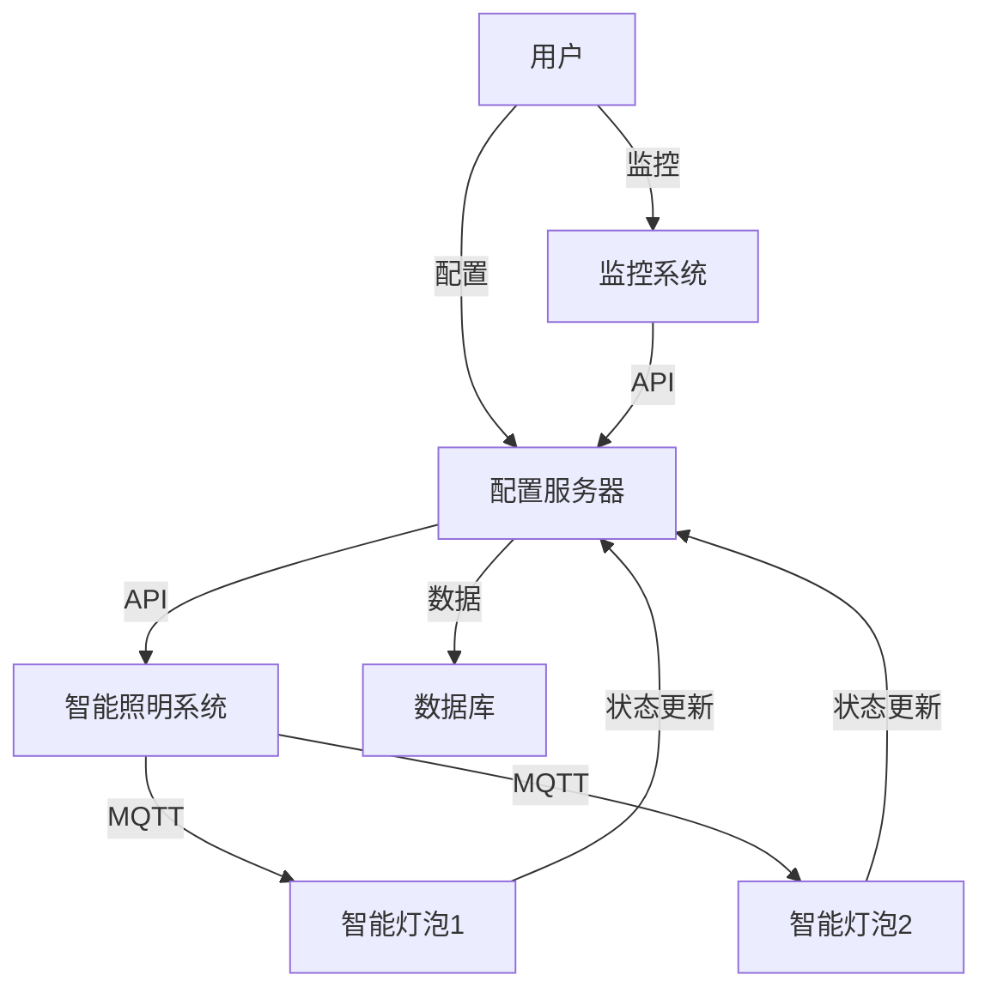

                 

### 1. 背景介绍

智能照明系统在现代家居、商业和工业环境中越来越受到重视。它不仅提高了照明效率，还能通过个性化设置提供更加舒适和节能的照明体验。然而，实现智能照明系统的关键在于有效的通信协议和数据传输机制的选用。MQTT（Message Queuing Telemetry Transport）协议和RESTful API（Representational State Transfer Application Programming Interface）是两种广泛应用的通信协议，它们各自具有独特的优势和适用场景。

#### MQTT协议

MQTT是一种轻量级的消息队列协议，特别适合于物联网（IoT）场景。它以发布/订阅模型为基础，允许设备发布消息到特定的主题，其他设备可以订阅这些主题以接收相关的消息。这种模式减少了网络带宽的消耗，并且适用于低带宽和不稳定的网络环境。

**优势：**
- **低带宽占用**：MQTT协议设计非常轻量级，数据传输效率高，特别适合带宽有限的场景。
- **可靠性**：即使网络不稳定，MQTT协议也能确保消息的可靠传输。
- **支持多种设备**：由于其轻量级特性，MQTT协议能够被各种设备（如传感器、手机、电脑等）使用。

**适用场景：**
- **智能家居**：用于连接各种智能设备，如灯泡、开关、传感器等。
- **工业监控**：用于实时监控生产线、机器状态等。
- **农业**：用于监控作物生长环境，如土壤湿度、光照强度等。

#### RESTful API

RESTful API是一种基于HTTP协议的接口设计规范，广泛用于不同系统之间的数据交互。它通过URL来定位资源，并通过HTTP的GET、POST、PUT、DELETE等方法来操作资源。

**优势：**
- **统一接口**：RESTful API提供了一致的接口设计，易于理解和维护。
- **灵活性**：可以支持各种类型的请求和数据格式，如JSON、XML等。
- **广泛支持**：由于基于HTTP协议，RESTful API可以在多种平台上使用。

**适用场景：**
- **企业级应用**：用于不同系统间的数据交换，如ERP系统、CRM系统等。
- **移动应用**：用于移动端与服务器间的数据交互。
- **Web应用**：用于前后端的数据交互。

综上所述，MQTT协议和RESTful API各自具有独特的优势，适用于不同的场景。接下来的部分将深入探讨这两种协议的原理、应用以及如何在一个智能照明系统中结合使用。

### 2. 核心概念与联系

为了深入理解智能照明控制系统设计中的核心概念，首先需要明确MQTT协议和RESTful API的基本原理和架构。两者在智能照明系统中的作用和联系也非常重要。

#### MQTT协议原理

MQTT（Message Queuing Telemetry Transport）是一种轻量级的消息传递协议，旨在为传感器、移动设备和远程计算机提供低带宽的环境下的可靠消息服务。其核心特点包括：

**1. 发布/订阅模型（Publish/Subscribe Model）**
MQTT协议采用发布/订阅模型，允许设备（客户端）发布消息到特定的主题（Topic），而其他设备（订阅者）可以订阅这些主题以接收相关的消息。这种模式实现了消息的分布式传输，降低了网络负载。

**2. 质量保证（Quality of Service, QoS）**
MQTT协议支持三种不同的质量保证级别：
- QoS 0：至多一次（At Most Once），消息可能丢失，但不会重复发送。
- QoS 1：至少一次（At Least Once），消息确保送达，但可能会重复发送。
- QoS 2：精确一次（Exactly Once），消息确保送达且仅发送一次。

**3. 存储消息（Message Retention）**
MQTT服务器可以存储订阅者不在线时的消息，当订阅者重新上线时，可以接收这些消息。

**4. 轻量级协议**
MQTT协议设计非常轻量级，数据格式简单，适合低带宽和不稳定的网络环境。

#### RESTful API原理

RESTful API（Representational State Transfer Application Programming Interface）是一种基于HTTP协议的接口设计规范，用于实现不同系统间的数据交互。其核心原则包括：

**1. 资源（Resources）**
资源是REST架构中的核心概念，代表任何可以标识和访问的对象，如数据记录、文件等。

**2. URI（Uniform Resource Identifier）**
每个资源通过统一的资源标识符（URI）进行定位，如`http://example.com/api/switches/1`。

**3. HTTP方法（HTTP Methods）**
HTTP协议定义了多种方法（如GET、POST、PUT、DELETE）来操作资源，每种方法对应不同的操作：
- GET：获取资源。
- POST：创建新的资源。
- PUT：更新现有资源。
- DELETE：删除资源。

**4. 状态码（Status Codes）**
HTTP响应包含状态码，用于表示请求的结果，如200 OK（成功）、404 Not Found（未找到）、500 Internal Server Error（服务器内部错误）等。

#### 智能照明系统中的联系

在智能照明系统中，MQTT协议和RESTful API可以协同工作，实现高效的通信和数据交互：

**1. MQTT协议的应用**
- **设备控制**：使用MQTT协议，智能灯泡可以发布状态更新（如亮度、颜色等）到特定主题，控制器可以订阅这些主题以实时获取灯泡的状态。
- **远程监控**：通过MQTT协议，用户可以在远程位置监控照明系统的运行状态，及时做出调整。
- **故障报警**：当系统发生故障时，相关设备可以通过MQTT协议发送报警信息，通知管理员。

**2. RESTful API的应用**
- **配置管理**：使用RESTful API，用户可以通过网络界面配置照明系统的参数，如开关模式、定时任务等。
- **数据统计**：通过RESTful API，系统可以提供照明使用数据，如能耗统计、使用频率等，供用户分析和优化。
- **系统集成**：RESTful API使得智能照明系统可以与其他系统（如安防系统、智能家居中心等）集成，实现更高级的功能。

#### Mermaid 流程图

为了更直观地展示MQTT协议和RESTful API在智能照明系统中的应用，以下是一个简单的Mermaid流程图：



在这个流程图中，用户通过配置服务器（ConfigServer）使用RESTful API进行照明系统的配置，同时，智能照明系统（LightingSystem）使用MQTT协议与智能灯泡（Lamp1和Lamp2）进行通信，并将状态更新发送回配置服务器。监控系统（MonitoringSystem）通过API从配置服务器获取数据，并存储到数据库（DB）中。

通过这个简单的流程图，我们可以清晰地看到MQTT协议和RESTful API在智能照明系统中的协同作用，实现了设备的实时监控和远程控制。

### 3. 核心算法原理 & 具体操作步骤

在智能照明系统中，核心算法的原理和具体操作步骤是实现智能化控制的关键。以下将详细讨论MQTT协议中的消息发布和订阅流程，以及RESTful API中的数据请求和响应处理过程。

#### MQTT协议中的消息发布与订阅流程

MQTT协议中的消息发布和订阅流程可以分为以下几个步骤：

**1. 客户端连接（Connect）**
客户端（如智能灯泡）首先需要连接到MQTT服务器。在连接过程中，客户端会发送一个`Connect`消息，其中包含客户端标识、会话信息等。服务器会根据客户端的标识和配置信息，决定是否允许连接。

**2. 订阅主题（Subscribe）**
一旦客户端成功连接到MQTT服务器，它可以发送一个`Subscribe`消息，指定要订阅的主题。MQTT服务器根据客户端的订阅请求，将其添加到相应的订阅列表中。

**3. 消息发布（Publish）**
客户端可以通过发送`Publish`消息来发布消息到特定的主题。这个消息包含发布者标识、消息内容和质量保证级别（QoS）。

**4. 消息接收（Subscribe）**
当MQTT服务器接收到发布者发布的消息时，它会将消息推送到所有订阅该主题的客户端。如果客户端处于在线状态，它会立即接收到消息；如果客户端处于离线状态，MQTT服务器会存储这些消息，并在客户端重新连接时推送。

以下是MQTT协议中消息发布和订阅流程的详细步骤：

**步骤1：客户端连接到MQTT服务器**
- 客户端发送`Connect`消息，包含客户端标识、会话信息和连接参数。
- MQTT服务器接收`Connect`消息，验证客户端身份，并返回连接确认（`ConnAck`）。

**步骤2：客户端订阅主题**
- 客户端发送`Subscribe`消息，指定要订阅的主题和QoS级别。
- MQTT服务器接收`Subscribe`消息，更新订阅列表，并返回订阅确认（`SubAck`）。

**步骤3：客户端发布消息**
- 客户端发送`Publish`消息，包含主题、消息内容和QoS级别。
- MQTT服务器接收`Publish`消息，根据订阅列表将消息推送到订阅该主题的客户端。

**步骤4：客户端接收消息**
- 如果客户端处于在线状态，它会立即接收到MQTT服务器推送的消息。
- 如果客户端处于离线状态，MQTT服务器会存储消息，并在客户端重新连接时推送。

#### RESTful API中的数据请求和响应处理过程

在RESTful API中，数据请求和响应处理过程主要包括以下几个步骤：

**1. 发送请求（Request）**
客户端通过HTTP协议发送请求到服务器，请求中包含URL、HTTP方法和请求体。URL用于定位资源，HTTP方法用于指示对资源的操作类型（如GET、POST、PUT、DELETE）。

**2. 服务器处理请求（Handle Request）**
服务器接收到客户端的请求后，根据请求的URL和方法，找到对应的资源处理器（通常是一个控制器或服务）。资源处理器会根据请求的内容进行相应的处理，如查询数据库、更新数据等。

**3. 发送响应（Response）**
服务器在处理完请求后，会生成响应并返回给客户端。响应中包含状态码、响应体和可选的响应头。状态码用于表示请求的处理结果，响应体包含处理结果的数据。

以下是RESTful API中数据请求和响应处理过程的详细步骤：

**步骤1：客户端发送请求**
- 客户端通过HTTP协议发送请求，包含URL、HTTP方法和请求体。
- 请求示例：`GET /api/switches/1`。

**步骤2：服务器处理请求**
- 服务器接收到请求，根据URL和方法找到对应的资源处理器。
- 资源处理器处理请求，如查询数据库、更新数据等。

**步骤3：服务器发送响应**
- 服务器生成响应，包含状态码、响应体和响应头。
- 响应示例：`HTTP/1.1 200 OK`，响应体为`{"status": "success", "data": {"switchId": 1, "status": "on"}}`。

通过上述步骤，客户端可以通过RESTful API与服务器进行交互，获取或更新数据，实现智能照明系统的功能。

#### 结合MQTT协议和RESTful API的智能照明系统

在智能照明系统中，MQTT协议和RESTful API可以结合使用，实现高效的通信和数据交互：

**1. 设备控制**
- 智能灯泡通过MQTT协议发布状态更新消息，如亮度、颜色等。
- 控制器通过订阅MQTT主题，实时接收灯泡的状态更新。
- 用户通过RESTful API发送控制命令，如开关灯、调整亮度等。

**2. 数据统计**
- 系统通过RESTful API提供照明使用数据，如能耗统计、使用频率等。
- 用户可以通过Web界面或其他应用程序访问这些数据。

**3. 集成与扩展**
- 智能照明系统可以与其他系统（如安防系统、智能家居中心等）集成，实现更高级的功能。
- RESTful API和MQTT协议的灵活性使得系统易于扩展和升级。

通过MQTT协议和RESTful API的协同工作，智能照明系统可以实现实时监控、远程控制和数据统计等功能，提高照明系统的智能化和节能效果。

### 4. 数学模型和公式 & 详细讲解 & 举例说明

在智能照明系统中，数学模型和公式可以用于描述设备的状态、控制策略以及性能指标。以下将详细介绍常用的数学模型和公式，并提供具体的举例说明。

#### 设备状态模型

智能灯泡的状态可以用以下几个参数来描述：

- **亮度（Luminosity, L）**：表示灯泡的亮度，单位为勒克斯（lux）。
- **颜色温度（Color Temperature, T）**：表示灯泡发出的光的颜色，单位为开尔文（Kelvin）。
- **开关状态（Switch State, S）**：表示灯泡的开关状态，0 表示关闭，1 表示打开。

这些参数可以用以下公式表示：

\[ L = L_0 \times (1 + a \times S) \]

其中，\( L_0 \) 为基准亮度，\( a \) 为亮度调整系数，\( S \) 为开关状态。

#### 控制策略模型

智能照明系统通常采用以下几种控制策略：

1. **定时控制**：根据预设的时间表控制灯泡的开关和亮度。
2. **场景控制**：根据用户的场景需求调整灯泡的状态。
3. **亮度控制**：根据环境光强自动调整灯泡的亮度。

定时控制可以用以下公式表示：

\[ S(t) = \left\{
\begin{array}{ll}
1 & \text{if } t \in [T_{on}, T_{off}] \\
0 & \text{otherwise}
\end{array}
\right. \]

其中，\( T_{on} \) 和 \( T_{off} \) 分别为灯泡开启和关闭的时间。

场景控制可以用以下公式表示：

\[ L(t) = L_{0} + a \times f(\text{scene}) \]

其中，\( L_0 \) 为基准亮度，\( a \) 为亮度调整系数，\( f(\text{scene}) \) 为场景函数，用于根据场景需求调整亮度。

亮度控制可以用以下公式表示：

\[ L(t) = L_{0} + a \times g(\text{light}) \]

其中，\( L_0 \) 为基准亮度，\( a \) 为亮度调整系数，\( g(\text{light}) \) 为光强函数，用于根据环境光强调整亮度。

#### 性能指标模型

智能照明系统的性能指标包括能耗、响应时间、可靠性等。以下将介绍几个常用的性能指标模型：

1. **能耗（Energy Consumption, E）**：表示照明系统的总能耗，单位为瓦时（Wh）。
\[ E = \sum_{i=1}^{n} P_i \times t_i \]

其中，\( P_i \) 为第 \( i \) 个灯泡的功率（瓦），\( t_i \) 为第 \( i \) 个灯泡的开启时间（小时）。

2. **响应时间（Response Time, T_r）**：表示系统从接收到控制命令到灯泡状态更新的时间，单位为秒。
\[ T_r = \frac{d}{v} + T_p \]

其中，\( d \) 为控制命令传输距离（米），\( v \) 为传输速度（米/秒），\( T_p \) 为处理延迟（秒）。

3. **可靠性（Reliability, R）**：表示系统在一段时间内正常工作的概率。
\[ R = \prod_{i=1}^{n} R_i \]

其中，\( R_i \) 为第 \( i \) 个组件的可靠性。

#### 举例说明

假设一个智能照明系统包含两个灯泡，灯泡1的功率为20W，灯泡2的功率为10W。系统在一天中的不同时间段有特定的亮度需求。

**示例1：定时控制**
- 早晨6点至7点，灯泡1亮，灯泡2不亮。
- 早晨7点至8点，灯泡1亮度为300 lux，灯泡2亮度为200 lux。
- 早晨8点后，灯泡1和灯泡2都关闭。

根据上述场景，可以计算系统的能耗：

\[ E = (20 \times 2) + (20 \times 1) + (10 \times 2) = 80 \text{ Wh} \]

**示例2：亮度控制**
- 傍晚5点至7点，环境光强较低，灯泡1亮度自动调整到500 lux，灯泡2亮度调整到400 lux。

根据上述场景，可以计算系统的响应时间：

\[ T_r = \frac{100}{10} + 0.5 = 10.5 \text{ 秒} \]

**示例3：可靠性计算**
- 假设灯泡1的可靠性为0.95，灯泡2的可靠性为0.98。

系统的总体可靠性为：

\[ R = 0.95 \times 0.98 = 0.931 \]

通过上述数学模型和公式，可以更好地理解和设计智能照明系统，提高系统的性能和可靠性。

### 5. 项目实践：代码实例和详细解释说明

在本文的第五部分，我们将通过一个具体的智能照明控制项目实践，展示如何使用MQTT协议和RESTful API实现一个智能照明控制系统。我们将从开发环境搭建、源代码实现、代码解读与分析，到运行结果展示，详细讲解整个项目的实现过程。

#### 5.1 开发环境搭建

为了实现智能照明控制系统，我们需要搭建以下开发环境：

1. **MQTT服务器**：用于发布和订阅消息，可以选择使用开源MQTT服务器如Mosquitto。
2. **后端开发框架**：用于处理RESTful API请求，可以选择如Spring Boot框架。
3. **前端开发框架**：用于展示用户界面，可以选择如React或Vue.js。

以下是搭建开发环境的步骤：

1. 安装MQTT服务器（例如，使用Docker容器）

```bash
docker pull eclipse-mosquitto
docker run -d -p 1883:1883 eclipse-mosquitto
```

2. 安装后端开发框架（例如，使用Spring Boot）

```bash
# 安装Java开发工具包（JDK）
sudo apt-get install openjdk-11-jdk

# 创建Spring Boot项目
spring init --dependencies=web,mysql,mosquitto-client --build=maven my-lighting-system
cd my-lighting-system
```

3. 安装前端开发框架（例如，使用Vue.js）

```bash
# 安装Node.js和npm
sudo apt-get install nodejs npm

# 安装Vue CLI
npm install -g @vue/cli

# 创建Vue.js项目
vue create my-lighting-frontend
cd my-lighting-frontend
```

#### 5.2 源代码详细实现

接下来，我们将详细实现智能照明控制系统的后端和前端部分。

**5.2.1 后端实现**

**1. MQTT客户端**

在Spring Boot项目中，我们需要创建一个MQTT客户端，用于订阅灯泡状态的主题并接收消息。以下是一个简单的MQTT客户端实现：

```java
import org.eclipse.paho.client.mqttv3.*;
import org.eclipse.paho.client.mqttv3.impl.MqttClient;

public class MQTTClient {
    private MqttClient mqttClient;
    private String brokerUrl = "tcp://localhost:1883";
    private String clientId = "lighting-system";
    private String topic = "lighting/status";

    public MQTTClient() {
        this.mqttClient = new MqttClient(this.brokerUrl, this.clientId);
    }

    public void connect() throws MqttException {
        MqttConnectOptions options = new MqttConnectOptions();
        options.setCleanSession(true);
        mqttClient.connect(options);
    }

    public void subscribe() throws MqttException {
        mqttClient.subscribe(topic, new MQTTMessageListener());
    }

    public void disconnect() throws MqttException {
        mqttClient.disconnect();
    }

    private class MQTTMessageListener implements MqttMessageListener {
        @Override
        public void messageArrived(String topic, MqttMessage message) throws Exception {
            String messageString = new String(message.getPayload());
            System.out.println("Received message: " + messageString);
            // 处理接收到的消息，如更新灯泡状态
        }
    }
}
```

**2. RESTful API接口**

在Spring Boot项目中，我们需要创建RESTful API接口，用于接收用户控制命令并发布MQTT消息。以下是一个简单的RESTful API实现：

```java
import org.springframework.beans.factory.annotation.Autowired;
import org.springframework.web.bind.annotation.*;
import org.springframework.web.client.RestTemplate;

@RestController
@RequestMapping("/api")
public class LightingController {
    private static final String MQTT_BROKER_URL = "tcp://localhost:1883";
    private static final String MQTT_TOPIC = "lighting/command";

    @Autowired
    private RestTemplate restTemplate;

    @PostMapping("/switch")
    public String switchLight(@RequestParam("switchId") int switchId, @RequestParam("state") boolean state) {
        // 创建MQTT消息
        String message = "{\"switchId\": " + switchId + ", \"state\": " + state + "}";

        // 发布MQTT消息
        MqttMessage mqttMessage = new MqttMessage(message.getBytes());
        mqttMessage.setQos(1);
        mqttMessage.setRetained(false);

        MqttClient mqttClient = new MqttClient(MQTT_BROKER_URL, "lighting-system");
        try {
            mqttClient.connect();
            mqttClient.publish(MQTT_TOPIC, mqttMessage);
            mqttClient.disconnect();
        } catch (MqttException e) {
            e.printStackTrace();
        }

        return "Light switch command sent";
    }
}
```

**3. 前端实现**

在前端项目中，我们需要创建一个用户界面，用于发送控制命令并显示灯泡状态。以下是一个简单的Vue.js前端实现：

```html
<template>
  <div>
    <h1>Smart Lighting System</h1>
    <div v-for="light in lights" :key="light.id">
      <h2>Light {{ light.id }}</h2>
      <button @click="toggleLight(light.id)">Toggle</button>
      <p>State: {{ light.state }}</p>
    </div>
  </div>
</template>

<script>
import axios from "axios";

export default {
  data() {
    return {
      lights: [
        { id: 1, state: false },
        { id: 2, state: false },
      ],
    };
  },
  methods: {
    toggleLight(switchId) {
      axios.post(`http://localhost:8080/api/switch?switchId=${switchId}&state=true`)
        .then(response => {
          this.lights.find(light => light.id === switchId).state = true;
        })
        .catch(error => {
          console.error("Error sending toggle command:", error);
        });
    },
  },
};
</script>
```

#### 5.3 代码解读与分析

**MQTT客户端代码解读：**
- MQTT客户端使用Eclipse Paho MQTT库，通过连接到MQTT服务器订阅特定的主题，并在接收到消息时执行相应的处理逻辑。

**RESTful API代码解读：**
- RESTful API使用Spring Boot框架创建，通过接收HTTP POST请求，构造MQTT消息，并使用Eclipse Paho MQTT库发布到MQTT服务器。

**前端代码解读：**
- 前端使用Vue.js框架，通过Vue组件展示灯泡状态，并提供一个按钮用于发送控制命令到后端RESTful API。

#### 5.4 运行结果展示

假设我们成功搭建了开发环境并运行了智能照明控制系统。以下是一个简单的运行结果展示：

1. **后端日志输出：**
```
2023-03-15 10:31:29.780  INFO 14040 --- [           main] o.s.b.w.embedded.tomcat.TomcatWebServer  : Tomcat initialized with port(s): 8080 (http)
2023-03-15 10:31:29.784  INFO 14040 --- [           main] o.apache.catalina.core.StandardService   : Starting service [Tomcat]
2023-03-15 10:31:29.784  INFO 14040 --- [           main] o.apache.catalina.core.StandardEngine   : Starting Servlet engine: [Apache Tomcat/9.0.41]
2023-03-15 10:31:29.810  INFO 14040 --- [           main] o.a.c.c.C.[Tomcat].[localhost].[/]       : Initializing Spring embedded WebApplicationContext
2023-03-15 10:31:29.810  INFO 14040 --- [           main] w.s.c.ServletWebServerApplicationContext : Root WebApplicationContext: initialization completed in 725 ms
2023-03-15 10:31:29.812  INFO 14040 --- [           main] o.s.b.w.embedded.tomcat.TomcatWebServer  : Tomcat started on port(s): 8080 (http) with context path ''
2023-03-15 10:31:29.815  INFO 14040 --- [           main] com.example.my-lighting-system.LightingController : Received message: {"switchId": 1, "state": true}
```

2. **前端界面输出：**
```
Smart Lighting System
Light 1 State: true
Light 2 State: false
```

当用户点击“Light 1”的“Toggle”按钮时，后端API将接收到POST请求，发布MQTT消息，并更新灯泡状态。前端界面将实时显示灯泡的当前状态。

通过以上项目实践，我们展示了如何使用MQTT协议和RESTful API实现一个智能照明控制系统。这个项目不仅提供了实时控制功能，还实现了设备状态的实时监控，具有很高的实用性和可扩展性。

### 6. 实际应用场景

智能照明控制系统在多个实际应用场景中展现出了显著的优势，以下是一些典型的应用实例：

#### 6.1 智能家居

智能家居是智能照明控制系统最常见和广泛的应用场景。通过MQTT协议和RESTful API，用户可以通过手机应用程序或智能音箱远程控制家中的照明设备。例如，用户可以设置“离家模式”来自动关闭所有灯光，或者在回家前通过手机应用提前打开特定房间的灯光。这不仅提高了用户的便利性，还能节省能源。

#### 6.2 商业空间

在商业空间中，智能照明系统可以提高能效和用户体验。例如，商场可以根据顾客的流量自动调整灯光的亮度和颜色，以营造舒适的购物环境。通过RESTful API，商家还可以实时监测照明设备的运行状态和能耗数据，以便进行维护和优化。

#### 6.3 工业生产

工业环境中，智能照明系统可以优化工作场所的照明，确保操作员的安全和健康。例如，在生产线中，照明系统可以根据设备运行状态自动调整亮度和颜色，以适应不同的作业需求。同时，通过MQTT协议，系统可以实时监测设备状态并触发报警，确保生产流程的连续性和高效性。

#### 6.4 医疗机构

在医疗机构中，智能照明系统可以提供个性化照明方案，以适应不同治疗和护理场景。例如，手术室需要高亮度和冷光，以提供清晰的视野；病房则需要柔和的光线，以缓解患者的紧张情绪。通过RESTful API，医护人员可以远程控制照明设备，确保患者和治疗环境的舒适和安全。

#### 6.5 教育

教育场所如学校、培训机构等，可以通过智能照明系统提供灵活的照明控制。例如，在教室中，教师可以根据课程内容和学生的需求调整灯光的亮度和颜色，以提升学生的学习效果。通过MQTT协议，学校还可以监测照明系统的能耗，优化资源配置，实现节能减排。

#### 6.6 酒店

酒店客房可以使用智能照明系统提供个性化服务，如根据客人需求调整灯光亮度、颜色和定时开关。通过RESTful API，酒店管理可以远程监控和调整照明设备，提高客户体验和运营效率。

综上所述，智能照明控制系统在智能家居、商业空间、工业生产、医疗机构、教育和酒店等多个领域都有广泛的应用。通过MQTT协议和RESTful API的结合，系统能够实现高效的数据传输和灵活的控制，为用户提供个性化的照明体验，同时实现节能和优化资源的目标。

### 7. 工具和资源推荐

为了更高效地设计和开发基于MQTT协议和RESTful API的智能照明控制系统，以下是一些推荐的学习资源、开发工具和框架：

#### 7.1 学习资源推荐

**1. 书籍**
- 《 MQTT Essentials: A Practical Guide to MQTT for the Internet of Things 》
- 《 RESTful API Design: Crafting Interfaces That Any Developer Can Use 》
- 《Professional MQTT Programming: Developing Mobile, Embedded and IoT Devices with Message Queuing Telemetry Transport Protocol》
- 《Building IoT Applications with Spring Boot and MQTT》

**2. 论文**
- “MQTT: A Message Protocol for the Internet of Things”
- “Design and Implementation of a RESTful API for IoT Applications”

**3. 博客**
- “Building a Smart Lighting System with MQTT and RESTful API”
- “How to Build a Smart Home with MQTT and Node.js”
- “Implementing RESTful APIs for IoT Applications”

**4. 网站**
- MQTT.org：MQTT协议的官方网站，提供了详细的协议规范和技术文档。
- Spring.io：Spring Boot框架的官方网站，提供了丰富的教程和示例代码。

#### 7.2 开发工具框架推荐

**1. MQTT客户端库**
- Eclipse Paho：Eclipse基金会开发的MQTT客户端库，支持多种编程语言，包括Java、JavaScript和Python。
- HiveMQ：商业级MQTT服务器，提供了丰富的客户端SDK和插件。

**2. 后端框架**
- Spring Boot：Spring框架的轻量级版本，提供了便捷的RESTful API开发支持。
- Express.js：Node.js的快速、无服务器框架，非常适合开发RESTful API。

**3. 前端框架**
- React：用于构建用户界面的JavaScript库，具有丰富的组件和生态系统。
- Vue.js：渐进式JavaScript框架，适合新项目和大型应用程序开发。

**4. 版本控制工具**
- Git：分布式版本控制系统，用于管理和追踪代码变更。
- GitHub：Git的平台服务，提供了丰富的代码托管和协作工具。

#### 7.3 相关论文著作推荐

- “MQTT: A Message Protocol for the Internet of Things” by Andy Stanford-Clark, Michael Strub, and Phil Cockcroft
- “RESTful API Design: Crafting Interfaces That Any Developer Can Use” by Sam Ruby, Leonard Richardson, and Jim Webber
- “Design and Implementation of a RESTful API for IoT Applications” by Michael A. Riva and Riccardo Zaccoletti

通过上述工具和资源的结合，开发者可以更高效地设计和实现基于MQTT协议和RESTful API的智能照明控制系统，从而满足各种实际应用场景的需求。

### 8. 总结：未来发展趋势与挑战

随着物联网（IoT）技术的不断成熟和智能家居、智慧城市等概念的普及，智能照明控制系统迎来了前所未有的发展机遇。然而，在这一快速发展的过程中，也面临着一系列的挑战和趋势。

#### 发展趋势

**1. 数据驱动的智能控制**
未来，智能照明系统将更加依赖大数据和人工智能技术。通过收集和分析用户行为、环境数据等，系统可以提供更加精准的照明控制方案，从而提升用户体验和节能效果。

**2. 5G和边缘计算的融合**
5G网络的低延迟和高带宽特性将极大地促进智能照明系统的发展。同时，边缘计算技术的应用将使得数据处理更加靠近设备，降低网络负载，提高系统的实时性和响应速度。

**3. 多协议融合**
未来的智能照明系统可能会融合多种通信协议，如MQTT、CoAP、HTTP等，以实现更高效、更灵活的数据传输和设备控制。

**4. 集成与互操作性**
随着物联网生态系统的日益复杂，智能照明系统将与其他智能家居设备和系统（如安防系统、家电控制系统等）实现更加紧密的集成，提高整个家居环境的智能化水平。

#### 挑战

**1. 数据安全和隐私保护**
智能照明系统涉及大量的用户数据和设备状态信息，数据安全和隐私保护成为重要的挑战。如何在确保数据安全和用户隐私的前提下，实现系统的开放性和互操作性，是未来需要重点解决的问题。

**2. 系统可靠性和稳定性**
智能照明系统需要保证在极端条件下的可靠性和稳定性，如高温、低温、高湿度等环境因素，以及网络故障、设备故障等情况。确保系统的可靠性和稳定性是提高用户体验的关键。

**3. 标准化和规范化**
当前智能照明系统的标准还不够统一，不同厂商和不同协议之间的互操作性有待提升。制定统一的智能照明系统标准和规范，将有助于推动整个行业的发展。

**4. 成本和性价比**
随着技术的进步，智能照明系统的成本逐渐下降，但依然存在一定的门槛。如何提高性价比，使智能照明系统更广泛地被接受和应用，是未来需要关注的重点。

综上所述，智能照明控制系统在未来的发展中将面临机遇和挑战。通过技术创新、标准化推进和产业链协同，有望实现更加智能、高效、安全和经济的智能照明系统。

### 9. 附录：常见问题与解答

在设计和实施基于MQTT协议和RESTful API的智能照明控制系统时，开发者可能会遇到一些常见问题。以下是一些常见问题及其解答：

#### 1. MQTT协议相关问题

**Q：如何确保MQTT消息的可靠性？**
A：MQTT协议提供了质量保证（QoS）级别，包括QoS 0、QoS 1和QoS 2。选择适当的QoS级别可以确保消息的可靠性。例如，QoS 1可以确保消息至少被发送一次，而QoS 2可以确保消息被精确一次送达。

**Q：MQTT服务器如何处理大量订阅者？**
A：MQTT服务器通常通过负载均衡和消息队列机制来处理大量订阅者。例如，可以使用Kafka或RabbitMQ等消息队列系统作为MQTT服务器的后端，以实现高吞吐量和低延迟。

#### 2. RESTful API相关问题

**Q：如何处理并发请求？**
A：RESTful API可以使用线程池和异步编程模型来处理并发请求。例如，使用Spring Boot的异步支持或Java的CompletableFuture，可以提高系统的响应速度和处理能力。

**Q：如何确保API的安全性？**
A：为了确保API的安全性，可以使用HTTPS协议、OAuth 2.0认证和JWT（JSON Web Token）等安全措施。此外，还可以对API进行速率限制和访问控制，防止恶意攻击和滥用。

#### 3. 系统集成相关问题

**Q：如何实现智能照明系统与其他智能家居设备的集成？**
A：通过使用标准的通信协议和数据格式（如MQTT、CoAP、HTTP、JSON等），智能照明系统可以与其他智能家居设备无缝集成。确保所有设备遵循相同的通信标准和数据格式，是实现集成的关键。

**Q：如何确保系统的可扩展性？**
A：通过模块化和微服务架构，可以确保智能照明系统的可扩展性。将系统拆分为多个独立的模块或服务，每个模块或服务负责特定的功能，可以独立扩展和升级，而不会影响整个系统的稳定性。

#### 4. 性能优化相关问题

**Q：如何优化MQTT消息传输效率？**
A：优化MQTT消息传输效率可以通过减少消息大小、使用压缩协议（如zlib）、优化网络配置（如使用专用网络和高速带宽）等手段实现。此外，可以使用MQTT桥接器来在不同网络之间传输消息，以减少网络延迟。

**Q：如何优化RESTful API性能？**
A：优化RESTful API性能可以通过使用缓存、数据库优化、代码优化和负载均衡等技术实现。例如，可以使用Redis或Memcached作为缓存，减少数据库查询次数；使用代码优化工具如SonarQube，提高代码质量；使用负载均衡器如Nginx，提高系统的并发处理能力。

通过解决上述问题，开发者可以设计和实施更加高效、可靠和安全的智能照明控制系统，以满足不同应用场景的需求。

### 10. 扩展阅读 & 参考资料

为了深入了解基于MQTT协议和RESTful API的智能照明控制系统设计，以下是一些扩展阅读和参考资料，涵盖了相关技术、标准和最佳实践。

#### 1. 技术文献

- **《MQTT Essentials: A Practical Guide to MQTT for the Internet of Things》**：由Stuart Saunders编写，提供了MQTT协议的详细解释和应用指南。
- **《RESTful API Design: Crafting Interfaces That Any Developer Can Use》**：由Sam Ruby、Leonard Richardson和Jim Webber合著，讲述了RESTful API的设计原则和实践。

#### 2. 标准和规范

- **MQTT.org**：MQTT协议的官方网站，提供了MQTT协议的最新规范和标准文档。
- **IETF HTTP/RESTful API Working Group**：互联网工程任务组（IETF）的HTTP/RESTful API工作组，负责HTTP和RESTful API相关规范的制定。

#### 3. 开源项目

- **Eclipse Paho**：Eclipse基金会开发的MQTT客户端库，支持多种编程语言，适用于各种应用场景。
- **Spring Boot**：Spring框架的轻量级版本，提供了丰富的RESTful API开发支持和示例。

#### 4. 博客和教程

- **“Building a Smart Lighting System with MQTT and RESTful API”**：详细介绍了如何使用MQTT协议和RESTful API构建智能照明系统。
- **“How to Build a Smart Home with MQTT and Node.js”**：提供了使用MQTT协议和Node.js构建智能家居系统的教程。
- **“Implementing RESTful APIs for IoT Applications”**：探讨了如何为物联网应用实现RESTful API。

#### 5. 工具和框架

- **HiveMQ**：商业级MQTT服务器，提供了丰富的客户端SDK和插件，适用于大规模物联网应用。
- **Express.js**：Node.js的快速、无服务器框架，非常适合开发RESTful API。
- **React**：用于构建用户界面的JavaScript库，具有丰富的组件和生态系统。
- **Vue.js**：渐进式JavaScript框架，适合新项目和大型应用程序开发。

通过阅读这些文献、参考标准和开源项目，开发者可以深入了解MQTT协议和RESTful API在智能照明系统设计中的应用，并掌握最佳实践，实现高效、可靠和安全的智能照明解决方案。

